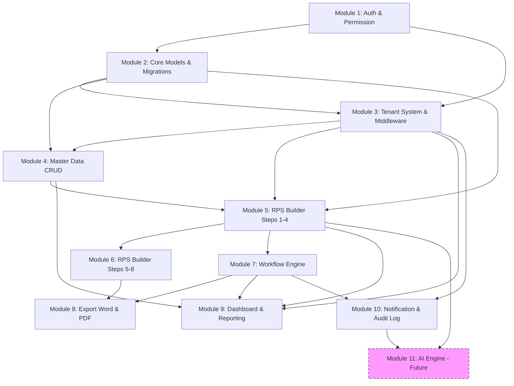

# RPS OBE — Rencana Implementasi (Implementation Plan)

**Versi**: 1.0
**Tanggal**: Agustus 2026
**Target Rilis**: ~13 minggu (3 bulan)

---

## Daftar Isi

1. [Overview](#overview)
2. [Diagram Dependensi Modul](#diagram-dependensi-modul)
3. [Rincian per Modul](#rincian-per-modul)
4. [Peluang Pekerjaan Paralel](#peluang-pekerjaan-paralel)
5. [Ringkasan Risiko](#ringkasan-risiko)

---

## Overview

Platform RPS OBE dibangun dalam **10 modul** yang disusun berdasarkan urutan dependensi. Setiap modul memiliki dependensi ke modul sebelumnya. Tidak ada modul yang dapat dimulai sebelum dependensinya selesai (hard dependency). Modul 11 (AI Engine) direncanakan untuk fase selanjutnya.

| # | Modul | Estimasi | Minggu |
|---|-------|----------|--------|
| 1 | Authentication & Authorization | 2 minggu | 1 - 2 |
| 2 | Core Models & Migrations | 2 minggu | 2 - 3 |
| 3 | Tenant System & Middleware | 1 minggu | 3 |
| 4 | Master Data CRUD (Livewire) | 2 minggu | 3 - 5 |
| 5 | RPS Builder — Models & Steps 1-4 | 2 minggu | 4 - 6 |
| 6 | RPS Builder — Steps 5-8 | 2 minggu | 6 - 8 |
| 7 | Workflow Engine | 2 minggu | 7 - 9 |
| 8 | Export Word & PDF | 2 minggu | 8 - 10 |
| 9 | Dashboard & Reporting | 2 minggu | 9 - 11 |
| 10 | Notification & Audit Log | 1 minggu | 10 - 11 |
| *11* | *AI Engine (Future)* | *3 minggu* | *11 - 13* |

**Total**: ~13 minggu untuk 10 modul (+ 2 minggu buffer untuk testing dan QA).

---

## Diagram Dependensi Modul



---

## Rincian per Modul

---

### Module 1: Authentication & Authorization

| Properti | Nilai |
|----------|-------|
| **Estimasi** | 2 minggu (Minggu 1-2) |
| **Dependensi** | Tidak ada (modul awal) |
| **Prompt** | `.opencode/prompts/01-scaffold-auth.md` |

**Key Files**:
- `app/Models/User.php`
- `app/Models/Tenant.php`
- `app/Livewire/Auth/Login.php`
- `app/Livewire/Auth/Register.php`
- `app/Livewire/Auth/ForgotPassword.php`
- `app/Livewire/Auth/ResetPassword.php`
- `app/Livewire/Auth/VerifyEmail.php`
- `app/Livewire/Dashboard/AdminDashboard.php`
- `app/Livewire/Dashboard/DosenDashboard.php`
- `app/Livewire/Dashboard/ReviewerDashboard.php`
- `app/Http/Middleware/RedirectByRole.php`
- `app/Http/Middleware/SessionTimeout.php`
- `app/Enums/RoleEnum.php`
- `database/seeders/RoleSeeder.php`
- `database/seeders/PermissionSeeder.php`
- `resources/views/layouts/auth.blade.php`
- `resources/views/layouts/app.blade.php`
- `routes/web.php`

**Key Models**: User, Tenant

**Key Components**:
- Login wizard
- Register multi-step (tenant + admin)
- Forgot/Reset password flow
- Dashboard redirect by role
- Sidebar menu by permission (`@can`)
- Session timeout (30 menit)

**Acceptance Criteria**:
1. Login, register, forgot password, reset password, email verifikasi — semua fully functional.
2. Role-based dashboard redirect bekerja untuk SuperAdmin, Admin, Dosen, Reviewer.
3. Role dan permission seeder menghasilkan semua permission di database.
4. Sidebar menu menampilkan item sesuai role user.
5. Session timeout logout otomatis setelah 30 menit inactivity.
6. Semua form error ditampilkan dalam Bahasa Indonesia.
7. UI menggunakan Tabler dan mobile-responsive.

**Risiko**:
- ⚠️ **Tinggi**: Spatie Permission konfigurasi guard/default role — pastikan guard name konsisten (`web`).
- ⚠️ **Sedang**: Email verifikasi di local environment — siapkan Mailpit/MailHog atau gunakan log driver.

**Parallel Work**: Tidak ada — ini modul pertama.

---

### Module 2: Core Models & Migrations

| Properti | Nilai |
|----------|-------|
| **Estimasi** | 2 minggu (Minggu 2-3) |
| **Dependensi** | Module 1 (User, Tenant model sudah ada) |
| **Prompt** | `.opencode/prompts/02-master-data-models.md` |

**Key Files**:
- `app/Models/Tenant.php` (update)
- `app/Models/Fakultas.php`
- `app/Models/ProgramStudi.php`
- `app/Models/Kurikulum.php`
- `app/Models/Semester.php`
- `app/Models/MataKuliah.php`
- `app/Models/Dosen.php`
- `app/Models/ProfilLulusan.php`
- `app/Models/CPL.php`
- `app/Models/Referensi.php`
- `app/Models/User.php` (update relasi)
- `app/Enums/CPKategori.php`
- `app/Enums/Jenjang.php`
- `app/Enums/SemesterTipe.php`
- `app/Enums/RPSStatus.php`
- `database/migrations/*_create_fakultas_table.php`
- `database/migrations/*_create_program_studi_table.php`
- `database/migrations/*_create_kurikulum_table.php`
- `database/migrations/*_create_mata_kuliah_table.php`
- `database/migrations/*_create_dosen_table.php`
- `database/migrations/*_create_profil_lulusan_table.php`
- `database/migrations/*_create_cpl_table.php`
- `database/migrations/*_create_referensi_table.php`
- `database/migrations/*_create_pivot_tables.php`
- `database/factories/*Factory.php` (semua model)
- `database/seeders/MasterDataSeeder.php`

**Key Models**: Tenant, Fakultas, ProgramStudi, Kurikulum, MataKuliah, Dosen, ProfilLulusan, CPL, Referensi

**Acceptance Criteria**:
1. `php artisan migrate` berhasil — semua tabel, FK, dan indeks terbentuk.
2. `php artisan migrate:rollback` berhasil — semua tabel terhapus tanpa error.
3. Semua relasi Eloquent berfungsi (bisa akses `$model->relation`).
4. Soft delete berfungsi di semua model.
5. Composite unique constraints berfungsi.
6. Semua factory menghasilkan data dummy valid.
7. `php artisan db:seed MasterDataSeeder` berhasil.

**Risiko**:
- ⚠️ **Sedang**: Urutan migrasi — pastikan tabel parent dibuat sebelum child.
- ⚠️ **Rendah**: Enum kolom kompatibilitas dengan MariaDB — pastikan versi 10.11 mendukung.

**Parallel Work**: Module 3 (Tenant Middleware) dapat dimulai setelah model Tenant selesai (mid-Module 2).

---

### Module 3: Tenant System & Middleware

| Properti | Nilai |
|----------|-------|
| **Estimasi** | 1 minggu (Minggu 3) |
| **Dependensi** | Module 1, Module 2 (Tenant model & migrasi) |

**Key Files**:
- `app/Http/Middleware/EnsureTenantContext.php`
- `app/Http/Middleware/SetTenantScope.php`
- `app/Scopes/TenantScope.php`
- `app/Traits/HasTenantScope.php`
- `app/Contracts/HasTenant.php`
- `app/Services/TenantService.php`
- `app/Http/Kernel.php` (register middleware)
- `routes/tenant.php` (jika menggunakan domain/subdomain routing)
- `config/tenancy.php`

**Key Components**:
- Global scope `TenantScope` untuk auto-filter query per tenant.
- Middleware `EnsureTenantContext` untuk deteksi tenant dari domain/subdomain/user session.
- Trait `HasTenantScope` untuk model-model tenant-scoped.
- `TenantService` untuk resolusi tenant aktif.

**Acceptance Criteria**:
1. Semua query Eloquent otomatis ter-filter oleh `tenant_id` tanpa perlu menulis `->where('tenant_id', ...)` manual.
2. User tidak dapat melihat atau memodifikasi data tenant lain.
3. Middleware berfungsi di semua route yang terproteksi.
4. Tenant ter-resolve dari session user (user memiliki `tenant_id`).
5. Logout menghapus konteks tenant dari session.

**Risiko**:
- ⚠️ **Tinggi**: Global scope dapat menyebabkan bug pada query join/raw — test menyeluruh diperlukan.
- ⚠️ **Sedang**: Jika ada kebutuhan multi-domain per tenant, perlu konfigurasi tambahan.

**Parallel Work**: Module 4 dapat dimulai setelah TenantScope siap (mid-Module 3).

---

### Module 4: Master Data CRUD (Livewire)

| Properti | Nilai |
|----------|-------|
| **Estimasi** | 2 minggu (Minggu 3-5) |
| **Dependensi** | Module 1, Module 2, Module 3 |

**Key Files**:
- `app/Livewire/MasterData/Fakultas/FakultasList.php`
- `app/Livewire/MasterData/Fakultas/FakultasForm.php`
- `app/Livewire/MasterData/ProgramStudi/ProdiList.php`
- `app/Livewire/MasterData/ProgramStudi/ProdiForm.php`
- `app/Livewire/MasterData/Kurikulum/KurikulumList.php`
- `app/Livewire/MasterData/Kurikulum/KurikulumForm.php`
- `app/Livewire/MasterData/MataKuliah/MkList.php`
- `app/Livewire/MasterData/MataKuliah/MkForm.php`
- `app/Livewire/MasterData/Dosen/DosenList.php`
- `app/Livewire/MasterData/Dosen/DosenForm.php`
- `app/Livewire/MasterData/ProfilLulusan/PlList.php`
- `app/Livewire/MasterData/ProfilLulusan/PlForm.php`
- `app/Livewire/MasterData/CPL/CplList.php`
- `app/Livewire/MasterData/CPL/CplForm.php`
- `app/Livewire/MasterData/Referensi/RefList.php`
- `app/Livewire/MasterData/Referensi/RefForm.php`
- `app/Http/Requests/*Request.php` (Form Request untuk setiap model)
- `app/Services/*Service.php` (Service untuk setiap model)
- `resources/views/livewire/master-data/**/*.blade.php`

**Key Components**:
- Tabel data dengan pagination, sorting, search, bulk actions, soft delete, restore.
- Modal form create/edit dengan validasi form request.
- Toast notification untuk operasi CRUD.
- Konfirmasi dialog sebelum delete.
- Export Excel/CSV dari tabel (opsional, bisa di Module 8).

**Acceptance Criteria**:
1. CRUD lengkap (Create, Read, Update, Delete, Restore) untuk semua entitas master data.
2. Tabel menggunakan pagination, sorting by kolom, dan search global.
3. Form validasi dijalankan via Form Request dan menampilkan error di field yang sesuai.
4. Operasi CRUD menampilkan toast notification (sukses/gagal).
5. Soft delete dan restore berfungsi di semua entitas.
6. Setiap entitas hanya menampilkan data untuk tenant aktif.
7. Permission check dengan `@can` dan `$this->authorize()`.
8. UI konsisten menggunakan komponen Tabler.

**Risiko**:
- ⚠️ **Sedang**: Volume komponen CRUD yang besar — pertimbangkan generator atau trait reusable untuk list/form pattern.
- ⚠️ **Rendah**: Performa query untuk tabel besar — pastikan ada indeks yang cukup.

**Parallel Work**: Module 5 dapat dimulai setelah model MataKuliah, CPL, ProfilLulusan selesai (pertengahan Module 4).

---

### Module 5: RPS Builder — Models & Steps 1-4

| Properti | Nilai |
|----------|-------|
| **Estimasi** | 2 minggu (Minggu 4-6) |
| **Dependensi** | Module 2 (models), Module 3 (tenant scope), Module 4 (master data terisi) |

**Key Files**:
- `app/Models/RPS.php`
- `app/Models/RpsCpl.php`
- `app/Models/RpsMinggu.php`
- `app/Models/RpsReferensi.php`
- `app/Models/RpsDosen.php`
- `database/migrations/*_create_rps_tables.php`
- `app/Livewire/RpsBuilder/Wizard.php` (komponen utama wizard)
- `app/Livewire/RpsBuilder/Step1Identitas.php`
- `app/Livewire/RpsBuilder/Step2CPL.php`
- `app/Livewire/RpsBuilder/Step3Cpmk.php`
- `app/Livewire/RpsBuilder/Step4Pemetaan.php`
- `app/Services/RpsService.php`
- `app/Actions/Rps/SaveRpsAction.php`
- `app/DTO/RpsDto.php`
- `resources/views/livewire/rps-builder/wizard.blade.php`
- `resources/views/livewire/rps-builder/steps/*.blade.php`

**Key Models**:
- **RPS**: Header RPS — `tenant_id`, `mata_kuliah_id`, `kurikulum_id`, `semester`, `dosen_pengampu_ids` (JSON), `status` (RPSStatus enum), `capaian_mata_kuliah`, `deskripsi`, `metode_pembelajaran`, `media_pembelajaran`, `assessment_methods`.
- **RpsCpl**: Many-to-many RPS ↔ CPL dengan presentase kontribusi.
- **RpsCpmk**: Capaian Pembelajaran Mata Kuliah — sub dari CPL.
- **RpsMinggu**: Rencana mingguan (1-16) — `minggu_ke`, `sub_cpmk`, `materi_pembelajaran`, `bentuk_pembelajaran`, `pengalaman_belajar`, `kriteria_penilaian`, `bobot`.
- **RpsReferensi**: Many-to-many RPS ↔ Referensi.

**4 Steps dalam Modul Ini**:
1. **Step 1 — Identitas Mata Kuliah**: Pilih prodi, kurikulum, mata kuliah, semester, dosen pengampu, deskripsi MK.
2. **Step 2 — CPL Prodi**: Pilih CPL dari prodi/kurikulum yang relevan dengan MK ini, atur presentase kontribusi.
3. **Step 3 — CPMK**: Definisikan Capaian Pembelajaran Mata Kuliah, petakan ke CPL, tentukan Sub-CPMK.
4. **Step 4 — Pemetaan CPMK→CPL**: Matriks pemetaan CPMK ke CPL (tabel silang).

**Acceptance Criteria**:
1. Wizard multi-step berfungsi — navigasi antar step, progress bar, data tersimpan per step.
2. Data tersimpan ke session/database sementara setiap pergantian step (auto-save).
3. Step 1 menampilkan dropdown berantai: Prodi → Kurikulum → Mata Kuliah → Dosen.
4. Step 2 menampilkan list CPL dari kurikulum terpilih, bisa pilih/centang dengan slider presentase.
5. Step 3 form dinamis untuk menambah CPMK dan Sub-CPMK.
6. Step 4 menampilkan matriks pemetaan CPMK vs CPL yang interaktif.
7. RPS disimpan dengan status `Draft`.

**Risiko**:
- ⚠️ **Tinggi**: Kompleksitas wizard multi-step — state management antar step harus solid; auto-save harus robust.
- ⚠️ **Sedang**: Performa — dropdown berantai dengan banyak data membutuhkan wire:model.live yang optimal dan caching.
- ⚠️ **Rendah**: UI untuk matriks pemetaan — perlu interaksi klik yang baik (checkbox grid).

**Parallel Work**: Module 7 (Workflow Engine) dapat dimulai secara konseptual dan kontrak interface setelah model RPS selesai.

---

### Module 6: RPS Builder — Steps 5-8

| Properti | Nilai |
|----------|-------|
| **Estimasi** | 2 minggu (Minggu 6-8) |
| **Dependensi** | Module 5 |

**Key Files**:
- `app/Livewire/RpsBuilder/Step5RencanaMingguan.php`
- `app/Livewire/RpsBuilder/Step6Referensi.php`
- `app/Livewire/RpsBuilder/Step7Review.php`
- `app/Livewire/RpsBuilder/Step8Finalisasi.php`
- `app/Actions/Rps/CalculateBobotAction.php`
- `resources/views/livewire/rps-builder/steps/step5*.blade.php`
- `resources/views/livewire/rps-builder/steps/step6*.blade.php`
- `resources/views/livewire/rps-builder/steps/step7*.blade.php`
- `resources/views/livewire/rps-builder/steps/step8*.blade.php`

**4 Steps dalam Modul Ini**:
5. **Step 5 — Rencana Pembelajaran Mingguan**: Tabel 16 minggu, isi per minggu: Sub-CPMK, materi, bentuk pembelajaran, pengalaman belajar, kriteria penilaian, bobot (%).
6. **Step 6 — Referensi**: Pilih referensi dari master data atau tambah baru; atur referensi utama dan pendukung.
7. **Step 7 — Review & Validasi**: Tampilkan seluruh RPS dalam format preview; validasi: bobot total = 100%, semua minggu terisi, CPL ter-cover.
8. **Step 8 — Finalisasi & Submit**: Konfirmasi final, ubah status Draft menjadi `Review` (trigger workflow).

**Acceptance Criteria**:
1. Step 5: Tabel 16 baris (minggu 1-16) dengan form inline per minggu; total bobot otomatis dihitung.
2. Step 6: Pencarian referensi dari database + tombol "Tambah Referensi Baru" dengan modal form.
3. Step 7: Preview RPS lengkap dalam format menyerupai dokumen final; validasi otomatis menandai data yang kurang.
4. Step 8: Tombol "Submit untuk Review" mengubah status RPS dan memicu workflow engine (Module 7).
5. Data RPS tidak bisa di-edit setelah submit kecuali di-reject oleh reviewer (Workflow Engine).
6. Semua step menyimpan progres secara atomik (transaction).

**Risiko**:
- ⚠️ **Tinggi**: Tabel 16 minggu dalam satu Livewire component — pertimbangkan lazy loading atau komponen terpisah per minggu untuk performa.
- ⚠️ **Tinggi**: Validasi otomatis di Step 7 — harus akurat dan informatif; tidak boleh ada false positive/negative.
- ⚠️ **Sedang**: Preview RPS — harus menyerupai output final PHPWord/PDF untuk mengurangi rework di Module 8.

**Parallel Work**: Module 7 (Workflow Engine) dapat dimulai bersamaan; Module 8 (Export) dapat dimulai setelah format preview final di-step 7 disetujui.

---

### Module 7: Workflow Engine

| Properti | Nilai |
|----------|-------|
| **Estimasi** | 2 minggu (Minggu 7-9) |
| **Dependensi** | Module 1 (roles), Module 2 (models), Module 5 (RPS model) |

**Key Files**:
- `app/Models/WorkflowTransition.php`
- `app/Models/RpsApproval.php`
- `database/migrations/*_create_workflow_tables.php`
- `app/Services/WorkflowService.php`
- `app/Actions/Workflow/SubmitRpsAction.php`
- `app/Actions/Workflow/ReviewRpsAction.php`
- `app/Actions/Workflow/ApproveRpsAction.php`
- `app/Actions/Workflow/RejectRpsAction.php`
- `app/Actions/Workflow/PublishRpsAction.php`
- `app/Actions/Workflow/ArchiveRpsAction.php`
- `app/Enums/WorkflowAction.php`
- `app/Livewire/Workflow/ReviewList.php`
- `app/Livewire/Workflow/ReviewForm.php`
- `app/Livewire/Workflow/ApprovalHistory.php`
- `resources/views/livewire/workflow/*.blade.php`
- `app/Notifications/RpsSubmitted.php`
- `app/Notifications/RpsReviewed.php`
- `app/Notifications/RpsApproved.php`
- `app/Notifications/RpsRejected.php`

**State Machine**:
```
Draft → Submit → Review → (Approve | Reject)
Review ← Reject (perbaikan)
Review → Approve → Published
Published → Archived
Draft → Archived (langsung)
```

**Key Components**:
- **ReviewList**: Daftar RPS yang menunggu review (untuk Reviewer).
- **ReviewForm**: Form review dengan catatan, opsi Approve atau Reject.
- **ApprovalHistory**: Timeline persetujuan dengan timestamp dan user.
- Setiap transisi mencatat: `rps_id`, `from_status`, `to_status`, `user_id`, `catatan`, `created_at`.

**Acceptance Criteria**:
1. RPS dapat di-submit dari Draft ke Review (oleh Dosen).
2. Reviewer dapat melihat daftar RPS yang menunggu review.
3. Reviewer dapat Approve atau Reject RPS dengan catatan wajib jika Reject.
4. RPS yang di-reject kembali ke Draft dan Dosen dapat memperbaiki dan re-submit.
5. RPS yang di-approved lanjut ke Published.
6. Admin dapat meng-archive RPS yang published.
7. Semua transisi tercatat di tabel approval history.
8. Email notifikasi terkirim ke Dosen saat RPS di-review/di-approved/di-reject.

**Risiko**:
- ⚠️ **Tinggi**: State machine yang salah implementasi dapat menyebabkan data inconsistency — gunakan database transaction untuk setiap transisi.
- ⚠️ **Sedang**: Email notifikasi di local environment — pastikan Mailpit/Hog berjalan.
- ⚠️ **Sedang**: Multiple reviewer — tentukan apakah RPS hanya butuh 1 reviewer atau multiple.

**Parallel Work**: Module 8 (Export) dapat dimulai setelah format RPS final di Module 6 disetujui; Module 10 (Notification) beririsan.

---

### Module 8: Export Word & PDF

| Properti | Nilai |
|----------|-------|
| **Estimasi** | 2 minggu (Minggu 8-10) |
| **Dependensi** | Module 5, Module 6, Module 7 (RPS harus published) |

**Key Files**:
- `app/Services/ExportService.php`
- `app/Services/PdfExportService.php`
- `app/Services/WordExportService.php`
- `app/Actions/Export/GenerateRpsWordAction.php`
- `app/Actions/Export/GenerateRpsPdfAction.php`
- `app/Actions/Export/BatchExportAction.php`
- `app/Livewire/Export/ExportDialog.php`
- `resources/views/livewire/export/export-dialog.blade.php`
- `resources/views/templates/rps-template.docx` (template Word)
- `resources/views/pdf/rps.blade.php` (template PDF)
- `routes/web.php` (route download)

**Format Ekspor**:
- **Word (.docx)**: PHPWord, menggunakan template dokumen dengan placeholder. Output sesuai format standar RPS Kemendikbud/LLDIKTI.
- **PDF**: DomPDF, generate dari Blade view ke PDF. Cocok untuk preview dan sharing.
- **Batch**: Ekspor seluruh RPS dalam satu kurikulum/prodi sekaligus sebagai ZIP.

**Acceptance Criteria**:
1. RPS yang berstatus `Published` dapat di-ekspor ke format .docx sesuai template standar.
2. RPS yang berstatus `Published` dapat di-ekspor ke format .pdf dengan layout A4.
3. Dokumen hasil ekspor berisi: header institusi, identitas MK, CPL, CPMK, matriks pemetaan, rencana mingguan, referensi, tanda tangan.
4. Link download muncul setelah proses generate selesai (dengan loading indicator).
5. Batch export menghasilkan file ZIP berisi semua RPS dalam kurikulum/prodi yang dipilih.
6. File ekspor dinamai: `RPS-{kode_mk}-{kurikulum}-{tanggal}.docx/pdf`.

**Risiko**:
- ⚠️ **Tinggi**: Template Word — PHPWord memiliki keterbatasan styling kompleks; perlu iterasi template.
- ⚠️ **Sedang**: Performa batch export — pertimbangkan queue/job untuk ekspor > 10 RPS.
- ⚠️ **Sedang**: Font dan encoding — pastikan karakter UTF-8 (Bahasa Indonesia) muncul dengan benar.
- ⚠️ **Rendah**: Ukuran file ZIP — optimalkan gambar/logo.

**Parallel Work**: Module 9 (Dashboard) dan Module 10 (Notification) dapat dikerjakan bersamaan.

---

### Module 9: Dashboard & Reporting

| Properti | Nilai |
|----------|-------|
| **Estimasi** | 2 minggu (Minggu 9-11) |
| **Dependensi** | Module 3 (tenant context), Module 4 (master data terisi), Module 5 (RPS data), Module 7 (workflow data) |

**Key Files**:
- `app/Livewire/Dashboard/AdminDashboard.php` (update)
- `app/Livewire/Dashboard/DosenDashboard.php` (update)
- `app/Livewire/Dashboard/ReviewerDashboard.php` (update)
- `app/Livewire/Dashboard/Widgets/StatCard.php`
- `app/Livewire/Dashboard/Widgets/RpsChart.php`
- `app/Livewire/Dashboard/Widgets/WorkflowChart.php`
- `app/Livewire/Dashboard/Widgets/RecentActivity.php`
- `app/Livewire/Reports/RpsReport.php`
- `app/Livewire/Reports/ProdiReport.php`
- `app/Services/DashboardService.php`
- `app/Services/ReportService.php`
- `resources/views/livewire/dashboard/**/*.blade.php`
- `resources/views/livewire/reports/*.blade.php`

**Dashboard per Role**:
- **Admin**: Total RPS, distribusi status RPS (chart), RPS per prodi, RPS per kurikulum, user aktif, aktivitas terbaru.
- **Dosen**: RPS yang dibuat, status RPS (draft/review/published), deadline review, notifikasi workflow.
- **Reviewer**: RPS menunggu review, riwayat review, statistik approval rate.

**Report**:
- Laporan RPS per Prodi / Kurikulum / Semester.
- Laporan CPL coverage analysis — distribusi CPL dalam RPS.
- Filter by tenant, prodi, kurikulum, semester, status.
- Export laporan ke Excel (opsional).

**Acceptance Criteria**:
1. Dashboard menampilkan statistik real-time yang relevan per role.
2. Chart interaktif (Chart.js / Alpine.js) — klik segment untuk filter/drill-down.
3. Laporan dapat difilter dan hasilnya ditampilkan di tabel.
4. Statistik hanya menampilkan data tenant aktif.
5. Card statistik menampilkan angka dengan animasi count-up.
6. Aktivitas terbaru menampilkan 10 aktivitas terakhir di tenant.

**Risiko**:
- ⚠️ **Sedang**: Performa query agregasi — gunakan caching (Redis/Laravel cache) untuk dashboard, refresh setiap 5 menit.
- ⚠️ **Rendah**: Chart rendering di Livewire — perlu Alpine.js untuk interaktivitas chart.

**Parallel Work**: Dapat dikerjakan bersamaan dengan Module 8 dan Module 10.

---

### Module 10: Notification & Audit Log

| Properti | Nilai |
|----------|-------|
| **Estimasi** | 1 minggu (Minggu 10-11) |
| **Dependensi** | Module 3 (tenant), Module 7 (workflow events) |

**Key Files**:
- `app/Models/Notification.php`
- `app/Models/AuditLog.php`
- `database/migrations/*_create_notifications_table.php`
- `database/migrations/*_create_audit_logs_table.php`
- `app/Notifications/RpsStatusChanged.php`
- `app/Services/NotificationService.php`
- `app/Services/AuditLogService.php`
- `app/Livewire/Notifications/NotificationBell.php`
- `app/Livewire/Notifications/NotificationList.php`
- `app/Livewire/AuditLog/AuditLogList.php`
- `app/Listeners/LogWorkflowTransition.php`
- `app/Listeners/SendRpsNotification.php`
- `app/Providers/EventServiceProvider.php`
- `resources/views/livewire/notifications/*.blade.php`
- `resources/views/livewire/audit-log/*.blade.php`

**Notification**:
- In-app notification: badge di topbar, dropdown list, mark as read.
- Database notification (Laravel Notifiable).
- Event-driven: workflow transition → notifikasi ke dosen/reviewer.
- Tipe: `rps_submitted`, `rps_reviewed`, `rps_approved`, `rps_rejected`, `system_announcement`.

**Audit Log**:
- Catat setiap operasi CRUD di semua modul: `user_id`, `action` (create/update/delete), `model_type`, `model_id`, `old_values` (JSON), `new_values` (JSON), `ip_address`, `user_agent`.
- Halaman audit log dengan filter by user, action, model, date range.
- Hanya diakses oleh Admin dan SuperAdmin.

**Acceptance Criteria**:
1. User menerima notifikasi in-app saat RPS mereka disubmit/direview/diapprove/direject.
2. Notifikasi bell menampilkan badge dengan jumlah notifikasi unread.
3. Klik notifikasi mengarahkan ke halaman terkait (RPS detail, review form).
4. User dapat menandai notifikasi sebagai "dibaca" (mark as read / mark all as read).
5. Semua operasi CRUD tercatat di tabel audit log.
6. Audit log dapat difilter dan dicari oleh Admin.
7. Audit log menampilkan perubahan old/new values dalam format diff yang mudah dibaca.
8. IP address dan user agent tercatat di setiap log.

**Risiko**:
- ⚠️ **Rendah**: Volume data audit log — pertimbangkan retention policy (auto-delete > 90 hari) atau gunakan tabel terpisah per bulan.
- ⚠️ **Rendah**: Real-time notification — untuk fase 1, gunakan polling (Livewire `wire:poll`); WebSocket dapat ditambahkan nanti.

**Parallel Work**: Dapat dikerjakan bersamaan dengan Module 9; cukup ringan dan independen.

---

### Module 11: AI Engine (Future)

| Properti | Nilai |
|----------|-------|
| **Estimasi** | 3 minggu (Minggu 11-13+) |
| **Dependensi** | Module 5 (RPS builder), Module 2 (CPL/CPMK data) |
| **Status** | **Fase Selanjutnya — Tidak termasuk rilis pertama** |

**Rencana Fitur**:
- AI-assisted CPMK generation dari CPL yang dipilih.
- AI-assisted rencana pembelajaran mingguan (materi, metode, pengalaman belajar).
- AI-assisted referensi (rekomendasi buku/jurnal berdasarkan topik MK).
- AI-assisted review — deteksi ketidaksesuaian antara CPMK, materi, dan penilaian.
- Chat assistant untuk membantu dosen mengisi RPS.

**Key Files (rencana)**:
- `app/Integrations/OpenAIService.php`
- `app/Actions/AI/GenerateCpmkAction.php`
- `app/Actions/AI/GenerateMateriAction.php`
- `app/Actions/AI/SuggestReferensiAction.php`
- `app/Actions/AI/ReviewRpsAction.php`
- `app/Livewire/RpsBuilder/AIAssistant.php`
- `config/openai.php`

**Risiko**:
- ⚠️ **Tinggi**: Biaya OpenAI API — perlu rate limiting dan budget control.
- ⚠️ **Sedang**: Kualitas output AI — perlu prompt engineering yang matang dan validasi hasil.
- ⚠️ **Sedang**: Waktu response AI — gunakan queue untuk request AI agar UI tidak blocking.

---

## Peluang Pekerjaan Paralel

| Pasangan Modul | Dapat Dimulai Bersamaan | Catatan |
|----------------|------------------------|---------|
| M2 + M3 | Ya (mid-M2) | M3 mulai setelah Tenant model dan migration selesai |
| M4 + M5 | Ya (mid-M4) | M5 mulai setelah model MataKuliah, CPL selesai |
| M6 + M7 | Ya | M7 hanya butuh model RPS; bisa dikerjakan bersamaan dengan M6 |
| M7 + M10 | Ya | M10 butuh event workflow; jika kontrak event sudah didefinisikan, bisa paralel |
| M8 + M9 + M10 | Ya | Ketiga modul cukup independen setelah dependensi terpenuhi |
| M10 (AuditLog) + semua modul | Tidak | AuditLog di-inject ke setiap modul — lebih baik dibangun terakhir |

---

## Ringkasan Risiko

| Risiko | Severity | Modul | Mitigasi |
|--------|----------|-------|----------|
| Spatie Permission guard/config salah | **Tinggi** | M1 | Verifikasi guard name `web` konsisten di semua config |
| TenantScope bug di query kompleks | **Tinggi** | M3 | Test menyeluruh dengan query join, subquery, raw |
| Wizard state management kompleks | **Tinggi** | M5 | Simplifikasi: simpan per step ke database, bukan session |
| Tabel 16 minggu performa buruk | **Tinggi** | M6 | Lazy load atau paginate per 4 minggu |
| Workflow state inconsistency | **Tinggi** | M7 | Database transaction + optimistic locking |
| PHPWord template kompleks | **Tinggi** | M8 | Buat template sederhana dulu, iterasi styling |
| Biaya OpenAI API | **Tinggi** | M11 | Rate limit, budget cap, approval workflow untuk AI output |
| Email/notifikasi di local env | **Sedang** | M1, M7, M10 | Mailpit/MailHog disiapkan di awal |
| Urutan migrasi gagal | **Sedang** | M2 | Definisikan urutan eksplisit dengan timestamp yang tepat |
| Volume CRUD boilerplate | **Sedang** | M4 | Buat trait reusable atau gunakan pattern BaseList/BaseForm |
| Performa query agregasi dashboard | **Sedang** | M9 | Cache layer (Redis) dengan TTL 5 menit |
| UTF-8/unicode di PDF | **Sedang** | M8 | Test dengan teks Bahasa Indonesia sejak awal |
| Composite unique constraint | **Rendah** | M2 | Test case untuk setiap unique constraint |
| Volume data audit log | **Rendah** | M10 | Retention policy: auto-delete > 90 hari |
| Chart rendering di Livewire | **Rendah** | M9 | Alpine.js + Chart.js, render ulang via `$refresh` |

---

## Timeline Ringkasan

```
Minggu:  1  2  3  4  5  6  7  8  9  10 11 12 13
M1:      ████████
M2:         ████████
M3:            ████
M4:            ████████████
M5:               ████████████
M6:                     ████████████
M7:                        ████████████
M8:                              ████████████
M9:                                 ████████████
M10:                                    ████████
M11 (Future):                                ██████████████
Buffer/QA:                                              ████████
```

---

**Dokumen ini akan diperbarui seiring kemajuan implementasi. Setiap perubahan signifikan pada timeline atau risiko harus dicatat di sini.**
