# Diagram: Use Case Diagram

Diagram ini menggambarkan seluruh aktor dan use case dalam sistem RPS-OBE, dikelompokkan berdasarkan modul.

```mermaid
graph TD
    subgraph Actors[👤 Aktor]
        SA[Super Admin]
        AU[Admin Univ]
        AF[Admin Fakultas]
        AP[Admin Prodi]
        KP[Kaprodi]
        RV[Reviewer]
        DS[Dosen]
        LP[LPM]
        MS[Mahasiswa]
    end

    subgraph Auth[🔐 Auth]
        UC1[Login / Logout]
        UC2[Lupa Password]
        UC3[Manajemen Sesi]
    end

    subgraph UserMgmt[👥 Manajemen Pengguna]
        UC4[Kelola Pengguna Univ]
        UC5[Kelola Pengguna Fakultas]
        UC6[Kelola Pengguna Prodi]
        UC7[Kelola Role & Permission]
    end

    subgraph MasterData[📋 Data Master]
        UC8[Kelola Kurikulum]
        UC9[Kelola Mata Kuliah]
        UC10[Kelola CPL/Capaian Pembelajaran]
        UC11[Kelola CPMK]
        UC12[Kelola Bahan Kajian]
        UC13[Kelola Pustaka/Referensi]
        UC14[Kelola Profil Dosen]
    end

    subgraph RPSBuilder[📝 RPS Builder]
        UC15[Buat/Membuat RPS Baru]
        UC16[Isi Identitas MK]
        UC17[Isi CPL/CPMK]
        UC18[Isi Bahan Kajian]
        UC19[Isi Metode Pembelajaran]
        UC20[Isi Penilaian]
        UC21[Isi Pustaka]
        UC22[Isi Rencana Mingguan]
        UC23[Simpan Draft]
        UC24[Lihat Pratinjau RPS]
    end

    subgraph Workflow[🔄 Workflow & Review]
        UC25[Ajukan Review]
        UC26[Tinjau RPS]
        UC27[Beri Skor & Komentar]
        UC28[Setujui RPS]
        UC29[Minta Revisi]
        UC30[Validasi RPS]
        UC31[Publikasi RPS]
        UC32[Arsipkan RPS]
    end

    subgraph AI[🤖 AI]
        UC33[Validasi CPL/CPMK dengan AI]
        UC34[Saran Metode Pembelajaran]
        UC35[Cek Keselarasan RPS]
        UC36[Generate Konten dengan AI]
    end

    subgraph Export[📤 Export]
        UC37[Ekspor PDF]
        UC38[Ekspor Word/DOCX]
        UC39[Ekspor Excel]
        UC40[Cetak RPS]
    end

    subgraph Dashboard[📊 Dashboard]
        UC41[Lihat Dashboard Univ]
        UC42[Lihat Dashboard Fakultas]
        UC43[Lihat Dashboard Prodi]
        UC44[Lihat Statistik RPS]
        UC45[Lihat Progress Review]
        UC46[Lihat RPS Publik]
    end

    %% Super Admin
    SA --> UC1
    SA --> UC2
    SA --> UC3
    SA --> UC4
    SA --> UC7

    %% Admin Univ
    AU --> UC1
    AU --> UC4
    AU --> UC5
    AU --> UC8
    AU --> UC41
    AU --> UC44

    %% Admin Fakultas
    AF --> UC1
    AF --> UC5
    AF --> UC6
    AF --> UC9
    AF --> UC42
    AF --> UC44

    %% Admin Prodi
    AP --> UC1
    AP --> UC6
    AP --> UC9
    AP --> UC10
    AP --> UC11
    AP --> UC12
    AP --> UC13
    AP --> UC43
    AP --> UC44

    %% Kaprodi
    KP --> UC1
    KP --> UC28
    KP --> UC29
    KP --> UC30
    KP --> UC31
    KP --> UC43
    KP --> UC45

    %% Reviewer
    RV --> UC1
    RV --> UC26
    RV --> UC27
    RV --> UC28
    RV --> UC29
    RV --> UC45

    %% Dosen
    DS --> UC1
    DS --> UC15
    DS --> UC16
    DS --> UC17
    DS --> UC18
    DS --> UC19
    DS --> UC20
    DS --> UC21
    DS --> UC22
    DS --> UC23
    DS --> UC24
    DS --> UC25
    DS --> UC33
    DS --> UC34
    DS --> UC35
    DS --> UC36
    DS --> UC37
    DS --> UC38
    DS --> UC39
    DS --> UC40

    %% LPM
    LP --> UC1
    LP --> UC26
    LP --> UC27
    LP --> UC28
    LP --> UC29
    LP --> UC41
    LP --> UC44

    %% Mahasiswa
    MS --> UC1
    MS --> UC46
```

**Cara membaca:**
- Kotak berwarna adalah subgraph (modul) yang mengelompokkan use case terkait.
- Aktor berada di kotak paling atas; panah dari aktor ke use case menunjukkan hak akses.
- Super Admin memiliki akses global; Dosen adalah aktor paling aktif dengan banyak use case.
- Mahasiswa hanya dapat melihat RPS publik melalui dashboard.
