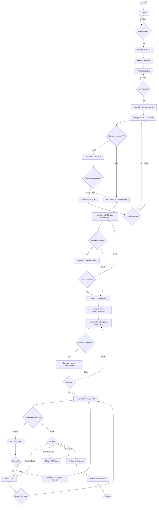

# Diagram: Flowchart RPS Builder

Diagram ini menunjukkan alur lengkap wizard RPS Builder dari login hingga submit review, termasuk interaksi AI dan validasi.

**Cara membaca:**
- Mulai dari atas, ikuti panah sesuai keputusan di node berbentuk belah ketupat (decision).
- Node persegi panjang adalah proses/aksi, node dengan sudut melengkung adalah awal/selesai.
- Terdapat tiga titik keputusan AI: validasi CPL/CPMK, saran metode pembelajaran, dan generate konten mingguan.
- Jika validasi kelengkapan gagal, pengguna dapat kembali ke langkah relevan atau menyimpan sebagai draft.
