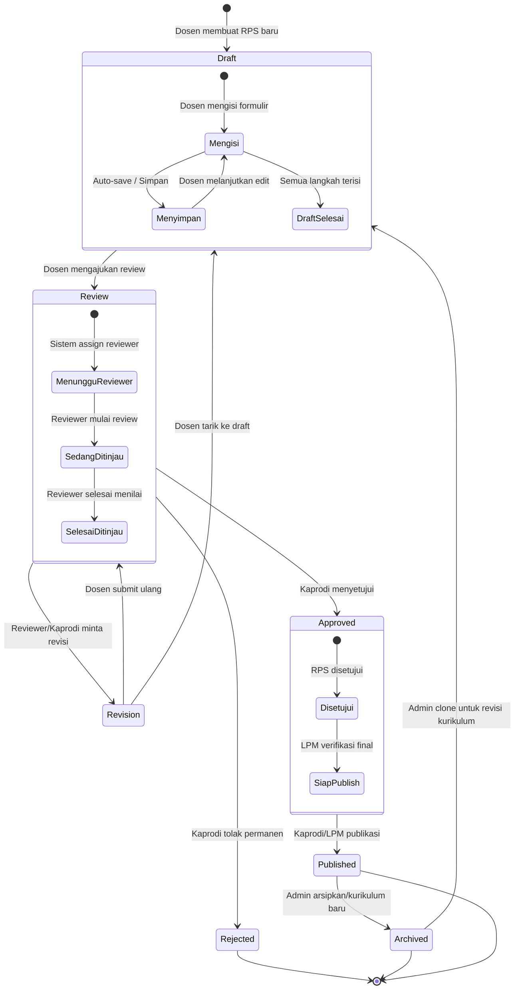

# Diagram: Workflow Status RPS

Diagram state ini menunjukkan seluruh status RPS, transisi antar status, dan siapa yang dapat memicu setiap transisi.

| Status | Deskripsi | Dipicu Oleh |
|---|---|---|
| **Draft** | RPS dalam tahap pengisian oleh Dosen | Dosen |
| **Review** | RPS sedang ditinjau oleh Reviewer | Dosen (submit) |
| **Revision** | RPS perlu perbaikan | Reviewer, Kaprodi |
| **Approved** | RPS telah disetujui | Kaprodi |
| **Published** | RPS dipublikasikan dan dapat diakses | Kaprodi, LPM |
| **Rejected** | RPS ditolak permanen | Kaprodi |
| **Archived** | RPS diarsipkan (kurikulum lama) | Admin Univ |

**Cara membaca:**
- Setiap kotak mewakili status RPS; panah menunjukkan transisi yang valid.
- Status `Draft` memiliki sub-state internal (Mengisi, Menyimpan, Selesai).
- Status `Review` memiliki sub-state internal (Menunggu, Sedang Ditinjau, Selesai).
- Tabel di bawah diagram merangkum setiap status beserta pihak yang dapat memicu transisi.
