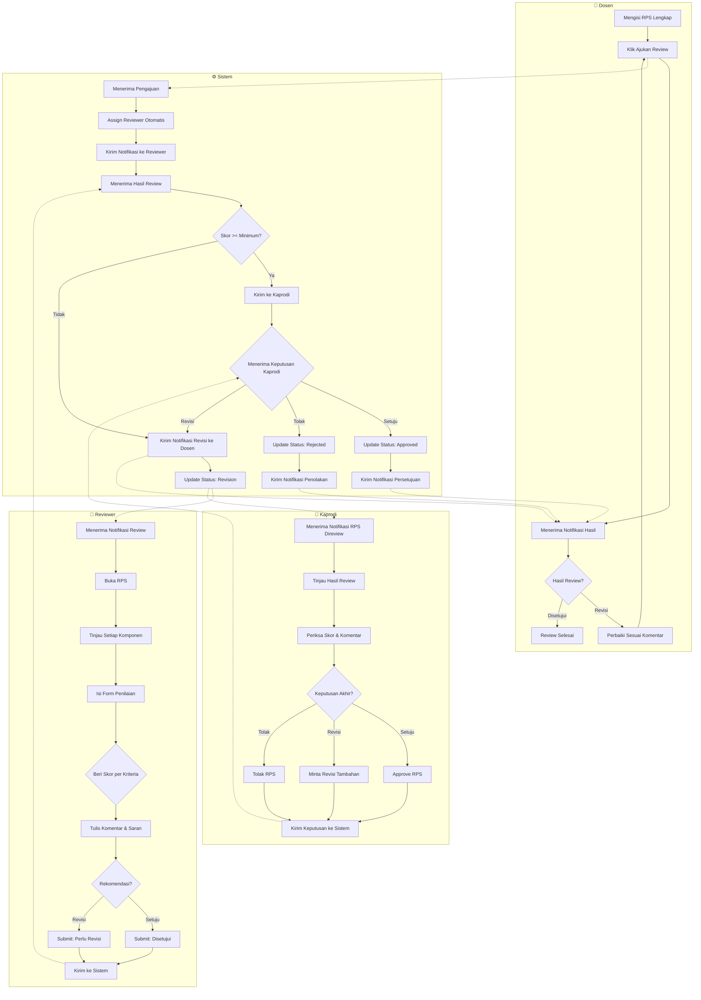

# Diagram: Activity Diagram Proses Review

Diagram ini menunjukkan alur aktivitas proses review RPS dengan swimlane antar aktor: Dosen, Reviewer, Kaprodi, dan Sistem.

**Cara membaca:**
- Diagram dibagi menjadi 4 swimlane (lajur) untuk masing-masing aktor: Dosen, Sistem, Reviewer, dan Kaprodi.
- Panah solid menunjukkan alur dalam swimlane yang sama.
- Panah putus-putus `.->` menunjukkan komunikasi/kiriman data antar swimlane.
- Alur dimulai dari Dosen mengajukan review dan berakhir dengan notifikasi hasil ke Dosen.
