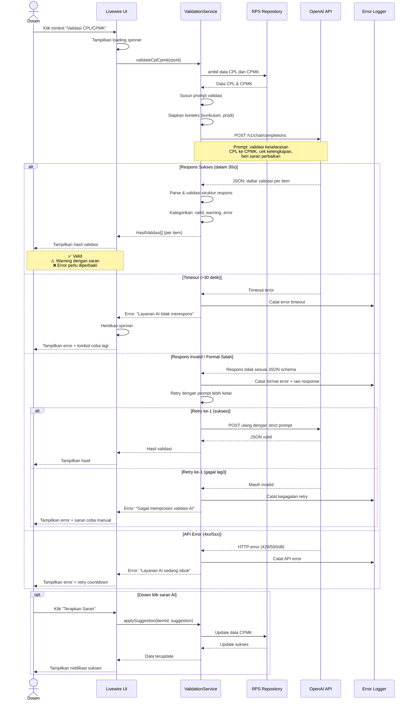

# Diagram: Sequence Diagram Validasi AI

Diagram ini menunjukkan alur komunikasi antara Dosen, Sistem, dan OpenAI API saat proses validasi CPL/CPMK menggunakan AI.

**Cara membaca:**
- Garis vertikal menunjukkan partisipan (aktor/sistem).
- Panah horizontal menunjukkan pesan/kiriman data dari pengirim ke penerima.
- Blok `alt` menunjukkan cabang kondisional (sukses/timeout/error).
- Blok `opt` menunjukkan langkah opsional (menerapkan saran AI).
- Diagram dibaca dari atas ke bawah mengikuti urutan kronologis.
