# Diagram: Component Diagram

Diagram ini menggambarkan arsitektur komponen sistem RPS-OBE, ketergantungan, dan aliran data antar komponen.

```mermaid
graph TD
    subgraph Frontend[🖥️ Frontend - Browser]
        BL[Blade Templates]
        LV[Livewire / Volt Components]
        AL[Alpine.js]
        TW[Tabler UI Components]
        CK[Chart.js / ApexCharts]

        BL --> LV
        LV --> AL
        BL --> TW
        LV --> CK
    end

    subgraph Backend[⚙️ Backend - Laravel]
        subgraph Routing[Routing]
            WR[Web Routes]
            AR[API Routes]
        end

        subgraph Middleware[Middleware]
            AM[Auth Middleware]
            RM[Role Middleware]
            TM[Tenant Middleware]
        end

        subgraph Controllers[Controllers]
            AC[AuthController]
            UC[UserController]
            MC[MasterDataController]
            RC[RPSController]
            RV[ReviewController]
            EC[ExportController]
            DC[DashboardController]
        end

        subgraph Services[Services]
            RBS[RPSBuilderService]
            RS[ReviewService]
            AIS[AIService]
            ES[ExportService]
            NS[NotificationService]
            TS[TenantService]
        end

        subgraph Models[Models]
            UM[User]
            RM2[Role]
            TM2[Tenant]
            MK[MataKuliah]
            CPL[CPL]
            CPMK[CPMK]
            RPM[RPS]
            BKD[BahanKajian]
            RV2[Review]
        end

        subgraph Jobs[Queue Jobs]
            EXJ[ExportJob]
            NTJ[NotificationJob]
            AIJ[AIValidationJob]
        end
    end

    subgraph Infrastructure[🏗️ Infrastructure]
        subgraph Database[Database]
            MD[(MariaDB)]
            MR[(MariaDB Replica)]
        end

        RD[(Redis)]
        QW[Queue Worker]
        FS[File Storage / S3]
        CDN[CDN]

        subgraph External[External Services]
            OA[OpenAI API]
            ML[Mail/SMTP Server]
        end
    end

    %% Connections
    WR --> AM
    WR --> RM
    WR --> TM
    AR --> AM
    AR --> RM

    LV <--> WR
    LV <--> AR

    WR --> AC
    WR --> UC
    WR --> MC
    WR --> RC
    WR --> RV
    WR --> EC
    WR --> DC

    RC --> RBS
    RV --> RS
    RC --> AIS
    EC --> ES
    RC --> NS
    AC --> TS

    RBS --> UM
    RBS --> MK
    RBS --> CPL
    RBS --> CPMK
    RBS --> RPM
    RBS --> BKD

    RS --> RV2
    RS --> RPM

    AIS --> OA

    ES --> EXJ
    EXJ --> FS
    FS --> CDN

    NS --> NTJ
    NTJ --> ML

    AIS --> AIJ

    Models --> MD
    Models --> MR
    QW --> RD
    EXJ --> QW
    NTJ --> QW
    AIJ --> QW

    RBS --> RD
    RS --> RD
```

**Cara membaca:**
- Tiga lapisan utama: Frontend (Browser), Backend (Laravel), dan Infrastructure.
- Panah dari controller ke service menunjukkan pemanggilan; dari service ke model menunjukkan akses data.
- External services (OpenAI, SMTP) berada di luar sistem dan diakses melalui service layer.
- Queue Worker mengonsumsi job dari Redis dan memproses tugas asinkron (export, notifikasi, AI).
