# Diagram: Deployment Diagram

Diagram ini menunjukkan topologi infrastruktur produksi RPS-OBE, termasuk koneksi jaringan, protokol, dan layanan eksternal.

```mermaid
graph TD
    subgraph Internet[🌐 Internet]
        USR[👤 Pengguna / Browser]
        USR -->|HTTPS :443| CDN
    end

    subgraph CDN_Cloud[☁️ CDN & DNS]
        CDN[CDN CloudFlare]
        DNS[DNS Server]
    end

    CDN -->|HTTPS :443| LB

    subgraph DMZ[🛡️ DMZ / Load Balancer]
        LB[Nginx Load Balancer]
        LB -->|TCP :80/443| WS1
        LB -->|TCP :80/443| WS2
        LB -->|TCP :80/443| WS_N[Web Server N...]
    end

    subgraph AppServers[🖥️ Application Servers]
        WS1[Web Server 1<br/>Laravel + PHP-FPM :9000]
        WS2[Web Server 2<br/>Laravel + PHP-FPM :9000]
        WS_N[Web Server N<br/>Laravel + PHP-FPM :9000]

        subgraph SharedStorage[💾 Shared Storage]
            APP_STOR[Application Storage<br/>Logs / Cache / Sessions]
        end

        WS1 --- APP_STOR
        WS2 --- APP_STOR
        WS_N --- APP_STOR
    end

    subgraph DataLayer[🗄️ Data Layer]
        DB_PRIMARY[(MariaDB Primary<br/>:3306)]
        DB_REPLICA[(MariaDB Replica<br/>:3306)]

        DB_PRIMARY -->|Replication :3306| DB_REPLICA

        REDIS[(Redis Server<br/>:6379)]
        REDIS_SESS[(Redis Session<br/>:6379)]
    end

    subgraph Workers[⚡ Queue Workers]
        QW1[Queue Worker 1]
        QW2[Queue Worker 2]
        QW3[Queue Worker 3]
        SCHED[Laravel Scheduler<br/>Cron Jobs]
    end

    subgraph Storage[📁 Object Storage]
        S3[S3-Compatible Storage<br/>MinIO / AWS S3]
    end

    subgraph Monitor[📊 Monitoring]
        GRAF[Grafana]
        PROM[Prometheus]
        NR[New Relic / Sentry]
    end

    subgraph External[🌍 External Services]
        OA[OpenAI API<br/>api.openai.com]
        SMTP[SMTP Server<br/>Mailgun / SES]
        SSO[SSO Provider<br/>OAuth2 / SAML]
    end

    %% Server connections
    WS1 -->|TCP :3306| DB_PRIMARY
    WS1 -->|TCP :3306| DB_REPLICA
    WS1 -->|TCP :6379| REDIS
    WS1 -->|TCP :6379| REDIS_SESS
    WS2 -->|TCP :3306| DB_PRIMARY
    WS2 -->|TCP :3306| DB_REPLICA
    WS2 -->|TCP :6379| REDIS
    WS2 -->|TCP :6379| REDIS_SESS
    WS_N -->|TCP :3306| DB_PRIMARY
    WS_N -->|TCP :3306| DB_REPLICA
    WS_N -->|TCP :6379| REDIS
    WS_N -->|TCP :6379| REDIS_SESS

    %% Worker connections
    QW1 -->|TCP :6379| REDIS
    QW2 -->|TCP :6379| REDIS
    QW3 -->|TCP :6379| REDIS
    QW1 -->|TCP :3306| DB_PRIMARY
    QW2 -->|TCP :3306| DB_PRIMARY
    QW3 -->|TCP :3306| DB_PRIMARY

    %% Storage & External
    WS1 -->|HTTPS :443| S3
    WS2 -->|HTTPS :443| S3
    WS_N -->|HTTPS :443| S3
    QW1 -->|HTTPS :443| S3
    QW2 -->|HTTPS :443| S3
    QW3 -->|HTTPS :443| S3
    CDN -->|HTTPS :443| S3

    WS1 -->|HTTPS :443| OA
    WS2 -->|HTTPS :443| OA
    QW1 -->|HTTPS :443| OA
    QW2 -->|HTTPS :443| OA

    WS1 -->|SMTP :587| SMTP
    WS2 -->|SMTP :587| SMTP
    QW1 -->|SMTP :587| SMTP
    QW2 -->|SMTP :587| SMTP

    WS1 -->|HTTPS :443| SSO
    WS2 -->|HTTPS :443| SSO

    %% Monitoring
    WS1 -->|Metrics :9090| PROM
    WS2 -->|Metrics :9090| PROM
    QW1 -->|Metrics :9090| PROM
    DB_PRIMARY -->|Metrics :9104| PROM
    REDIS -->|Metrics :9121| PROM
    PROM --> GRAF
```

**Cara membaca:**
- Kotak besar adalah zona/kelompok infrastruktur: DMZ, Application Servers, Data Layer, Workers, Storage, Monitoring, External.
- Label pada panah menunjukkan protokol dan port (contoh: `TCP :3306`).
- Load Balancer mendistribusikan trafik ke N web server yang identik.
- Database menggunakan arsitektur Primary-Replica dengan replikasi.
- Queue Workers memproses job dari Redis; Scheduler menjalankan cron.
- Monitoring mencakup metrics server (Prometheus) dan visualisasi (Grafana).
- Layanan eksternal (OpenAI, SMTP, SSO) diakses melalui HTTPS/SMTP dari web server dan workers.
