# Diagram: High-Level Architecture

Diagram ini menunjukkan arsitektur tingkat tinggi sistem RPS-OBE menggunakan pola layered architecture dengan multi-tenant dan cross-cutting concerns.

```mermaid
graph TD
    subgraph UserLayer[👤 User Layer]
        SA[Super Admin]
        AU[Admin Univ]
        AF[Admin Fakultas]
        AP[Admin Prodi]
        KP[Kaprodi]
        RV[Reviewer]
        DS[Dosen]
        LP[LPM]
        MS[Mahasiswa]
    end

    subgraph PresentationLayer[🎨 Presentation Layer]
        direction TB
        TL[Tabler UI Kit]
        BL[Blade Templates]
        LV[Livewire Components]
        AJ[Alpine.js Interactivity]
        CK[Chart.js Visualisasi]

        TL --> BL
        BL --> LV
        LV --> AJ
        LV --> CK
    end

    subgraph AppLayer[⚙️ Application Layer]
        direction TB

        subgraph Routing2[Routing & Middleware]
            WR2[Web Routes]
            AR2[API Routes]
            MW[Auth / Role / Tenant Middleware]
        end

        subgraph Controllers2[Controllers]
            AC2[AuthController]
            UC2[UserController]
            MC2[MasterDataController]
            RC2[RPSController]
            RVC2[ReviewController]
            EC2[ExportController]
            DC2[DashboardController]
        end

        subgraph Services2[Application Services]
            RBS2[RPSBuilderService]
            RVS2[ReviewService]
            AIS2[AIService]
            EXS2[ExportService]
            NTS2[NotificationService]
            TNS2[TenantService]
            VLS2[ValidationService]
        end

        WR2 --> MW
        AR2 --> MW
        Controllers2 --> Services2
    end

    subgraph DomainLayer[🧠 Domain Layer]
        direction TB

        subgraph Models2[Domain Models]
            UM2[User]
            RM3[Role]
            TN[Tenant]
            FK[Fakultas]
            PD[Prodi]
            KR[Kurikulum]
            MK2[MataKuliah]
            CL[CPL]
            CM[CPMK]
            BK[BahanKajian]
            MP[MetodePembelajaran]
            PN[Penilaian]
            RP[RPS]
            RPSM[RPSMingguan]
            RV3[Review]
        end

        subgraph BusinessLogic[Business Rules]
            BLR[Validasi RPS Rules]
            BLS[Scoring Algorithm]
            BLT[Tenant Isolation Logic]
            BLW[Workflow State Machine]
        end

        Models2 --> BusinessLogic
    end

    subgraph InfrastructureLayer[🏗️ Infrastructure Layer]
        direction TB

        subgraph DataStore[Data Persistence]
            MDB[(MariaDB)]
            MDBR[(MariaDB Replica)]
            RD2[(Redis Cache)]
        end

        subgraph Queue[Message Queue]
            QW2[Queue Worker]
            SCHED2[Task Scheduler]
        end

        subgraph FileStorage[File System]
            S32[S3 Storage]
            CDN2[CDN]
        end

        subgraph ExternalAPIs[External Services]
            OAI[OpenAI API]
            SMTP2[SMTP Server]
            SSO2[SSO Provider]
        end
    end

    subgraph CrossCutting[🔀 Cross-Cutting Concerns]
        direction LR
        AUTH[🔐 Authentication<br/>Laravel Sanctum / SPA]
        ACL[🛡️ Authorization<br/>Role-Based Access Control]
        LOG[📝 Logging<br/>Monolog / ELK Stack]
        MON[📊 Monitoring<br/>Prometheus / Grafana]
        CACHE[⚡ Caching<br/>Redis / CDN]
        ERR[🐛 Error Handling<br/>Sentry / Exception Handler]
    end

    subgraph MultiTenant[🏢 Multi-Tenant Layer]
        TID[Tenant Identifier]
        SCOPE[Data Scope Filter]
        ISOL[Database Isolation]
        CONFIG[Tenant Configuration]

        TID --> SCOPE
        SCOPE --> ISOL
        ISOL --> CONFIG
    end

    %% Vertical connections
    UserLayer --> PresentationLayer
    PresentationLayer -->|HTTP Request| Routing2
    Routing2 --> Controllers2
    Controllers2 --> Services2
    Services2 --> DomainLayer
    DomainLayer --> InfrastructureLayer

    %% Cross-cutting applies horizontally
    CrossCutting -.-> PresentationLayer
    CrossCutting -.-> AppLayer
    CrossCutting -.-> DomainLayer
    CrossCutting -.-> InfrastructureLayer

    %% Multi-tenant wraps domain & infra
    MultiTenant -.-> DomainLayer
    MultiTenant -.-> InfrastructureLayer
```

**Cara membaca:**
- Diagram dibaca dari atas ke bawah: User Layer → Presentation Layer → Application Layer → Domain Layer → Infrastructure Layer.
- **Presentation Layer** menangani UI dengan Tabler UI Kit dan Livewire Components.
- **Application Layer** berisi routing, middleware, controllers, dan application services yang mengorkestrasi use case.
- **Domain Layer** berisi model bisnis inti (User, RPS, Review, dll.) dan business rules.
- **Infrastructure Layer** menangani persistensi data, queue, file storage, dan integrasi eksternal.
- **Cross-Cutting Concerns** (Auth, Logging, Monitoring, Caching) bekerja secara horizontal di semua layer.
- **Multi-Tenant Layer** memastikan isolasi data antar universitas melalui tenant identifier dan scope filter.
