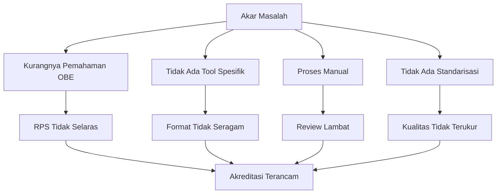

# 05 — Problem Statement

## Permasalahan Utama

### 1. Kompleksitas Penyusunan RPS Berbasis OBE

Penyusunan RPS berbasis OBE memerlukan pemahaman mendalam tentang:
- Capaian Pembelajaran Lulusan (CPL)
- Capaian Pembelajaran Mata Kuliah (CPMK)
- Sub-CPMK
- Constructive Alignment
- Taksonomi Bloom
- Metode pembelajaran
- Assessment dan rubrik

Mayoritas dosen tidak memiliki latar belakang pedagogi formal, sehingga kesulitan menyusun RPS yang selaras (*aligned*).

**Dampak:** RPS disusun asal-asalan, copy-paste dari tahun sebelumnya, atau tidak mencerminkan OBE sesungguhnya.

### 2. Inkonsistensi Format dan Kualitas

Setiap dosen, program studi, dan fakultas sering memiliki format RPS sendiri-sendiri. Tidak ada standarisasi di tingkat institusi.

**Dampak:**
- Sulit melakukan review dan quality assurance
- Berkas akreditasi tidak seragam
- Mahasiswa bingung dengan format yang berbeda-beda

### 3. Tidak Ada Validasi Otomatis

Saat ini, validasi RPS dilakukan secara manual oleh reviewer, kaprodi, atau LPM. Proses ini:
- Memakan waktu 3-7 hari per RPS
- Bergantung pada ketersediaan reviewer
- Rawan human error
- Tidak scalable untuk institusi besar dengan ratusan mata kuliah

**Dampak:** Banyak RPS lolos tanpa validasi memadai.

### 4. Kolaborasi Tidak Terstruktur

Proses review dan approval RPS umumnya dilakukan melalui:
- Email (bolak-balik attachment)
- WhatsApp (chat dan file)
- Google Drive (shared folder tanpa workflow)

**Dampak:**
- Tidak ada jejak review yang jelas
- Sulit melacak status revisi
- Tidak ada accountability

### 5. Tidak Ada Versioning dan Audit Trail

RPS terus diperbarui setiap semester, namun:
- Perubahan tidak tercatat
- Sulit mengetahui siapa yang mengubah apa dan kapan
- Tidak bisa kembali ke versi sebelumnya

**Dampak:** Masalah serius saat akreditasi — auditor tidak bisa melihat riwayat perubahan.

### 6. Kebutuhan Akreditasi yang Meningkat

BAN-PT dan LAM semakin ketat dalam menilai dokumen kurikulum. Perguruan tinggi harus menyediakan:
- RPS lengkap untuk seluruh mata kuliah
- Bukti constructive alignment
- Bukti review dan perbaikan berkelanjutan

**Dampak:** Institusi kewalahan menyiapkan dokumen akreditasi.

### 7. Kesenjangan Teknologi

Tool yang tersedia saat ini:
- **SISTER (Kemdikbud):** Hanya untuk pelaporan, bukan penyusunan
- **Microsoft Word:** General purpose, tidak OBE-aware
- **Google Docs:** Kolaboratif tapi tidak terstruktur
- **Excel:** Manual dan error-prone

**Dampak:** Tidak ada tool yang secara spesifik dirancang untuk penyusunan RPS berbasis OBE.

## Pain Points per User

| User | Pain Points |
|------|-------------|
| Dosen | Bingung menyusun CPMK/Sub-CPMK; Tidak tahu apakah RPS sudah selaras; Proses review lama |
| Kaprodi | Sulit memonitor status RPS semua dosen; Review manual memakan waktu |
| Reviewer | Tidak ada panduan validasi; Beban review tinggi |
| Dekan | Tidak ada visibilitas ke seluruh prodi; Approval bottleneck |
| LPM | Sulit memastikan standar mutu; Tidak ada dashboard |
| Auditor | Dokumen tidak terstruktur; Tidak ada riwayat perubahan |

## Akar Masalah (Root Cause)

---

**Navigasi:** [Sebelumnya: Business Goals](04-business-goals.md) | [Daftar Isi](../README.md) | [Berikutnya: Solution Overview](06-solution-overview.md)
