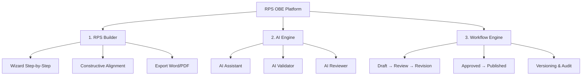
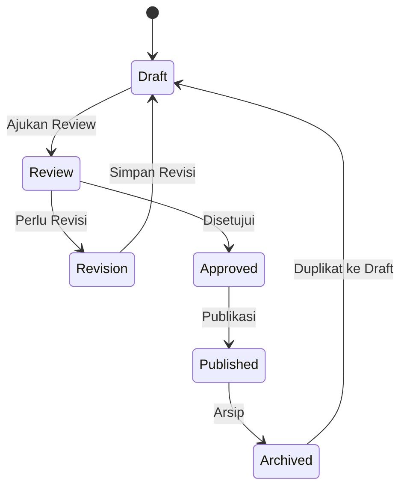
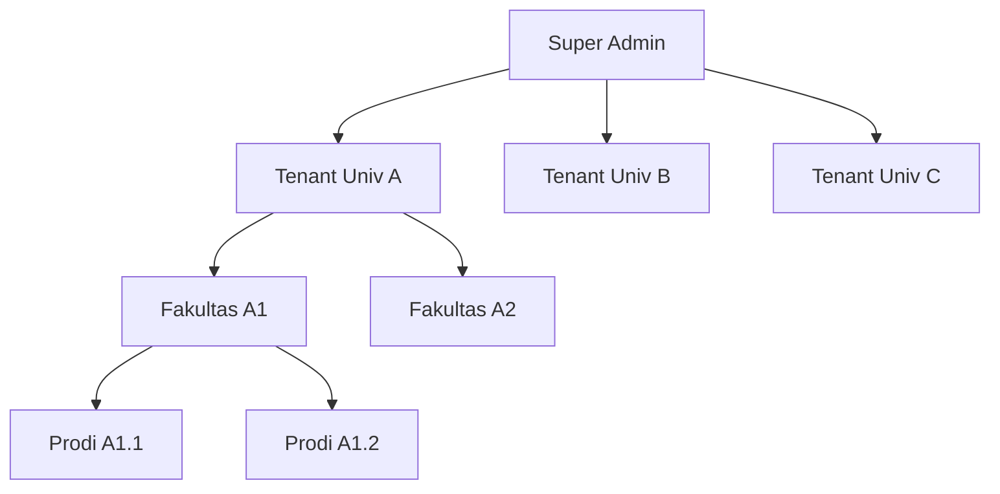
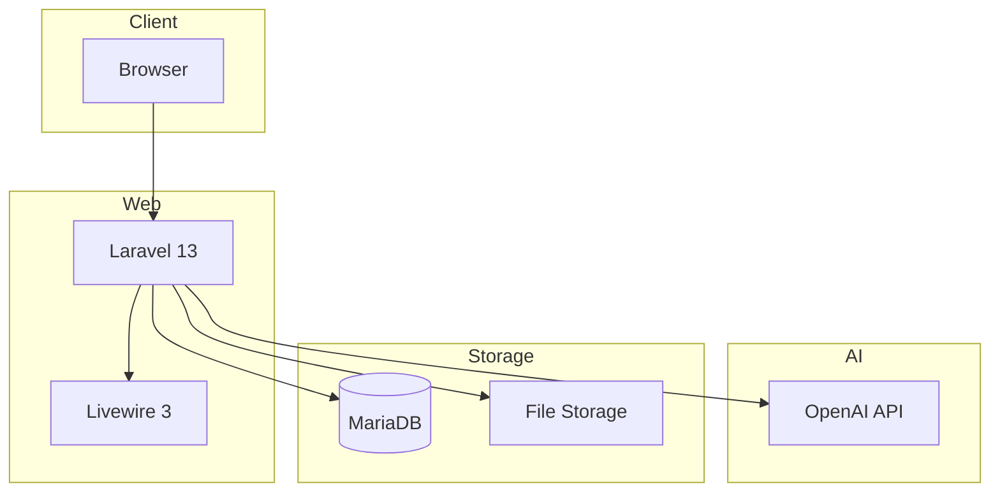

# 06 — Solution Overview

## Gambaran Solusi

RPS OBE adalah platform SaaS berbasis web yang menyediakan solusi end-to-end untuk penyusunan, validasi, review, pengelolaan, dan publikasi RPS berbasis OBE.

## Tiga Pilar Solusi

### Pilar 1: RPS Builder

Wizard interaktif 8 langkah yang memandu dosen menyusun RPS:

| Step | Komponen | Deskripsi |
|------|----------|-----------|
| 1 | Informasi Mata Kuliah | Nama MK, kode, SKS, semester, dosen |
| 2 | Pilih CPL | Memilih CPL yang didukung MK |
| 3 | CPMK | Menyusun CPMK dari CPL terpilih |
| 4 | Sub-CPMK | Menyusun Sub-CPMK dari CPMK |
| 5 | Materi | Menentukan materi per pertemuan |
| 6 | Metode Pembelajaran | Memilih metode pembelajaran |
| 7 | Assessment | Menyusun assessment dan bobot |
| 8 | Review | Pratinjau dan finalisasi |

Setiap langkah menampilkan progress bar, validasi inline, dan kemampuan menyimpan draft kapan saja.

### Pilar 2: AI Engine

Tiga komponen AI yang bekerja bersama:

| Komponen | Fungsi | Teknologi |
|----------|--------|-----------|
| **AI Assistant** | Generate CPMK, Sub-CPMK, materi, assessment, rubrik | OpenAI GPT-4o |
| **AI Validator** | Memeriksa constructive alignment, taksonomi, bobot, konsistensi | Rule engine + GPT |
| **AI Reviewer** | Memberikan skor, komentar, saran perbaikan | GPT + Scoring model |

### Pilar 3: Workflow Engine

Siklus hidup RPS yang terstruktur:

## Arsitektur Multi-Tenant

- **Isolasi data penuh** antar tenant
- Satu database dengan `tenant_id` pada setiap tabel
- Row-level security berbasis Spatie Permission

## Key Differentiators

| Fitur | RPS OBE | Alternatif |
|-------|---------|------------|
| OBE-native | Ya — dirancang khusus OBE | Tidak — general purpose |
| Wizard Builder | 8 langkah terstruktur | Form bebas |
| AI Generate | Ya | Tidak |
| AI Validate | Ya | Tidak |
| AI Review | Ya | Tidak |
| Workflow | Built-in | Tidak ada |
| Versioning | Otomatis | Manual |
| Template Kustom | Per institusi | Terbatas |
| Multi-kampus | Native multi-tenant | Tidak ada |
| Akreditasi-ready | Format BAN-PT/LAM | Perlu konversi manual |

## Arsitektur Teknologi

---

**Navigasi:** [Sebelumnya: Problem Statement](05-problem-statement.md) | [Daftar Isi](../README.md) | [Berikutnya: Target Users](07-target-users.md)
