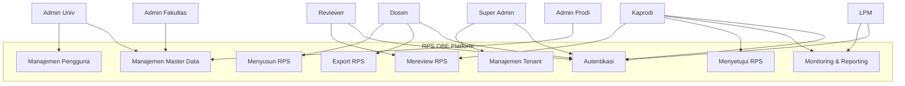
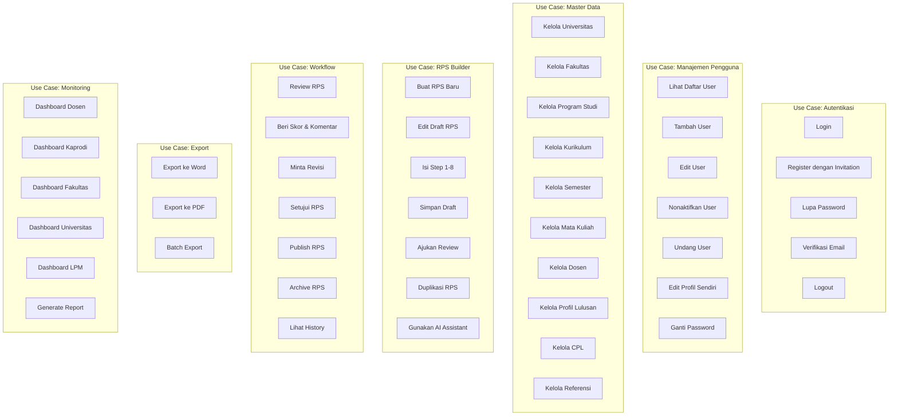
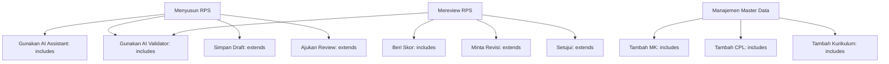

# 14 — Use Case

## Diagram Use Case

### Level 1: Use Case Utama

### Level 2: Rincian Use Case

---

## Spesifikasi Use Case Detail

### UC-01: Login

| Atribut | Detail |
|---------|--------|
| **ID** | UC-01 |
| **Nama** | Login |
| **Aktor** | Semua pengguna |
| **Precondition** | Pengguna memiliki akun terverifikasi |
| **Trigger** | Pengguna mengakses halaman login |
| **Main Flow** | 1. Pengguna memasukkan email dan password 2. Sistem memvalidasi kredensial 3. Sistem membuat session 4. Sistem mengarahkan ke dashboard sesuai role |
| **Alternative Flow** | 2a. Kredensial salah → Tampilkan pesan error 3a. Akun dinonaktifkan → Tampilkan pesan hubungi admin |
| **Postcondition** | Pengguna login dan masuk dashboard |

### UC-02: Register dengan Invitation

| Atribut | Detail |
|---------|--------|
| **ID** | UC-02 |
| **Nama** | Register dengan Invitation Code |
| **Aktor** | Dosen, Reviewer, Admin (diundang) |
| **Precondition** | Admin telah mengirim invitation email |
| **Trigger** | Pengguna mengklik link invitation di email |
| **Main Flow** | 1. Pengguna mengklik link invitation 2. Sistem menampilkan form registrasi (nama, password) 3. Pengguna mengisi form dan submit 4. Sistem membuat akun dan mengirim email verifikasi 5. Pengguna verifikasi email |
| **Alternative Flow** | 2a. Invitation expired → Tampilkan pesan minta invitation baru 4a. Email sudah terdaftar → Tampilkan pesan login |
| **Postcondition** | Akun baru dibuat, pengguna dapat login |

### UC-03: Menyusun RPS Baru

| Atribut | Detail |
|---------|--------|
| **ID** | UC-03 |
| **Nama** | Menyusun RPS Baru |
| **Aktor** | Dosen |
| **Precondition** | Dosen login, MK sudah ada di master data |
| **Trigger** | Dosen klik "Buat RPS Baru" |
| **Main Flow** | 1. Pilih kurikulum dan mata kuliah 2. Sistem auto-fill informasi MK 3. Pilih CPL yang didukung MK 4. Tambah CPMK (manual atau AI) 5. Tambah Sub-CPMK (manual atau AI) 6. Isi materi per pertemuan 7. Pilih metode pembelajaran 8. Tambah assessment dan bobot 9. Review dan finalisasi 10. Simpan atau ajukan review |
| **Alternative Flow** | 3a. Tidak ada CPL → Harus tambah CPL dulu Di setiap step bisa "Simpan Draft" kapan saja 4a-5a. AI generate → Review dan edit output AI |
| **Postcondition** | RPS tersimpan sebagai Draft atau diajukan Review |

### UC-04: Mereview RPS

| Atribut | Detail |
|---------|--------|
| **ID** | UC-04 |
| **Nama** | Mereview RPS |
| **Aktor** | Reviewer, Kaprodi |
| **Precondition** | RPS dalam status Review |
| **Trigger** | Reviewer mendapat notifikasi RPS siap review |
| **Main Flow** | 1. Reviewer membuka RPS 2. Reviewer memeriksa setiap komponen 3. Reviewer menggunakan AI Validator (opsional) 4. Reviewer memberikan skor per komponen 5. Reviewer menulis komentar dan saran 6. Reviewer menyetujui atau meminta revisi |
| **Alternative Flow** | 6a. Setujui → Status berubah ke Approved 6b. Minta revisi → Status berubah ke Revision, dosen dapat notifikasi |
| **Postcondition** | RPS disetujui atau kembali ke dosen untuk revisi |

### UC-05: Validasi AI

| Atribut | Detail |
|---------|--------|
| **ID** | UC-05 |
| **Nama** | Menjalankan AI Validator |
| **Aktor** | Dosen, Reviewer, Kaprodi, LPM |
| **Precondition** | RPS memiliki konten minimal (CPMK, Sub-CPMK) |
| **Trigger** | Pengguna klik "Validasi AI" |
| **Main Flow** | 1. Sistem mengirim konten RPS ke AI 2. AI menganalisis 8 aspek validasi 3. AI mengembalikan hasil validasi (pass/warning/error) 4. Sistem menampilkan hasil per aspek 5. Pengguna membaca dan menindaklanjuti |
| **Alternative Flow** | 2a. AI timeout → Tampilkan error, coba lagi 2b. Konten terlalu panjang → Pangkas atau chunking |
| **Postcondition** | Hasil validasi tersimpan dan terkait dengan RPS |

### UC-06: Export RPS

| Atribut | Detail |
|---------|--------|
| **ID** | UC-06 |
| **Nama** | Export RPS |
| **Aktor** | Dosen, Kaprodi, LPM |
| **Precondition** | RPS minimal dalam status Draft |
| **Trigger** | Pengguna klik "Export" |
| **Main Flow** | 1. Pengguna memilih format (Word/PDF) 2. Pengguna memilih template 3. Sistem generate dokumen 4. Sistem mengirim file untuk di-download |
| **Alternative Flow** | 3a. Generate gagal → Tampilkan pesan error 4a. File besar → Tampilkan progress bar |
| **Postcondition** | File terdownload ke perangkat pengguna |

### UC-07: Manajemen Tenant

| Atribut | Detail |
|---------|--------|
| **ID** | UC-07 |
| **Nama** | Manajemen Tenant/Universitas |
| **Aktor** | Super Admin |
| **Precondition** | Super Admin login |
| **Trigger** | Universitas baru mendaftar/membeli langganan |
| **Main Flow** | 1. Super Admin membuat tenant baru 2. Sistem membuat database tenant (schema/db) 3. Super Admin mengisi data universitas 4. Super Admin menetapkan paket langganan 5. Super Admin membuat admin universitas pertama 6. Admin universitas mendapat invitation |
| **Alternative Flow** | 2a. Tenant sudah ada → Notifikasi duplikasi 4a. Trial → Set expiry date |
| **Postcondition** | Tenant baru siap digunakan |

### UC-08: Generate Report

| Atribut | Detail |
|---------|--------|
| **ID** | UC-08 |
| **Nama** | Generate Report |
| **Aktor** | Kaprodi, Dekan, LPM |
| **Precondition** | Terdapat data RPS |
| **Trigger** | Pengguna membuka halaman report |
| **Main Flow** | 1. Pengguna memilih parameter laporan (periode, prodi, status) 2. Pengguna memilih tipe laporan (statistik, grafik, detail) 3. Sistem mengumpulkan dan menghitung data 4. Sistem menampilkan laporan 5. Pengguna dapat export ke Excel/PDF |
| **Postcondition** | Laporan tampil atau terdownload |

---

## Use Case Relationships

---

**Navigasi:** [Sebelumnya: Non Functional Requirement](13-non-functional-requirement.md) | [Daftar Isi](../README.md) | [Berikutnya: User Journey](15-user-journey.md)
