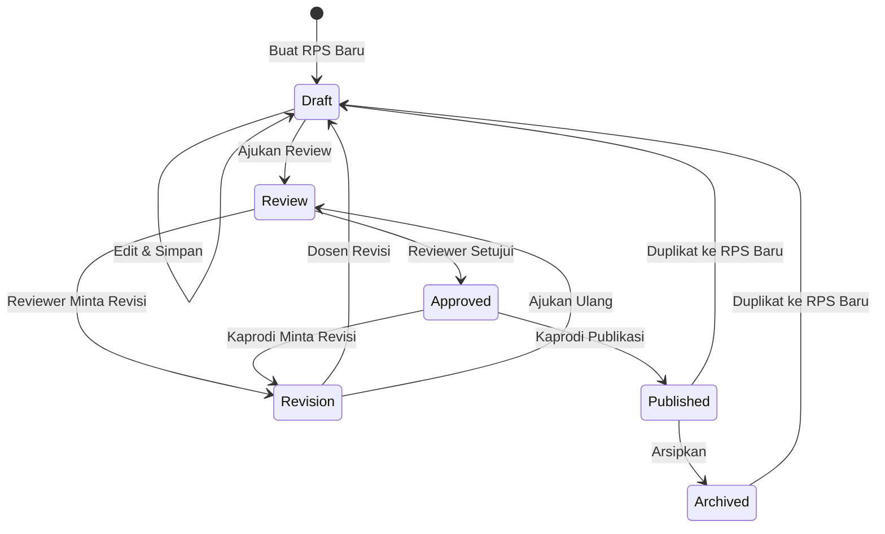
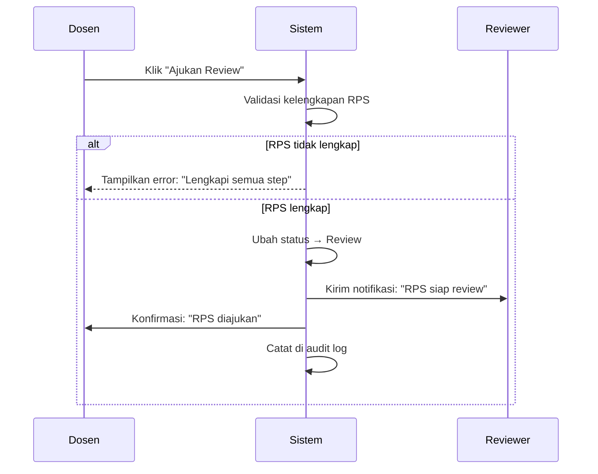
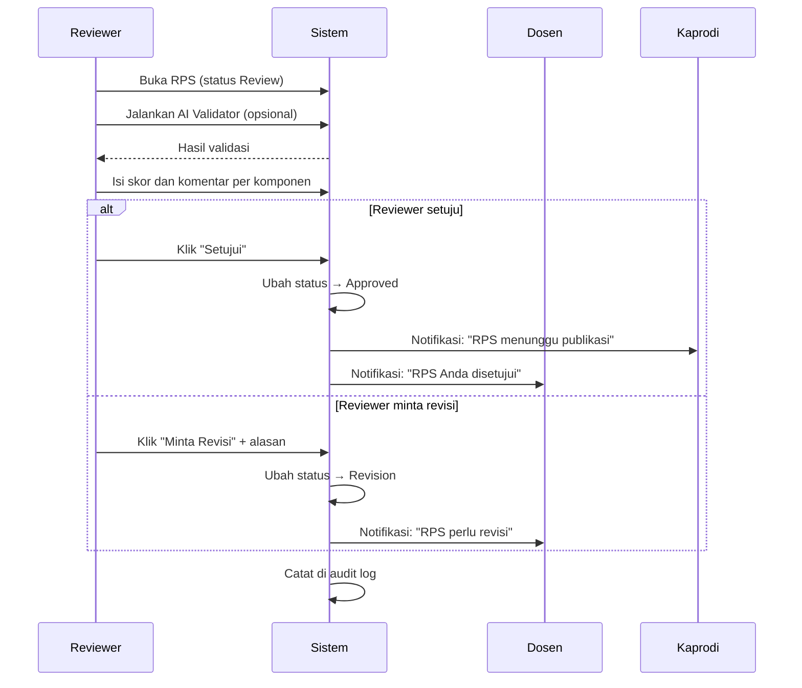
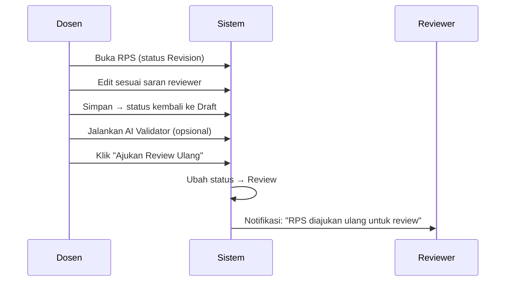
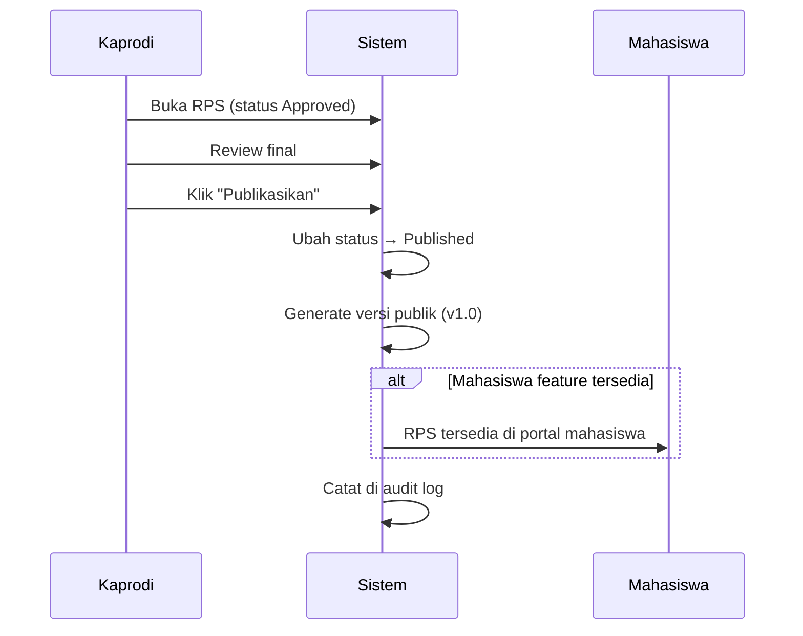
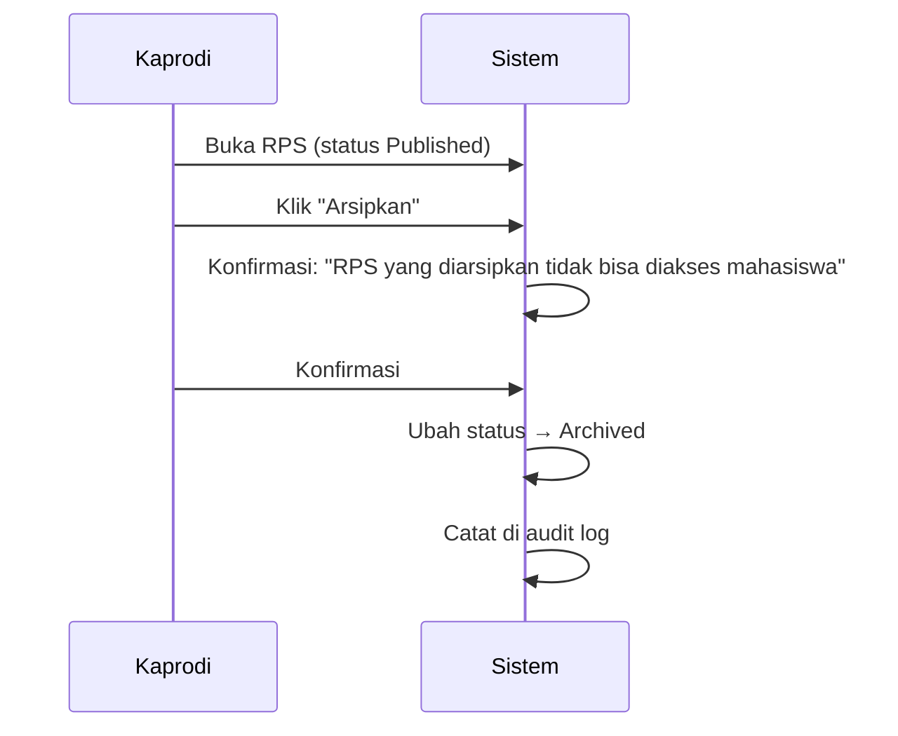
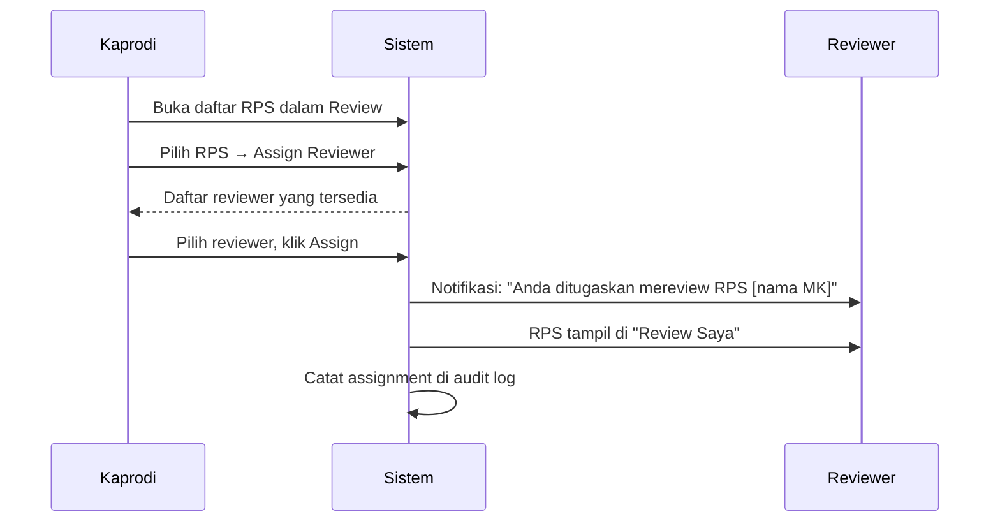
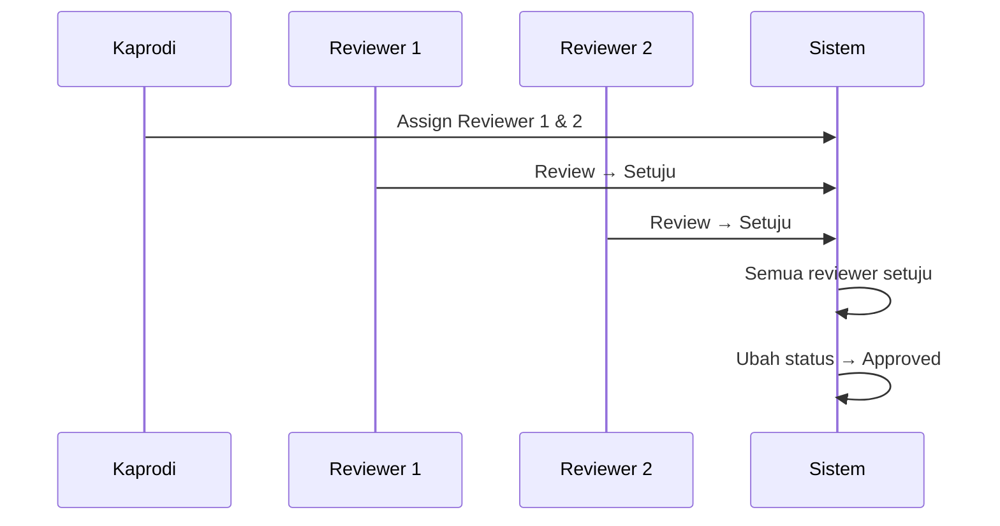
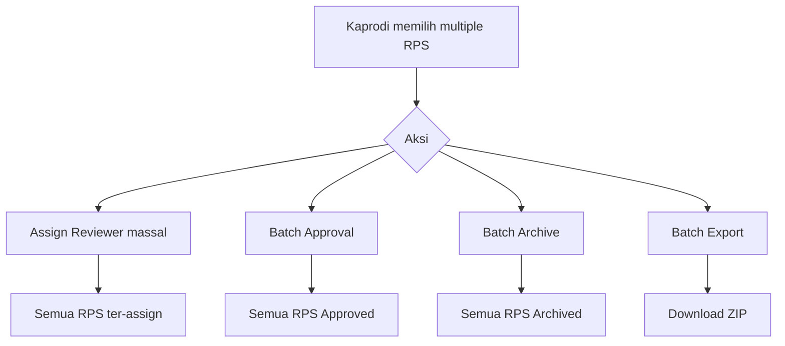

# 16 — Workflow

## Workflow RPS — Siklus Hidup Dokumen

## Deskripsi Status

| Status | Deskripsi | Siapa yang bisa mengubah? | Status Berikutnya |
|--------|-----------|---------------------------|-------------------|
| **Draft** | RPS dalam proses penyusunan. Hanya dosen bersangkutan yang bisa mengakses. | Dosen | Review |
| **Review** | RPS diajukan untuk review. Hanya reviewer yang bisa aksi, dosen read-only. | Reviewer | Revision, Approved |
| **Revision** | RPS dikembalikan ke dosen untuk diperbaiki. | Dosen | Draft, Review |
| **Approved** | RPS telah disetujui reviewer dan kaprodi. Siap dipublikasikan. | Kaprodi | Published, Revision |
| **Published** | RPS sudah dipublikasikan dan tersedia untuk diakses mahasiswa. | Kaprodi, Admin | Archived |
| **Archived** | RPS tidak berlaku lagi (kurikulum lama, MK tidak dibuka). | Kaprodi, Admin | Draft (via duplikasi) |

## Workflow Detail

### 1. Draft → Review

### 2. Review → Revision atau Approved

### 3. Revision → Draft → Review

### 4. Approved → Published

### 5. Published → Archived

## Workflow Assignment Reviewer

## Workflow Multi-Reviewer (Future)

## Workflow Batch Operations

## Rules & Constraints

| Aturan | Deskripsi |
|--------|-----------|
| **Single Active Reviewer** | Satu RPS hanya bisa direview oleh satu reviewer pada satu waktu (MVP). Multi-reviewer di future. |
| **Status Lock** | RPS di status Review/Approved/Published tidak bisa diedit dosen |
| **Revision Visibility** | Dosen hanya bisa melihat komentar reviewer di status Revision |
| **Auto-version** | Setiap perubahan status Draft → Review membuat versi baru |
| **Audit Trail** | Semua perubahan status, assignment, approval tercatat |
| **Notifikasi** | Setiap perubahan status mengirim notifikasi ke semua pihak terkait |
| **Expired Review** | Jika RPS di status Review > 14 hari tanpa aksi, kirim reminder ke reviewer |
| **Rollback** | Hanya Super Admin yang bisa rollback status (untuk kasus force majeure) |

---

**Navigasi:** [Sebelumnya: User Journey](15-user-journey.md) | [Daftar Isi](../README.md) | [Berikutnya: Feature Breakdown](17-feature-breakdown.md)
