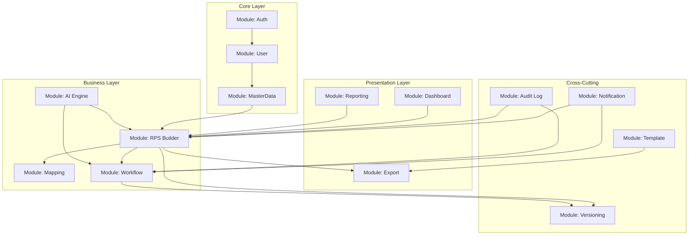
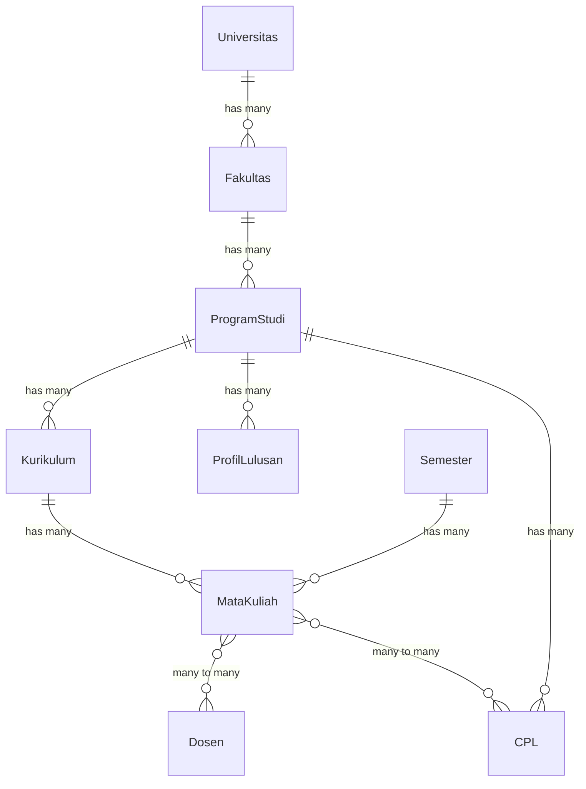
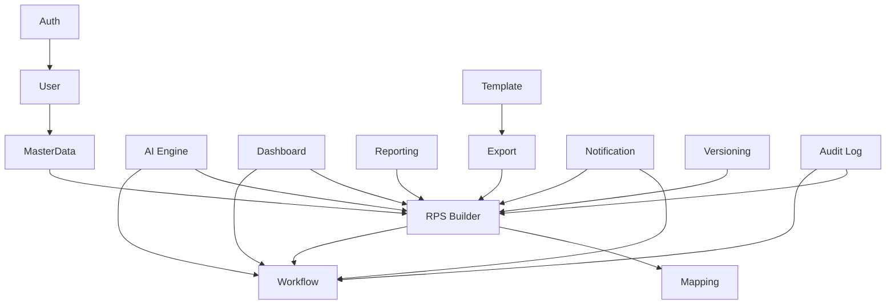

# 18 — Module Breakdown

## Arsitektur Modul



---

## Modul 1: Auth

### Struktur

```
app/
├── Http/
│   ├── Controllers/Auth/
│   │   ├── LoginController.php
│   │   ├── RegisterController.php
│   │   ├── ForgotPasswordController.php
│   │   ├── ResetPasswordController.php
│   │   ├── EmailVerificationController.php
│   │   └── SessionController.php
│   └── Middleware/
│       ├── Authenticate.php
│       └── RedirectIfAuthenticated.php
├── Models/
│   └── User.php
├── Services/
│   └── AuthService.php
└── Livewire/
    └── Auth/
        ├── Login.php
        ├── Register.php
        └── ForgotPassword.php
```

### Komponen Utama

| Komponen | Deskripsi | Dependensi |
|----------|-----------|------------|
| LoginController | Menangani login | User model, Session |
| RegisterController | Menangani registrasi | User model, Invitation |
| ForgotPasswordController | Reset password | Mail |
| EmailVerificationController | Verifikasi email | Mail |
| Spatie Permission | RBAC | User model |
| SessionManager | Session lifecycle | Cache |

---

## Modul 2: User

### Struktur

```
app/
├── Livewire/
│   └── User/
│       ├── UserIndex.php
│       ├── UserCreate.php
│       ├── UserEdit.php
│       ├── UserInvite.php
│       ├── Profile.php
│       └── BulkImport.php
├── Services/
│   ├── UserService.php
│   └── InvitationService.php
├── Mail/
│   └── UserInvitationMail.php
├── Imports/
│   └── UserImport.php
└── Exports/
    └── UserExport.php
```

### Komponen Utama

| Komponen | Deskripsi | Dependensi |
|----------|-----------|------------|
| UserIndex | Daftar pengguna | User model, Tenant |
| UserCreate | Form tambah user | Spatie Permission |
| UserEdit | Form edit user | Spatie Permission |
| UserInvite | Undang user via email | Mail, Invitation |
| Profile | Edit profil sendiri | User model |
| BulkImport | Import CSV | Laravel Excel |

---

## Modul 3: Master Data

### Struktur

```
app/
├── Livewire/
│   └── MasterData/
│       ├── Universitas/
│       │   ├── UniversitasIndex.php
│       │   ├── UniversitasCreate.php
│       │   └── UniversitasEdit.php
│       ├── Fakultas/
│       ├── ProgramStudi/
│       ├── Kurikulum/
│       ├── Semester/
│       ├── MataKuliah/
│       ├── Dosen/
│       ├── ProfilLulusan/
│       ├── CPL/
│       └── Referensi/
├── Models/
│   ├── Universitas.php
│   ├── Fakultas.php
│   ├── ProgramStudi.php
│   ├── Kurikulum.php
│   ├── Semester.php
│   ├── MataKuliah.php
│   ├── Dosen.php
│   ├── ProfilLulusan.php
│   ├── CPL.php
│   └── Referensi.php
└── Services/
    └── MasterDataService.php
```

### Relasi Model



---

## Modul 4: RPS Builder

### Struktur

```
app/
├── Livewire/
│   └── RPS/
│       ├── Builder/
│       │   ├── BuilderWizard.php (wrapper)
│       │   ├── Step1InformasiMK.php
│       │   ├── Step2PilihCPL.php
│       │   ├── Step3CPMK.php
│       │   ├── Step4SubCPMK.php
│       │   ├── Step5Materi.php
│       │   ├── Step6Metode.php
│       │   ├── Step7Assessment.php
│       │   └── Step8Review.php
│       ├── RPSIndex.php
│       ├── RPSDetail.php
│       └── RPSDuplicate.php
├── Models/
│   ├── RPS.php
│   ├── RPS_CPL.php
│   ├── CPMK.php
│   ├── SubCPMK.php
│   ├── MateriPertemuan.php
│   ├── Assessment.php
│   └── AssessmentSubCPMK.php
├── Services/
│   ├── RPSService.php
│   ├── RPSAutoSaveService.php
│   └── RPSValidationService.php
└── DTO/
    ├── RPSData.php
    ├── CPMKData.php
    └── AssessmentData.php
```

---

## Modul 5: Mapping

### Struktur

```
app/
├── Services/
│   └── MappingService.php
├── Livewire/
│   └── Mapping/
│       ├── MappingVisualization.php
│       └── GapAnalysis.php
└── Helpers/
    └── AlignmentHelper.php
```

---

## Modul 6: Workflow

### Struktur

```
app/
├── Services/
│   ├── WorkflowService.php
│   └── ReviewerAssignmentService.php
├── Enums/
│   └── RPSStatus.php (Draft, Review, Revision, Approved, Published, Archived)
├── Actions/
│   ├── SubmitForReviewAction.php
│   ├── ApproveRPSAction.php
│   ├── RequestRevisionAction.php
│   ├── PublishRPSAction.php
│   └── ArchiveRPSAction.php
├── Livewire/
│   └── Workflow/
│       ├── ReviewForm.php
│       ├── ApprovalForm.php
│       └── WorkflowHistory.php
└── Observers/
    └── RPSObserver.php (trigger notification on status change)
```

---

## Modul 7: AI Engine

### Struktur

```
app/
├── Services/AI/
│   ├── AIService.php (base)
│   ├── AIAssistantService.php
│   ├── AIValidatorService.php
│   └── AIReviewerService.php
├── DTO/AI/
│   ├── AIRequest.php
│   ├── AIResponse.php
│   ├── ValidationResult.php
│   └── ReviewResult.php
├── Livewire/
│   └── AI/
│       ├── AIGenerateButton.php
│       ├── AIValidationPanel.php
│       └── AIReviewPanel.php
├── Jobs/
│   ├── GenerateCPMKJob.php
│   ├── GenerateSubCPMKJob.php
│   ├── RunValidationJob.php
│   └── RunAIReviewJob.php
└── Prompts/
    ├── generate_cpmk.txt
    ├── generate_subcpmk.txt
    ├── generate_materi.txt
    ├── generate_assessment.txt
    ├── validate_alignment.txt
    └── review_rps.txt
```

### Prompt Management

| Prompt File | Fungsi | Input | Output |
|-------------|--------|-------|--------|
| generate_cpmk.txt | Generate CPMK dari CPL | List CPL | List CPMK |
| generate_subcpmk.txt | Generate Sub-CPMK | List CPMK | List Sub-CPMK |
| generate_materi.txt | Generate materi | Sub-CPMK, pertemuan | Materi per pertemuan |
| generate_assessment.txt | Generate assessment | Sub-CPMK, materi | Assessment + bobot |
| validate_alignment.txt | Validasi alignment | Seluruh RPS | Hasil validasi 8 aspek |
| review_rps.txt | Review RPS | Seluruh RPS | Skor + komentar + saran |

---

## Modul 8: Dashboard

### Struktur

```
app/
├── Livewire/
│   └── Dashboard/
│       ├── DosenDashboard.php
│       ├── KaprodiDashboard.php
│       ├── FakultasDashboard.php
│       ├── UniversitasDashboard.php
│       ├── LPMDashboard.php
│       └── AdminDashboard.php
├── Services/
│   └── DashboardService.php
└── Queries/
    ├── DosenStatsQuery.php
    ├── KaprodiStatsQuery.php
    └── LPMStatsQuery.php
```

---

## Modul 9: Reporting

### Struktur

```
app/
├── Livewire/
│   └── Reporting/
│       ├── ReportIndex.php
│       ├── ReportFilter.php
│       └── ReportChart.php
├── Exports/
│   ├── RPSExport.php
│   └── AuditReportExport.php
├── Services/
│   └── ReportingService.php
└── Charts/
    ├── RPSStatusChart.php
    ├── AlignmentScoreChart.php
    └── TrendChart.php
```

---

## Modul 10: Export

### Struktur

```
app/
├── Services/
│   ├── WordExportService.php
│   └── PDFExportService.php
├── Jobs/
│   ├── WordExportJob.php
│   ├── PDFExportJob.php
│   └── BatchExportJob.php
├── Templates/
│   └── Word/
│       ├── default.docx
│       └── [tenant_id]/template.docx
└── Livewire/
    └── Export/
        └── ExportButton.php
```

### Library

| Format | Library | Keterangan |
|--------|---------|------------|
| Word (.docx) | PHPWord | Template-based generation |
| PDF | DomPDF | HTML → PDF conversion |

---

## Modul 11: Notification

### Struktur

```
app/
├── Services/
│   ├── NotificationService.php
│   └── EmailService.php
├── Notifications/
│   ├── RPSSubmittedForReview.php
│   ├── RPSReviewed.php
│   ├── RPSApproved.php
│   ├── RPSRevisionRequested.php
│   ├── RPSPublished.php
│   └── ReviewerAssigned.php
├── Mail/
│   ├── RPSSubmittedMail.php
│   ├── RPSReviewedMail.php
│   ├── RPSApprovedMail.php
│   └── UserInvitationMail.php
├── Models/
│   └── Notification.php
└── Livewire/
    └── Notification/
        ├── NotificationCenter.php
        └── NotificationPreference.php
```

---

## Modul 12: Versioning

### Struktur

```
app/
├── Models/
│   └── RPSVersion.php
├── Services/
│   └── VersioningService.php
├── Livewire/
│   └── Versioning/
│       ├── VersionHistory.php
│       ├── VersionDiff.php
│       └── VersionRollback.php
└── Observers/
    └── RPSVersionObserver.php
```

---

## Modul 13: Audit Log

### Struktur

```
app/
├── Models/
│   └── AuditLog.php
├── Services/
│   └── AuditService.php
├── Livewire/
│   └── Audit/
│       └── AuditViewer.php
├── Middleware/
│   └── AuditLogMiddleware.php
└── Traits/
    └── Auditable.php
```

---

## Modul 14: Template

### Struktur

```
app/
├── Models/
│   └── TemplateRPS.php
├── Services/
│   └── TemplateService.php
├── Livewire/
│   └── Template/
│       ├── TemplateIndex.php
│       ├── TemplateUpload.php
│       └── TemplateBuilder.php
└── Storage/
    └── Templates/
        ├── default/
        └── {tenant_id}/
```

---

## Dependensi Antarmodul



---

**Navigasi:** [Sebelumnya: Feature Breakdown](17-feature-breakdown.md) | [Daftar Isi](../README.md) | [Berikutnya: Permission Matrix](19-permission-matrix.md)
