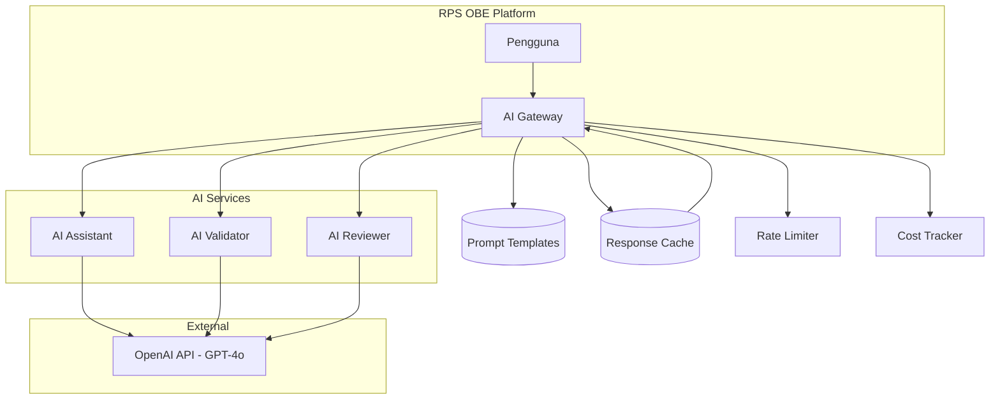
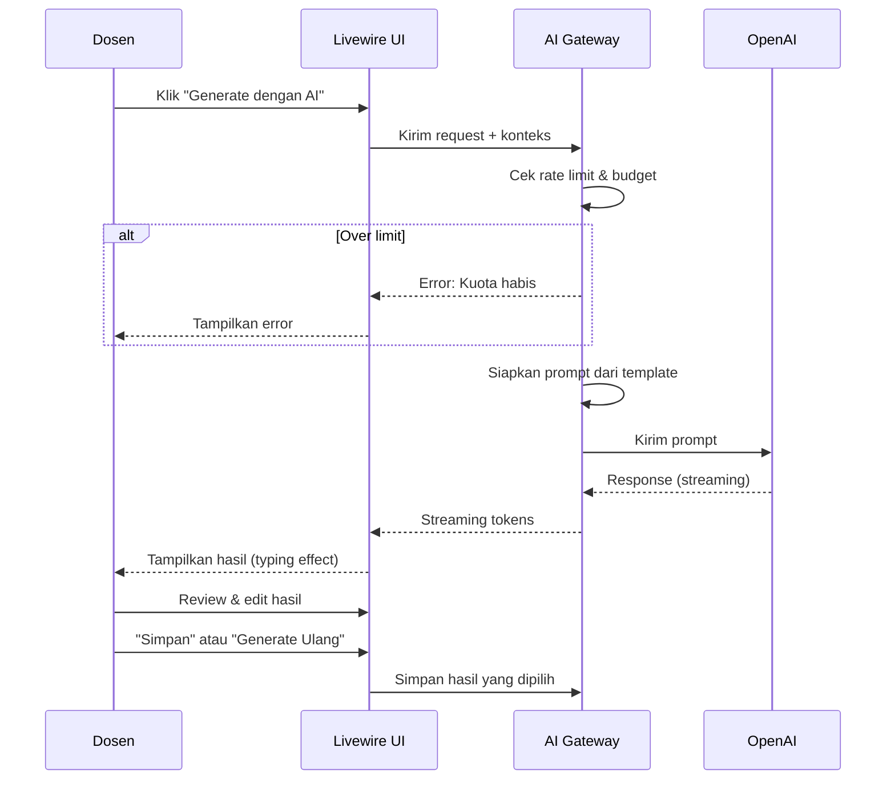
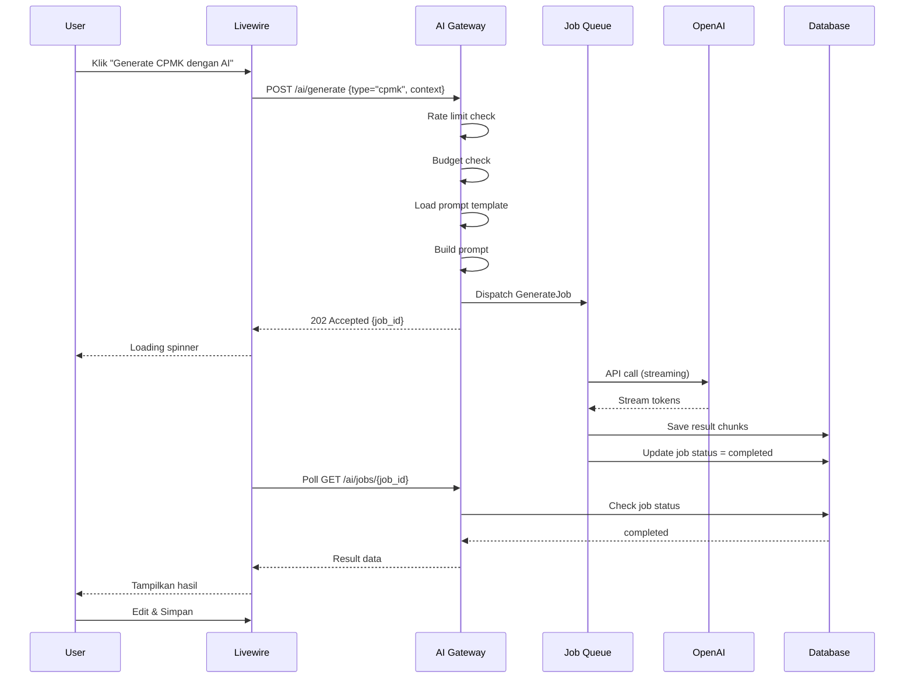

# 21 — AI Integration

## Arsitektur AI

### Overview

RPS OBE mengintegrasikan kecerdasan buatan melalui tiga mode:



---

## Mode 1: AI Assistant

### Fungsi

AI Assistant membantu dosen menghasilkan konten RPS secara otomatis.

### Fitur Generate

| No | Fitur | Input | Output | Format Output |
|----|-------|-------|--------|---------------|
| 1 | Generate CPMK | Daftar CPL terpilih, nama MK, deskripsi MK | Daftar CPMK (kode + deskripsi) | JSON |
| 2 | Generate Sub-CPMK | Daftar CPMK, jumlah pertemuan | Daftar Sub-CPMK (kode, deskripsi, level taksonomi, pertemuan) | JSON |
| 3 | Generate Materi | Sub-CPMK, pertemuan | Materi per pertemuan lengkap dengan pokok bahasan | JSON |
| 4 | Generate Referensi | Topik MK, Sub-CPMK | Daftar referensi (format APA) | JSON array |
| 5 | Generate Assessment | Sub-CPMK, materi | Daftar assessment + bobot + rubrik | JSON |
| 6 | Generate Rubrik | Assessment, Sub-CPMK | Rubrik penilaian dengan kriteria dan skala | JSON |
| 7 | Generate Learning Outcome | CPMK, Sub-CPMK | Learning outcome terukur | JSON |
| 8 | Generate Learning Activities | Materi, metode | Aktivitas pembelajaran per pertemuan | JSON |

### Prompt Engineering Strategy

```text
PROMPT TEMPLATE: generate_cpmk

Context:
Anda adalah ahli kurikulum Outcome Based Education (OBE) 
yang membantu dosen Indonesia menyusun RPS.

Task:
Berdasarkan CPL berikut, buatkan CPMK yang sesuai.

Data Mata Kuliah:
- Nama MK: {nama_mk}
- Kode MK: {kode_mk}
- SKS: {sks}
- Deskripsi: {deskripsi_mk}

CPL yang didukung:
{cpl_list}

Requirements:
1. Setiap CPMK harus terkait minimal 1 CPL
2. CPMK menggunakan kata kerja operasional (KKO) 
   sesuai Taksonomi Bloom
3. Jumlah CPMK: 4-8 (rekomendasi)
4. Setiap CPMK harus spesifik, terukur, achievable, 
   relevant, time-bound (SMART)
5. Gunakan Bahasa Indonesia baku

Output format (JSON):
[
  {
    "kode": "CPMK-01",
    "deskripsi": "...",
    "cpl_terkait": ["CPL-S-01", "CPL-P-02"],
    "level_taksonomi": "C4"
  }
]
```

### User Flow AI Assistant



---

## Mode 2: AI Validator

### Fungsi

AI Validator memeriksa kualitas RPS berdasarkan 8 aspek validasi.

### 8 Aspek Validasi

| No | Aspek | Yang Diperiksa | Output |
|----|-------|----------------|--------|
| 1 | Taksonomi Bloom | Kesesuaian KKO dengan level taksonomi Sub-CPMK | Pass / Warning / Error |
| 2 | Constructive Alignment | Keterkaitan CPL > CPMK > Sub-CPMK > Assessment > Materi | Pass / Warning / Error |
| 3 | Jumlah CPMK | Apakah jumlah CPMK memadai (4-8) | Pass / Warning |
| 4 | Jumlah Pertemuan | Apakah semua Sub-CPMK tercakup dalam pertemuan | Pass / Warning / Error |
| 5 | Distribusi Assessment | Apakah assessment terdistribusi merata dan mengukur Sub-CPMK | Pass / Warning |
| 6 | Bobot Nilai | Apakah total bobot 100% dan proporsional | Pass / Error |
| 7 | Referensi | Kecukupan dan kemutakhiran referensi | Pass / Warning |
| 8 | Konsistensi | Konsistensi istilah, format, dan kode | Pass / Warning |

### Output Validasi

```json
{
  "skor_total": 85,
  "status": "PASS",
  "aspek": [
    {
      "nama": "Taksonomi Bloom",
      "skor": 90,
      "status": "PASS",
      "temuan": [],
      "rekomendasi": "Level taksonomi sudah sesuai"
    },
    {
      "nama": "Constructive Alignment",
      "skor": 75,
      "status": "WARNING",
      "temuan": [
        "Sub-CPMK-03 tidak memiliki assessment terkait",
        "CPL-KU-02 tidak memiliki CPMK"
      ],
      "rekomendasi": "Tambahkan assessment untuk Sub-CPMK-03"
    }
  ],
  "ringkasan": "RPS memiliki constructive alignment yang baik secara umum. Perhatikan 2 temuan di atas."
}
```

### Visualisasi Hasil Validasi

```
┌─────────────────────────────────────────────────┐
│            AI VALIDATOR RESULT                   │
│            Skor Total: 85/100                     │
│            Status: PASS                           │
├─────────────────────────────────────────────────┤
│                                                  │
│  Taksonomi Bloom        ██████████  90%  PASS    │
│  Constructive Alignment  ████████░░  75%  WARN   │
│  Jumlah CPMK            ██████████  90%  PASS    │
│  Jumlah Pertemuan       ██████████  95%  PASS    │
│  Distribusi Assessment  ████████░░  70%  WARN    │
│  Bobot Nilai            ██████████  100% PASS    │
│  Referensi              █████████░  80%  PASS    │
│  Konsistensi            ██████████  90%  PASS    │
│                                                  │
├─────────────────────────────────────────────────┤
│  Temuan:                                         │
│  ⚠ Sub-CPMK-03 belum memiliki assessment         │
│  ⚠ CPL-KU-02 tidak memiliki CPMK                 │
│                                                  │
│  Rekomendasi:                                    │
│  💡 Tambahkan assessment untuk Sub-CPMK-03       │
│  💡 Buat CPMK untuk CPL-KU-02                    │
└─────────────────────────────────────────────────┘
```

---

## Mode 3: AI Reviewer

### Fungsi

AI Reviewer memberikan review otomatis terhadap RPS, mencakup skor, komentar, dan saran perbaikan.

### Output AI Reviewer

```json
{
  "skor_total": 82,
  "skor_per_komponen": {
    "cpl_cpmk": 8,
    "sub_cpmk": 7,
    "materi": 8,
    "metode": 9,
    "assessment": 7,
    "referensi": 8,
    "alignment": 8
  },
  "komentar": [
    {
      "komponen": "cpmk",
      "isi": "CPMK sudah cukup baik mencakup CPL yang dipilih. CPMK-02 dapat diperjelas dengan menambahkan konteks spesifik mata kuliah."
    },
    {
      "komponen": "assessment",
      "isi": "Assessment sudah beragam, namun bobot UTS (40%) dan UAS (40%) terlalu dominan. Pertimbangkan menambah bobot tugas/ proyek."
    }
  ],
  "saran_perbaikan": [
    "Tambahkan studi kasus nyata di pertemuan 5-7 untuk memperkuat CPMK-03",
    "Pertimbangkan menambah assessment berbasis proyek (project-based assessment)",
    "Update referensi dengan jurnal 5 tahun terakhir"
  ]
}
```

---

## Technical Implementation

### AI Gateway Service

```php
class AIGatewayService
{
    protected string $model = 'gpt-4o';
    protected float $temperature = 0.7;
    protected int $maxTokens = 2048;

    public function generate(string $promptType, array $context): AIResponse
    {
        // 1. Check rate limit
        // 2. Check budget
        // 3. Load prompt template
        // 4. Build final prompt
        // 5. Call OpenAI API with streaming
        // 6. Parse response
        // 7. Cache if appropriate
        // 8. Track cost
        // 9. Return AIResponse DTO
    }

    public function validate(RPS $rps): ValidationResult
    {
        // Multi-aspect validation in parallel or sequential
    }

    public function review(RPS $rps): ReviewResult
    {
        // Full RPS review
    }
}
```

### Cost Management

| Paket | Budget AI/bulan | Estimasi Request/bulan |
|-------|-----------------|------------------------|
| Basic | Tidak termasuk AI | 0 |
| Professional | Rp 500.000/token budget | ~500 generate/validate |
| Enterprise | Rp 2.000.000/token budget | ~2000 generate/validate |

### Prompt Management

Semua prompt disimpan sebagai file text di `app/Prompts/`:

```
app/Prompts/
├── assistant/
│   ├── generate_cpmk.txt
│   ├── generate_subcpmk.txt
│   ├── generate_materi.txt
│   ├── generate_referensi.txt
│   ├── generate_assessment.txt
│   └── generate_rubrik.txt
├── validator/
│   ├── validate_taksonomi.txt
│   ├── validate_alignment.txt
│   ├── validate_cpmk_count.txt
│   ├── validate_pertemuan.txt
│   ├── validate_assessment.txt
│   ├── validate_bobot.txt
│   ├── validate_referensi.txt
│   └── validate_konsistensi.txt
└── reviewer/
    └── review_rps.txt
```

### Error Handling

| Error | Handling |
|-------|----------|
| API Timeout (>30s) | Retry 2x, lalu tampilkan error |
| Rate Limit Exceeded | Tampilkan wait time, queue request |
| Budget Exceeded | Notifikasi admin tenant |
| Invalid Response | Retry dengan suhu lebih rendah |
| Content Too Long | Chunking atau truncate |

### Caching Strategy

| Tipe | Cache Duration | Key |
|------|---------------|-----|
| Generate (same input) | 1 jam | `ai:gen:{prompt_type}:{hash_input}` |
| Validate (same RPS version) | 30 menit | `ai:val:{rps_id}:{version}` |
| Review (same RPS version) | 1 jam | `ai:rev:{rps_id}:{version}` |

---

## AI Integration Flow



---

**Navigasi:** [Sebelumnya: Business Rules](20-business-rules.md) | [Daftar Isi](../README.md) | [Berikutnya: System Architecture](22-system-architecture.md)
