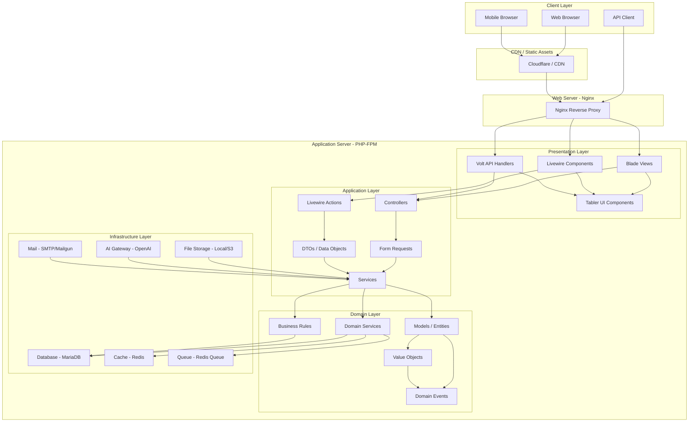
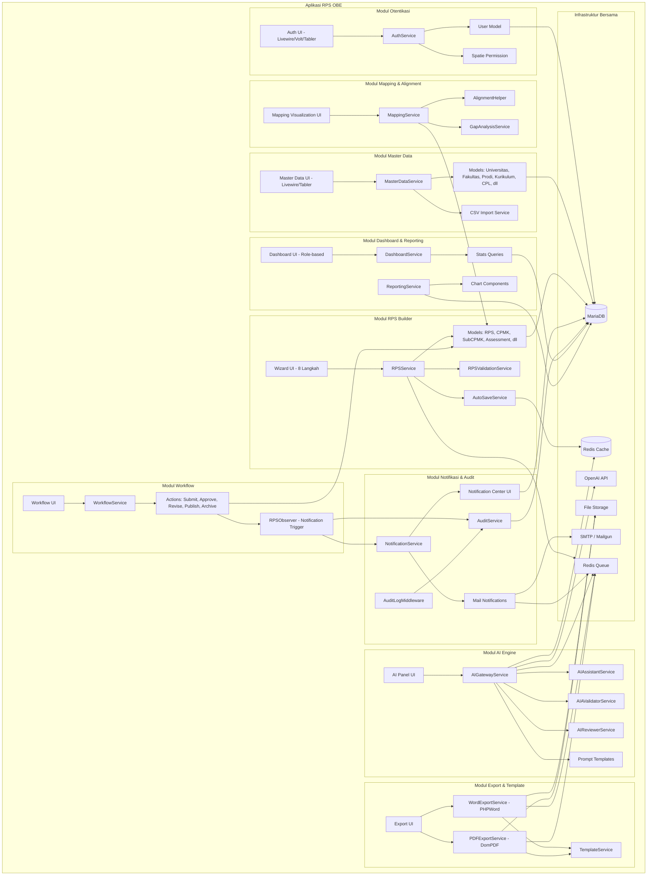
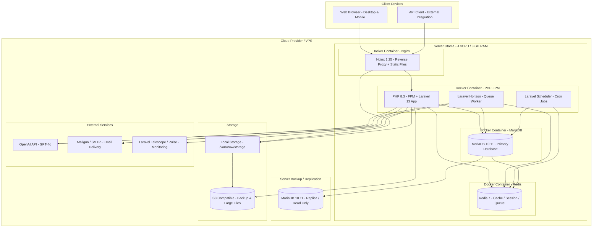
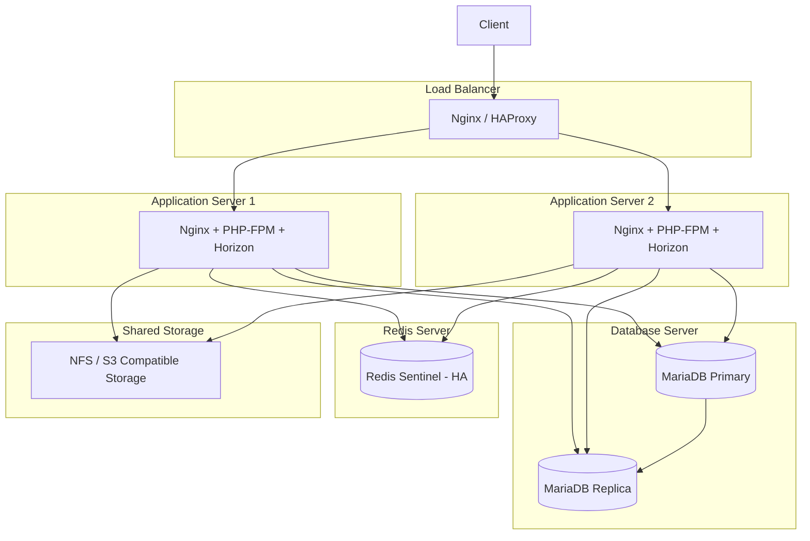
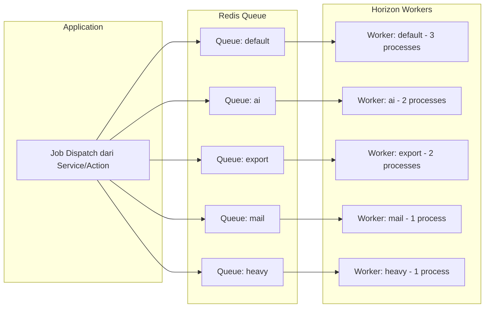

# 22 — System Architecture

## Ikhtisar Arsitektur Sistem

RPS OBE mengadopsi arsitektur **Layered Architecture** dengan prinsip **Separation of Concerns** yang ketat. Arsitektur ini terdiri dari empat lapisan utama: **Presentation**, **Application**, **Domain**, dan **Infrastructure**. Setiap lapisan memiliki tanggung jawab yang jelas dan hanya bergantung pada lapisan di bawahnya.

Pendekatan ini memastikan bahwa logika bisnis tetap independen dari framework, database, maupun antarmuka pengguna, sehingga memudahkan pengujian, pemeliharaan, dan pengembangan fitur baru.

---

## Diagram Arsitektur Tingkat Tinggi (High-Level Architecture)



---

## Arsitektur Berlapis (Layered Architecture)

### 1. Presentation Layer (Lapisan Presentasi)

Lapisan ini bertanggung jawab atas interaksi dengan pengguna. Seluruh logika tampilan dan interaksi UI ditempatkan di sini.

| Komponen | Teknologi | Deskripsi |
|----------|-----------|-----------|
| Blade Views | Laravel Blade | Template engine untuk rendering HTML di sisi server |
| Livewire Components | Livewire 3 | Komponen reaktif full-stack tanpa JavaScript terpisah |
| Volt API Handlers | Laravel Volt | Functional API untuk Livewire dengan sintaks deklaratif |
| Tabler UI | Tabler.io | Komponen UI berbasis Bootstrap 5 dengan desain minimalis |
| Tabler Icons | Tabler Icons | Library ikon SVG open-source (4000+ ikon) |
| Alpine.js | Alpine.js (bundled Livewire) | Interaktivitas ringan di sisi klien |

**Prinsip Presentation Layer:**
- Tidak ada logika bisnis di dalam Livewire component atau Blade view
- Setiap Livewire component hanya memanggil Service dari Application Layer
- State management ditangani oleh Livewire dengan hydration/dehydration
- Komponen Tabler digunakan secara konsisten untuk seluruh UI

### 2. Application Layer (Lapisan Aplikasi)

Lapisan ini mengorkestrasi alur kerja (workflow) aplikasi. Lapisan ini tidak memiliki logika bisnis, melainkan mendelegasikan kepada Domain Layer.

| Komponen | Deskripsi |
|----------|-----------|
| Controllers | Menerima HTTP request, memvalidasi input, dan mengembalikan response |
| Livewire Actions | Method di dalam Livewire component yang menangani interaksi pengguna |
| Form Requests | Validasi input terpisah dari controller, reusable lintas endpoint |
| DTOs (Data Transfer Objects) | Objek sederhana untuk mentransfer data antar lapisan |
| Services | Kelas yang mengorkestrasi alur bisnis dengan memanggil Domain Services dan Models |
| Actions | Kelas aksi tunggal (single-action) untuk operasi spesifik |

**Prinsip Application Layer:**
- Services tidak mengandung aturan bisnis
- Setiap service method merepresentasikan satu use case
- Form Request memastikan data yang masuk selalu valid
- DTO digunakan untuk mengirim data terstruktur antar lapisan

### 3. Domain Layer (Lapisan Domain)

Lapisan ini adalah inti dari sistem. Seluruh aturan bisnis, model domain, dan logika inti berada di sini. Lapisan ini **tidak bergantung pada framework atau infrastruktur**.

| Komponen | Deskripsi |
|----------|-----------|
| Models / Entities | Representasi objek domain seperti RPS, CPMK, User, dsb |
| Value Objects | Objek immutable yang mendeskripsikan aspek domain (contoh: `BobotAssessment`, `LevelTaksonomi`) |
| Domain Events | Event yang mencatat kejadian penting dalam domain (contoh: `RPSSubmittedForReview`) |
| Domain Services | Logika bisnis yang tidak cocok dimiliki oleh satu entity |
| Business Rules | Aturan bisnis yang dienkapsulasi dalam kelas terpisah (contoh: `ConstructiveAlignmentRule`) |
| Enums | Enum PHP 8.1+ untuk status RPS, role, kategori CPL, dsb |
| Exceptions | Domain-specific exceptions (contoh: `InvalidWorkflowTransitionException`) |

**Prinsip Domain Layer:**
- Zero dependency pada framework
- Tidak ada reference ke HTTP, database, atau file system
- Semua aturan bisnis terdokumentasi dalam kode
- Setiap entity memiliki interface yang jelas
- Domain Events digunakan untuk komunikasi antar bounded context

### 4. Infrastructure Layer (Lapisan Infrastruktur)

Lapisan ini menyediakan implementasi teknis untuk mendukung lapisan di atasnya. Semua dependensi eksternal (database, cache, queue, file storage, API eksternal) dikelola di sini.

| Komponen | Teknologi | Deskripsi |
|----------|-----------|-----------|
| Database | MariaDB 10.11+ | Relational database dengan dukungan JSON, full-text search |
| Cache | Redis 7+ | In-memory data store untuk caching, session, dan real-time |
| Queue | Redis Queue / Laravel Horizon | Job queue untuk operasi async (AI, export, email) |
| File Storage | Laravel Filesystem (local/S3) | Penyimpanan file dengan abstraksi disk |
| AI Gateway | OpenAI API (GPT-4o) | Integrasi AI untuk generate, validasi, dan review |
| Mail | SMTP / Mailgun / SES | Pengiriman email transaksional dan notifikasi |
| Search | Laravel Scout / MariaDB Full-text | Pencarian penuh teks untuk data master dan RPS |
| Logging | Laravel Log (daily / stack) | Pencatatan log aplikasi dan error |

---

## Diagram Komponen (Component Diagram)



---

## Diagram Deployment (Deployment Diagram)



### Infrastruktur Minimum

| Lingkungan | Server | Spesifikasi | Estimasi Biaya/Bulan |
|------------|--------|-------------|---------------------|
| Development | 1 VPS (Docker) | 2 vCPU, 4 GB RAM, 80 GB SSD | ~Rp 300.000 |
| Staging | 1 VPS (Docker) | 2 vCPU, 4 GB RAM, 80 GB SSD | ~Rp 300.000 |
| Production (Basic) | 1 VPS (Docker) | 4 vCPU, 8 GB RAM, 160 GB SSD | ~Rp 1.200.000 |
| Production (Scale) | 2 VPS + Load Balancer | 4 vCPU, 8 GB RAM, 160 GB SSD | ~Rp 3.000.000 |

### Infrastruktur Production (Scale-Up)



---

## Detail Tech Stack

### Backend Framework

| Komponen | Teknologi | Versi | Alasan Pemilihan |
|----------|-----------|-------|-----------------|
| Framework | Laravel | 13.x | Ekosistem PHP paling matang, komunitas besar, tools lengkap |
| PHP | PHP | 8.3+ | Enum, readonly class, fibers, performance improvements |
| Web Server | Nginx | 1.25+ | Performa tinggi, reverse proxy, static file serving |
| Process Manager | PHP-FPM | 8.3+ | Pool management, opcache, JIT compiler |

### Database & Cache

| Komponen | Teknologi | Versi | Alasan Pemilihan |
|----------|-----------|-------|-----------------|
| Database | MariaDB | 10.11+ | MySQL-compatible, performa tinggi, JSON support, open-source |
| Cache Driver | Redis | 7+ | Key-value store, pub/sub, data structures, persistence |
| Cache Backend | `redis` | — | Digunakan untuk: query cache, view cache, AI response cache, rate limiter, session store |
| ORM | Eloquent | (Laravel) | Active record pattern, relationship eager loading, global scopes untuk tenant |

### Frontend & UI

| Komponen | Teknologi | Versi | Alasan Pemilihan |
|----------|-----------|-------|-----------------|
| Templating | Laravel Blade | (Laravel 13) | Template engine native Laravel, komponen Blade, layout inheritance |
| Reactive UI | Livewire | 3.x | Full-stack reactivity tanpa JavaScript framework terpisah, hydration/dehydration, wire:model |
| Functional API | Volt | 1.x | Single-file Livewire components, sintaks lebih ringkas |
| UI Library | Tabler | 1.x | Bootstrap 5 based, komponen siap pakai, dark mode, aksesibilitas |
| Icons | Tabler Icons | 3.x | 4000+ ikon SVG, ringan, konsisten dengan Tabler |
| CSS Framework | Bootstrap | 5.3.x | Grid system, utilities, responsive utilities |
| JS Ringan | Alpine.js | (bundled) | Toggle, dropdown, modal ringan tanpa build step |

### Package & Library Ecosystem

| Package | Fungsi | Versi |
|---------|--------|-------|
| `spatie/laravel-permission` | Role-Based Access Control (RBAC) | 6.x |
| `spatie/laravel-medialibrary` | File upload dan attachment management | 11.x |
| `spatie/laravel-activitylog` | Activity & audit logging | 4.x |
| `openai-php/client` | OpenAI API client untuk PHP | 0.9+ |
| `phpoffice/phpword` | Generate dokumen Word (.docx) | 2.x |
| `dompdf/dompdf` | Generate dokumen PDF dari HTML | 3.x |
| `maatwebsite/laravel-excel` | Import/export CSV/Excel | 3.x |
| `laravel/sanctum` | API token authentication (SPA + API) | 4.x |
| `laravel/horizon` | Queue monitoring dan dashboard | 5.x |
| `laravel/telescope` | Debugging dan monitoring development | 5.x |
| `laravel/pulse` | Real-time server monitoring | 1.x |
| `laravel/scout` | Full-text search abstraction | 10.x |
| `barryvdh/laravel-debugbar` | Debug toolbar (development only) | 3.x |

---

## Struktur Direktori

Berikut adalah struktur direktori yang diusulkan untuk proyek RPS OBE:

```
rps-obe/
├── app/
│   ├── Actions/                      # Single-action classes
│   │   ├── Auth/
│   │   │   └── LoginAction.php
│   │   ├── RPS/
│   │   │   ├── SubmitForReviewAction.php
│   │   │   ├── ApproveRPSAction.php
│   │   │   ├── RequestRevisionAction.php
│   │   │   ├── PublishRPSAction.php
│   │   │   └── ArchiveRPSAction.php
│   │   └── User/
│   │       └── CreateUserAction.php
│   │
│   ├── Console/
│   │   └── Commands/
│   │       ├── SendReminderReview.php
│   │       ├── PruneOldAuditLogs.php
│   │       ├── GenerateWeeklyReport.php
│   │       └── CleanExpiredAICache.php
│   │
│   ├── DTO/                          # Data Transfer Objects
│   │   ├── AI/
│   │   │   ├── AIRequest.php
│   │   │   ├── AIResponse.php
│   │   │   ├── ValidationResult.php
│   │   │   └── ReviewResult.php
│   │   ├── RPS/
│   │   │   ├── RPSData.php
│   │   │   ├── CPMKData.php
│   │   │   ├── SubCPMKData.php
│   │   │   └── AssessmentData.php
│   │   └── User/
│   │       └── UserProfileData.php
│   │
│   ├── Enums/                        # PHP 8.1+ Enums
│   │   ├── RPSStatus.php
│   │   ├── KategoriCPL.php
│   │   ├── LevelTaksonomi.php
│   │   ├── JenisAssessment.php
│   │   ├── JenjangPendidikan.php
│   │   ├── SemesterTipe.php
│   │   └── UserRole.php
│   │
│   ├── Events/                       # Domain Events
│   │   ├── RPSSubmittedForReview.php
│   │   ├── RPSApproved.php
│   │   ├── RPSPublished.php
│   │   ├── RPSRevisionRequested.php
│   │   ├── ReviewerAssigned.php
│   │   └── UserRegistered.php
│   │
│   ├── Exceptions/                   # Custom Exceptions
│   │   ├── Domain/
│   │   │   ├── InvalidWorkflowTransitionException.php
│   │   │   ├── ConstructiveAlignmentException.php
│   │   │   ├── BusinessRuleViolationException.php
│   │   │   └── TenantMismatchException.php
│   │   └── AI/
│   │       ├── AIQuotaExceededException.php
│   │       └── AITimeoutException.php
│   │
│   ├── Exports/                      # Data Export Classes
│   │   ├── RPSExport.php
│   │   ├── AuditExport.php
│   │   ├── UserExport.php
│   │   └── ReportExport.php
│   │
│   ├── Helpers/                      # Helper/Utility Classes
│   │   ├── RPS/
│   │   │   └── AlignmentHelper.php
│   │   ├── Word/
│   │   │   └── WordTemplateHelper.php
│   │   └── Taksonomi/
│   │       └── BloomHelper.php
│   │
│   ├── Http/
│   │   ├── Controllers/
│   │   │   ├── Api/
│   │   │   │   └── V1/
│   │   │   │       ├── AuthController.php
│   │   │   │       ├── UserController.php
│   │   │   │       ├── MasterDataController.php
│   │   │   │       ├── RPSController.php
│   │   │   │       ├── AIController.php
│   │   │   │       ├── ExportController.php
│   │   │   │       ├── DashboardController.php
│   │   │   │       └── ReportController.php
│   │   │   └── Web/
│   │   │       └── WebController.php
│   │   │
│   │   ├── Middleware/
│   │   │   ├── Authenticate.php
│   │   │   ├── TenantMiddleware.php
│   │   │   ├── AuditLogMiddleware.php
│   │   │   ├── RateLimitMiddleware.php
│   │   │   └── ForcePasswordChange.php
│   │   │
│   │   └── Requests/
│   │       ├── Auth/
│   │       │   ├── LoginRequest.php
│   │       │   └── RegisterRequest.php
│   │       ├── RPS/
│   │       │   ├── StoreRPSRequest.php
│   │       │   ├── UpdateRPSRequest.php
│   │       │   └── ReviewRequest.php
│   │       └── MasterData/
│   │           ├── StoreFakultasRequest.php
│   │           ├── StoreProdiRequest.php
│   │           ├── StoreKurikulumRequest.php
│   │           ├── StoreCPLRequest.php
│   │           └── StoreMataKuliahRequest.php
│   │
│   ├── Imports/                      # CSV Import Classes
│   │   ├── UserImport.php
│   │   ├── MataKuliahImport.php
│   │   ├── CPLImport.php
│   │   └── MahasiswaImport.php
│   │
│   ├── Jobs/                         # Queue Jobs
│   │   ├── AI/
│   │   │   ├── GenerateCPMKJob.php
│   │   │   ├── GenerateSubCPMKJob.php
│   │   │   ├── RunValidationJob.php
│   │   │   └── RunAIReviewJob.php
│   │   ├── Export/
│   │   │   ├── WordExportJob.php
│   │   │   ├── PDFExportJob.php
│   │   │   └── BatchExportJob.php
│   │   └── Notification/
│   │       ├── SendEmailJob.php
│   │       └── SendBatchNotificationJob.php
│   │
│   ├── Listeners/                    # Event Listeners
│   │   ├── SendReviewNotification.php
│   │   ├── LogRPSEvent.php
│   │   └── UpdateDashboardStats.php
│   │
│   ├── Livewire/                     # Livewire Components
│   │   ├── Auth/
│   │   │   ├── Login.php
│   │   │   ├── Register.php
│   │   │   └── ForgotPassword.php
│   │   ├── User/
│   │   │   ├── UserIndex.php
│   │   │   ├── UserCreate.php
│   │   │   ├── UserEdit.php
│   │   │   └── Profile.php
│   │   ├── MasterData/
│   │   │   ├── Fakultas/
│   │   │   ├── ProgramStudi/
│   │   │   ├── Kurikulum/
│   │   │   ├── MataKuliah/
│   │   │   ├── CPL/
│   │   │   ├── Dosen/
│   │   │   └── Referensi/
│   │   ├── RPS/
│   │   │   ├── Builder/
│   │   │   │   ├── Step1InformasiMK.php
│   │   │   │   ├── Step2PilihCPL.php
│   │   │   │   ├── Step3CPMK.php
│   │   │   │   ├── Step4SubCPMK.php
│   │   │   │   ├── Step5Materi.php
│   │   │   │   ├── Step6Metode.php
│   │   │   │   ├── Step7Assessment.php
│   │   │   │   └── Step8Review.php
│   │   │   ├── RPSIndex.php
│   │   │   └── RPSDetail.php
│   │   ├── AI/
│   │   │   ├── AIGenerateButton.php
│   │   │   ├── AIValidationPanel.php
│   │   │   └── AIReviewPanel.php
│   │   ├── Workflow/
│   │   │   ├── ReviewForm.php
│   │   │   └── WorkflowHistory.php
│   │   ├── Dashboard/
│   │   │   ├── DosenDashboard.php
│   │   │   ├── KaprodiDashboard.php
│   │   │   └── LPMDashboard.php
│   │   ├── Export/
│   │   │   └── ExportButton.php
│   │   └── Notification/
│   │       └── NotificationCenter.php
│   │
│   ├── Mail/                         # Mail Classes
│   │   ├── UserInvitationMail.php
│   │   ├── RPSSubmittedMail.php
│   │   ├── RPSReviewedMail.php
│   │   ├── RPSApprovedMail.php
│   │   └── PasswordResetMail.php
│   │
│   ├── Models/                       # Eloquent Models
│   │   ├── User.php
│   │   ├── Tenant.php
│   │   ├── Universitas.php
│   │   ├── Fakultas.php
│   │   ├── ProgramStudi.php
│   │   ├── Kurikulum.php
│   │   ├── Semester.php
│   │   ├── MataKuliah.php
│   │   ├── Dosen.php
│   │   ├── ProfilLulusan.php
│   │   ├── CPL.php
│   │   ├── CPMK.php
│   │   ├── SubCPMK.php
│   │   ├── RPS.php
│   │   ├── RPS_CPL.php
│   │   ├── RPS_CPMK.php
│   │   ├── MateriPertemuan.php
│   │   ├── MetodePembelajaran.php
│   │   ├── Assessment.php
│   │   ├── AssessmentSubCPMK.php
│   │   ├── Rubrik.php
│   │   ├── Referensi.php
│   │   ├── RPSVersion.php
│   │   ├── TemplateRPS.php
│   │   ├── Notification.php
│   │   ├── AuditLog.php
│   │   └── Invitation.php
│   │
│   ├── Notifications/                # Laravel Notifications
│   │   ├── RPSSubmittedForReview.php
│   │   ├── RPSReviewed.php
│   │   ├── RPSApproved.php
│   │   ├── RPSRevisionRequested.php
│   │   ├── RPSPublished.php
│   │   └── ReviewerAssigned.php
│   │
│   ├── Observers/                    # Eloquent Observers
│   │   ├── RPSObserver.php
│   │   ├── UserObserver.php
│   │   └── RPSVersionObserver.php
│   │
│   ├── Prompts/                      # AI Prompt Templates (.txt)
│   │   ├── assistant/
│   │   │   ├── generate_cpmk.txt
│   │   │   ├── generate_subcpmk.txt
│   │   │   ├── generate_materi.txt
│   │   │   ├── generate_referensi.txt
│   │   │   ├── generate_assessment.txt
│   │   │   └── generate_rubrik.txt
│   │   ├── validator/
│   │   │   ├── validate_taksonomi.txt
│   │   │   ├── validate_alignment.txt
│   │   │   ├── validate_cpmk_count.txt
│   │   │   ├── validate_pertemuan.txt
│   │   │   ├── validate_assessment.txt
│   │   │   ├── validate_bobot.txt
│   │   │   ├── validate_referensi.txt
│   │   │   └── validate_konsistensi.txt
│   │   └── reviewer/
│   │       └── review_rps.txt
│   │
│   ├── Providers/                    # Service Providers
│   │   ├── AppServiceProvider.php
│   │   ├── AuthServiceProvider.php
│   │   ├── EventServiceProvider.php
│   │   ├── RouteServiceProvider.php
│   │   ├── HorizonServiceProvider.php
│   │   └── TelescopeServiceProvider.php
│   │
│   ├── Queries/                      # Query Objects (Read Model)
│   │   ├── DosenStatsQuery.php
│   │   ├── KaprodiStatsQuery.php
│   │   ├── LPMStatsQuery.php
│   │   └── RPSListQuery.php
│   │
│   ├── Rules/                        # Custom Validation Rules
│   │   ├── MustBelongToTenant.php
│   │   ├── TotalBobotAssessmentIs100.php
│   │   ├── CPLMustExistInProdi.php
│   │   └── ValidWorkflowTransition.php
│   │
│   ├── Services/                     # Application & Domain Services
│   │   ├── Auth/
│   │   │   └── AuthService.php
│   │   ├── User/
│   │   │   ├── UserService.php
│   │   │   └── InvitationService.php
│   │   ├── MasterData/
│   │   │   └── MasterDataService.php
│   │   ├── RPS/
│   │   │   ├── RPSService.php
│   │   │   ├── RPSAutoSaveService.php
│   │   │   ├── RPSValidationService.php
│   │   │   └── MappingService.php
│   │   ├── AI/
│   │   │   ├── AIGatewayService.php
│   │   │   ├── AIAssistantService.php
│   │   │   ├── AIValidatorService.php
│   │   │   └── AIReviewerService.php
│   │   ├── Workflow/
│   │   │   ├── WorkflowService.php
│   │   │   └── ReviewerAssignmentService.php
│   │   ├── Export/
│   │   │   ├── WordExportService.php
│   │   │   └── PDFExportService.php
│   │   ├── Notification/
│   │   │   ├── NotificationService.php
│   │   │   └── EmailService.php
│   │   ├── Versioning/
│   │   │   └── VersioningService.php
│   │   ├── Audit/
│   │   │   └── AuditService.php
│   │   ├── Template/
│   │   │   └── TemplateService.php
│   │   ├── Dashboard/
│   │   │   └── DashboardService.php
│   │   └── Report/
│   │       └── ReportingService.php
│   │
│   ├── Traits/                       # Shared Traits
│   │   ├── BelongsToTenant.php
│   │   ├── Auditable.php
│   │   ├── HasUlidKey.php
│   │   └── SoftDeletesWithAudit.php
│   │
│   └── View/                         # View Models / Composers
│       └── Composers/
│           ├── TenantComposer.php
│           └── NavigationComposer.php
│
├── config/
│   ├── app.php
│   ├── auth.php
│   ├── database.php
│   ├── cache.php
│   ├── queue.php
│   ├── filesystems.php
│   ├── ai.php                        # AI configuration (model, budget, limits)
│   ├── rps.php                       # RPS configuration (meetings, taksonomi, bobot)
│   ├── tenant.php                    # Multi-tenant configuration
│   └── mail.php
│
├── database/
│   ├── migrations/                   # Database migrations
│   ├── seeders/                      # Database seeders
│   │   ├── DatabaseSeeder.php
│   │   ├── RolePermissionSeeder.php
│   │   ├── TenantSeeder.php
│   │   └── SampleDataSeeder.php
│   └── factories/                    # Model factories (testing)
│
├── resources/
│   ├── views/
│   │   ├── layouts/
│   │   │   ├── app.blade.php         # Main layout (Tabler)
│   │   │   ├── auth.blade.php        # Auth layout
│   │   │   └── blank.blade.php       # Minimal layout
│   │   ├── components/               # Blade components
│   │   │   ├── alerts.blade.php
│   │   │   ├── modals.blade.php
│   │   │   ├── tables.blade.php
│   │   │   ├── forms/
│   │   │   │   ├── input.blade.php
│   │   │   │   ├── select.blade.php
│   │   │   │   ├── textarea.blade.php
│   │   │   │   └── wysiwyg.blade.php
│   │   │   ├── cards/
│   │   │   │   ├── stat-card.blade.php
│   │   │   │   └── info-card.blade.php
│   │   │   └── navigation/
│   │   │       ├── sidebar.blade.php
│   │   │       ├── header.blade.php
│   │   │       └── breadcrumb.blade.php
│   │   ├── livewire/                 # Livewire component views
│   │   ├── emails/                   # Email templates
│   │   │   ├── invitation.blade.php
│   │   │   ├── rps-submitted.blade.php
│   │   │   ├── rps-reviewed.blade.php
│   │   │   └── rps-approved.blade.php
│   │   └── pdf/                      # PDF templates
│   │       └── rps-export.blade.php
│   ├── css/
│   │   └── app.css                   # Custom CSS (Tabler-based)
│   └── js/
│       └── app.js                    # Minimal JS (Alpine.js)
│
├── routes/
│   ├── web.php                       # Web routes (Livewire pages)
│   ├── api.php                       # API routes (v1)
│   └── console.php                   # Console routes (scheduler)
│
├── storage/
│   ├── app/
│   │   ├── public/                   # Publicly accessible files
│   │   │   ├── logos/                # University logos
│   │   │   └── exports/              # Generated exports (temporary)
│   │   └── private/                  # Private files
│   │       ├── templates/            # Word/PDF templates per tenant
│   │       │   ├── default/
│   │       │   │   └── rps-template.docx
│   │       │   └── {tenant_id}/
│   │       │       └── rps-template.docx
│   │       ├── imports/              # CSV upload temp files
│   │       └── backups/              # Tenant backups
│   ├── framework/                    # Laravel framework storage
│   └── logs/                         # Application logs
│
├── tests/
│   ├── Unit/
│   │   ├── Domain/
│   │   │   ├── RPSStatusTest.php
│   │   │   ├── ConstructiveAlignmentTest.php
│   │   │   └── BusinessRulesTest.php
│   │   └── Services/
│   │       ├── RPSServiceTest.php
│   │       └── WorkflowServiceTest.php
│   ├── Feature/
│   │   ├── Api/
│   │   │   ├── AuthTest.php
│   │   │   ├── RPSTest.php
│   │   │   └── AITest.php
│   │   ├── Livewire/
│   │   │   ├── BuilderWizardTest.php
│   │   │   └── UserManagementTest.php
│   │   └── Workflow/
│   │       └── ReviewCycleTest.php
│   └── CreatesApplication.php
│
├── composer.json
├── package.json
├── vite.config.js
├── .env
├── .env.example
├── artisan
└── README.md
```

---

## Strategi Cache (Redis)

Redis digunakan sebagai cache utama untuk beberapa keperluan:

### Tipe Cache

| Tipe Cache | Key Pattern | TTL | Keterangan |
|------------|-------------|-----|------------|
| Query Result | `query:{hash_sql}` | 15 menit | Cache hasil query berat (dashboard stats, report) |
| Master Data | `master:{entity}:{tenant_id}` | 60 menit | Cache data master yang jarang berubah (fakultas, prodi, kurikulum) |
| CPL & CPMK | `cpl:{tenant_id}:{prodi_id}` | 30 menit | Cache CPL dan CPMK untuk dropdown dan mapping |
| RPS Draft | `rps:draft:{rps_id}:{user_id}` | 5 menit | Auto-save state dari RPS builder wizard |
| AI Response | `ai:response:{prompt_type}:{hash}` | 60 menit | Cache respons AI untuk input yang identik |
| AI Validation | `ai:val:{rps_id}:{version}` | 30 menit | Cache hasil validasi AI untuk versi RPS |
| Rate Limiter | `rate:{user_id}:{action}` | 1 menit | Rate limiting untuk API dan AI requests |
| Session | `session:{session_id}` | Sesuai config | Session storage untuk scalability |
| View Cache | `view:{template}:{hash}` | 60 menit | Cache compiled Blade views |
| Configuration | `config:{tenant_id}` | 24 jam | Cache konfigurasi per tenant |

### Strategi Invalidation

```php
// Invalidate dengan pattern (Redis SCAN + DELETE)
Cache::tags(['rps'])->flush();          // Flush all RPS-related cache
Cache::tags(['master', 'prodi'])->flush(); // Flush specific tags

// Invalidate otomatis via Observer
class RPSObserver
{
    public function saved(RPS $rps)
    {
        Cache::tags(['rps', "rps:{$rps->id}"])->flush();
        Cache::forget("rps:draft:{$rps->id}:{$rps->user_id}");
    }
}

// Invalidate via event
Event::listen(RPSPublished::class, function ($event) {
    Cache::tags(['dashboard', 'report'])->flush();
});
```

### Redis Configuration (`config/database.php`)

```php
'redis' => [
    'client' => env('REDIS_CLIENT', 'phpredis'),

    'options' => [
        'cluster' => env('REDIS_CLUSTER', 'redis'),
        'prefix' => env('REDIS_PREFIX', 'rps_obe_'),
    ],

    'default' => [
        'url' => env('REDIS_URL'),
        'host' => env('REDIS_HOST', '127.0.0.1'),
        'port' => env('REDIS_PORT', '6379'),
        'password' => env('REDIS_PASSWORD'),
        'database' => env('REDIS_DB', '0'),
    ],

    'cache' => [
        'url' => env('REDIS_URL'),
        'host' => env('REDIS_HOST', '127.0.0.1'),
        'port' => env('REDIS_PORT', '6379'),
        'password' => env('REDIS_PASSWORD'),
        'database' => env('REDIS_CACHE_DB', '1'),
    ],

    'queue' => [
        // ... database 2
    ],

    'session' => [
        // ... database 3
    ],
],
```

---

## Arsitektur Queue / Job

### Queue Infrastructure



### Job Queue Mapping

| Queue | Jobs | Prioritas | Retry | Timeout |
|-------|------|-----------|-------|---------|
| `default` | Notifikasi in-app, Update statistik, Versioning | High | 3x | 60s |
| `ai` | GenerateCPMKJob, GenerateSubCPMKJob, RunValidationJob, RunAIReviewJob | High | 2x | 120s |
| `export` | WordExportJob, PDFExportJob, BatchExportJob | Normal | 2x | 300s |
| `mail` | SendEmailJob, SendBatchNotificationJob | Normal | 3x | 30s |
| `heavy` | BulkImportJob, GenerateReportJob, PruneAuditLogs | Low | 1x | 600s |

### Horizon Configuration (`config/horizon.php`)

```php
'environments' => [
    'production' => [
        'supervisor-1' => [
            'maxProcesses' => 10,
            'balanceMaxShift' => 1,
            'balanceCooldown' => 3,
        ],
    ],
    'local' => [
        'supervisor-1' => [
            'maxProcesses' => 3,
        ],
    ],
],

'defaults' => [
    'supervisor-1' => [
        'connection' => 'redis',
        'queue' => ['default', 'ai', 'export', 'mail', 'heavy'],
        'balance' => 'auto',
        'autoScalingStrategy' => 'time',
        'maxProcesses' => 1,
        'maxTime' => 0,
        'maxJobs' => 0,
        'memory' => 128,
        'tries' => 3,
        'timeout' => 300,
        'nice' => 0,
    ],
],
```

### Job Chaining (Contoh: Generate Lengkap)

```php
class GenerateFullRPSJob extends Chain
{
    public function __construct(RPS $rps, array $context)
    {
        $this->jobs = [
            new GenerateCPMKJob($rps, $context),
            new GenerateSubCPMKJob($rps, $context),
            new GenerateMateriJob($rps, $context),
            new GenerateAssessmentJob($rps, $context),
            new GenerateReferensiJob($rps, $context),
        ];
    }
}
```

---

## Strategi Penyimpanan File

### Disk Configuration

| Disk | Driver | Path | Visibility | Purpose |
|------|--------|------|------------|---------|
| `local` | local | `storage/app` | private | Application files, templates |
| `public` | local | `storage/app/public` | public via symlink | Logos, exports (temporary) |
| `s3` | s3 | — | varied | Production backup, large files |
| `templates` | local | `storage/app/private/templates` | private | Word/PDF export templates |
| `exports` | local | `storage/app/public/exports` | public (temp) | Generated export files |
| `logos` | local | `storage/app/public/logos` | public | University logos |
| `imports` | local | `storage/app/private/imports` | private | CSV import temporary files |

### File Path Convention

```
storage/app/
├── private/
│   └── templates/
│       └── {tenant_id}/
│           ├── rps-template.docx       # Template utama export
│           └── cover-template.docx     # Template halaman cover
├── public/
│   ├── logos/
│   │   └── {tenant_id}/
│   │       └── universitas-logo.png    # Logo universitas (max 2MB)
│   └── exports/
│       └── {tenant_id}/
│           ├── rps-{rps_id}-{hash}.docx  # Export Word (auto-delete after 24h)
│           └── rps-{rps_id}-{hash}.pdf   # Export PDF (auto-delete after 24h)
└── logs/
    └── laravel-{date}.log
```

### File Cleanup

```php
// Scheduled command in Console/Kernel.php
$schedule->command('cleanup:temp-exports')->hourly();
$schedule->command('cleanup:old-imports')->daily();
$schedule->command('cleanup:orphan-files')->weekly();
```

---

**Navigasi:** [Sebelumnya: AI Integration](21-ai-integration.md) | [Daftar Isi](../README.md) | [Berikutnya: API Overview](23-api-overview.md)
