# 24 — Data Flow

## Diagram Aliran Data (Data Flow Diagrams)

Bab ini mendeskripsikan aliran data untuk proses-proses utama dalam sistem RPS OBE. Setiap diagram aliran data menjelaskan bagaimana data bergerak dari titik awal hingga akhir, termasuk interaksi dengan sistem eksternal dan penyimpanan data.

---

## 1. User Registration Flow

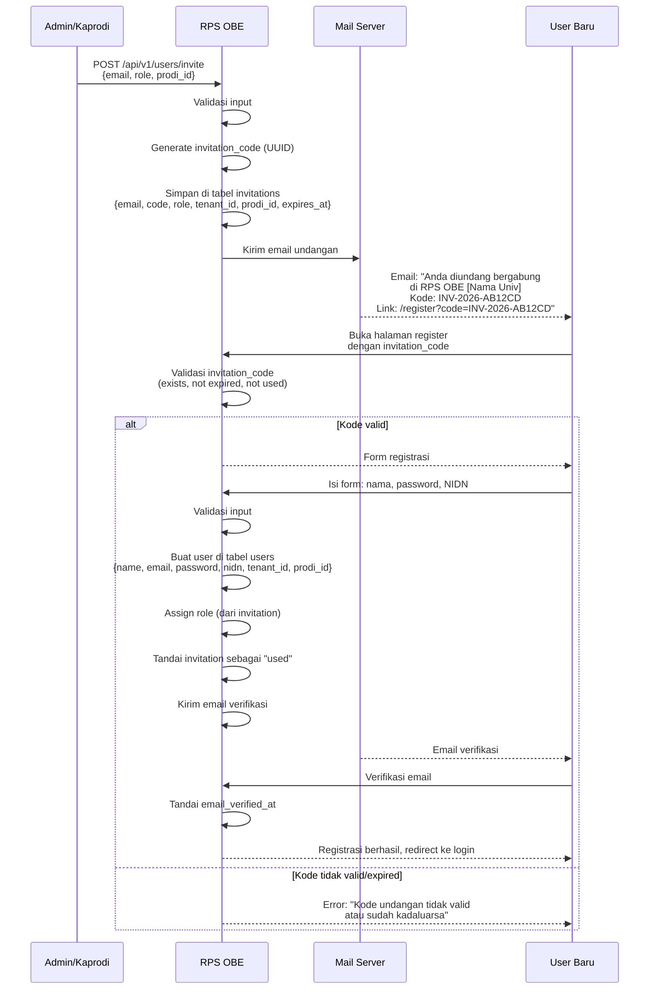

### Data yang Terlibat

| Tabel | Operasi | Data |
|-------|---------|------|
| `invitations` | INSERT | email, invitation_code, role, tenant_id, prodi_id, expires_at |
| `invitations` | UPDATE | status = 'used', used_at = NOW() |
| `users` | INSERT | name, email, password, nidn, tenant_id, prodi_id |
| `model_has_roles` | INSERT | role_id, model_type, model_id |

---

## 2. RPS Creation Data Flow (8-Step Wizard)

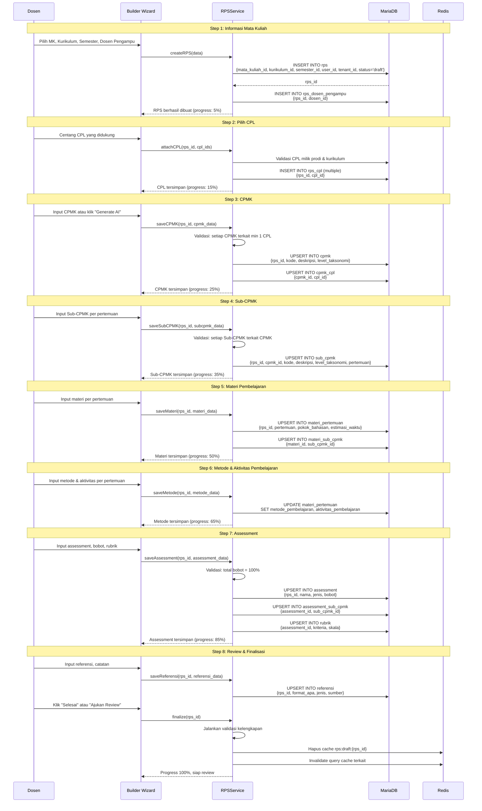

### Auto-Save Mechanism

```mermaid
sequenceDiagram
    participant Wizard as Builder Wizard
    participant Livewire as Livewire Component
    participant Redis as Redis Cache
    participant DB as MariaDB

    loop Setiap 30 detik (debounced)
        Wizard->>Livewire: Perubahan form terdeteksi
        Livewire->>Redis: SET rps:draft:{rps_id}:{step}<br/>data form terbaru (serialized)
        Redis-->>Livewire: OK
    end

    Dosen->>Wizard: Klik "Simpan" atau "Next Step"
    Wizard->>Livewire: Trigger save
    Livewire->>Redis: GET rps:draft:{rps_id}:{step}
    Redis-->>Livewire: Data terbaru
    Livewire->>DB: UPSERT data ke database
    Livewire->>Redis: DEL rps:draft:{rps_id}:{step}
    Livewire-->>Wizard: Data tersimpan

    Note over Wizard, DB: Jika browser crash, data masih ada di Redis (TTL: 1 jam)
    Note over Wizard, DB: Saat user kembali, Livewire restore dari Redis
```

---

## 3. Review Cycle Data Flow

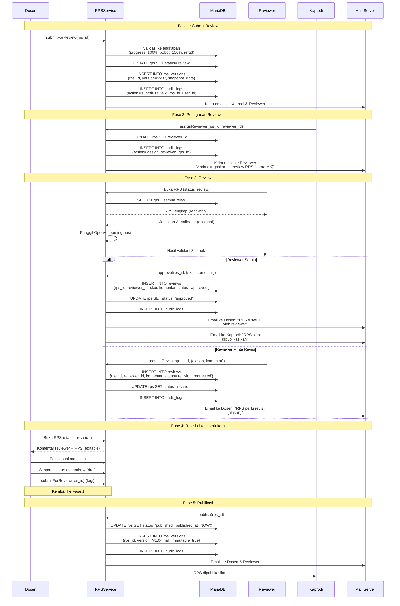

---

## 4. AI Generation Data Flow

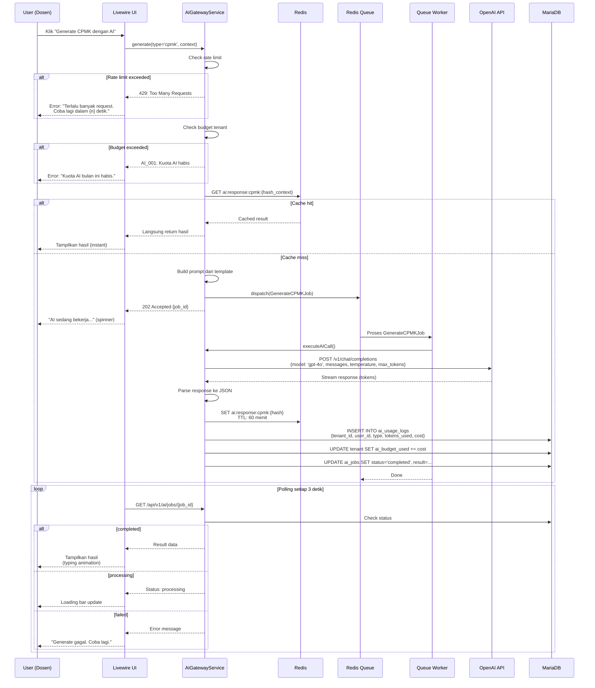

### AI Cost Tracking Data Flow

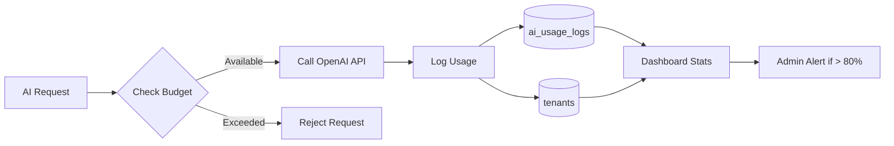

---

## 5. Export Generation Data Flow

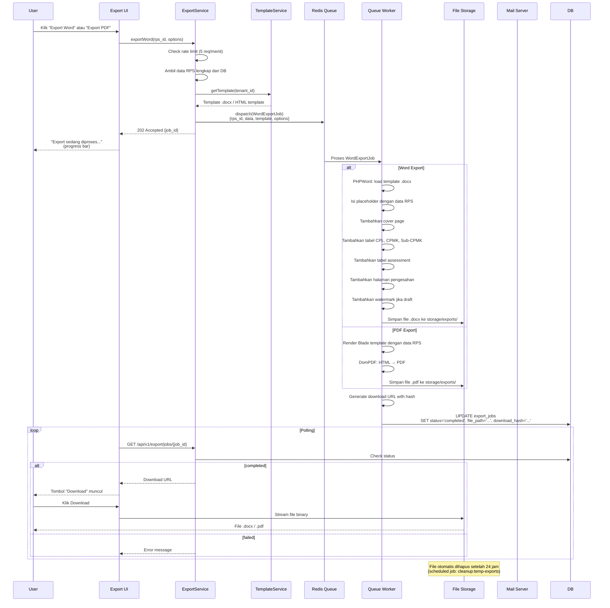

### Batch Export Data Flow

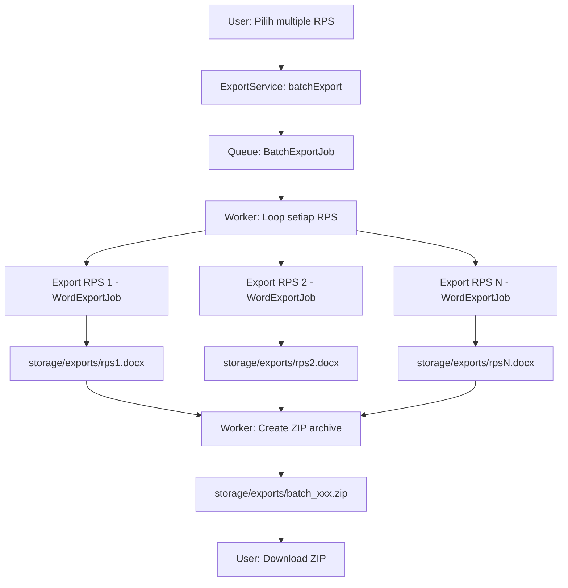

---

## 6. Notification Data Flow

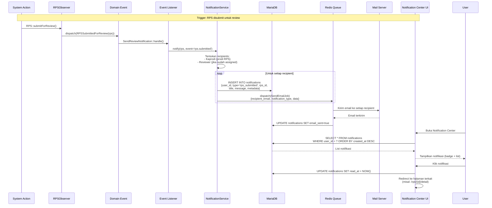

### Notification Channel Mapping

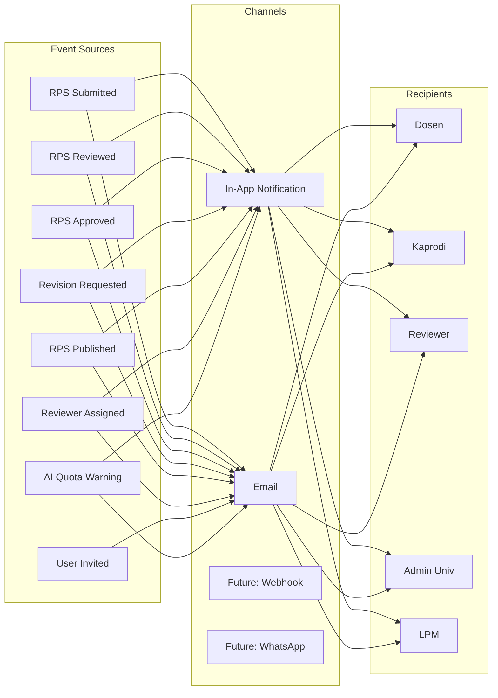

### Notification Digest Logic

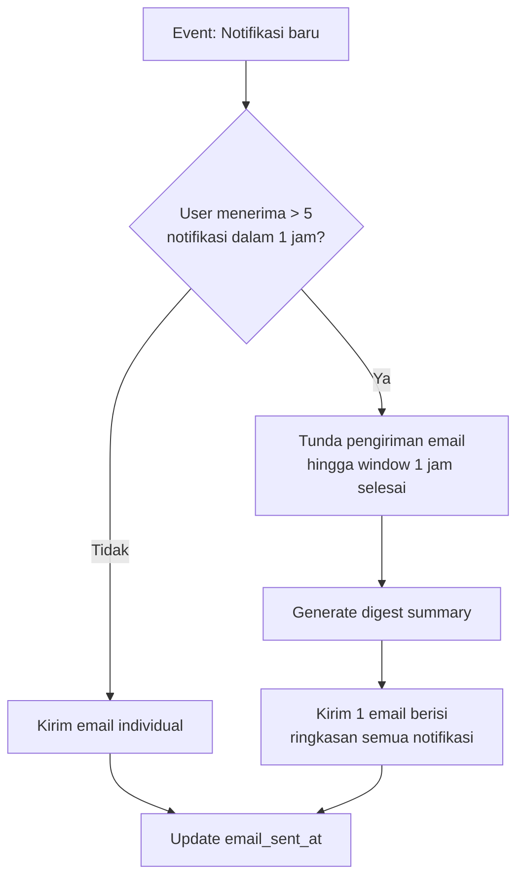

---

## 7. Audit Log Data Flow

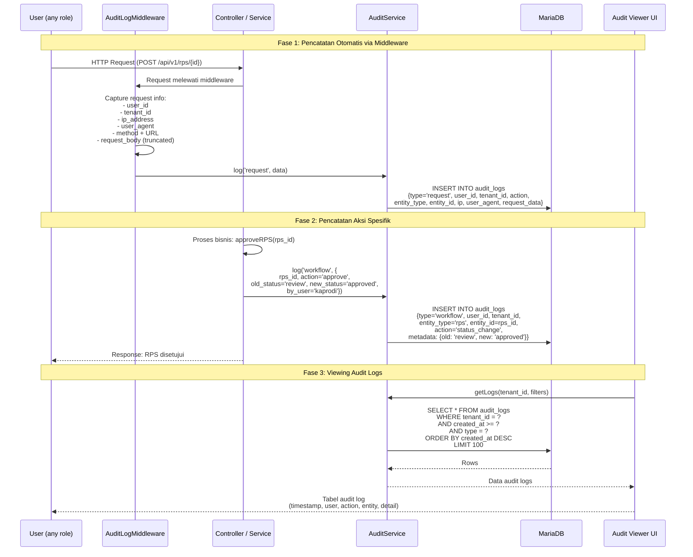

### Audit Log Table Structure

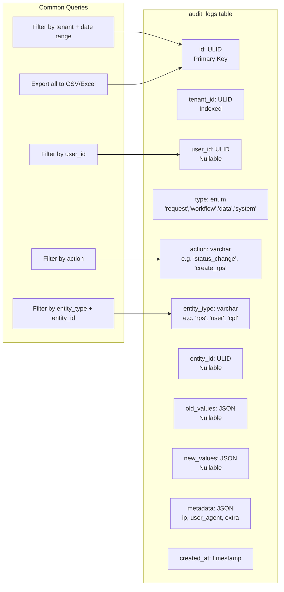

### Data Retention untuk Audit Log

| Level | Retensi | Tindakan |
|-------|---------|----------|
| Request logs | 90 hari | Auto-delete via scheduler |
| Workflow logs | Unlimited | Tetap disimpan (core audit) |
| Data change logs | 1 tahun | Archive ke S3, lalu hapus dari DB |
| AI usage logs | 2 tahun | Simpan di DB (cost tracking) |

---

**Navigasi:** [Sebelumnya: API Overview](23-api-overview.md) | [Daftar Isi](../README.md) | [Berikutnya: ERD Overview](25-erd-overview.md)
