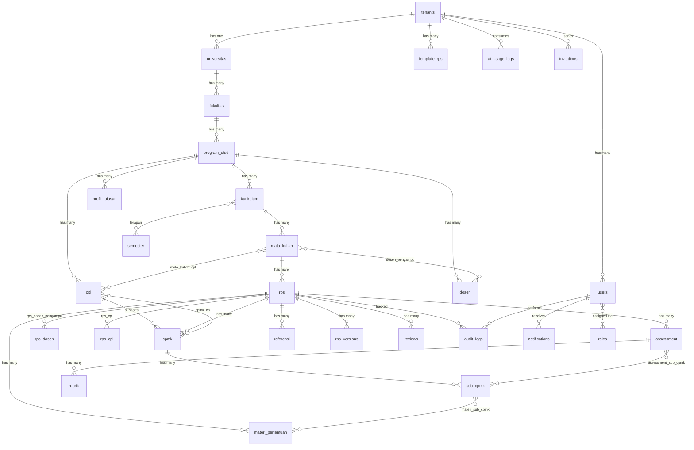

# 25 — ERD Overview

## Entity Relationship Diagram



---

## Daftar Lengkap Tabel Database

### 1. Tabel `tenants`

Digunakan untuk multi-tenancy. Setiap universitas adalah satu tenant.

| # | Kolom | Tipe | Constraint | Keterangan |
|---|-------|------|------------|------------|
| 1 | `id` | CHAR(26) | PK, ULID | Primary key menggunakan ULID |
| 2 | `name` | VARCHAR(150) | NOT NULL | Nama institusi/tenant |
| 3 | `slug` | VARCHAR(50) | UNIQUE, NOT NULL | Slug untuk routing dan identifikasi |
| 4 | `domain` | VARCHAR(255) | UNIQUE, NULLABLE | Custom domain (opsional) |
| 5 | `subdomain` | VARCHAR(100) | UNIQUE, NOT NULL | Subdomain tenant |
| 6 | `plan` | ENUM(basic,professional,enterprise) | NOT NULL, DEFAULT basic | Paket langganan |
| 7 | `status` | ENUM(active,suspended,trial) | NOT NULL, DEFAULT trial | Status tenant |
| 8 | `trial_ends_at` | TIMESTAMP | NULLABLE | Waktu berakhir trial |
| 9 | `subscription_ends_at` | TIMESTAMP | NULLABLE | Waktu berakhir langganan |
| 10 | `ai_budget_monthly` | DECIMAL(12,2) | NOT NULL, DEFAULT 0 | Budget AI bulanan (Rupiah) |
| 11 | `ai_budget_used` | DECIMAL(12,2) | NOT NULL, DEFAULT 0 | Budget AI yang sudah terpakai |
| 12 | `settings` | JSON | NULLABLE | Pengaturan tenant (logo, warna, dsb) |
| 13 | `created_at` | TIMESTAMP | NOT NULL | |
| 14 | `updated_at` | TIMESTAMP | NOT NULL | |
| 15 | `deleted_at` | TIMESTAMP | NULLABLE | Soft delete |

**Indexes:** UNIQUE(slug), UNIQUE(subdomain), UNIQUE(domain), INDEX(status)

---

### 2. Tabel `users`

Pengguna sistem dengan role-based access control.

| # | Kolom | Tipe | Constraint | Keterangan |
|---|-------|------|------------|------------|
| 1 | `id` | CHAR(26) | PK, ULID | Primary key |
| 2 | `tenant_id` | CHAR(26) | FK(tenants), NOT NULL | Tenant user terdaftar |
| 3 | `name` | VARCHAR(150) | NOT NULL | Nama lengkap pengguna |
| 4 | `email` | VARCHAR(255) | UNIQUE, NOT NULL | Email pengguna |
| 5 | `email_verified_at` | TIMESTAMP | NULLABLE | Waktu verifikasi email |
| 6 | `password` | VARCHAR(255) | NOT NULL | Password (bcrypt hashed) |
| 7 | `nidn` | VARCHAR(10) | UNIQUE, NULLABLE | Nomor Induk Dosen Nasional |
| 8 | `nip` | VARCHAR(18) | NULLABLE | Nomor Induk Pegawai |
| 9 | `gelar_depan` | VARCHAR(50) | NULLABLE | Gelar akademik depan |
| 10 | `gelar_belakang` | VARCHAR(50) | NULLABLE | Gelar akademik belakang |
| 11 | `avatar_url` | VARCHAR(500) | NULLABLE | URL foto profil |
| 12 | `phone` | VARCHAR(20) | NULLABLE | Nomor telepon |
| 13 | `status` | ENUM(active,inactive,suspended) | NOT NULL, DEFAULT active | Status akun |
| 14 | `force_password_change` | BOOLEAN | NOT NULL, DEFAULT false | Wajib ganti password saat login |
| 15 | `last_login_at` | TIMESTAMP | NULLABLE | Waktu login terakhir |
| 16 | `last_login_ip` | VARCHAR(45) | NULLABLE | IP login terakhir |
| 17 | `notification_preferences` | JSON | NULLABLE | Preferensi notifikasi user |
| 18 | `remember_token` | VARCHAR(100) | NULLABLE | Remember me token |
| 19 | `created_at` | TIMESTAMP | NOT NULL | |
| 20 | `updated_at` | TIMESTAMP | NOT NULL | |
| 21 | `deleted_at` | TIMESTAMP | NULLABLE | Soft delete |

**Indexes:** UNIQUE(email), UNIQUE(nidn), INDEX(tenant_id), INDEX(status)

---
### 3. Tabel `universitas`

Informasi universitas sebagai bagian dari satu tenant.

| # | Kolom | Tipe | Constraint | Keterangan |
|---|-------|------|------------|------------|
| 1 | `id` | CHAR(26) | PK, ULID | Primary key |
| 2 | `tenant_id` | CHAR(26) | FK(tenants), UNIQUE, NOT NULL | Setiap tenant = 1 universitas |
| 3 | `nama` | VARCHAR(200) | NOT NULL | Nama universitas |
| 4 | `akronim` | VARCHAR(20) | NOT NULL | Akronim (contoh: UI, UGM, ITB) |
| 5 | `kode` | VARCHAR(20) | UNIQUE, NOT NULL | Kode perguruan tinggi (PDDIKTI) |
| 6 | `alamat` | TEXT | NULLABLE | Alamat lengkap |
| 7 | `kota` | VARCHAR(100) | NULLABLE | Kota |
| 8 | `provinsi` | VARCHAR(100) | NULLABLE | Provinsi |
| 9 | `website` | VARCHAR(255) | NULLABLE | URL website resmi |
| 10 | `email` | VARCHAR(255) | NULLABLE | Email resmi universitas |
| 11 | `telepon` | VARCHAR(30) | NULLABLE | Nomor telepon |
| 12 | `logo_url` | VARCHAR(500) | NULLABLE | URL logo universitas |
| 13 | `akreditasi` | VARCHAR(10) | NULLABLE | Akreditasi institusi (A/B/C/Unggul) |
| 14 | `tanggal_berdiri` | DATE | NULLABLE | Tanggal pendirian |
| 15 | `created_at` | TIMESTAMP | NOT NULL | |
| 16 | `updated_at` | TIMESTAMP | NOT NULL | |
| 17 | `deleted_at` | TIMESTAMP | NULLABLE | Soft delete |

**Indexes:** UNIQUE(tenant_id), UNIQUE(kode), INDEX(akronim)

---

### 4. Tabel `fakultas`

| # | Kolom | Tipe | Constraint | Keterangan |
|---|-------|------|------------|------------|
| 1 | `id` | CHAR(26) | PK, ULID | Primary key |
| 2 | `tenant_id` | CHAR(26) | FK(tenants), NOT NULL | Tenant |
| 3 | `universitas_id` | CHAR(26) | FK(universitas), NOT NULL | Universitas induk |
| 4 | `kode` | VARCHAR(20) | NOT NULL | Kode fakultas |
| 5 | `nama` | VARCHAR(200) | NOT NULL | Nama fakultas |
| 6 | `akronim` | VARCHAR(20) | NULLABLE | Akronim fakultas |
| 7 | `dekan` | VARCHAR(150) | NULLABLE | Nama dekan |
| 8 | `akreditasi` | VARCHAR(10) | NULLABLE | Akreditasi fakultas |
| 9 | `created_at` | TIMESTAMP | NOT NULL | |
| 10 | `updated_at` | TIMESTAMP | NOT NULL | |
| 11 | `deleted_at` | TIMESTAMP | NULLABLE | Soft delete |

**Indexes:** INDEX(tenant_id), INDEX(universitas_id), UNIQUE(universitas_id, kode)

---

### 5. Tabel `program_studi`

| # | Kolom | Tipe | Constraint | Keterangan |
|---|-------|------|------------|------------|
| 1 | `id` | CHAR(26) | PK, ULID | Primary key |
| 2 | `tenant_id` | CHAR(26) | FK(tenants), NOT NULL | Tenant |
| 3 | `fakultas_id` | CHAR(26) | FK(fakultas), NOT NULL | Fakultas induk |
| 4 | `kode` | VARCHAR(20) | NOT NULL | Kode program studi (PDDIKTI) |
| 5 | `nama` | VARCHAR(200) | NOT NULL | Nama program studi |
| 6 | `akronim` | VARCHAR(20) | NULLABLE | Akronim prodi |
| 7 | `jenjang` | ENUM(D3,D4,S1,S2,S3,Profesi,Spesialis) | NOT NULL | Jenjang pendidikan |
| 8 | `akreditasi` | VARCHAR(10) | NULLABLE | Akreditasi prodi |
| 9 | `kaprodi` | VARCHAR(150) | NULLABLE | Nama ketua program studi |
| 10 | `status` | ENUM(active,inactive,merged) | NOT NULL, DEFAULT active | Status operasional |
| 11 | `created_at` | TIMESTAMP | NOT NULL | |
| 12 | `updated_at` | TIMESTAMP | NOT NULL | |
| 13 | `deleted_at` | TIMESTAMP | NULLABLE | Soft delete |

**Indexes:** INDEX(tenant_id), INDEX(fakultas_id), UNIQUE(fakultas_id, kode), INDEX(jenjang)

---

### 6. Tabel `profil_lulusan`

Profil lulusan program studi.

| # | Kolom | Tipe | Constraint | Keterangan |
|---|-------|------|------------|------------|
| 1 | `id` | CHAR(26) | PK, ULID | Primary key |
| 2 | `tenant_id` | CHAR(26) | FK(tenants), NOT NULL | Tenant |
| 3 | `program_studi_id` | CHAR(26) | FK(program_studi), NOT NULL | Prodi |
| 4 | `kode` | VARCHAR(10) | NOT NULL | Kode profil (PL-01, PL-02...) |
| 5 | `deskripsi` | TEXT | NOT NULL | Deskripsi profil lulusan |
| 6 | `created_at` | TIMESTAMP | NOT NULL | |
| 7 | `updated_at` | TIMESTAMP | NOT NULL | |
| 8 | `deleted_at` | TIMESTAMP | NULLABLE | Soft delete |

**Indexes:** INDEX(tenant_id), INDEX(program_studi_id)

---

### 7. Tabel `cpl`

Capaian Pembelajaran Lulusan (CPL) — milik program studi.

| # | Kolom | Tipe | Constraint | Keterangan |
|---|-------|------|------------|------------|
| 1 | `id` | CHAR(26) | PK, ULID | Primary key |
| 2 | `tenant_id` | CHAR(26) | FK(tenants), NOT NULL | Tenant |
| 3 | `program_studi_id` | CHAR(26) | FK(program_studi), NOT NULL | Prodi pemilik CPL |
| 4 | `kode` | VARCHAR(15) | NOT NULL | Format: CPL-[Kategori]-[No] |
| 5 | `kategori` | ENUM(SIKAP,PENGETAHUAN,KETERAMPILAN_UMUM,KETERAMPILAN_KHUSUS) | NOT NULL | Kategori CPL SN-DIKTI |
| 6 | `deskripsi` | TEXT | NOT NULL | Rumusan CPL |
| 7 | `created_at` | TIMESTAMP | NOT NULL | |
| 8 | `updated_at` | TIMESTAMP | NOT NULL | |
| 9 | `deleted_at` | TIMESTAMP | NULLABLE | Soft delete |

**Indexes:** INDEX(tenant_id), INDEX(program_studi_id), UNIQUE(program_studi_id, kode), INDEX(kategori)

---

### 8. Tabel `kurikulum`

Kurikulum yang digunakan oleh program studi.

| # | Kolom | Tipe | Constraint | Keterangan |
|---|-------|------|------------|------------|
| 1 | `id` | CHAR(26) | PK, ULID | Primary key |
| 2 | `tenant_id` | CHAR(26) | FK(tenants), NOT NULL | Tenant |
| 3 | `program_studi_id` | CHAR(26) | FK(program_studi), NOT NULL | Prodi |
| 4 | `nama` | VARCHAR(200) | NOT NULL | Nama kurikulum |
| 5 | `tahun_mulai` | YEAR | NOT NULL | Tahun mulai berlaku |
| 6 | `tahun_berakhir` | YEAR | NULLABLE | Tahun berakhir (NULL = masih berlaku) |
| 7 | `total_sks` | INT | NOT NULL | Total SKS kurikulum |
| 8 | `status` | ENUM(active,inactive,archived) | NOT NULL, DEFAULT active | Status kurikulum |
| 9 | `deskripsi` | TEXT | NULLABLE | Deskripsi kurikulum |
| 10 | `created_at` | TIMESTAMP | NOT NULL | |
| 11 | `updated_at` | TIMESTAMP | NOT NULL | |
| 12 | `deleted_at` | TIMESTAMP | NULLABLE | Soft delete |

**Indexes:** INDEX(tenant_id), INDEX(program_studi_id), INDEX(status), UNIQUE(program_studi_id, nama)

**Constraint:** Hanya satu kurikulum berstatus active per program_studi_id (aplikasi level).

---

### 9. Tabel `semester`

Periode semester akademik.

| # | Kolom | Tipe | Constraint | Keterangan |
|---|-------|------|------------|------------|
| 1 | `id` | CHAR(26) | PK, ULID | Primary key |
| 2 | `tenant_id` | CHAR(26) | FK(tenants), NOT NULL | Tenant |
| 3 | `nama` | VARCHAR(100) | NOT NULL | Nama semester |
| 4 | `tipe` | ENUM(ganjil,genap,pendek) | NOT NULL | Tipe semester |
| 5 | `tahun_ajaran` | VARCHAR(9) | NOT NULL | Tahun ajaran (contoh: 2026/2027) |
| 6 | `tanggal_mulai` | DATE | NOT NULL | Tanggal mulai semester |
| 7 | `tanggal_selesai` | DATE | NOT NULL | Tanggal berakhir semester |
| 8 | `status` | ENUM(active,completed,cancelled) | NOT NULL, DEFAULT active | Status semester |
| 9 | `created_at` | TIMESTAMP | NOT NULL | |
| 10 | `updated_at` | TIMESTAMP | NOT NULL | |
| 11 | `deleted_at` | TIMESTAMP | NULLABLE | Soft delete |

**Indexes:** INDEX(tenant_id), INDEX(tipe), INDEX(status)

---

### 10. Tabel `mata_kuliah`

Mata kuliah dalam kurikulum.

| # | Kolom | Tipe | Constraint | Keterangan |
|---|-------|------|------------|------------|
| 1 | `id` | CHAR(26) | PK, ULID | Primary key |
| 2 | `tenant_id` | CHAR(26) | FK(tenants), NOT NULL | Tenant |
| 3 | `program_studi_id` | CHAR(26) | FK(program_studi), NOT NULL | Prodi |
| 4 | `kurikulum_id` | CHAR(26) | FK(kurikulum), NOT NULL | Kurikulum |
| 5 | `kode` | VARCHAR(20) | NOT NULL | Kode mata kuliah |
| 6 | `nama` | VARCHAR(200) | NOT NULL | Nama mata kuliah |
| 7 | `nama_english` | VARCHAR(200) | NULLABLE | Nama dalam Bahasa Inggris |
| 8 | `sks_teori` | TINYINT | NOT NULL, DEFAULT 0 | SKS teori |
| 9 | `sks_praktikum` | TINYINT | NOT NULL, DEFAULT 0 | SKS praktikum |
| 10 | `total_sks` | TINYINT | NOT NULL | Total SKS |
| 11 | `semester` | TINYINT | NOT NULL | Semester ke berapa MK ditawarkan |
| 12 | `deskripsi` | TEXT | NULLABLE | Deskripsi mata kuliah |
| 13 | `jenis` | ENUM(wajib,pilihan,wajib_prodi,wajib_univ) | NOT NULL, DEFAULT wajib | Jenis mata kuliah |
| 14 | `status` | ENUM(active,inactive) | NOT NULL, DEFAULT active | Status MK |
| 15 | `created_at` | TIMESTAMP | NOT NULL | |
| 16 | `updated_at` | TIMESTAMP | NOT NULL | |
| 17 | `deleted_at` | TIMESTAMP | NULLABLE | Soft delete |

**Indexes:** INDEX(tenant_id), INDEX(program_studi_id), INDEX(kurikulum_id), UNIQUE(kurikulum_id, kode), INDEX(jenis)

---

### 11. Tabel `dosen`

Data dosen (master data).

| # | Kolom | Tipe | Constraint | Keterangan |
|---|-------|------|------------|------------|
| 1 | `id` | CHAR(26) | PK, ULID | Primary key |
| 2 | `tenant_id` | CHAR(26) | FK(tenants), NOT NULL | Tenant |
| 3 | `program_studi_id` | CHAR(26) | FK(program_studi), NULLABLE | Homebase prodi |
| 4 | `user_id` | CHAR(26) | FK(users), UNIQUE, NULLABLE | Link ke user account |
| 5 | `nidn` | VARCHAR(10) | UNIQUE, NOT NULL | NIDN dosen |
| 6 | `nama` | VARCHAR(150) | NOT NULL | Nama lengkap dengan gelar |
| 7 | `email` | VARCHAR(255) | NOT NULL | Email dosen |
| 8 | `jenis_kelamin` | ENUM(L,P) | NULLABLE | Jenis kelamin |
| 9 | `status` | ENUM(active,inactive) | NOT NULL, DEFAULT active | Status kepegawaian |
| 10 | `created_at` | TIMESTAMP | NOT NULL | |
| 11 | `updated_at` | TIMESTAMP | NOT NULL | |
| 12 | `deleted_at` | TIMESTAMP | NULLABLE | Soft delete |

**Indexes:** INDEX(tenant_id), INDEX(program_studi_id), UNIQUE(nidn)

---

### 12. Tabel `mata_kuliah_cpl`

Pivot table: mapping MK ke CPL.

| # | Kolom | Tipe | Constraint | Keterangan |
|---|-------|------|------------|------------|
| 1 | `id` | CHAR(26) | PK, ULID | Primary key |
| 2 | `mata_kuliah_id` | CHAR(26) | FK(mata_kuliah), NOT NULL | MK |
| 3 | `cpl_id` | CHAR(26) | FK(cpl), NOT NULL | CPL |
| 4 | `created_at` | TIMESTAMP | NOT NULL | |

**Indexes:** UNIQUE(mata_kuliah_id, cpl_id), INDEX(cpl_id)

---

### 13. Tabel `dosen_pengampu`

Pivot table: dosen pengampu mata kuliah.

| # | Kolom | Tipe | Constraint | Keterangan |
|---|-------|------|------------|------------|
| 1 | `id` | CHAR(26) | PK, ULID | Primary key |
| 2 | `mata_kuliah_id` | CHAR(26) | FK(mata_kuliah), NOT NULL | MK |
| 3 | `dosen_id` | CHAR(26) | FK(dosen), NOT NULL | Dosen |
| 4 | `is_koordinator` | BOOLEAN | NOT NULL, DEFAULT false | Koordinator MK |
| 5 | `created_at` | TIMESTAMP | NOT NULL | |

**Indexes:** UNIQUE(mata_kuliah_id, dosen_id), INDEX(dosen_id)

---
### 14. Tabel `rps`

Tabel utama RPS (Rencana Pembelajaran Semester).

| # | Kolom | Tipe | Constraint | Keterangan |
|---|-------|------|------------|------------|
| 1 | `id` | CHAR(26) | PK, ULID | Primary key |
| 2 | `tenant_id` | CHAR(26) | FK(tenants), NOT NULL | Tenant |
| 3 | `mata_kuliah_id` | CHAR(26) | FK(mata_kuliah), NOT NULL | Mata kuliah |
| 4 | `kurikulum_id` | CHAR(26) | FK(kurikulum), NOT NULL | Kurikulum yang digunakan |
| 5 | `semester_id` | CHAR(26) | FK(semester), NOT NULL | Semester pelaksanaan |
| 6 | `user_id` | CHAR(26) | FK(users), NOT NULL | Dosen penyusun (pemilik RPS) |
| 7 | `status` | ENUM(draft,review,revision,approved,published,archived) | NOT NULL, DEFAULT draft | Status workflow RPS |
| 8 | `progress` | TINYINT | NOT NULL, DEFAULT 0 | Persentase kelengkapan (0-100) |
| 9 | `current_version` | VARCHAR(10) | NOT NULL, DEFAULT v0.1 | Versi saat ini |
| 10 | `tanggal_penyusunan` | DATE | NOT NULL | Tanggal penyusunan RPS |
| 11 | `catatan` | TEXT | NULLABLE | Catatan tambahan |
| 12 | `metadata` | JSON | NULLABLE | Metadata tambahan (fleksibel) |
| 13 | `published_at` | TIMESTAMP | NULLABLE | Waktu publikasi |
| 14 | `created_at` | TIMESTAMP | NOT NULL | |
| 15 | `updated_at` | TIMESTAMP | NOT NULL | |
| 16 | `deleted_at` | TIMESTAMP | NULLABLE | Soft delete |

**Indexes:** INDEX(tenant_id), INDEX(mata_kuliah_id), INDEX(kurikulum_id), INDEX(semester_id), INDEX(user_id), INDEX(status), UNIQUE(mata_kuliah_id, semester_id)

---

### 15. Tabel `rps_dosen_pengampu`

Pivot table: dosen pengampu untuk suatu RPS.

| # | Kolom | Tipe | Constraint | Keterangan |
|---|-------|------|------------|------------|
| 1 | `id` | CHAR(26) | PK, ULID | Primary key |
| 2 | `rps_id` | CHAR(26) | FK(rps), NOT NULL | RPS |
| 3 | `dosen_id` | CHAR(26) | FK(dosen), NOT NULL | Dosen pengampu |
| 4 | `created_at` | TIMESTAMP | NOT NULL | |

**Indexes:** UNIQUE(rps_id, dosen_id), INDEX(dosen_id)

---

### 16. Tabel `rps_cpl`

Pivot table: CPL yang didukung oleh RPS.

| # | Kolom | Tipe | Constraint | Keterangan |
|---|-------|------|------------|------------|
| 1 | `id` | CHAR(26) | PK, ULID | Primary key |
| 2 | `rps_id` | CHAR(26) | FK(rps), NOT NULL | RPS |
| 3 | `cpl_id` | CHAR(26) | FK(cpl), NOT NULL | CPL |
| 4 | `created_at` | TIMESTAMP | NOT NULL | |

**Indexes:** UNIQUE(rps_id, cpl_id), INDEX(cpl_id)

---

### 17. Tabel `cpmk`

Capaian Pembelajaran Mata Kuliah (CPMK).

| # | Kolom | Tipe | Constraint | Keterangan |
|---|-------|------|------------|------------|
| 1 | `id` | CHAR(26) | PK, ULID | Primary key |
| 2 | `rps_id` | CHAR(26) | FK(rps), NOT NULL | RPS |
| 3 | `kode` | VARCHAR(10) | NOT NULL | Kode CPMK (CPMK-01, CPMK-02...) |
| 4 | `deskripsi` | TEXT | NOT NULL | Deskripsi CPMK |
| 5 | `level_taksonomi` | VARCHAR(3) | NOT NULL | Level Taksonomi Bloom (C1-C6, A1-A5, P1-P5) |
| 6 | `is_ai_generated` | BOOLEAN | NOT NULL, DEFAULT false | Dihasilkan oleh AI |
| 7 | `created_at` | TIMESTAMP | NOT NULL | |
| 8 | `updated_at` | TIMESTAMP | NOT NULL | |
| 9 | `deleted_at` | TIMESTAMP | NULLABLE | Soft delete |

**Indexes:** INDEX(rps_id), UNIQUE(rps_id, kode)

---

### 18. Tabel `cpmk_cpl`

Pivot table: CPMK mendukung CPL tertentu.

| # | Kolom | Tipe | Constraint | Keterangan |
|---|-------|------|------------|------------|
| 1 | `id` | CHAR(26) | PK, ULID | Primary key |
| 2 | `cpmk_id` | CHAR(26) | FK(cpmk), NOT NULL | CPMK |
| 3 | `cpl_id` | CHAR(26) | FK(cpl), NOT NULL | CPL |
| 4 | `created_at` | TIMESTAMP | NOT NULL | |

**Indexes:** UNIQUE(cpmk_id, cpl_id), INDEX(cpl_id)

---

### 19. Tabel `sub_cpmk`

Sub-Capaian Pembelajaran Mata Kuliah (Sub-CPMK).

| # | Kolom | Tipe | Constraint | Keterangan |
|---|-------|------|------------|------------|
| 1 | `id` | CHAR(26) | PK, ULID | Primary key |
| 2 | `rps_id` | CHAR(26) | FK(rps), NOT NULL | RPS |
| 3 | `cpmk_id` | CHAR(26) | FK(cpmk), NOT NULL | CPMK induk |
| 4 | `kode` | VARCHAR(15) | NOT NULL | Kode Sub-CPMK |
| 5 | `deskripsi` | TEXT | NOT NULL | Deskripsi Sub-CPMK |
| 6 | `level_taksonomi` | VARCHAR(3) | NOT NULL | Level Taksonomi Bloom |
| 7 | `pertemuan` | TINYINT | NOT NULL | Pertemuan ke berapa |
| 8 | `is_ai_generated` | BOOLEAN | NOT NULL, DEFAULT false | Dihasilkan oleh AI |
| 9 | `created_at` | TIMESTAMP | NOT NULL | |
| 10 | `updated_at` | TIMESTAMP | NOT NULL | |
| 11 | `deleted_at` | TIMESTAMP | NULLABLE | Soft delete |

**Indexes:** INDEX(rps_id), INDEX(cpmk_id), UNIQUE(rps_id, kode)

---

### 20. Tabel `materi_pertemuan`

Materi dan rencana pembelajaran per pertemuan.

| # | Kolom | Tipe | Constraint | Keterangan |
|---|-------|------|------------|------------|
| 1 | `id` | CHAR(26) | PK, ULID | Primary key |
| 2 | `rps_id` | CHAR(26) | FK(rps), NOT NULL | RPS |
| 3 | `pertemuan` | TINYINT | NOT NULL | Nomor pertemuan (1-16 atau lebih) |
| 4 | `pokok_bahasan` | TEXT | NOT NULL | Pokok bahasan / topik |
| 5 | `metode_pembelajaran` | VARCHAR(255) | NULLABLE | Metode pembelajaran |
| 6 | `aktivitas_pembelajaran` | TEXT | NULLABLE | Deskripsi aktivitas pembelajaran |
| 7 | `media_pembelajaran` | VARCHAR(255) | NULLABLE | Media yang digunakan |
| 8 | `estimasi_waktu` | SMALLINT | NULLABLE | Estimasi waktu (menit) |
| 9 | `created_at` | TIMESTAMP | NOT NULL | |
| 10 | `updated_at` | TIMESTAMP | NOT NULL | |
| 11 | `deleted_at` | TIMESTAMP | NULLABLE | Soft delete |

**Indexes:** INDEX(rps_id), UNIQUE(rps_id, pertemuan)

---

### 21. Tabel `materi_sub_cpmk`

Pivot table: materi pertemuan mendukung Sub-CPMK.

| # | Kolom | Tipe | Constraint | Keterangan |
|---|-------|------|------------|------------|
| 1 | `id` | CHAR(26) | PK, ULID | Primary key |
| 2 | `materi_pertemuan_id` | CHAR(26) | FK(materi_pertemuan), NOT NULL | Materi |
| 3 | `sub_cpmk_id` | CHAR(26) | FK(sub_cpmk), NOT NULL | Sub-CPMK |
| 4 | `created_at` | TIMESTAMP | NOT NULL | |

**Indexes:** UNIQUE(materi_pertemuan_id, sub_cpmk_id), INDEX(sub_cpmk_id)

---

### 22. Tabel `assessment`

Komponen penilaian/assessment.

| # | Kolom | Tipe | Constraint | Keterangan |
|---|-------|------|------------|------------|
| 1 | `id` | CHAR(26) | PK, ULID | Primary key |
| 2 | `rps_id` | CHAR(26) | FK(rps), NOT NULL | RPS |
| 3 | `nama` | VARCHAR(150) | NOT NULL | Nama assessment |
| 4 | `jenis` | ENUM(formatif,sumatif) | NOT NULL | Jenis assessment |
| 5 | `bentuk` | VARCHAR(100) | NULLABLE | Bentuk (UTS, UAS, Tugas, Kuis, Proyek, dll) |
| 6 | `bobot` | DECIMAL(5,2) | NOT NULL | Bobot dalam persen (0-100) |
| 7 | `deskripsi` | TEXT | NULLABLE | Deskripsi assessment |
| 8 | `waktu_pelaksanaan` | VARCHAR(100) | NULLABLE | Waktu pelaksanaan |
| 9 | `is_ai_generated` | BOOLEAN | NOT NULL, DEFAULT false | Dihasilkan oleh AI |
| 10 | `created_at` | TIMESTAMP | NOT NULL | |
| 11 | `updated_at` | TIMESTAMP | NOT NULL | |
| 12 | `deleted_at` | TIMESTAMP | NULLABLE | Soft delete |

**Indexes:** INDEX(rps_id), INDEX(jenis)

---

### 23. Tabel `assessment_sub_cpmk`

Pivot table: assessment mengukur Sub-CPMK.

| # | Kolom | Tipe | Constraint | Keterangan |
|---|-------|------|------------|------------|
| 1 | `id` | CHAR(26) | PK, ULID | Primary key |
| 2 | `assessment_id` | CHAR(26) | FK(assessment), NOT NULL | Assessment |
| 3 | `sub_cpmk_id` | CHAR(26) | FK(sub_cpmk), NOT NULL | Sub-CPMK |
| 4 | `created_at` | TIMESTAMP | NOT NULL | |

**Indexes:** UNIQUE(assessment_id, sub_cpmk_id), INDEX(sub_cpmk_id)

---

### 24. Tabel `rubrik`

Rubrik penilaian untuk setiap assessment.

| # | Kolom | Tipe | Constraint | Keterangan |
|---|-------|------|------------|------------|
| 1 | `id` | CHAR(26) | PK, ULID | Primary key |
| 2 | `assessment_id` | CHAR(26) | FK(assessment), NOT NULL | Assessment terkait |
| 3 | `kriteria` | VARCHAR(255) | NOT NULL | Kriteria penilaian |
| 4 | `bobot_kriteria` | DECIMAL(5,2) | NULLABLE | Bobot kriteria dalam assessment |
| 5 | `skala_4` | TEXT | NULLABLE | Deskripsi nilai 4 (Sangat Baik) |
| 6 | `skala_3` | TEXT | NULLABLE | Deskripsi nilai 3 (Baik) |
| 7 | `skala_2` | TEXT | NULLABLE | Deskripsi nilai 2 (Cukup) |
| 8 | `skala_1` | TEXT | NULLABLE | Deskripsi nilai 1 (Kurang) |
| 9 | `created_at` | TIMESTAMP | NOT NULL | |
| 10 | `updated_at` | TIMESTAMP | NOT NULL | |
| 11 | `deleted_at` | TIMESTAMP | NULLABLE | Soft delete |

**Indexes:** INDEX(assessment_id)

---

### 25. Tabel `referensi`

Daftar referensi/pustaka untuk RPS.

| # | Kolom | Tipe | Constraint | Keterangan |
|---|-------|------|------------|------------|
| 1 | `id` | CHAR(26) | PK, ULID | Primary key |
| 2 | `rps_id` | CHAR(26) | FK(rps), NOT NULL | RPS |
| 3 | `format_apa` | TEXT | NOT NULL | Sitasi format APA |
| 4 | `jenis` | ENUM(buku,jurnal,prosiding,web,modul,lainnya) | NOT NULL | Jenis referensi |
| 5 | `sumber` | ENUM(primer,sekunder,tersier) | NOT NULL, DEFAULT primer | Klasifikasi sumber |
| 6 | `tahun` | YEAR | NULLABLE | Tahun publikasi |
| 7 | `is_ai_generated` | BOOLEAN | NOT NULL, DEFAULT false | Dihasilkan oleh AI |
| 8 | `created_at` | TIMESTAMP | NOT NULL | |
| 9 | `updated_at` | TIMESTAMP | NOT NULL | |
| 10 | `deleted_at` | TIMESTAMP | NULLABLE | Soft delete |

**Indexes:** INDEX(rps_id), INDEX(jenis)

---

### 26. Tabel `reviews`

Hasil review RPS oleh reviewer.

| # | Kolom | Tipe | Constraint | Keterangan |
|---|-------|------|------------|------------|
| 1 | `id` | CHAR(26) | PK, ULID | Primary key |
| 2 | `rps_id` | CHAR(26) | FK(rps), NOT NULL | RPS |
| 3 | `reviewer_id` | CHAR(26) | FK(users), NOT NULL | Reviewer |
| 4 | `status` | ENUM(approved,revision_requested) | NOT NULL | Keputusan review |
| 5 | `skor_total` | DECIMAL(5,2) | NULLABLE | Skor total (0-100) |
| 6 | `komentar` | TEXT | NULLABLE | Komentar dan masukan reviewer |
| 7 | `skor_per_komponen` | JSON | NULLABLE | Skor per komponen (CPL, CPMK, dll) |
| 8 | `reviewed_at` | TIMESTAMP | NOT NULL | Waktu review dilakukan |
| 9 | `created_at` | TIMESTAMP | NOT NULL | |
| 10 | `updated_at` | TIMESTAMP | NOT NULL | |

**Indexes:** INDEX(rps_id), INDEX(reviewer_id)

---

### 27. Tabel `rps_versions`

Riwayat versi RPS.

| # | Kolom | Tipe | Constraint | Keterangan |
|---|-------|------|------------|------------|
| 1 | `id` | CHAR(26) | PK, ULID | Primary key |
| 2 | `rps_id` | CHAR(26) | FK(rps), NOT NULL | RPS |
| 3 | `version` | VARCHAR(10) | NOT NULL | Label versi (v1.0, v1.1, v2.0) |
| 4 | `snapshot_data` | JSON | NOT NULL | Snapshot seluruh data RPS |
| 5 | `change_reason` | VARCHAR(255) | NULLABLE | Alasan perubahan |
| 6 | `is_immutable` | BOOLEAN | NOT NULL, DEFAULT false | Versi yang tidak bisa diubah |
| 7 | `created_by` | CHAR(26) | FK(users), NOT NULL | User yang membuat versi |
| 8 | `created_at` | TIMESTAMP | NOT NULL | |

**Indexes:** INDEX(rps_id), UNIQUE(rps_id, version)

---

### 28. Tabel `template_rps`

Template dokumen RPS per tenant.

| # | Kolom | Tipe | Constraint | Keterangan |
|---|-------|------|------------|------------|
| 1 | `id` | CHAR(26) | PK, ULID | Primary key |
| 2 | `tenant_id` | CHAR(26) | FK(tenants), NOT NULL | Tenant |
| 3 | `nama` | VARCHAR(150) | NOT NULL | Nama template |
| 4 | `file_path` | VARCHAR(500) | NOT NULL | Path file template (.docx) |
| 5 | `is_default` | BOOLEAN | NOT NULL, DEFAULT false | Template default sistem |
| 6 | `is_active` | BOOLEAN | NOT NULL, DEFAULT false | Template aktif |
| 7 | `placeholders` | JSON | NULLABLE | Daftar placeholder yang didukung |
| 8 | `created_at` | TIMESTAMP | NOT NULL | |
| 9 | `updated_at` | TIMESTAMP | NOT NULL | |
| 10 | `deleted_at` | TIMESTAMP | NULLABLE | Soft delete |

**Indexes:** INDEX(tenant_id), UNIQUE(tenant_id, nama)

---

### 29. Tabel `notifications`

Notifikasi in-app untuk pengguna.

| # | Kolom | Tipe | Constraint | Keterangan |
|---|-------|------|------------|------------|
| 1 | `id` | CHAR(26) | PK, ULID | Primary key |
| 2 | `user_id` | CHAR(26) | FK(users), NOT NULL | Penerima notifikasi |
| 3 | `type` | VARCHAR(50) | NOT NULL | Tipe notifikasi |
| 4 | `title` | VARCHAR(255) | NOT NULL | Judul notifikasi |
| 5 | `message` | TEXT | NOT NULL | Isi notifikasi |
| 6 | `link` | VARCHAR(500) | NULLABLE | Link aksi (deep link) |
| 7 | `metadata` | JSON | NULLABLE | Data tambahan (rps_id, dll) |
| 8 | `read_at` | TIMESTAMP | NULLABLE | Waktu dibaca |
| 9 | `email_sent_at` | TIMESTAMP | NULLABLE | Waktu email terkirim |
| 10 | `created_at` | TIMESTAMP | NOT NULL | |

**Indexes:** INDEX(user_id, read_at), INDEX(type), INDEX(created_at)

---

### 30. Tabel `audit_logs`

Catatan audit seluruh aktivitas sistem.

| # | Kolom | Tipe | Constraint | Keterangan |
|---|-------|------|------------|------------|
| 1 | `id` | CHAR(26) | PK, ULID | Primary key |
| 2 | `tenant_id` | CHAR(26) | FK(tenants), NOT NULL | Tenant |
| 3 | `user_id` | CHAR(26) | FK(users), NULLABLE | User pelaku (NULL jika system) |
| 4 | `type` | ENUM(request,workflow,data,system,ai) | NOT NULL | Tipe audit log |
| 5 | `action` | VARCHAR(100) | NOT NULL | Aksi spesifik |
| 6 | `entity_type` | VARCHAR(50) | NULLABLE | Tipe entity (rps, user, cpl, dll) |
| 7 | `entity_id` | CHAR(26) | NULLABLE | ID entity |
| 8 | `old_values` | JSON | NULLABLE | Nilai sebelum perubahan |
| 9 | `new_values` | JSON | NULLABLE | Nilai setelah perubahan |
| 10 | `metadata` | JSON | NULLABLE | IP, user_agent, extra info |
| 11 | `created_at` | TIMESTAMP | NOT NULL, INDEX | |

**Indexes:** INDEX(tenant_id, created_at), INDEX(user_id), INDEX(entity_type, entity_id), INDEX(action)

---

### 31. Tabel `invitations`

Undangan bergabung ke sistem.

| # | Kolom | Tipe | Constraint | Keterangan |
|---|-------|------|------------|------------|
| 1 | `id` | CHAR(26) | PK, ULID | Primary key |
| 2 | `tenant_id` | CHAR(26) | FK(tenants), NOT NULL | Tenant |
| 3 | `invitation_code` | VARCHAR(50) | UNIQUE, NOT NULL | Kode undangan unik |
| 4 | `email` | VARCHAR(255) | NOT NULL | Email yang diundang |
| 5 | `role` | VARCHAR(50) | NOT NULL | Role yang akan diberikan |
| 6 | `program_studi_id` | CHAR(26) | FK(program_studi), NULLABLE | Prodi |
| 7 | `status` | ENUM(pending,used,expired,cancelled) | NOT NULL, DEFAULT pending | Status undangan |
| 8 | `expires_at` | TIMESTAMP | NOT NULL | Waktu kadaluarsa |
| 9 | `used_at` | TIMESTAMP | NULLABLE | Waktu digunakan |
| 10 | `created_by` | CHAR(26) | FK(users), NOT NULL | Pengundang |
| 11 | `created_at` | TIMESTAMP | NOT NULL | |
| 12 | `updated_at` | TIMESTAMP | NOT NULL | |

**Indexes:** INDEX(tenant_id), UNIQUE(invitation_code), INDEX(email), INDEX(status)

---

### 32. Tabel `ai_usage_logs`

Pencatatan penggunaan AI.

| # | Kolom | Tipe | Constraint | Keterangan |
|---|-------|------|------------|------------|
| 1 | `id` | CHAR(26) | PK, ULID | Primary key |
| 2 | `tenant_id` | CHAR(26) | FK(tenants), NOT NULL | Tenant |
| 3 | `user_id` | CHAR(26) | FK(users), NOT NULL | User |
| 4 | `type` | ENUM(generate,validate,review) | NOT NULL | Tipe operasi AI |
| 5 | `sub_type` | VARCHAR(50) | NULLABLE | Sub-tipe (cpmk, subcpmk, materi, dll) |
| 6 | `rps_id` | CHAR(26) | FK(rps), NULLABLE | RPS terkait |
| 7 | `model` | VARCHAR(50) | NOT NULL | Model AI yang digunakan |
| 8 | `tokens_input` | INT | NOT NULL | Jumlah token input |
| 9 | `tokens_output` | INT | NOT NULL | Jumlah token output |
| 10 | `cost` | DECIMAL(12,4) | NOT NULL | Biaya (dalam Rupiah) |
| 11 | `duration_ms` | INT | NOT NULL | Durasi request (ms) |
| 12 | `status` | ENUM(success,failed,timeout) | NOT NULL | Status request |
| 13 | `error_message` | TEXT | NULLABLE | Pesan error jika gagal |
| 14 | `created_at` | TIMESTAMP | NOT NULL | |

**Indexes:** INDEX(tenant_id, created_at), INDEX(user_id), INDEX(type), INDEX(rps_id)

---

### 33. Tabel `export_jobs`

Pelacakan job export.

| # | Kolom | Tipe | Constraint | Keterangan |
|---|-------|------|------------|------------|
| 1 | `id` | CHAR(26) | PK, ULID | Primary key |
| 2 | `tenant_id` | CHAR(26) | FK(tenants), NOT NULL | Tenant |
| 3 | `user_id` | CHAR(26) | FK(users), NOT NULL | User |
| 4 | `rps_id` | CHAR(26) | FK(rps), NULLABLE | RPS (NULL untuk batch) |
| 5 | `format` | ENUM(docx,pdf,xlsx) | NOT NULL | Format export |
| 6 | `status` | ENUM(pending,processing,completed,failed) | NOT NULL, DEFAULT pending | Status job |
| 7 | `file_path` | VARCHAR(500) | NULLABLE | Path file hasil |
| 8 | `download_hash` | VARCHAR(64) | UNIQUE, NULLABLE | Hash untuk download URL |
| 9 | `error_message` | TEXT | NULLABLE | Pesan error |
| 10 | `completed_at` | TIMESTAMP | NULLABLE | Waktu selesai |
| 11 | `created_at` | TIMESTAMP | NOT NULL | |
| 12 | `updated_at` | TIMESTAMP | NOT NULL | |

**Indexes:** INDEX(tenant_id), INDEX(user_id), INDEX(status), UNIQUE(download_hash)

---

### 34. Tabel `ai_jobs`

Pelacakan job AI async.

| # | Kolom | Tipe | Constraint | Keterangan |
|---|-------|------|------------|------------|
| 1 | `id` | CHAR(26) | PK, ULID | Primary key |
| 2 | `tenant_id` | CHAR(26) | FK(tenants), NOT NULL | Tenant |
| 3 | `user_id` | CHAR(26) | FK(users), NOT NULL | User |
| 4 | `type` | ENUM(generate,validate,review) | NOT NULL | Tipe operasi |
| 5 | `status` | ENUM(pending,processing,completed,failed) | NOT NULL, DEFAULT pending | Status job |
| 6 | `result` | JSON | NULLABLE | Hasil operasi AI |
| 7 | `error_message` | TEXT | NULLABLE | Pesan error |
| 8 | `completed_at` | TIMESTAMP | NULLABLE | Waktu selesai |
| 9 | `created_at` | TIMESTAMP | NOT NULL | |
| 10 | `updated_at` | TIMESTAMP | NOT NULL | |

**Indexes:** INDEX(tenant_id), INDEX(user_id), INDEX(status)

---

### 35. Tabel `personal_access_tokens`

Token autentikasi Sanctum (default Laravel).

| # | Kolom | Tipe | Constraint | Keterangan |
|---|-------|------|------------|------------|
| 1 | `id` | BIGINT | PK, AUTO_INCREMENT | Primary key |
| 2 | `tokenable_type` | VARCHAR(255) | NOT NULL | Morph type |
| 3 | `tokenable_id` | CHAR(26) | NOT NULL | Morph ID |
| 4 | `name` | VARCHAR(255) | NOT NULL | Nama token |
| 5 | `token` | VARCHAR(64) | UNIQUE, NOT NULL | Token hash |
| 6 | `abilities` | TEXT | NULLABLE | Daftar ability |
| 7 | `last_used_at` | TIMESTAMP | NULLABLE | Terakhir digunakan |
| 8 | `expires_at` | TIMESTAMP | NULLABLE | Waktu expired |
| 9 | `created_at` | TIMESTAMP | NOT NULL | |
| 10 | `updated_at` | TIMESTAMP | NOT NULL | |

---

### 36. Tabel `roles` dan `permissions` (Spatie)

Tabel standar dari package `spatie/laravel-permission`:

- `roles` — Daftar role
- `permissions` — Daftar permission
- `model_has_roles` — Mapping user ke role
- `model_has_permissions` — Mapping user ke permission
- `role_has_permissions` — Mapping role ke permission

Semua tabel ini menggunakan struktur default Spatie.

---

### 37. Tabel `password_reset_tokens`

Tabel default Laravel untuk reset password.

| # | Kolom | Tipe | Constraint | Keterangan |
|---|-------|------|------------|------------|
| 1 | `email` | VARCHAR(255) | PRIMARY | Email |
| 2 | `token` | VARCHAR(255) | NOT NULL | Token reset |
| 3 | `created_at` | TIMESTAMP | NULLABLE | |

---

## Relasi Antar Tabel (Ringkasan)

| Tabel | Relasi | Tabel Terkait | Tipe |
|-------|--------|---------------|------|
| tenants | has many | users, universitas, template_rps, ai_usage_logs, invitations | one-to-many |
| universitas | has many | fakultas | one-to-many |
| fakultas | has many | program_studi | one-to-many |
| program_studi | has many | kurikulum, profil_lulusan, cpl, dosen | one-to-many |
| kurikulum | has many | mata_kuliah | one-to-many |
| mata_kuliah | many-to-many | cpl (mata_kuliah_cpl), dosen (dosen_pengampu) | many-to-many |
| mata_kuliah | has many | rps | one-to-many |
| rps | has many | cpmk, sub_cpmk, assessment, materi_pertemuan, referensi, rps_versions, reviews | one-to-many |
| rps | many-to-many | dosen (rps_dosen_pengampu), cpl (rps_cpl) | many-to-many |
| cpmk | has many | sub_cpmk | one-to-many |
| cpmk | many-to-many | cpl (cpmk_cpl) | many-to-many |
| sub_cpmk | many-to-many | materi_pertemuan (materi_sub_cpmk), assessment (assessment_sub_cpmk) | many-to-many |
| assessment | has many | rubrik | one-to-many |
| users | has many | notifications, audit_logs | one-to-many |

---

## Indexes dan Pertimbangan Performa

### Strategi Indexing

| Tujuan | Index | Tabel |
|--------|-------|-------|
| Tenant Isolation | `INDEX(tenant_id)` | Semua tabel multi-tenant |
| Pencarian Cepat | `UNIQUE(kode)` pada scope | rps, cpl, cpmk, mata_kuliah |
| Dashboard Aggregation | `INDEX(status)`, `INDEX(created_at)` | rps, audit_logs, notifications |
| Full-text Search | `FULLTEXT(nama, deskripsi)` | mata_kuliah, cpl, rps (future) |
| Composite Query | `INDEX(prodi_id, status)` | rps, cpl, mata_kuliah |
| Sort + Pagination | `INDEX(updated_at)` | Semua tabel utama |
| Notification Query | `INDEX(user_id, read_at)` | notifications |
| Audit History | `INDEX(entity_type, entity_id)` | audit_logs |

### Performa Query yang Perlu Diperhatikan

| Query | Potensi Masalah | Solusi |
|-------|-----------------|--------|
| Detail RPS dengan seluruh relasi | N+1 query problem | Eager loading (`with()`) |
| Dashboard stats agregasi | Full table scan | Cache query result (Redis, TTL 5-15 menit) |
| List RPS dengan banyak filter | Many WHERE clauses | Composite index, query builder scope |
| Mapping/alignment check | Multiple JOIN | Denormalisasi flag, pre-calculate score |
| Audit log query | Large table scan | Partitioning by month, archive old data |

---

## Kolom Soft Delete

Semua tabel utama menggunakan soft delete dengan kolom `deleted_at` (TIMESTAMP, NULLABLE). Laravel Eloquent `SoftDeletes` trait digunakan.

| Kebijakan | Detail |
|-----------|--------|
| Global Scope | Semua query otomatis menambahkan `WHERE deleted_at IS NULL` |
| Trashed | `withTrashed()` untuk akses data terhapus |
| Restore | `restore()` untuk mengembalikan data |
| Force Delete | `forceDelete()` untuk menghapus permanen (Super Admin only) |
| Retention | Data soft-deleted dipertahankan 90 hari, lalu dihapus permanen via scheduler |

---

## Tenant Isolation via `tenant_id`

### Implementasi

Setiap tabel yang berisi data tenant memiliki kolom `tenant_id` sebagai foreign key ke tabel `tenants`. Isolasi tenant dilakukan pada beberapa level:

### Level 1: Middleware

```php
// TenantMiddleware.php
public function handle(Request $request, Closure $next)
{
    $user = $request->user();
    if (!$user) {
        abort(401);
    }

    // Set tenant context
    app()->instance('tenant_id', $user->tenant_id);

    return $next($request);
}
```

### Level 2: Global Scope (Eloquent)

```php
// BelongsToTenant trait
trait BelongsToTenant
{
    protected static function bootBelongsToTenant(): void
    {
        static::addGlobalScope('tenant', function (Builder $builder) {
            if ($tenantId = app('tenant_id')) {
                $builder->where('tenant_id', $tenantId);
            }
        });

        static::creating(function ($model) {
            if (!$model->tenant_id) {
                $model->tenant_id = app('tenant_id');
            }
        });
    }
}
```

### Level 3: API Middleware (Sanctum)

Semua request API harus membawa token yang terasosiasi dengan user. Tenant ID diambil dari user yang sedang login.

### Level 4: Validation Rule

```php
// MustBelongToTenant rule
class MustBelongToTenant implements ValidationRule
{
    public function validate(string $attribute, mixed $value, Closure $fail): void
    {
        $exists = DB::table($this->table)
            ->where('id', $value)
            ->where('tenant_id', app('tenant_id'))
            ->exists();

        if (!$exists) {
            $fail("Data tidak ditemukan dalam tenant Anda.");
        }
    }
}
```

---

**Navigasi:** [Sebelumnya: Data Flow](24-data-flow.md) | [Daftar Isi](../README.md) | [Berikutnya: UI/UX Guideline](26-ui-ux-guideline.md)
