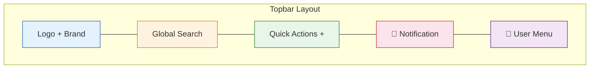
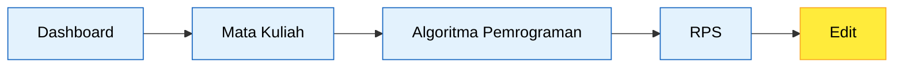
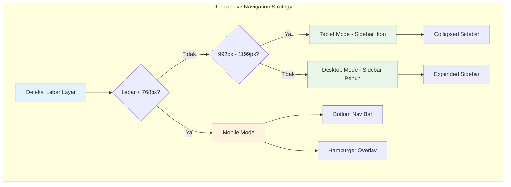

# 27 — Navigation Structure

## Ikhtisar

Struktur navigasi RPS OBE dirancang untuk memberikan pengalaman navigasi yang konsisten, intuitif, dan efisien bagi seluruh peran pengguna. Sistem navigasi mengadopsi pola **Sidebar + Topbar** yang umum digunakan pada aplikasi dashboard enterprise, dengan penyesuaian menu berbasis peran (role-based menu) serta dukungan penuh untuk responsivitas pada perangkat mobile.

---

## Prinsip Desain Navigasi

| Prinsip | Deskripsi |
|---------|-----------|
| **Konsistensi** | Pola navigasi seragam di seluruh halaman, terlepas dari peran pengguna |
| **Role-Based** | Menu yang ditampilkan hanya yang relevan dengan peran pengguna yang sedang login |
| **Kontekstual** | Breadcrumb selalu menunjukkan posisi pengguna saat ini dalam hierarki aplikasi |
| **Aksesibilitas** | Navigasi dapat diakses sepenuhnya via keyboard dan pembaca layar |
| **Responsif** | Navigasi beradaptasi dengan berbagai ukuran layar (desktop, tablet, mobile) |
| **Efisiensi** | Menu utama dapat diakses dalam maksimal 2 klik, quick actions dalam 1 klik |

---

## Global Navigation — Sidebar + Topbar

### Struktur Topbar (Global)

Topbar hadir di semua halaman untuk seluruh peran. Komponen topbar terdiri dari:

| Komponen | Posisi | Deskripsi |
|----------|--------|-----------|
| **Logo & Brand** | Kiri | Logo "RPS OBE" + nama aplikasi, dapat diklik kembali ke dashboard |
| **Global Search** | Tengah | Search bar untuk mencari RPS, Mata Kuliah, atau Pengguna |
| **Quick Actions (+)** | Kanan | Tombol dropdown aksi cepat kontekstual per peran |
| **Notification Bell** | Kanan | Ikon lonceng dengan badge counter notifikasi belum dibaca |
| **User Avatar / Profile** | Kanan | Foto profil + nama singkat, dropdown ke profil, pengaturan, logout |
| **Tenant Switcher** | Kanan (Super Admin) | Dropdown untuk berpindah antar tenant/universitas |
| **Help / Tutorial** | Kanan | Ikon tanda tanya, akses ke pusat bantuan dan panduan |



### Struktur Sidebar (Global)

Sidebar menggunakan komponen Tabler UI `Vertical Navbar` dengan fitur **accordion/collapsible** untuk menu yang memiliki sub-menu.

| Fitur Sidebar | Deskripsi |
|---------------|-----------|
| **Mode Expanded** | Default pada desktop, menampilkan ikon + label teks, lebar 260px |
| **Mode Collapsed** | Opsi collapse, hanya menampilkan ikon, lebar 68px |
| **Accordion Submenu** | Menu dengan sub-item menggunakan expand/collapse dengan indikator chevron |
| **Active State** | Menu aktif ditandai dengan background warna primer + indikator garis kiri |
| **Sticky Position** | Sidebar tetap pada posisinya saat halaman di-scroll |
| **Hover Tooltip** | Pada mode collapsed, hover menampilkan tooltip nama menu |

---

## Navigation Per Role

### 1. Navigasi Super Admin

Super Admin memiliki akses ke seluruh tenant dan fitur administrasi platform.

**Sidebar Menu:**

| Level 1 | Ikon | Level 2 | Deskripsi |
|---------|------|---------|-----------|
| Dashboard | `dashboard` | — | Overview seluruh tenant |
| Manajemen Tenant | `building` | Daftar Tenant | CRUD universitas/tenant |
| | | Paket & Billing | Manajemen paket langganan |
| | | Aktivasi Tenant | Approve/reject pendaftaran tenant |
| Manajemen Pengguna | `users` | Semua Pengguna | Daftar seluruh user di semua tenant |
| | | Invitasi | Kelola undangan user |
| | | Roles Global | Manajemen role global |
| Monitoring | `activity` | System Health | Status server, queue, cache |
| | | Audit Log | Log aktivitas seluruh tenant |
| | | Error Log | Monitoring error & exception |
| Pengaturan | `settings` | Konfigurasi Global | Pengaturan platform-wide |
| | | Template Email | Kelola template email sistem |
| | | Pengumuman Sistem | Buat pengumuman untuk semua tenant |

### 2. Navigasi Admin Universitas

**Sidebar Menu:**

| Level 1 | Ikon | Level 2 | Deskripsi |
|---------|------|---------|-----------|
| Dashboard | `dashboard` | — | Overview universitas |
| Manajemen Organisasi | `building` | Fakultas | CRUD fakultas |
| | | Program Studi | Per-prodi summary |
| Manajemen Pengguna | `users` | Daftar Pengguna | Semua user dalam universitas |
| | | Dosen | Manajemen data dosen |
| | | Invitasi | Undang user ke universitas |
| Manajemen Akademik | `book` | Kurikulum | Kelola kurikulum |
| | | Mata Kuliah | Daftar MK dalam universitas |
| | | CPL | Capaian Pembelajaran Lulusan |
| Monitoring RPS | `file-check` | Semua RPS | Daftar RPS seluruh prodi |
| | | Status Review | RPS dalam proses review |
| Laporan | `chart-bar` | Laporan RPS | Report per fakultas/prodi |
| | | Laporan Mutu | Quality score report |
| Pengaturan | `settings` | Profil Universitas | Edit data universitas |
| | | Template RPS | Kelola template RPS |

### 3. Navigasi Admin Fakultas

**Sidebar Menu:**

| Level 1 | Ikon | Level 2 | Deskripsi |
|---------|------|---------|-----------|
| Dashboard | `dashboard` | — | Overview fakultas |
| Program Studi | `school` | Daftar Prodi | CRUD program studi |
| Manajemen Akademik | `book` | Kurikulum | Kurikulum dalam fakultas |
| | | Mata Kuliah | Daftar MK dalam fakultas |
| | | CPL | CPL per prodi |
| Monitoring RPS | `file-check` | Semua RPS | RPS seluruh prodi di fakultas |
| | | Status Review | RPS dalam proses review |
| | | Alignment Scores | Skor keselarasan RPS-CPL |
| Laporan | `chart-bar` | RPS per Prodi | Completion report |
| Pengaturan | `settings` | Profil Fakultas | Edit data fakultas |

### 4. Navigasi Admin Prodi

**Sidebar Menu:**

| Level 1 | Ikon | Level 2 | Deskripsi |
|---------|------|---------|-----------|
| Dashboard | `dashboard` | — | Overview program studi |
| Manajemen Akademik | `book` | Kurikulum | Kelola kurikulum prodi |
| | | Mata Kuliah | Daftar MK prodi |
| | | CPL & Profil Lulusan | Kelola CPL dan profil |
| | | Dosen | Daftar dosen prodi |
| RPS | `file-check` | Semua RPS | Daftar RPS prodi |
| | | Status Review | RPS dalam review |
| | | Alignment CPL | Analisis keselarasan |
| Laporan | `chart-bar` | Laporan Prodi | Completion & quality report |
| Pengaturan | `settings` | Profil Prodi | Edit data prodi |

### 5. Navigasi Kaprodi

**Sidebar Menu:**

| Level 1 | Ikon | Level 2 | Deskripsi |
|---------|------|---------|-----------|
| Dashboard | `dashboard` | — | Overview prodi + statistik |
| Manajemen Akademik | `book` | Mata Kuliah | Daftar MK + pengampu |
| | | Kurikulum | Lihat kurikulum aktif |
| | | CPL | Lihat CPL prodi |
| RPS | `file-check` | Semua RPS | Daftar RPS + filter |
| | | Perlu Review | RPS menunggu approval |
| | | History Approval | Riwayat approval/reject |
| | | Alignment CPL | Analisis keselarasan |
| Penugasan | `user-plus` | Assign Reviewer | Tugaskan reviewer ke RPS |
| | | Daftar Reviewer | Kelola reviewer prodi |
| Laporan | `chart-bar` | Laporan Prodi | Completion & quality report |

### 6. Navigasi Reviewer

**Sidebar Menu:**

| Level 1 | Ikon | Level 2 | Deskripsi |
|---------|------|---------|-----------|
| Dashboard | `dashboard` | — | Overview tugas review |
| Review Saya | `clipboard-check` | Daftar Tugas | RPS yang ditugaskan |
| | | Sedang Direview | RPS dalam proses |
| | | Selesai Direview | Riwayat review |
| RPS | `file-check` | Semua RPS | Lihat RPS (read-only) |
| Laporan | `chart-bar` | Performa Review | Statistik review pribadi |

### 7. Navigasi Dosen

**Sidebar Menu:**

| Level 1 | Ikon | Level 2 | Deskripsi |
|---------|------|---------|-----------|
| Dashboard | `dashboard` | — | RPS cards + quick actions |
| RPS Saya | `file-text` | Draft | RPS dalam draft |
| | | Menunggu Review | RPS sudah disubmit |
| | | Disetujui | RPS yang sudah approved |
| | | Ditolak | RPS yang direject |
| | | Published | RPS yang dipublikasikan |
| Buat RPS Baru | `file-plus` | — | Form pembuatan RPS baru |
| Riwayat Aktivitas | `history` | — | Log aktivitas penyusunan RPS |

### 8. Navigasi LPM

**Sidebar Menu:**

| Level 1 | Ikon | Level 2 | Deskripsi |
|---------|------|---------|-----------|
| Dashboard | `dashboard` | — | Quality overview universitas |
| Monitoring Mutu | `clipboard-check` | Semua RPS | Lihat semua RPS universitas |
| | | Skor Mutu | Quality score per prodi |
| | | Alignment CPL | Analisis keselarasan |
| | | Audit Trail | Riwayat audit RPS |
| Laporan | `chart-bar` | Laporan Mutu | Quality score report |
| | | Laporan Semester | Perbandingan antar semester |
| | | Laporan Audit | Audit readiness report |
| Standar Mutu | `certificate` | Indikator Mutu | Kelola indikator penilaian |
| | | Template Review | Checklist review standar |

---

## Breadcrumb Navigation

Breadcrumb menampilkan jalur navigasi hierarkis dari dashboard ke halaman saat ini.

### Aturan Breadcrumb

| Aturan | Deskripsi |
|--------|-----------|
| **Root selalu Dashboard** | Item pertama breadcrumb selalu "Dashboard" |
| **Maksimal 5 level** | Breadcrumb tidak melebihi 5 level untuk mencegah overflow |
| **Responsive Truncation** | Pada layar kecil, level tengah di-collapse menjadi "..." |
| **Clickable** | Semua item kecuali yang terakhir dapat diklik |
| **Separator** | Menggunakan chevron kanan (`>` atau `/`) |

### Contoh Breadcrumb

```
Dashboard > Mata Kuliah > Algoritma Pemrograman > RPS > Edit
Dashboard > RPS > Draft > RPS Semester Ganjil 2025/2026
Dashboard > Review > RPS Matematika Diskrit > Review CPMK
Dashboard > Laporan > Laporan Mutu > Semester Ganjil 2025/2026
```



---

## Mobile Navigation (Responsive)

### Breakpoint & Adaptasi

| Breakpoint | Lebar Layar | Perilaku Navigasi |
|------------|-------------|-------------------|
| **Desktop** | >= 1200px | Sidebar expanded + topbar penuh |
| **Tablet Landscape** | 992px – 1199px | Sidebar collapsed (ikon only) |
| **Tablet Portrait** | 768px – 991px | Sidebar tersembunyi, hamburger menu |
| **Mobile** | < 768px | Bottom navigation + hamburger overlay |

### Mobile Navigation Pattern

Pada perangkat mobile (< 768px), navigasi mengadopsi pola **Bottom Navigation Bar** dengan 4-5 item utama, dan menu lengkap diakses melalui hamburger overlay.

**Bottom Navigation Bar (Mobile):**

| Posisi | Ikon | Label | Target |
|--------|------|-------|--------|
| 1 | `dashboard` | Beranda | Dashboard |
| 2 | `file-text` | RPS | RPS list/Draft |
| 3 | `plus-circle` | Buat | Quick create RPS |
| 4 | `bell` | Notifikasi | Notification center |
| 5 | `menu` | Lainnya | Full menu overlay |

**Hamburger Overlay Menu:**
- Slide-in dari kiri dengan animasi transisi 300ms
- Menampilkan menu sidebar lengkap sesuai peran
- Overlay semi-transparan di belakang menu
- Swipe kanan untuk membuka, swipe kiri untuk menutup



---

## Quick Actions Menu

Quick Actions adalah tombol "+" pada topbar yang menyediakan akses cepat ke aksi kontekstual berdasarkan peran pengguna.

### Quick Actions per Role

| Role | Quick Actions |
|------|---------------|
| **Super Admin** | Tambah Tenant, Buat Pengumuman, Undang User |
| **Admin Univ** | Tambah Fakultas, Tambah Prodi, Undang Dosen, Buat Template RPS |
| **Admin Fakultas** | Tambah Prodi, Tambah Mata Kuliah, Undang Dosen |
| **Admin Prodi** | Tambah Mata Kuliah, Tambah CPL, Buat Kurikulum, Undang Dosen |
| **Kaprodi** | Buat RPS (via delegation), Assign Reviewer, Tambah Mata Kuliah |
| **Reviewer** | Mulai Review (dari RPS yang ditugaskan) |
| **Dosen** | Buat RPS Baru, Lanjutkan Draft Terakhir |
| **LPM** | Buat Laporan Mutu, Tambah Indikator Mutu |

---

## Global Search

Global Search menyediakan pencarian terpadu untuk seluruh konten yang dapat diakses pengguna.

### Spesifikasi Global Search

| Aspek | Spesifikasi |
|-------|-------------|
| **Pintasan Keyboard** | `Ctrl+K` / `Cmd+K` |
| **Sumber Data** | RPS, Mata Kuliah, Pengguna (dalam scope tenant/role) |
| **Tipe Pencarian** | Full-text search dengan fuzzy matching |
| **Hasil** | Maksimal 10 hasil per kategori, ditampilkan dalam dropdown |
| **Navigasi Hasil** | Klik hasil langsung menuju halaman terkait |
| **Debounce** | 300ms setelah ketikan terakhir |
| **Minimum Karakter** | 2 karakter |

### Kategori Hasil Pencarian

| Kategori | Untuk Role | Informasi yang Ditampilkan |
|----------|------------|---------------------------|
| **RPS** | Semua | Kode MK, Nama MK, Semester, Status, Prodi |
| **Mata Kuliah** | Semua kecuali Mahasiswa | Kode MK, Nama MK, SKS, Semester, Prodi |
| **Dosen** | Admin Univ, Admin Fakultas, Admin Prodi, Kaprodi | Nama, NIDN, Prodi |
| **Reviewer** | Kaprodi | Nama, Prodi, Jumlah tugas aktif |

### Search Result Dropdown

```
┌─────────────────────────────────────────────┐
│ 🔍 Cari RPS, Mata Kuliah, Pengguna...       │
├─────────────────────────────────────────────┤
│ 📋 RPS                                      │
│   Algoritma Pemrograman - IF2120            │
│   Semester Ganjil 2025/2026 · Draft         │
│   Pemrograman Web - IF3110                  │
│   Semester Ganjil 2025/2026 · Published     │
├─────────────────────────────────────────────┤
│ 📚 Mata Kuliah                              │
│   Algoritma dan Struktur Data - IF2120      │
│   3 SKS · Informatika                       │
├─────────────────────────────────────────────┤
│ 👤 Pengguna                                 │
│   Dr. Ahmad Fauzi, M.Kom.                   │
│   NIDN: 0012345678 · Dosen Informatika      │
└─────────────────────────────────────────────┘
```

---

## Navigation Flow Diagram

```mermaid
graph TB
    subgraph "Entry Point"
        LOGIN[Login Page]
    end

    subgraph "Role-Based Routing"
        LOGIN -->|Super Admin| SA_DASH[Super Admin Dashboard]
        LOGIN -->|Admin Univ| AU_DASH[Admin Universitas Dashboard]
        LOGIN -->|Admin Fakultas| AF_DASH[Admin Fakultas Dashboard]
        LOGIN -->|Admin Prodi| AP_DASH[Admin Prodi Dashboard]
        LOGIN -->|Kaprodi| KP_DASH[Kaprodi Dashboard]
        LOGIN -->|Reviewer| RV_DASH[Reviewer Dashboard]
        LOGIN -->|Dosen| DS_DASH[Dosen Dashboard]
        LOGIN -->|LPM| LPM_DASH[LPM Dashboard]
    end

    subgraph "Common Pages - All Roles"
        PROFILE[Profil Pengguna]
        SETTINGS[Pengaturan Akun]
        NOTIF[Notification Center]
        HELP[Pusat Bantuan]
    end

    subgraph "Core Navigation - Dosen"
        DS_DASH --> RPS_MY[RPS Saya]
        RPS_MY --> RPS_DRAFT[Draft]
        RPS_MY --> RPS_REVIEW[Menunggu Review]
        RPS_MY --> RPS_APPROVED[Disetujui]
        RPS_DRAFT --> RPS_EDIT[Edit RPS]
        RPS_EDIT --> RPS_SUBMIT[Submit RPS]
        DS_DASH --> CREATE_RPS[Buat RPS Baru]
        CREATE_RPS --> RPS_EDIT
    end

    subgraph "Core Navigation - Kaprodi"
        KP_DASH --> KP_RPS[Semua RPS]
        KP_RPS --> KP_REVIEW[Perlu Review]
        KP_REVIEW --> KP_APPROVE[Approve/Reject RPS]
        KP_DASH --> KP_ASSIGN[Assign Reviewer]
    end

    subgraph "Core Navigation - Reviewer"
        RV_DASH --> RV_TASK[Daftar Tugas]
        RV_TASK --> RV_DO_REVIEW[Lakukan Review]
        RV_DO_REVIEW --> RV_SUBMIT_REV[Submit Review]
    end

    subgraph "Core Navigation - LPM"
        LPM_DASH --> LPM_MONITOR[Monitoring Mutu]
        LPM_MONITOR --> LPM_SCORE[Skor Mutu]
        LPM_DASH --> LPM_REPORT[Laporan Mutu]
    end

    subgraph "Admin Navigation"
        AU_DASH --> MANAGE_ORG[Manajemen Organisasi]
        MANAGE_ORG --> MANAGE_FAK[Fakultas]
        MANAGE_FAK --> MANAGE_PRODI[Program Studi]
        MANAGE_ORG --> MANAGE_USER[Pengguna]
        AF_DASH --> AF_PRODI[Program Studi]
        AP_DASH --> AP_MK[Mata Kuliah]
        AP_DASH --> AP_CPL[CPL & Profil Lulusan]
    end

    subgraph "Super Admin Navigation"
        SA_DASH --> SA_TENANT[Manajemen Tenant]
        SA_TENANT --> SA_BILLING[Paket & Billing]
        SA_DASH --> SA_MONITOR[System Health]
        SA_MONITOR --> SA_AUDIT[Audit Log]
    end

    subgraph "Global Navigation"
        SA_DASH --> PROFILE
        AU_DASH --> PROFILE
        AF_DASH --> PROFILE
        AP_DASH --> PROFILE
        KP_DASH --> PROFILE
        RV_DASH --> PROFILE
        DS_DASH --> PROFILE
        LPM_DASH --> PROFILE
    end

    style LOGIN fill:#1565c0,color:#fff
    style SA_DASH fill:#c62828,color:#fff
    style AU_DASH fill:#c62828,color:#fff
    style AF_DASH fill:#ef6c00,color:#fff
    style AP_DASH fill:#ef6c00,color:#fff
    style KP_DASH fill:#2e7d32,color:#fff
    style RV_DASH fill:#6a1b9a,color:#fff
    style DS_DASH fill:#1565c0,color:#fff
    style LPM_DASH fill:#00838f,color:#fff
```



---

## Sidebar Ikon Mapping

Ikon menggunakan library **Tabler Icons** (default dari Tabler UI).

| Menu | Ikon Tabler | Kode |
|------|-------------|------|
| Dashboard | `dashboard` | `<i class="ti ti-dashboard"></i>` |
| Manajemen Tenant | `building` | `<i class="ti ti-building"></i>` |
| Manajemen Organisasi | `building` | `<i class="ti ti-building"></i>` |
| Program Studi | `school` | `<i class="ti ti-school"></i>` |
| Fakultas | `building-community` | `<i class="ti ti-building-community"></i>` |
| Manajemen Akademik | `book` | `<i class="ti ti-book"></i>` |
| Kurikulum | `books` | `<i class="ti ti-books"></i>` |
| Mata Kuliah | `book-2` | `<i class="ti ti-book-2"></i>` |
| CPL | `certificate` | `<i class="ti ti-certificate"></i>` |
| Profil Lulusan | `award` | `<i class="ti ti-award"></i>` |
| Manajemen Pengguna | `users` | `<i class="ti ti-users"></i>` |
| Dosen | `user-star` | `<i class="ti ti-user-star"></i>` |
| Reviewer | `user-check` | `<i class="ti ti-user-check"></i>` |
| RPS | `file-check` | `<i class="ti ti-file-check"></i>` |
| RPS Saya | `file-text` | `<i class="ti ti-file-text"></i>` |
| Buat RPS Baru | `file-plus` | `<i class="ti ti-file-plus"></i>` |
| Review Saya | `clipboard-check` | `<i class="ti ti-clipboard-check"></i>` |
| Penugasan | `user-plus` | `<i class="ti ti-user-plus"></i>` |
| Monitoring | `activity` | `<i class="ti ti-activity"></i>` |
| Monitoring Mutu | `clipboard-check` | `<i class="ti ti-clipboard-check"></i>` |
| Standar Mutu | `certificate` | `<i class="ti ti-certificate"></i>` |
| Laporan | `chart-bar` | `<i class="ti ti-chart-bar"></i>` |
| Pengaturan | `settings` | `<i class="ti ti-settings"></i>` |
| Riwayat Aktivitas | `history` | `<i class="ti ti-history"></i>` |
| Paket & Billing | `credit-card` | `<i class="ti ti-credit-card"></i>` |
| Audit Log | `file-search` | `<i class="ti ti-file-search"></i>` |
| System Health | `heart-rate-monitor` | `<i class="ti ti-heart-rate-monitor"></i>` |
| Pengumuman | `speakerphone` | `<i class="ti ti-speakerphone"></i>` |
| Template Email | `mail` | `<i class="ti ti-mail"></i>` |

---

## Aturan Navigasi

### Visibilitas Menu

| Aturan | Deskripsi |
|--------|-----------|
| **Role-based visibility** | Menu hanya muncul jika pengguna memiliki permission terkait |
| **Tenant-scoped** | Data yang diakses terbatas pada tenant pengguna (kecuali Super Admin) |
| **Feature flag** | Menu fitur future dapat disembunyikan via feature flag di konfigurasi |
| **Empty state** | Jika suatu menu tidak memiliki data (misal: belum ada reviewer yang ditugaskan), menu tetap tampil dengan empty state |

### Active State

| Kondisi | Indikator |
|---------|-----------|
| **Menu aktif** | Background `bg-primary-lt` + teks bold + garis vertikal 3px warna primer di sisi kiri |
| **Sub-menu aktif** | Parent menu tetap dalam state expanded, sub-menu yang aktif mendapat highlight |
| **Current page** | Judul halaman (h1) sesuai dengan label menu yang aktif |

---

## Implementasi Teknis

| Aspek | Implementasi |
|-------|-------------|
| **Sidebar Komponen** | Livewire full-page component `NavigationSidebar` |
| **Topbar Komponen** | Blade component `<x-topbar>` |
| **Mobile Nav** | Alpine.js untuk toggle, transisi, dan swipe gesture |
| **Active State** | Laravel `request()->routeIs()` untuk menentukan menu aktif |
| **Permission Check** | Laravel Gate `@can()` directive pada Blade |
| **Search** | Livewire component `GlobalSearch` dengan wire:model.debounce |
| **Collapse State** | Disimpan di `localStorage` agar persisten antar sesi |

---

## Wireframe Navigasi

### Desktop Layout

```
┌─────────────────────────────────────────────────────────────────────┐
│  [Logo] RPS OBE    │  🔍 Cari... (Ctrl+K)   │  [+]  🔔  👤 AD  │ ← Topbar
├──────────┬──────────────────────────────────────────────────────────┤
│          │                                                          │
│ 📊 Dash  │  Dashboard > RPS Saya > Draft                            │ ← Breadcrumb
│ 📋 RPS   │                                                          │
│   Draft  │  ┌──────────────────────────────────────────────────┐   │
│   Review │  │                                                  │   │
│   ✅ App  │  │           Content Area                          │   │
│ 📝 Buat  │  │                                                  │   │
│ 📜 Hist  │  └──────────────────────────────────────────────────┘   │
│          │                                                          │
│ ⚙ Setng  │                                                          │
│          │                                                          │
├──────────┴──────────────────────────────────────────────────────────┤
│  Sidebar (260px)              Main Content Area                     │
└─────────────────────────────────────────────────────────────────────┘
```

### Mobile Layout

```
┌───────────────────────┐
│ [☰] RPS OBE    🔔 👤  │ ← Topbar compact
├───────────────────────┤
│ Dashboard > RPS Saya  │ ← Breadcrumb (scrollable horizontal)
├───────────────────────┤
│                       │
│                       │
│    Content Area       │
│                       │
│                       │
├───────────────────────┤
│ 🏠  📋  ➕  🔔  ⋯    │ ← Bottom Nav Bar
└───────────────────────┘
```

---

**Navigasi:** [Sebelumnya: UI/UX Guideline](26-ui-ux-guideline.md) | [Daftar Isi](../README.md) | [Berikutnya: Dashboard Requirement](28-dashboard-requirement.md)
