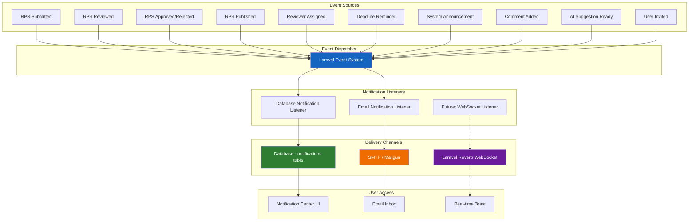
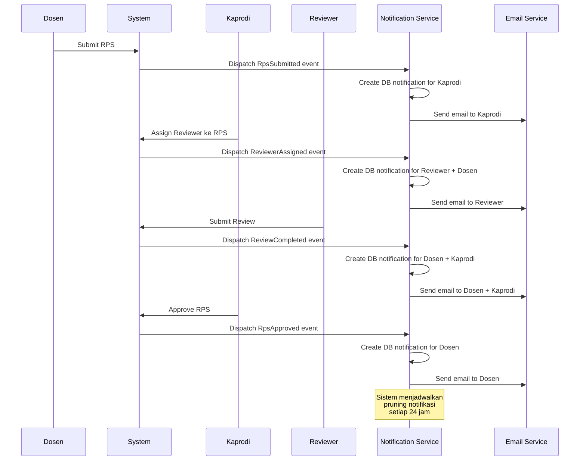
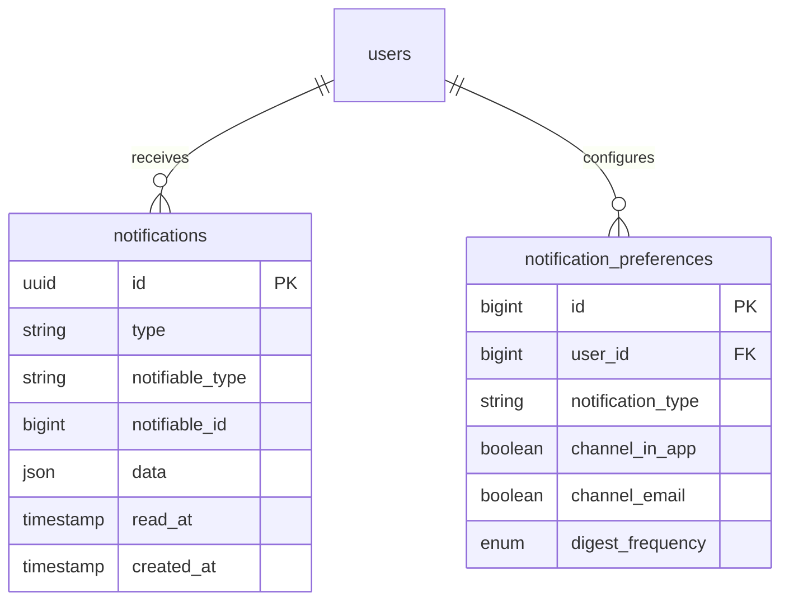

# 29 — Notification Requirement

## Ikhtisar

Sistem notifikasi RPS OBE bertujuan memberikan pemberitahuan tepat waktu kepada pengguna terkait perubahan status, aksi yang diperlukan, tenggat waktu, dan pengumuman sistem. Notifikasi dikirimkan melalui dua kanal utama: **in-app notification** (dropdown di topbar) dan **email notification**. Seluruh notifikasi dirancang agar actionable — pengguna dapat langsung menuju halaman terkait dari notifikasi.

---

## Prinsip Desain Notifikasi

| Prinsip | Deskripsi |
|---------|-----------|
| **Tepat Waktu** | Notifikasi dikirimkan segera setelah event terjadi |
| **Relevan** | Pengguna hanya menerima notifikasi yang sesuai peran dan konteksnya |
| **Actionable** | Setiap notifikasi memiliki tautan ke halaman terkait |
| **Non-Intrusive** | Notifikasi tidak mengganggu alur kerja utama |
| **Dapat Dikustomisasi** | Pengguna dapat mengatur preferensi notifikasi |
| **Terukur** | Sistem menangani volume notifikasi tinggi tanpa degradasi performa |

---

## Arsitektur Notifikasi



---

## Tipe Notifikasi (20+ Tipe)

### Kategori: RPS Lifecycle

| # | Tipe Notifikasi | Trigger Event | Penerima | Prioritas | Channel |
|---|----------------|---------------|----------|-----------|---------|
| 1 | **RPS Baru Dibuat** | Dosen membuat draft RPS baru | Dosen (konfirmasi) | Rendah | In-app |
| 2 | **RPS Disubmit** | Dosen submit RPS untuk review | Kaprodi | Tinggi | In-app + Email |
| 3 | **RPS Diterima Reviewer** | Reviewer menerima tugas review | Dosen, Kaprodi | Sedang | In-app |
| 4 | **RPS Selesai Direview** | Reviewer selesai mereview | Dosen, Kaprodi | Tinggi | In-app + Email |
| 5 | **RPS Disetujui** | Kaprodi approve RPS | Dosen | Tinggi | In-app + Email |
| 6 | **RPS Ditolak** | Kaprodi reject RPS | Dosen | Tinggi | In-app + Email |
| 7 | **RPS Dipublikasikan** | RPS status menjadi published | Dosen, Mahasiswa | Sedang | In-app |
| 8 | **RPS Perlu Revisi** | Reviewer meminta revisi | Dosen | Tinggi | In-app + Email |

### Kategori: Review & Assignment

| # | Tipe Notifikasi | Trigger Event | Penerima | Prioritas | Channel |
|---|----------------|---------------|----------|-----------|---------|
| 9 | **Ditugaskan Sebagai Reviewer** | Kaprodi assign reviewer ke RPS | Reviewer | Tinggi | In-app + Email |
| 10 | **Review Mendekati Deadline** | H-3 deadline review | Reviewer | Tinggi | In-app + Email |
| 11 | **Review Melewati Deadline** | Deadline review terlewat | Reviewer, Kaprodi | Tinggi | In-app + Email |
| 12 | **Komentar Baru pada Review** | Reviewer/Kaprodi menambah komentar | Dosen, Reviewer | Sedang | In-app |
| 13 | **Reviewer Mengundurkan Diri** | Reviewer menolak tugas | Kaprodi | Tinggi | In-app + Email |

### Kategori: Reminder & Deadline

| # | Tipe Notifikasi | Trigger Event | Penerima | Prioritas | Channel |
|---|----------------|---------------|----------|-----------|---------|
| 14 | **Reminder Penyelesaian RPS** | H-7 sebelum batas semester | Dosen dengan RPS draft | Sedang | In-app + Email |
| 15 | **Reminder Batas Akhir Semester** | H-1 batas akhir semester | Dosen, Kaprodi | Tinggi | In-app + Email |
| 16 | **Reminder Review Mingguan** | Setiap Senin pagi | Reviewer dengan tugas aktif | Sedang | In-app |

### Kategori: AI & Sistem

| # | Tipe Notifikasi | Trigger Event | Penerima | Prioritas | Channel |
|---|----------------|---------------|----------|-----------|---------|
| 17 | **Saran AI Tersedia** | AI selesai generate saran | Dosen | Rendah | In-app |
| 18 | **Pengumuman Sistem** | Admin membuat pengumuman | Sesuai target | Bervariasi | In-app + Email |
| 19 | **Akun Diundang** | Invitasi user baru | User baru | Tinggi | Email |
| 20 | **Akun Dinonaktifkan** | Admin nonaktifkan akun | User terkait | Tinggi | Email |
| 21 | **Template RPS Diperbarui** | Admin update template | Dosen dalam prodi | Sedang | In-app |

---

## Email Notification Templates

### Struktur Umum Email

Setiap email notifikasi mengikuti template standar dengan komponen:

| Komponen | Deskripsi |
|----------|-----------|
| **Header** | Logo RPS OBE + nama aplikasi |
| **Subject** | Subjek email yang informatif dan spesifik |
| **Greeting** | "Halo, [Nama Pengguna]" |
| **Body** | Isi notifikasi (1-3 paragraf) |
| **Highlight Box** | Informasi kunci dalam box (opsional) |
| **CTA Button** | Tombol aksi menuju halaman terkait |
| **Footer** | Informasi platform + link unsubscribe/manage preferences |

### Template 1: RPS Disubmit (ke Kaprodi)

```
Subject: [RPS OBE] RPS Baru Menunggu Review — IF2120 Algoritma Pemrograman

Halo, Bapak/Ibu Kaprodi Informatika,

RPS baru telah disubmit dan menunggu review Anda:

┌─────────────────────────────────────────────┐
│ Mata Kuliah : IF2120 Algoritma Pemrograman  │
│ Dosen       : Dr. Ahmad Fauzi, M.Kom.       │
│ Semester    : Ganjil 2025/2026              │
│ SKS         : 3 SKS                         │
│ Tanggal     : 2 Agustus 2026, 14:30 WIB     │
└─────────────────────────────────────────────┘

          [ REVIEW RPS SEKARANG → ]

Anda dapat menugaskan reviewer atau langsung melakukan review.

—
RPS OBE — Smart Outcome Based Education Platform
Kelola preferensi notifikasi: [Link]
```

### Template 2: RPS Disetujui (ke Dosen)

```
Subject: [RPS OBE] RPS Anda Telah Disetujui — IF2120 Algoritma Pemrograman

Halo, Dr. Ahmad Fauzi,

Selamat! RPS Anda telah disetujui oleh Kaprodi.

┌─────────────────────────────────────────────┐
│ Mata Kuliah : IF2120 Algoritma Pemrograman  │
│ Status      : ✅ Disetujui                  │
│ Disetujui Oleh : Dr. Budi Santoso, M.Sc.    │
│ Tanggal     : 2 Agustus 2026, 16:00 WIB     │
└─────────────────────────────────────────────┘

          [ LIHAT RPS → ]

RPS Anda kini dapat dipublikasikan.

—
RPS OBE — Smart Outcome Based Education Platform
Kelola preferensi notifikasi: [Link]
```

### Template 3: RPS Ditolak (ke Dosen)

```
Subject: [RPS OBE] RPS Anda Memerlukan Perbaikan — IF3230 Kecerdasan Buatan

Halo, Dr. Citra Dewi,

RPS Anda memerlukan perbaikan sebelum dapat disetujui.

┌─────────────────────────────────────────────┐
│ Mata Kuliah : IF3230 Kecerdasan Buatan      │
│ Status      : ❌ Perlu Perbaikan            │
│ Alasan      : CPMK belum sepenuhnya selaras │
│               dengan CPL yang ditetapkan    │
│ Catatan     : Lihat halaman RPS untuk detail│
└─────────────────────────────────────────────┘

          [ PERBAIKI RPS → ]

—
RPS OBE — Smart Outcome Based Education Platform
Kelola preferensi notifikasi: [Link]
```

### Template 4: Ditugaskan Sebagai Reviewer

```
Subject: [RPS OBE] Anda Ditugaskan Mereview RPS — IF3110 Pemrograman Web

Halo, Dr. Rina Wijaya,

Anda telah ditugaskan sebagai reviewer untuk RPS berikut:

┌─────────────────────────────────────────────┐
│ Mata Kuliah : IF3110 Pemrograman Web        │
│ Dosen       : Budi Santoso, M.Kom.          │
│ Semester    : Ganjil 2025/2026              │
│ Deadline    : 9 Agustus 2026 (7 hari)       │
└─────────────────────────────────────────────┘

          [ MULAI REVIEW → ]

—
RPS OBE — Smart Outcome Based Education Platform
Kelola preferensi notifikasi: [Link]
```

### Template 5: Deadline Reminder

```
Subject: [RPS OBE] ⚠ Batas Waktu Review Besok — IF3110 Pemrograman Web

Halo, Dr. Rina Wijaya,

Batas waktu review Anda untuk RPS berikut adalah besok:

┌─────────────────────────────────────────────┐
│ Mata Kuliah : IF3110 Pemrograman Web        │
│ Deadline    : 9 Agustus 2026                │
│ Sisa Waktu  : 1 hari                        │
└─────────────────────────────────────────────┘

          [ SELESAIKAN REVIEW → ]

—
RPS OBE — Smart Outcome Based Education Platform
```

---

## In-App Notification Format

### Struktur Data Notifikasi (Database)

| Kolom | Tipe | Deskripsi |
|-------|------|-----------|
| `id` | UUID | Primary key |
| `type` | string | FQCN Notification class (contoh: `App\Notifications\RpsSubmitted`) |
| `notifiable_type` | string | Model type (contoh: `App\Models\User`) |
| `notifiable_id` | bigint | User ID penerima |
| `data` | json | Payload notifikasi |
| `read_at` | timestamp | Waktu dibaca (null = belum dibaca) |
| `created_at` | timestamp | Waktu dibuat |

### Format JSON Payload (data)

```json
{
    "title": "RPS Disetujui",
    "message": "RPS IF2120 Algoritma Pemrograman telah disetujui oleh Kaprodi.",
    "type": "rps.approved",
    "icon": "file-check",
    "action_url": "/dosen/rps/if2120-2025-ganjil",
    "action_text": "Lihat RPS",
    "metadata": {
        "rps_id": "uuid-rps-123",
        "mata_kuliah_kode": "IF2120",
        "mata_kuliah_nama": "Algoritma Pemrograman",
        "approved_by": "Dr. Budi Santoso",
        "semester": "2025/2026 Ganjil"
    }
}
```

### Field Definisi

| Field | Deskripsi |
|-------|-----------|
| `title` | Judul singkat notifikasi (maks 60 karakter) |
| `message` | Deskripsi detail notifikasi (maks 200 karakter) |
| `type` | Kategori/tema notifikasi untuk grouping |
| `icon` | Ikon Tabler yang digunakan |
| `action_url` | URL tujuan saat notifikasi diklik |
| `action_text` | Teks pada tombol aksi |
| `metadata` | Data tambahan untuk rendering dan logging |

---

## Notification Center UI

### Dropdown Notifikasi

Notification Center diakses melalui ikon lonceng di topbar. Komponen menggunakan Livewire dengan polling 15 detik.

```
┌──────────────────────────────────────────────┐
│ 🔔 Notifikasi                    [Tandai Semua│
│                                   Telah Dibaca]│
├──────────────────────────────────────────────┤
│ ● RPS Disetujui                   2 menit lalu│
│   IF2120 Algoritma Pemrograman               │
│   telah disetujui oleh Kaprodi               │
├──────────────────────────────────────────────┤
│ ● Ditugaskan Review                1 jam lalu │
│   Anda ditugaskan mereview                    │
│   IF3110 Pemrograman Web                     │
├──────────────────────────────────────────────┤
│ ○ RPS Disubmit                      3 jam lalu│
│   RPS baru dari Dr. Ahmad Fauzi              │
│   IF2120 Algoritma Pemrograman               │
├──────────────────────────────────────────────┤
│ ○ Pengumuman Sistem                 1 hari lalu│
│   Template RPS Semester Ganjil 2025/2026      │
│   telah diperbarui                            │
├──────────────────────────────────────────────┤
│                                              │
│        [Lihat Semua Notifikasi →]            │
└──────────────────────────────────────────────┘
```

### Spesifikasi UI

| Elemen | Spesifikasi |
|--------|-------------|
| **Lebar Dropdown** | 380px (desktop), full-width (mobile) |
| **Tinggi Maksimal** | 480px dengan scroll internal |
| **Item Unread** | Background `bg-primary-lt`, dot indikator biru di kiri |
| **Item Read** | Background putih, tanpa dot |
| **Ikon** | Ikon Tabler sesuai tipe notifikasi, warna primer |
| **Timestamp** | Format relatif: "baru saja", "2 menit lalu", "1 jam lalu", "kemarin", "3 hari lalu" |
| **Badge Counter** | Angka pada ikon lonceng, maksimal "99+" |
| **Click Behavior** | Klik notifikasi → redirect ke `action_url` + mark as read |
| **Mark All Read** | Tombol di header dropdown |

### Badge Counter Logic

```php
public function getUnreadCount(): int
{
    return auth()->user()
        ->unreadNotifications()
        ->where('created_at', '>=', now()->subDays(30))
        ->count();
}

public function getBadgeDisplay(): string
{
    $count = $this->getUnreadCount();
    return $count > 99 ? '99+' : (string) $count;
}
```

### Full Notification Page

Halaman `/notifications` menampilkan seluruh riwayat notifikasi dengan fitur:

| Fitur | Deskripsi |
|-------|-----------|
| **Filter by Type** | Dropdown filter: Semua, RPS, Review, Sistem, Deadline |
| **Filter by Status** | Tab: Semua, Belum Dibaca |
| **Pagination** | 20 item per halaman, infinite scroll opsional |
| **Group by Date** | Pengelompokan: Hari Ini, Kemarin, Minggu Ini, Bulan Ini, Lebih Lama |
| **Batch Actions** | Checkbox + "Tandai Telah Dibaca" + "Hapus" |

---

## Notification Preferences

Setiap pengguna dapat mengatur preferensi notifikasi melalui halaman **Pengaturan > Preferensi Notifikasi**.

### Tabel Preferensi Notifikasi

| Kanal Notifikasi | Opsi |
|-----------------|------|
| **Email** | On/Off per tipe notifikasi |
| **In-App** | On/Off per tipe notifikasi |
| **Digest** | Ringkasan harian/mingguan via email |

### Pengaturan Default per Role

| Tipe Notifikasi | Dosen | Kaprodi | Reviewer | Admin | LPM |
|----------------|:-----:|:-------:|:--------:|:-----:|:---:|
| RPS Disubmit | — | Email+App | — | — | — |
| RPS Disetujui | Email+App | App | — | — | — |
| RPS Ditolak | Email+App | App | — | — | — |
| RPS Selesai Direview | Email+App | Email+App | — | — | — |
| Ditugaskan Reviewer | — | App | Email+App | — | — |
| Review Deadline | — | Email+App | Email+App | — | — |
| Komentar Baru | App | App | App | — | — |
| Reminder RPS | Email+App | Email+App | — | — | — |
| Saran AI | App | — | — | — | — |
| Pengumuman Sistem | Email+App | Email+App | Email+App | Email+App | Email+App |

### UI Preferensi

```
┌──────────────────────────────────────────────────────────────┐
│  Preferensi Notifikasi                                       │
│                                                              │
│  Email Digest:  [○ Nonaktif]  [● Harian]  [○ Mingguan]      │
│                                                              │
│  ┌──────────────────────────────┬─────────┬─────────┐       │
│  │ Tipe Notifikasi              │ In-App  │ Email   │       │
│  ├──────────────────────────────│─────────│─────────┤       │
│  │ RPS Disetujui                │  ✅     │  ✅     │       │
│  │ RPS Ditolak                  │  ✅     │  ✅     │       │
│  │ RPS Selesai Direview         │  ✅     │  ☐      │       │
│  │ Komentar Baru                │  ✅     │  ☐      │       │
│  │ Reminder Deadline            │  ✅     │  ✅     │       │
│  │ Saran AI Tersedia            │  ☐      │  ☐      │       │
│  │ Pengumuman Sistem            │  ✅     │  ✅     │       │
│  └──────────────────────────────┴─────────┴─────────┘       │
│                                                              │
│                        [Simpan Preferensi]                   │
└──────────────────────────────────────────────────────────────┘
```

### Implementasi Preferensi

Preferensi disimpan di tabel `notification_preferences`:

| Kolom | Tipe | Deskripsi |
|-------|------|-----------|
| `id` | bigint | Primary key |
| `user_id` | bigint | Foreign key ke users |
| `notification_type` | string | Tipe notifikasi (contoh: `rps.approved`) |
| `channel_in_app` | boolean | Notifikasi in-app aktif? |
| `channel_email` | boolean | Notifikasi email aktif? |
| `digest_frequency` | enum | `none`, `daily`, `weekly` |

---

## Real-Time Delivery

### Fase 1: Livewire Polling (MVP)

| Komponen | Interval | Keterangan |
|----------|----------|------------|
| Notification Badge Counter | 15 detik | Update jumlah unread |
| Notification Dropdown | On-demand | Load saat dropdown dibuka |
| Toast Notification | Event-driven | Muncul saat aksi selesai (submit, approve, dsb) |

```blade
{{-- Topbar notification badge --}}
<livewire:notification-badge wire:poll.15s />

{{-- Notification dropdown --}}
<livewire:notification-dropdown wire:poll.30s />
```

### Fase 2: WebSocket / Laravel Reverb (Future)

| Fitur | Deskripsi |
|-------|-----------|
| **Real-time Push** | Notifikasi muncul tanpa polling |
| **Channel per User** | `private-notifications.{user_id}` |
| **Toast Real-time** | Notifikasi toast muncul saat event terjadi |
| **Presence** | Indikator online/offline |

```php
// Future: Laravel Reverb event
class RpsApproved implements ShouldBroadcast
{
    use Dispatchable, InteractsWithSockets, SerializesModels;

    public function broadcastOn(): Channel
    {
        return new PrivateChannel('notifications.' . $this->user->id);
    }
}
```

---

## Notification Grouping / Batching

Untuk mengurangi notifikasi berlebihan, beberapa notifikasi serupa dikelompokkan:

| Skenario | Strategi |
|----------|----------|
| **Multiple RPS disubmit bersamaan** | Group menjadi 1 notifikasi: "3 RPS baru menunggu review" |
| **Multiple komentar pada RPS yang sama** | Group menjadi 1 notifikasi: "5 komentar baru pada IF2120" |
| **Saran AI berturut-turut** | Group per RPS per hari: "Saran AI tersedia untuk 2 RPS" |

### Aturan Batching

| Aturan | Deskripsi |
|--------|-----------|
| **Window** | Notifikasi dikelompokkan dalam jendela waktu 5 menit |
| **Group Key** | `{type}:{rps_id}:{recipient_id}` |
| **Maksimum** | Maksimal 3 pengelompokan sebelum dikirim |
| **Display** | "3 RPS baru menunggu review" + expandable list |

---

## Read / Unread State

| State | Indikator Visual | Perilaku |
|-------|-----------------|----------|
| **Unread** | Dot biru di kiri + background `bg-primary-lt` | Dianggap baru, masuk badge counter |
| **Read** | Tanpa dot, background putih | Sudah dilihat |
| **Mark as Read** | — | Klik notifikasi, "Tandai Telah Dibaca", atau "Tandai Semua Telah Dibaca" |
| **Persistensi** | `read_at` timestamp di database | Data tetap ada setelah dibaca |

---

## Mark All as Read

### Implementasi

```php
public function markAllAsRead(): void
{
    auth()->user()
        ->unreadNotifications()
        ->update(['read_at' => now()]);

    $this->dispatch('notifications-cleared');
}
```

### Perilaku

| Aspek | Deskripsi |
|-------|-----------|
| **Konfirmasi** | Tidak ada dialog konfirmasi, aksi langsung |
| **Undo** | Tidak ada fitur undo |
| **Scope** | Semua notifikasi unread milik pengguna saat ini |
| **Feedback** | Badge counter menjadi 0, dropdown direfresh |

---

## Notification Retention

| Aturan | Deskripsi |
|--------|-----------|
| **Retensi Default** | 30 hari sejak `created_at` |
| **Penghapusan Otomatis** | Scheduled job (Laravel Scheduler) berjalan setiap hari pukul 02:00 |
| **Pengecualian** | Notifikasi penting (Pengumuman Sistem) bisa memiliki retensi lebih lama (90 hari) |
| **Soft Delete** | Tidak digunakan; notifikasi dihapus permanen dari database |
| **Read vs Unread** | Semua notifikasi (read dan unread) dihapus setelah 30 hari |

### Scheduled Job

```php
// App\Console\Kernel.php
$schedule->command('notifications:prune --days=30')->dailyAt('02:00');
```

```php
// App\Console\Commands\PruneNotifications.php
public function handle(): void
{
    $cutoff = now()->subDays($this->option('days'));

    // Hapus notifikasi biasa
    Notification::where('created_at', '<', $cutoff)
        ->where('type', '!=', 'App\Notifications\SystemAnnouncement')
        ->delete();

    // Hapus pengumuman sistem setelah 90 hari
    Notification::where('created_at', '<', now()->subDays(90))
        ->where('type', 'App\Notifications\SystemAnnouncement')
        ->delete();
}
```

---

## Toast Notification (In-App Alert)

Selain notifikasi persisten di dropdown, aksi real-time menampilkan toast notification:

| Posisi | Jenis | Durasi | Contoh |
|--------|-------|--------|--------|
| Top-right | Success | 5 detik | "RPS berhasil disubmit!" |
| Top-right | Error | 8 detik | "Gagal menyimpan. Silakan coba lagi." |
| Top-right | Warning | 6 detik | "Batas waktu review tinggal 1 hari." |
| Top-right | Info | 5 detik | "Saran AI sedang diproses..." |

---

## Diagram Alur Notifikasi



---

## Database Schema — Notifications



---

## Testing Checklist

| # | Skenario | Ekspektasi |
|---|----------|-----------|
| 1 | Dosen submit RPS | Kaprodi dapat notifikasi in-app + email |
| 2 | Kaprodi assign reviewer | Reviewer dapat notifikasi in-app + email |
| 3 | Reviewer selesai review | Dosen + Kaprodi dapat notifikasi |
| 4 | Kaprodi approve RPS | Dosen dapat notifikasi email |
| 5 | Kaprodi reject RPS | Dosen dapat notifikasi + alasan |
| 6 | Deadline H-1 | Reviewer dapat reminder email |
| 7 | Klik notifikasi | Redirect ke halaman terkait + mark as read |
| 8 | Mark all as read | Semua unread menjadi read |
| 9 | Nonaktifkan email di preferensi | Hanya terima in-app |
| 10 | Notifikasi > 30 hari | Terhapus otomatis oleh scheduled job |

---

**Navigasi:** [Sebelumnya: Dashboard Requirement](28-dashboard-requirement.md) | [Daftar Isi](../README.md) | [Berikutnya: Reporting Requirement](30-reporting-requirement.md)
