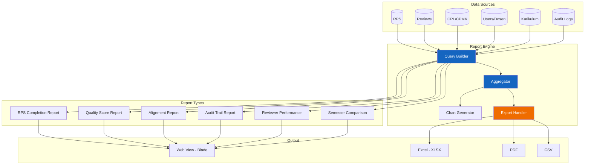
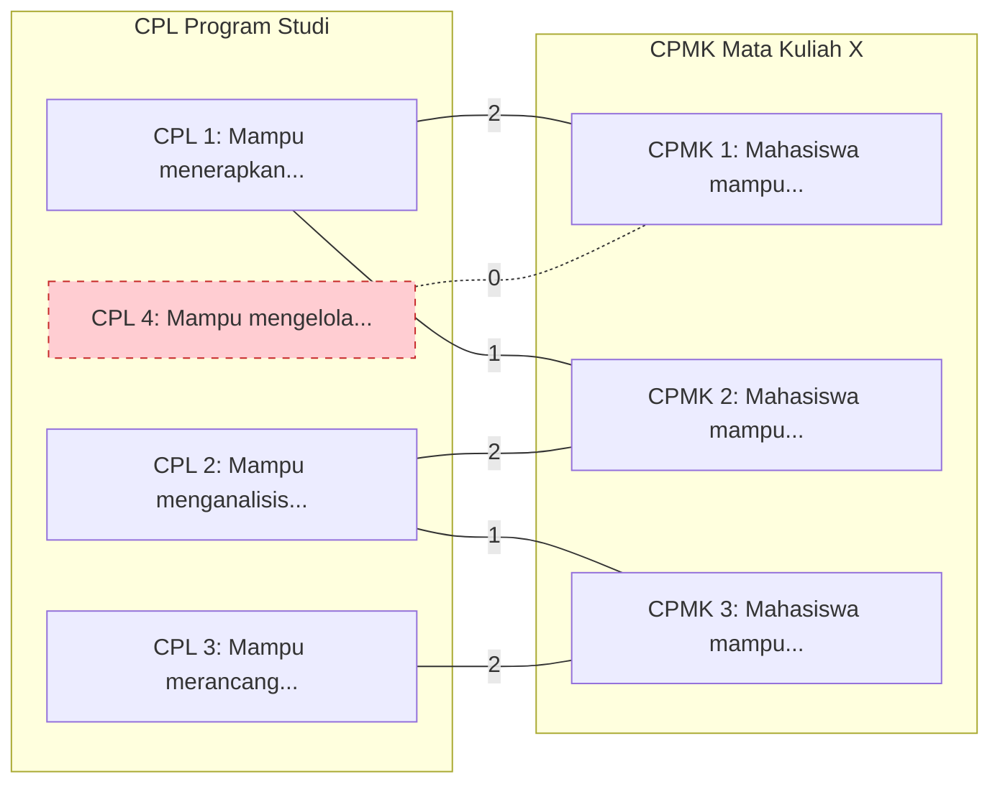

# 30 — Reporting Requirement

## Ikhtisar

Modul pelaporan RPS OBE menyediakan laporan komprehensif yang mendukung pengambilan keputusan di setiap level organisasi — dari dosen individu hingga pimpinan universitas. Laporan dirancang untuk memenuhi kebutuhan akreditasi, audit mutu internal, penjaminan kualitas, dan monitoring penyelenggaraan Outcome-Based Education (OBE).

---

## Prinsip Desain Pelaporan

| Prinsip | Deskripsi |
|---------|-----------|
| **Akurat** | Data laporan bersumber dari data real-time atau snapshot yang tervalidasi |
| **Kontekstual** | Laporan difilter sesuai scope peran pengguna |
| **Visual** | Data disajikan dalam kombinasi tabel, grafik, dan ringkasan KPI |
| **Ekspor** | Semua laporan dapat diekspor dalam format umum (.xlsx, .pdf, .csv) |
| **Auditable** | Setiap laporan yang digenerate tercatat di audit log |
| **Performa** | Query laporan dioptimalkan dengan indeks database dan caching |

---

## Arsitektur Pelaporan



---

## Parameter Filter Umum

Seluruh laporan mendukung parameter filter berikut:

| Parameter | Tipe | Deskripsi | Default |
|-----------|------|-----------|---------|
| **Semester** | Select | Periode semester (contoh: 2025/2026 Ganjil) | Semester aktif |
| **Program Studi** | Select (multi) | Filter per prodi | Semua (sesuai scope) |
| **Fakultas** | Select (multi) | Filter per fakultas | Semua (sesuai scope) |
| **Status RPS** | Checkbox (multi) | Draft, Review, Approved, Published, Rejected | Semua |
| **Tanggal Mulai** | Date picker | Batas awal rentang tanggal | 6 bulan lalu |
| **Tanggal Akhir** | Date picker | Batas akhir rentang tanggal | Hari ini |
| **Dosen** | Select (multi) | Filter per dosen | Semua |

### Filter UI

```
┌──────────────────────────────────────────────────────────────────────┐
│  🔍 Filter Laporan                                                   │
│  ┌────────────┬────────────┬────────────┬────────────┬─────────────┐ │
│  │ Semester ▼ │ Prodi ▼    │ Status ☐   │ Tgl Mulai  │ Tgl Akhir   │ │
│  │ Gnp 25/26  │ Semua      │ Draft      │ 01/02/2026 │ 02/08/2026  │ │
│  └────────────┴────────────┴────────────┴────────────┴─────────────┘ │
│                                                          [Terapkan]  │
└──────────────────────────────────────────────────────────────────────┘
```

---

## Laporan 1: RPS Completion Report

### Tujuan

Menyediakan gambaran tingkat penyelesaian RPS di suatu program studi, fakultas, atau universitas pada semester tertentu.

### Komponen Laporan

| Komponen | Tipe | Deskripsi |
|----------|------|-----------|
| **Summary Cards** | Card | Total RPS, Selesai (%), Dalam Proses (%), Belum Mulai (%) |
| **Completion Table** | Tabel | Detail RPS per mata kuliah dengan status dan progress |
| **Completion Bar Chart** | Bar Chart | Completion rate per prodi (horizontal) |
| **Progress Distribution** | Pie Chart | Distribusi RPS berdasarkan rentang progress (0-25%, 26-50%, 51-75%, 76-99%, 100%) |

### Tabel Detail

| Kolom | Sumber Data | Deskripsi |
|-------|-------------|-----------|
| No | Auto-number | Nomor urut |
| Kode MK | `mata_kuliah.kode` | Kode mata kuliah |
| Nama Mata Kuliah | `mata_kuliah.nama` | Nama lengkap MK |
| Dosen Pengampu | `dosen.nama` via `rps_dosen` | Nama dosen |
| Status | `rps.status` | Draft / Review / Approved / Published |
| Progress | Perhitungan field terisi | Persentase 0-100% |
| Bobot SKS | `mata_kuliah.sks` | Jumlah SKS |
| Tgl Update Terakhir | `rps.updated_at` | Tanggal modifikasi terakhir |

### KPI Metrics

| KPI | Formula | Target |
|-----|---------|--------|
| **Completion Rate** | `count(RPS approved+published) / count(all RPS) * 100` | >= 80% |
| **Average Progress** | `AVG(progress_percentage)` | >= 75% |
| **Draft Stagnation** | `count(RPS draft > 30 hari)` | <= 10% |
| **On-Time Submission** | `count(RPS submitted sebelum deadline) / count(all RPS)` | >= 70% |

### Visualisasi

```
┌─────────────────────────────────────────────────────────────┐
│  📊 RPS Completion Report — Semester Ganjil 2025/2026        │
│  Program Studi Informatika                                   │
├──────────┬──────────┬──────────┬──────────┬─────────────────┤
│ Total    │ Approved │ Review   │ Draft    │ Completion Rate │
│ 24 RPS   │ 16 (67%) │ 5 (21%)  │ 3 (12%)  │ 67%             │
├──────────┴──────────┴──────────┴──────────┴─────────────────┤
│                                                              │
│  📊 Completion per Prodi (Bar)     📊 Progress Distribution  │
│  ┌──────────────────────────┐     ┌───────────────────────┐  │
│  │ Info    ████████████░ 80%│     │    100%     ████ 16   │  │
│  │ SI      █████████░░░ 75% │     │  76-99%     ███░ 5    │  │
│  │ TK      ██████████░░ 72% │     │  51-75%     ██░░ 2    │  │
│  │ DS      ██████░░░░░ 60%  │     │  26-50%     █░░░ 1    │  │
│  └──────────────────────────┘     │   0-25%     ░░░░ 0    │  │
│                                   └───────────────────────┘  │
│                                                              │
│  📋 Detail RPS                                 [Ekspor ▼]    │
│  ┌──────────────────────────────────────────────────────┐   │
│  │ # │ Kode │ Nama MK        │ Dosen    │ Status │ Prog │   │
│  │───│──────│────────────────│──────────│────────│──────│   │
│  │ 1 │ IF01 │ Algoritma      │ Ahmad F. │ Apprv  │ 100% │   │
│  │ 2 │ IF02 │ Pemrograman    │ Budi S.  │ Review │  85% │   │
│  │ 3 │ IF03 │ Basis Data     │ Citra D. │ Draft  │  40% │   │
│  └──────────────────────────────────────────────────────┘   │
└─────────────────────────────────────────────────────────────┘
```

---

## Laporan 2: Quality Score Report

### Tujuan

Mengukur dan melaporkan skor mutu RPS berdasarkan indikator penjaminan mutu yang telah ditetapkan.

### Indikator Quality Score

| # | Indikator | Bobot | Skor Maks |
|---|-----------|-------|-----------|
| 1 | Kelengkapan komponen RPS (identitas, CPL, CPMK, assessment, materi, referensi) | 25% | 25 |
| 2 | Kesesuaian CPMK dengan CPL (alignment) | 25% | 25 |
| 3 | Kesesuaian assessment dengan CPMK | 20% | 20 |
| 4 | Kelengkapan rubrik penilaian | 15% | 15 |
| 5 | Kemutakhiran referensi (< 5 tahun) | 10% | 10 |
| 6 | Kesesuaian materi per pertemuan dengan Sub-CPMK | 5% | 5 |
| **Total** | | **100%** | **100** |

### Komponen Laporan

| Komponen | Tipe | Deskripsi |
|----------|------|-----------|
| **Average Quality Score** | Gauge/Number | Skor rata-rata seluruh RPS |
| **Score Distribution** | Histogram | Distribusi RPS berdasarkan rentang skor (0-40, 41-60, 61-80, 81-100) |
| **Score per Prodi** | Bar Chart | Rata-rata skor per program studi |
| **Score per Indikator** | Radar Chart | Capaian rata-rata per indikator mutu |
| **Detail Table** | Tabel | Skor detail per RPS |

### Visualisasi

```
┌─────────────────────────────────────────────────────────────┐
│  📊 Quality Score Report — Semester Ganjil 2025/2026         │
├──────────┬──────────────────┬───────────────────────────────┤
│          │                  │                                │
│   ┌────┐ │  📊 Score per    │  🎯 Score per Indikator        │
│   │ 78 │ │     Prodi        │      (Radar Chart)             │
│   │/100│ │  ┌────────────┐  │         Ind 1                  │
│   └────┘ │  │ Info  ██ 88 │  │           ╱╲                  │
│  Rata2   │  │ SI    ██ 82 │  │          ╱  ╲                 │
│  Skor    │  │ TK    ██ 75 │  │    Ind 6╱    ╲Ind 2           │
│  Mutu    │  │ DS    ██ 68 │  │        ╱   ◆  ╲              │
│          │  └────────────┘  │       ╱  ╱    ╲ ╲             │
│          │                  │   Ind 5──────Ind 3             │
│          │  📊 Distribusi   │        ╲      ╱               │
│          │  ┌────────────┐  │         ╲    ╱                │
│          │  │ 81-100 █ 12│  │          Ind 4                │
│          │  │ 61-80  ██ 8│  │                                │
│          │  │ 41-60  ██ 3│  │                                │
│          │  │ 0-40   █ 1 │  │                                │
│          │  └────────────┘  │                                │
└──────────┴──────────────────┴───────────────────────────────┘
```

### KPI Metrics

| KPI | Formula | Target |
|-----|---------|--------|
| **Average Quality** | `AVG(total_score)` | >= 75 |
| **Score >= 80** | `count(RPS_score >= 80) / count(all) * 100` | >= 60% |
| **Score < 50** | `count(RPS_score < 50) / count(all) * 100` | <= 10% |
| **Indikator Terendah** | Indikator dengan skor rata-rata terendah | Minimal 60 |

---

## Laporan 3: Alignment Report

### Tujuan

Menganalisis dan melaporkan tingkat keselarasan (alignment) antara CPMK setiap RPS dengan CPL program studi.

### Metode Alignment

| Aspek | Deskripsi |
|-------|-----------|
| **Matrix** | Matriks CPL × CPMK, setiap sel bernilai 0 (tidak selaras), 1 (selaras sebagian), atau 2 (selaras penuh) |
| **Coverage** | Persentase CPL yang tercakup oleh CPMK dalam satu RPS |
| **Depth** | Rata-rata kedalaman alignment (nilai 1 vs 2) |

### Alignment Scoring



### Komponen Laporan

| Komponen | Tipe | Deskripsi |
|----------|------|-----------|
| **Alignment Matrix** | Heatmap Table | Matriks CPL × Mata Kuliah dengan warna |
| **CPL Coverage** | Bar Chart | Persentase RPS yang mencakup setiap CPL |
| **Uncovered CPL** | List | CPL yang tidak tercakup oleh MK manapun |
| **Alignment per Prodi** | Table | Rata-rata alignment per prodi |

### Alignment Matrix Heatmap

```
┌─────────────────────────────────────────────────────────────────────┐
│  📊 Alignment Report — Program Studi Informatika                     │
│  Semester Ganjil 2025/2026                                           │
│                                                                      │
│  Matriks Alignment CPL × Mata Kuliah                                 │
│  ┌─────────────────────────────────────────────────────────────────┐│
│  │ Mata Kuliah        │ CPL1 │ CPL2 │ CPL3 │ CPL4 │ CPL5 │ CPL6  ││
│  │────────────────────│──────│──────│──────│──────│──────│───────││
│  │ Algoritma Pemro.   │ ██ 2 │ ██ 2 │      │ ░░ 1 │      │ ██ 2  ││
│  │ Pemrograman Web    │      │ ██ 2 │ ██ 2 │      │ ░░ 1 │       ││
│  │ Basis Data         │ ██ 2 │ ░░ 1 │ ██ 2 │      │      │       ││
│  │ Kecerdasan Buatan  │      │      │ ██ 2 │ ██ 2 │ ██ 2 │ ░░ 1  ││
│  │ Jaringan Komputer  │      │ ██ 2 │      │ ░░ 1 │      │ ██ 2  ││
│  └─────────────────────────────────────────────────────────────────┘│
│  Keterangan: ██ Selaras Penuh (2)  ░░ Selaras Sebagian (1)  (kosong)│
│                                                                      │
│  📊 Coverage per CPL                                                 │
│  ┌─────────────────────────────────────────────────────────────────┐│
│  │ CPL 1 ████████████████░ 80%                                     ││
│  │ CPL 2 ██████████████████ 100%                                   ││
│  │ CPL 3 ██████████████░░░ 75%                                     ││
│  │ CPL 4 ████████████░░░░░ 60%  ⚠ Rendah                           ││
│  │ CPL 5 ██████████░░░░░░░ 50%  ⚠ Rendah                           ││
│  │ CPL 6 ████████████████░ 85%                                     ││
│  └─────────────────────────────────────────────────────────────────┘│
│                                                                      │
│  ⚠ CPL dengan Coverage < 60%: CPL 4, CPL 5                          │
│  ⚠ CPL yang tidak tercakup: Tidak ada                               │
└─────────────────────────────────────────────────────────────────────┘
```

### KPI Metrics

| KPI | Formula | Target |
|-----|---------|--------|
| **Average Coverage** | `AVG(CPL coverage % per RPS)` | >= 80% |
| **Fully Covered CPL** | CPL dengan coverage >= 80% | 100% CPL |
| **Uncovered CPL** | CPL dengan coverage 0% | 0 CPL |
| **Alignment Depth** | `AVG(alignment_score)` per sel yang terisi | >= 1.5 (dari skala 0-2) |

---

## Laporan 4: Audit Trail Report

### Tujuan

Menyediakan jejak audit lengkap dari seluruh aktivitas perubahan pada RPS untuk keperluan audit mutu dan akreditasi.

### Yang Tercatat

| Aktivitas | Data yang Direkam |
|-----------|------------------|
| **Pembuatan RPS** | User, timestamp, template yang digunakan |
| **Perubahan Konten** | User, field yang berubah, nilai lama → nilai baru, timestamp |
| **Perubahan Status** | User, status lama → status baru, timestamp, alasan (jika reject) |
| **Submit Review** | User (dosen), timestamp |
| **Review Dilakukan** | User (reviewer), skor, komentar, timestamp |
| **Approval/Rejection** | User (kaprodi), keputusan, alasan, timestamp |
| **Publikasi RPS** | User, timestamp |
| **Penugasan Reviewer** | User (kaprodi), reviewer yang ditugaskan, deadline, timestamp |
| **Ekspor Laporan** | User, tipe laporan, filter yang digunakan, timestamp |

### Komponen Laporan

| Komponen | Tipe | Deskripsi |
|----------|------|-----------|
| **Summary** | Card | Total aktivitas, Aktivitas hari ini, User paling aktif |
| **Timeline** | Timeline | Kronologi perubahan pada RPS tertentu |
| **Activity Log Table** | Tabel | Daftar seluruh aktivitas dengan filter |
| **User Activity Summary** | Tabel | Ringkasan aktivitas per pengguna |

### Tabel Audit Trail

```
┌──────────────────────────────────────────────────────────────────────┐
│  📋 Audit Trail Report — 1 Juli 2026 - 2 Agustus 2026                 │
├──────────┬──────────┬──────────┬─────────────────────────────────────┤
│ Total    │ Hari Ini │ User     │ RPS Paling Aktif                    │
│ 245 Log  │ 12 Log   │ Teraktif │ IF2120 Algoritma (34 aktivitas)     │
├──────────┴──────────┴──────────┴─────────────────────────────────────┤
│                                                                       │
│  📋 Log Aktivitas                                      [Ekspor ▼]     │
│  ┌──────────────────────────────────────────────────────────────────┐│
│  │ Waktu            │ User       │ Aksi           │ Detail           ││
│  │──────────────────│────────────│────────────────│──────────────────││
│  │ 02-08-2026 16:00 │ Kaprodi    │ RPS Approved   │ IF2120 - Disetujui││
│  │ 02-08-2026 14:30 │ Dr. Rina   │ Review Submit  │ IF2120 - Skor 82  ││
│  │ 02-08-2026 10:15 │ Dr. Ahmad  │ RPS Submitted  │ IF2120 - Submit   ││
│  │ 01-08-2026 09:00 │ Kaprodi    │ Assign Reviewer│ IF3110 → Dr. Rina ││
│  │ 31-07-2026 15:45 │ Dr. Budi   │ RPS Submit     │ IF3110 - Submit   ││
│  └──────────────────────────────────────────────────────────────────┘│
└──────────────────────────────────────────────────────────────────────┘
```

### KPI Metrics

| KPI | Formula | Target |
|-----|---------|--------|
| **Activity Volume** | `count(audit_logs per hari)` | Monitor tren |
| **Revision Frequency** | `count(update log) / count(RPS)` | <= 5 revisi per RPS |
| **Approval Time** | `AVG(approved_at - submitted_at)` | <= 7 hari |
| **Review Time** | `AVG(review_completed_at - reviewer_assigned_at)` | <= 5 hari |

---

## Laporan 5: Reviewer Performance Report

### Tujuan

Mengevaluasi kinerja reviewer dalam melakukan review RPS.

### Komponen Laporan

| Komponen | Tipe | Deskripsi |
|----------|------|-----------|
| **Summary per Reviewer** | Table | Total tugas, selesai, rata-rata waktu review, rata-rata skor |
| **Review Completion Time** | Bar Chart | Waktu rata-rata penyelesaian review per reviewer |
| **Review Score Distribution** | Scatter/Box plot | Distribusi skor yang diberikan per reviewer |
| **On-Time Rate** | Gauge | Persentase review selesai sebelum deadline |

### Tabel Reviewer Performance

| Kolom | Deskripsi |
|-------|-----------|
| Reviewer | Nama reviewer |
| Total Ditugaskan | Jumlah total tugas review |
| Selesai | Jumlah selesai tepat waktu |
| Terlambat | Jumlah selesai melewati deadline |
| Belum Selesai | Jumlah masih dalam proses |
| Rata-rata Waktu | Rata-rata waktu penyelesaian (hari) |
| Rata-rata Skor | Rata-rata quality score yang diberikan |
| On-Time Rate | Persentase tepat waktu |
| Status | Aktif / Overload / Tidak Aktif |

### KPI Metrics

| KPI | Formula | Target |
|-----|---------|--------|
| **On-Time Rate** | `count(review_tepat_waktu) / count(total) * 100` | >= 80% |
| **Average Review Time** | `AVG(completed_at - assigned_at) dalam hari` | <= 7 hari |
| **Reviewer Utilization** | `count(tugas_aktif) / kapasitas_reviewer` | <= 80% (hindari overload) |
| **Score Consistency** | `STDDEV(skor_per_reviewer)` | <= 10 (konsisten) |

---

## Laporan 6: Semester Comparison Report

### Tujuan

Membandingkan metrik kunci antara dua semester untuk melihat tren dan perbaikan.

### Komponen Laporan

| Komponen | Tipe | Deskripsi |
|----------|------|-----------|
| **Semester Selector** | Dropdown | Pilih 2 semester yang dibandingkan |
| **Comparison Table** | Tabel | Side-by-side comparison semua KPI |
| **Trend Chart** | Multi-line Chart | Tren metrik kunci dari semester ke semester |
| **Delta Indicators** | Badge | ▲ naik / ▼ turun / — tetap dengan persentase perubahan |

### Tabel Perbandingan

```
┌──────────────────────────────────────────────────────────────────────┐
│  📊 Perbandingan Semester                                             │
│  Ganjil 2024/2025 vs Ganjil 2025/2026                                 │
├──────────────────────────────────────────────────────────────────────┤
│                                                                       │
│  ┌──────────────────────────────┬────────────┬────────────┬─────────┐ │
│  │ Metrik                       │ Gnp 24/25  │ Gnp 25/26  │ Delta   │ │
│  ├──────────────────────────────│────────────│────────────│─────────┤ │
│  │ Total RPS                    │ 20         │ 24         │ ▲ +20%  │ │
│  │ Completion Rate              │ 62%        │ 67%        │ ▲ +5%   │ │
│  │ Average Quality Score        │ 72         │ 78         │ ▲ +6    │ │
│  │ Average Alignment            │ 76%        │ 82%        │ ▲ +6%   │ │
│  │ RPS Tepat Waktu              │ 14 (70%)   │ 18 (75%)   │ ▲ +5%   │ │
│  │ Review On-Time Rate          │ 75%        │ 82%        │ ▲ +7%   │ │
│  │ Audit Ready Prodi            │ 2 dari 4   │ 3 dari 4   │ ▲ +1    │ │
│  │ Rata-rata Waktu Review       │ 8.5 hari   │ 6.2 hari   │ ▼ -2.3  │ │
│  │ Rata-rata Waktu Approval     │ 5.1 hari   │ 3.8 hari   │ ▼ -1.3  │ │
│  └──────────────────────────────┴────────────┴────────────┴─────────┘ │
│                                                                       │
│  📈 Tren Metrik Kunci (Multi-Semester)                                │
│  ┌──────────────────────────────────────────────────────────────────┐│
│  │     ┌─ Completion Rate ─ Quality Score ─ Alignment               ││
│  │ 100%┤                      ╭────  ╭────                          ││
│  │  80%┤          ╭────╭──────╯    ╭─╯                              ││
│  │  60%┤────╭──────╯                                                ││
│  │  40%┤                                                            ││
│  │      └──────┬──────┬──────┬──────┬──────                         ││
│  │         Gnp 23   Gnp 24   Gnp 24   Gnp 25   Gnp 25              ││
│  │         Genap   Ganjil   Genap    Ganjil   Genap                 ││
│  └──────────────────────────────────────────────────────────────────┘│
└──────────────────────────────────────────────────────────────────────┘
```

### KPI Metrics

| KPI | Formula | Target |
|-----|---------|--------|
| **Completion Improvement** | `completion_semester_ini - completion_semester_lalu` | >= +5% |
| **Quality Improvement** | `quality_semester_ini - quality_semester_lalu` | >= +3 poin |
| **Time Reduction** | `waktu_review_lalu - waktu_review_ini` | >= -1 hari |

---

## Chart Types Specification

### Chart Library & Configuration

| Aspek | Spesifikasi |
|-------|-------------|
| **Library** | Chart.js v4+ |
| **Wrapper** | `LaravelChartJs` atau komponen Livewire kustom |
| **Responsive** | `responsive: true`, `maintainAspectRatio: false` |
| **Theme** | Mengikuti warna Tabler UI theme |
| **Animasi** | Durasi 1000ms, easing `easeInOutQuart` |
| **Tooltip** | Kustom dengan format angka dan label |
| **Export** | Tombol download chart sebagai PNG via `canvas.toDataURL()` |

### Chart Type Usage

| Tipe Chart | Penggunaan | Laporan |
|------------|-----------|---------|
| **Pie Chart / Doughnut** | Distribusi status, distribusi progress | Completion, Quality |
| **Bar Chart (Vertical)** | Perbandingan per prodi, per reviewer | Quality, Reviewer |
| **Bar Chart (Horizontal)** | Completion rate per prodi | Completion |
| **Line Chart** | Tren waktu, multi-semester comparison | Completion, Comparison |
| **Radar Chart** | Profile per indikator, alignment multi-dimensi | Quality, Alignment |
| **Heatmap Table** | Alignment matrix CPL × MK | Alignment |
| **Gauge / Semi-circle** | Single metric (skor rata-rata) | Quality |

### Color Palette

| Warna | Hex | Penggunaan |
|-------|-----|------------|
| Primary Blue | `#1565c0` | Data utama, approved |
| Success Green | `#2e7d32` | Completed, good score, on-time |
| Warning Orange | `#ef6c00` | In progress, moderate |
| Danger Red | `#c62828` | Rejected, low score, overdue |
| Info Cyan | `#00838f` | Neutral, informational |
| Purple | `#6a1b9a` | Published, excellent |
| Gray | `#9e9e9e` | Empty, not started |

---

## Export Formats

### 1. Excel (.xlsx)

| Aspek | Spesifikasi |
|-------|-------------|
| **Library** | Laravel Excel (Maatwebsite) v3+ |
| **Format** | `.xlsx` (Office Open XML) |
| **Sheet** | Multi-sheet: Ringkasan, Detail, Chart (sebagai gambar) |
| **Styling** | Header bold + background biru, border pada tabel, auto-width kolom |
| **Filename** | `[Tipe Laporan]_[Prodi]_[Semester]_[Tanggal].xlsx` |
| **Max Rows** | 10.000 baris per sheet (jika lebih, split ke sheet baru) |

```php
// Contoh Export Class
class RpsCompletionExport implements FromCollection, WithHeadings, WithStyles, WithMultipleSheets
{
    use Exportable;

    public function sheets(): array
    {
        return [
            'Ringkasan' => new CompletionSummarySheet($this->data),
            'Detail RPS' => new CompletionDetailSheet($this->data),
        ];
    }
}
```

### 2. PDF

| Aspek | Spesifikasi |
|-------|-------------|
| **Library** | Laravel DomPDF atau Barryvdh/laravel-snappy (wkhtmltopdf) |
| **Format** | A4, landscape untuk tabel lebar |
| **Header** | Logo RPS OBE, judul laporan, periode |
| **Footer** | Nomor halaman, tanggal generate, "Dokumen Dirahasiakan" |
| **Chart** | Chart dirender sebagai gambar (PNG) lalu disematkan |
| **Font** | Sans-serif (Inter / system font) |
| **Filename** | `[Tipe Laporan]_[Prodi]_[Semester]_[Tanggal].pdf` |

### 3. CSV

| Aspek | Spesifikasi |
|-------|-------------|
| **Library** | Laravel built-in response stream |
| **Format** | CSV dengan delimiter koma, encoding UTF-8 BOM |
| **Header** | Baris pertama sebagai header kolom |
| **Quoting** | Semua field di-escape dengan double quote |
| **Filename** | `[Tipe Laporan]_[Prodi]_[Semester]_[Tanggal].csv` |

---

## Scheduled Reports (Future)

| Fitur | Deskripsi | Prioritas |
|-------|-----------|-----------|
| **Laporan Mingguan Otomatis** | Email ke Kaprodi setiap Senin pagi | P2 |
| **Laporan Bulanan** | Email ke Admin Univ + LPM setiap awal bulan | P2 |
| **Laporan Akhir Semester** | PDF lengkap ke seluruh stakeholder | P2 |
| **Subscription** | Pengguna dapat subscribe/unsubscribe dari scheduled reports | P3 |
| **Custom Schedule** | Pengaturan jadwal + penerima per laporan | P3 |

---

## Report Access per Role

| Laporan | Super Admin | Admin Univ | Admin Fak | Admin Prodi | Kaprodi | Reviewer | Dosen | LPM |
|---------|:-----------:|:----------:|:---------:|:-----------:|:-------:|:--------:|:-----:|:---:|
| RPS Completion | Semua tenant | Univ scope | Fak scope | Prodi scope | Prodi scope | — | Milik sendiri | Univ scope |
| Quality Score | Semua tenant | Univ scope | Fak scope | Prodi scope | Prodi scope | — | Milik sendiri | Univ scope |
| Alignment | Semua tenant | Univ scope | Fak scope | Prodi scope | Prodi scope | Prodi scope | Milik sendiri | Univ scope |
| Audit Trail | Semua tenant | Univ scope | Fak scope | Prodi scope | Prodi scope | — | Milik sendiri | Univ scope |
| Reviewer Performance | Semua tenant | Univ scope | Fak scope | Prodi scope | Prodi scope | Milik sendiri | — | Univ scope |
| Semester Comparison | Semua tenant | Univ scope | Fak scope | Prodi scope | Prodi scope | — | — | Univ scope |

---

## Teknis Implementasi

### Optimasi Query

| Strategi | Deskripsi |
|----------|-----------|
| **Eager Loading** | `with(['mataKuliah', 'dosen', 'reviews'])` pada query RPS |
| **Indeks Database** | Indeks pada `status`, `prodi_id`, `fakultas_id`, `created_at`, `updated_at` |
| **Query Caching** | Cache hasil query agregat selama durasi filter tidak berubah |
| **Chunking** | Export data besar menggunakan chunk (1000 baris per chunk) |
| **Queue** | Export file besar diproses via queue + notifikasi setelah selesai |

### Caching Strategy

```php
public function getCompletionReportData(array $filters): array
{
    $cacheKey = 'report:completion:' . md5(serialize($filters));

    return Cache::remember($cacheKey, now()->addMinutes(15), function () use ($filters) {
        return $this->queryCompletionData($filters);
    });
}
```

### Export via Queue (untuk data besar)

```php
// Controller
public function export(Request $request): JsonResponse
{
    $job = new GenerateReportExport($request->validated(), auth()->id());
    dispatch($job);

    return response()->json([
        'message' => 'Laporan sedang digenerate. Anda akan menerima notifikasi setelah selesai.',
    ]);
}
```

---

**Navigasi:** [Sebelumnya: Notification Requirement](29-notification-requirement.md) | [Daftar Isi](../README.md) | [Berikutnya: Security Requirement](31-security-requirement.md)
