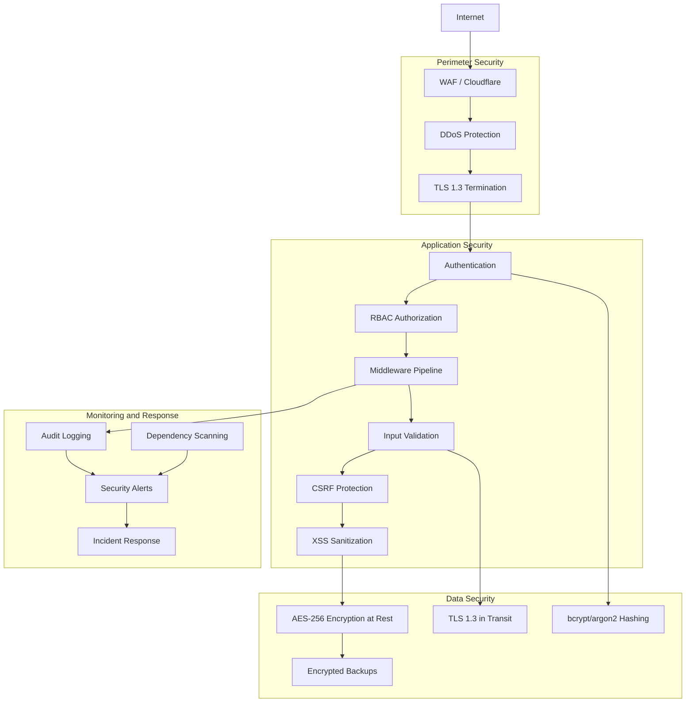
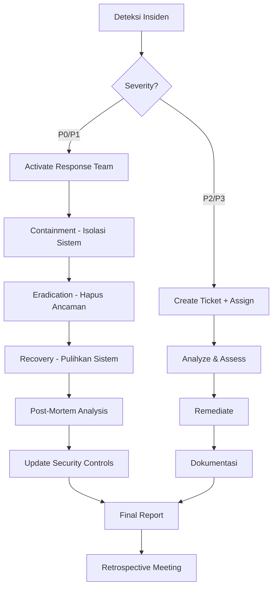
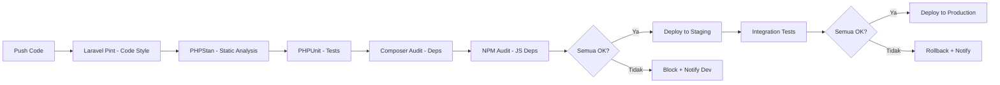

# 31 — Security Requirement

## Ikhtisar

Keamanan sistem RPS OBE adalah fondasi yang menjamin integritas data akademik, kerahasiaan informasi pengguna, dan ketersediaan layanan. Dokumen ini mendefinisikan persyaratan keamanan yang mencakup autentikasi, otorisasi, perlindungan data, mitigasi ancaman OWASP, keamanan API, keamanan file upload, keamanan sesi, security headers, audit logging, manajemen kerentanan, kepatuhan privasi, dan rencana respons insiden.

---

## Prinsip Keamanan

| Prinsip | Deskripsi |
|---------|-----------|
| **Defense in Depth** | Keamanan diterapkan berlapis — dari infrastruktur hingga aplikasi |
| **Least Privilege** | Setiap pengguna dan proses hanya memiliki akses minimal yang diperlukan |
| **Secure by Default** | Konfigurasi default selalu pada mode paling aman |
| **Fail Securely** | Kegagalan sistem tidak membocorkan informasi sensitif |
| **Auditability** | Semua aksi sensitif tercatat dan tidak dapat dihapus |
| **Privacy by Design** | Perlindungan data pribadi terintegrasi sejak awal desain |

---

## Arsitektur Keamanan



---

## 1. Authentication Security

### 1.1 Password Hashing

| Aspek | Spesifikasi |
|-------|-------------|
| **Algoritma Utama** | bcrypt dengan cost factor 12 (default Laravel) |
| **Algoritma Future** | argon2id (tersedia via Laravel driver switching) |
| **Salt** | Auto-generated per password (built-in bcrypt) |
| **Upgrade Strategy** | Re-hash password saat user login jika cost factor berubah |
| **Password History** | 5 password terakhir tidak dapat digunakan kembali |

### 1.2 Brute Force Protection

| Aspek | Spesifikasi |
|-------|-------------|
| **Metode** | Laravel Rate Limiter (`RateLimiter` facade) |
| **Threshold** | Maksimal 5 percobaan login gagal per email + IP dalam 1 menit |
| **Lockout Duration** | 15 menit setelah threshold tercapai |
| **Response** | HTTP 429 Too Many Requests dengan pesan "Terlalu banyak percobaan login. Silakan coba lagi dalam 15 menit." |
| **Bypass** | Super Admin dapat membuka lockout via panel admin |

### 1.3 Account Lockout

| Aspek | Spesifikasi |
|-------|-------------|
| **Pemicu** | 5 kali login gagal berturut-turut |
| **Durasi Lockout** | 15 menit (auto-unlock) |
| **Notifikasi** | Email ke user bahwa akun dikunci karena percobaan login mencurigakan |
| **Permanent Lock** | Admin dapat mengunci akun secara manual |
| **Unlock** | Via reset password atau admin intervention |

### 1.4 Password Policy

| Aturan | Spesifikasi |
|--------|-------------|
| **Panjang Minimal** | 8 karakter |
| **Kompleksitas** | Minimal 1 huruf besar, 1 huruf kecil, 1 angka, 1 karakter khusus |
| **Kedaluwarsa** | 90 hari (opsional per tenant, default: nonaktif) |
| **Reset Password** | Token reset berlaku 60 menit, single use |
| **First Login** | User yang diundang wajib mengganti password saat login pertama |

### 1.5 Multi-Factor Authentication (MFA) — Future

| Aspek | Spesifikasi | Prioritas |
|-------|-------------|-----------|
| **TOTP** | Time-based One-Time Password via Google Authenticator / Authy | P2 |
| **Email OTP** | One-Time Password via email sebagai fallback | P2 |
| **Enforcement** | Wajib untuk Super Admin dan Admin Universitas | P2 |
| **Opsi untuk role lain** | Optional (diaktifkan user via pengaturan akun) | P3 |

```php
// Contoh implementasi rate limiting login
RateLimiter::for('login', function (Request $request) {
    $key = Str::transliterate(
        Str::lower($request->input('email')) . '|' . $request->ip()
    );

    return Limit::perMinute(5)->by($key);
});
```

---

## 2. Authorization

### 2.1 Role-Based Access Control (RBAC)

| Aspek | Spesifikasi |
|-------|-------------|
| **Implementasi** | Laravel Gates & Policies + Spatie Permissions |
| **Role** | 8 role: Super Admin, Admin Univ, Admin Fakultas, Admin Prodi, Kaprodi, Reviewer, Dosen, LPM |
| **Permission** | Granular per resource + action (view, create, update, delete, approve) |
| **Middleware** | `auth`, `role:{role}`, `permission:{perm}`, `can:{policy}` |

### 2.2 Tenant Scoping

| Aspek | Spesifikasi |
|-------|-------------|
| **Implementasi** | Global scope pada model Eloquent + middleware |
| **Isolasi Data** | Setiap query otomatis terfilter `WHERE tenant_id = current_tenant_id` |
| **Cross-Tenant Access** | Hanya Super Admin yang dapat mengakses lintas tenant |
| **Tenant Context** | Di-set saat login, tidak dapat diubah oleh user biasa |
| **Verifikasi** | Setiap request diverifikasi bahwa resource yang diakses milik tenant user |

### 2.3 Middleware-Based Authorization

```php
Route::middleware(['auth', 'role:kaprodi'])->group(function () {
    Route::post('/rps/{rps}/approve', [RpsApprovalController::class, 'approve']);
});

Route::middleware(['auth', 'can:review,rps'])->group(function () {
    Route::post('/rps/{rps}/review', [ReviewController::class, 'submit']);
});

Route::middleware(['auth', 'tenant'])->group(function () {
    Route::get('/rps', [RpsController::class, 'index']);
});
```

### 2.4 IDOR Protection (Insecure Direct Object Reference)

| Aspek | Spesifikasi |
|-------|-------------|
| **Metode** | Model Binding + Policy check di setiap akses resource |
| **UUID** | Semua ID publik menggunakan UUID, bukan auto-increment integer |
| **Policy** | Setiap model memiliki Policy class yang memverifikasi ownership |
| **Double Check** | Middleware tenant scope + Policy check |

```php
class RpsPolicy
{
    public function view(User $user, Rps $rps): bool
    {
        if ($user->isSuperAdmin()) return true;
        if ($user->isLPM()) return $user->tenant_id === $rps->tenant_id;
        if ($user->isKaprodi()) return $user->prodi_id === $rps->prodi_id;
        if ($user->isDosen()) return $rps->dosen()->contains($user->id);
        return false;
    }
}
```

---

## 3. Data Protection

### 3.1 Encryption at Rest (AES-256)

| Aspek | Spesifikasi |
|-------|-------------|
| **Algoritma** | AES-256-GCM |
| **Library** | Laravel built-in Encryption (OpenSSL) |
| **Key Management** | `APP_KEY` di `.env` (tidak di-commit ke repository) |
| **Data yang Dienkripsi** | Personal Identifiable Information (PII): NIDN, NIP, email pribadi, data sensitif user |
| **Model Cast** | `encrypted` cast pada atribut Eloquent yang membutuhkan enkripsi |
| **Database Backup** | Seluruh file backup database dienkripsi sebelum disimpan |

### 3.2 Encryption in Transit (TLS 1.3)

| Aspek | Spesifikasi |
|-------|-------------|
| **Protokol** | TLS 1.3 (minimum TLS 1.2) |
| **Sertifikat** | Let's Encrypt (staging) / Commercial SSL (production) |
| **HSTS** | `Strict-Transport-Security: max-age=31536000; includeSubDomains; preload` |
| **Redirect** | HTTP ke HTTPS redirect di level Nginx/Cloudflare |
| **Cipher Suites** | Hanya cipher suite modern (ECDHE, AES-GCM) |
| **Certificate Transparency** | Diwajibkan untuk production |

### 3.3 Database Encryption

| Aspek | Spesifikasi |
|-------|-------------|
| **Disk-level** | MariaDB data-at-rest encryption (opsional, tergantung hosting) |
| **Column-level** | Field spesifik dienkripsi via Laravel `encrypted` cast |
| **Backup** | Database dump dienkripsi menggunakan GPG atau AES-256 sebelum disimpan ke storage eksternal |
| **Key Rotation** | Rotasi kunci enkripsi setiap 12 bulan (prosedur manual dengan downtime minimal) |

---

## 4. OWASP Top 10 Mitigation

### 4.1 A01: Broken Access Control

| Mitigasi | Implementasi |
|----------|-------------|
| RBAC + Policies | Setiap endpoint dicek via middleware `can:{policy}` |
| Tenant Scoping | Data otomatis terfilter berdasarkan tenant user |
| UUID | Resource ID tidak dapat ditebak (bukan auto-increment) |
| Deny by Default | Semua akses ditolak kecuali yang diizinkan secara eksplisit |

### 4.2 A02: Cryptographic Failures

| Mitigasi | Implementasi |
|----------|-------------|
| bcrypt/argon2 | Password hashing modern |
| AES-256-GCM | Enkripsi data sensitif |
| TLS 1.3 | Enkripsi data dalam perjalanan |
| No custom crypto | Tidak menggunakan algoritma kriptografi buatan sendiri |

### 4.3 A03: Injection (SQL Injection, Command Injection)

| Mitigasi | Implementasi |
|----------|-------------|
| **Prepared Statements** | Laravel Eloquent & Query Builder menggunakan parameter binding otomatis |
| **Input Validation** | Form Request validation di setiap input |
| **ORM Usage** | Wajib menggunakan Eloquent ORM; raw query hanya dengan binding parameter |
| **Escaping** | Blade auto-escapes output (`{{ }}` bukan `{!! !!}` kecuali trusted) |
| **Stored Procedures** | Tidak digunakan; semua query melalui Eloquent |

```php
// Raw query dengan parameter binding (jika diperlukan)
DB::select('SELECT * FROM rps WHERE prodi_id = :prodi', [
    'prodi' => $prodiId
]);

// Eloquent (default approach)
Rps::where('prodi_id', $prodiId)->get();
```

### 4.4 A04: Insecure Design

| Mitigasi | Implementasi |
|----------|-------------|
| **Threat Modeling** | Dilakukan sebelum memulai development fitur baru |
| **Security Review** | Setiap PR di-review dari aspek keamanan |
| **Design Patterns** | Repository pattern, Service layer, Policy-based authorization |
| **Rate Limiting** | Semua endpoint API dan login memiliki rate limit |

### 4.5 A05: Security Misconfiguration

| Mitigasi | Implementasi |
|----------|-------------|
| **Debug Mode** | `APP_DEBUG=false` di production |
| **Error Handling** | Error detail hanya di-log, tidak ditampilkan ke user |
| **Default Credentials** | Tidak ada default password; semua harus di-set saat deployment |
| **Unused Services** | Service yang tidak digunakan di-disable (contoh: database ports tidak expose ke public) |
| **Security Headers** | Semua security headers di-set di Nginx dan/atau middleware Laravel |

### 4.6 A06: Vulnerable and Outdated Components

| Mitigasi | Implementasi |
|----------|-------------|
| **Dependency Scanning** | `composer audit` dijalankan setiap minggu via CI/CD |
| **Dependabot/Renovate** | Automated PR untuk update dependency |
| **Version Pinning** | Semua dependency di-pin ke versi mayor.minor |
| **SBOM** | Software Bill of Materials dicatat setiap rilis |

### 4.7 A07: Identification and Authentication Failures

| Mitigasi | Implementasi |
|----------|-------------|
| **Rate Limiting** | 5 percobaan login per menit |
| **Password Policy** | Minimal 8 karakter + kompleksitas |
| **Session Management** | Session ID di-regenerasi setelah login |
| **Idle Timeout** | Session timeout setelah 30 menit inactivity |
| **MFA** | Tersedia untuk role sensitif (future) |

### 4.8 A08: Software and Data Integrity Failures

| Mitigasi | Implementasi |
|----------|-------------|
| **Composer** | `composer.lock` di-commit, integrity check via `composer install --check` |
| **NPM** | `package-lock.json` di-commit |
| **File Upload** | Validasi MIME + virus scanning (ClamAV) |
| **Deserialization** | Tidak menggunakan `unserialize()` pada input user; gunakan JSON |
| **CI/CD Pipeline** | Build artifact diverifikasi sebelum deployment |

### 4.9 A09: Security Logging and Monitoring Failures

| Mitigasi | Implementasi |
|----------|-------------|
| **Audit Log** | Semua aksi CRUD + perubahan status tercatat |
| **Log Integrity** | Audit log bersifat tamper-proof (tidak dapat dihapus kecuali Super Admin) |
| **Structured Logging** | JSON log format dengan level severity |
| **Alerts** | Notifikasi ke admin untuk aktivitas mencurigakan (multiple login gagal, akses tidak sah) |
| **Log Retention** | Minimal 12 bulan untuk audit log |

### 4.10 A10: Server-Side Request Forgery (SSRF)

| Mitigasi | Implementasi |
|----------|-------------|
| **URL Validation** | Validasi URL tujuan sebelum melakukan HTTP request |
| **Allowlist** | Hanya domain yang diizinkan yang dapat diakses (OpenAI API, Mailgun, dll.) |
| **Network Segmentation** | Server aplikasi tidak dapat mengakses internal network |
| **Timeouts** | Timeout 10 detik untuk semua external HTTP request |

---

## 5. API Security

### 5.1 Laravel Sanctum Authentication

| Aspek | Spesifikasi |
|-------|-------------|
| **Token Type** | Personal Access Token (PAT) dengan ability scoping |
| **Token Expiry** | Default 30 hari, dapat dikustomisasi |
| **Ability** | Token dibatasi ke ability spesifik: `rps:read`, `rps:write`, `review:submit` |
| **Token Rotation** | Token baru di-generate setiap kali user mengubah password |
| **Revocation** | Admin dapat me-revoke token dari panel |

### 5.2 Rate Limiting

| Endpoint Group | Limit | Window |
|---------------|-------|--------|
| **Login** | 5 request | Per menit |
| **Public API** | 60 request | Per menit |
| **Authenticated API** | 120 request | Per menit |
| **Report Generation** | 5 request | Per menit (proses mahal) |
| **AI Endpoint** | 20 request | Per menit |

### 5.3 CORS Configuration

| Aspek | Spesifikasi |
|-------|-------------|
| **Allowed Origins** | Hanya domain yang terdaftar (tidak menggunakan wildcard `*`) |
| **Allowed Methods** | `GET`, `POST`, `PUT`, `PATCH`, `DELETE` |
| **Allowed Headers** | `Content-Type`, `Authorization`, `X-Requested-With`, `Accept` |
| **Credentials** | `true` untuk cookie-based auth |
| **Max Age** | 86400 detik (24 jam) |

```php
// config/cors.php
return [
    'paths' => ['api/*', 'sanctum/csrf-cookie'],
    'allowed_origins' => [env('APP_URL'), 'https://admin.rps-obe.id'],
    'allowed_methods' => ['GET', 'POST', 'PUT', 'PATCH', 'DELETE'],
    'allowed_headers' => ['Content-Type', 'Authorization', 'X-Requested-With', 'Accept'],
    'supports_credentials' => true,
    'max_age' => 86400,
];
```

---

## 6. File Upload Security

### 6.1 MIME Validation

| Aspek | Spesifikasi |
|-------|-------------|
| **Whitelist Only** | Hanya MIME types yang diizinkan: PDF, DOCX, XLSX, PNG, JPG, JPEG |
| **Double Check** | Validasi MIME via `finfo` + ekstensi file |
| **Max Size** | 10MB per file, 50MB total per request |
| **Magic Bytes** | Verifikasi magic bytes file, bukan hanya ekstensi |

```php
$request->validate([
    'file' => [
        'required',
        'file',
        'max:10240', // 10MB
        'mimes:pdf,docx,xlsx,png,jpg,jpeg',
    ],
]);

// Secondary check
$mimeType = finfo_file(finfo_open(FILEINFO_MIME_TYPE), $file->path());
$allowed = ['application/pdf', 'image/png', 'image/jpeg', ...];
if (!in_array($mimeType, $allowed)) {
    throw new InvalidFileException('Tipe file tidak diizinkan.');
}
```

### 6.2 Virus Scanning

| Aspek | Spesifikasi |
|-------|-------------|
| **Scanner** | ClamAV (via socket atau CLI) — future |
| **Stage** | File di-scan setelah upload, sebelum disimpan permanen |
| **Infected** | File dihapus, user diberi notifikasi, admin diberi alert |
| **Timeout** | 30 detik untuk scanning; file >50MB di-reject sebelum scan |

### 6.3 File Storage Security

| Aspek | Spesifikasi |
|-------|-------------|
| **Storage Path** | Di luar `public/` directory; akses via controller proxy |
| **Filename** | Generate UUID-based filename, tidak menggunakan nama asli |
| **Directory** | `storage/app/uploads/{tenant_id}/{year}/{month}/` |
| **Permissions** | 0640 untuk file, 0750 untuk directory |
| **Direct Access** | Diblokir di level Nginx untuk directory storage |

### 6.4 Size Limits

| Tipe File | Max Size | Keterangan |
|-----------|----------|------------|
| **Dokumen RPS** | 5MB | Template, lampiran |
| **Gambar** | 3MB | Foto profil, ilustrasi |
| **Import Excel** | 10MB | Import data MK, CPL, dll. |
| **Export Laporan** | Tidak ada limit | File digenerate server-side |

---

## 7. Session Security

### 7.1 Cookie Configuration

| Atribut | Nilai | Keterangan |
|---------|-------|------------|
| **httpOnly** | `true` | Cookie tidak dapat diakses JavaScript |
| **secure** | `true` | Cookie hanya dikirim via HTTPS |
| **SameSite** | `Lax` | Mencegah CSRF, mengizinkan navigasi top-level |
| **Domain** | `.rps-obe.id` (production) | Scope ke domain aplikasi |
| **Path** | `/` | Scope ke seluruh aplikasi |

### 7.2 Session Timeout

| Aturan | Waktu | Keterangan |
|--------|-------|------------|
| **Idle Timeout** | 30 menit | Session expired setelah 30 menit tidak ada aktivitas |
| **Absolute Timeout** | 8 jam | Session expired setelah 8 jam (terlepas aktivitas) |
| **Remember Me** | 30 hari | Jika user mencentang "Ingat Saya" |
| **Password Change** | Invalidate all | Semua session di-invalidate setelah password diubah |

### 7.3 Session Security Measures

| Fitur | Implementasi |
|-------|-------------|
| **Session ID Regeneration** | Otomatis setelah login (Laravel default) |
| **Session Fixation Prevention** | Regenerasi ID di setiap privilege level change |
| **IP Validation** | Session diikat ke IP address (opsional, default: nonaktif) |
| **User Agent Validation** | Session diikat ke User Agent (default Laravel) |
| **Concurrent Sessions** | Maksimal 3 session aktif per user |

```php
// config/session.php
return [
    'driver' => 'redis',
    'lifetime' => 480, // 8 jam (absolute timeout)
    'expire_on_close' => false,
    'encrypt' => true,
    'secure' => env('SESSION_SECURE_COOKIE', true),
    'http_only' => true,
    'same_site' => 'lax',
];
```

---

## 8. Security Headers

### 8.1 Header Specifications

| Header | Nilai | Deskripsi |
|--------|-------|-----------|
| **Strict-Transport-Security** | `max-age=31536000; includeSubDomains; preload` | Paksa HTTPS |
| **Content-Security-Policy** | Lihat detail di bawah | Mencegah XSS, data injection |
| **X-Frame-Options** | `DENY` | Mencegah clickjacking |
| **X-Content-Type-Options** | `nosniff` | Mencegah MIME sniffing |
| **Referrer-Policy** | `strict-origin-when-cross-origin` | Kontrol informasi referrer |
| **Permissions-Policy** | `camera=(), microphone=(), geolocation=()` | Batasi API browser |
| **X-XSS-Protection** | `0` | Nonaktifkan auditor bawaan (digantikan CSP) |
| **Cache-Control** | `no-cache, no-store, must-revalidate` (untuk halaman sensitif) | |

### 8.2 Content Security Policy (CSP)

```
Content-Security-Policy:
    default-src 'self';
    script-src 'self' 'unsafe-inline' 'unsafe-eval' https://cdn.jsdelivr.net;
    style-src 'self' 'unsafe-inline' https://cdn.jsdelivr.net https://fonts.googleapis.com;
    font-src 'self' https://fonts.gstatic.com https://cdn.jsdelivr.net;
    img-src 'self' data: blob: https:;
    connect-src 'self' https://api.openai.com;
    frame-src 'none';
    object-src 'none';
    base-uri 'self';
    form-action 'self';
    upgrade-insecure-requests;
```

### 8.3 Implementasi

Headers di-set di dua level:

| Level | Metode |
|-------|--------|
| **Nginx** | `add_header` directive untuk header global |
| **Laravel Middleware** | `SecurityHeaders` middleware untuk header dinamis (CSP per halaman) |

```php
class SecurityHeaders
{
    public function handle(Request $request, Closure $next): Response
    {
        $response = $next($request);

        $response->headers->set('X-Frame-Options', 'DENY');
        $response->headers->set('X-Content-Type-Options', 'nosniff');
        $response->headers->set('Referrer-Policy', 'strict-origin-when-cross-origin');
        $response->headers->set('Permissions-Policy', 'camera=(), microphone=(), geolocation=()');

        return $response;
    }
}
```

---

## 9. Audit Logging

### 9.1 Prinsip Audit Log

| Prinsip | Deskripsi |
|---------|-----------|
| **Tamper-Proof** | Audit log tidak dapat dihapus oleh non-Super Admin |
| **Immutable** | Log yang sudah tercatat tidak dapat dimodifikasi |
| **Comprehensive** | Semua aksi CRUD + perubahan status + akses sensitif tercatat |
| **Structured** | Format JSON dengan skema yang konsisten |
| **Retention** | Minimal 12 bulan, diarsipkan setelahnya |

### 9.2 Data yang Dicatat

| Kolom | Deskripsi |
|-------|-----------|
| `id` | UUID primary key |
| `user_id` | ID pengguna yang melakukan aksi |
| `user_name` | Nama pengguna (snapshot, untuk referensi jika user dihapus) |
| `tenant_id` | Tenant scope saat aksi dilakukan |
| `action` | Tipe aksi: `created`, `updated`, `deleted`, `approved`, `rejected`, `exported` |
| `model_type` | FQCN model yang terpengaruh |
| `model_id` | UUID model |
| `old_values` | JSON — nilai sebelum perubahan (untuk update/delete) |
| `new_values` | JSON — nilai setelah perubahan (untuk create/update) |
| `ip_address` | IP address pengguna |
| `user_agent` | User agent browser |
| `url` | URL endpoint yang diakses |
| `created_at` | Timestamp aksi |

### 9.3 Tamper-Proof Mechanism

| Aspek | Implementasi |
|-------|-------------|
| **Delete Restriction** | Hanya Super Admin yang dapat menghapus audit log |
| **Hapus oleh Super Admin** | Dicatat sebagai audit log baru: "Audit log dihapus oleh Super Admin [nama]" |
| **Physical Integrity** | Log disimpan di tabel terpisah (`audit_logs`), bukan di log file |
| **Chain Verification** | Setiap log memiliki hash dari log sebelumnya (opsional, future) |

### 9.4 Retention & Archival

| Aturan | Periode |
|--------|---------|
| **Live Database** | 12 bulan |
| **Archive (S3/Glacier)** | 5 tahun (untuk keperluan audit akreditasi) |
| **Purge** | Data > 5 tahun dihapus permanen |

---

## 10. Vulnerability Management

### 10.1 Dependency Scanning

| Aspek | Spesifikasi |
|-------|-------------|
| **PHP Dependencies** | `composer audit` via GitHub Actions setiap minggu |
| **JavaScript Dependencies** | `npm audit` via GitHub Actions setiap minggu |
| **Dependabot** | Automated pull request untuk update keamanan |
| **Critical Vulnerabilities** | Harus diperbaiki dalam 24 jam |
| **High Vulnerabilities** | Diperbaiki dalam sprint berjalan |
| **Medium/Low** | Diperbaiki sesuai prioritas backlog |

### 10.2 Regular Security Testing

| Aktivitas | Frekuensi | Pelaksana |
|-----------|-----------|-----------|
| **Automated SAST** | Setiap push ke `main` branch | CI/CD (Larastan, Psalm, PHPStan with security rules) |
| **Dependency Audit** | Mingguan | CI/CD |
| **Manual Penetration Testing** | Sebelum major release | External security team |
| **OWASP ZAP Scan** | Bulanan (staging environment) | DevOps + Security |
| **Code Review (Security Focus)** | Setiap PR | Tech Lead |

### 10.3 Vulnerability Disclosure

| Aspek | Deskripsi |
|-------|-----------|
| **Kontak** | `security@rps-obe.id` |
| **Response Time** | Acknowledgment dalam 24 jam |
| **Fix Timeline** | Patch dalam 7 hari kerja untuk critical |
| **Responsible Disclosure** | Program bug bounty internal (future) |
| **CVE Monitoring** | Monitoring CVE untuk semua dependencies via Dependabot |

---

## 11. GDPR / Privacy Compliance

### 11.1 Data Pribadi yang Disimpan

| Data | Kategori | Retensi |
|------|----------|---------|
| Nama Lengkap | PII - Basic | Selama akun aktif + 2 tahun |
| Email | PII - Contact | Selama akun aktif + 2 tahun |
| NIDN / NIP | PII - Identifier | Selama akun aktif + 2 tahun |
| Foto Profil | PII - Biometric | Selama akun aktif |
| IP Address (audit log) | PII - Technical | 12 bulan |
| Riwayat RPS | Data Akademik | 5 tahun (akreditasi) |
| Log Aktivitas | Data Behavioral | 12 bulan |

### 11.2 Hak Subjek Data

| Hak | Implementasi |
|-----|-------------|
| **Right to Access** | User dapat mengunduh data pribadinya (fitur "Download Data Saya") |
| **Right to Rectification** | User dapat mengedit profil dan data pribadi |
| **Right to Erasure** | Akun dapat dihapus; data dianonimisasi dalam 30 hari |
| **Right to Restrict** | Akun dapat dinonaktifkan (data disimpan, akses diblokir) |
| **Right to Portability** | Data di-export dalam format JSON/CSV |
| **Right to Object** | User dapat menolak pemrosesan data tertentu |

### 11.3 Consent Management

| Aspek | Deskripsi |
|-------|-----------|
| **Cookie Consent** | Banner cookie dengan opsi terima/tolak kategori |
| **Notifikasi Email** | Opt-in (default: sesuai role) + dapat dinonaktifkan |
| **Analytics** | Opt-in (default: nonaktif untuk EU users) |
| **Terms & Privacy** | Harus disetujui saat registrasi |

---

## 12. Security Incident Response Plan

### 12.1 Incident Classification

| Severity | Contoh | Response SLA |
|----------|--------|-------------|
| **Critical (P0)** | Data breach, RCE vulnerability aktif, database compromise | Response < 1 jam |
| **High (P1)** | Defacement, account takeover, DDoS berhasil | Response < 4 jam |
| **Medium (P2)** | Vulnerable dependency ditemukan, percobaan brute force massal | Response < 24 jam |
| **Low (P3)** | Security misconfiguration minor, informasi non-sensitif terekspos | Response < 72 jam |

### 12.2 Response Process



### 12.3 Response Team

| Role | Tanggung Jawab |
|------|---------------|
| **Incident Commander** | Koordinasi respons, komunikasi stakeholder |
| **Security Lead** | Analisis teknis, forensic, mitigasi |
| **DevOps Lead** | Isolasi sistem, deployment patch, recovery |
| **Communication Lead** | Notifikasi user terpengaruh, pernyataan publik |
| **Legal/Compliance** | Pelaporan ke regulator (jika diperlukan), kepatuhan GDPR |

### 12.4 Communication Plan

| Waktu | Aksi Komunikasi |
|-------|----------------|
| **T+1 jam** | Notifikasi internal ke response team |
| **T+4 jam** | Update ke manajemen (untuk P0/P1) |
| **T+24 jam** | Pemberitahuan ke user terpengaruh (via email) |
| **T+72 jam** | Pemberitahuan ke otoritas perlindungan data (jika melibatkan data pribadi) |
| **Setelah resolved** | Post-mortem report internal + update security policy |

---

## 13. Secure Development Lifecycle

### 13.1 Development Practices

| Praktik | Deskripsi |
|---------|-----------|
| **Security Training** | Seluruh developer menyelesaikan OWASP Top 10 training |
| **Code Review** | Setiap PR di-review oleh minimal 1 developer lain |
| **Secure Coding Guidelines** | Dokumentasi standar coding aman (disimpan di `CONTRIBUTING.md`) |
| **Pre-commit Hooks** | Laravel Pint + PHPStan dengan security rules |
| **Secret Management** | Tidak ada secret yang di-hardcode; semua via `.env` atau vault |

### 13.2 CI/CD Security Checks



---

## 14. Environment Security

### 14.1 Environment Configuration

| Aspek | Spesifikasi |
|-------|-------------|
| **APP_DEBUG** | `false` di production |
| **APP_ENV** | `production` / `staging` / `local` |
| **DB_PASSWORD** | Minimal 16 karakter, karakter khusus |
| **APP_KEY** | Generate via `php artisan key:generate` |
| **Backup .env** | File `.env` tidak di-backup ke repository publik |
| **Environment Variables** | Semua credentials via environment variables, tidak di-hardcode |

### 14.2 Server Hardening

| Aspek | Spesifikasi |
|-------|-------------|
| **Firewall** | UFW/iptables: hanya port 80, 443, 22 (dari IP tertentu) |
| **SSH** | Key-based authentication, password auth disabled, port non-standard |
| **Fail2Ban** | Monitoring dan banning IP untuk percobaan brute force SSH |
| **Updates** | Security updates otomatis (unattended-upgrades) |
| **Nginx** | Worker processes minimal, server tokens off, buffer size limits |

---

## Compliance Checklist

| Standar | Requirement | Status |
|---------|-------------|--------|
| **OWASP Top 10** | Semua 10 kategori dimitigasi | Dalam desain |
| **GDPR (EU)** | Consent, right to access, right to erasure | Dalam desain |
| **UU PDP (Indonesia)** | Perlindungan data pribadi sesuai UU No. 27/2022 | Dalam desain |
| **BAN-PT** | Audit trail untuk akreditasi program studi | Dalam desain |
| **TLS 1.3** | Semua komunikasi dienkripsi | Dalam desain |
| **Password Policy** | bcrypt, minimal 8 karakter, kompleksitas | Dalam desain |

---

**Navigasi:** [Sebelumnya: Reporting Requirement](30-reporting-requirement.md) | [Daftar Isi](../README.md)
