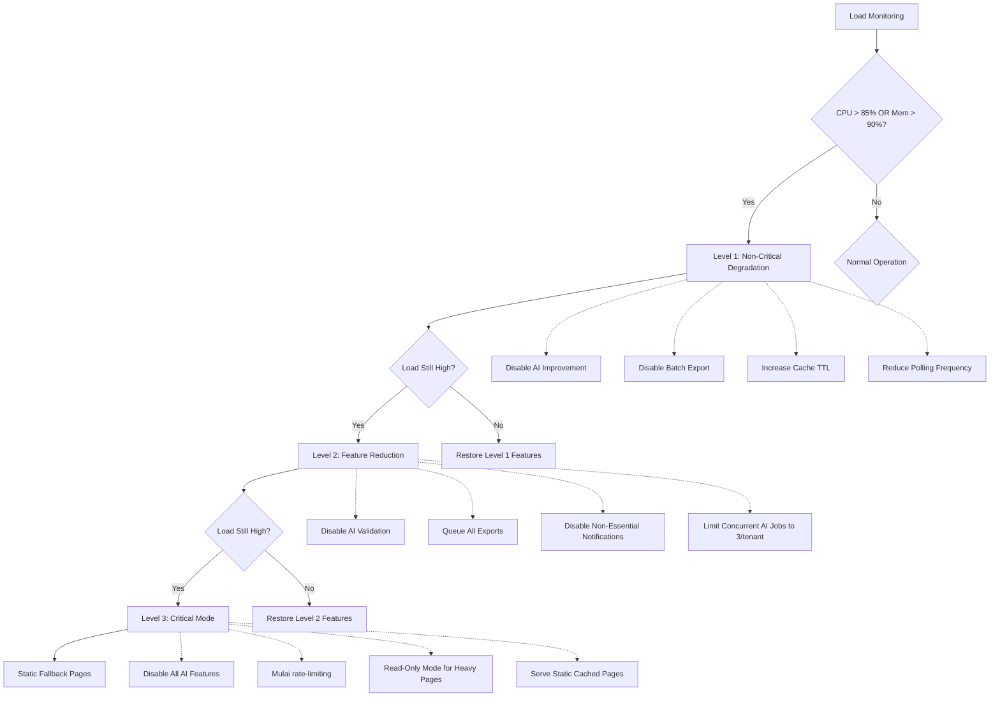

# 32 — Performance Requirement

## Ikhtisar

Performa sistem RPS OBE merupakan faktor kritis yang secara langsung memengaruhi pengalaman pengguna (UX), produktivitas dosen, dan adopsi sistem. Dokumen ini mendefinisikan target performa yang terukur, strategi optimasi lintas lapisan (frontend, backend, database, infrastruktur), alat pengujian dan pemantauan performa, serta strategi degradasi saat beban tinggi. Seluruh target mengacu pada standar Google Web Vitals dan best practice industri.

---

## Target Performa

### Frontend — Web Vitals

| No | Metrik | Target | Alat Verifikasi | Prioritas |
|----|--------|--------|-----------------|-----------|
| F01 | First Contentful Paint (FCP) | < 1,5 detik | Lighthouse / PageSpeed Insights | High |
| F02 | Largest Contentful Paint (LCP) | < 2,5 detik | Lighthouse / PageSpeed Insights | High |
| F03 | Time to Interactive (TTI) | < 3,0 detik | Lighthouse / k6 Browser | High |
| F04 | Total Blocking Time (TBT) | < 300 ms | Lighthouse | Medium |
| F05 | Cumulative Layout Shift (CLS) | < 0,1 | Lighthouse | Medium |
| F06 | Speed Index | < 3,5 detik | Lighthouse | Medium |

### Backend — API Response

| No | Metrik | Target | Kondisi | Alat Verifikasi |
|----|--------|--------|---------|-----------------|
| B01 | API response time p50 | < 200 ms | Normal load | k6 |
| B02 | API response time p95 | < 500 ms | Normal load | k6 |
| B03 | API response time p99 | < 1.000 ms | Normal load | k6 |
| B04 | API throughput | > 500 req/detik | Per tenant | k6 |
| B05 | API error rate | < 0,1% | All conditions | Prometheus |

### Database Query

| No | Metrik | Target | Kondisi | Alat Verifikasi |
|----|--------|--------|---------|-----------------|
| D01 | Query execution p50 | < 30 ms | All queries | Telescope / Query Monitor |
| D02 | Query execution p95 | < 100 ms | All queries | Telescope / Query Monitor |
| D03 | Slow queries (> 100 ms) | < 1% dari total | All queries | Telescope / Query Monitor |
| D04 | Connection pool usage | < 80% | Peak load | Monitoring dashboard |

### AI Generation

| No | Metrik | Target | Kondisi |
|----|--------|--------|---------|
| A01 | Time to first generation (single CPMK) | < 20 detik | GPT-4o-mini |
| A02 | Time to full RPS generation (8-14 CPMK) | < 120 detik | GPT-4o-mini, parallel processing |
| A03 | AI validation time | < 30 detik | Per dokumen RPS |
| A04 | AI improvement/refinement time | < 45 detik | Per iterasi |
| A05 | AI API timeout | < 60 detik | Per individual API call |
| A06 | AI retry interval | 5 detik | Exponential backoff |

### Ekspor RPS

| No | Metrik | Target | Kondisi |
|----|--------|--------|---------|
| E01 | Export single RPS to Word | < 15 detik | Standard template |
| E02 | Export single RPS to PDF | < 20 detik | Standard template |
| E03 | Export single RPS to Excel | < 10 detik | Raw data format |
| E04 | Batch export (10 RPS) | < 120 detik | Async queue-based |

### Konkurensi

| No | Metrik | Target | Kondisi |
|----|--------|--------|---------|
| C01 | Concurrent users per tenant | 500 | Normal operation |
| C02 | Concurrent AI generation jobs | 10 per tenant | Rate-limited |
| C03 | Concurrent export jobs | 5 per tenant | Queue-based |

---

## Strategi Optimasi

### Database Optimization

```mermaid
graph TB
    subgraph "Query Optimization"
        Q1[Eager Loading - with/load]
        Q2[Select Only Required Columns]
        Q3[Chunk for Large Datasets]
        Q4[Avoid N+1 Queries]
        Q5[Batch Insert/Update]
    end

    subgraph "Indexing Strategy"
        I1[Composite Indexes on WHERE/JOIN]
        I2[Full-Text Index for Search]
        I3[Foreign Key Indexes]
        I4[Covering Indexes for Read-Heavy Queries]
        I5[Partial Indexes for Frequent Filters]
    end

    subgraph "Caching Layer"
        C1[Query Cache - Hot Queries]
        C2[Redis Cache Key-Value]
        C3[Cache Tags for Invalidation]
        C4[TTL-Based Expiry]
        C5[Cache Warming Scheduler]
    end

    subgraph "Monitoring"
        M1[Slow Query Log]
        M2[Query EXPLAIN Analysis]
        M3[Deadlock Detection]
        M4[Index Usage Statistics]
        M5[Table Size Tracking]
    end

    Q1 --> I1
    Q2 --> I2
    Q3 --> C1
    Q4 --> M1
    Q5 --> M4
```



#### Implementasi Optimasi Database

1. **Eager Loading Wajib** — Setiap relasi yang diakses dari model wajib di-eager-load menggunakan `with()` atau `load()` untuk mencegah N+1 query problem.
2. **Composite Index** — Setiap kombinasi kolom yang sering digunakan dalam `WHERE` dan `JOIN` wajib memiliki composite index.
3. **Query Result Caching** — Query baca-berat (read-heavy) seperti daftar mata kuliah, dosen, dan referensi kurikulum di-cache dengan TTL 1 jam.
4. **Chunking** — Operasi massal (bulk operations) seperti ekspor batch atau sinkronisasi data wajib menggunakan `chunk()` untuk membatasi penggunaan memori.
5. **Connection Pooling** — Menggunakan connection pooling via MariaDB dengan pool size minimum 10 dan maksimum 50 per server aplikasi.

### Frontend Optimization

#### Livewire Performance Strategy

| Strategi | Implementasi | Manfaat |
|----------|--------------|---------|
| **Lazy Loading** | Gunakan `wire:init.lazy` untuk komponen di bawah fold | Mempercepat FCP dan LCP |
| **Defer Loading** | Defer komponen kompleks sampai interaksi pengguna | Mengurangi TTI dan TBT |
| **Skeleton Loading** | Placeholder animasi selama loading | Meningkatkan perceived performance |
| **Pagination** | Batasi data per halaman (20 items) | Mengurangi payload dan render time |
| **Wire:model.defer** | Tunda binding input sampai aksi submit | Mengurangi network request |
| **Polling Tuning** | Interval polling minimal 5 detik, dengan `wire:poll.keep-alive` | Mengurangi request idle |
| **Lazy Component Script** | Load Livewire script deferred | Mempercepat initial load |

#### Asset Optimization (Vite)

| Strategi | Konfigurasi | Target |
|----------|-------------|--------|
| **Code Splitting** | Vite dynamic import untuk rute Lazy-loaded | Kurangi bundle size utama |
| **Tree Shaking** | Khusus import: `import { component } from 'lib'` | Hilangkan kode tidak terpakai |
| **CSS Minification** | `cssnano` via PostCSS | Produksi CSS < 50 KB dipaketkan |
| **JS Minification** | `esbuild` via Vite (default Laravel) | Produksi JS < 200 KB dipaketkan |
| **Image Optimization** | Sharp/Laravel Glide untuk thumbnail/resize | Gambar < 100 KB per asset |
| **Font Optimization** | Self-host Google Fonts; subset latin-only | Kurangi blocking request |
| **Gzip/Brotli** | Nginx gzip_static / brotli pre-compressed | Kompresi aset statis |
| **Cache Busting** | Vite manifest hash di nama file | Cache invalidation akurat |

### Backend Optimization

#### Redis Caching Strategy

```php
// config/cache.php — Cache Store Configuration
return [
    'stores' => [
        'redis' => [
            'driver' => 'redis',
            'connection' => 'cache',
            'lock_connection' => 'default',
        ],
        'route-cache' => [           // Route caching (production only)
            'driver' => 'redis',
            'connection' => 'cache',
            'prefix' => 'routes:',
        ],
        'query-cache' => [           // Query result caching
            'driver' => 'redis',
            'connection' => 'cache',
            'prefix' => 'queries:',
        ],
    ],
    'default' => 'redis',
];
```

| Cache Type | TTL | Invalidation Trigger | Scope |
|------------|-----|---------------------|-------|
| Route Cache | 24 jam | Deployment / php artisan route:cache | Global |
| Config Cache | 24 jam | Deployment / php artisan config:cache | Global |
| Query Cache (Reference Data) | 1 jam | Data change event | Per tenant |
| View Cache (compiled Blade) | Sampai perubahan file view | File modification time | Global |
| Session Cache | Session lifetime (2 jam) | Expiry / logout | Per user |
| AI Prompt Template Cache | 24 jam | Template update | Global |
| Rate Limiter Cache | 1 menit | Time-based expiry | Per IP / user |
| API Response Cache | 5 menit | Cache tag invalidation | Per tenant |

#### Queue System for Heavy Operations

| Queue | Job Types | Workers | Priority | Retry |
|-------|-----------|---------|----------|-------|
| `default` | General async tasks | 2 workers | Medium | 3x |
| `ai-generation` | AI content generation | 5 workers | High | 2x |
| `ai-validation` | AI validation/review | 3 workers | High | 2x |
| `export` | Word/PDF/Excel generation | 3 workers | Medium | 3x |
| `notification` | Email, in-app notifications | 2 workers | Low | 5x |
| `maintenance` | Cleanup, backup, indexing | 1 worker | Low | 1x |

#### OPcache Configuration

```ini
; php.ini — Recommended OPcache settings for production
opcache.enable=1
opcache.memory_consumption=256
opcache.interned_strings_buffer=16
opcache.max_accelerated_files=20000
opcache.revalidate_freq=60
opcache.fast_shutdown=1
opcache.enable_cli=0
opcache.validate_timestamps=1                ; Non-zero for dev, 0 for production
opcache.revalidate_path=0
opcache.save_comments=1                      ; Required for annotations
opcache.enable_file_override=0
opcache.optimization_level=0x7FFEBFFF       ; Max optimization
opcache.max_file_size=0                      ; No limit
opcache.consistency_checks=0                 ; Disable in production
```

### CDN untuk Static Assets

| Asset Type | CDN Configuration | Cache Duration |
|------------|-------------------|----------------|
| Compiled JS/CSS (Vite build) | Cache 1 tahun (hash-based) | public, max-age=31536000, immutable |
| Images (logo, icons) | Cache 30 hari | public, max-age=2592000 |
| Font files (.woff2) | Cache 1 tahun | public, max-age=31536000 |
| Favicon / manifest | Cache 7 hari | public, max-age=604800 |

### HTTP/2 and TLS

- HTTP/2 diaktifkan pada Nginx reverse proxy untuk multiplexing request dan server push opsional.
- TLS 1.3 untuk mengurangi round-trip saat handshake.
- OCSP stapling diaktifkan untuk mengurangi latency validasi sertifikat.

---

## Performance Testing Strategy

### Alat Pengujian

| Alat | Penggunaan | Frekuensi | Lingkup |
|------|-----------|-----------|---------|
| **Lighthouse** | Audit Web Vitals per halaman kunci | Setiap sprint | Frontend |
| **PageSpeed Insights** | Validasi metrik Core Web Vitals | Setiap rilis | Frontend |
| **k6 (Grafana)** | Load testing API endpoint | Setiap rilis besar | Backend API |
| **Apache Bench (ab)** | Quick smoke test endpoint | Ad-hoc / debugging | Backend API |
| **Telescope** | Query profiling dan request tracing | Dev / staging | Full stack |
| **MySQL Slow Query Log** | Identifikasi slow queries | Continuous (production) | Database |

### Skenario Pengujian k6

```javascript
// k6-load-test.js — Contoh skenario load test
import http from 'k6/http';
import { check, sleep } from 'k6';

export const options = {
    stages: [
        { duration: '2m', target: 50 },   // Ramp-up ke 50 pengguna
        { duration: '5m', target: 200 },  // Ramp-up ke 200 pengguna
        { duration: '10m', target: 500 }, // Steady state 500 pengguna
        { duration: '2m', target: 0 },    // Ramp-down
    ],
    thresholds: {
        http_req_duration: ['p(95)<500', 'p(99)<1000'],
        http_req_failed: ['rate<0.001'],
    },
};

export default function () {
    const res = http.get('https://obe.university.ac.id/api/mata-kuliah');
    check(res, {
        'status is 200': (r) => r.status === 200,
        'response time p95 < 500ms': (r) => r.timings.duration < 500,
    });
    sleep(1);
}
```

### Acceptance Criteria

| Skenario | Throughput Target | Error Rate | Kondisi Lolos |
|----------|-------------------|------------|---------------|
| 50 VUs, 5 menit | > 500 req/s | < 0,01% | Semua threshold terpenuhi |
| 200 VUs, 10 menit | > 400 req/s | < 0,05% | Semua threshold terpenuhi |
| 500 VUs, 15 menit | > 300 req/s | < 0,1% | Tidak ada crash, error rate < 0,1% |
| 1000 VUs (spike test) | > 200 req/s | < 1% | Sistem pulih dalam < 60 detik |

---

## Performance Monitoring

### Laravel Telescope (Development / Staging)

| Fitur Telescope | Data yang Dimonitor | Action |
|-----------------|---------------------|--------|
| Requests | URL, method, status, duration, memory | Identifikasi slow endpoint |
| Queries | SQL, bindings, duration, N+1 detection | Optimasi query, tambah eager loading |
| Commands | Scheduled/queued commands, duration | Optimasi command execution |
| Jobs | Queue jobs, attempts, duration, failures | Identifikasi bottleneck queue |
| Events | Event dispatch dan listener duration | Optimasi event chain |
| Cache | Cache hits/misses, key operations | Evaluasi keefektifan caching |
| Exceptions | Uncaught exceptions dengan stack trace | Debugging dan perbaikan |
| Logs | Application log entries dengan context | Troubleshooting |

### Custom Metrics (Production)

```php
// app/Support/PerformanceMetrics.php
class PerformanceMetrics
{
    public function recordApiResponse(string $endpoint, float $duration, int $statusCode): void
    {
        // Kirim ke monitoring service (Prometheus / InfluxDB)
        Histogram::observe('api_response_duration_seconds', $duration, [
            'endpoint' => $endpoint,
            'status_code' => (string) $statusCode,
        ]);
    }

    public function recordQueryExecution(string $queryType, float $duration, string $tenant): void
    {
        Histogram::observe('db_query_duration_seconds', $duration, [
            'query_type' => $queryType,
            'tenant' => $tenant,
        ]);
    }

    public function recordAiGeneration(string $type, float $duration, int $tokenCount, float $cost): void
    {
        Histogram::observe('ai_generation_duration_seconds', $duration, ['type' => $type]);
        Counter::increment('ai_tokens_total', $tokenCount, ['type' => $type]);
        Counter::increment('ai_cost_total', $cost, ['type' => $type]);
    }
}
```

| Metrik | Tipe Metrik | Labels | Alert Threshold |
|--------|------------|--------|-----------------|
| `api_response_duration_seconds` | Histogram | endpoint, status_code | p95 > 500ms |
| `db_query_duration_seconds` | Histogram | query_type, tenant | p95 > 100ms |
| `ai_generation_duration_seconds` | Histogram | type | p95 > 20s |
| `cache_hit_ratio` | Gauge | cache_store | < 0.8 |
| `queue_depth` | Gauge | queue_name | > 100 |
| `active_users` | Gauge | tenant | — |
| `memory_usage_bytes` | Gauge | server | > 80% |
| `cpu_usage_percent` | Gauge | server | > 70% |

---

## Strategi Degradasi di Bawah Beban Tinggi

### Prioritas Degradasi



### Tabel Degradasi

| Level | Pemicu | Fitur yang Dinonaktifkan | Fitur Tetap Aktif | Recovery |
|-------|--------|-------------------------|-------------------|----------|
| **Level 1** | CPU > 80% atau memory > 85% selama 2 menit | AI improvement, batch export, polling > 15s | Core CRUD, AI generation dasar, single export | Otomatis saat beban normal selama 5 menit |
| **Level 2** | CPU > 90% atau memory > 92% selama 2 menit | AI validation, semua export di-queue, notifikasi non-esensial | Core CRUD, AI generation (rate-limited), view RPS | Otomatis saat load < 80% selama 5 menit |
| **Level 3** | CPU > 95% atau memory > 95% selama 1 menit | Semua AI features, halaman berat mode read-only | Login, view RPS, halaman statis | Manual + otomatis setelah load < 70% selama 10 menit |

### Rate Limiting Configuration

```php
// app/Http/Kernel.php — Rate Limiter
use Illuminate\Cache\RateLimiting\Limit;
use Illuminate\Support\Facades\RateLimiter;

RateLimiter::for('api', function (Request $request) {
    return Limit::perMinute(60)->by($request->user()?->id ?: $request->ip());
});

RateLimiter::for('ai-generation', function (Request $request) {
    return Limit::perMinute(5)->by($request->tenant_id . ':' . $request->user()->id);
});

RateLimiter::for('export', function (Request $request) {
    return Limit::perMinute(3)->by($request->tenant_id . ':' . $request->user()->id);
});

RateLimiter::for('login', function (Request $request) {
    return Limit::perMinute(5)->by($request->ip());
});
```

---

## Performance Budget

| Resource | Budget | Rationale |
|----------|--------|-----------|
| Total JS bundle size (initial) | < 350 KB (gzipped) | Lighthouse recommend max 350 KB |
| Total CSS bundle size | < 100 KB (gzipped) | Untuk render blocking resource |
| Page weight total | < 2 MB | Termasuk images, fonts, assets |
| HTTP requests per page (initial) | < 30 | Termasuk third-party resources |
| Memory usage per PHP request | < 128 MB | Laravel default yang ditingkatkan |
| Web worker thread | < 2 | Untuk Livewire dan polling |

---

## Verifikasi dan Validasi Performa

### Checklist Per Sprint

- [ ] Lighthouse audit untuk 3 halaman utama (Dashboard, Editor RPS, Daftar RPS)
- [ ] Telescope slow query check — identifikasi query > 100ms
- [ ] N+1 query detection via Telescope / Laravel Debugbar
- [ ] Cache hit/miss ratio di atas 80%
- [ ] Vite build size check — asset budget compliance

### Checklist Per Rilis

- [ ] Full k6 load test dengan 500 VU
- [ ] PageSpeed Insights untuk Core Web Vitals (FCP, LCP, TBT, CLS)
- [ ] Database index usage review (EXPLAIN analysis)
- [ ] OPcache status dan memory consumption review
- [ ] Redis memory usage dan eviction policy review
- [ ] CDN cache hit ratio di atas 90%
- [ ] SSL/TLS handshake time < 100ms

---

## Continuous Performance Regression

1. **CI Pipeline** — Setiap pull request wajib menjalankan Lighthouse CI dengan budget yang telah ditetapkan. Build gagal jika metrik melampaui budget.
2. **Nightly Performance Test** — k6 load test dijalankan otomatis setiap malam pada staging environment terhadap endpoint API utama.
3. **Production Monitoring** — Alert otomatis via Prometheus/Grafana jika p95 response time melampaui 500ms atau error rate melampaui 0,1%.

---

**Navigasi:** [Sebelumnya: Security Requirement](31-security-requirement.md) | [Daftar Isi](../README.md) | [Berikutnya: Scalability Requirement](33-scalability-requirement.md)
