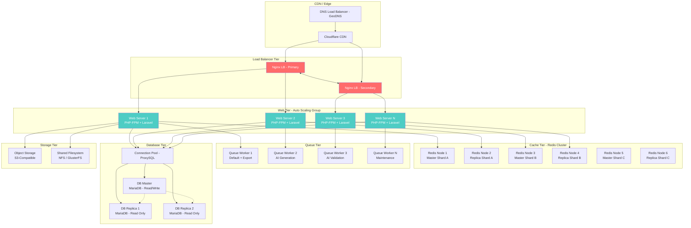
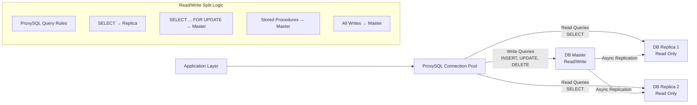
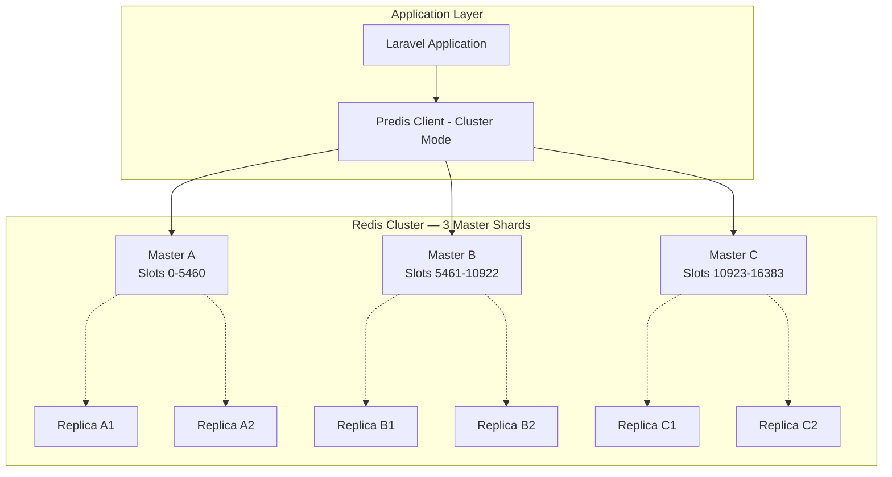
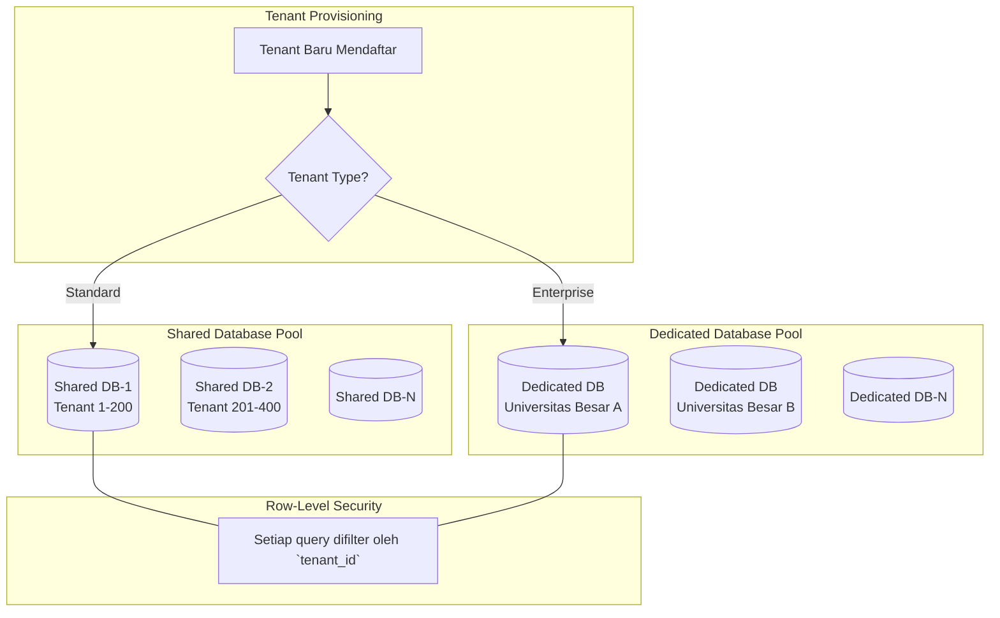
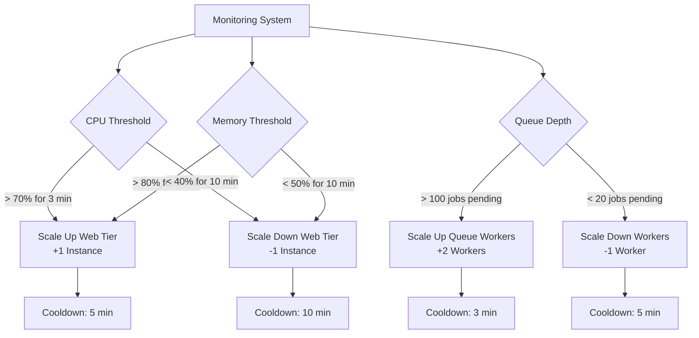

# 33 — Scalability Requirement

## Ikhtisar

Skalabilitas sistem RPS OBE dirancang untuk mendukung pertumbuhan organisasi dari puluhan hingga ribuan tenant tanpa degradasi performa. Dokumen ini mendefinisikan arsitektur horizontal scaling, strategi scaling per lapisan (web, database, queue, storage, caching), pertimbangan multi-tenant, mekanisme auto-scaling, konfigurasi load balancing, serta proyeksi kapasitas jangka panjang untuk memastikan sistem dapat tumbuh seiring adopsi.

---

## Prinsip Skalabilitas

| Prinsip | Deskripsi |
|---------|-----------|
| **Horizontal over Vertical** | Scale-out (tambah node) diutamakan daripada scale-up (tambah resource satu node) |
| **Stateless by Design** | Web tier tidak menyimpan state; semua state dipindahkan ke Redis (session) atau database |
| **Shared-Nothing Architecture** | Setiap node aplikasi independen — tidak ada shared memory/filesystem |
| **Decoupled via Queues** | Operasi berat di-decouple menggunakan message queue (Redis/RabbitMQ) |
| **Cache-First Strategy** | Data yang sering diakses di-cache untuk mengurangi beban database |
| **Graceful Degradation** | Sistem tetap berfungsi (dengan fitur terbatas) saat sebagian komponen gagal |

---

## Arsitektur Horizontal Scaling



---

## Stateless Web Tier

### Prinsip Stateless

Server aplikasi harus stateless. Semua state dipindahkan ke penyimpanan eksternal:

| State Type | Storage | Konfigurasi |
|------------|---------|-------------|
| **Session** | Redis (key: `session:{id}`) | `SESSION_DRIVER=redis`, `SESSION_LIFETIME=120` |
| **Cache** | Redis (key: `cache:{key}`) | `CACHE_DRIVER=redis` |
| **CSRF Token** | Redis / Session | Otomatis via Laravel session |
| **Rate Limiter State** | Redis | `RATE_LIMITER_DRIVER=redis` |
| **File Uploads (sementara)** | Shared filesystem (NFS) atau S3 | `FILESYSTEM_DISK=s3` |
| **Temporary Processing Files** | `/tmp` lokal atau shared volume | File dibersihkan setelah proses selesai |

### Konfigurasi Session di Redis

```ini
# .env — Production Session Configuration
SESSION_DRIVER=redis
SESSION_LIFETIME=120
SESSION_ENCRYPT=true
SESSION_SECURE_COOKIE=true
SESSION_HTTP_ONLY=true
SESSION_SAME_SITE=lax
SESSION_DOMAIN=.obe.university.ac.id
```

```php
// config/session.php — Redis session connection
'session' => [
    'driver' => 'redis',
    'connection' => 'session',
    'store' => null,
    'lottery' => [2, 100], // 2% chance to sweep expired sessions
    'cookie' => 'rps_obe_session',
    'path' => '/',
    'domain' => env('SESSION_DOMAIN'),
    'secure' => env('SESSION_SECURE_COOKIE', true),
    'http_only' => true,
    'same_site' => 'lax',
    'partitioned' => false,
],
```

---

## Database Scaling

### Strategi Read/Write Splitting



### Laravel Database Configuration (Read/Write Split)

```php
// config/database.php
'mysql' => [
    'driver' => 'mysql',
    'read' => [
        'host' => [
            env('DB_READ_HOST_1', 'db-replica-1.internal'),
            env('DB_READ_HOST_2', 'db-replica-2.internal'),
        ],
        'port' => env('DB_PORT', '3306'),
    ],
    'write' => [
        'host' => env('DB_WRITE_HOST', 'db-master.internal'),
        'port' => env('DB_PORT', '3306'),
    ],
    'sticky' => true,  // Request yang write akan terus baca dari master
    'database' => env('DB_DATABASE', 'rps_obe'),
    'username' => env('DB_USERNAME'),
    'password' => env('DB_PASSWORD'),
    'charset' => 'utf8mb4',
    'collation' => 'utf8mb4_unicode_ci',
    'prefix' => '',
    'options' => [
        PDO::ATTR_PERSISTENT => false,
        PDO::MYSQL_ATTR_INIT_COMMAND => "SET NAMES utf8mb4 COLLATE utf8mb4_unicode_ci",
    ],
],
```

### Connection Pooling (ProxySQL)

| Setting | Value | Rationale |
|---------|-------|-----------|
| Max connections per web server | 50 | 10 server × 50 = 500 total pool |
| Max connections to master | 100 | Kapasitas write penuh |
| Max connections to each replica | 150 | Read-heavy workload |
| Connection timeout | 30 detik | Mencegah hung connections |
| Idle timeout | 300 detik | Reclaim idle connections |
| Max query retry | 2 | Auto-retry pada replica jika gagal |

---

## Queue Workers Scaling

### Arsitektur Queue Multi-Worker

```mermaid
graph TB
    subgraph "Redis Queue Storage"
        Q_DEFAULT[Queue: default]
        Q_AI_GEN[Queue: ai-generation]
        Q_AI_VALID[Queue: ai-validation]
        Q_EXPORT[Queue: export]
        Q_NOTIFY[Queue: notification]
        Q_MAINT[Queue: maintenance]
    end

    subgraph "Worker Pool - AI Generation"
        W_AI1[Worker AI-1]
        W_AI2[Worker AI-2]
        W_AI3[Worker AI-3]
        W_AI4[Worker AI-4]
        W_AI5[Worker AI-5]
    end

    subgraph "Worker Pool - Export"
        W_EX1[Worker Export-1]
        W_EX2[Worker Export-2]
        W_EX3[Worker Export-3]
    end

    subgraph "Worker Pool - Default/Notification"
        W_DEF1[Worker Default-1]
        W_DEF2[Worker Default-2]
    end

    subgraph "Worker Pool - Maintenance"
        W_MNT1[Worker Maint-1]
    end

    Q_AI_GEN --> W_AI1
    Q_AI_GEN --> W_AI2
    Q_AI_GEN --> W_AI3
    Q_AI_GEN --> W_AI4
    Q_AI_GEN --> W_AI5

    Q_AI_VALID --> W_AI1
    Q_AI_VALID --> W_AI2
    Q_AI_VALID --> W_AI3

    Q_EXPORT --> W_EX1
    Q_EXPORT --> W_EX2
    Q_EXPORT --> W_EX3

    Q_DEFAULT --> W_DEF1
    Q_DEFAULT --> W_DEF2

    Q_NOTIFY --> W_DEF1
    Q_NOTIFY --> W_DEF2

    Q_MAINT --> W_MNT1
```



### Supervisor Configuration per Worker Pool

```ini
; /etc/supervisor/conf.d/rps-obe-ai-generation.conf
[program:rps-obe-ai-gen]
process_name=%(program_name)s_%(process_num)02d
command=php /var/www/artisan queue:work redis --queue=ai-generation --timeout=300 --tries=2
autostart=true
autorestart=true
numprocs=5
stopwaitsecs=600
stdout_logfile=/var/log/supervisor/rps-obe-ai-gen.log
stderr_logfile=/var/log/supervisor/rps-obe-ai-gen-error.log

; /etc/supervisor/conf.d/rps-obe-export.conf
[program:rps-obe-export]
process_name=%(program_name)s_%(process_num)02d
command=php /var/www/artisan queue:work redis --queue=export --timeout=180 --tries=3
autostart=true
autorestart=true
numprocs=3
stopwaitsecs=300
stdout_logfile=/var/log/supervisor/rps-obe-export.log
stderr_logfile=/var/log/supervisor/rps-obe-export-error.log

; /etc/supervisor/conf.d/rps-obe-default.conf
[program:rps-obe-default]
process_name=%(program_name)s_%(process_num)02d
command=php /var/www/artisan queue:work redis --queue=default,notification --timeout=60 --tries=5
autostart=true
autorestart=true
numprocs=2
stopwaitsecs=120
stdout_logfile=/var/log/supervisor/rps-obe-default.log
stderr_logfile=/var/log/supervisor/rps-obe-default-error.log
```

---

## File Storage Scaling

### Konfigurasi Object Storage (S3-Compatible)

```php
// config/filesystems.php
'disks' => [
    's3' => [
        'driver' => 's3',
        'key' => env('AWS_ACCESS_KEY_ID'),
        'secret' => env('AWS_SECRET_ACCESS_KEY'),
        'region' => env('AWS_DEFAULT_REGION', 'ap-southeast-1'),
        'bucket' => env('AWS_BUCKET', 'rps-obe-storage'),
        'url' => env('AWS_URL'),
        'endpoint' => env('AWS_ENDPOINT'),
        'use_path_style_endpoint' => env('AWS_USE_PATH_STYLE_ENDPOINT', false),
        'throw' => false,
        'options' => [
            'CacheControl' => 'max-age=31536000, public',
            'ContentDisposition' => 'inline',
        ],
    ],

    // Tenant-scoped disk (prefix by tenant_id)
    'tenant-uploads' => [
        'driver' => 's3',
        'key' => env('AWS_ACCESS_KEY_ID'),
        'secret' => env('AWS_SECRET_ACCESS_KEY'),
        'region' => env('AWS_DEFAULT_REGION', 'ap-southeast-1'),
        'bucket' => env('AWS_BUCKET'),
        'url' => env('AWS_URL'),
        'endpoint' => env('AWS_ENDPOINT'),
        'use_path_style_endpoint' => env('AWS_USE_PATH_STYLE_ENDPOINT', false),
        'root' => null, // Path akan di-set dinamis per tenant
    ],
],
```

### Struktur Penyimpanan

```
rps-obe-storage/
├── {tenant_id}/
│   ├── rps/
│   │   ├── exports/          # File Word/PDF hasil ekspor
│   │   │   └── {rps_id}/
│   │   │       ├── rps_v2_2026-08-01.docx
│   │   │       └── rps_v2_2026-08-01.pdf
│   │   └── uploads/          # File pendukung yang diunggah
│   │       └── {rps_id}/
│   ├── templates/            # Template dokumen kustom tenant
│   └── logo/                 # Logo institusi
├── shared/
│   ├── templates/            # Template default sistem
│   └── references/           # Referensi bersama (SN-DIKTI, dll)
└── backups/                  # Snapshots dan backup terjadwal
```

---

## Caching Layer Scaling (Redis Cluster)

### Arsitektur Redis Cluster



### Key Distribution Strategy

| Key Pattern | Slot Hashing | Scope |
|-------------|-------------|-------|
| `session:{uuid}` | CRC16 of `{uuid}` → slot | Hash tag tidak dibutuhkan |
| `cache:{tenant_id}:{key}` | CRC16 of `{tenant_id}` → slot | Hash tag `{tenant_id}` memastikan semua cache tenant di shard yang sama |
| `rate_limit:{user_id}:{action}` | CRC16 of `{user_id}` → slot | Hash tag memastikan consistency |
| `queue:{queue_name}` | CRC16 of `{queue_name}` → slot | Setiap queue di shard berbeda |
| `lock:{resource}` | CRC16 of `{resource}` → slot | Hash tag untuk lock consistency |

### Redis Cluster Memory Planning

| Data Type | Estimated Size per Tenant | Year 1 (50 tenants) | Year 3 (500 tenants) | Year 5 (3000 tenants) |
|-----------|--------------------------|---------------------|-----------------------|------------------------|
| Session | 10 MB | 500 MB | 5 GB | 30 GB |
| Query Cache | 20 MB | 1 GB | 10 GB | 60 GB |
| Route/Config Cache | 5 MB | 50 MB | 250 MB | 500 MB |
| Queue Data | 50 MB | 500 MB | 5 GB | 30 GB |
| Rate Limiter | 2 MB | 100 MB | 1 GB | 6 GB |
| **Total per Node (3 shards)** | — | ~700 MB/node | ~7 GB/node | ~42 GB/node |

---

## Multi-Tenant Considerations

### Perbandingan Strategi Multi-Tenant

| Aspek | Database per Tenant | Shared Database (Schema/Tenant ID) | Hybrid |
|-------|--------------------|-----------------------------------|--------|
| **Isolasi Data** | Sempurna — setiap tenant punya DB sendiri | Row-level via `tenant_id` | DB terpisah untuk tenant besar, shared untuk kecil |
| **Skalabilitas** | Mudah scale-out — pindahkan DB tenant ke server lain | Terbatas oleh kapasitas single DB | Fleksibel — tenant besar bisa di-shard sendiri |
| **Maintenance** | Backup/patch per DB — overhead administrative | Maintenance tunggal | Complex — dua mekanisme berbeda |
| **Cost** | Mahal — resource per tenant | Murah — resource sharing | Menengah |
| **Implementasi** | Manual tenant provisioning | Sederhana via middleware | Kompleks — routing logic |
| **Rekomendasi** | Enterprise / high-security tenant | UMKM / institusi kecil-menengah | **Dipilih untuk RPS OBE** |

### Rekomendasi: Strategi Hybrid



### Implementasi Multi-Tenant Middleware

```php
// app/Http/Middleware/TenantScope.php
namespace App\Http\Middleware;

use Closure;
use Illuminate\Http\Request;

class TenantScope
{
    public function handle(Request $request, Closure $next): mixed
    {
        if ($tenant = $request->user()?->tenant) {
            // Set tenant context secara global
            app()->instance('current_tenant', $tenant);

            // Konfigurasi koneksi database jika dedicated DB
            if ($tenant->hasDedicatedDatabase()) {
                config(['database.connections.tenant' => $tenant->getDatabaseConfig()]);
            }

            // Set scope global untuk shared DB
            \App\Models\TenantScopedModel::setTenantScope($tenant->id);
        }

        return $next($request);
    }
}
```

### Isolasi Data — Row-Level Security

```php
// app/Models/Concerns/TenantScoped.php
trait TenantScoped
{
    protected static function bootTenantScoped(): void
    {
        static::addGlobalScope('tenant', function (Builder $builder) {
            $tenantId = app('current_tenant')?->id;

            if ($tenantId) {
                $builder->where($builder->getModel()->getTable() . '.tenant_id', $tenantId);
            }
        });

        static::creating(function ($model) {
            if (! $model->tenant_id) {
                $model->tenant_id = app('current_tenant')?->id;
            }
        });
    }
}
```

---

## Auto-Scaling Triggers

### Skenario Auto-Scaling



### Auto-Scaling Parameters

| Tier | Scale-Up Trigger | Scale-Down Trigger | Min Instances | Max Instances | Cooldown |
|------|-----------------|-------------------|---------------|---------------|----------|
| **Web Tier** | CPU > 70% OR Memory > 80% (3 menit) | CPU < 40% AND Memory < 50% (10 menit) | 2 | 10 | 5 menit |
| **Queue Workers (AI)** | Queue depth > 100 (1 menit) | Queue depth < 20 (5 menit) | 2 | 8 | 3 menit |
| **Queue Workers (Export)** | Queue depth > 50 (1 menit) | Queue depth < 10 (5 menit) | 1 | 5 | 3 menit |
| **Database Replicas** | Query load p95 > 80ms (5 menit) | Query load p95 < 30ms (15 menit) | 1 | 4 | 10 menit |
| **Redis Shards** | Memory usage > 75% (5 menit) | Memory usage < 40% (30 menit) | 3 | 9 | 15 menit |

### Cron-Based Scaling (Fallback untuk manual/VM-based deployment)

```php
// app/Console/Commands/CheckAutoScaling.php
namespace App\Console\Commands;

use Illuminate\Console\Command;

class CheckAutoScaling extends Command
{
    protected $signature = 'scaling:check';
    protected $description = 'Check system metrics and trigger scaling actions';

    public function handle(): void
    {
        $metrics = $this->gatherMetrics();

        // Web tier scaling
        if ($metrics['cpu'] > 0.70 || $metrics['memory'] > 0.80) {
            $this->scaleUpWebTier();
        } elseif ($metrics['cpu'] < 0.40 && $metrics['memory'] < 0.50) {
            $this->scaleDownWebTier();
        }

        // Queue worker scaling
        if ($metrics['queue_depth']['ai-generation'] > 100) {
            $this->scaleUpWorkers('ai-generation', 2);
        }

        // Logging and alerting
        $this->logScalingDecision($metrics);
    }
}
```

---

## Load Balancing

### Nginx Configuration (Layer 7)

```nginx
# /etc/nginx/sites-available/rps-obe.conf
upstream rps_obe_backend {
    least_conn;                             # Algoritma: least connections
    server web-01.internal:8080 weight=3 max_fails=3 fail_timeout=30s;
    server web-02.internal:8080 weight=3 max_fails=3 fail_timeout=30s;
    server web-03.internal:8080 weight=2 max_fails=3 fail_timeout=30s;
    server web-04.internal:8080 weight=2 max_fails=3 fail_timeout=30s backup;

    keepalive 64;                           # Keep-alive connections to upstream
}

server {
    listen 443 ssl http2;
    server_name obe.university.ac.id;

    ssl_certificate     /etc/ssl/certs/rps-obe.crt;
    ssl_certificate_key /etc/ssl/private/rps-obe.key;
    ssl_protocols       TLSv1.3;

    # Health check endpoint
    location /api/health {
        proxy_pass http://rps_obe_backend;
        health_check interval=10 fails=3 passes=2 uri=/api/health;
    }

    # Sticky session (optional — not needed if truly stateless)
    # ip_hash;  — Uncomment jika dibutuhkan untuk debugging

    location / {
        proxy_pass http://rps_obe_backend;
        proxy_http_version 1.1;
        proxy_set_header Upgrade $http_upgrade;
        proxy_set_header Connection "upgrade";
        proxy_set_header Host $host;
        proxy_set_header X-Real-IP $remote_addr;
        proxy_set_header X-Forwarded-For $proxy_add_x_forwarded_for;
        proxy_set_header X-Forwarded-Proto $scheme;
        proxy_read_timeout 120s;
        proxy_send_timeout 120s;
    }

    # Static assets
    location /build/ {
        alias /var/www/public/build/;
        expires 1y;
        add_header Cache-Control "public, immutable";
    }
}
```

### Health Check Logic

```php
// app/Http/Controllers/Api/HealthController.php
namespace App\Http\Controllers\Api;

use Illuminate\Http\JsonResponse;
use Illuminate\Support\Facades\Cache;
use Illuminate\Support\Facades\DB;
use Illuminate\Support\Facades\Redis;

class HealthController
{
    public function basic(): JsonResponse
    {
        return response()->json([
            'status' => 'ok',
            'timestamp' => now()->toIso8601String(),
        ]);
    }

    public function detailed(): JsonResponse
    {
        $checks = [
            'database' => $this->checkDatabase(),
            'redis' => $this->checkRedis(),
            'storage' => $this->checkStorage(),
            'queue' => $this->checkQueue(),
        ];

        $healthy = collect($checks)->every(fn($c) => $c['status'] === 'ok');

        return response()->json([
            'status' => $healthy ? 'ok' : 'degraded',
            'timestamp' => now()->toIso8601String(),
            'checks' => $checks,
        ], $healthy ? 200 : 503);
    }

    private function checkDatabase(): array
    {
        try {
            DB::select('SELECT 1');
            return ['status' => 'ok', 'response_time_ms' => round(microtime(true) - LARAVEL_START, 3) * 1000];
        } catch (\Exception $e) {
            return ['status' => 'error', 'message' => $e->getMessage()];
        }
    }

    private function checkRedis(): array
    {
        try {
            Redis::ping();
            return ['status' => 'ok'];
        } catch (\Exception $e) {
            return ['status' => 'error', 'message' => $e->getMessage()];
        }
    }

    private function checkStorage(): array
    {
        try {
            $disk = Storage::disk('s3');
            $disk->exists('health-check.txt') || $disk->put('health-check.txt', 'ok');
            return ['status' => 'ok', 'disk' => 's3'];
        } catch (\Exception $e) {
            return ['status' => 'error', 'message' => $e->getMessage()];
        }
    }

    private function checkQueue(): array
    {
        try {
            $queueSizes = [
                'ai-generation' => Queue::size('ai-generation'),
                'export' => Queue::size('export'),
                'default' => Queue::size('default'),
            ];
            $status = collect($queueSizes)->every(fn($s) => $s < 500) ? 'ok' : 'warning';
            return ['status' => $status, 'queue_sizes' => $queueSizes];
        } catch (\Exception $e) {
            return ['status' => 'error', 'message' => $e->getMessage()];
        }
    }
}
```

---

## Proyeksi Kapasitas

### Model Pertumbuhan

| Tahun | Tenant | Rata-Rata RPS per Tenant | Total RPS | Mata Kuliah | Dosen Aktif | Concurrent Users Peak |
|-------|--------|--------------------------|-----------|-------------|-------------|----------------------|
| **Year 1** | 50 | 100 | 5.000 | 2.500 | 500 | 250 |
| **Year 2** | 150 | 150 | 22.500 | 7.500 | 1.500 | 500 |
| **Year 3** | 500 | 200 | 100.000 | 25.000 | 5.000 | 1.500 |
| **Year 4** | 1.200 | 250 | 300.000 | 60.000 | 12.000 | 3.000 |
| **Year 5** | 3.000 | 300 | 900.000 | 150.000 | 30.000 | 6.000 |

### Kebutuhan Infrastruktur per Tahun

| Komponen | Year 1 | Year 2 | Year 3 | Year 4 | Year 5 |
|----------|--------|--------|--------|--------|--------|
| **Web Servers** (vCPU 4 / 8 GB RAM) | 2 | 3 | 5 | 8 | 12 |
| **Database Master** (vCPU 8 / 16 GB RAM) | 1 (SSD 100 GB) | 1 (SSD 250 GB) | 1 (SSD 500 GB) | 1 (NVMe 1 TB) | 1 (NVMe 2 TB) |
| **Database Replicas** (vCPU 4 / 8 GB RAM) | 1 | 2 | 3 | 4 | 5 |
| **Redis Nodes** (vCPU 2 / 4 GB RAM) | 3 | 4 | 6 | 8 | 12 |
| **Queue Workers** (vCPU 2 / 4 GB RAM) | 3 | 5 | 8 | 12 | 18 |
| **Object Storage** (S3) | 50 GB | 250 GB | 1 TB | 3 TB | 8 TB |
| **Load Balancer** | 1 (HA pair) | 1 (HA pair) | 2 (HA pair) | 2 (HA pair) | 3 (HA pair) |
| **CDN Bandwidth** | 500 GB/month | 1 TB/month | 3 TB/month | 10 TB/month | 25 TB/month |

### Kapasitas Maksimum Desain Saat Ini

| Komponen | Kapasitas Maksimum | Perlu Scale-Up pada |
|----------|-------------------|---------------------|
| Single Web Server | 500 req/s | > 400 req/s sustained |
| Single Database Master | 3.000 QPS | > 2.000 QPS sustained |
| Redis Cluster (3 shards) | 100.000 ops/s | > 80.000 ops/s |
| Single Object Storage Bucket | Unlimited (S3) | Tidak terbatas |
| CDN Bandwidth | 100 TB/month (Cloudflare Business) | > 80 TB/month |

---

## Verifikasi Skalabilitas

### Checklist Per Fase

**Fase Pengembangan:**
- [ ] Web tier configured stateless (session di Redis)
- [ ] Database read/write splitting dikonfigurasi di Laravel
- [ ] Queue system terpisah per jenis pekerjaan
- [ ] Object storage (S3) terintegrasi untuk file uploads
- [ ] Health check endpoint tersedia (`/api/health`, `/api/health/detailed`)

**Fase Staging:**
- [ ] Horizontal scaling diuji dengan 3+ web server
- [ ] Database failover diuji (simulasi master failure)
- [ ] Redis Cluster failover diuji (simulasi shard failure)
- [ ] Auto-scaling trigger diuji dengan k6 load test (ramp ke 1000 VU)
- [ ] CDN cache behavior diverifikasi

**Fase Produksi:**
- [ ] Load balancer health check aktif
- [ ] Connection pooling (ProxySQL) berfungsi
- [ ] Supervisor queue worker auto-restart terkonfigurasi
- [ ] Alerting untuk scaling triggers aktif
- [ ] Dokumentasi scaling runbook siap

---

**Navigasi:** [Sebelumnya: Performance Requirement](32-performance-requirement.md) | [Daftar Isi](../README.md) | [Berikutnya: Backup Strategy](34-backup-strategy.md)
