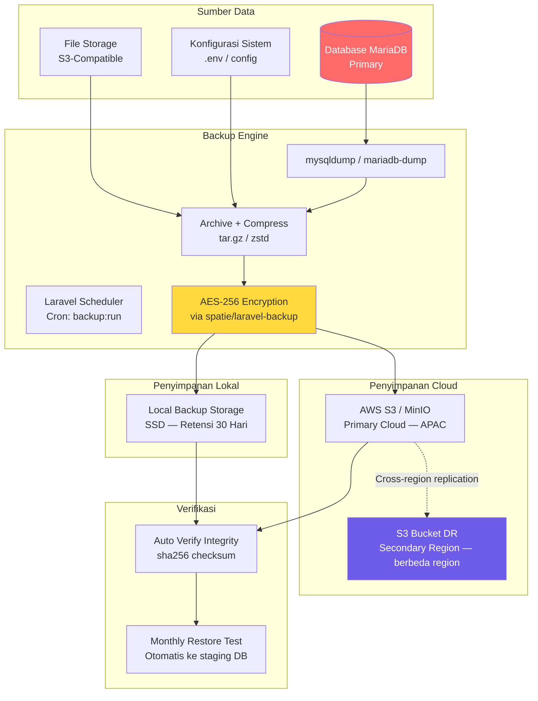
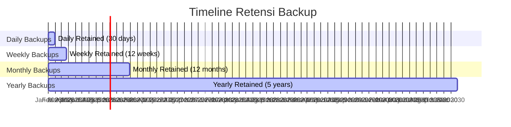
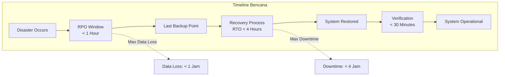
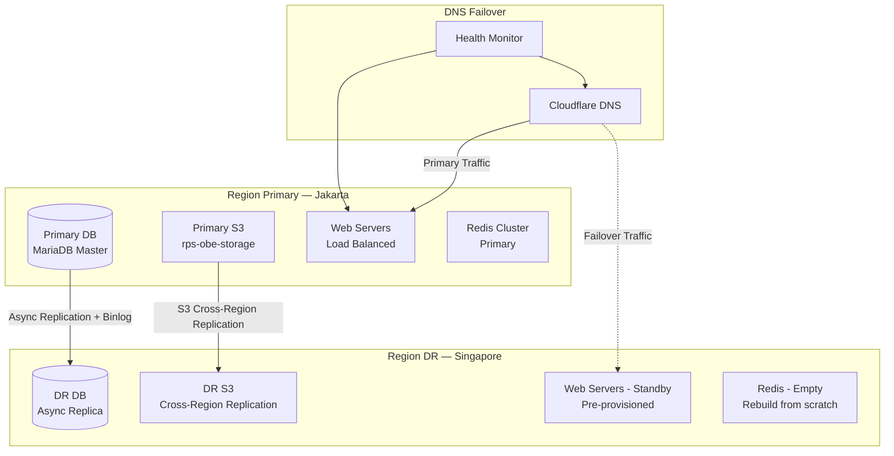

# 34 — Backup Strategy

## Ikhtisar

Strategi backup RPS OBE dirancang untuk menjamin integritas, ketersediaan, dan pemulihan data akademik yang bersifat kritikal. Dokumen ini mendefinisikan kebijakan backup menyeluruh yang mencakup frekuensi, tipe, penyimpanan, retensi, enkripsi, verifikasi, Disaster Recovery Plan (DRP), otomatisasi backup via Laravel scheduler, serta monitoring dan alerting untuk memastikan data RPS, referensi kurikulum, dan konfigurasi sistem selalu terlindungi dan dapat dipulihkan dalam waktu yang telah ditentukan.

---

## Prinsip Backup

| Prinsip | Deskripsi |
|---------|-----------|
| **3-2-1 Rule** | Minimal 3 salinan data, pada 2 media berbeda, 1 di antaranya off-site |
| **Encryption Everywhere** | Semua backup dienkripsi — in transit dan at rest |
| **Automation-First** | Backup dijadwalkan otomatis; tidak ada backup manual rutin |
| **Verification-Driven** | Setiap backup diverifikasi; restore test dilakukan berkala |
| **Retention by Criticality** | Data lebih kritikal disimpan lebih lama |
| **Disaster-Ready** | DR plan terdefinisi jelas dengan RTO dan RPO terukur |

---

## Arsitektur Backup



---

## Jadwal Backup

### Frekuensi Backup

| Tipe Backup | Frekuensi | Waktu Eksekusi | Data yang Dicakup | Metode |
|-------------|-----------|----------------|-------------------|--------|
| **Full Backup** | Setiap hari | 02:00 WIB | Seluruh database, file storage, konfigurasi | `mysqldump` + archive full filesystem |
| **Incremental Backup** | Setiap 6 jam | 06:00, 12:00, 18:00, 00:00 WIB | Perubahan database sejak full backup terakhir | Binary log (binlog) incremental |
| **Transaction Log Backup** | Kontinu (setiap 15 menit) | Real-time | MariaDB binary logs | `mariadb-binlog` flush ke file |
| **Configuration Backup** | Setiap deploy | Triggered by CI/CD | `.env`, `config/*.php`, `routes/*.php`, `docker-compose.yml` | Git-tagged archive |
| **Manual Backup** | On-demand | Sebelum major deployment/upgrade | Full + pre-migration snapshot | Manual trigger via artisan command |

### Laravel Scheduler Configuration

```php
// app/Console/Kernel.php
namespace App\Console;

use Illuminate\Console\Scheduling\Schedule;
use Illuminate\Foundation\Console\Kernel as ConsoleKernel;

class Kernel extends ConsoleKernel
{
    protected function schedule(Schedule $schedule): void
    {
        // Full backup — 02:00 WIB setiap hari
        $schedule->command('backup:run --only-db')
            ->dailyAt('02:00')
            ->timezone('Asia/Jakarta')
            ->onOneServer()
            ->emailOutputOnFailure(env('BACKUP_ALERT_EMAIL'))
            ->runInBackground()
            ->withoutOverlapping(120); // 2 jam max

        // Full file storage backup — 03:00 WIB setiap hari
        $schedule->command('backup:run --only-files')
            ->dailyAt('03:00')
            ->timezone('Asia/Jakarta')
            ->onOneServer()
            ->emailOutputOnFailure(env('BACKUP_ALERT_EMAIL'))
            ->runInBackground()
            ->withoutOverlapping(180); // 3 jam max

        // Incremental backup (binlog) — setiap 6 jam
        $schedule->command('backup:incremental')
            ->cron('0 */6 * * *')
            ->timezone('Asia/Jakarta')
            ->onOneServer()
            ->withoutOverlapping(30);

        // Backup verification — setiap hari pukul 05:00 WIB
        $schedule->command('backup:verify --days=1')
            ->dailyAt('05:00')
            ->timezone('Asia/Jakarta')
            ->onOneServer()
            ->emailOutputOnFailure(env('BACKUP_ALERT_EMAIL'));

        // Monthly restore test — hari pertama setiap bulan
        $schedule->command('backup:restore-test --latest')
            ->monthlyOn(1, '03:00')
            ->timezone('Asia/Jakarta')
            ->onOneServer()
            ->emailOutputOnFailure(env('BACKUP_ALERT_EMAIL'));

        // Cleanup old backups
        $schedule->command('backup:clean')
            ->dailyAt('04:00')
            ->timezone('Asia/Jakarta')
            ->onOneServer();
    }
}
```

---

## Tipe Backup

### 1. Full Database Backup

```bash
# Perintah mysqldump dengan kompresi zstd
mysqldump \
    --host=${DB_HOST} \
    --port=${DB_PORT} \
    --user=${DB_USER} \
    --password=${DB_PASSWORD} \
    --single-transaction \
    --routines \
    --triggers \
    --events \
    --set-gtid-purged=OFF \
    --databases rps_obe \
    | zstd -T4 -3 > /backups/db/rps_obe_full_$(date +%Y%m%d_%H%M%S).sql.zst
```

| Parameter | Nilai | Keterangan |
|-----------|-------|------------|
| `--single-transaction` | Ya | Konsistensi snapshot tanpa lock tabel (InnoDB) |
| `--routines` | Ya | Backup stored procedures dan functions |
| `--triggers` | Ya | Backup semua trigger |
| `--events` | Ya | Backup scheduled events |
| `--set-gtid-purged=OFF` | Ya | Hindari konflik GTID saat restore ke server lain |
| Compression | zstd -T4 -3 | Multithreaded compression, level 3 (fast/balanced) |

### 2. Incremental Backup (MariaDB Binary Log)

```bash
# Flush dan backup binary logs
mariadb-binlog \
    --host=${DB_HOST} \
    --user=${DB_USER} \
    --password=${DB_PASSWORD} \
    --read-from-remote-server \
    --raw \
    --stop-never \
    --stop-never-slave-server-id=9999 \
    /backups/db/binlog/
```

| Konfigurasi MariaDB | Value |
|---------------------|-------|
| `log_bin` | `/var/log/mysql/mariadb-bin` |
| `binlog_format` | `ROW` |
| `expire_logs_days` | `7` |
| `max_binlog_size` | `500M` |
| `sync_binlog` | `1` (safest — write each transaction to disk) |

### 3. File Storage Backup

Backup file storage menggunakan `rclone` untuk sinkronisasi ke S3:

```bash
# Sync dari S3 primary ke S3 backup bucket
rclone sync s3-primary:rps-obe-storage s3-backup:rps-obe-backup-$(date +%Y%m%d) \
    --transfers 16 \
    --checkers 32 \
    --fast-list \
    --exclude "backups/**" \
    --exclude "tmp/**" \
    --log-file /var/log/backup/file-storage-sync.log
```

### 4. Configuration Backup

```php
// app/Console/Commands/BackupConfiguration.php
namespace App\Console\Commands;

use Illuminate\Console\Command;
use Illuminate\Support\Facades\Storage;

class BackupConfiguration extends Command
{
    protected $signature = 'backup:config';

    public function handle(): void
    {
        $timestamp = now()->format('Ymd_His');

        // Backup .env (dengan masking secrets)
        $envContent = file_get_contents(base_path('.env'));
        $maskedEnv = preg_replace('/([A-Z_]+SECRET|PASSWORD|KEY|TOKEN)=(.+)/', '$1=[REDACTED]', $envContent);
        Storage::disk('s3-backup')->put("config/{$timestamp}/.env.masked", $maskedEnv);

        // Backup seluruh folder config
        $configArchive = storage_path("app/backup/config-{$timestamp}.tar.gz");
        exec("tar -czf {$configArchive} -C " . base_path() . " config/ routes/ docker-compose.yml");
        Storage::disk('s3-backup')->put("config/{$timestamp}/config.tar.gz", fopen($configArchive, 'r'));
        unlink($configArchive);

        $this->info("Configuration backup completed: {$timestamp}");
    }
}
```

---

## Konfigurasi spatie/laravel-backup

```php
// config/backup.php — Konfigurasi terpadu
return [
    'backup' => [
        'name' => env('APP_NAME', 'rps-obe'),
        'source' => [
            'files' => [
                'include' => [
                    base_path('.env'),
                    base_path('storage/app/public'),
                ],
                'exclude' => [
                    base_path('vendor'),
                    base_path('node_modules'),
                    storage_path('framework/cache'),
                    storage_path('framework/views'),
                    storage_path('logs'),
                ],
            ],
            'databases' => [
                'mysql',
            ],
        ],
        'database_dump_compressor' => Spatie\DbDumper\Compressors\GzipCompressor::class,
        'destination' => [
            'filename_prefix' => 'rps-obe-backup-',
            'disks' => [
                'local-backup',    // Penyimpanan lokal
                's3-backup',       // Penyimpanan cloud primary
            ],
        ],
        'temporary_directory' => storage_path('app/backup-temp'),
    ],

    'cleanup' => [
        'strategy' => \Spatie\Backup\Tasks\Cleanup\Strategies\DefaultStrategy::class,
        'default_strategy' => [
            'keep_all_backups_for_days' => 7,
            'keep_daily_backups_for_days' => 30,
            'keep_weekly_backups_for_weeks' => 12,
            'keep_monthly_backups_for_months' => 12,
            'keep_yearly_backups_for_years' => 5,
            'delete_oldest_backups_when_using_more_megabytes_than' => 500000, // 500 GB
        ],
    ],

    'monitor_backups' => [
        [
            'name' => env('APP_NAME', 'rps-obe'),
            'disks' => ['local-backup', 's3-backup'],
            'health_checks' => [
                \Spatie\Backup\Tasks\Monitor\HealthChecks\MaximumAgeInDays::class => 1,
                \Spatie\Backup\Tasks\Monitor\HealthChecks\MaximumStorageInMegabytes::class => 500000,
            ],
        ],
        'notifications' => [
            'notifications' => [
                \Spatie\Backup\Notifications\Notifications\BackupHasFailedNotification::class => ['mail'],
                \Spatie\Backup\Notifications\Notifications\UnhealthyBackupWasFoundNotification::class => ['mail', 'slack'],
                \Spatie\Backup\Notifications\Notifications\CleanupHasFailedNotification::class => ['mail'],
                \Spatie\Backup\Notifications\Notifications\BackupWasSuccessfulNotification::class => [],
                \Spatie\Backup\Notifications\Notifications\HealthyBackupWasFoundNotification::class => [],
                \Spatie\Backup\Notifications\Notifications\CleanupWasSuccessfulNotification::class => [],
            ],
            'mail' => [
                'to' => env('BACKUP_ALERT_EMAIL', 'devops@university.ac.id'),
            ],
            'slack' => [
                'webhook_url' => env('SLACK_WEBHOOK_BACKUP'),
            ],
        ],
    ],
];
```

---

## Retensi Backup

### Kebijakan Retensi



### Tabel Retensi Detail

| Tipe Backup | Retensi | Jumlah Tersimpan | Lokasi | Akhir Masa Retensi |
|-------------|---------|-----------------|--------|-------------------|
| Full Database (Harian) | 30 hari | ~30 copy | Lokal + S3 | Rotasi harian otomatis |
| Incremental (6-jam) | 7 hari | ~28 copy | Lokal | Ditimpa oleh full backup berikutnya |
| Transaction Log (15-menit) | 48 jam | ~192 file | Lokal | Hanya untuk point-in-time recovery terbaru |
| Weekly (Mingguan) | 12 minggu | 12 copy | S3 | Rotasi mingguan otomatis |
| Monthly (Bulanan) | 12 bulan | 12 copy | S3 + S3 DR | Rotasi tahunan otomatis |
| Yearly (Tahunan) | 5 tahun | 5 copy | S3 + S3 DR (Glacier Deep Archive) | Arsip jangka panjang |
| Configuration Backup | 1 tahun | ~365 copy | S3 | Rotasi otomatis |

### Storage Tiers

| Tier | Estimasi Ukuran (Year 5) | Biaya per GB/Bulan |
|------|-------------------------|---------------------|
| **Lokal SSD (30 hari harian)** | ~500 GB | Lokal — fixed cost |
| **S3 Standard (weekly/monthly)** | ~2 TB | ~$0.025 |
| **S3 DR Cross-Region** | ~3 TB (replicated) | ~$0.030 + transfer |
| **S3 Glacier Deep Archive (yearly)** | ~1 TB | ~$0.002 |

---

## Enkripsi Backup

### Implementasi AES-256

```php
// app/Support/BackupEncryption.php
namespace App\Support;

use Illuminate\Support\Facades\Crypt;

class BackupEncryption
{
    /**
     * Encrypt backup file content with AES-256-CBC
     */
    public function encrypt(string $content, string $keyPath): string
    {
        $key = $this->loadKey($keyPath);

        $iv = random_bytes(16);
        $encrypted = openssl_encrypt(
            $content,
            'aes-256-cbc',
            $key,
            OPENSSL_RAW_DATA,
            $iv
        );

        // Prepend IV to ciphertext for decryption
        return base64_encode($iv . $encrypted);
    }

    /**
     * Decrypt backup file content
     */
    public function decrypt(string $payload, string $keyPath): string
    {
        $key = $this->loadKey($keyPath);
        $data = base64_decode($payload);

        $iv = substr($data, 0, 16);
        $ciphertext = substr($data, 16);

        return openssl_decrypt(
            $ciphertext,
            'aes-256-cbc',
            $key,
            OPENSSL_RAW_DATA,
            $iv
        );
    }

    private function loadKey(string $path): string
    {
        return trim(file_get_contents($path));
    }

    /**
     * Generate a new AES-256 backup key (one-time)
     */
    public function generateKey(): string
    {
        return bin2hex(random_bytes(32)); // 256-bit key
    }
}
```

### Manajemen Kunci Enkripsi

| Key Type | Lokasi | Akses | Rotasi |
|----------|--------|-------|--------|
| Backup Encryption Key | HashiCorp Vault / AWS KMS / `.backup-key` (secure) | DevOps Lead + CTO | 6 bulan |
| S3 Access Key | `.env` / IAM Role (preferred) | Otomatis via IAM | 3 bulan |
| GPG Key (opsional — untuk transport) | Hardware Security Module (HSM) | DevOps Lead | 12 bulan |

---

## Verifikasi Backup

### Verifikasi Harian Otomatis

```php
// app/Console/Commands/BackupVerify.php
namespace App\Console\Commands;

use Illuminate\Console\Command;
use Illuminate\Support\Facades\Storage;

class BackupVerify extends Command
{
    protected $signature = 'backup:verify {--days=1 : Verify backups from last N days}';

    public function handle(): void
    {
        $disk = Storage::disk('s3-backup');
        $sinceDate = now()->subDays((int) $this->option('days'));

        $backups = collect($disk->allFiles())
            ->filter(function ($file) use ($sinceDate) {
                return str_contains($file, 'rps-obe-backup-')
                    && $disk->lastModified($file) >= $sinceDate->timestamp;
            });

        $this->info("Verifying {$backups->count()} backup files...");

        foreach ($backups as $file) {
            try {
                // 1. Verify file integrity (checksum)
                $expectedChecksum = $disk->get($file . '.sha256');
                $actualChecksum = hash_file('sha256', $disk->path($file));

                if ($expectedChecksum !== $actualChecksum) {
                    throw new \RuntimeException("Checksum mismatch: {$file}");
                }

                // 2. Verify archive structure (can be extracted)
                if (str_ends_with($file, '.zip')) {
                    $zip = new \ZipArchive();
                    if ($zip->open($disk->path($file)) !== true) {
                        throw new \RuntimeException("Corrupted archive: {$file}");
                    }
                    $zip->close();
                }

                // 3. Verify file size > 0
                if ($disk->size($file) < 1024) { // < 1KB suspicious
                    throw new \RuntimeException("File too small: {$file}");
                }

                $this->info("  OK: {$file}");

            } catch (\Exception $e) {
                $this->error("  FAILED: {$file} — {$e->getMessage()}");

                // Alert admin
                \Spatie\Backup\Events\UnhealthyBackupWasFound::dispatch($file, $e->getMessage());
            }
        }
    }
}
```

### Monthly Restore Test (Otomatis)

```php
// app/Console/Commands/BackupRestoreTest.php
namespace App\Console\Commands;

use Illuminate\Console\Command;
use Illuminate\Support\Facades\DB;
use Illuminate\Support\Facades\Process;

class BackupRestoreTest extends Command
{
    protected $signature = 'backup:restore-test {--latest : Use latest backup}';

    public function handle(): void
    {
        $this->info('Starting monthly restore test...');

        // 1. Download latest backup from S3
        $latestBackup = $this->getLatestBackupPath();
        $localPath = storage_path("app/restore-test/{$latestBackup['filename']}");
        Storage::disk('s3-backup')->copy($latestBackup['path'], $localPath);

        // 2. Create temporary test database
        $testDb = 'rps_obe_restore_test_' . now()->format('Ymd');
        DB::statement("CREATE DATABASE IF NOT EXISTS `{$testDb}`");

        // 3. Restore to test database
        $command = sprintf(
            'zstd -d -c %s | mysql --host=%s --user=%s --password=%s %s',
            escapeshellarg($localPath),
            escapeshellarg(config('database.connections.mysql.host')),
            escapeshellarg(config('database.connections.mysql.username')),
            escapeshellarg(config('database.connections.mysql.password')),
            escapeshellarg($testDb)
        );

        $result = Process::timeout(600)->run($command);

        if (!$result->successful()) {
            $this->error('Restore failed: ' . $result->errorOutput());
            $this->sendAlert('RESTORE TEST GAGAL', $result->errorOutput());
            return self::FAILURE;
        }

        // 4. Run integrity checks
        $tableCount = DB::connection('restore-test')->select('SELECT COUNT(*) as count FROM information_schema.tables WHERE table_schema = ?', [$testDb]);
        $rowCount = DB::connection('restore-test')->table('rps_mata_kuliah')->count();

        $this->info("Restore successful — Tables: {$tableCount[0]->count}, Mata Kuliah rows: {$rowCount}");

        // 5. Cleanup test database
        DB::statement("DROP DATABASE IF EXISTS `{$testDb}`");
        unlink($localPath);

        // 6. Generate report
        $this->generateRestoreReport([
            'timestamp' => now()->toIso8601String(),
            'backup_file' => $latestBackup['filename'],
            'table_count' => $tableCount[0]->count,
            'data_sample' => "mata_kuliah: {$rowCount} rows",
            'status' => 'SUCCESS',
        ]);

        $this->sendAlert('Restore Test Berhasil', 'Monthly restore test completed successfully.');
    }
}
```

### Kriteria Lulus Verifikasi

| Pemeriksaan | Metode | Threshold |
|-------------|--------|-----------|
| File integrity | SHA-256 checksum | Harus cocok 100% |
| Archive integrity | `unzip -t` / `tar -tf` | Tidak boleh ada error |
| Database restore | Full restore to test DB | Harus berhasil tanpa error |
| Row count validation | SQL `COUNT(*)` vs metadata | ±0.01% toleransi |
| Foreign key integrity | `CHECK TABLE` | Semua tabel `OK` |
| Binary log consistency | `mysqlbinlog --verify-binlog-checksum` | Harus `OK` |
| File storage restore | `rclone check` | Tidak ada perbedaan |

---

## Disaster Recovery Plan (DRP)

### Definisi Recovery Objectives



### RTO dan RPO

| Metrik | Target | Definisi | Cara Mencapai |
|--------|--------|----------|---------------|
| **RTO** (Recovery Time Objective) | < 4 jam | Waktu dari insiden terjadi hingga sistem kembali operasional | Automated restore script, pre-provisioned DR infrastructure, runbook terstandarisasi |
| **RPO** (Recovery Point Objective) | < 1 jam | Maksimum data yang boleh hilang sejak backup terakhir | Continuous transaction log backup (setiap 15 menit), binary log shipping |

### Arsitektur Disaster Recovery



### Runbook Pemulihan (Recovery Runbook)

#### Fase 1: Deteksi dan Deklarasi (Menit 0 - 5)

| Langkah | Aksi | Pihak |
|---------|------|-------|
| 1.1 | Monitoring system mendeteksi anomali / insiden | Otomatis — Grafana Alert |
| 1.2 | Tim on-call menerima notifikasi via Slack/Telegram | DevOps on-call |
| 1.3 | Verifikasi manual — apakah benar insiden atau false alarm | DevOps on-call |
| 1.4 | Deklarasi disaster — update status page | Lead DevOps / CTO |
| 1.5 | Aktivasi DR team via escalation channel | Lead DevOps |

#### Fase 2: Pemulihan Database (Menit 5 - 120)

| Langkah | Aksi | Perkiraan Waktu |
|---------|------|----------------|
| 2.1 | Stop replikasi ke DR (jika primary masih hidup, untuk mencegah propagasi corruption) | 1 menit |
| 2.2 | Promote DR database menjadi master baru | 2 menit |
| 2.3 | Verifikasi integritas data: `CHECK TABLE` pada semua tabel kunci (`rps`, `mata_kuliah`, `cpmk`, `users`, `tenants`) | 10 menit |
| 2.4 | Apply binary logs terbaru dari backup terakhir (point-in-time recovery) | 15 menit |
| 2.5 | Update DNS database endpoint ke DR master | 1 menit |

#### Fase 3: Pemulihan Aplikasi (Menit 120 - 180)

| Langkah | Aksi | Perkiraan Waktu |
|---------|------|----------------|
| 3.1 | Provision web servers dari pre-built AMI / Docker image | 10 menit |
| 3.2 | Deploy kode aplikasi (latest release tag) | 5 menit |
| 3.3 | Konfigurasi environment variables (`DB_HOST` → DR database, `AWS_ENDPOINT` → DR S3, `REDIS_HOST` → new Redis) | 2 menit |
| 3.4 | Run database migrations (`php artisan migrate --force`) | 5 menit |
| 3.5 | Clear and warm cache (`php artisan optimize`) | 2 menit |
| 3.6 | Spin up queue workers via Supervisor | 3 menit |
| 3.7 | Smoke test: health check endpoints, login, view RPS | 10 menit |

#### Fase 4: Verifikasi dan Go-Live (Menit 180 - 240)

| Langkah | Aksi | Perkiraan Waktu |
|---------|------|----------------|
| 4.1 | Full API smoke test (k6 quick test — 50 VU) | 15 menit |
| 4.2 | Verifikasi data: sampling RPS terbaru di DR vs catatan terakhir | 10 menit |
| 4.3 | DNS failover — arahkan traffic ke DR region | 2 menit |
| 4.4 | Monitor error rate dan response time selama 10 menit | 10 menit |
| 4.5 | Update status page: "Systems Operational — DR mode" | 1 menit |
| 4.6 | Komunikasi ke stakeholder dan tenant | 5 menit |

---

## Backup Automation — Laravel Artisan Commands

| Command | Deskripsi | Jadwal |
|---------|-----------|--------|
| `php artisan backup:run` | Full backup (DB + files) | Harian 02:00 WIB |
| `php artisan backup:run --only-db` | Database-only backup | Harian 02:00 WIB |
| `php artisan backup:run --only-files` | File storage-only backup | Harian 03:00 WIB |
| `php artisan backup:incremental` | Incremental backup via binary logs | Setiap 6 jam |
| `php artisan backup:config` | Backup file konfigurasi | On deploy |
| `php artisan backup:verify --days=1` | Verifikasi backup 24 jam terakhir | Harian 05:00 WIB |
| `php artisan backup:restore-test --latest` | Uji restore otomatis ke staging | Bulanan (tgl 1) |
| `php artisan backup:clean` | Hapus backup kadaluarsa sesuai retensi | Harian 04:00 WIB |
| `php artisan backup:list` | Tampilkan daftar backup tersedia + status | On-demand |
| `php artisan backup:restore {date} {--database=} {--files}` | Restore dari backup spesifik | On-demand / DR |

---

## Backup Monitoring dan Alerting

### Metrik yang Dimonitor

| Metrik | Target | Alert Threshold |
|--------|--------|-----------------|
| Backup terakhir selesai | < 24 jam | > 25 jam sejak backup terakhir |
| Backup duration | < 2 jam (full) | > 3 jam |
| Backup file size change | ±20% dari rata-rata | > ±50% (indikasi data loss atau corruption) |
| Backup verification | Semua file lolos verifikasi | ≥1 file gagal verifikasi |
| Restore test | Semua test lolos | ≥1 test gagal |
| S3 replication lag | < 15 menit | > 30 menit |
| Disk usage (backup storage) | < 80% | > 85% |
| Binary log position lag | < 100 MB | > 500 MB |

### Notifikasi dan Eskalasi

| Event | Channel | Severity | Eskalasi |
|-------|---------|----------|----------|
| Backup gagal | Email + Slack | **Critical** | DevOps on-call segera |
| Backup unhealthy (aged) | Email + Slack | **Warning** → Critical setelah 6 jam | DevOps on-call |
| Restore test gagal | Email + Slack | **Critical** | DevOps Lead |
| Disk space low | Email + Slack | **Warning** → Critical pada 90% | DevOps + Infra |
| S3 replication failed | Email + Slack | **Critical** | DevOps Lead + CTO |
| Encryption key nearing rotation | Email | **Info** | DevOps Lead |

---

## Checklist Kesiapan Backup

### Fase Development

- [ ] Konfigurasi `spatie/laravel-backup` selesai
- [ ] Backup artisan commands terdaftar di scheduler
- [ ] S3-compatible storage dikonfigurasi
- [ ] Enkripsi AES-256 diimplementasikan

### Fase Staging

- [ ] Full backup berhasil dijalankan manual
- [ ] Incremental backup berhasil dijalankan
- [ ] Restore test berhasil di staging database
- [ ] Alerting backup diuji (simulasi gagal backup)

### Fase Production (sebelum go-live)

- [ ] Semua scheduled backup berjalan sesuai jadwal
- [ ] Backup disimpan di lokal + S3 + S3 DR
- [ ] Verifikasi harian menghasilkan laporan
- [ ] Restore test bulanan berhasil
- [ ] DR site pre-provisioned
- [ ] Runbook DR dicetak + digital (tersimpan di luar region primary)
- [ ] Tim dilatih melakukan DR procedure
- [ ] Kontak darurat untuk S3 provider, domain registrar, dan hosting tersedia

---

**Navigasi:** [Sebelumnya: Scalability Requirement](33-scalability-requirement.md) | [Daftar Isi](../README.md) | [Berikutnya: Logging Strategy](35-logging-strategy.md)
