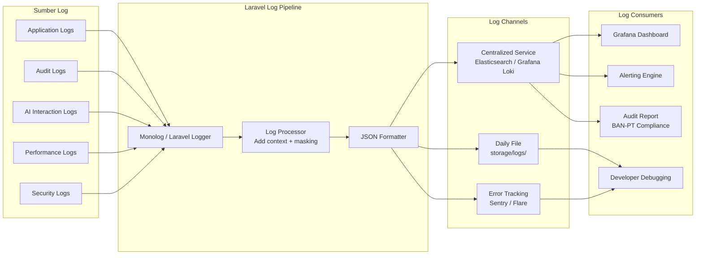
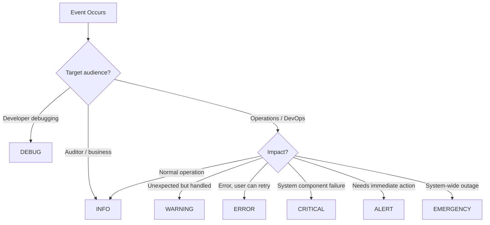
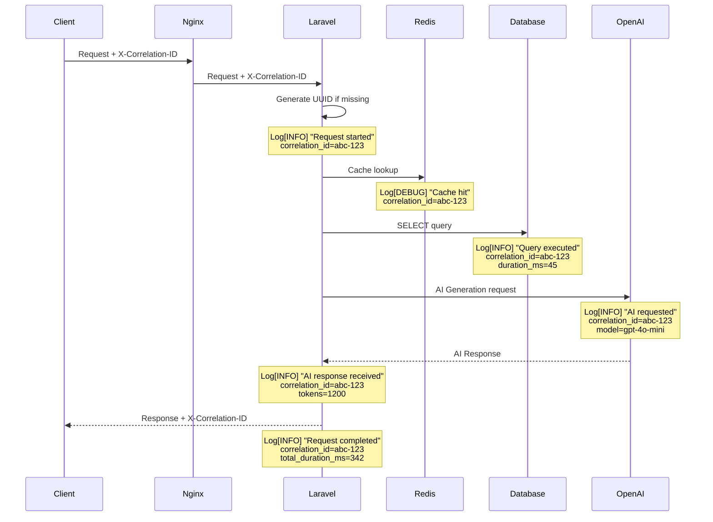

# 35 — Logging Strategy

## Ikhtisar

Strategi logging RPS OBE menyediakan visibilitas komprehensif terhadap seluruh aktivitas sistem — mulai dari request HTTP, query database, interaksi AI, aksi pengguna, hingga kejadian keamanan. Dokumen ini mendefinisikan level log, apa yang dicatat, format terstruktur (JSON), kanal distribusi, kebijakan retensi, penanganan PII (Personally Identifiable Information), correlation ID untuk tracing terdistribusi, konfigurasi Laravel logging, serta perbedaan konfigurasi antar environment.

---

## Prinsip Logging

| Prinsip | Deskripsi |
|---------|-----------|
| **Structured by Default** | Semua log dalam format JSON untuk machine readability |
| **Context-Rich** | Setiap log entry mengandung konteks yang cukup untuk debugging (user, tenant, request, trace) |
| **Never Log Secrets** | Password, token, API key, dan PII tidak pernah ditulis ke log |
| **Observability-Driven** | Log adalah bagian dari tiga pilar observability: Logs, Metrics, Traces |
| **Environment-Aware** | Level log berbeda per environment untuk efisiensi dan keamanan |
| **Compliance-Ready** | Log memenuhi kebutuhan audit untuk akreditasi (BAN-PT) dan kepatuhan (UU PDP) |

---

## Arsitektur Logging



---

## Level Log

### Definisi Level (RFC 5424 Standard)

| Level | Kode RFC | Deskripsi | Contoh Penggunaan | Environment Minimum |
|-------|----------|-----------|-------------------|---------------------|
| **DEBUG** | 100 | Detail debugging, variabel state, flow control | Nilai variabel, query bindings, debug AI prompt | Development |
| **INFO** | 200 | Kejadian normal yang perlu dicatat | User login, RPS created, export started, scheduled job berjalan | Development, Staging |
| **NOTICE** | 250 | Kejadian normal tetapi significant | Batch operation dimulai, maintenance job selesai, large export requested | Development, Staging, Production |
| **WARNING** | 300 | Kondisi tidak normal tetapi tidak kritis | Rate limit triggered, query lambat (>200ms), AI retry, disk usage > 70% | All environments |
| **ERROR** | 400 | Error yang dapat dipulihkan — user dapat lanjut | Validasi gagal, AI generation gagal (bisa retry), payment gagal | All environments |
| **CRITICAL** | 500 | Kondisi kritis — komponen sistem gagal | Database connection gagal, queue tidak berfungsi, disk full | All environments |
| **ALERT** | 550 | Kondisi yang membutuhkan tindakan segera | Security breach terdeteksi, multiple failed login attempts (>10), backup gagal 2x berturut-turut | Production only |
| **EMERGENCY** | 600 | Sistem tidak dapat digunakan | Seluruh aplikasi down, database corrupt, infrastruktur gagal | Production only |

### Pedoman Pemilihan Level



---

## Kategori Log

### 1. Application Logs

Mencatat seluruh aktivitas aplikasi — request HTTP, response, lifecycle events.

```php
// app/Http/Middleware/RequestLogger.php
namespace App\Http\Middleware;

use Closure;
use Illuminate\Http\Request;
use Illuminate\Support\Facades\Log;

class RequestLogger
{
    public function handle(Request $request, Closure $next): mixed
    {
        $startTime = microtime(true);
        $startMemory = memory_get_usage();

        $response = $next($request);

        $duration = round((microtime(true) - $startTime) * 1000, 2);
        $memoryUsed = round((memory_get_usage() - $startMemory) / 1024 / 1024, 2);

        // Hanya log jika di atas threshold atau non-200
        if ($duration > 500 || !$response->isSuccessful()) {
            Log::channel('application')->info('HTTP Request', [
                'type' => 'http_request',
                'method' => $request->method(),
                'url' => $request->fullUrl(),
                'status_code' => $response->status(),
                'duration_ms' => $duration,
                'memory_mb' => $memoryUsed,
                'tenant_id' => app('current_tenant')?->id,
                'user_id' => $request->user()?->id,
                'ip' => $request->ip(),
                'user_agent' => $request->userAgent(),
                'correlation_id' => $request->header('X-Correlation-ID'),
            ]);
        }

        return $response;
    }
}
```

| Event | Level | Logged Data |
|-------|-------|-------------|
| HTTP Request (> 500ms) | INFO | method, url, status, duration, memory, user, tenant |
| HTTP Request (error 4xx/5xx) | ERROR | + request payload (sanitized), headers, stack trace |
| Artisan command started | INFO | command name, parameters |
| Artisan command finished | INFO | duration, peak memory, exit code |
| Queue job started | INFO | job class, queue name, attempt |
| Queue job failed | ERROR | job class, exception, stack trace |
| Scheduled task completed | INFO | task name, duration |
| Deployment event | INFO | version, committer, timestamp |

### 2. Audit Logs

Mencatat aksi pengguna dan perubahan data untuk kebutuhan audit dan compliance.

```php
// app/Models/Concerns/Auditable.php
trait Auditable
{
    protected static function bootAuditable(): void
    {
        static::created(function ($model) {
            $model->writeAuditLog('created', null, $model->getAttributes());
        });

        static::updated(function ($model) {
            $original = array_intersect_key($model->getOriginal(), $model->getChanges());
            $model->writeAuditLog('updated', $original, $model->getChanges());
        });

        static::deleted(function ($model) {
            $model->writeAuditLog('deleted', $model->getAttributes(), null);
        });
    }

    protected function writeAuditLog(string $action, ?array $old, ?array $new): void
    {
        /** @var \App\Models\User|null $user */
        $user = auth()->user();

        Log::channel('audit')->info('Data Audit', [
            'type' => 'data_change',
            'action' => $action,
            'model' => static::class,
            'model_id' => $model->getKey(),
            'old_values' => $this->sanitizeAuditData($old),
            'new_values' => $this->sanitizeAuditData($new),
            'user_id' => $user?->id,
            'user_email' => $user?->email,
            'user_role' => $user?->role,
            'tenant_id' => app('current_tenant')?->id,
            'ip' => request()->ip(),
            'correlation_id' => request()->header('X-Correlation-ID'),
            'timestamp' => now()->toIso8601String(),
        ]);
    }

    private function sanitizeAuditData(?array $data): ?array
    {
        if ($data === null) return null;

        // Jangan pernah log password atau token
        unset($data['password'], $data['remember_token'], $data['api_token']);

        return $data;
    }
}
```

| Event | Level | Data yang Dicatat |
|-------|-------|-------------------|
| Pengguna login | INFO | user_id, email, IP, device, browser |
| Pengguna logout | INFO | user_id, session duration |
| Login gagal | WARNING | email/username (bukan password), IP, attempt count |
| CRUD RPS (create/update/delete) | INFO | rps_id, action, perubahan data, user_id |
| CRUD CPMK/Sub-CPMK | INFO | cpmk_id, action, perubahan data |
| AI generation requested | INFO | rps_id, cpmk_count, AI model |
| AI generation approved/rejected | INFO | generation_id, user_id, decision |
| Export RPS | INFO | rps_id, format (docx/pdf/xlsx), user_id |
| Template change | INFO | template_id, type |
| Role/permission change | INFO | user_id, role changed, performed_by |
| Setting change | INFO | key, old value, new value, performed_by |

### 3. AI Interaction Logs

Mencatat seluruh interaksi dengan AI API (OpenAI/compatible) untuk monitoring biaya, debugging kualitas output, dan compliance.

```php
// app/Support/AiLogger.php
namespace App\Support;

use Illuminate\Support\Facades\Log;

class AiLogger
{
    public function logGeneration(array $context): void
    {
        Log::channel('ai')->info('AI Generation', [
            'type' => 'ai_generation',
            'action' => $context['action'], // 'generate_cpmk', 'validate_rps', 'improve_rps'
            'model' => $context['model'],
            'provider' => $context['provider'], // 'openai', 'azure', 'gemini'
            'tenant_id' => $context['tenant_id'],
            'user_id' => $context['user_id'],
            'rps_id' => $context['rps_id'] ?? null,
            'prompt_tokens' => $context['prompt_tokens'],
            'completion_tokens' => $context['completion_tokens'],
            'total_tokens' => $context['total_tokens'],
            'cost_usd' => round($context['cost_usd'], 6),
            'duration_ms' => $context['duration_ms'],
            'prompt_hash' => md5($context['prompt']),    // Prompt disimpan terpisah, hanya hash di log
            'response_hash' => md5($context['response']), // Response disimpan terpisah
            'correlation_id' => $context['correlation_id'],
            'retry_count' => $context['retry_count'] ?? 0,
            'temperature' => $context['temperature'] ?? 0.7,
            'max_tokens' => $context['max_tokens'] ?? 4096,
        ]);
    }

    public function logError(array $context): void
    {
        Log::channel('ai')->error('AI Error', [
            'type' => 'ai_error',
            'action' => $context['action'],
            'model' => $context['model'],
            'error_type' => $context['error_type'], // 'rate_limit', 'timeout', 'content_filter', 'api_error'
            'error_message' => $context['error_message'],
            'retry_count' => $context['retry_count'],
            'duration_ms' => $context['duration_ms'],
            'tenant_id' => $context['tenant_id'],
            'user_id' => $context['user_id'],
            'correlation_id' => $context['correlation_id'],
        ]);
    }
}
```

| Event | Level | Data Dicatat |
|-------|-------|-------------|
| AI request sent | INFO | model, action, token counts, cost, duration |
| AI response received | INFO | response length, finish reason |
| AI rate limit hit | WARNING | retry_count, retry_after |
| AI timeout | ERROR | timeout duration, model |
| AI content filter triggered | WARNING | filter category, action taken |
| AI unexpected response format | ERROR | raw response (truncated), parse error |
| Daily AI cost summary | INFO | total tokens, total cost, top user, top tenant |

### 4. Performance Logs

Mencatat metrik performa untuk identifikasi bottleneck dan trend analysis.

```php
// app/Support/PerformanceLogger.php
namespace App\Support;

use Illuminate\Support\Facades\Log;

class PerformanceLogger
{
    public function logSlowQuery(string $sql, float $durationMs, string $connection): void
    {
        if ($durationMs > 100) {
            $level = $durationMs > 500 ? 'error' : 'warning';

            Log::channel('performance')->{$level}('Slow Query', [
                'type' => 'slow_query',
                'sql' => $this->sanitizeSql($sql),
                'duration_ms' => round($durationMs, 2),
                'connection' => $connection,
                'tenant_id' => app('current_tenant')?->id,
                'url' => request()->fullUrl(),
                'correlation_id' => request()->header('X-Correlation-ID'),
            ]);
        }
    }

    public function logSlowApi(string $endpoint, float $durationMs, int $statusCode): void
    {
        Log::channel('performance')->warning('Slow API', [
            'type' => 'slow_api',
            'endpoint' => $endpoint,
            'duration_ms' => round($durationMs, 2),
            'status_code' => $statusCode,
            'tenant_id' => app('current_tenant')?->id,
            'correlation_id' => request()->header('X-Correlation-ID'),
        ]);
    }

    public function logQueuePerformance(string $queue, float $processingTimeMs, int $queueDepth): void
    {
        Log::channel('performance')->info('Queue Performance', [
            'type' => 'queue_performance',
            'queue' => $queue,
            'processing_time_ms' => round($processingTimeMs, 2),
            'queue_depth' => $queueDepth,
            'timestamp' => now()->toIso8601String(),
        ]);
    }
}
```

| Event | Level | Threshold | Data Dicatat |
|-------|-------|-----------|-------------|
| Slow query | WARNING | > 100 ms | sql, duration, connection, tenant_id |
| Very slow query | ERROR | > 500 ms | sql, duration, connection, tenant_id, full request context |
| Slow API endpoint | WARNING | > 500 ms (p95) | endpoint, duration, status_code |
| Queue job slow | WARNING | > 60 detik | job class, duration, attempts |
| Memory usage high | WARNING | > 128 MB per request | memory_mb, url, user_id |

### 5. Security Logs

Mencatat kejadian terkait keamanan untuk deteksi ancaman dan forensik.

| Event | Level | Data Dicatat |
|-------|-------|-------------|
| Login successful | INFO | user_id, email, IP, timestamp |
| Login failed | WARNING | email, IP, attempt count |
| Brute force detected | ALERT | email, IP, attempt count, time window |
| Password changed | INFO | user_id, initiated_by, method |
| Permission denied (403) | WARNING | user_id, attempted_resource, required_permission |
| API key usage (unauthorized) | WARNING | IP, user_agent, attempted_endpoint |
| CSRF token mismatch | WARNING | IP, user_agent, url |
| Rate limit exceeded | WARNING | user_id / IP, limit_type, url |
| Suspicious activity detected | ALERT | pattern, user_id, IP, details |
| Session hijacking attempt | ALERT | user_id, old_ip, new_ip, user_agent change |
| Data export massal | NOTICE | user_id, record_count, export_type |
| Admin action | INFO | user_id, action, affected_user_id, details |

---

## Format Log

### JSON Structured Logging

Semua log channel menggunakan format JSON untuk memudahkan parsing dan query di centralized logging system.

```php
// config/logging.php — JSON Formatter Configuration
'formatter' => [
    'json' => [
        'class' => \Monolog\Formatter\JsonFormatter::class,
        'include_stacktraces' => true,
        'batch_mode' => \Monolog\Formatter\JsonFormatter::BATCH_MODE_NEWLINES,
        'append_newline' => true,
    ],
],
```

### Schema Log Entry

```json
{
    "message": "HTTP Request",
    "context": {
        "type": "http_request",
        "method": "POST",
        "url": "https://obe.university.ac.id/api/rps/generate",
        "status_code": 200,
        "duration_ms": 342.15,
        "memory_mb": 12.4,
        "tenant_id": "550e8400-e29b-41d4-a716-446655440000",
        "user_id": 1234,
        "ip": "192.168.1.100",
        "correlation_id": "corr_a1b2c3d4e5f6",
        "timestamp": "2026-08-02T14:30:00.000+07:00"
    },
    "level": 200,
    "level_name": "INFO",
    "channel": "application",
    "datetime": "2026-08-02T14:30:00.000000+07:00",
    "extra": {
        "hostname": "web-02",
        "php_version": "8.3.0",
        "laravel_version": "11.0",
        "environment": "production"
    }
}
```

### Field Konvensi

| Field | Wajib | Deskripsi |
|-------|-------|-----------|
| `message` | Ya | Ringkasan event dalam bahasa Inggris |
| `context.type` | Ya | Kategori log: `http_request`, `data_change`, `ai_generation`, `security_event`, `performance` |
| `context.tenant_id` | Ya | UUID tenant terkait (untuk multi-tenant tracing) |
| `context.user_id` | Jika ada | ID pengguna yang terautentikasi |
| `context.correlation_id` | Ya | ID unik untuk tracing request across services |
| `context.timestamp` | Ya | ISO 8601 timestamp |
| `context.duration_ms` | Jika relevan | Durasi operasi dalam milidetik |
| `context.ip` | Ya | IP address pengguna (atau `0.0.0.0` jika CLI) |
| `channel` | Ya | Nama kanal Laravel: `application`, `audit`, `ai`, `performance`, `security` |
| `extra.hostname` | Ya | Hostname server yang menghasilkan log |

---

## Log Channels dan Penyimpanan

### Konfigurasi Laravel Logging

```php
// config/logging.php
return [
    'default' => env('LOG_CHANNEL', 'stack'),

    'channels' => [
        // Primary stack — combines daily rotating + centralized
        'stack' => [
            'driver' => 'stack',
            'channels' => ['daily', 'flare'],
            'ignore_exceptions' => false,
        ],

        // Daily rotating file — retensi 30 hari lokal
        'daily' => [
            'driver' => 'daily',
            'path' => storage_path('logs/laravel.log'),
            'level' => env('LOG_LEVEL', 'warning'),
            'days' => 30,
            'permission' => 0640,
            'locking' => false,
            'formatter' => 'json',
        ],

        // Audit log — file terpisah, retensi 1 tahun
        'audit' => [
            'driver' => 'daily',
            'path' => storage_path('logs/audit.log'),
            'level' => 'info',
            'days' => 365,
            'permission' => 0600, // audit log sangat sensitif
            'formatter' => 'json',
        ],

        // AI interaction log — file terpisah, retensi 90 hari
        'ai' => [
            'driver' => 'daily',
            'path' => storage_path('logs/ai.log'),
            'level' => 'info',
            'days' => 90,
            'permission' => 0640,
            'formatter' => 'json',
        ],

        // Performance metrics — file terpisah, retensi 30 hari
        'performance' => [
            'driver' => 'daily',
            'path' => storage_path('logs/performance.log'),
            'level' => 'info',
            'days' => 30,
            'permission' => 0640,
            'formatter' => 'json',
        ],

        // Security events — file terpisah, retensi 1 tahun
        'security' => [
            'driver' => 'daily',
            'path' => storage_path('logs/security.log'),
            'level' => 'warning',
            'days' => 365,
            'permission' => 0600,
            'formatter' => 'json',
        ],

        // Error tracking (Sentry / Flare)
        'flare' => [
            'driver' => 'flare',
            'api_token' => env('FLARE_API_TOKEN'),
            'api_base_url' => env('FLARE_API_URL', 'https://flareapp.io/api'),
        ],

        // Centralized logging — Elasticsearch / Grafana Loki
        'centralized' => [
            'driver' => 'monolog',
            'handler' => \Monolog\Handler\ElasticsearchHandler::class,
            'formatter' => 'json',
            'handler_with' => [
                'client' => \Elasticsearch\ClientBuilder::create()
                    ->setHosts([env('ELASTICSEARCH_HOST')])
                    ->build(),
                'options' => [
                    'index' => 'rps-obe-logs-' . date('Y.m.d'),
                    'type' => '_doc',
                ],
            ],
        ],
    ],
];
```

### Destinasi Log per Environment

| Environment | File Lokal | Sentry/Flare | Elasticsearch/Loki | Retensi File Lokal |
|-------------|-----------|-------------|--------------------|--------------------|
| **Development** | Ya (DEBUG+) | Tidak | Tidak | 7 hari |
| **Staging** | Ya (INFO+) | Ya (ERROR+) | Ya (semua) | 14 hari |
| **Production** | Ya (WARNING+) | Ya (ERROR+) | Ya (semua) | 30 hari (365 hari untuk audit/security) |

---

## Retensi dan Arsip Log

### Kebijakan Retensi

| Kategori Log | Retensi Lokal | Retensi Cloud Archive | Auto-Cleanup |
|--------------|--------------|----------------------|-------------|
| Application | 30 hari | 90 hari | Harian via scheduler |
| Audit | 365 hari | 5 tahun (S3 Glacier Deep Archive) | Setelah 365 hari diarsip ke S3 |
| AI Interaction | 90 hari | 1 tahun | Harian via scheduler |
| Performance | 30 hari | 90 hari | Harian via scheduler |
| Security | 365 hari | 5 tahun (S3 Glacier Deep Archive) | Setelah 365 hari diarsip ke S3 |

### Scheduled Log Cleanup

```php
// app/Console/Kernel.php (dalam method schedule)
// Archive old audit logs (> 30 hari) ke S3 setiap minggu
$schedule->command('logs:archive --channel=audit --older-than=30')
    ->weekly()
    ->sundays()
    ->at('01:00')
    ->timezone('Asia/Jakarta');

// Archive old security logs (> 30 hari) ke S3 setiap minggu
$schedule->command('logs:archive --channel=security --older-than=30')
    ->weekly()
    ->sundays()
    ->at('01:30')
    ->timezone('Asia/Jakarta');

// Hapus application logs > 30 hari
$schedule->command('logs:clean --channel=application --older-than=30')
    ->dailyAt('02:00')
    ->timezone('Asia/Jakarta');
```

---

## PII Handling dalam Log

### Prinsip

1. **Never log**: password, password_confirmation, token, api_key, secret, credit_card, ktp, npwp.
2. **Mask before log**: email (partial), phone (partial), name (partial dalam konteks tertentu).
3. **Truncate**: response payload besar (> 10 KB) dipotong menjadi 1 KB pertama.

### Implementasi Masking

```php
// app/Support/LogSanitizer.php
namespace App\Support;

class LogSanitizer
{
    private const SENSITIVE_FIELDS = [
        'password', 'password_confirmation', 'current_password',
        'token', 'api_token', 'api_key', 'secret',
        'access_token', 'refresh_token', 'private_key',
        'credit_card', 'card_number', 'cvv', 'cvc',
        'ktp', 'npwp', 'passport', 'sim',
    ];

    private const MASK_FIELDS = [
        'email', 'phone', 'no_hp', 'no_telepon',
    ];

    /**
     * Sanitize an array before logging.
     */
    public static function sanitize(array $data): array
    {
        foreach ($data as $key => $value) {
            // Remove sensitive fields completely
            if (in_array(strtolower($key), self::SENSITIVE_FIELDS)) {
                $data[$key] = '[REDACTED]';
                continue;
            }

            // Mask PII fields
            if (in_array(strtolower($key), self::MASK_FIELDS) && is_string($value)) {
                $data[$key] = self::mask($value);
                continue;
            }

            // Recursively sanitize nested arrays
            if (is_array($value)) {
                $data[$key] = self::sanitize($value);
            }
        }

        return $data;
    }

    /**
     * Mask a string value showing only first and last characters.
     */
    public static function mask(string $value): string
    {
        if (strlen($value) <= 4) {
            return '****';
        }

        $first = substr($value, 0, 2);
        $last = substr($value, -2);

        return $first . str_repeat('*', strlen($value) - 4) . $last;
    }

    /**
     * Mask an email address.
     */
    public static function maskEmail(string $email): string
    {
        [$name, $domain] = explode('@', $email);

        if (strlen($name) <= 2) {
            return '*@' . $domain;
        }

        $visible = min(2, floor(strlen($name) / 2));
        $first = substr($name, 0, $visible);
        $last = strlen($name) > 4 ? substr($name, -1) : '';

        return $first . str_repeat('*', strlen($name) - $visible - strlen($last)) . $last . '@' . $domain;
    }
}
```

### Contoh Output

| Input | Output di Log |
|-------|--------------|
| `password: "secret123"` | `password: "[REDACTED]"` |
| `email: "budi.santoso@university.ac.id"` | `email: "bu**********o@university.ac.id"` |
| `phone: "081234567890"` | `phone: "08********90"` |
| `api_token: "sk-abc123..."` | `api_token: "[REDACTED]"` |

---

## Correlation ID untuk Request Tracing

### Implementasi Middleware

```php
// app/Http/Middleware/CorrelationId.php
namespace App\Http\Middleware;

use Closure;
use Illuminate\Http\Request;
use Illuminate\Support\Str;

class CorrelationId
{
    public function handle(Request $request, Closure $next): mixed
    {
        // Gunakan correlation ID dari request header atau generate baru
        $correlationId = $request->header('X-Correlation-ID', (string) Str::uuid());

        // Bind ke aplikasi context
        app()->instance('correlation_id', $correlationId);

        // Tambahkan ke semua log context
        \Illuminate\Support\Facades\Log::withContext([
            'correlation_id' => $correlationId,
        ]);

        $response = $next($request);

        // Sertakan correlation ID di response header
        $response->headers->set('X-Correlation-ID', $correlationId);

        return $response;
    }
}
```

### Alur Tracing



---

## Konfigurasi Log per Environment

### Development (.env.development)

```ini
LOG_CHANNEL=stack
LOG_LEVEL=debug
LOG_STACK_CHANNELS=daily

# Monitoring tools
TELESCOPE_ENABLED=true
FLARE_ENABLED=false
```

### Staging (.env.staging)

```ini
LOG_CHANNEL=stack
LOG_LEVEL=info
LOG_STACK_CHANNELS=daily,flare,centralized

# Monitoring tools
TELESCOPE_ENABLED=true
FLARE_ENABLED=true
FLARE_API_TOKEN=staging-flare-token
ELASTICSEARCH_HOST=http://elasticsearch.internal:9200
```

### Production (.env.production)

```ini
LOG_CHANNEL=stack
LOG_LEVEL=warning
LOG_STACK_CHANNELS=daily,flare,centralized

# Monitoring tools
TELESCOPE_ENABLED=false
FLARE_ENABLED=true
FLARE_API_TOKEN=${FLARE_API_TOKEN}
ELASTICSEARCH_HOST=${ELASTICSEARCH_HOST}
```

---

## Log Rotation dan Manajemen Disk

### Log Rotation via logrotate

```conf
# /etc/logrotate.d/rps-obe
/var/www/html/storage/logs/*.log {
    daily
    rotate 30
    missingok
    notifempty
    compress
    delaycompress
    dateext
    dateformat -%Y%m%d
    create 0640 www-data www-data
    postrotate
        # Signal Laravel to reopen log files
        /usr/bin/supervisorctl signal HUP rps-obe-queue:*
    endscript
}
```

### Monitoring Disk Log

| Metrik | Target | Alert Threshold |
|--------|--------|-----------------|
| Total log size | < 10 GB | > 15 GB |
| Log growth rate | < 500 MB/hari | > 1 GB/hari (indikasi error spike) |
| Log partition disk usage | < 70% | > 80% |
| Individual log file size | < 500 MB | > 1 GB |

---

## Logging untuk Compliance BAN-PT

### Data yang Wajib Tersedia untuk Audit

| Requirement BAN-PT | Data Log yang Dibutuhkan | Kanal |
|-------------------|------------------------|-------|
| Bukti penyusunan RPS | Semua create/update RPS dengan timestamp + user | `audit` |
| Bukti review dan approval | Semua approval events dengan timestamp + reviewer | `audit` |
| Bukti integrasi CPMK | Perubahan CPMK dan Sub-CPMK yang terlink ke RPS | `audit` |
| Bukti penggunaan AI | Semua AI generation events + prompt hash + response hash | `ai` |
| Bukti validasi akademik | Validasi RPS events + timestamp + validator | `audit` |
| Traceability | Correlation ID untuk setiap transaksi end-to-end | Semua kanal |

---

## Implementasi Custom Log Channels

### AI Interaction Log Channel

```php
// config/logging.php — AI channel specific
'ai' => [
    'driver' => 'custom',
    'via' => \App\Logging\AiLogChannel::class,
    'days' => 90,
    'level' => 'info',
],

// app/Logging/AiLogChannel.php
namespace App\Logging;

use Monolog\Handler\RotatingFileHandler;
use Monolog\Logger;

class AiLogChannel
{
    public function __invoke(array $config): Logger
    {
        $logger = new Logger('ai');

        $handler = new RotatingFileHandler(
            storage_path('logs/ai.log'),
            $config['days'] ?? 90,
            $config['level'] ?? Logger::INFO
        );

        $handler->setFormatter(new \Monolog\Formatter\JsonFormatter());
        $logger->pushHandler($handler);

        return $logger;
    }
}
```

---

## Troubleshooting Guide

| Masalah | Kemungkinan Penyebab | Aksi |
|---------|---------------------|------|
| Log terlalu besar (> 10 GB) | Error spike atau DEBUG level di production | Turunkan level ke WARNING, periksa source error, arsip ke S3 |
| Correlation ID hilang | Middleware tidak terpasang | Periksa `Kernel.php` — pastikan middleware ada di `web` dan `api` group |
| PII bocor di log | `LogSanitizer` tidak digunakan | Audit semua `Log::info()` call — pastikan menggunakan sanitizer |
| Audit log tidak muncul | Model tidak menggunakan `Auditable` trait | Tambahkan trait ke model: `Rps`, `Cpmk`, `SubCpmk`, `MataKuliah` |
| Log terputus saat traffic tinggi | File lock contention | Gunakan `locking => false` di config daily channel untuk mengurangi contention |

---

**Navigasi:** [Sebelumnya: Backup Strategy](34-backup-strategy.md) | [Daftar Isi](../README.md) | [Berikutnya: Monitoring](36-monitoring.md)
