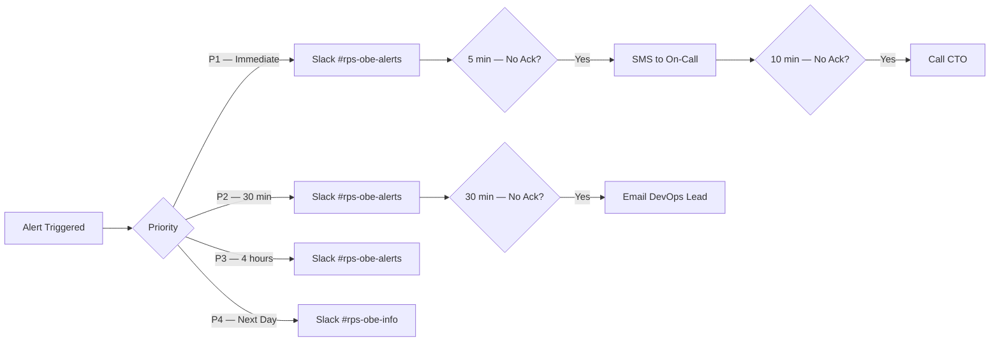
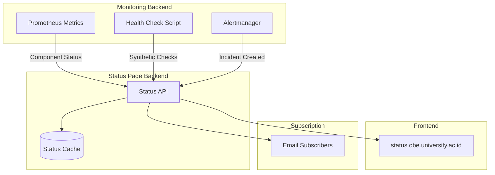

# 36 — Monitoring

## Ikhtisar

Monitoring sistem RPS OBE mencakup pemantauan infrastruktur, aplikasi, dan bisnis secara real-time untuk memastikan ketersediaan, performa, dan keandalan layanan. Dokumen ini mendefinisikan arsitektur monitoring, metrik yang dimonitor, health check endpoints, aturan alerting, kanal notifikasi, dashboard observabilitas (Grafana), serta halaman status publik untuk transparansi kepada tenant.

---

## Prinsip Monitoring

| Prinsip | Deskripsi |
|---------|-----------|
| **Observability Triad** | Logs, Metrics, Traces sebagai tiga pilar pemantauan |
| **Proactive over Reactive** | Alerting mendeteksi masalah sebelum pengguna melaporkan |
| **Noise Reduction** | Hanya kirim alert untuk kejadian actionable |
| **Context-Rich Alerts** | Setiap alert menyertakan dashboard link, runbook, dan on-call info |
| **Multi-Tenant Visibility** | Metrik dapat di-filter per tenant untuk isolasi dan troubleshooting |
| **External Validation** | Monitor dari luar jaringan (synthetic monitoring) untuk validasi user experience |

## Arsitektur Monitoring

```mermaid
graph TB
    subgraph "Data Collection"
        PROM[Prometheus<br/>Metrics Collection]
        LOKI[Grafana Loki<br/>Log Aggregation]
        TEMPO[Grafana Tempo<br/>Distributed Tracing]
    end

    subgraph "Exporters / Agents"
        NODE[Node Exporter<br/>CPU, Memory, Disk, Network]
        MYSQL[MySQL Exporter<br/>Connections, Queries, Replication]
        REDIS_EXP[Redis Exporter<br/>Memory, Hit Rate, Connections]
        PHP_EXP[PHP-FPM Exporter<br/>Pool Status, Active Processes]
        NGINX_EXP[Nginx Exporter<br/>Requests, Connections, Errors]
        CUSTOM[Custom Laravel Exporter<br/>Queue Depth, AI Stats, Users]
    end

    subgraph "Visualization"
        GRAFANA[Grafana Dashboards]
        L1[Infrastructure Overview]
        L2[Application Performance]
        L3[AI Analytics]
        L4[Business Metrics]
        L5[Security Dashboard]
    end

    subgraph "Alerting"
        ALERTMAN[Alertmanager]
        RULES[Alert Rules<br/>PromQL Expressions]
    end

    subgraph "Notification Channels"
        EMAIL[Email<br/>devops@university.ac.id]
        SLACK[Slack<br/>#rps-obe-alerts]
        TEAMS[Microsoft Teams]
        SMS[SMS<br/>On-Call Rotation]
        STATUS[Status Page<br/>Pusat Status]
    end

    NODE --> PROM
    MYSQL --> PROM
    REDIS_EXP --> PROM
    PHP_EXP --> PROM
    NGINX_EXP --> PROM
    CUSTOM --> PROM

    PROM --> GRAFANA
    LOKI --> GRAFANA
    TEMPO --> GRAFANA

    PROM --> ALERTMAN
    ALERTMAN --> EMAIL
    ALERTMAN --> SLACK
    ALERTMAN --> TEAMS
    ALERTMAN --> SMS
    ALERTMAN --> STATUS

    GRAFANA --> L1
    GRAFANA --> L2
    GRAFANA --> L3
    GRAFANA --> L4
    GRAFANA --> L5

    style PROM fill:#e6522c,color:#fff
    style GRAFANA fill:#f46800,color:#fff
    style ALERTMAN fill:#ff6b6b,color:#fff
```

---

## 1. Infrastructure Monitoring

### Server Health

#### Metrik yang Dimonitor

| Metrik | Sumber | Interval | Dashboard Widget |
|--------|--------|----------|-----------------|
| **CPU Usage** (%) | Node Exporter | 15 detik | Gauge + Time Series, per core |
| **CPU Load Average** (1m, 5m, 15m) | Node Exporter | 15 detik | Time Series overlay |
| **Memory Usage** (%) | Node Exporter | 15 detik | Gauge with thresholds |
| **Memory Available** (GB) | Node Exporter | 15 detik | Stat panel |
| **Disk Usage** (%) per mount | Node Exporter | 60 detik | Gauge per mount point |
| **Disk I/O** (read/write KB/s) | Node Exporter | 15 detik | Time Series dual axis |
| **Disk I/O Latency** (ms) | Node Exporter | 15 detik | Time Series |
| **Network Throughput** (MB/s in/out) | Node Exporter | 15 detik | Time Series stacked |
| **Network Errors** (count) | Node Exporter | 15 detik | Stat counter |
| **System Uptime** | Node Exporter | 60 detik | Stat panel |
| **Open File Descriptors** | Node Exporter | 15 detik | Gauge (max: ulimit) |

#### Threshold dan Alerting (Server)

| Metrik | Warning | Critical | Duration | Severity |
|--------|---------|----------|----------|----------|
| CPU Usage | > 70% | > 85% | 5 menit | Warning / Critical |
| CPU Load vs Cores | Load > Cores x 1.5 | Load > Cores x 2.5 | 5 menit | Warning / Critical |
| Memory Usage | > 80% | > 90% | 5 menit | Warning / Critical |
| Disk Usage | > 75% | > 85% | 1 menit | Warning / Critical |
| Disk Usage | > 90% | > 95% | 1 menit | **P1** |
| Network Errors | > 100/min | > 500/min | 5 menit | Warning / Critical |

### Database Health

#### Metrik yang Dimonitor

| Metrik | Sumber | Interval | Dashboard Widget |
|--------|--------|----------|-----------------|
| **Active Connections** | MySQL Exporter | 15 detik | Gauge vs max_connections |
| **Queries per Second** (QPS) | MySQL Exporter | 15 detik | Time Series |
| **Slow Queries** (count/min) | MySQL Exporter | 15 detik | Stat panel |
| **Slow Query Rate** (% of total) | MySQL Exporter | 15 detik | Gauge |
| **Replication Lag** (seconds) | MySQL Exporter | 15 detik | Time Series (all replicas) |
| **InnoDB Buffer Pool Hit Rate** | MySQL Exporter | 60 detik | Gauge |
| **Aborted Connections** | MySQL Exporter | 60 detik | Stat counter |
| **Database Size** (GB) | MySQL Exporter | 1 jam | Gauge per database |

#### Threshold dan Alerting (Database)

| Metrik | Warning | Critical | Duration | Severity |
|--------|---------|----------|----------|----------|
| Slow Query Rate | > 1% | > 2% | 10 menit | Warning / Critical |
| Replication Lag | > 5 detik | > 10 detik | 2 menit | Warning / Critical |
| Active Connections | > 70% max | > 85% max | 5 menit | Warning / Critical |
| InnoDB Buffer Pool Hit Rate | < 95% | < 90% | 10 menit | Warning / Critical |
| Database Down | — | Down | 1 menit | **P1** |

### Redis Health

#### Metrik yang Dimonitor

| Metrik | Sumber | Interval | Dashboard Widget |
|--------|--------|----------|-----------------|
| **Memory Usage** (bytes / %) | Redis Exporter | 15 detik | Gauge vs maxmemory |
| **Cache Hit Rate** (%) | Redis Exporter | 15 detik | Gauge |
| **Keyspace Hits/Misses** per second | Redis Exporter | 15 detik | Time Series ratio |
| **Connected Clients** | Redis Exporter | 15 detik | Gauge |
| **Blocked Clients** | Redis Exporter | 15 detik | Gauge |
| **Evicted Keys** | Redis Exporter | 60 detik | Counter |
| **Commands Processed** per second | Redis Exporter | 15 detik | Time Series |
| **Cluster State** (ok/fail) | Redis Exporter | 15 detik | Status panel per node |
| **Replication Offset Lag** | Redis Exporter | 15 detik | Time Series |

#### Threshold dan Alerting (Redis)

| Metrik | Warning | Critical | Duration | Severity |
|--------|---------|----------|----------|----------|
| Memory Usage | > 75% | > 85% | 5 menit | Warning / Critical |
| Cache Miss Rate | > 20% | > 40% | 10 menit | Warning / Critical |
| Evicted Keys | > 100/min | > 500/min | 5 menit | Warning / Critical |
| Cluster Node Down | — | Any node | 1 menit | **P1** |
| Redis Unreachable | — | Down | 1 menit | **P1** |

### Queue Health

#### Metrik yang Dimonitor

| Metrik | Sumber | Interval | Dashboard Widget |
|--------|--------|----------|-----------------|
| **Queue Depth** (per queue) | Custom Exporter | 15 detik | Time Series per queue name |
| **Failed Jobs** (count/min) | Custom Exporter | 15 detik | Stat counter |
| **Job Processing Time** (p50, p95, p99) | Custom Exporter | 15 detik | Time Series with percentiles |
| **Jobs Processed per Minute** | Custom Exporter | 60 detik | Bar chart per queue |
| **Queue Latency** (wait time in queue) | Custom Exporter | 15 detik | Time Series |

#### Threshold dan Alerting (Queue)

| Metrik | Warning | Critical | Duration | Severity |
|--------|---------|----------|----------|----------|
| Queue Depth (ai-generation) | > 100 | > 500 | 5 menit | Warning / Critical |
| Queue Depth (export) | > 50 | > 200 | 5 menit | Warning / Critical |
| Queue Depth (overall) | > 200 | > 1000 | 5 menit | Warning / Critical |
| Failed Job Rate | > 2% | > 5% | 5 menit | Warning / Critical |
| Zero Active Workers | Any queue | — | 2 menit | **Critical** |

---

## 2. Application Monitoring

### Error Rates

| Metrik | Keterangan | Visualisasi |
|--------|-----------|-------------|
| **Error Rate by Endpoint** | % dari total request yang mengembalikan status 4xx atau 5xx, dikelompokkan per endpoint | Heatmap endpoint x waktu |
| **Error Rate by Tenant** | Error rate per tenant untuk deteksi tenant spesifik bermasalah | Bar chart per tenant |
| **4xx vs 5xx Ratio** | Memisahkan client error vs server error | Stacked bar chart |
| **Exception Types** | Jenis exception yang paling sering terjadi | Pie chart / top-N list |
| **Error Rate Trend (24h)** | Perbandingan error rate 24 jam terakhir vs 7 hari sebelumnya | Time Series with baseline |

### Response Times

| Metrik | Keterangan | Target | Visualisasi |
|--------|-----------|--------|-------------|
| **Response Time p50** | Median response time | < 200ms | Time Series |
| **Response Time p95** | 95th percentile | < 500ms | Time Series with threshold line |
| **Response Time p99** | 99th percentile | < 1000ms | Time Series |
| **Response Time by Endpoint** | Perbandingan response time antar endpoint | — | Heatmap |
| **Response Time by Tenant** | Response time per tenant | p95 < 500ms | Bar chart |

### AI API Call Stats

| Metrik | Sumber | Visualisasi |
|--------|--------|-------------|
| **AI Requests Total** (per model) | Custom Exporter | Time Series stacked per model |
| **AI Success Rate** (%) | Custom Exporter | Gauge |
| **AI Average Latency** (ms) | Custom Exporter | Time Series per action type |
| **AI Token Usage** (total tokens) | Custom Exporter | Area chart cumulative |
| **AI Cost** (USD) | Custom Exporter | Bar chart daily + cumulative line |
| **AI Error Rate** (%) | Custom Exporter | Stat panel + trend |

### Active Users

| Metrik | Sumber | Interval | Visualisasi |
|--------|--------|----------|-------------|
| **Concurrent Users** | Custom Exporter | 1 menit | Gauge |
| **Daily Active Users (DAU)** | Custom Exporter | 1 jam | Counter cumulated daily |
| **Weekly Active Users (WAU)** | Custom Exporter | 1 jam | Counter cumulated weekly |
| **Monthly Active Users (MAU)** | Custom Exporter | 6 jam | Counter cumulated monthly |
| **Active Users by Tenant** | Custom Exporter | 5 menit | Bar chart top 10 |
| **Login Count** (per hour) | Application Logs | 1 jam | Bar chart |

### Export Job Stats

| Metrik | Sumber | Visualisasi |
|--------|--------|-------------|
| **Export Requests** (today) | Custom Exporter | Stat panel |
| **Export Completed** | Custom Exporter | Stat panel |
| **Export Failed** | Custom Exporter | Stat panel |
| **Export Average Time** (ms) | Custom Exporter | Stat panel |
| **Export Queue Depth** | Custom Exporter | Time Series |

---

## 3. Health Check Endpoints

### Basic Health Check (`GET /api/health`)

```php
// routes/api.php
Route::get('/health', [\App\Http\Controllers\Api\HealthCheckController::class, 'basic']);
```

**Response 200:**
```json
{
    "status": "ok",
    "timestamp": "2026-08-02T14:30:00+07:00",
    "version": "2.1.0",
    "environment": "production"
}
```

### Detailed Health Check (`GET /api/health/detailed`)

**Response 200 (semua OK):**
```json
{
    "status": "ok",
    "timestamp": "2026-08-02T14:30:00+07:00",
    "uptime": "127h 34m 12s",
    "checks": {
        "database": {
            "status": "ok",
            "response_time_ms": 2.3,
            "connection_pool_used_pct": 45
        },
        "redis": {
            "status": "ok",
            "memory_used_pct": 38,
            "hit_rate": 0.92
        },
        "storage": {
            "status": "ok",
            "disk": "s3",
            "response_time_ms": 87.4
        },
        "queue": {
            "status": "ok",
            "queues": {
                "ai-generation": 12,
                "export": 3,
                "default": 8
            }
        },
        "ai_api": {
            "status": "ok",
            "provider": "openai",
            "response_time_ms": 156.8,
            "rate_limit_remaining": 4500
        }
    },
    "dependencies": {
        "php": "8.3.0",
        "laravel": "11.0",
        "mariadb": "11.4.2",
        "redis": "7.2.5"
    }
}
```

**Response 503 (degraded):**
```json
{
    "status": "degraded",
    "timestamp": "2026-08-02T14:30:00+07:00",
    "checks": {
        "database": { "status": "ok", "response_time_ms": 2.3 },
        "redis": { "status": "error", "message": "Connection refused" },
        "storage": { "status": "ok" },
        "queue": { "status": "warning", "queue_depth": { "ai-generation": 675 } }
    }
}
```

---

## 4. Alerting Rules

### Aturan Alerting

| ID | Nama Alert | Trigger | Duration | Severity | Channel |
|----|-----------|---------|----------|----------|---------|
| A01 | Database Down | `mysql_up == 0` | 1 menit | **P1 — Immediate** | Slack + SMS |
| A02 | Redis Cluster Down | `count(redis_up == 0) >= 1` | 1 menit | **P1 — Immediate** | Slack + SMS |
| A03 | Disk Space Critical | Disk usage > 95% | 1 menit | **P1 — Immediate** | Slack + SMS |
| A04 | All Web Servers Down | Semua web server unreachable | 1 menit | **P1 — Immediate** | Slack + SMS |
| A05 | High Error Rate | Error rate > 10% | 2 menit | **P1 — Immediate** | Slack + SMS |
| A06 | API Latency p95 Spike | p95 response time > 1.000ms | 5 menit | **P2 — < 30 min** | Slack + Email |
| A07 | Queue Depth AI > 500 | `laravel_queue_depth{queue="ai-generation"} > 500` | 5 menit | **P2 — < 30 min** | Slack + Email |
| A08 | AI Error Rate > 5% | AI error rate > 5% | 5 menit | **P2 — < 30 min** | Slack + Email |
| A09 | Response Time Degradation | p95 latency > 2x baseline | 10 menit | **P2 — < 30 min** | Slack + Email |
| A10 | Disk Usage > 85% | Disk usage > 85% | 5 menit | **P3 — < 4 jam** | Slack + Email |
| A11 | Memory Usage > 80% | Memory > 80% sustained | 10 menit | **P3 — < 4 jam** | Slack + Email |
| A12 | Slow Query Rate > 1% | Slow queries > 1% dari total | 10 menit | **P3 — < 4 jam** | Slack + Email |
| A13 | Queue Depth AI > 100 | AI queue backlog | 5 menit | **P3 — < 4 jam** | Slack |
| A14 | Replication Lag > 5s | DB replication delay | 2 menit | **P3 — < 4 jam** | Slack + Email |
| A15 | Backup Age > 25h | Backup terakhir > 25 jam | 10 menit | **P3 — < 4 jam** | Slack + Email |
| A16 | CPU > 70% Sustained | CPU sustained > 70% | 30 menit | **P4 — Next Day** | Slack |
| A17 | Cache Hit Rate < 80% | Redis cache miss rate tinggi | 30 menit | **P4 — Next Day** | Slack |
| A18 | Certificate Expiry < 30d | TLS cert mendekati expired | — | **P4 — Next Day** | Email |
| A19 | Log Disk > 75% | Storage log menipis | 15 menit | **P4 — Next Day** | Slack |
| A20 | AI Cost Spike | AI cost > $10/jam | 15 menit | **P4 — Next Day** | Slack |

### Prioritas dan Eskalasi



---

## 5. Alert Channels

### Daftar Kanal

| Kanal | Penggunaan | Severity | Konfigurasi |
|-------|-----------|----------|-------------|
| **Email** | Notifikasi insiden non-urgent, laporan mingguan | P2, P3, P4 | `devops@university.ac.id` |
| **Slack** | Alert real-time semua severity ke channel #rps-obe-alerts | P1–P4 | Webhook `https://hooks.slack.com/services/...` |
| **Microsoft Teams** | Mirror Slack untuk institusi yang menggunakan Teams | P1–P4 | Incoming Webhook Connector |
| **SMS** | Eskalasi P1 untuk on-call personnel | P1 only | Twilio / PagerDuty |
| **Status Page Webhook** | Update otomatis status page saat alert triggered | P1, P2 | Webhook ke `status.obe.university.ac.id` |

### Format Notifikasi Slack

```
🚨 *Alert Firing: High API Latency*
*Severity:* Warning | *Priority:* P2
*Summary:* API p95 latency > 1s — 1.23s
*Endpoint:* /api/rps/generate
*Duration:* 7 minutes

📊 *Dashboard:* https://grafana.university.ac.id/d/app-perf
📖 *Runbook:* https://wiki.university.ac.id/runbooks/high-api-latency

*Labels:* endpoint=/api/rps/generate, severity=warning
```

---

## 6. Dashboard (Grafana)

### Dashboard Kategori

| Dashboard | Audiens | Refresh | Deskripsi |
|-----------|---------|---------|-----------|
| **Infrastructure Overview** | DevOps, Infra Team | 15 detik | CPU, Memory, Disk, Network semua server dalam satu view |
| **Application Performance** | Developer, DevOps | 30 detik | Response times, error rates, throughput per endpoint |
| **Database Performance** | DBA, DevOps | 30 detik | Query stats, connections, replication, locks |
| **Redis Health** | DevOps | 30 detik | Memory, hit rate, cluster status |
| **Queue Analytics** | Developer, DevOps | 15 detik | Queue depth per queue, failed jobs, processing times |
| **AI Analytics** | Product Owner, Developer | 60 detik | AI calls, tokens, cost, success rate, latency per model |
| **Business Metrics** | Management, Product Owner | 5 menit | Active users, RPS created, exports, AI usage by tenant |
| **Security Overview** | CISO, DevOps | 60 detik | Failed logins, rate limits, suspicious activity |
| **SLO/SLI Dashboard** | DevOps, Management | 60 detik | Uptime SLA, error budget, SLO compliance |

### Contoh Layout — Infrastructure Overview

```
+---------------------------------------------------------------+
|  INFRASTRUCTURE OVERVIEW  |  [Last 6h] [Last 24h] [Last 7d]  |
+---------------------------------------------------------------+
|  CPU Usage                              |  Memory Usage       |
|  [Time Series — all servers, by core]   |  [Gauge + Time      |
|                                         |   Series by server] |
+---------------------------------------------------------------+
|  Disk Usage                             |  Network Throughput |
|  [Gauge per mount point — all servers]  |  [Dual Axis — in/   |
|                                         |   out per server]   |
+---------------------------------------------------------------+
|  System Load                            |  Uptime             |
|  [Load vs CPU cores — all servers]      |  [Stat panels per   |
|                                         |   server]           |
+---------------------------------------------------------------+
|  SERVICE HEALTH STATUS                                          |
|  [DB: OK | Redis: OK | Queue: OK | AI: OK | Storage: OK]      |
+---------------------------------------------------------------+
|  RECENT ALERTS                                                  |
|  [Table: Time | Alert Name | Severity | Status | Duration]     |
+---------------------------------------------------------------+
```

---

## 7. Status Page

### Arsitektur Status Page



### Status Messages

| Status | Warna | Arti |
|--------|-------|------|
| `operational` | Hijau | Berfungsi normal |
| `degraded` | Kuning | Performa menurun tetapi masih berfungsi |
| `partial_outage` | Oranye | Sebagian pengguna terdampak |
| `major_outage` | Merah | Semua pengguna terdampak |
| `under_maintenance` | Biru | Dalam pemeliharaan terjadwal |
| `unknown` | Abu-abu | Status tidak diketahui |

### Komponen yang Ditampilkan

| Komponen | Deskripsi | Health Check Method |
|----------|-----------|--------------------|
| **Web Application** | Aplikasi web utama RPS OBE | HTTP GET `/api/health` |
| **REST API** | API endpoint | HTTP GET `/api/health` |
| **Database** | MariaDB database server | TCP + `SELECT 1` query |
| **Redis Cache & Queue** | Session, cache, dan queue | Redis PING |
| **AI Generation Service** | Layanan AI content generation | Synthetic AI request |
| **Export Service** | Layanan ekspor RPS | Queue health check |
| **Object Storage** | Penyimpanan file (S3) | S3 bucket check |

---

## 8. Synthetic Monitoring

| Script | Frekuensi | Apa yang Dicek | Alert jika |
|--------|-----------|---------------|------------|
| `monitor:login-flow` | 5 menit | Login flow end-to-end | Gagal login atau durasi > 3 detik |
| `monitor:api-health` | 1 menit | Endpoint health check | Non-200 response |
| `monitor:rps-view` | 10 menit | Akses halaman RPS | Gagal load atau error |
| `monitor:ai-generation` | 30 menit | AI generation synthetic request | Gagal atau timeout > 60 detik |
| `monitor:export` | 1 jam | Export RPS synthetic request | Gagal atau timeout > 120 detik |

---

## 9. Observability Toolchain

| Tool | Purpose | License |
|------|---------|---------|
| **Prometheus** | Metrics collection and storage | Open Source (Apache 2.0) |
| **Grafana** | Dashboards and visualization | Open Source (AGPLv3) |
| **Alertmanager** | Alert routing and deduplication | Open Source (Apache 2.0) |
| **Grafana Loki** | Log aggregation and querying | Open Source (AGPLv3) |
| **Node Exporter** | OS-level metrics | Open Source (Apache 2.0) |
| **MySQL Exporter** | MariaDB/MySQL metrics | Open Source (Apache 2.0) |
| **Redis Exporter** | Redis metrics | Open Source (MIT) |
| **Sentry / Flare** | Error tracking | SaaS |
| **Laravel Telescope** | Dev/debug monitoring | Included with Laravel |
| **Uptime Kuma** | Status page engine | Open Source (MIT) |
| **Cloudflare Analytics** | CDN and DNS analytics | SaaS |

---

## 10. Implementasi Monitoring

### Checklist per Fase

#### Development
- [ ] Laravel Telescope aktif untuk debugging
- [ ] Endpoint `/api/health` dan `/api/health/detailed` tersedia

#### Staging
- [ ] Prometheus + Grafana terinstal
- [ ] Node Exporter, MySQL Exporter, Redis Exporter berjalan
- [ ] Custom Laravel metrics exporter terimplementasi
- [ ] Dashboard Grafana: Infrastructure + Application
- [ ] Prometheus alert rules terdefinisi dan teruji
- [ ] Alertmanager: Slack + Email terkonfigurasi
- [ ] Synthetic monitoring berjalan di scheduler

#### Production
- [ ] Semua exporter berjalan di setiap server
- [ ] Dashboard Grafana di-provisioning otomatis
- [ ] Status page publik di `status.obe.university.ac.id`
- [ ] Runbook setiap alert didokumentasikan
- [ ] On-call rotation + escalation policy aktif
- [ ] PagerDuty (atau alternatif) untuk eskalasi P1
- [ ] Post-mortem template disiapkan
- [ ] SLA reporting otomatis bulanan

---

**Navigasi:** [Sebelumnya: Logging Strategy](35-logging-strategy.md) | [Daftar Isi](../README.md)
