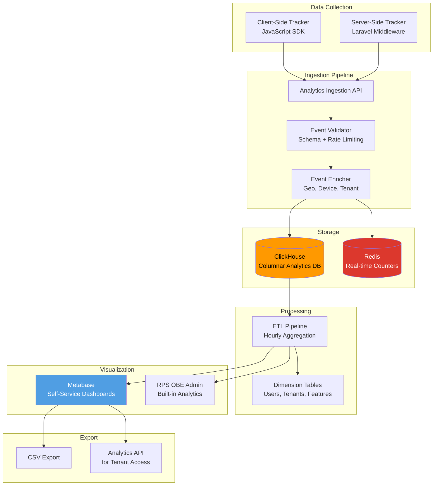
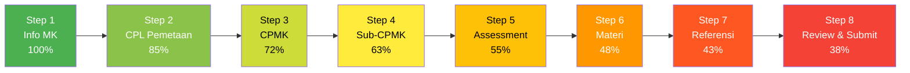
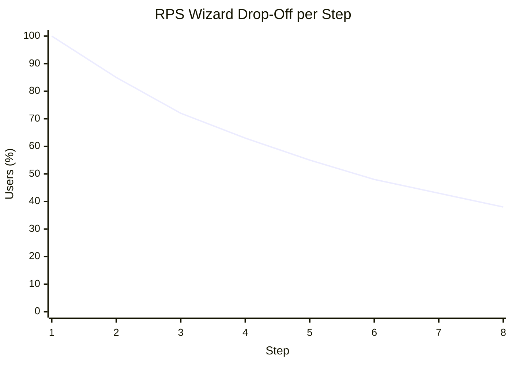
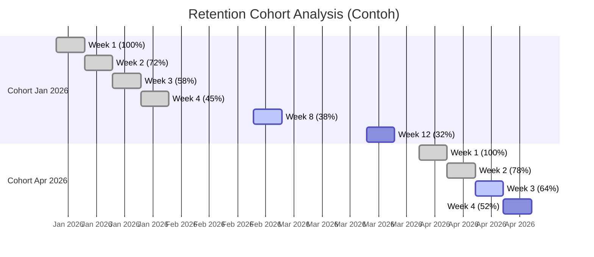
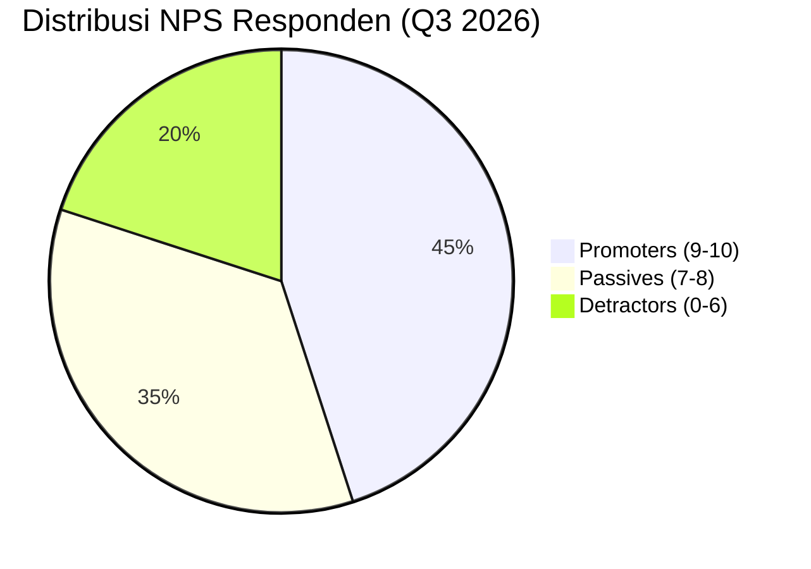
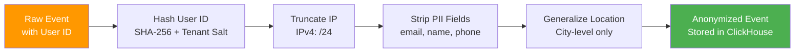

# 37 — Analytics

## Ikhtisar

Analytics RPS OBE menyediakan strategi pengukuran produk yang holistik — mencakup pelacakan perilaku pengguna, analitik bisnis, dan metrik dashboard — untuk mendorong keputusan berbasis data. Dokumen ini mendefinisikan event taxonomy, tools analitik (self-hosted), funnel analysis, kohort retensi, pelacakan MRR, indikator churn, survei NPS, pertimbangan privasi (GDPR dan anonimisasi), dan kebijakan retensi data analitik selama 13 bulan.

---

## Prinsip Analytics

| Prinsip | Deskripsi |
|---------|-----------|
| **Privacy-First** | Semua data analitik dianonimkan secara default; tidak ada PII mentah yang dikirim ke layanan pihak ketiga |
| **Self-Hosted** | Tools analitik dijalankan di infrastruktur sendiri untuk kontrol penuh atas data |
| **Actionable Metrics** | Hanya metrik yang dapat mendorong keputusan produk dan bisnis yang dilacak |
| **Event-Driven** | Semua interaksi dilacak sebagai event terstruktur dengan konvensi penamaan baku |
| **Multi-Tenant Isolation** | Data analitik dipisahkan per tenant untuk dashboard tenant dan agregasi platform |
| **Compliance-Ready** | Memenuhi standar GDPR, UU PDP Indonesia, dan kebutuhan audit BAN-PT |

---

## Arsitektur Analytics



---

## Event Taxonomy

### Konvensi Penamaan

Semua event mengikuti format: `object_action_context`

| Komponen | Aturan | Contoh |
|----------|--------|--------|
| **object** | Entitas yang terlibat | `rps`, `user`, `dashboard`, `export`, `ai` |
| **action** | Aksi pengguna | `view`, `create`, `submit`, `export`, `generate` |
| **context** | Lokasi atau situasi | `wizard`, `list`, `dashboard`, `review` |

### Katalog Event Utama

| Event | Objek | Aksi | Konteks | Properties Standar |
|-------|-------|------|---------|-------------------|
| `page_view` | page | view | `*` | url, referrer, title, load_time_ms |
| `rps_create_start_wizard` | rps | create | start | mk_id, prodi_id, semester_id |
| `rps_wizard_step_complete` | rps | step_complete | wizard | rps_id, step_number, step_name, duration_ms |
| `rps_wizard_step_skip` | rps | step_skip | wizard | rps_id, step_number, step_name |
| `rps_wizard_abandon` | rps | abandon | wizard | rps_id, last_step, total_steps_completed, reason |
| `rps_submit_review` | rps | submit | wizard | rps_id, has_validation_warnings, completion_time_ms |
| `rps_view_detail` | rps | view | detail | rps_id, view_mode (preview/edit) |
| `rps_export_start` | rps | export | detail | rps_id, format (docx/pdf), via_button |
| `rps_export_complete` | rps | export_complete | detail | rps_id, format, duration_ms, file_size_kb |
| `rps_export_download` | rps | export_download | detail | rps_id, format |
| `rps_version_compare` | rps | compare | version | rps_id, version_a, version_b |
| `rps_status_change` | rps | status_change | workflow | rps_id, from_status, to_status, actor_role |
| `ai_generate_request` | ai | generate | wizard | rps_id, action_type (cpmk/subcpmk/materi/assessment), model |
| `ai_generate_complete` | ai | generate_complete | wizard | rps_id, action_type, tokens_used, duration_ms, accepted |
| `ai_validate_request` | ai | validate | wizard | rps_id, trigger (manual/auto) |
| `ai_validate_complete` | ai | validate_complete | wizard | rps_id, total_score, warning_count, error_count, duration_ms |
| `ai_review_request` | ai | review | workflow | rps_id, trigger (manual/auto) |
| `ai_review_complete` | ai | review_complete | workflow | rps_id, total_score, suggestions_count, duration_ms |
| `user_login` | user | login | auth | auth_method (password/sso), device_type |
| `user_invite_accepted` | user | invite_accepted | admin | invited_by_user_id, role |
| `user_role_change` | user | role_change | admin | user_id, from_role, to_role, performed_by |
| `mapping_cpl_cpmk_create` | mapping | create | cpl_cpmk | rps_id, cpl_count_linked, cpmk_id |
| `mapping_subcpmk_assessment_create` | mapping | create | assessment | rps_id, subcpmk_id, assessment_id |
| `notification_click` | notification | click | `*` | notification_id, type, redirect_url |
| `notification_mark_read` | notification | mark_read | `*` | notification_id, source (manual/auto) |
| `dashboard_view` | dashboard | view | `*` | dashboard_type (dosen/kaprodi), time_to_interactive_ms |
| `dashboard_stat_click` | dashboard | stat_click | `*` | stat_name, navigated_to |
| `template_select` | template | select | wizard | template_id, is_default |
| `search_perform` | search | perform | `*` | search_type, query_length, result_count, duration_ms |
| `filter_apply` | filter | apply | list | filter_name, filter_value, context |
| `bulk_action_perform` | bulk | action | list | action_type, items_count, context |

### Properties Standar untuk Setiap Event

```json
{
    "event": "rps_wizard_step_complete",
    "properties": {
        "tenant_id": "uuid-tenant",
        "user_id": "hashed-user-id",
        "anonymous_id": "uuid-session",
        "timestamp": "2026-08-02T14:30:00.000+07:00",
        "session_id": "uuid-session",
        "page_url": "/rps/builder/step-3",
        "referrer_url": "/rps/builder/step-2",
        "user_agent": "Mozilla/5.0...",
        "device_category": "desktop",
        "browser": "Chrome",
        "os": "Windows",
        "screen_resolution": "1920x1080",
        "locale": "id-ID",
        "feature_flags": ["ai_assistant", "batch_export"]
    }
}
```

---

## Tools Analytics

### Technology Stack

| Tool | Purpose | License | Deployment |
|------|---------|---------|------------|
| **ClickHouse** | Penyimpanan dan kueri analitik kolumnar | Open Source (Apache 2.0) | Self-hosted, dedicated VM |
| **Metabase** | Dashboard visualisasi self-service | Open Source (AGPLv3) | Self-hosted, Docker |
| **Redis** | Real-time counters dan rate limiting | Open Source (BSD) | Self-hosted (existing infra) |
| **Laravel Analytics Middleware** | Server-side event capture | Built-in | Aplikasi utama |
| **JavaScript Tracker** | Client-side event capture | Custom, lightweight (5 KB gzipped) | CDN |

### Konfigurasi Self-Hosted

```php
// config/analytics.php
return [
    'ingestion_endpoint' => env('ANALYTICS_INGESTION_URL', 'https://analytics.obe.university.ac.id'),
    'clickhouse' => [
        'host' => env('CLICKHOUSE_HOST', 'clickhouse.internal'),
        'port' => env('CLICKHOUSE_PORT', 8123),
        'database' => 'rps_obe_analytics',
        'username' => env('CLICKHOUSE_USER'),
        'password' => env('CLICKHOUSE_PASSWORD'),
    ],
    'buffer' => [
        'driver' => 'redis',
        'flush_interval_seconds' => 30,
        'max_buffer_size' => 500,
    ],
    'sampling' => [
        'default_rate' => 1.0,       // 100% sampling di production
        'high_volume_rate' => 0.1,   // 10% untuk event frekuensi tinggi (scroll, mousemove)
    ],
    'retention' => [
        'raw_events_days' => 90,     // Raw events: 90 hari
        'aggregated_events_days' => 395, // Aggregated: 13 bulan
    ],
];
```

---

## User Behavior Analytics

### 1. Funnel Analysis — RPS Wizard Completion



#### Target Funnel Metrics

| Langkah | Nama Step | Target Completion Rate | Action jika di Bawah Target |
|---------|-----------|------------------------|------------------------------|
| Step 1 | Informasi Mata Kuliah | 100% | — |
| Step 2 | Pemetaan CPL | ≥ 90% | Evaluasi UX pemilihan CPL; tambahkan quick-select |
| Step 3 | CPMK | ≥ 80% | Promosikan AI Generate CPMK; kurangi field wajib |
| Step 4 | Sub-CPMK | ≥ 70% | Tambah template Sub-CPMK; AI suggestion inline |
| Step 5 | Assessment & Bobot | ≥ 65% | Sederhanakan input bobot; auto-calculate |
| Step 6 | Materi Pembelajaran | ≥ 60% | AI generate materi; import dari silabus lama |
| Step 7 | Referensi | ≥ 55% | Auto-generate referensi; integrasi Google Scholar |
| Step 8 | Review & Submit | ≥ 50% | Highlight completeness; one-click submit |

### 2. Drop-Off Analysis



#### Identifikasi Titik Drop-Off

| Step | Drop-Off Rate | Penyebab Potensial | Mitigasi |
|------|---------------|--------------------|----------|
| 1→2 | 15% | Bingung cara memilih CPL; tidak tahu CPL mana yang relevan | Pencarian CPL; suggestion berdasarkan MK serupa |
| 2→3 | 13% | Menulis CPMK manual sulit dan memakan waktu | AI Generate CPMK sebagai default; pre-fill dari template |
| 3→4 | 9% | Input Sub-CPMK terlalu banyak field (taksonomi, pertemuan) | Inline AI suggestion; auto-mapping pertemuan |
| 4→5 | 8% | Menentukan bobot assessment kompleks | Auto-distribute bobot; slider visual |
| 5→6 | 7% | Kelelahan pengisian (form fatigue) | Progress bar; save draft; estimasi waktu tersisa |
| 6→7 | 5% | Referensi sulit dikumpulkan | Integrasi DOI/Google Scholar; AI-generate daftar pustaka |
| 7→8 | 5% | Ingin review dulu sebelum commit | Auto-save setiap step; preview mode |

### 3. Feature Adoption Rates

| Fitur | Target Adopsi (30 hari) | Target Adopsi (90 hari) | Metrik Ukur |
|-------|------------------------|------------------------|-------------|
| AI Generate CPMK | 60% | 80% | rps_create_yang_menggunakan_ai / total_rps_created |
| AI Validator | 50% | 75% | rps_divalidasi_ai / total_rps_submitted |
| AI Reviewer | 30% | 50% | rps_direview_ai / total_rps_direview |
| Export Word | 80% | 95% | rps_diekspor / total_rps_published |
| Export PDF | 70% | 90% | rps_diekspor_pdf / total_rps_published |
| Template Custom | 20% | 40% | rps_dengan_template_custom / total_rps_created |
| Batch Operations | 10% | 25% | pengguna_menggunakan_batch / total_active_users |
| Version Compare | 15% | 35% | rps_dengan_version_compare / total_rps_with_revisions |

### 4. Session Duration

| Metrik | Target | Keterangan |
|--------|--------|------------|
| **Average Session Duration** | 8-12 menit per sesi | Durasi tipikal penyusunan RPS |
| **Average Session — Dosen** | 12-20 menit | Dosen menyusun RPS lebih lama |
| **Average Session — Kaprodi** | 5-10 menit | Reviewer cenderung membaca cepat |
| **Median Time per Wizard Step** | 2-4 menit | Termasuk AI generation wait time |
| **Average Pages per Session** | 6-10 halaman | Navigasi antar fitur |
| **Bounce Rate — Dashboard** | < 25% | Dashboard harus engaging |
| **Bounce Rate — Landing Pages** | < 40% | Residual dari direct link |

### 5. Retention Cohorts



#### Target Retensi

| Periode | Target Retensi | Definisi Aktif |
|---------|---------------|----------------|
| Day 1 | ≥ 90% | Login dalam 24 jam setelah pendaftaran |
| Day 7 | ≥ 70% | Minimal 1 aksi (create/edit RPS) dalam 7 hari |
| Day 14 | ≥ 55% | Minimal 2 RPS diedit dalam 14 hari |
| Day 30 | ≥ 40% | Login dan aktivitas dalam 30 hari |
| Day 60 | ≥ 30% | RPS disubmit dalam 60 hari |
| Day 90 | ≥ 25% | RPS baru dibuat dalam kuartal |

---

## Business Analytics

### 1. Tenant MRR (Monthly Recurring Revenue) Tracking

| Metrik | Definisi | Target |
|--------|----------|--------|
| **MRR** | Total pendapatan bulanan dari semua tenant aktif | Tumbuh 10% MoM |
| **ARPU** | Average Revenue Per User (per tenant) | Rp 750.000/bulan |
| **ARR** | Annual Recurring Revenue (MRR x 12) | Rp 900.000.000/tahun |
| **Expansion MRR** | Peningkatan pendapatan dari tenant existing (upgrade paket) | > 20% dari total MRR |
| **New MRR** | Pendapatan dari tenant baru | > 30% dari total MRR |
| **Contraction MRR** | Penurunan pendapatan dari downgrade tenant | < 5% dari total MRR |
| **Churned MRR** | Pendapatan yang hilang dari tenant cancel | < 3% dari total MRR |
| **Net New MRR** | New + Expansion - Contraction - Churned | Positif setiap bulan |

### 2. Feature Usage per Package

| Fitur | Basic | Professional | Enterprise |
|-------|-------|-------------|------------|
| RPS Created/month | Rata-rata 3 | Rata-rata 8 | Rata-rata 25 |
| AI Generate/month | N/A | 45 requests | 150 requests |
| AI Validate/month | N/A | 30 validations | 100 validations |
| AI Review/month | N/A | 15 reviews | 60 reviews |
| Export/month | 5 exports | 20 exports | 80 exports |
| Users/tenant | 5 users | 20 users | 50+ users |
| Storage Used | 50 MB | 200 MB | 1 GB |

### 3. Churn Indicators (Early Warning System)

```mermaid
graph TD
    subgraph "Healthy User"
        H1[Login ≥ 1x/minggu]
        H2[RPS Activity ≥ 1/minggu]
        H3[AI Feature Usage]
        H4[Export Activity]
        H5[NPS ≥ 7]
    end

    subgraph "At Risk — Warning Level 1"
        R1[Login < 1x/14 hari]
        R2[No RPS created > 14 hari]
        R3[Session duration menurun > 50%]
        R4[Error rate meningkat]
    end

    subgraph "At Risk — Warning Level 2"
        C1[Login < 1x/30 hari]
        C2[No activity > 30 hari]
        C3[Support ticket meningkat]
        C4[Billing inquiry]
    end

    subgraph "Churn Imminent"
        D1[Login 0x/45 hari]
        D2[Admin tenant inactive]
        D3[Export massal (data retrieval)]
        D4[Payment failed 2x]
    end

    H1 -.->|Degradasi| R1
    H2 -.->|Degradasi| R2
    R1 -.->|Degradasi| C1
    R2 -.->|Degradasi| C2
    C1 -.->|Degradasi| D1
    C2 -.->|Degradasi| D2

    style H1 fill:#4caf50,color:#fff
    style R1 fill:#ff9800,color:#fff
    style C1 fill:#ff5722,color:#fff
    style D1 fill:#f44336,color:#fff
```

#### Tindakan Berdasarkan Level Risiko

| Level | Indikator | Tindakan Otomatis | Tindakan Manual |
|-------|-----------|-------------------|-----------------|
| Warning 1 | 14 hari tanpa RPS baru | Email re-engagement + tips penggunaan | CS cek apakah ada kendala |
| Warning 2 | 30 hari inactivity | Email dari CS dengan tawaran sesi pelatihan gratis | CS telepon / WhatsApp follow-up |
| Churn Imminent | 45+ hari inactivity | Notifikasi ke CS Lead; tawaran diskon 1 bulan | CS Lead kunjungan atau meeting |

### 4. NPS (Net Promoter Score) Survey — In-App

#### Mekanisme Survei

| Aspek | Konfigurasi |
|-------|-------------|
| **Trigger** | Setelah RPS ke-5 disubmit, atau 30 hari setelah registrasi |
| **Frekuensi** | Maksimal 1x per 90 hari per user |
| **Penempatan** | In-app toast/popup non-intrusif |
| **Pertanyaan Utama** | "Seberapa besar kemungkinan Anda merekomendasikan RPS OBE kepada kolega?" |
| **Skala** | 0–10 (NPS standard) |
| **Follow-up** | "Apa alasan utama Anda memberikan skor tersebut?" (textarea, opsional) |
| **Target NPS** | ≥ 50 (Excellent untuk B2B SaaS di Indonesia) |

#### Klasifikasi Responden

| Kategori | Skor | Karakteristik | Tindakan |
|----------|------|--------------|----------|
| **Promoters** | 9-10 | Pengguna loyal, aktif merekomendasikan | Minta testimoni; jadikan referensi; early access fitur baru |
| **Passives** | 7-8 | Puas tapi tidak antusias | Identifikasi pain points; tawarkan fitur yang belum digunakan |
| **Detractors** | 0-6 | Tidak puas, berisiko churn | CS reach out dalam 24 jam; identifikasi dan perbaiki masalah |

#### Dashboard NPS



---

## Dashboard Analytics

### 1. Most Viewed Reports

| Metrik | Periode Pelacakan | Tujuan |
|--------|-------------------|--------|
| RPS Views per Day | Harian | Identifikasi RPS paling diminati; prioritas review |
| RPS Views by Prodi | Mingguan | Analisis adopsi per program studi |
| RPS Views by Status | Real-time | Dashboard, Draft, atau Published paling banyak dilihat |
| Unique RPS Viewers | Harian | Berapa banyak user unik melihat RPS tertentu |
| Time Spent on RPS View | Per sesi | Indikasi engagement dengan konten RPS |
| Top Search Queries | Mingguan | Apa yang dicari pengguna; UX improvement |

### 2. Export Frequency

| Metrik | Definisi | Dashboard Widget |
|--------|----------|-----------------|
| Export Total per Hari | Jumlah ekspor (Word + PDF) per hari | Bar chart daily |
| Export by Format | Word vs PDF ratio | Pie chart |
| Export by Tenant | Top 10 tenant by export volume | Horizontal bar chart |
| Export Queue Wait Time | Rata-rata waktu tunggu di queue | Gauge |
| Export Success Rate | Persentase ekspor yang berhasil | Stat panel + trend |
| Peak Export Hours | Jam dengan volume ekspor tertinggi | Heatmap hour x day |
| Bulk Export Usage | Jumlah pengguna yang menggunakan batch export | Counter |

### 3. Dashboard Performance Metrics

| Metrik | Target | Visualisasi |
|--------|--------|-------------|
| Dashboard Load Time | < 1.5 detik (p95) | Time series |
| Dashboard Widget Render Time | < 500ms per widget | Table per widget |
| Dashboard Daily Active Viewers | — | Bar chart |
| Dashboard Feature Clicks | — | Heatmap |

---

## Privacy Considerations

### Kepatuhan GDPR dan UU PDP

| Aspek | Implementasi |
|-------|-------------|
| **Lawful Basis** | Legitimate interest untuk product analytics; consent untuk behavioral tracking opsional |
| **Data Minimization** | Hanya kumpulkan data yang diperlukan; sampling untuk event frekuensi tinggi |
| **Anonymization** | Semua user_id di-hash (SHA-256 + salt); IP address di-truncate ke /24 (IPv4) atau /48 (IPv6) |
| **Pseudonymization** | Session ID dan anonymous ID menggunakan UUID v4, tidak terkait langsung ke identitas |
| **Right to Access** | Tenant admin dapat mengunduh semua data analitik tenant mereka dalam format CSV/JSON |
| **Right to Erasure** | Data user dihapus permanen dalam 30 hari setelah permintaan; event yang sudah dianonimkan tetap dipertahankan |
| **Data Processing Agreement** | Tersedia di ToS; data tidak pernah diproses di luar server yang dikelola |
| **Cookie Consent** | Cookie analytics (first-party only) dengan banner persetujuan standar |
| **Cross-Border Transfer** | Tidak ada transfer data ke luar Indonesia (semua self-hosted) |

### Anonymization Pipeline



### Data yang Tidak Pernah Dilacak

| PII Category | Contoh | Kebijakan |
|--------------|--------|-----------|
| Nama Lengkap | "Dr. Budi Santoso, M.Kom." | Tidak dilacak; diganti hashed user ID |
| Email | budi.santoso@university.ac.id | Tidak dilacak |
| Nomor Telepon | 0812-3456-7890 | Tidak dilacak |
| NIDN/NIP | 0012345601 | Tidak dilacak |
| Alamat IP Penuh | 192.168.1.100 | Di-truncate ke 192.168.1.0/24 |
| Data RPS Konten | Deskripsi CPMK, Materi | Tidak dilacak (metadata saja) |
| Password/Token | — | Tidak pernah masuk pipeline analytics |

---

## Data Retention

### Kebijakan Retensi Analytics

| Layer Data | Retensi | Rationale |
|------------|---------|-----------|
| **Raw Events (ClickHouse)** | 90 hari | Memungkinkan analisis detail 1 kuartal; memenuhi kebutuhan debugging |
| **Aggregated Daily** | 395 hari (13 bulan) | Membandingkan MoM dan YoY; 13 bulan mencakup 1 bulan overlap |
| **Aggregated Weekly** | 3 tahun | Analisis tren jangka panjang |
| **Aggregated Monthly** | 5 tahun | Business intelligence dan pelaporan tahunan |
| **Real-time Counters (Redis)** | 24 jam | Dashboard real-time; di-reset tengah malam |
| **Session Recording** | 30 hari (opsional) | Hanya untuk debugging UX; membutuhkan consent eksplisit |
| **NPS Responses** | 2 tahun | Analisis tren kepuasan pengguna |

### Proses Pembersihan Data

```text
Cron Schedule:
├── Daily @ 02:00 WIB: Hapus raw events > 90 hari
├── Daily @ 03:00 WIB: Hapus real-time counters > 24 jam
├── Weekly @ Sunday 04:00 WIB: Aggregasi daily ke weekly (untuk data > 90 hari)
├── Monthly @ 1st 05:00 WIB: Aggregasi weekly ke monthly (untuk data > 12 bulan)
└── On Demand: Hapus data spesifik tenant/user setelah permintaan erasure
```

---

## Implementasi Tracking

### Client-Side (JavaScript Tracker)

```javascript
// resources/js/analytics/tracker.js
window.RPSAnalytics = {
    track(event, properties = {}) {
        const payload = {
            event,
            properties: {
                ...properties,
                tenant_id: window.RPS_TENANT_ID,
                user_id: window.RPS_ANONYMOUS_USER_ID,
                anonymous_id: window.RPS_SESSION_ID,
                timestamp: new Date().toISOString(),
                page_url: window.location.href,
                referrer_url: document.referrer || null,
                screen_resolution: `${window.screen.width}x${window.screen.height}`,
                locale: navigator.language,
            },
        };

        // Gunakan sendBeacon untuk reliability
        if (navigator.sendBeacon) {
            navigator.sendBeacon(
                '/api/analytics/ingest',
                JSON.stringify(payload)
            );
        } else {
            fetch('/api/analytics/ingest', {
                method: 'POST',
                headers: { 'Content-Type': 'application/json' },
                body: JSON.stringify(payload),
            });
        }
    },

    trackPageView() {
        this.track('page_view', {
            url: window.location.href,
            title: document.title,
            load_time_ms: this.getLoadTime(),
        });
    },

    getLoadTime() {
        const perf = window.performance?.timing;
        if (!perf) return null;
        return perf.domContentLoadedEventEnd - perf.navigationStart;
    },
};

// Auto-track page views
document.addEventListener('DOMContentLoaded', () => {
    RPSAnalytics.trackPageView();
});

// Auto-track wizard steps
document.addEventListener('livewire:load', () => {
    Livewire.on('wizard-step-complete', (data) => {
        RPSAnalytics.track('rps_wizard_step_complete', data);
    });
});
```

### Server-Side (Laravel Middleware)

```php
// app/Http/Middleware/AnalyticsMiddleware.php
namespace App\Http\Middleware;

use Closure;
use Illuminate\Http\Request;
use Illuminate\Support\Facades\Redis;

class AnalyticsMiddleware
{
    public function handle(Request $request, Closure $next): mixed
    {
        $startTime = microtime(true);
        $response = $next($request);
        $duration = round((microtime(true) - $startTime) * 1000, 2);

        // Batch event ke Redis buffer untuk flush periodik
        $event = [
            'event' => 'page_view',
            'properties' => [
                'url' => $request->path(),
                'method' => $request->method(),
                'status_code' => $response->status(),
                'duration_ms' => $duration,
                'tenant_id' => app('current_tenant')?->id,
                'user_id' => $request->user()?->id,
                'timestamp' => now()->toIso8601String(),
            ],
        ];

        Redis::rpush('analytics:buffer', json_encode($event));

        return $response;
    }
}
```

### Konfigurasi Event di Aplikasi

```php
// app/Support/AnalyticsTracker.php
namespace App\Support;

class AnalyticsTracker
{
    public static function rpsWizardStepComplete(int $rpsId, int $step, string $stepName, float $durationMs): void
    {
        self::send('rps_wizard_step_complete', [
            'rps_id' => $rpsId,
            'step_number' => $step,
            'step_name' => $stepName,
            'duration_ms' => round($durationMs, 2),
        ]);
    }

    public static function aiGenerateRequest(int $rpsId, string $actionType, string $model): void
    {
        self::send('ai_generate_request', [
            'rps_id' => $rpsId,
            'action_type' => $actionType,
            'model' => $model,
        ]);
    }

    private static function send(string $event, array $properties): void
    {
        Redis::rpush('analytics:buffer', json_encode([
            'event' => $event,
            'properties' => array_merge($properties, [
                'tenant_id' => app('current_tenant')?->id,
                'user_id' => auth()->id(),
                'timestamp' => now()->toIso8601String(),
            ]),
        ]));
    }
}
```

---

## Dashboard dan Pelaporan Analytics

### Metabase — Dashboard Template

```yaml
# metabase/dashboards/prd.yml
dashboards:
  - name: "Product Analytics — Overview"
    collection: "RPS OBE / Product"
    cards:
      - name: "DAU / WAU / MAU"
        visualization: "time_series"
        query: "daily_active_users_trend.sql"
      - name: "RPS Creation Funnel"
        visualization: "funnel"
        query: "wizard_funnel.sql"
      - name: "Top Features by Adoption"
        visualization: "horizontal_bar"
        query: "feature_adoption_rank.sql"
      - name: "Export Volume by Format"
        visualization: "pie"
        query: "export_by_format.sql"

  - name: "Business Analytics — Revenue"
    collection: "RPS OBE / Business"
    cards:
      - name: "MRR Trend"
        visualization: "time_series"
        query: "mrr_trend.sql"
      - name: "MRR Waterfall"
        visualization: "waterfall"
        query: "mrr_waterfall.sql"
      - name: "Churn Rate (Monthly)"
        visualization: "gauge"
        query: "churn_rate.sql"
      - name: "NPS Score Trend"
        visualization: "time_series"
        query: "nps_trend.sql"
```

---

**Navigasi:** [Sebelumnya: Monitoring](36-monitoring.md) | [Daftar Isi](../README.md) | [Berikutnya: Accessibility](38-accessibility.md)
