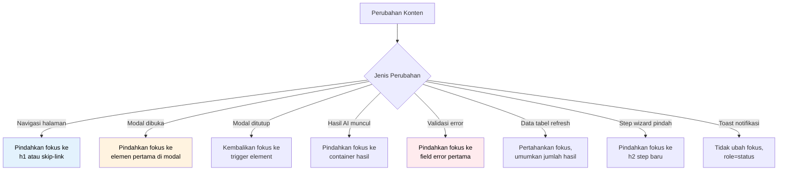

# 38 — Accessibility

## Ikhtisar

Aksesibilitas RPS OBE memastikan platform dapat digunakan oleh seluruh pengguna — termasuk penyandang disabilitas — sesuai standar WCAG 2.1 Level AA. Dokumen ini mendefinisikan strategi implementasi empat prinsip aksesibilitas (Perceivable, Operable, Understandable, Robust), implementasi spesifik pada komponen Tabler, rencana pengujian screen reader, pintasan keyboard, manajemen fokus dalam SPA/Livewire, pertimbangan buta warna, aksesibilitas formulir (label, pesan error, indikator wajib), dan daftar tools pengujian (axe-core, Lighthouse, WAVE).

---

## Prinsip Aksesibilitas

| Prinsip | Deskripsi | Prioritas |
|---------|-----------|-----------|
| **Progressive Enhancement** | Aksesibilitas dibangun dari dasar, bukan ditambahkan di akhir; HTML semantik sebagai fondasi |
| **Inclusive by Default** | Setiap komponen UI baru harus memenuhi standar aksesibilitas sebelum dianggap selesai |
| **Bahasa Indonesia First** | Seluruh teks, label, dan instruksi menggunakan Bahasa Indonesia yang jelas dan sederhana |
| **Test with Real Users** | Libatkan pengguna dengan disabilitas dalam siklus pengujian |
| **Continuous Compliance** | Audit aksesibilitas dilakukan setiap sprint; bukan one-time effort |
| **Documented Standards** | Semua keputusan aksesibilitas didokumentasikan dalam komponen library |

---

## Target Kepatuhan: WCAG 2.1 Level AA

### Ringkasan Kriteria Keberhasilan

| Prinsip WCAG | Jumlah SC Level A | Jumlah SC Level AA | Total SC |
|-------------|-------------------|--------------------|----------|
| 1. Perceivable | 9 | 4 | 13 |
| 2. Operable | 14 | 3 | 17 |
| 3. Understandable | 5 | 5 | 10 |
| 4. Robust | 2 | 1 | 3 |
| **Total** | **30** | **13** | **43** |

---

## 1. Perceivable (Dapat Dipersepsikan)

### 1.1 Text Alternatives (Non-text Content — SC 1.1.1 Level A)

| Elemen | Implementasi | Contoh |
|--------|-------------|--------|
| Gambar dekoratif | `alt=""` atau CSS background | Ikon ilustrasi dashboard |
| Gambar informatif | `alt` deskriptif dalam Bahasa Indonesia | `alt="Diagram alur penyusunan RPS 8 langkah"` |
| Ikon fungsional (tombol) | `aria-label` atau teks tersembunyi | `aria-label="Generate CPMK dengan AI"` |
| Grafik/Chart | `alt` + deskripsi teks di bawah grafik | `alt="Grafik batang: Jumlah RPS per bulan Januari-Juni 2026"` |
| CAPTCHA | Alternatif audio + teks, atau gunakan honeypot | — |
| Video tutorial | Subtitle Bahasa Indonesia (file `.vtt`) | — |

### 1.2 Captions dan Media Alternatif

| Media | Requirement (Level A) | Requirement (Level AA) | Implementasi |
|-------|----------------------|------------------------|-------------|
| Audio-only | Transkrip teks | — | Tidak ada konten audio-only yang direncanakan |
| Video (prerecorded) | Captions (subtitle) | Audio description | File `.vtt` Bahasa Indonesia |
| Video (live) | Captions | — | Tidak ada konten live yang direncanakan |

### 1.3 Adaptable Content (SC 1.3.1–1.3.3)

| Kriteria | Implementasi |
|----------|-------------|
| **Info and Relationships** (1.3.1 A) | Struktur heading hierarkis (h1–h6); tabel dengan `<th scope>`; list menggunakan `<ul>/<ol>/<dl>`; fieldset + legend untuk grouping form |
| **Meaningful Sequence** (1.3.2 A) | DOM order = visual order; konten dapat dibaca linear tanpa CSS |
| **Sensory Characteristics** (1.3.3 A) | Tidak menggunakan "klik tombol hijau" tanpa label; semua instruksi menggunakan teks |

#### Struktur Heading Halaman

```
h1: Judul halaman (contoh: "Penyusunan RPS — Step 3: CPMK")
├── h2: Bagian utama (contoh: "Daftar CPMK")
│   ├── h3: Sub-bagian (contoh: "CPMK-01")
│   │   └── h4: Detail item (contoh: "Deskripsi")
│   └── h3: "Generate CPMK dengan AI"
└── h2: "Navigasi Step"
```

### 1.4 Distinguishable Content (SC 1.4.1–1.4.13)

#### 1.4.1 Use of Color (Level A)

- Warna tidak menjadi satu-satunya pembeda informasi
- Status selalu disertai ikon + teks + warna: `✅ Lulus` / `⚠️ Peringatan` / `❌ Gagal`
- Link di dalam teks memiliki underline + warna berbeda
- Chart/graph menggunakan pola (pattern) selain warna

#### 1.4.2 Audio Control (Level A)

- Tidak ada audio auto-play; jika ada, sertakan kontrol pause/stop/mute

#### 1.4.3 Contrast Ratio (Level AA)

| Tipe Teks | Rasio Minimum | Contoh Elemen |
|-----------|---------------|---------------|
| **Teks normal** (< 18pt / < 14pt bold) | **4.5:1** | Body text, label form, teks tabel, placeholder |
| **Teks besar** (≥ 18pt / ≥ 14pt bold) | **3:1** | Judul halaman, heading, judul card |
| **UI Components** & graphical objects | **3:1** | Border input, ikon, fokus indicator |
| **Disabled elements** | Tidak ada persyaratan | — |

#### Palet Warna Terverifikasi

| Nama Warna | Hex | Digunakan Untuk | Kontras dengan #FFFFFF | Kontras dengan #1E293B |
|------------|-----|----------------|----------------------|----------------------|
| Primary Blue | `#206BC4` | Tombol utama, link, brand | **4.63:1** ✅ | — |
| Primary Dark | `#1E293B` | Teks body, heading | **13.41:1** ✅ | — |
| Success Green | `#2FB344` | Status sukses | **2.89:1** ❌ (perlu dark variant) | — |
| Success Green Dark | `#1B7A2B` | Status sukses (teks) | **6.88:1** ✅ | — |
| Warning Orange | `#F59F00` | Status warning | **2.03:1** ❌ (perlu dark variant) | — |
| Warning Orange Dark | `#B37300` | Status warning (teks) | **4.53:1** ✅ | — |
| Danger Red | `#D63939` | Status error | **4.72:1** ✅ | — |
| Gray 500 | `#656D77` | Teks placeholder, secondary | — | **4.95:1** ✅ |
| Gray 300 | `#C6CAD0` | Border input | — | **2.91:1** ❌ (perlu darken) |
| Gray 400 | `#9299A4` | Border input (improved) | — | **4.15:1** ✅ |

#### 1.4.4 Resize Text (Level AA)

- Teks dapat di-zoom hingga 200% tanpa kehilangan konten atau fungsi
- Gunakan unit relatif (`rem`, `em`, `%`) — bukan `px` fixed untuk font-size
- Layout menggunakan CSS Grid/Flexbox yang responsif terhadap zoom
- Tidak ada `maximum-scale=1.0` di meta viewport (kecuali kasus spesifik)

#### 1.4.5 Images of Text (Level AA)

- Tidak menggunakan gambar yang berisi teks; gunakan CSS styling
- Exception: logo, screenshot (jika diperlukan)

#### 1.4.10 Reflow (Level AA)

- Konten dapat ditampilkan dalam viewport lebar 320px (mobile) tanpa scroll horizontal
- Tidak perlu scroll dua arah (kecuali konten seperti tabel besar yang menggunakan mekanisme khusus)
- Tabel besar menggunakan wrapper dengan `overflow-x: auto` + `role="region"` + `aria-label`

#### 1.4.11 Non-text Contrast (Level AA)

- Fokus indicator memiliki kontras minimal 3:1 terhadap background
- Border input memiliki kontras minimal 3:1
- Ikon interaktif memiliki kontras minimal 3:1

#### 1.4.12 Text Spacing & 1.4.13 Content on Hover/Focus

- Mendukung user stylesheet dengan line-height 1.5, paragraph spacing 2em, letter-spacing 0.12em, word-spacing 0.16em
- Tooltip/popover yang muncul on hover harus: dismissable (Esc), hoverable (tidak hilang saat kursor di atasnya), persistent (tidak auto-hilang)

---

## 2. Operable (Dapat Dioperasikan)

### 2.1 Keyboard Accessible (SC 2.1.1–2.1.4)

#### Full Keyboard Support

| Perilaku | Standar | Tombol |
|----------|---------|--------|
| Navigasi antar elemen interaktif | Tab / Shift+Tab | Fokus bergerak dalam urutan DOM yang logis |
| Aktivasi tombol/link | Enter / Space | Fungsionalitas utama |
| Tutup modal/dialog | Escape | Menutup dan mengembalikan fokus |
| Navigasi dropdown/select | Arrow keys | Navigasi opsi |
| Navigasi tab panel | Left/Right Arrow | Pindah antar tab |
| Navigasi tree/list | Up/Down Arrow | Navigasi item |
| Select/deselect checkbox | Space | Toggle |
| Navigasi date picker | Arrow keys + PageUp/Down | Navigasi kalender |
| Wizard step navigation | Tab untuk konten step + Ctrl+Left/Right untuk pindah step | — |

#### Keyboard Trap Prevention

- Tidak ada elemen yang menjebak fokus keyboard
- Modal wajib memiliki mekanisme close (tombol X, klik overlay, Esc)
- Jika ada komponen kompleks (seperti rich text editor), pastikan ada instruksi keyboard yang jelas

#### Skip Links

```html
<!-- Wajib di setiap halaman -->
<nav aria-label="Navigasi cepat">
    <a href="#main-content" class="skip-link">
        Lewati ke konten utama
    </a>
    <a href="#navigation" class="skip-link">
        Lewati ke navigasi
    </a>
    <a href="#footer" class="skip-link">
        Lewati ke footer
    </a>
</nav>
```

### 2.2 Enough Time (SC 2.2.1–2.2.6)

| Kriteria | Implementasi |
|----------|-------------|
| **Timing Adjustable** (2.2.1 A) | Tidak ada batas waktu untuk penyusunan RPS; session timeout 8 jam (dapat diperpanjang) |
| **Pause, Stop, Hide** (2.2.2 A) | Auto-refresh data diberi tombol pause/resume; carousel auto-rotate diberi kontrol pause |
| **No Timing** (2.2.3 A) | Tidak ada konten atau interaksi yang memiliki batas waktu ketat |
| **Interruptions** (2.2.4 A) | Notifikasi popup dapat ditunda/dismiss; update konten tidak menginterupsi kecuali emergency |
| **Re-authenticating** (2.2.5 A) | Setelah re-login, pengguna kembali ke halaman terakhir dengan data yang belum tersimpan masih ada |
| **Timeouts** (2.2.6 AAA) | (Target AAA, diimplementasikan sebagai best practice) |

### 2.3 Seizures and Physical Reactions (SC 2.3.1)

- Tidak ada konten yang berkedip lebih dari 3 kali per detik
- Animasi dan transisi menggunakan `prefers-reduced-motion: reduce` media query

```css
@media (prefers-reduced-motion: reduce) {
    *,
    *::before,
    *::after {
        animation-duration: 0.01ms !important;
        animation-iteration-count: 1 !important;
        transition-duration: 0.01ms !important;
        scroll-behavior: auto !important;
    }
}
```

### 2.4 Navigable (SC 2.4.1–2.4.10)

#### 2.4.1 Bypass Blocks (Level A)

- Skip link (lihat di atas)
- Landmark ARIA: `<header role="banner">`, `<nav role="navigation">`, `<main role="main">`, `<footer role="contentinfo">`

#### 2.4.2 Page Titled (Level A)

- Setiap halaman memiliki `<title>` deskriptif: `"Step 3: CPMK — Penyusunan RPS — RPS OBE"`

#### 2.4.3 Focus Order (Level A)

- Urutan fokus mengikuti urutan visual yang logis
- Tabindex hanya digunakan dengan nilai `0` atau `-1`; tidak ada `tabindex > 0`

#### 2.4.4 Link Purpose (Level A)

- Teks link harus deskriptif: `"Lihat detail RPS Algoritma"` — bukan `"Klik di sini"`
- Link dengan teks sama ke target berbeda dibedakan dengan konteks (aria-label atau teks tambahan yang tersembunyi)

#### 2.4.5 Multiple Ways (Level AA)

| Metode Navigasi | Deskripsi |
|-----------------|-----------|
| **Navigasi Utama** | Sidebar dengan semua menu utama |
| **Breadcrumb** | Setiap halaman: `Dashboard > RPS > Algoritma > Edit > Step 3` |
| **Search** | Global search RPS, Mata Kuliah, CPL |
| **Sitemap** | Halaman bantuan dengan daftar semua halaman |

#### 2.4.6 Headings and Labels (Level AA)

- Heading mendeskripsikan topik atau purpose
- Label form mendeskripsikan input yang diharapkan

#### 2.4.7 Focus Visible (Level AA)

- Semua elemen interaktif memiliki focus indicator yang terlihat jelas (outline 3px solid, kontras ≥ 3:1)
- Tidak menggunakan `outline: none` tanpa mengganti dengan indikator fokus alternatif

```css
:focus-visible {
    outline: 3px solid #206BC4;
    outline-offset: 2px;
    border-radius: 4px;
}
```

### 2.5 Input Modalities (SC 2.5.1–2.5.6)

| Kriteria | Implementasi |
|----------|-------------|
| **Pointer Gestures** (2.5.1 A) | Semua gestur multi-touch memiliki alternatif single-pointer |
| **Pointer Cancellation** (2.5.2 A) | Aksi terjadi pada `mouseup`/`touchend`, bukan `mousedown`/`touchstart` (bisa dibatalkan) |
| **Label in Name** (2.5.3 A) | Teks yang terlihat pada UI komponen sesuai dengan accessible name |
| **Motion Actuation** (2.5.4 A) | Tidak ada fitur yang bergantung pada sensor gerakan perangkat |
| **Target Size** (2.5.5 AAA) | (Target AAA best practice) Area klik minimal 44x44 CSS pixels |

---

## 3. Understandable (Dapat Dipahami)

### 3.1 Readable (SC 3.1.1–3.1.2)

| Kriteria | Implementasi |
|----------|-------------|
| **Language of Page** (3.1.1 A) | `<html lang="id">` |
| **Language of Parts** (3.1.2 AA) | Konten Bahasa Inggris diberi `lang="en"`; kutipan istilah teknis bahasa Inggris diperbolehkan tanpa markup khusus |

#### Pedoman Bahasa

- Gunakan Bahasa Indonesia baku sesuai KBBI dan PUEBI
- Istilah teknis yang tidak memiliki padanan baku dalam Bahasa Indonesia: gunakan bahasa asli dengan penjelasan dalam kurung
- Kalimat pendek dan jelas; hindari kalimat majemuk bertingkat lebih dari 2 level
- Instruksi ditulis dalam bentuk aktif: "Masukkan kode mata kuliah", bukan "Kode mata kuliah dimasukkan"

### 3.2 Predictable (SC 3.2.1–3.2.5)

| Kriteria | Implementasi |
|----------|-------------|
| **On Focus** (3.2.1 A) | Fokus pada elemen tidak otomatis memicu perubahan konteks (navigasi, submit, popup) |
| **On Input** (3.2.2 A) | Mengubah nilai input tidak otomatis mengubah konteks tanpa konfirmasi pengguna |
| **Consistent Navigation** (3.2.3 AA) | Menu sidebar dan breadcrumb konsisten di semua halaman |
| **Consistent Identification** (3.2.4 AA) | Komponen dengan fungsi sama memiliki label dan tampilan yang konsisten; tombol "Simpan" selalu berwarna biru dengan ikon yang sama |
| **Change on Request** (3.2.5 AAA) | Perubahan konteks hanya terjadi atas permintaan eksplisit pengguna (klik tombol) |

### 3.3 Input Assistance (SC 3.3.1–3.3.6)

#### 3.3.1 Error Identification (Level A)

- Error ditampilkan dalam teks (bukan hanya warna merah)
- Pesan error spesifik: "Kode mata kuliah maksimal 10 karakter. Saat ini 15 karakter."
- Error terhubung ke field via `aria-describedby`

```html
<label for="kode-mk">Kode Mata Kuliah</label>
<input
    id="kode-mk"
    type="text"
    aria-describedby="kode-mk-hint kode-mk-error"
    aria-invalid="true"
/>
<span id="kode-mk-hint">Maksimal 10 karakter, contoh: IF-201</span>
<span id="kode-mk-error" role="alert">
    ❌ Kode mata kuliah maksimal 10 karakter. Saat ini 15 karakter.
</span>
```

#### 3.3.2 Labels or Instructions (Level A)

- Semua input memiliki `<label>` yang terasosiasi (menggunakan `for` + `id`)
- Instruksi ditampilkan sebelum atau di dalam field terkait
- Format data yang diharapkan dicontohkan: `"Format: 2026/2027 Ganjil"`

#### 3.3.3 Error Suggestion (Level AA) & 3.3.4 Error Prevention (Level AA)

| Konteks | Implementasi |
|---------|-------------|
| Error validasi form | Tampilkan saran perbaikan spesifik: `"Nilai SKS harus antara 1 dan 6. Silakan masukkan nilai yang valid."` |
| Submit RPS | Konfirmasi dialog: `"Anda akan mengirim RPS untuk direview. Pastikan semua data sudah benar. Lanjutkan?"` |
| Hapus data | Konfirmasi dengan menyebutkan nama item: `"Hapus CPMK-02 'Menganalisis kompleksitas algoritma'? Tindakan ini tidak dapat dibatalkan."` |
| Perubahan status RPS | Dropdown dengan konfirmasi: `"Ubah status menjadi 'Approved'? RPS akan terkunci dan tidak dapat diedit."` |
| Hapus akun | Konfirmasi ganda: ketik `"HAPUS"` di field konfirmasi |

---

## 4. Robust (Tangguh)

### 4.1 Compatible (SC 4.1.1–4.1.3)

| Kriteria | Implementasi |
|----------|-------------|
| **Parsing** (4.1.1 A) | HTML valid (W3C Validator); tidak ada duplicate ID; nesting elemen sesuai spesifikasi |
| **Name, Role, Value** (4.1.2 A) | Semua elemen interaktif memiliki accessible name, role yang tepat, dan state/value yang dikomunikasikan |

#### ARIA Landmarks

```html
<body>
    <header role="banner">
        <a href="#main-content" class="sr-only sr-only-focusable">Lewati ke konten utama</a>
        <!-- Logo, user menu -->
    </header>

    <nav role="navigation" aria-label="Navigasi utama">
        <!-- Sidebar menu -->
    </nav>

    <main id="main-content" role="main">
        <nav aria-label="Breadcrumb">
            <!-- Breadcrumb -->
        </nav>
        <!-- Konten halaman -->
    </main>

    <footer role="contentinfo">
        <!-- Footer -->
    </footer>
</body>
```

#### Status Messages (4.1.3 AA)

- Status message yang muncul dinamis (toast, alert, loading, hasil pencarian) menggunakan `role="status"` atau `role="alert"`
- `role="status"` untuk pesan non-urgent (tidak menginterupsi screen reader)
- `role="alert"` untuk pesan urgent (langsung diumumkan screen reader)

```html
<!-- Loading state -->
<div role="status" aria-live="polite">
    <span class="spinner"></span> Menghasilkan CPMK dengan AI...
</div>

<!-- Error alert -->
<div role="alert">
    ⚠️ Gagal menyimpan RPS. Silakan coba lagi.
</div>

<!-- Success toast -->
<div role="status" aria-live="polite">
    ✅ RPS berhasil disimpan sebagai draft.
</div>
```

---

## Implementasi Spesifik pada Komponen Tabler

### Komponen Tabler — Penyesuaian Aksesibilitas

| Komponen Tabler | Isu Bawaan | Penyesuaian RPS OBE |
|----------------|-----------|---------------------|
| **Navbar / Sidebar** | Fokus indicator kurang kontras | Tambahkan `:focus-visible` style custom; tambahkan `aria-current="page"` pada menu aktif |
| **Tables** | Tidak ada `scope` pada `<th>` | Tambahkan `scope="col"` / `scope="row"`; tambahkan `role="grid"` jika sortable |
| **Modals** | Tidak auto-fokus ke elemen pertama | Tambahkan auto-fokus ke tombol aksi primer; fokus balik ke trigger saat tutup |
| **Dropdowns** | Tidak ada ARIA menu pattern | Implementasikan `role="menu"`, `role="menuitem"`, `aria-haspopup` |
| **Tabs** | Tidak ada ARIA tab pattern | Implementasikan `role="tablist"`, `role="tab"`, `role="tabpanel"` dengan `aria-selected` dan `aria-controls` |
| **Cards** | Tidak ada heading structure | Pastikan card memiliki heading yang sesuai hierarki |
| **Alerts** | Tidak ada `role="alert"` dinamis | Tambahkan `role="alert"` untuk alert yang muncul setelah aksi |
| **Forms** | Label `for` attribute kadang terlewat | Wajibkan semua input form memiliki label terasosiasi |
| **Pagination** | Tidak ada ARIA | Tambahkan `aria-label="Navigasi halaman"` dan `aria-current="page"` |
| **Tooltips** | Hanya muncul on hover | Tambahkan fokus keyboard support; dismissable dengan Esc |
| **Select / Tom Select** | Tidak ada annoucement untuk screen reader | Tambahkan `aria-label` dan `aria-describedby` |

### Template Blade Aksesibel

```blade
{{-- resources/views/components/accessible-modal.blade.php --}}
<div
    x-data="{ open: @entangle('showModal') }"
    x-show="open"
    x-trap.noscroll="open"
    @keydown.escape.window="open = false"
    role="dialog"
    aria-labelledby="modal-title"
    aria-describedby="modal-description"
    class="fixed inset-0 z-50 flex items-center justify-center"
>
    {{-- Overlay --}}
    <div class="fixed inset-0 bg-black bg-opacity-50" @click="open = false"></div>

    {{-- Dialog --}}
    <div class="relative bg-white rounded-lg shadow-xl w-full max-w-lg p-6">
        <h2 id="modal-title" class="text-lg font-semibold">{{ $title }}</h2>

        <div id="modal-description" class="mt-2 text-gray-600">
            {{ $description }}
        </div>

        <div class="mt-4">
            {{ $slot }}
        </div>

        <div class="mt-6 flex justify-end gap-3">
            <button
                @click="open = false"
                type="button"
                class="btn btn-outline"
            >
                Batal
            </button>
            <button
                type="submit"
                class="btn btn-primary"
                autofocus
            >
                Konfirmasi
            </button>
        </div>
    </div>
</div>
```

---

## Screen Reader Testing Plan

### Lingkup Pengujian Screen Reader

| Kombinasi | Screen Reader | Browser | OS |
|-----------|--------------|---------|-----|
| **NVDA + Firefox** | NVDA 2024+ | Firefox ESR | Windows 10/11 |
| **NVDA + Chrome** | NVDA 2024+ | Chrome | Windows 10/11 |
| **JAWS + Chrome** | JAWS 2024+ | Chrome | Windows 10/11 |
| **VoiceOver + Safari** | VoiceOver (built-in) | Safari | macOS 14+ |
| **TalkBack + Chrome** | TalkBack (built-in) | Chrome | Android 14+ |

### Checklist Pengujian Screen Reader

| No | Skenario | Ekspektasi | Status Target |
|----|----------|-----------|---------------|
| 1 | Navigasi halaman dashboard | Semua widget, tombol, dan link terbaca dengan urutan logis | PASS |
| 2 | Membaca heading hierarchy | Screen reader mengumumkan level heading dan struktur | PASS |
| 3 | Mengisi form (wizard step) | Setiap field diumumkan dengan label, jenis, required state, error | PASS |
| 4 | AI generate — loading state | Loading status diumumkan; hasil diumumkan saat selesai | PASS |
| 5 | Validasi error | Error message dibacakan; fokus pindah ke field pertama yang error | PASS |
| 6 | Tabel data (list RPS) | Header kolom terasosiasi dengan data; row dapat dinavigasi | PASS |
| 7 | Modal dialog | Fokus terjebak di modal; title dan konten diumumkan | PASS |
| 8 | Dropdown / Select | Opsi diumumkan; selected state diumumkan | PASS |
| 9 | Breadcrumb | Struktur dan current page diumumkan | PASS |
| 10 | Notifikasi toast | Pesan diumumkan tanpa menginterupsi (polite) atau urgent (alert) | PASS |

### Prosedur Pengujian

1. Sprint 1–3: Manual testing oleh QA menggunakan checklist di atas setiap sprint
2. Sprint 4+: Automated testing via axe-core di CI pipeline (lihat Testing Tools)
3. Pre-release: Pengujian oleh pengguna dengan disabilitas (jika memungkinkan)

---

## Keyboard Shortcuts

### Shortcut Global

| Shortcut | Aksi | Keterangan |
|----------|------|------------|
| `?` | Tampilkan dialog bantuan shortcut | Shortcut help overlay |
| `Alt + 1` | Buka Dashboard | — |
| `Alt + 2` | Buka Daftar RPS | — |
| `Alt + 3` | Buat RPS Baru | Memulai wizard |
| `Alt + 4` | Buka AI Assistant (jika tersedia) | Buka panel AI |
| `Alt + S` | Cari RPS / Mata Kuliah | Fokus ke search bar |
| `Ctrl + Enter` | Submit form aktif | Trigger tombol submit primer |
| `Esc` | Tutup modal / dropdown / popover | — |
| `Ctrl + Shift + H` | Buka halaman bantuan | — |
| `Ctrl + Shift + F` | Buka feedback form | — |

### Shortcut RPS Wizard

| Shortcut | Aksi |
|----------|------|
| `Ctrl + Left` | Pindah ke step sebelumnya |
| `Ctrl + Right` | Pindah ke step berikutnya |
| `Ctrl + S` | Simpan draft (auto-save) |
| `Ctrl + Shift + A` | Generate dengan AI (jika AI tersedia di step tersebut) |
| `Ctrl + Shift + V` | Validasi dengan AI (jika AI tersedia) |

### Shortcut Workflow Review

| Shortcut | Aksi |
|----------|------|
| `Ctrl + Shift + A` | Approve RPS |
| `Ctrl + Shift + R` | Reject / Request Revision |
| `Ctrl + Shift + 1` | Fokus ke area komentar review |

### Dialog Shortcut Keyboard

```html
<!-- resources/views/components/keyboard-shortcuts.blade.php -->
<div
    x-data="{ open: false }"
    @keydown.window.="if ($event.key === '?') { $event.preventDefault(); open = !open }"
>
    <div
        x-show="open"
        @keydown.escape.window="open = false"
        role="dialog"
        aria-label="Pintasan keyboard"
        class="fixed inset-0 z-50 flex items-center justify-center"
    >
        <div class="bg-white rounded-lg shadow-xl p-6 max-w-lg w-full">
            <h2 class="text-lg font-semibold mb-4">Pintasan Keyboard</h2>
            <table class="w-full text-sm">
                <caption class="sr-only">Daftar pintasan keyboard global</caption>
                <thead>
                    <tr>
                        <th scope="col">Pintasan</th>
                        <th scope="col">Aksi</th>
                    </tr>
                </thead>
                <tbody>
                    <tr><td><kbd>?</kbd></td><td>Tutup dialog ini</td></tr>
                    <tr><td><kbd>Alt + 1</kbd></td><td>Dashboard</td></tr>
                    <tr><td><kbd>Alt + 2</kbd></td><td>Daftar RPS</td></tr>
                    <tr><td><kbd>Alt + 3</kbd></td><td>Buat RPS Baru</td></tr>
                    <tr><td><kbd>Alt + S</kbd></td><td>Cari</td></tr>
                    <tr><td><kbd>Ctrl + Enter</kbd></td><td>Submit</td></tr>
                    <tr><td><kbd>Esc</kbd></td><td>Tutup modal/dialog</td></tr>
                </tbody>
            </table>
            <button @click="open = false" class="btn btn-primary mt-4" autofocus>Tutup</button>
        </div>
    </div>
</div>
```

---

## Focus Management in SPA/Livewire

### Strategi Manajemen Fokus



### Implementasi Livewire Focus Management

```php
// app/Http/Livewire/Wizard/StepNavigation.php
namespace App\Http\Livewire\Wizard;

use Livewire\Component;

class StepNavigation extends Component
{
    public int $currentStep = 1;

    public function goToStep(int $step): void
    {
        $this->currentStep = $step;

        // Emit event agar JavaScript memindahkan fokus
        $this->dispatch('step-changed', step: $step);
    }
}
```

```javascript
// resources/js/accessibility/focus.js
document.addEventListener('livewire:initialized', () => {
    // Focus management untuk perubahan step wizard
    Livewire.on('step-changed', (event) => {
        const heading = document.querySelector(`#step-${event.step}-heading`);
        if (heading) {
            heading.setAttribute('tabindex', '-1');
            heading.focus();
        }
    });

    // Focus management untuk AI result muncul
    Livewire.on('ai-result-loaded', () => {
        const container = document.querySelector('#ai-result-container');
        if (container) {
            container.setAttribute('tabindex', '-1');
            container.focus();
        }
    });

    // Focus management saat modal dibuka
    document.addEventListener('modal:opened', (event) => {
        const modal = document.getElementById(event.detail.modalId);
        if (modal) {
            const focusTarget = modal.querySelector('[autofocus]')
                || modal.querySelector('button, input, a, [tabindex]');
            if (focusTarget) focusTarget.focus();
        }
    });
});
```

---

## Color Blindness Considerations

### Jenis Buta Warna dan Penanganan

| Jenis Buta Warna | Prevalensi (Pria) | Warna Bermasalah | Strategi |
|-----------------|-------------------|-----------------|----------|
| Deuteranopia (Red-Green) | ~6% | Merah vs Hijau | Gunakan biru+oranye untuk status; jangan merah+hijau |
| Protanopia (Red-Green) | ~2% | Merah vs Hijau vs Coklat | Hindari kombinasi merah/coklat; tambahkan ikon |
| Tritanopia (Blue-Yellow) | < 1% | Biru vs Kuning | Gunakan kontras tinggi; tambahkan teks label |
| Achromatopsia (Total) | < 0.001% | Semua warna | Andalkan teks, ikon, dan pola; bukan warna |

### Implementasi

- **Status indicator**: Selalu tampilkan ikon + teks + warna
  ```html
  <span class="status status-success">✅ Lulus</span>
  <span class="status status-warning">⚠️ Peringatan</span>
  <span class="status status-error">❌ Gagal</span>
  <span class="status status-info">ℹ️ Informasi</span>
  ```

- **Chart dan Grafik**: Gunakan pola (pattern) + garis putus-putus + warna; jangan hanya warna
- **Heatmap / Skor**: Tampilkan nilai numerik di samping kode warna
- **Tombol CTA**: Jangan gunakan merah/hijau sebagai satu-satunya pembeda tombol primer/sekunder

### Simulasi Pengujian Buta Warna

Gunakan ekstensi atau tools berikut untuk testing:

- Chrome DevTools: Rendering > Emulate vision deficiencies
- NoCoffee Vision Simulator (Chrome extension)
- Sim Daltonism (macOS)
- Coblis (Color Blindness Simulator online)

---

## Form Accessibility

### Standar Form Aksesibel

#### Contoh Form Input Standar

```html
<div class="form-group">
    <label for="nama-mk" class="form-label">
        Nama Mata Kuliah
        <span class="text-danger" aria-hidden="true">*</span>
        <span class="sr-only">(wajib diisi)</span>
    </label>
    <input
        id="nama-mk"
        name="nama_mk"
        type="text"
        class="form-control"
        required
        aria-required="true"
        aria-describedby="nama-mk-hint"
    />
    <div id="nama-mk-hint" class="form-hint">
        Nama resmi mata kuliah sesuai kurikulum, contoh: Algoritma dan Struktur Data
    </div>
    <div id="nama-mk-error" class="form-error" role="alert" hidden>
        Nama mata kuliah wajib diisi dan maksimal 200 karakter.
    </div>
</div>
```

#### Contoh Form Select Autocomplete

```html
<div class="form-group">
    <label for="cpl-select" class="form-label">
        Capaian Pembelajaran Lulusan (CPL)
        <span class="text-danger" aria-hidden="true">*</span>
        <span class="sr-only">(wajib diisi, minimal 1 CPL)</span>
    </label>
    <select
        id="cpl-select"
        name="cpl_ids[]"
        multiple
        class="form-select tom-select"
        required
        aria-required="true"
        aria-describedby="cpl-hint"
        aria-label="Pilih Capaian Pembelajaran Lulusan"
    >
        <option value="1">CPL-S-01: Bertakwa kepada Tuhan YME (Sikap)</option>
        <option value="2">CPL-S-02: Menjunjung tinggi nilai kemanusiaan (Sikap)</option>
    </select>
    <div id="cpl-hint" class="form-hint">
        Pilih satu atau lebih CPL yang didukung oleh mata kuliah ini. Gunakan pencarian untuk memfilter.
    </div>
</div>
```

#### Contoh Form Checkbox Group

```html
<fieldset class="form-group">
    <legend class="form-label">
        Metode Pembelajaran
        <span class="text-danger" aria-hidden="true">*</span>
        <span class="sr-only">(wajib dipilih minimal 1)</span>
    </legend>
    <div class="form-hint" id="metode-hint">
        Pilih semua metode pembelajaran yang digunakan dalam mata kuliah ini.
    </div>
    <div class="checkbox-group" aria-describedby="metode-hint">
        <label class="checkbox-label">
            <input type="checkbox" name="metode[]" value="ceramah" />
            Ceramah / Kuliah Tatap Muka
        </label>
        <label class="checkbox-label">
            <input type="checkbox" name="metode[]" value="diskusi" />
            Diskusi Kelompok
        </label>
        <label class="checkbox-label">
            <input type="checkbox" name="metode[]" value="praktikum" />
            Praktikum / Laboratorium
        </label>
        <label class="checkbox-label">
            <input type="checkbox" name="metode[]" value="studi_kasus" />
            Studi Kasus
        </label>
        <label class="checkbox-label">
            <input type="checkbox" name="metode[]" value="pbl" />
            Project-Based Learning (PjBL)
        </label>
    </div>
</fieldset>
```

### Validasi dan Pesan Error

#### Error Summary (di Atas Form)

```html
<div
    id="form-errors"
    class="alert alert-danger"
    role="alert"
    aria-labelledby="error-summary-title"
    tabindex="-1"
>
    <h2 id="error-summary-title" class="alert-title">
        Terdapat 3 kesalahan yang perlu diperbaiki:
    </h2>
    <ul>
        <li><a href="#nama-mk">Nama Mata Kuliah wajib diisi</a></li>
        <li><a href="#sks">SKS harus antara 1 dan 6</a></li>
        <li><a href="#cpl-select">Pilih minimal 1 CPL</a></li>
    </ul>
</div>
```

#### Inline Error (per Field)

```html
<div class="form-group has-error">
    <label for="sks">Jumlah SKS</label>
    <input
        id="sks"
        type="number"
        class="form-control is-invalid"
        value="0"
        aria-invalid="true"
        aria-describedby="sks-error"
    />
    <div id="sks-error" class="form-error" role="alert">
        <span class="sr-only">Error: </span>
        SKS harus antara 1 dan 6. Nilai yang dimasukkan: 0.
    </div>
</div>
```

### Required vs Optional Indicators

| Jenis Indikator | Implementasi | Keterangan |
|-----------------|-------------|------------|
| **Wajib** | Teks `*` (merah) + `aria-hidden="true"` + `<span class="sr-only">(wajib diisi)</span>` | Hanya ~10% field dalam form yang wajib |
| **Opsional** | Teks `(opsional)` di akhir label | Jika mayoritas field wajib, tandai yang opsional |
| **HTML5 Validation** | `required` attribute + `aria-required="true"` | Mengaktifkan browser native validation |
| **Custom Validation** | Validasi Livewire/Laravel dengan pesan error Bahasa Indonesia | Lebih informatif dari browser default |

### Progress Indicator — Multi-Step Form (Wizard)

```html
<nav aria-label="Progress penyusunan RPS">
    <ol class="wizard-progress">
        <li class="completed" aria-current="false">
            <span class="sr-only">Selesai: </span>
            Info MK
        </li>
        <li class="completed" aria-current="false">
            <span class="sr-only">Selesai: </span>
            CPL
        </li>
        <li class="active" aria-current="step">
            <span class="sr-only">Langkah saat ini: </span>
            CPMK
        </li>
        <li class="pending">
            Sub-CPMK
        </li>
        <li class="pending">
            Assessment
        </li>
        <li class="pending">
            Materi
        </li>
        <li class="pending">
            Referensi
        </li>
        <li class="pending">
            Review
        </li>
    </ol>
</nav>
```

### Auto-Save Accessibility

```html
<div role="status" aria-live="polite" aria-label="Status penyimpanan">
    <span x-show="saving" class="text-muted">
        ⏳ Menyimpan...
    </span>
    <span x-show="saved" x-transition class="text-success">
        ✅ Tersimpan otomatis pukul 14:30
    </span>
</div>
```

---

## Accessibility Testing Tools

### Tools yang Digunakan

| Tool | Tipe | Penggunaan | Integrasi |
|------|------|-----------|-----------|
| **axe-core** | Automated testing engine | Deteksi isu aksesibilitas saat pengembangan dan CI | NPM package + browser extension |
| **Lighthouse** | Auditing tool (Chrome DevTools) | Audit halaman kunci setiap sprint | Chrome DevTools / Lighthouse CI |
| **WAVE** | Browser extension | Evaluasi visual aksesibilitas | Chrome / Firefox extension |
| **pa11y** | CLI automated testing | CI pipeline untuk tes aksesibilitas otomatis | GitHub Actions / GitLab CI |
| **NVDA** | Screen reader | Manual testing fungsional | Windows |
| **axe DevTools** | Browser extension (Pro) | Intelligent guided testing | Chrome extension |
| **ARC Toolkit** | Browser extension | Profesional accessibility testing | Chrome extension |
| **Color Contrast Analyzer (CCA)** | Desktop app | Verifikasi kontras warna saat desain | TPGi desktop app |

### Konfigurasi axe-core di CI Pipeline

```yaml
# .github/workflows/accessibility.yml
name: Accessibility Audit

on:
  pull_request:
    paths:
      - 'resources/views/**'
      - 'resources/js/**'
      - 'resources/css/**'

jobs:
  a11y:
    runs-on: ubuntu-latest
    steps:
      - uses: actions/checkout@v4
      - uses: actions/setup-node@v4
        with:
          node-version: '20'
      - run: npm ci
      - run: npm run build
      - name: Run axe-core tests
        run: npx pa11y-ci --config .pa11yci.json
```

```json
// .pa11yci.json
{
    "defaults": {
        "timeout": 30000,
        "wait": 2000,
        "standard": "WCAG2AA",
        "runners": ["axe", "htmlcs"]
    },
    "urls": [
        "https://staging.obe.university.ac.id/login",
        "https://staging.obe.university.ac.id/dashboard",
        "https://staging.obe.university.ac.id/rps/create",
        "https://staging.obe.university.ac.id/rps/list",
        "https://staging.obe.university.ac.id/rps/1/view",
        "https://staging.obe.university.ac.id/rps/1/export",
        "https://staging.obe.university.ac.id/admin/users",
        "https://staging.obe.university.ac.id/admin/roles"
    ]
}
```

### Lighthouse A11y Threshold

```json
{
    "ci": {
        "assert": {
            "preset": "lighthouse:no-pwa",
            "assertions": {
                "categories:accessibility": ["error", { "minScore": 0.90 }],
                "categories:best-practices": ["error", { "minScore": 0.85 }],
                "color-contrast": ["warn", { "minScore": 1 }],
                "aria-roles": ["error", { "minScore": 1 }],
                "aria-valid-attr": ["error", { "minScore": 1 }],
                "button-name": ["error", { "minScore": 1 }],
                "link-name": ["error", { "minScore": 1 }],
                "label": ["error", { "minScore": 1 }],
                "image-alt": ["error", { "minScore": 1 }],
                "heading-order": ["warn", { "minScore": 0.9 }]
            }
        }
    }
}
```

### Manual Testing Checklist per Sprint

| Minggu | Aktivitas | Tools | Hasil |
|--------|----------|-------|-------|
| Minggu 1 | Automated scan semua halaman yang selesai | axe-core, pa11y, Lighthouse | Laporan issues |
| Minggu 2 | Manual keyboard navigation test | Keyboard only (no mouse) | Semua fitur operable via keyboard |
| Minggu 1–2 | Color contrast audit for new components | CCA, Stark plugin (Figma) | All ratios pass AA |
| Sebelum Sprint Review | Screen reader testing (NVDA) | Checklist screen reader, NVDA | Critical flows pass |
| Setiap 3 bulan | Full WCAG 2.1 AA audit (eksternal/ internal expert) | Comprehensive audit | Report + remediation plan |

---

## Deklarasi Aksesibilitas Publik

Aksesibilitas RPS OBE akan dipublikasikan di halaman `/aksesibilitas` dengan konten:

1. **Komitmen**: Komitmen terhadap aksesibilitas digital sesuai WCAG 2.1 Level AA
2. **Status Kepatuhan**: Laporan status terkini (sebagian compliant → fully compliant)
3. **Fitur Aksesibilitas**: Daftar fitur yang tersedia (skip links, keyboard shortcuts, screen reader support)
4. **Known Issues**: Daftar isu aksesibilitas yang diketahui dan rencana perbaikan
5. **Kontak**: Cara melaporkan isu aksesibilitas (email: aksesibilitas@obe.university.ac.id)
6. **Tanggal Update**: Tanggal terakhir deklarasi diperbarui

---

**Navigasi:** [Sebelumnya: Analytics](37-analytics.md) | [Daftar Isi](../README.md) | [Berikutnya: Risk Analysis](39-risk-analysis.md)
