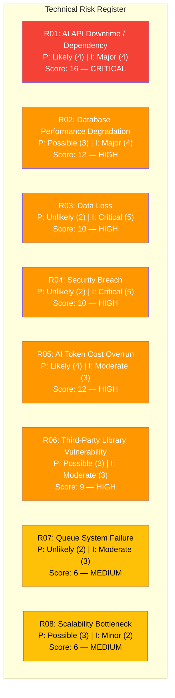
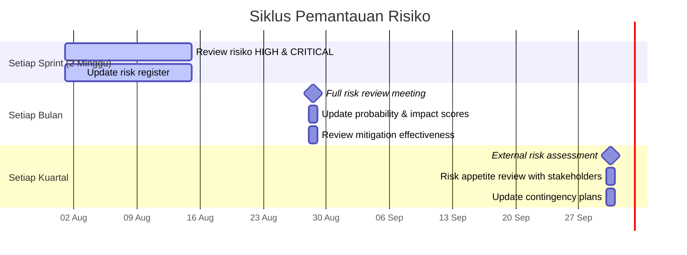

# 39 — Risk Analysis

## Ikhtisar

Analisis risiko RPS OBE mengidentifikasi, menilai, dan merencanakan mitigasi terhadap risiko teknis, bisnis, dan operasional yang dapat mengancam keberhasilan produk. Dokumen ini mendefinisikan matriks risiko 5x5 (probabilitas vs dampak), daftar risiko prioritas, strategi mitigasi untuk setiap risiko, rencana kontingensi untuk 5 risiko teratas, siklus pemantauan bulanan, serta register risiko yang diperbarui secara berkala.

---

## Risk Matrix

### Definisi Skala

#### Probabilitas (Probability)

| Level | Nilai | Deskripsi | Panduan Frekuensi |
|-------|-------|-----------|-------------------|
| **Rare** | 1 | Hampir tidak mungkin terjadi | < 5% dalam 1 tahun |
| **Unlikely** | 2 | Tidak mungkin, namun bisa terjadi | 5%–20% dalam 1 tahun |
| **Possible** | 3 | Mungkin terjadi sesekali | 20%–50% dalam 1 tahun |
| **Likely** | 4 | Kemungkinan besar terjadi | 50%–80% dalam 1 tahun |
| **Almost Certain** | 5 | Hampir pasti terjadi | > 80% dalam 1 tahun |

#### Dampak (Impact)

| Level | Nilai | Deskripsi | Panduan Dampak |
|-------|-------|-----------|----------------|
| **Negligible** | 1 | Dampak sangat kecil, tidak mempengaruhi pengguna | Delay minor < 1 hari |
| **Minor** | 2 | Dampak kecil, beberapa pengguna terdampak sementara | Delay < 3 hari; < 10% pengguna terdampak |
| **Moderate** | 3 | Dampak sedang, kebutuhan bisnis tertunda | Delay 1–2 minggu; 10%–30% pengguna terdampak |
| **Major** | 4 | Dampak signifikan, kehilangan kepercayaan | Delay 1 bulan; > 30% pengguna terdampak; potensi kehilangan 1 tenant |
| **Critical** | 5 | Dampak katastropik, bisnis terancam | Produk tidak dapat digunakan; reputasi rusak; kehilangan > 3 tenant |

### Matriks Risiko 5x5

```mermaid
graph TB
    subgraph "Risk Matrix 5x5"
        direction TB
        R1["5<br/>Almost<br/>Certain"] --- C1["🟡 Medium<br/>(5)"]
        R1 --- C2["🟠 High<br/>(10)"]
        R1 --- C3["🔴 Critical<br/>(15)"]
        R1 --- C4["🔴 Critical<br/>(20)"]
        R1 --- C5["🔴 Critical<br/>(25)"]

        R2["4<br/>Likely"] --- C6["🟢 Low<br/>(4)"]
        R2 --- C7["🟡 Medium<br/>(8)"]
        R2 --- C8["🟠 High<br/>(12)"]
        R2 --- C9["🔴 Critical<br/>(16)"]
        R2 --- C10["🔴 Critical<br/>(20)"]

        R3["3<br/>Possible"] --- C11["🟢 Low<br/>(3)"]
        R3 --- C12["🟡 Medium<br/>(6)"]
        R3 --- C13["🟠 High<br/>(9)"]
        R3 --- C14["🟠 High<br/>(12)"]
        R3 --- C15["🔴 Critical<br/>(15)"]

        R4["2<br/>Unlikely"] --- C16["🟢 Low<br/>(2)"]
        R4 --- C17["🟢 Low<br/>(4)"]
        R4 --- C18["🟡 Medium<br/>(6)"]
        R4 --- C19["🟡 Medium<br/>(8)"]
        R4 --- C20["🟠 High<br/>(10)"]

        R5["1<br/>Rare"] --- C21["🟢 Low<br/>(1)"]
        R5 --- C22["🟢 Low<br/>(2)"]
        R5 --- C23["🟢 Low<br/>(3)"]
        R5 --- C24["🟡 Medium<br/>(4)"]
        R5 --- C25["🟡 Medium<br/>(5)"]

        C1 -.-> D1["Negligible<br/>(1)"]
        C6 -.-> D1
        C11 -.-> D1
        C16 -.-> D1
        C21 -.-> D1
        C2 -.-> D2["Minor<br/>(2)"]
        C7 -.-> D2
        C12 -.-> D2
        C17 -.-> D2
        C22 -.-> D2
        C3 -.-> D3["Moderate<br/>(3)"]
        C8 -.-> D3
        C13 -.-> D3
        C18 -.-> D3
        C23 -.-> D3
        C4 -.-> D4["Major<br/>(4)"]
        C9 -.-> D4
        C14 -.-> D4
        C19 -.-> D4
        C24 -.-> D4
        C5 -.-> D5["Critical<br/>(5)"]
        C10 -.-> D5
        C15 -.-> D5
        C20 -.-> D5
        C25 -.-> D5
    end
```



### Level Risiko dan Tindakan

| Level | Skor | Tindakan | Eskalasi |
|-------|------|----------|----------|
| **Critical** | 15–25 | Tindakan segera dalam 24 jam; membutuhkan mitigasi signifikan atau penundaan fitur | PM → CTO / CEO |
| **High** | 8–12 | Rencana mitigasi dalam 1 minggu; dipantau setiap sprint | PM → Tech Lead |
| **Medium** | 4–6 | Rencana mitigasi dalam 1 bulan; dipantau setiap bulan | PM → Tim |
| **Low** | 1–3 | Monitor; tindakan hanya jika probabilitas atau dampak meningkat | Tim |

---

## Technical Risks

### Daftar Risiko Teknis



### R01: AI API Downtime / Dependency Risk

| Atribut | Deskripsi |
|---------|-----------|
| **Probabilitas** | 4 (Likely) — Semua penyedia AI (OpenAI, Azure, dll) memiliki riwayat downtime periodik; rate limiting dan API change adalah risiko nyata |
| **Dampak** | 4 (Major) — Fitur AI Assistant, Validator, dan Reviewer tidak berfungsi; pengguna kehilangan fitur diferensiasi utama; komplain meningkat |
| **Skor** | **16 — CRITICAL** |

#### Mitigasi

| Strategi | Implementasi |
|----------|-------------|
| **Graceful Degradation** | Semua fitur AI bersifat komplementer, bukan esensial; RPS tetap dapat disusun manual 100% tanpa AI |
| **Local Validation Rules** | Aturan validasi bisnis (taksonomi Bloom, bobot 100%, constructive alignment) diimplementasikan di server tanpa memanggil AI sebagai validasi dasar |
| **Multi-Provider Failover** | Dukung minimal 2 provider AI (OpenAI sebagai primer, Azure OpenAI atau Gemini sebagai sekunder) dengan auto-failover |
| **Response Caching** | Cache hasil AI dengan input yang identik selama 1-24 jam untuk mengurangi beban API |
| **Rate Limit Monitoring** | Alerting otomatis jika AI error rate > 5% atau response time > 5 detik |
| **Offline Queue** | Request AI yang gagal masuk ke retry queue dengan exponential backoff (3x retry, max 60 detik delay) |

#### Kontingensi

1. **AI Down 1–12 jam**: Aktifkan mode "AI Unavailable" — semua tombol AI diberi badge "Tidak tersedia sementara" dengan tooltip penjelasan; validasi manual tetap berfungsi
2. **AI Down > 12 jam**: Switch ke provider sekunder otomatis; notifikasi ke semua tenant admin via email
3. **AI Cost Spike**: Batasi request AI per tenant per jam ke 60% dari normal; tampilkan warning "Kuota AI terbatas" di UI

### R02: Database Performance Under Load

| Atribut | Deskripsi |
|---------|-----------|
| **Probabilitas** | 3 (Possible) — Pertumbuhan data RPS, audit log, dan concurrent user dapat menurunkan performa; complex queries dengan banyak JOIN berisiko |
| **Dampak** | 4 (Major) — Response time lambat; pengguna frustrasi; potensi data inconsistency pada high concurrency; review/approval terganggu |
| **Skor** | **12 — HIGH** |

#### Mitigasi

| Strategi | Implementasi |
|----------|-------------|
| **Query Optimization** | Semua query menggunakan index yang tepat; analisis EXPLAIN untuk query > 100ms; N+1 query detection via Laravel Debugbar/Telescope |
| **Caching Layer (Redis)** | Cache hasil query yang sering diakses: daftar CPL, daftar MK per prodi, hasil validasi RPS, menu navigasi; TTL 5–15 menit |
| **Read Replicas** | Siapkan 1–2 read replica untuk operasi baca berat (dashboard, list, report); aplikasi menggunakan Laravel read/write splitting |
| **Database Indexing Strategy** | Index pada: `rps.tenant_id`, `rps.prodi_id`, `rps.status`, `rps.dosen_id`, `cpmk.rps_id`, `sub_cpmk.cpmk_id`, `audit_logs.rps_id`, `audit_logs.created_at` |
| **Connection Pooling** | Gunakan pgBouncer (atau ProxySQL untuk MariaDB) untuk mengelola connection pool; max 150 koneksi |
| **Slow Query Monitoring** | Log semua query > 100ms; alert jika > 2% query slow dalam 10 menit |

### R03: Data Loss

| Atribut | Deskripsi |
|---------|-----------|
| **Probabilitas** | 2 (Unlikely) — Dengan backup strategy yang tepat, data loss tidak mungkin terjadi; tetapi risiko hardware failure, human error, atau disaster tetap ada |
| **Dampak** | 5 (Critical) — Kehilangan RPS yang telah disusun dosen; data akreditasi hilang; kehilangan kepercayaan tenant secara permanen |
| **Skor** | **10 — HIGH** |

#### Mitigasi

| Strategi | Implementasi |
|----------|-------------|
| **Backup Strategy** | Full backup harian (retensi 30 hari); incremental backup setiap 6 jam; WAL archiving setiap 5 menit; backup dienkripsi AES-256 |
| **Geographic Redundancy** | Backup disimpan di 2 lokasi: primary storage (on-premise / VPS) + cloud object storage (S3-compatible dengan Cross-Region Replication) |
| **Point-in-Time Recovery (PITR)** | WAL archiving memungkinkan recovery ke titik waktu spesifik (resolusi 5 menit) hingga 7 hari ke belakang |
| **Backup Verification** | Automated restore test setiap minggu ke staging environment; verifikasi integritas backup dengan checksum SHA-256 |
| **Soft Delete by Default** | Semua data dihapus secara lunak (soft delete); permanent delete hanya oleh superadmin dengan konfirmasi ganda |
| **Audit Trail** | Semua perubahan data tercatat di `audit_logs` untuk rekonstruksi manual jika backup gagal |

#### Kontingensi

1. **Partial Data Loss** (< 1 jam data hilang): Restore dari incremental backup terbaru; notifikasi ke tenant yang terdampak
2. **Major Data Loss** (> 1 jam): Restore dari full backup; PITR untuk meminimalkan gap; komunikasi transparan ke semua tenant
3. **Complete System Loss**: Disaster recovery plan — rebuild infrastructure dari IaC dalam < 4 jam; restore dari off-site backup

### R04: Security Breach

| Atribut | Deskripsi |
|---------|-----------|
| **Probabilitas** | 2 (Unlikely) — Dengan penerapan security best practices, breach tidak mungkin; tetapi zero-day vulnerability, social engineering, atau misconfiguration dapat terjadi |
| **Dampak** | 5 (Critical) — Data dosen dan mahasiswa bocor; RPS dapat dimanipulasi; kerugian reputasi; potensi tuntutan hukum (UU PDP); tenant keluar |
| **Skor** | **10 — HIGH** |

#### Mitigasi

| Strategi | Implementasi |
|----------|-------------|
| **Security Measures** | CSP headers, HTTPS only, CSRF protection, XSS sanitization, SQL injection prevention (Eloquent ORM), rate limiting, CORS policy, input validation |
| **Authentication Hardening** | Bcrypt password hashing; rate limiting login (5 attempts / 15 menit); session timeout 8 jam; force re-auth untuk aksi kritis |
| **Regular Security Audits** | Dependency scanning mingguan (Dependabot/Snyk); static analysis (PHPStan/Psalm level max); penetration testing setiap 6 bulan |
| **Principle of Least Privilege** | Setiap role hanya memiliki akses minimal yang diperlukan; superadmin terpisah dari operasional |
| **Tenant Isolation** | Data tenant dipisahkan secara logical (tenant_id di semua tabel); row-level security di database |
| **Incident Response Plan** | Tim respons insiden terdefinisi (CTO, DevOps Lead, PM); playbook untuk setiap jenis insiden; kontak darurat tenant |
| **Secrets Management** | Semua secrets (API key, DB password) disimpan di environment variables; tidak pernah di-commit ke repository |

#### Kontingensi

1. **Breach Terdeteksi**: Isolasi server terdampak dalam 15 menit; force reset semua password dan token; notifikasi ke tenant dalam 24 jam; notifikasi ke regulator (jika diwajibkan UU PDP) dalam 72 jam
2. **PII Bocor**: Aktivasi tim krisis; komunikasi dengan tenant terdampak; investigasi forensik; perbaikan celah keamanan; audit menyeluruh sebelum sistem online kembali

### R05: AI Token Cost Overrun

| Atribut | Deskripsi |
|---------|-----------|
| **Probabilitas** | 4 (Likely) — Penggunaan AI yang tidak terkontrol, prompt yang tidak efisien, atau serangan abuse dapat meningkatkan biaya token secara signifikan |
| **Dampak** | 3 (Moderate) — Biaya operasional membengkak; margin keuntungan menurun; potensi penghentian sementara fitur AI |
| **Skor** | **12 — HIGH** |

#### Mitigasi

| Strategi | Implementasi |
|----------|-------------|
| **Per-Tenant Budget** | Setiap tenant memiliki budget token bulanan sesuai paket; hard limit dengan notifikasi ke admin tenant saat 80% dan 95% |
| **Per-User Rate Limit** | Maksimal 20 request AI per user per jam; 100 request per user per hari |
| **Token-Optimized Prompts** | Prompt yang ringkas dan efisien; gunakan model yang tepat (GPT-4o-mini untuk tugas sederhana; GPT-4o hanya untuk review kompleks) |
| **Response Caching** | Cache hasil AI dengan input identik selama 1 jam (generate) atau 30 menit (validate) |
| **Cost Dashboard** | Dashboard real-time untuk admin yang menampilkan biaya AI per tenant, per user, per hari |
| **Hard Shutoff** | Jika biaya melebihi 150% budget bulanan, fitur AI otomatis dinonaktifkan untuk tenant tersebut hingga periode berikutnya |

### R06: Third-Party Library Vulnerability

| Atribut | Deskripsi |
|---------|-----------|
| **Probabilitas** | 3 (Possible) — Paket Composer dan NPM memiliki siklus rilis cepat; vulnerability baru ditemukan secara reguler |
| **Dampak** | 3 (Moderate) — Potensi eksploitasi keamanan; aplikasi tidak dapat di-update karena dependency conflict |
| **Skor** | **9 — HIGH** |

#### Mitigasi

| Strategi | Implementasi |
|----------|-------------|
| **Automated Dependency Scanning** | GitHub Dependabot / Snyk untuk scanning mingguan semua dependency |
| **Regular Updates** | Sprintly maintenance: update minor/patch dependencies setiap sprint; major update setiap 3 bulan |
| **Lock File** | `composer.lock` dan `package-lock.json` committed ke repository untuk reproducible builds |
| **Dependency Review** | Setiap PR dengan dependency baru wajib direview; minimal 2 approval |
| **SBOM** | Software Bill of Materials dihasilkan otomatis setiap rilis |

---

## Business Risks

### Daftar Risiko Bisnis

| ID | Risiko | P | I | Score | Level |
|----|-----------|---|---|-------|-------|
| B01 | Low User Adoption | 3 (Possible) | 4 (Major) | 12 | HIGH |
| B02 | Competitor Entry | 3 (Possible) | 3 (Moderate) | 9 | HIGH |
| B03 | Churn Rate > Target | 3 (Possible) | 4 (Major) | 12 | HIGH |
| B04 | Regulatory / Policy Changes | 2 (Unlikely) | 3 (Moderate) | 6 | MEDIUM |
| B05 | Revenue Below Target | 3 (Possible) | 3 (Moderate) | 9 | HIGH |
| B06 | Negative Word of Mouth | 2 (Unlikely) | 4 (Major) | 8 | HIGH |

### B01: Low User Adoption

| Atribut | Deskripsi |
|---------|-----------|
| **Probabilitas** | 3 (Possible) — Dosen mungkin resisten terhadap perubahan; platform baru membutuhkan kurva pembelajaran |
| **Dampak** | 4 (Major) — Rendahnya jumlah RPS yang dibuat; tenant tidak melihat nilai produk; tidak memperpanjang langganan |
| **Skor** | **12 — HIGH** |

#### Mitigasi

| Strategi | Implementasi |
|----------|-------------|
| **UX Focus** | Wizard 8-step dengan antarmuka sederhana; AI Assistant mengurangi beban penyusunan; auto-save mencegah kehilangan data |
| **Onboarding Support** | Video tutorial Bahasa Indonesia; panduan interaktif in-app (product tour); template RPS siap pakai |
| **Training Program** | Sesi pelatihan daring untuk setiap tenant baru (2 sesi); user manual PDF; FAQ dan knowledge base |
| **Feedback Loop** | Tombol feedback di setiap halaman; survei setelah RPS pertama selesai; NPS tracking |
| **Champion Program** | Identifikasi "power user" di setiap tenant; berikan akses early fitur; jadikan advocate internal |
| **Incentive** | Free trial Professional selama onboarding (30 hari); badge "RPS Champion" untuk dosen yang menyelesaikan 5+ RPS |

### B03: Churn Rate > Target

| Atribut | Deskripsi |
|---------|-----------|
| **Probabilitas** | 3 (Possible) — Tanpa engagement yang konsisten, tenant dapat berhenti menggunakan platform setelah kebutuhan awal terpenuhi |
| **Dampak** | 4 (Major) — Kehilangan pendapatan berulang; reputasi buruk di pasar pendidikan tinggi |
| **Skor** | **12 — HIGH** |

#### Mitigasi

| Strategi | Implementasi |
|----------|-------------|
| **Customer Success Program** | CS Manager dedicated untuk setiap tenant; health score tracking; check-in bulanan untuk 3 bulan pertama, lalu kuartalan |
| **Continuous Improvement** | Rilis fitur baru setiap 2 minggu (sprint); roadmap transparan; feedback board publik untuk voting fitur |
| **Proactive Outreach** | Alert otomatis saat aktivitas tenant menurun (30 hari tanpa RPS baru); CS menjangkau untuk menawarkan bantuan |
| **Lock-in via Value** | Semakin banyak RPS yang dibuat, semakin besar biaya switching (data, template, workflow sudah terintegrasi) |
| **Annual Contract Incentive** | Diskon 15% untuk kontrak tahunan; priority support untuk annual subscribers |
| **Exit Interview** | Wawancara (opsional) dengan tenant yang churn untuk memahami alasan; data digunakan untuk perbaikan |

---

## Operational Risks

| ID | Risiko | P | I | Score | Level |
|----|-----------|---|---|-------|-------|
| O01 | Team Turnover | 3 (Possible) | 3 (Moderate) | 9 | HIGH |
| O02 | Infrastructure Cost Overrun | 2 (Unlikely) | 2 (Minor) | 4 | MEDIUM |
| O03 | Scope Creep | 4 (Likely) | 3 (Moderate) | 12 | HIGH |
| O04 | Timeline Delay | 3 (Possible) | 3 (Moderate) | 9 | HIGH |
| O05 | Vendor Lock-in (Infrastructure) | 2 (Unlikely) | 2 (Minor) | 4 | MEDIUM |

### O03: Scope Creep

| Atribut | Deskripsi |
|---------|-----------|
| **Probabilitas** | 4 (Likely) — Sangat umum terjadi; stakeholder menambah fitur; feedback pengguna memicu "feature creep" |
| **Dampak** | 3 (Moderate) — Timeline mundur; tim kelelahan; MVP tidak fokus; biaya membengkak |
| **Skor** | **12 — HIGH** |

#### Mitigasi

| Strategi | Implementasi |
|----------|-------------|
| **Strict MVP Scope** | Dokumen MVP definitif (lihat 41-mvp-definition.md); semua fitur di luar MVP masuk backlog Phase 2+ |
| **Change Management Process** | Setiap permintaan perubahan scope melalui change request form → triage meeting (PM + Tech Lead) → go/no-go decision |
| **MoSCoW Prioritization** | Setiap fitur diklasifikasikan: Must Have (MVP), Should Have (Phase 2), Could Have (Phase 3), Won't Have (Backlog) |
| **Stakeholder Alignment** | Sprint review setiap 2 minggu; demo ke stakeholder; transparan tentang progress vs rencana |
| **Buffer Sprint** | Setiap 4 sprint, ada 1 buffer sprint untuk tech debt, bug fixing, dan minor enhancements |
| **"No" Framework** | Tim memiliki panduan kapan mengatakan "tidak" pada permintaan fitur baru (framework: Impact vs Effort matrix) |

---

## Risk Monitoring & Review Cycle

### Siklus Pemantauan Bulanan



### Risk Review Meeting Agenda

| Agenda Item | Durasi | Partisipan |
|-------------|--------|------------|
| Review risiko yang materialized | 10 menit | PM, Tech Lead |
| Update skor probabilitas & dampak | 15 menit | Semua |
| Efektivitas mitigasi yang berjalan | 10 menit | Tech Lead |
| Risiko baru (dari sprint terakhir) | 10 menit | Semua |
| Update contingency plan | 10 menit | PM, CTO |
| Action items & owner | 5 menit | PM |

### Risk Register Template

| Field | Deskripsi |
|-------|-----------|
| ID | Kode unik risiko (R01, B01, O01, dll.) |
| Kategori | Technical / Business / Operational |
| Risiko | Deskripsi singkat risiko |
| Probabilitas (1–5) | Skor probabilitas |
| Dampak (1–5) | Skor dampak |
| Skor (P x I) | Perkalian skor |
| Level | Low / Medium / High / Critical |
| Trigger | Indikator bahwa risiko akan atau telah terjadi |
| Mitigasi | Strategi pencegahan |
| Kontingensi | Rencana jika risiko terjadi |
| Owner | Penanggung jawab risiko |
| Status | Active / Monitoring / Closed |
| Last Review | Tanggal review terakhir |
| Trend | Meningkat / Stabil / Menurun |

---

## Contingency Plans — Top 5 Risks

### 1. AI API Downtime / Dependency (R01)

```
ESCALATION PATH:
├── T+0 menit: Monitoring mendeteksi AI error rate > 5%
├── T+5 menit: Alert ke Slack #rps-obe-alerts (P2)
├── T+10 menit: DevOps verifikasi — apakah provider down atau konfigurasi?
├── T+15 menit:
│   ├── Jika provider down → Auto-switch ke provider sekunder (Azure/Gemini)
│   ├── Jika provider up tapi error → Aktifkan mode "Degraded AI" (retry + caching agresif)
│   └── Jika budget exhausted → Notifikasi tenant admin + batasi request
├── T+30 menit: Update status page (status.obe.university.ac.id)
├── T+1 jam: Jika belum pulih → Aktifkan mode "AI Unavailable" (manual-only)
├── T+4 jam: Jika provider masih down → Komunikasi email ke semua tenant admin
└── T+24 jam: Post-mortem & update contingency plan
```

### 2. Database Performance Degradation (R02)

```
ESCALATION PATH:
├── T+0 menit: Alert: response time p95 > 1000ms atau error rate > 5%
├── T+5 menit: DevOps cek dashboard — identifikasi bottleneck (CPU, disk I/O, locks)
├── T+15 menit:
│   ├── Jika query lambat → Analisis slow query log; kill long-running queries
│   ├── Jika connection pool penuh → Tambah max connections; restart idle connections
│   ├── Jika disk I/O bottleneck → Scale up instance (vertical) atau tambah read replica
├── T+30 menit: Update status page jika terdampak pengguna
├── T+1 jam: Jika belum pulih → Aktifkan aggressive caching (Redis TTL diperpanjang)
├── T+4 jam: Jika masih bermasalah → Maintenance window notification
├── T+24 jam: Root cause analysis; update indexing/caching strategy
└── T+1 minggu: Implement permanent fix (query optimization, schema change, scaling)
```

### 3. Data Loss (R03)

```
ESCALATION PATH:
├── T+0 menit: Laporan atau deteksi data inconsistency / corruption
├── T+5 menit: DevOps Lead verifikasi — cek audit log dan backup terbaru
├── T+15 menit:
│   ├── Jika partial loss → Identifikasi data yang hilang; restore dari backup terbaru
│   ├── Jika database corruption → Failover ke replica (jika tersedia)
│   └── Jika accidental deletion → Restore dari soft-delete records / audit log
├── T+30 menit: Update status page: "Under Investigation" → "Partial Outage"
├── T+1 jam: Mulai proses restore dari backup terverifikasi
├── T+2 jam: Verifikasi integritas data setelah restore
├── T+4 jam: Notifikasi tenant terdampak; estimasi recovery time
├── T+24 jam: Full post-mortem; review backup strategy; perbaikan prosedur
└── T+1 minggu: Implement additional safeguards (trigger-based backup, real-time replication)
```

### 4. Security Breach (R04)

```
ESCALATION PATH:
├── T+0 menit: Deteksi atau laporan insiden keamanan
├── T+5 menit: CTO + DevOps Lead + PM — emergency meeting
├── T+15 menit:
│   ├── Isolasi server/container terdampak
│   ├── Revoke semua API key dan token yang potensial terdampak
│   ├── Force logout semua pengguna
│   └── Simpan snapshot forensik untuk investigasi
├── T+30 menit: Aktifkan mode "Maintenance" — hanya tim internal bisa akses
├── T+1 jam: Identifikasi scope breach (data apa yang diakses/dicuri)
├── T+2 jam: Patch vulnerability yang dieksploitasi
├── T+4 jam: Rotate semua credentials (database, API, SSH keys)
├── T+12 jam: Notifikasi tenant yang terdampak (transparan, faktual)
├── T+24 jam: Laporan awal ke regulator jika PII terdampak
├── T+72 jam: Full laporan ke regulator (UU PDP)
├── T+1 minggu: External security audit; implement rekomendasi
└── T+1 bulan: Review dan perbarui semua security policies
```

### 5. Scope Creep (O03)

```
📋 CHANGE REQUEST FORM:
├── Nama Pemohon: _______
├── Tanggal Permohonan: _______
├── Deskripsi Perubahan: _______
├── Alasan / Justifikasi: _______
├── Dampak pada MVP Timeline: (+___ minggu)
├── Dampak pada Resource: (+___ orang-minggu)
├── Nilai Bisnis: (1=Low, 5=Critical)
├── Urgensi: (1=Sprint ini, 2=Sprint depan, 3=Phase 2, 4=Phase 3, 5=Backlog)

TRIAGE MEETING (PM + Tech Lead):
├── Review: Apakah ini benar-benar dibutuhkan untuk MVP?
│   ├── YA → Klasifikasikan dampak
│   │   ├── Minor (< 1 minggu delay) → Masukkan backlog sprint
│   │   ├── Medium (1-2 minggu) → Trade-off: fitur MVP mana yang ditunda?
│   │   └── Major (> 2 minggu) → Eskalasi ke stakeholder; renegosiasi scope/timeline
│   └── TIDAK → Masukkan ke backlog Phase 2/3; komunikasikan ke pemohon

COMMUNICATION:
├── Hasil triage diinformasikan ke pemohon dalam 24 jam
├── Jika scope berubah → Update PRD, sprint plan, dan komunikasi tim
└── Stakeholder update di sprint review berikutnya
```

---

**Navigasi:** [Sebelumnya: Accessibility](38-accessibility.md) | [Daftar Isi](../README.md) | [Berikutnya: Future Roadmap](40-future-roadmap.md)
