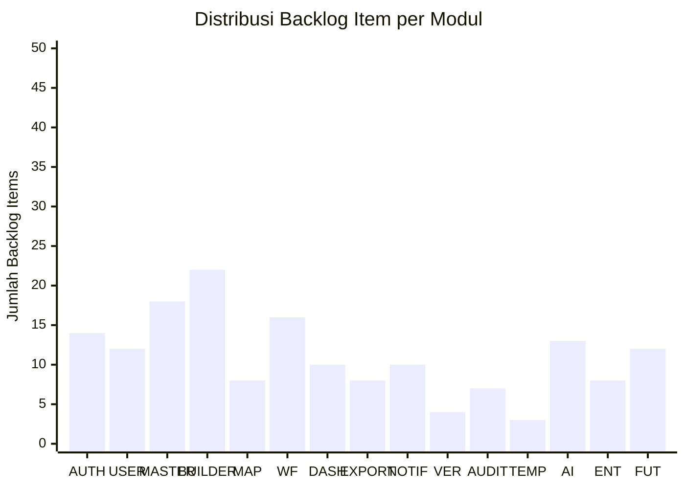

# 42 — Product Backlog

## Ikhtisar

Product Backlog RPS OBE merupakan satu-satunya sumber kebenaran (single source of truth) untuk seluruh kebutuhan fungsional dan non-fungsional yang akan dikembangkan dalam siklus hidup produk. Backlog ini disusun berdasarkan Feature Breakdown (Bab 17), MVP Definition (Bab 41), dan Future Roadmap (Bab 40). Setiap item backlog merepresentasikan satu user story yang dapat dikerjakan dalam satu sprint.

---

## Struktur Backlog

Backlog dikategorikan berdasarkan:

| Dimensi | Keterangan |
|---------|------------|
| **Fase** | MVP (Fase 1), Fase 2, Fase 3, Future (Fase 4-5) |
| **Epic** | Kelompok fitur berdasarkan modul (AUTH, USER, MASTER, BUILDER, MAP, AI, WF, DASH, REPORT, NOTIF, VER, AUDIT, TEMP, EXPORT) |
| **Prioritas (MoSCoW)** | Must Have, Should Have, Could Have, Won't Have (this phase) |
| **Story Points** | Estimasi relatif menggunakan Planning Poker (1, 2, 3, 5, 8, 13, 21) |
| **Status** | Backlog, Ready for Sprint, In Progress, Done |

---

## Product Backlog

### Fase 1 — MVP (Sprint 0–6)

#### Epic AUTH — Authentication & Authorization

| Backlog ID | Epic | User Story | Acceptance Criteria Summary | Priority | SP | Status |
|------------|------|------------|----------------------------|----------|-----|--------|
| AUTH-001 | AUTH-1 | Sebagai pengguna, saya ingin login dengan email dan password agar dapat mengakses sistem. | Email valid + password benar → redirect dashboard; rate limit 5 percobaan/15 menit; session timeout 8 jam. | Must Have | 3 | Backlog |
| AUTH-002 | AUTH-1 | Sebagai pengguna, saya ingin melihat pesan error yang jelas saat login gagal agar tahu apa yang salah. | Email tidak ditemukan → pesan spesifik; password salah → pesan spesifik; akun nonaktif → pesan spesifik. | Must Have | 2 | Backlog |
| AUTH-003 | AUTH-1 | Sebagai pengguna, saya ingin fitur "Remember Me" agar tidak perlu login ulang setiap saat. | Checkbox "Ingat Saya" → session extended 30 hari; clear session on logout. | Must Have | 1 | Backlog |
| AUTH-004 | AUTH-2 | Sebagai Admin Tenant, saya ingin mengundang dosen/kaprodi melalui email invitation agar mereka dapat mengakses sistem. | Input email + pilih role → kirim invitation link; link expired 7 hari; satu kali pakai; status terlacak. | Must Have | 5 | Backlog |
| AUTH-005 | AUTH-2 | Sebagai Dosen undangan, saya ingin registrasi melalui invitation link agar dapat mengakses sistem. | Klik link invitation → form register (nama, password, konfirmasi password); validasi password min 8 karakter + huruf & angka. | Must Have | 3 | Backlog |
| AUTH-006 | AUTH-2 | Sebagai pengguna undangan, saya ingin mendapat pesan error jika invitation link sudah kadaluarsa. | Link expired → halaman informasi "Link tidak valid/kadaluarsa"; tombol "Minta Undangan Baru". | Must Have | 1 | Backlog |
| AUTH-007 | AUTH-2 | Sebagai Admin Tenant, saya ingin melihat status invitation (pending/accepted/expired) agar tahu siapa yang belum mendaftar. | Tabel invitation list dengan kolom status; filter by status; resend invitation button. | Must Have | 3 | Backlog |
| AUTH-008 | AUTH-3 | Sebagai pengguna, saya ingin mereset password jika lupa melalui fitur "Lupa Password". | Input email → kirim link reset; token expired 60 menit; form password baru + konfirmasi. | Must Have | 3 | Backlog |
| AUTH-009 | AUTH-3 | Sebagai pengguna, saya ingin mendapat notifikasi email saat reset password berhasil. | Email konfirmasi setelah password berhasil diubah; berisi informasi waktu perubahan. | Must Have | 1 | Backlog |
| AUTH-010 | AUTH-4 | Sebagai pengguna baru, saya ingin verifikasi email saya melalui link yang dikirimkan agar akun saya aktif. | Link verifikasi di email registrasi; setelah verifikasi → akun aktif; redirect ke login. | Must Have | 2 | Backlog |
| AUTH-011 | AUTH-5 | Sebagai Superadmin, saya ingin mengelola role dan permission pengguna agar kontrol akses sesuai hierarki. | CRUD role assignment; 4 role default (Superadmin, Admin Tenant, Kaprodi, Dosen); permission berbasis Spatie. | Must Have | 8 | Backlog |
| AUTH-012 | AUTH-5 | Sebagai Admin Tenant, saya ingin assign role ke pengguna dalam tenant saya agar akses sesuai tanggung jawab. | Dropdown role saat invitation/create user; role dapat diubah oleh Admin Tenant; audit log perubahan role. | Must Have | 3 | Backlog |
| AUTH-013 | AUTH-6 | Sebagai sistem, saya ingin mengelola session pengguna agar keamanan terjaga. | Session timeout 8 jam; auto-logout setelah timeout; single session per device; invalidate on password change. | Must Have | 3 | Backlog |
| AUTH-014 | AUTH-6 | Sebagai pengguna, saya ingin melihat daftar sesi aktif saya dan dapat logout dari sesi lain. | Daftar sesi: device, IP, waktu login terakhir; tombol "Logout Semua Sesi". | Should Have | 2 | Backlog |

#### Epic USER — User Management

| Backlog ID | Epic | User Story | Acceptance Criteria Summary | Priority | SP | Status |
|------------|------|------------|----------------------------|----------|-----|--------|
| USER-001 | USER-1 | Sebagai Admin Tenant, saya ingin melihat daftar seluruh pengguna dalam tenant saya agar dapat mengelola pengguna. | Tabel dengan kolom: nama, email, role, status, tanggal registrasi; pagination; search by nama/email. | Must Have | 5 | Backlog |
| USER-002 | USER-1 | Sebagai Admin Tenant, saya ingin mencari pengguna berdasarkan nama, email, atau role. | Search field real-time; filter dropdown role; filter status (aktif/nonaktif). | Must Have | 2 | Backlog |
| USER-003 | USER-2 | Sebagai Admin Tenant, saya ingin menambahkan pengguna baru secara manual. | Form: nama, email, role, prodi; validasi email unik per tenant; password auto-generated & dikirim via email. | Must Have | 3 | Backlog |
| USER-004 | USER-3 | Sebagai Admin Tenant, saya ingin mengedit data pengguna (nama, role, prodi). | Form edit pre-filled; role change hanya jika bukan satu-satunya admin tenant; audit log perubahan. | Must Have | 3 | Backlog |
| USER-005 | USER-4 | Sebagai Admin Tenant, saya ingin menonaktifkan akun pengguna tanpa menghapus datanya. | Tombol deactivate dengan konfirmasi; user nonaktif tidak bisa login; RPS yang dibuat tetap ada. | Must Have | 2 | Backlog |
| USER-006 | USER-4 | Sebagai Admin Tenant, saya ingin mengaktifkan kembali akun yang dinonaktifkan. | Tombol activate; user dapat login kembali dengan data yang sama. | Must Have | 1 | Backlog |
| USER-007 | USER-5 | Sebagai sistem, saya ingin mengirim email invitation dengan format profesional. | Email berisi: nama pengundang, nama tenant, link invitation, instruksi, masa berlaku. | Must Have | 3 | Backlog |
| USER-008 | USER-5 | Sebagai Admin, saya ingin dapat mengirim ulang (resend) invitation ke user yang belum menerima. | Tombol resend di list invitation; reset expiration timer; batas maksimal 3x resend. | Must Have | 2 | Backlog |
| USER-009 | USER-5 | Sebagai sistem, saya ingin invitation link hanya dapat digunakan satu kali. | Link dipakai → status accepted; link kadaluarsa otomatis (7 hari); error jika digunakan lagi. | Must Have | 2 | Backlog |
| USER-010 | USER-6 | Sebagai pengguna, saya ingin mengedit profil saya sendiri (nama, email, foto profil). | Form edit profil; validasi email unik; upload foto profil (opsional, max 2MB, format jpg/png). | Must Have | 3 | Backlog |
| USER-011 | USER-6 | Sebagai pengguna, saya ingin mengganti password saya (harus tahu password lama). | Form: password lama, password baru, konfirmasi; validasi min 8 karakter + kombinasi huruf & angka. | Must Have | 2 | Backlog |
| USER-012 | USER-6 | Sebagai pengguna, saya ingin melihat profil lengkap pengguna lain (read-only). | Halaman profil: nama, email, role, prodi, foto, jumlah RPS. | Should Have | 1 | Backlog |
| USER-013 | USER-7 | Sebagai Admin Tenant, saya ingin mengimpor data pengguna dari file CSV. | Upload CSV; mapping kolom; validasi data; preview sebelum import; error report untuk baris gagal. | Should Have | 5 | Backlog |
| USER-014 | USER-7 | Sebagai sistem, saya ingin memvalidasi format CSV dan menampilkan error spesifik per baris. | Validasi: email format, role valid, kolom wajib; error report downloadable. | Should Have | 3 | Backlog |
| USER-015 | USER-8 | Sebagai Admin Tenant, saya ingin melihat log aktivitas pengguna. | Tabel log: user, action, timestamp, IP address; filter by user, date range, action type. | Should Have | 5 | Backlog |

#### Epic MASTER — Master Data

| Backlog ID | Epic | User Story | Acceptance Criteria Summary | Priority | SP | Status |
|------------|------|------------|----------------------------|----------|-----|--------|
| MASTER-001 | MASTER-1 | Sebagai Superadmin, saya ingin membuat data universitas baru (tenant onboarding). | Form: nama, kode, alamat, website, logo; kode unik; setelah create → auto-setup tenant. | Must Have | 5 | Backlog |
| MASTER-002 | MASTER-1 | Sebagai Admin Tenant, saya ingin mengedit data universitas saya. | Form edit pre-filled; hanya Admin Tenant yang dapat mengedit; perubahan logo max 2MB. | Must Have | 3 | Backlog |
| MASTER-003 | MASTER-1 | Sebagai Admin Tenant, saya ingin melihat detail universitas saya. | Halaman detail: semua field + jumlah fakultas, prodi, pengguna. | Must Have | 1 | Backlog |
| MASTER-004 | MASTER-2 | Sebagai Admin Tenant, saya ingin membuat data fakultas baru. | Form: nama, kode, universitas_id (auto); kode unik dalam universitas. | Must Have | 3 | Backlog |
| MASTER-005 | MASTER-2 | Sebagai Admin Tenant, saya ingin mengedit dan menghapus data fakultas. | Edit form; hapus hanya jika tidak ada prodi terkait; soft delete. | Must Have | 3 | Backlog |
| MASTER-006 | MASTER-2 | Sebagai Admin Tenant, saya ingin melihat daftar fakultas dengan filter dan pencarian. | Tabel: nama, kode, jumlah prodi; search; pagination. | Must Have | 1 | Backlog |
| MASTER-007 | MASTER-3 | Sebagai Admin Tenant, saya ingin membuat data program studi baru. | Form: nama, kode, jenjang (dropdown: D3/D4/S1/S2/S3), fakultas_id (select), akreditasi. | Must Have | 3 | Backlog |
| MASTER-008 | MASTER-3 | Sebagai Admin Tenant, saya ingin mengedit dan menghapus data program studi. | Edit form pre-filled; hapus hanya jika tidak ada kurikulum/MK terkait. | Must Have | 3 | Backlog |
| MASTER-009 | MASTER-3 | Sebagai Admin Tenant, saya ingin melihat daftar prodi dengan filter fakultas dan jenjang. | Tabel; filter fakultas, jenjang; search; jumlah kurikulum aktif. | Must Have | 1 | Backlog |
| MASTER-010 | MASTER-4 | Sebagai Kaprodi, saya ingin membuat kurikulum baru untuk prodi saya. | Form: nama, tahun_mulai, prodi_id (auto), status (aktif/nonaktif); hanya satu kurikulum aktif per prodi. | Must Have | 5 | Backlog |
| MASTER-011 | MASTER-4 | Sebagai Kaprodi, saya ingin mengedit kurikulum (nama, tahun, status). | Edit form; nonaktifkan kurikulum lama tidak menghapus data; set aktif → otomatis nonaktifkan yg lain. | Must Have | 3 | Backlog |
| MASTER-012 | MASTER-4 | Sebagai Kaprodi, saya ingin melihat daftar kurikulum prodi saya. | Tabel: nama, tahun, status, jumlah MK; filter status; indikator kurikulum aktif. | Must Have | 2 | Backlog |
| MASTER-013 | MASTER-4 | Sebagai Kaprodi, saya ingin dapat memiliki multi-kurikulum dalam satu prodi. | Satu prodi bisa punya banyak kurikulum; hanya satu aktif; kurikulum lama tetap bisa diakses (read-only). | Must Have | 3 | Backlog |
| MASTER-014 | MASTER-5 | Sebagai Kaprodi, saya ingin membuat data semester dalam kurikulum. | Form: nama (Ganjil/Genap/Periode), tahun_akademik (contoh: 2026/2027), kurikulum_id (select). | Must Have | 2 | Backlog |
| MASTER-015 | MASTER-5 | Sebagai Kaprodi, saya ingin mengedit dan menghapus data semester. | Edit form; hapus hanya jika tidak ada MK terkait. | Must Have | 1 | Backlog |
| MASTER-016 | MASTER-5 | Sebagai Kaprodi, saya ingin melihat daftar semester dalam kurikulum. | Tabel per kurikulum: nama, tahun akademik, jumlah MK; urut berdasarkan tahun. | Must Have | 1 | Backlog |
| MASTER-017 | MASTER-6 | Sebagai Kaprodi, saya ingin membuat data mata kuliah baru. | Form: kode_mk, nama_mk, sks_teori, sks_praktikum, semester_ke, jenis (wajib/pilihan), prodi_id, kurikulum_id. | Must Have | 5 | Backlog |
| MASTER-018 | MASTER-6 | Sebagai Kaprodi, saya ingin mengedit data mata kuliah. | Edit form pre-filled; kode MK dapat diubah dengan konfirmasi. | Must Have | 3 | Backlog |
| MASTER-019 | MASTER-6 | Sebagai Kaprodi, saya ingin melihat daftar mata kuliah dengan filter. | Tabel: kode, nama, SKS, semester, jenis, status RPS; filter prodi, kurikulum, semester, jenis. | Must Have | 2 | Backlog |
| MASTER-020 | MASTER-6 | Sebagai Kaprodi, saya ingin mencari mata kuliah berdasarkan kode atau nama. | Search field dengan auto-complete; hasil real-time. | Must Have | 1 | Backlog |
| MASTER-021 | MASTER-6 | Sebagai sistem, saya ingin memvalidasi kode mata kuliah unik dalam satu prodi. | Validasi server-side; pesan error "Kode MK sudah digunakan" saat duplikat. | Must Have | 1 | Backlog |
| MASTER-022 | MASTER-7 | Sebagai Admin Tenant, saya ingin membuat data dosen baru. | Form: nidn, nama, email, gelar_depan, gelar_belakang, prodi_id (select); NIDN unik nasional. | Must Have | 3 | Backlog |
| MASTER-023 | MASTER-7 | Sebagai Admin Tenant, saya ingin mengedit dan menonaktifkan data dosen. | Edit form; nonaktifkan bukan hapus; dosen nonaktif tidak muncul di pilihan pengampu. | Must Have | 2 | Backlog |
| MASTER-024 | MASTER-7 | Sebagai Admin Tenant, saya ingin melihat daftar dosen dengan filter prodi. | Tabel: NIDN, nama, prodi, email, status; filter prodi; search. | Must Have | 1 | Backlog |
| MASTER-025 | MASTER-8 | Sebagai Kaprodi, saya ingin membuat data profil lulusan untuk prodi saya. | Form: nama, deskripsi, prodi_id (auto). | Must Have | 3 | Backlog |
| MASTER-026 | MASTER-8 | Sebagai Kaprodi, saya ingin mengedit dan menghapus profil lulusan. | Edit form pre-filled; hapus hanya jika tidak terkait CPL. | Must Have | 2 | Backlog |
| MASTER-027 | MASTER-8 | Sebagai Kaprodi, saya ingin melihat daftar profil lulusan prodi saya. | Tabel: nama, deskripsi, jumlah CPL terkait. | Must Have | 1 | Backlog |
| MASTER-028 | MASTER-9 | Sebagai Kaprodi, saya ingin membuat data CPL (Capaian Pembelajaran Lulusan). | Form: kode (auto-format: CPL-{S/P/KU/KK}-{no}), deskripsi, kategori (dropdown Sikap/Pengetahuan/Ket.Umum/Ket.Khusus), prodi_id. | Must Have | 5 | Backlog |
| MASTER-029 | MASTER-9 | Sebagai Kaprodi, saya ingin mengedit data CPL. | Edit form pre-filled; kode CPL tidak dapat diubah jika sudah digunakan di RPS. | Must Have | 3 | Backlog |
| MASTER-030 | MASTER-9 | Sebagai Kaprodi, saya ingin melihat daftar CPL dengan filter kategori. | Tabel: kode, deskripsi, kategori, jumlah CPMK terkait; filter kategori. | Must Have | 2 | Backlog |
| MASTER-031 | MASTER-9 | Sebagai Kaprodi, saya ingin mengaitkan CPL dengan profil lulusan. | Multi-select profil lulusan di form CPL; mapping many-to-many. | Should Have | 3 | Backlog |
| MASTER-032 | MASTER-9 | Sebagai Kaprodi, saya ingin menghapus CPL yang belum digunakan. | Tombol hapus dengan konfirmasi; CPL yang sudah digunakan di RPS tidak dapat dihapus. | Must Have | 1 | Backlog |
| MASTER-033 | MASTER-10 | Sebagai Kaprodi, saya ingin membuat data referensi pustaka yang dapat digunakan ulang. | Form: judul, penulis, tahun, penerbit, jenis (Buku/Jurnal/Website), URL (opsional), edisi (opsional). | Should Have | 3 | Backlog |
| MASTER-034 | MASTER-10 | Sebagai Dosen, saya ingin mencari referensi pustaka yang sudah ada saat menyusun RPS. | Search + select referensi dari database master; auto-complete. | Should Have | 2 | Backlog |
| MASTER-035 | MASTER-11 | Sebagai Admin Tenant, saya ingin mengimpor data mata kuliah, dosen, dan CPL dari file CSV. | Upload CSV; mapping kolom; preview; validasi; error report. | Should Have | 5 | Backlog |
| MASTER-036 | MASTER-11 | Sebagai Admin Tenant, saya ingin mengunduh template CSV untuk import data. | Tombol download template; template berisi header kolom + contoh data. | Should Have | 1 | Backlog |

#### Epic BUILDER — RPS Builder

| Backlog ID | Epic | User Story | Acceptance Criteria Summary | Priority | SP | Status |
|------------|------|------------|----------------------------|----------|-----|--------|
| BUILDER-001 | BUILDER-1 | Sebagai Dosen, saya ingin memulai pembuatan RPS baru melalui wizard 8 langkah. | Tombol "Buat RPS Baru" → pilih MK + semester → masuk wizard; progress bar 8 langkah. | Must Have | 5 | Backlog |
| BUILDER-002 | BUILDER-1 | Sebagai Dosen, saya ingin navigasi antar step wizard tanpa kehilangan data. | Sidebar step indicator; tombol "Sebelumnya" dan "Selanjutnya"; klik step untuk lompat (jika step sebelumnya valid). | Must Have | 3 | Backlog |
| BUILDER-003 | BUILDER-1 | Sebagai Dosen, saya ingin melihat progress penyelesaian RPS dalam persentase. | Progress bar di atas wizard; checklist per step yang sudah lengkap; persentase real-time. | Must Have | 2 | Backlog |
| BUILDER-004 | BUILDER-1 | Sebagai Dosen, saya ingin RPS yang belum selesai disimpan sebagai Draft. | Status "Draft" otomatis saat pertama kali dibuat; muncul di daftar "RPS Saya". | Must Have | 2 | Backlog |
| BUILDER-005 | BUILDER-1 | Sebagai Dosen, saya ingin melanjutkan mengedit RPS Draft yang belum selesai. | Klik RPS dari daftar → masuk wizard di step terakhir yang dikerjakan; auto-resume. | Must Have | 3 | Backlog |
| BUILDER-006 | BUILDER-1 | Sebagai Dosen, saya ingin melihat preview RPS lengkap sebelum submit. | Step 8: Review & Submit → tampilan preview format final; semua data dari step 1-7 ditampilkan. | Must Have | 3 | Backlog |
| BUILDER-007 | BUILDER-2 | Sebagai Dosen, saya ingin mengisi informasi mata kuliah di Step 1. | Form: pilih MK (select/search), semester (select), dosen pengampu (multi-select), tim dosen (multi-select), deskripsi MK, prasyarat. | Must Have | 3 | Backlog |
| BUILDER-008 | BUILDER-2 | Sebagai Dosen, saya ingin informasi MK otomatis terisi dari data master setelah pilih MK. | Setelah pilih MK: nama, kode, SKS, prodi, kurikulum terisi otomatis (read-only). | Must Have | 2 | Backlog |
| BUILDER-009 | BUILDER-2 | Sebagai Dosen, saya ingin memilih dosen pengampu dari daftar dosen yang tersedia. | Multi-select searchable dropdown; minimal 1 dosen pengampu; field "tim dosen" untuk anggota tim. | Must Have | 1 | Backlog |
| BUILDER-010 | BUILDER-2 | Sebagai Dosen, saya mendapat validasi jika field wajib di Step 1 belum diisi. | MK wajib dipilih; semester wajib dipilih; minimal 1 dosen pengampu; pesan error inline. | Must Have | 2 | Backlog |
| BUILDER-011 | BUILDER-3 | Sebagai Dosen, saya ingin memilih CPL yang didukung oleh mata kuliah ini di Step 2. | Multi-select checkbox/tag CPL dari prodi MK; minimal 1 CPL; tampilkan kategori CPL. | Must Have | 3 | Backlog |
| BUILDER-012 | BUILDER-3 | Sebagai Dosen, saya ingin melihat deskripsi lengkap CPL sebelum memilih. | Tooltip/modal dengan deskripsi CPL; indikator kategori (warna berbeda per kategori). | Must Have | 2 | Backlog |
| BUILDER-013 | BUILDER-3 | Sebagai Dosen, saya ingin memfilter CPL berdasarkan kategori (Sikap, Pengetahuan, dll). | Tab/filter per kategori CPL; search CPL. | Should Have | 2 | Backlog |
| BUILDER-014 | BUILDER-3 | Sebagai Dosen, saya mendapat validasi jika belum memilih minimal 1 CPL. | Pesan error: "Minimal pilih 1 CPL yang didukung"; tombol Next disabled jika tidak valid. | Must Have | 1 | Backlog |
| BUILDER-015 | BUILDER-4 | Sebagai Dosen, saya ingin merumuskan CPMK berdasarkan CPL terpilih di Step 3. | Form: kode CPMK (auto-generate: CPMK-01...), deskripsi (textarea), CPL terkait (multi-select dari CPL terpilih). | Must Have | 5 | Backlog |
| BUILDER-016 | BUILDER-4 | Sebagai Dosen, saya ingin menambah, mengedit, dan menghapus CPMK. | Tombol "Tambah CPMK"; inline edit; tombol hapus dengan konfirmasi. | Must Have | 3 | Backlog |
| BUILDER-017 | BUILDER-4 | Sebagai Dosen, saya ingin melihat mapping CPL-CPMK dalam bentuk matriks atau tabel. | Tabel visual: baris CPMK, kolom CPL, tanda centang di sel yang terkait. | Must Have | 3 | Backlog |
| BUILDER-018 | BUILDER-4 | Sebagai sistem, saya memvalidasi bahwa setiap CPMK terkait minimal 1 CPL. | Validasi inline; tombol Next disabled jika ada CPMK tanpa CPL. | Must Have | 1 | Backlog |
| BUILDER-019 | BUILDER-4 | Sebagai sistem, saya memvalidasi jumlah CPMK minimal 3. | Pesan error jika < 3 CPMK; peringatan jika > 8 CPMK. | Must Have | 1 | Backlog |
| BUILDER-020 | BUILDER-5 | Sebagai Dosen, saya ingin menjabarkan Sub-CPMK dari setiap CPMK di Step 4. | Form: kode Sub-CPMK (auto), deskripsi (textarea), CPMK induk (select), pertemuan_ke (number), level taksonomi (select C1-C6/A1-A5/P1-P5), indikator, pengalaman_belajar. | Must Have | 5 | Backlog |
| BUILDER-021 | BUILDER-5 | Sebagai Dosen, saya ingin menambah, mengedit, dan menghapus Sub-CPMK. | Tombol "Tambah Sub-CPMK"; inline edit per baris; hapus dengan konfirmasi. | Must Have | 3 | Backlog |
| BUILDER-022 | BUILDER-5 | Sebagai Dosen, saya ingin melihat mapping CPMK-SubCPMK dalam tabel ringkas. | Tabel: Sub-CPMK | CPMK Induk | Pertemuan | Level Taksonomi. | Must Have | 2 | Backlog |
| BUILDER-023 | BUILDER-5 | Sebagai sistem, saya memvalidasi bahwa setiap CPMK memiliki minimal 1 Sub-CPMK. | Pesan error jika ada CPMK tanpa Sub-CPMK. | Must Have | 1 | Backlog |
| BUILDER-024 | BUILDER-5 | Sebagai sistem, saya memvalidasi bahwa Sub-CPMK mencakup 14-16 pertemuan. | Hitung pertemuan unik yang di-assign; warning jika < 14 atau > 16. | Must Have | 1 | Backlog |
| BUILDER-025 | BUILDER-5 | Sebagai sistem, saya memvalidasi level taksonomi Sub-CPMK sesuai kata kerja operasional. | Cek KKO di deskripsi Sub-CPMK vs level taksonomi yang dipilih; warning jika tidak sesuai. | Should Have | 2 | Backlog |
| BUILDER-026 | BUILDER-6 | Sebagai Dosen, saya ingin mengisi materi pembelajaran per pertemuan di Step 5. | Form: pertemuan_ke (auto), materi (textarea), metode_pembelajaran (multi-select), media_pembelajaran (text), estimasi_waktu (menit), sumber_materi. | Must Have | 5 | Backlog |
| BUILDER-027 | BUILDER-6 | Sebagai Dosen, saya ingin mengisi materi untuk semua pertemuan secara berurutan. | List pertemuan 1-16 dengan accordion; expand/collapse per pertemuan; auto-generate dari Sub-CPMK. | Must Have | 3 | Backlog |
| BUILDER-028 | BUILDER-6 | Sebagai Dosen, saya ingin memilih metode pembelajaran dari daftar standar. | Multi-select: Ceramah, Diskusi, Praktikum, Studi Kasus, PBL, PJBL, Discovery Learning, dll. | Must Have | 2 | Backlog |
| BUILDER-029 | BUILDER-6 | Sebagai sistem, saya memvalidasi semua pertemuan memiliki materi. | Cek setiap pertemuan yang memiliki Sub-CPMK harus ada materi; warning jika ada yang kosong. | Must Have | 1 | Backlog |
| BUILDER-030 | BUILDER-7 | Sebagai Dosen, saya ingin membuat rencana assessment di Step 6. | Form: nama_assessment (text), jenis (select: UTS/UAS/Tugas/Kuis/Praktikum/Proyek), bobot_persen (number), Sub-CPMK terkait (multi-select), rubrik (textarea), kriteria_penilaian. | Must Have | 5 | Backlog |
| BUILDER-031 | BUILDER-7 | Sebagai Dosen, saya ingin menambah, mengedit, dan menghapus komponen assessment. | Tombol "Tambah Assessment"; inline edit; hapus dengan konfirmasi. | Must Have | 3 | Backlog |
| BUILDER-032 | BUILDER-7 | Sebagai sistem, saya memvalidasi total bobot assessment tepat 100%. | Kalkulasi real-time; progress bar bobot; error jika < 100% atau > 100%. | Must Have | 2 | Backlog |
| BUILDER-033 | BUILDER-7 | Sebagai sistem, saya memvalidasi setiap Sub-CPMK ter-assess minimal 1 assessment. | Cek coverage Sub-CPMK; warning Sub-CPMK yang belum ada assessment. | Must Have | 2 | Backlog |
| BUILDER-034 | BUILDER-7 | Sebagai sistem, saya memvalidasi minimal 1 assessment formatif dan 1 sumatif. | Warning jika semua assessment UTS/UAS (sumatif) saja tanpa tugas/kuis (formatif). | Must Have | 1 | Backlog |
| BUILDER-035 | BUILDER-8 | Sebagai Dosen, saya ingin mengisi daftar referensi di Step 7. | Form: judul, penulis, tahun, penerbit, jenis (select), URL, edisi; daftar referensi ditampilkan sebagai list bernomor. | Must Have | 3 | Backlog |
| BUILDER-036 | BUILDER-8 | Sebagai Dosen, saya ingin menambah, mengedit, dan menghapus referensi. | Tombol "Tambah Referensi"; inline edit; hapus. | Must Have | 2 | Backlog |
| BUILDER-037 | BUILDER-8 | Sebagai sistem, saya memvalidasi minimal 3 referensi. | Error jika < 3 referensi; format penulisan APA. | Must Have | 1 | Backlog |
| BUILDER-038 | BUILDER-9 | Sebagai Dosen, saya ingin mereview seluruh RPS sebelum submit di Step 8. | Tampilan full preview: identitas MK, CPL, CPMK, Sub-CPMK, materi, assessment, referensi; format rapi. | Must Have | 3 | Backlog |
| BUILDER-039 | BUILDER-9 | Sebagai Dosen, saya ingin submit RPS untuk review dengan konfirmasi eksplisit. | Checkbox "Saya menyatakan RPS sudah lengkap dan benar"; tombol "Submit untuk Review"; konfirmasi modal. | Must Have | 2 | Backlog |
| BUILDER-040 | BUILDER-9 | Sebagai sistem, saya memvalidasi seluruh step sebelum mengizinkan submit. | Cek semua validasi step 1-7; jika ada error → kembali ke step terkait; jika semua valid → allow submit. | Must Have | 3 | Backlog |
| BUILDER-041 | BUILDER-10 | Sebagai Dosen, saya ingin RPS tersimpan otomatis setiap kali ada perubahan. | Auto-save setiap 1 detik setelah perubahan (debounce 1000ms); indikator "Menyimpan..." dan "Tersimpan". | Must Have | 3 | Backlog |
| BUILDER-042 | BUILDER-10 | Sebagai Dosen, saya ingin data RPS tidak hilang jika browser tertutup tiba-tiba. | Auto-save ke database via Livewire wire:model.debounce; resume dari data terakhir saat buka kembali. | Must Have | 2 | Backlog |
| BUILDER-043 | BUILDER-11 | Sebagai Dosen, saya ingin menduplikasi RPS yang sudah ada untuk semester baru. | Tombol "Duplikat" di daftar RPS; RPS baru dibuat sebagai Draft dengan data yang sama; versi baru. | Should Have | 5 | Backlog |
| BUILDER-044 | BUILDER-12 | Sebagai sistem, saya memvalidasi setiap step wizard secara inline sebelum melanjutkan. | Validasi server-side via Livewire; pesan error muncul di field terkait; tombol Next disabled jika tidak valid. | Must Have | 5 | Backlog |
| BUILDER-045 | BUILDER-12 | Sebagai Dosen, saya ingin melihat ringkasan error validasi per step. | Indikator merah di step indicator yang memiliki error; klik untuk lompat ke step error. | Must Have | 2 | Backlog |

#### Epic MAP — Mapping & Constructive Alignment

| Backlog ID | Epic | User Story | Acceptance Criteria Summary | Priority | SP | Status |
|------------|------|------------|----------------------------|----------|-----|--------|
| MAP-001 | MAP-1 | Sebagai Dosen, saya ingin melihat matrix CPL vs CPMK untuk memastikan alignment. | Tabel matrix: baris CPL, kolom CPMK, centang di sel terkait; otomatis terisi dari data Step 3. | Must Have | 3 | Backlog |
| MAP-002 | MAP-1 | Sebagai sistem, saya memvalidasi setiap CPL terpilih memiliki minimal 1 CPMK. | Warning untuk orphan CPL (CPL tanpa CPMK); rekomendasi: "Tambahkan CPMK untuk CPL-X". | Must Have | 2 | Backlog |
| MAP-003 | MAP-2 | Sebagai Dosen, saya ingin melihat matrix CPMK vs Sub-CPMK. | Tabel: baris CPMK, kolom Sub-CPMK; otomatis dari data Step 4. | Must Have | 2 | Backlog |
| MAP-004 | MAP-2 | Sebagai sistem, saya memvalidasi setiap CPMK memiliki minimal 1 Sub-CPMK. | Warning orphan CPMK; rekomendasi perbaikan. | Must Have | 2 | Backlog |
| MAP-005 | MAP-3 | Sebagai Dosen, saya ingin melihat keterkaitan Sub-CPMK dengan materi per pertemuan. | Tabel mapping; otomatis dari data Step 4 dan Step 5. | Must Have | 2 | Backlog |
| MAP-006 | MAP-3 | Sebagai sistem, saya memvalidasi setiap pertemuan memiliki materi. | Warning jika ada pertemuan tanpa materi. | Must Have | 1 | Backlog |
| MAP-007 | MAP-4 | Sebagai Dosen, saya ingin melihat matrix assessment vs Sub-CPMK. | Tabel matrix: baris Sub-CPMK, kolom assessment; centang di sel terkait; dari data Step 6. | Must Have | 3 | Backlog |
| MAP-008 | MAP-4 | Sebagai sistem, saya mendeteksi Sub-CPMK yang belum ter-assess. | Highlight merah untuk Sub-CPMK tanpa assessment; rekomendasi perbaikan. | Must Have | 2 | Backlog |
| MAP-009 | MAP-5 | Sebagai Dosen, saya ingin visualisasi grafik mapping CPL→CPMK→SubCPMK→Assessment. | Flow diagram atau sankey diagram; memperlihatkan ketebalan hubungan; interaktif. | Should Have | 8 | Backlog |
| MAP-010 | MAP-6 | Sebagai Kaprodi, saya ingin sistem mendeteksi gap dalam constructive alignment. | Analisis: CPL tanpa CPMK, CPMK tanpa Sub-CPMK, Sub-CPMK tanpa assessment; laporan gap. | Should Have | 8 | Backlog |

#### Epic WF — Workflow

| Backlog ID | Epic | User Story | Acceptance Criteria Summary | Priority | SP | Status |
|------------|------|------------|----------------------------|----------|-----|--------|
| WF-001 | WF-1 | Sebagai sistem, saya mengelola status RPS dalam state machine (Draft → Review → Revision → Approved → Published → Archived). | Semua transisi status sesuai aturan; validasi permission setiap transisi; log semua perubahan status. | Must Have | 5 | Backlog |
| WF-002 | WF-1 | Sebagai pengguna, saya hanya dapat melakukan aksi yang sesuai dengan role dan status RPS saat ini. | Dosen: hanya edit Draft/Revision; Kaprodi: review & approve; Admin: publish & archive; UI menyesuaikan. | Must Have | 3 | Backlog |
| WF-003 | WF-2 | Sebagai Dosen, saya ingin mengajukan RPS untuk direview. | Tombol "Submit untuk Review" di Step 8 atau halaman detail; RPS harus valid semua step; konfirmasi. | Must Have | 3 | Backlog |
| WF-004 | WF-2 | Sebagai Dosen, saya ingin melihat status review RPS saya. | Label status di list RPS: Draft (abu), Review (biru), Revision (oranye), Approved (hijau), Published (biru tua). | Must Have | 1 | Backlog |
| WF-005 | WF-2 | Sebagai Dosen, saya tidak dapat mengedit RPS yang sedang dalam status Review. | Tampilan read-only saat status Review; tombol edit disabled/hidden. | Must Have | 1 | Backlog |
| WF-006 | WF-3 | Sebagai Kaprodi, saya ingin membuka dan membaca RPS yang diajukan untuk review. | Halaman detail view RPS lengkap; semua step ditampilkan; informasi dosen pengaju. | Must Have | 3 | Backlog |
| WF-007 | WF-3 | Sebagai Kaprodi, saya ingin memberikan skor review per komponen RPS. | Form skor per komponen: CPL-CPMK, Sub-CPMK, Materi, Metode, Assessment, Referensi, Alignment; skala 1-10. | Must Have | 3 | Backlog |
| WF-008 | WF-3 | Sebagai Kaprodi, saya ingin memberikan komentar dan catatan review. | Textarea untuk catatan per komponen; catatan umum; semua catatan terlihat oleh dosen saat revisi. | Must Have | 3 | Backlog |
| WF-009 | WF-3 | Sebagai Kaprodi, saya ingin menyetujui RPS (approve) jika sudah memenuhi standar. | Tombol "Setujui"; konfirmasi modal; status → Approved; notifikasi ke dosen. | Must Have | 2 | Backlog |
| WF-010 | WF-4 | Sebagai Kaprodi, saya ingin meminta revisi RPS dengan memberikan alasan spesifik. | Tombol "Minta Revisi"; form alasan revisi (wajib diisi); status → Revision; notifikasi ke dosen. | Must Have | 3 | Backlog |
| WF-011 | WF-4 | Sebagai Dosen, saya ingin melihat catatan revisi dari Kaprodi. | Halaman RPS (status Revision) menampilkan semua komentar Kaprodi per komponen; highlight bagian yang perlu direvisi. | Must Have | 3 | Backlog |
| WF-012 | WF-4 | Sebagai Dosen, saya ingin memulai revisi dan mengedit RPS sesuai masukan. | Tombol "Mulai Revisi" → status → Draft; edit RPS seperti biasa; catatan reviewer tetap terlihat sebagai referensi. | Must Have | 2 | Backlog |
| WF-013 | WF-4 | Sebagai Dosen, saya ingin mengajukan ulang RPS setelah revisi. | Submit ulang → status → Review; versi baru dibuat; reviewer melihat riwayat revisi. | Must Have | 2 | Backlog |
| WF-014 | WF-5 | Sebagai Kaprodi, saya ingin melakukan approval akhir pada RPS yang sudah direview. | Tombol "Setujui Final"; status → Approved; RPS terkunci tidak dapat diedit. | Must Have | 3 | Backlog |
| WF-015 | WF-6 | Sebagai Admin Tenant, saya ingin mempublikasi RPS yang sudah disetujui. | Tombol "Publikasikan" di RPS Approved; status → Published; RPS tersedia untuk diakses. | Must Have | 2 | Backlog |
| WF-016 | WF-6 | Sebagai Admin Tenant, saya ingin mengarsipkan RPS yang sudah tidak berlaku. | Tombol "Arsipkan" di RPS Published; konfirmasi; status → Archived; RPS tidak dapat diakses mahasiswa. | Must Have | 2 | Backlog |
| WF-017 | WF-6 | Sebagai Dosen, saya ingin menduplikasi RPS yang sudah di-archive ke RPS baru. | Tombol "Duplikat" di RPS Archived; RPS baru dibuat sebagai Draft dengan versi baru. | Must Have | 1 | Backlog |
| WF-018 | WF-7 | Sebagai pengguna, saya ingin melihat riwayat perubahan status RPS. | Timeline/card view: status, tanggal, aktor, catatan; urut kronologis. | Must Have | 3 | Backlog |
| WF-019 | WF-8 | Sebagai Kaprodi, saya ingin menugaskan (assign) RPS ke reviewer tertentu. | Dropdown pilih reviewer di halaman RPS Review; atau dari list review; reviewer ditugaskan dapat melihat RPS. | Must Have | 3 | Backlog |
| WF-020 | WF-8 | Sebagai Reviewer yang ditugaskan, saya ingin melihat daftar RPS yang perlu saya review. | Halaman "Review Saya": daftar RPS status Review yang di-assign; badge jumlah menunggu review. | Must Have | 2 | Backlog |
| WF-021 | WF-8 | Sebagai Kaprodi, saya ingin mengubah reviewer yang ditugaskan. | Dropdown ganti reviewer; notifikasi ke reviewer lama dan baru. | Should Have | 1 | Backlog |
| WF-022 | WF-9 | Sebagai Kaprodi, saya ingin melakukan batch operations pada sekelompok RPS. | Select multiple RPS → assign reviewer massal / batch approve / batch archive. | Should Have | 8 | Backlog |

#### Epic DASH — Dashboard

| Backlog ID | Epic | User Story | Acceptance Criteria Summary | Priority | SP | Status |
|------------|------|------------|----------------------------|----------|-----|--------|
| DASH-001 | DASH-1 | Sebagai Dosen, saya ingin melihat dashboard pribadi dengan ringkasan RPS saya. | Counter cards: total RPS, Draft, Review, Approved, Published; daftar RPS terbaru (5). | Must Have | 5 | Backlog |
| DASH-002 | DASH-1 | Sebagai Dosen, saya ingin quick action "Buat RPS Baru" dari dashboard. | Tombol prominent "Buat RPS Baru" di dashboard; langsung ke wizard Step 1. | Must Have | 1 | Backlog |
| DASH-003 | DASH-1 | Sebagai Dosen, saya ingin melihat notifikasi terbaru di dashboard. | List 5 notifikasi terbaru; klik → navigasi ke halaman terkait; badge unread count. | Must Have | 2 | Backlog |
| DASH-004 | DASH-1 | Sebagai Dosen, saya ingin melihat deadline RPS yang perlu diselesaikan. | Section "Menunggu Tindakan": RPS Draft yang belum selesai; peringatan deadline di dekat semester mulai. | Should Have | 2 | Backlog |
| DASH-005 | DASH-2 | Sebagai Kaprodi, saya ingin melihat statistik RPS seluruh prodi saya. | Counter: total RPS, Draft, Review (menunggu review), Approved, Published. | Must Have | 5 | Backlog |
| DASH-006 | DASH-2 | Sebagai Kaprodi, saya ingin melihat daftar RPS yang menunggu review. | Tabel: nama MK, dosen, tanggal submit, status; action: "Review Sekarang". | Must Have | 3 | Backlog |
| DASH-007 | DASH-2 | Sebagai Kaprodi, saya ingin melihat grafik jumlah RPS per dosen di prodi saya. | Bar chart sederhana: sumbu X = nama dosen, sumbu Y = jumlah RPS. | Must Have | 3 | Backlog |
| DASH-008 | DASH-2 | Sebagai Kaprodi, saya ingin melihat grafik distribusi status RPS di prodi. | Pie chart atau donut chart: Draft, Review, Approved, Published. | Must Have | 2 | Backlog |
| DASH-009 | DASH-2 | Sebagai Kaprodi, saya ingin quick action "Buat RPS Baru". | Tombol "Buat RPS Baru" di dashboard. | Must Have | 1 | Backlog |
| DASH-010 | DASH-3 | Sebagai Admin Fakultas, saya ingin melihat statistik RPS per prodi di fakultas saya. | Counter per prodi; filter prodi; grafik perbandingan antar prodi. | Should Have | 8 | Backlog |
| DASH-011 | DASH-4 | Sebagai Admin Universitas, saya ingin melihat statistik RPS seluruh fakultas. | Counter per fakultas; grafik tren RPS per semester; filter fakultas, prodi. | Should Have | 8 | Backlog |
| DASH-012 | DASH-6 | Sebagai Superadmin, saya ingin melihat statistik seluruh tenant (multi-universitas). | Counter total tenant, total user, total RPS; grafik pertumbuhan. | Should Have | 8 | Backlog |

#### Epic EXPORT — Export

| Backlog ID | Epic | User Story | Acceptance Criteria Summary | Priority | SP | Status |
|------------|------|------------|----------------------------|----------|-----|--------|
| EXPORT-001 | EXPORT-1 | Sebagai Dosen/Kaprodi, saya ingin mengekspor RPS ke format Word (.docx). | Tombol "Export Word"; generate .docx via PHPWord; download otomatis; output sesuai template SN-DIKTI. | Must Have | 8 | Backlog |
| EXPORT-002 | EXPORT-1 | Sebagai pengguna, saya ingin file Word yang diekspor memiliki kop surat universitas. | Header: logo universitas, nama universitas, fakultas, prodi; sesuai data tenant. | Must Have | 3 | Backlog |
| EXPORT-003 | EXPORT-1 | Sebagai pengguna, saya ingin file Word mencakup seluruh komponen RPS. | Cover, identitas, CPL, CPMK, Sub-CPMK, assessment, materi per pertemuan, referensi, pengesahan. | Must Have | 5 | Backlog |
| EXPORT-004 | EXPORT-1 | Sebagai sistem, saya menambahkan watermark "DRAFT" untuk RPS yang belum published. | Watermark diagonal "DRAFT" / "REVIEW" / "REVISION" sesuai status RPS. | Must Have | 2 | Backlog |
| EXPORT-005 | EXPORT-2 | Sebagai Dosen/Kaprodi, saya ingin mengekspor RPS ke format PDF. | Tombol "Export PDF"; generate PDF via DomPDF; download otomatis; layout rapi. | Must Have | 5 | Backlog |
| EXPORT-006 | EXPORT-2 | Sebagai pengguna, saya ingin file PDF memiliki format yang sama dengan Word. | Layout konsisten antara .docx dan .pdf; tidak ada perbedaan format signifikan. | Must Have | 3 | Backlog |
| EXPORT-007 | EXPORT-3 | Sebagai Admin Tenant, saya ingin ekspor menggunakan template kustom universitas. | Upload template .docx; sistem mengisi placeholder dengan data RPS; pilih template saat ekspor. | Should Have | 8 | Backlog |
| EXPORT-008 | EXPORT-4 | Sebagai Kaprodi, saya ingin mengekspor beberapa RPS sekaligus (batch export ZIP). | Select multiple RPS → Export ZIP; setiap file .docx per RPS di dalam ZIP. | Should Have | 8 | Backlog |

#### Epic NOTIF — Notification

| Backlog ID | Epic | User Story | Acceptance Criteria Summary | Priority | SP | Status |
|------------|------|------------|----------------------------|----------|-----|--------|
| NOTIF-001 | NOTIF-1 | Sebagai sistem, saya mengirim email notifikasi saat RPS diajukan untuk review. | Email ke Kaprodi: subjek "RPS [nama MK] Siap Direview", isi: nama dosen, link ke RPS. | Must Have | 2 | Backlog |
| NOTIF-002 | NOTIF-1 | Sebagai sistem, saya mengirim email notifikasi saat RPS disetujui/direvisi. | Email ke Dosen: subjek "RPS [nama MK] [Disetujui/Perlu Revisi]"; isi: status, catatan, link. | Must Have | 2 | Backlog |
| NOTIF-003 | NOTIF-1 | Sebagai sistem, saya mengirim email notifikasi saat RPS dipublikasi. | Email ke Dosen: subjek "RPS [nama MK] Telah Dipublikasi"; isi: link ke RPS published. | Must Have | 1 | Backlog |
| NOTIF-004 | NOTIF-1 | Sebagai sistem, saya mengirim email undangan ke pengguna baru. | Email invitation: subjek "Undangan Bergabung — RPS OBE [nama universitas]"; link invitation; expired info. | Must Have | 2 | Backlog |
| NOTIF-005 | NOTIF-1 | Sebagai sistem, saya mengirim email reminder untuk RPS yang lama di status Review. | Cron job tiap hari; cek RPS status Review > 14 hari; email ke reviewer. | Should Have | 3 | Backlog |
| NOTIF-006 | NOTIF-2 | Sebagai sistem, saya menyimpan notifikasi in-app di database. | Setiap trigger notifikasi → simpan di tabel notifications: user_id, type, data, read_at. | Must Have | 3 | Backlog |
| NOTIF-007 | NOTIF-2 | Sebagai pengguna, saya melihat badge jumlah notifikasi belum dibaca di header. | Bell icon dengan badge counter (angka); real-time update via Livewire polling. | Must Have | 2 | Backlog |
| NOTIF-008 | NOTIF-3 | Sebagai pengguna, saya ingin membuka notification center untuk melihat semua notifikasi. | Klik bell icon → dropdown/list; 5 notifikasi terbaru muncul; link "Lihat Semua". | Must Have | 2 | Backlog |
| NOTIF-009 | NOTIF-3 | Sebagai pengguna, saya ingin menandai notifikasi sebagai sudah dibaca. | Klik notifikasi → otomatis mark as read; atau tombol "Tandai Semua Telah Dibaca". | Must Have | 2 | Backlog |
| NOTIF-010 | NOTIF-3 | Sebagai pengguna, saya ingin melihat riwayat semua notifikasi saya. | Halaman Notification Center; pagination; filter by type; delete old notifications. | Must Have | 2 | Backlog |
| NOTIF-011 | NOTIF-4 | Sebagai pengguna, saya ingin mengatur preferensi notifikasi (email/in-app). | Toggle per jenis notifikasi: enable/disable email, enable/disable in-app. | Should Have | 3 | Backlog |
| NOTIF-012 | NOTIF-5 | Sebagai Admin, saya ingin mengelola template notifikasi email. | Daftar template notifikasi; preview; edit subject dan body; variabel dinamis (nama_user, nama_mk, dll). | Must Have | 3 | Backlog |

#### Epic VER — Versioning

| Backlog ID | Epic | User Story | Acceptance Criteria Summary | Priority | SP | Status |
|------------|------|------------|----------------------------|----------|-----|--------|
| VER-001 | VER-1 | Sebagai sistem, saya secara otomatis membuat versi baru setiap RPS di-submit untuk review. | Saat status Draft → Review: buat versi baru (v1.0, v1.1...); simpan snapshot data RPS. | Must Have | 5 | Backlog |
| VER-002 | VER-1 | Sebagai Dosen, saya ingin melihat riwayat versi RPS saya. | Halaman "Riwayat Versi": daftar versi dengan nomor, tanggal, author, status, catatan perubahan. | Must Have | 3 | Backlog |
| VER-003 | VER-1 | Sebagai sistem, saya menggunakan format semantic versioning (vMAJOR.MINOR). | Major: setiap published; Minor: setiap submit review/edit draft; ditampilkan di halaman detail. | Must Have | 2 | Backlog |
| VER-004 | VER-2 | Sebagai pengguna, saya ingin melihat perbedaan antar versi RPS (diff viewer). | Pilih dua versi → tampilkan diff; highlight: tambahan (hijau), pengurangan (merah), perubahan (kuning). | Should Have | 8 | Backlog |
| VER-005 | VER-4 | Sebagai sistem, saya memberi label khusus pada versi published (misalnya "Versi Publik"). | Badge/label "Published" di versi yang sudah dipublikasi; label "Current" di versi aktif. | Must Have | 1 | Backlog |

#### Epic AUDIT — Audit Log

| Backlog ID | Epic | User Story | Acceptance Criteria Summary | Priority | SP | Status |
|------------|------|------------|----------------------------|----------|-----|--------|
| AUDIT-001 | AUDIT-1 | Sebagai sistem, saya mencatat setiap aktivitas login/logout pengguna. | Log: user_id, email, action (login/logout), timestamp, IP address, user agent. | Must Have | 2 | Backlog |
| AUDIT-002 | AUDIT-1 | Sebagai sistem, saya mencatat setiap perubahan data RPS (create, update, submit). | Log: rps_id, action, old_values (JSON), new_values (JSON), user_id, timestamp. | Must Have | 3 | Backlog |
| AUDIT-003 | AUDIT-1 | Sebagai sistem, saya mencatat setiap perubahan status workflow. | Log: rps_id, from_status, to_status, actor_user_id, catatan, timestamp. | Must Have | 2 | Backlog |
| AUDIT-004 | AUDIT-1 | Sebagai sistem, saya mencatat setiap aktivitas ekspor RPS. | Log: rps_id, format (word/pdf), user_id, timestamp, IP address. | Must Have | 1 | Backlog |
| AUDIT-005 | AUDIT-1 | Sebagai sistem, saya mencatat setiap perubahan data master dan user management. | Log: affected entity, entity_id, action, old_values, new_values, performed_by, timestamp. | Must Have | 2 | Backlog |
| AUDIT-006 | AUDIT-2 | Sebagai Admin Tenant, saya ingin melihat audit log dengan filter. | Tabel audit log: timestamp, user, action, entity, detail; filter: date range, user, action type. | Must Have | 3 | Backlog |
| AUDIT-007 | AUDIT-2 | Sebagai Admin Tenant, saya ingin melihat detail perubahan (old vs new values). | Klik baris audit → modal/popup dengan perbandingan old vs new values. | Must Have | 3 | Backlog |
| AUDIT-008 | AUDIT-2 | Sebagai Superadmin, saya ingin melihat audit log seluruh tenant. | Tabel audit log global; filter tambahan: tenant; akses penuh semua log. | Must Have | 2 | Backlog |

#### Epic TEMP — Template

| Backlog ID | Epic | User Story | Acceptance Criteria Summary | Priority | SP | Status |
|------------|------|------------|----------------------------|----------|-----|--------|
| TEMP-001 | TEMP-1 | Sebagai sistem, saya menyediakan template default SN-DIKTI untuk ekspor. | Template .docx bawaan; berisi placeholder standar; langsung dapat digunakan. | Must Have | 3 | Backlog |
| TEMP-002 | TEMP-1 | Sebagai Admin, saya ingin template default selalu tersedia dan tidak dapat dihapus. | Template "SN-DIKTI Default" muncul di daftar template; tidak bisa dihapus; bisa dipreview. | Must Have | 1 | Backlog |
| TEMP-003 | TEMP-4 | Sebagai Admin Tenant, saya ingin memilih template yang aktif untuk ekspor. | Halaman Template: daftar template; radio button "Aktif"; hanya satu template aktif. | Must Have | 2 | Backlog |

---

### Fase 2 — AI Integration

| Backlog ID | Epic | User Story | Acceptance Criteria Summary | Priority | SP | Status |
|------------|------|------------|----------------------------|----------|-----|--------|
| AI-001 | AI-1 | Sebagai sistem, saya menyediakan AI Gateway service untuk integrasi dengan OpenAI API. | Kelas AIGatewayService; dukung GPT-4o-mini (generate) dan GPT-4o (validate/review); retry 2x; caching. | Must Have | 5 | Backlog |
| AI-002 | AI-1 | Sebagai sistem, saya menyediakan prompt management dengan version control. | Prompt disimpan di file teks `app/Prompts/`; load prompt dari file; update prompt tanpa deploy kode. | Must Have | 3 | Backlog |
| AI-003 | AI-1 | Sebagai sistem, saya men-track biaya AI per request dan per tenant. | Log: tenant_id, user_id, prompt_type, token_input, token_output, biaya, timestamp; dashboard cost. | Must Have | 3 | Backlog |
| AI-004 | AI-2 | Sebagai Dosen, saya ingin menghasilkan CPMK otomatis dari CPL terpilih menggunakan AI. | Klik "Generate CPMK dengan AI" di Step 3; AI generate daftar CPMK (kode + deskripsi + CPL terkait); hasil dapat diedit. | Must Have | 5 | Backlog |
| AI-005 | AI-2 | Sebagai Dosen, saya ingin hasil generate AI dapat saya edit sebelum disimpan. | Hasil AI ditampilkan di form yang dapat diedit; hapus/tambah CPMK; "Simpan" atau "Generate Ulang". | Must Have | 2 | Backlog |
| AI-006 | AI-2 | Sebagai sistem, saya menandai CPMK yang dihasilkan AI dengan indikator khusus. | Badge "AI" di samping setiap CPMK hasil generate; tooltip "Dihasilkan oleh AI". | Must Have | 1 | Backlog |
| AI-007 | AI-3 | Sebagai Dosen, saya ingin menghasilkan Sub-CPMK otomatis dari CPMK menggunakan AI. | Klik "Generate Sub-CPMK dengan AI" di Step 4; AI generate Sub-CPMK dengan level taksonomi, pertemuan, indikator. | Must Have | 5 | Backlog |
| AI-008 | AI-4 | Sebagai Dosen, saya ingin menghasilkan materi per pertemuan menggunakan AI. | Klik "Generate Materi dengan AI" di Step 5; AI generate materi per pertemuan dari Sub-CPMK. | Should Have | 5 | Backlog |
| AI-009 | AI-5 | Sebagai Dosen, saya ingin menghasilkan referensi dalam format APA menggunakan AI. | Klik "Generate Referensi dengan AI" di Step 7; AI generate daftar referensi berdasarkan topik MK. | Should Have | 3 | Backlog |
| AI-010 | AI-6 | Sebagai Dosen, saya ingin menghasilkan rencana assessment menggunakan AI. | Klik "Generate Assessment dengan AI" di Step 6; AI generate assessment plan + bobot + rubrik. | Should Have | 5 | Backlog |
| AI-011 | AI-7 | Sebagai Dosen, saya ingin menghasilkan rubrik penilaian menggunakan AI. | AI generate rubrik dengan kriteria dan skala penilaian untuk setiap assessment. | Should Have | 3 | Backlog |
| AI-012 | AI-8 | Sebagai Dosen, saya ingin menghasilkan learning outcome terukur menggunakan AI. | AI generate learning outcome dari CPMK dan Sub-CPMK. | Should Have | 3 | Backlog |
| AI-013 | AI-9 | Sebagai Dosen, saya ingin menghasilkan aktivitas pembelajaran per pertemuan menggunakan AI. | AI generate learning activities dari materi dan metode pembelajaran. | Should Have | 3 | Backlog |
| AI-014 | AI-10 | Sebagai Dosen/Kaprodi, saya ingin memvalidasi RPS menggunakan AI Validator. | Klik "Validasi dengan AI"; AI periksa 8 aspek; tampilkan skor total + per aspek + temuan + rekomendasi. | Must Have | 8 | Backlog |
| AI-015 | AI-10 | Sebagai pengguna, saya ingin melihat hasil validasi AI dalam bentuk visual progress bar. | 8 progress bar per aspek; warna hijau (PASS), kuning (WARNING), merah (ERROR); skor total di atas. | Must Have | 3 | Backlog |
| AI-016 | AI-10 | Sebagai Dosen, saya ingin memperbaiki RPS berdasarkan rekomendasi AI Validator. | Klik rekomendasi → navigasi ke step terkait; perbaikan bisa langsung dilakukan. | Must Have | 2 | Backlog |
| AI-017 | AI-11 | Sebagai sistem, AI Validator memeriksa 8 aspek validasi secara lengkap. | 1. Taksonomi Bloom, 2. Constructive Alignment, 3. Jumlah CPMK, 4. Pertemuan, 5. Assessment Distribution, 6. Bobot, 7. Referensi, 8. Konsistensi. | Must Have | 5 | Backlog |
| AI-018 | AI-12 | Sebagai Kaprodi, saya ingin AI Reviewer memberikan skor dan komentar otomatis. | AI review RPS lengkap; output: skor total, skor per komponen, komentar per komponen, saran perbaikan. | Should Have | 8 | Backlog |
| AI-019 | AI-13 | Sebagai Kaprodi, saya ingin melihat saran perbaikan dari AI Reviewer sebagai referensi. | AI memberikan 3-5 saran perbaikan konkret per RPS; dapat dijadikan catatan revisi. | Should Have | 5 | Backlog |

---

### Fase 3 — Enterprise

| Backlog ID | Epic | User Story | Acceptance Criteria Summary | Priority | SP | Status |
|------------|------|------------|----------------------------|----------|-----|--------|
| ENT-001 | MULTI | Sebagai sistem, saya mendukung multi-fakultas dengan data terisolasi opsional. | Admin Fakultas mengelola fakultasnya sendiri; data dapat di-share atau diisolasi sesuai konfigurasi. | Must Have | 13 | Backlog |
| ENT-002 | DASH | Sebagai LPM, saya ingin dashboard analitik mutu RPS. | Dashboard: compliance rate, alignment score rata-rata, statistik per prodi/fakultas. | Must Have | 13 | Backlog |
| ENT-003 | REPORT | Sebagai Kaprodi, saya ingin laporan compliance BAN-PT. | Generate laporan: cakupan CPL, alignment, assessment; format PDF; sesuai standar akreditasi. | Must Have | 8 | Backlog |
| ENT-004 | TEMP | Sebagai Admin, saya ingin membuat dan mengkustomisasi template ekspor. | Template builder dengan drag-and-drop; edit header, footer, font, tabel; simpan template kustom. | Should Have | 13 | Backlog |
| ENT-005 | EXPORT | Sebagai Kaprodi, saya ingin batch export RPS ke ZIP. | Pilih > 1 RPS → export semua; file .docx per RPS dalam satu ZIP; progress bar untuk batch besar. | Should Have | 8 | Backlog |
| ENT-006 | AUTH | Sebagai Admin, saya ingin integrasi SSO (SAML 2.0 / OAuth 2.0 / OIDC). | Konfigurasi SSO per tenant; mapping atribut; auto-provisioning user. | Should Have | 13 | Backlog |
| ENT-007 | WF | Sebagai Admin, saya ingin konfigurasi custom workflow. | Admin dapat menambah step review; approval chain multi-level; konfigurasi per tenant. | Could Have | 13 | Backlog |
| ENT-008 | AUDIT | Sebagai LPM, saya ingin generate laporan audit otomatis. | Laporan audit compliance dalam format PDF; mencakup semua aktivitas periode tertentu. | Could Have | 8 | Backlog |

---

### Future (Fase 4-5)

| Backlog ID | Epic | User Story | Acceptance Criteria Summary | Priority | SP | Status |
|------------|------|------------|----------------------------|----------|-----|--------|
| FUT-001 | AUTH | Sebagai sistem, saya mendukung MFA (TOTP/WebAuthn). | Setup MFA via QR code (TOTP); wajib untuk admin role; fallback recovery codes. | Won't Have (Now) | 13 | Backlog |
| FUT-002 | API | Sebagai developer, saya ingin Public REST API dengan dokumentasi OpenAPI. | API endpoint terdokumentasi; token-based auth; rate limiting; versioning (v1/v2). | Won't Have (Now) | 21 | Backlog |
| FUT-003 | LMS | Sebagai Admin, saya ingin integrasi LMS Moodle. | Sinkronisasi MK, dosen; embed RPS viewer di course page; LTI 1.3. | Won't Have (Now) | 21 | Backlog |
| FUT-004 | LMS | Sebagai Admin, saya ingin integrasi LMS Canvas. | Canvas API integration; embed RPS viewer; LTI 1.3. | Won't Have (Now) | 13 | Backlog |
| FUT-005 | WEBHOOK | Sebagai sistem, saya mendukung webhook untuk event-driven automation. | Daftar event (RPS published, approved, dll); konfigurasi webhook URL; retry failed; log. | Won't Have (Now) | 13 | Backlog |
| FUT-006 | PWA | Sebagai sistem, saya mendukung PWA untuk akses mobile offline. | Service worker; offline view RPS; installable di homescreen; push notification. | Won't Have (Now) | 13 | Backlog |
| FUT-007 | MOBILE | Sebagai pengguna, saya ingin aplikasi native iOS dan Android. | Native apps; push notification; offline mode; barcode/QR scanner. | Won't Have (Now) | 21 | Backlog |
| FUT-008 | I18N | Sebagai pengguna internasional, saya ingin platform multi-bahasa. | Bahasa Indonesia (default), English, Arabic; RTL layout; language switcher. | Won't Have (Now) | 21 | Backlog |
| FUT-009 | WHITE | Sebagai tenant enterprise, saya ingin white label kustom domain, logo, dan warna. | Custom domain; custom CSS; custom logo; fully branded experience. | Won't Have (Now) | 13 | Backlog |
| FUT-010 | AD | Sebagai Admin, integrasi Active Directory/LDAP untuk user provisioning. | Sinkronisasi user dan role dari AD/LDAP; auto-provisioning dan de-provisioning. | Won't Have (Now) | 13 | Backlog |
| FUT-011 | MARKET | Sebagai platform, marketplace template RPS untuk komunitas. | Upload/download template; rating & review; free + premium; payment integration. | Won't Have (Now) | 21 | Backlog |
| FUT-012 | COLLAB | Sebagai dosen, collaborative editing real-time RPS. | Real-time edit bersama; cursor presence; comment & suggestion system. | Won't Have (Now) | 21 | Backlog |

---

## Rekapitulasi Backlog

| Fase | Epics | Backlog Items | Total SP |
|------|-------|---------------|----------|
| MVP (Fase 1) | AUTH, USER, MASTER, BUILDER, MAP, WF, DASH, EXPORT, NOTIF, VER, AUDIT, TEMP | 97 items | 460 SP |
| Fase 2 (AI) | AI | 19 items | 95 SP |
| Fase 3 (Enterprise) | MULTI, DASH, REPORT, TEMP, EXPORT, AUTH, WF, AUDIT | 8 items | 94 SP |
| Future (Fase 4-5) | AUTH, API, LMS, WEBHOOK, PWA, MOBILE, I18N, WHITE, AD, MARKET, COLLAB | 12 items | 204 SP |
| **TOTAL** | **Semua** | **136 items** | **853 SP** |

---

## Distribusi Backlog per Modul

---

## Backlog Refinement Process

### Tujuan

Backlog refinement adalah proses berkelanjutan untuk memastikan backlog tetap bersih, terprioritas, dan siap untuk sprint planning.

### Frekuensi

| Aktivitas | Frekuensi | Durasi | Peserta |
|-----------|-----------|--------|---------|
| Backlog Grooming | Setiap Rabu (minggu pertama sprint) | 1 jam | PM, Tech Lead |
| Backlog Estimation | Setiap Kamis (minggu pertama sprint) | 1.5 jam | PM, Tech Lead, Backend 1, Frontend |
| Prioritization Review | Setiap akhir sprint (Retro hari Jumat) | 30 menit | PM, Stakeholder (opsional) |

### Proses Refinement

1. **Review Backlog**: PM memeriksa backlog items yang belum di-estimasi
2. **Clarification**: Diskusi user story untuk memastikan pemahaman tim
3. **Splitting**: User story yang terlalu besar (≥ 21 SP) dipecah menjadi lebih kecil
4. **Estimation**: Tim melakukan planning poker untuk setiap item
5. **Prioritization**: PM mengurutkan backlog berdasarkan nilai bisnis dan dependensi teknis
6. **Acceptance Criteria**: Menulis atau memperjelas acceptance criteria untuk item prioritas tinggi

---

## Definition of Ready (DoR)

Sebuah backlog item HARUS memenuhi SEMUA kriteria berikut sebelum masuk ke sprint:

| No | Kriteria | Deskripsi | Penanggung Jawab |
|----|----------|-----------|-------------------|
| 1 | User Story Jelas | Format "Sebagai [role], saya ingin [tujuan], agar [manfaat]" | PM |
| 2 | Acceptance Criteria Lengkap | Minimal 2 kriteria acceptance yang terukur dan dapat diuji | PM + QA |
| 3 | Estimasi Tersedia | Story Points sudah di-estimasi oleh tim (bukan hanya PM) | Tim |
| 4 | Dependensi Teridentifikasi | Semua dependensi teknis dan fungsional sudah dicatat | Tech Lead |
| 5 | Prioritas Jelas | Prioritas MoSCoW sudah ditentukan | PM |
| 6 | Desain Tersedia | Wireframe/mockup sudah ada (jika fitur membutuhkan UI) | UI/UX Designer |
| 7 | Testable | Dapat diverifikasi secara independen oleh QA | QA |
| 8 | Ukuran Layak Sprint | Estimasi ≤ 13 SP; jika > 13 SP, sudah di-split | Tech Lead + PM |
| 9 | Non-Fungsional Jelas | Persyaratan performa, keamanan, aksesibilitas sudah dicatat | Tech Lead |
| 10 | Tidak Ada Konflik | Tidak bertentangan dengan backlog item lain | PM |

---

## Definition of Done (DoD)

Sebuah backlog item dianggap SELESAI jika memenuhi SEMUA kriteria berikut:

| No | Kriteria | Deskripsi | Verifikasi Oleh |
|----|----------|-----------|------------------|
| 1 | Kode Selesai | Implementasi sesuai acceptance criteria | Developer |
| 2 | Code Review | Kode sudah di-review oleh minimal 1 developer lain | Peer Developer |
| 3 | Unit Test | Unit test untuk komponen baru/signifikan; passing semua | Developer |
| 4 | Feature Test | Feature test untuk happy path; passing semua | Developer |
| 5 | QA Tested | QA melakukan pengujian manual sesuai acceptance criteria | QA |
| 6 | Bug Free | Tidak ada bug severity P1 (Critical) atau P2 (Major) | QA |
| 7 | Browser Tested | Diuji di Chrome, Firefox, Safari, Edge (2 versi terbaru) | QA + Frontend |
| 8 | Responsive | Diuji di resolusi mobile (375px), tablet (768px), desktop (1440px) | QA + Frontend |
| 9 | Accessibility | Score axe-core ≥ 85 untuk halaman baru | Frontend |
| 10 | Performance | Tidak ada regresi performa (Lighthouse score tidak turun) | Frontend |
| 11 | Documentation | API doc / user guide diperbarui jika diperlukan | Developer |
| 12 | Audit Trail | Aktivitas kunci tercatat di audit log | Developer |
| 13 | Deployed | Kode sudah di-merge ke main dan deployed ke staging | Tech Lead |
| 14 | Accepted by PM | PM memverifikasi bahwa implementasi sesuai ekspektasi | PM |

---

## Estimation Technique

### Planning Poker

Tim menggunakan **Planning Poker** dengan kartu Fibonacci modifikasi:

| Kartu | Makna | Contoh |
|-------|-------|--------|
| **1 SP** | Trivial — 1-2 jam | Fix typo, ganti label, tambah field read-only |
| **2 SP** | Sangat Kecil — 2-4 jam | Validasi form sederhana, tambah filter |
| **3 SP** | Kecil — 1 hari | CRUD sederhana satu entitas, form single page |
| **5 SP** | Sedang — 1-3 hari | CRUD dengan relasi, integrasi API, export sederhana |
| **8 SP** | Besar — 3-5 hari | Wizard multi-step, workflow engine, dashboard dengan chart |
| **13 SP** | Sangat Besar — 5-8 hari | AI integration, template builder, full dashboard |
| **21 SP** | Epik — > 8 hari | HARUS di-split menjadi item lebih kecil |

### Relative Sizing

- Estimasi bersifat **relatif** — membandingkan kompleksitas relatif antar item
- Estimasi mencakup: development + testing + code review + dokumentasi
- Tim melakukan voting secara bersamaan; jika ada perbedaan signifikan, dilakukan diskusi hingga konsensus

### Velocity Assumptions

| Parameter | Asumsi | Keterangan |
|-----------|--------|------------|
| **Team Velocity** | ~20 SP per sprint | Berdasarkan tim 5 developer (2 Backend + 1 Frontend + 1 QA + 1 PM) |
| **Sprint Duration** | 2 minggu (10 hari kerja) | 80 jam produktif per orang per sprint |
| **Focus Factor** | 70% | 30% waktu untuk meeting, komunikasi, bug fixing |
| **Effective Hours** | 56 jam/orang/sprint | 80 jam × 70% focus factor |
| **Total Team Hours** | 280 jam/sprint | 5 orang × 56 jam |
| **Story Point Ratio** | 1 SP ≈ 14 jam | Dihitung dari total jam / velocity (280 / 20) |

---

**Navigasi:** [Sebelumnya: MVP Definition](41-mvp-definition.md) | [Daftar Isi](../README.md) | [Berikutnya: Sprint Planning](43-sprint-planning.md)
