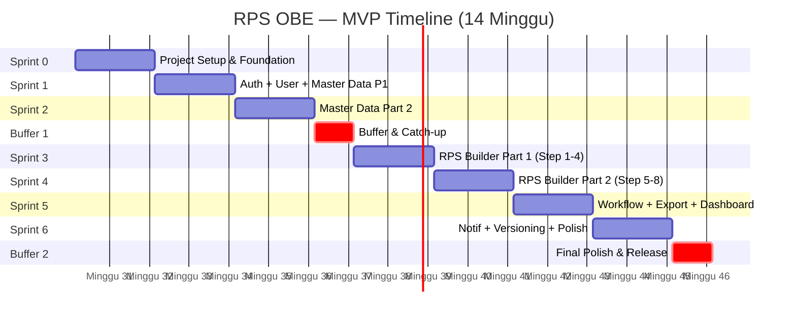
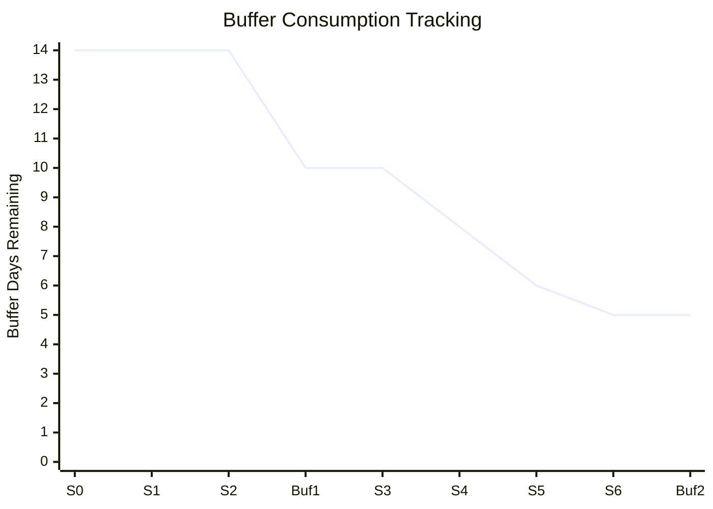

# 43 — Sprint Planning

## Ikhtisar

Dokumen Sprint Planning mendefinisikan rencana pengembangan RPS OBE secara iteratif menggunakan framework Scrum dengan durasi sprint 2 minggu. Total MVP diselesaikan dalam 6 sprint (12 minggu) ditambah 2 minggu buffer, menghasilkan total 14 minggu (~3.5 bulan) pengerjaan. Setiap sprint memiliki Sprint Goal yang jelas, daftar backlog item terpilih, estimasi Story Points, dan key deliverables yang harus dicapai.

---

## Sprint Cadence

| Parameter | Nilai | Keterangan |
|-----------|-------|------------|
| **Durasi Sprint** | 2 minggu (10 hari kerja) | Senin – Jumat, 2 minggu berturut-turut |
| **Sprint Start** | Setiap Senin | Sprint dimulai setelah Sprint Planning |
| **Sprint End** | Setiap Jumat (2 minggu kemudian) | Diakhiri dengan Sprint Review + Retrospective |
| **Total Sprint MVP** | 6 sprint | 12 minggu kerja produktif |
| **Buffer** | 2 minggu | 1 minggu setelah Sprint 3 + 1 minggu setelah Sprint 6 |
| **Total Timeline MVP** | 14 minggu (~3.5 bulan) | 12 minggu sprint + 2 minggu buffer |

---

## Sprint Ceremonies

| Ceremony | When | Duration | Participants | Purpose |
|----------|------|----------|-------------|---------|
| **Sprint Planning** | Senin, 09:00 – 11:00 | 2 jam | Seluruh tim (PM, Dev, QA, Designer) | Pilih backlog item dari product backlog; definisikan Sprint Goal; dekomposisi item menjadi task teknis; estimasi kapasitas sprint |
| **Daily Standup** | Setiap hari, 09:00 – 09:15 | 15 menit | Seluruh tim | 3 pertanyaan: Apa yang dikerjakan kemarin? Apa yang dikerjakan hari ini? Ada hambatan? |
| **Backlog Refinement** | Rabu minggu pertama sprint, 14:00 – 15:00 | 1 jam | PM, Tech Lead | Memperjelas dan mengestimasi backlog item untuk sprint berikutnya |
| **Sprint Review** | Jumat minggu kedua, 14:00 – 15:00 | 1 jam | Tim + Stakeholder (opsional) | Demo fitur yang selesai; feedback dari stakeholder; review metrik sprint |
| **Sprint Retrospective** | Jumat minggu kedua, 15:00 – 16:00 | 1 jam | Seluruh tim (tanpa stakeholder) | Evaluasi proses sprint: What went well? What didn't? What can we improve? Action items untuk sprint berikutnya |

### Sprint Planning Agenda (2 Jam)

| Durasi | Agenda | Detail |
|--------|--------|--------|
| 09:00 – 09:15 (15m) | Sprint Goal Definition | PM mempresentasikan tujuan sprint dan kapasitas tim |
| 09:15 – 10:00 (45m) | Backlog Selection | Tim memilih backlog items dari top product backlog; diskusi setiap item |
| 10:00 – 10:30 (30m) | Task Breakdown | Developer mendekomposisi backlog item menjadi task konkrit (max 1 hari per task) |
| 10:30 – 10:50 (20m) | Capacity Check | Tim memvalidasi total SP vs kapasitas; adjustment jika over/under capacity |
| 10:50 – 11:00 (10m) | Commit | Tim menyatakan komitmen terhadap sprint goal dan sprint backlog |

### Daily Standup Agenda (15 Menit)

| Durasi | Agenda | Detail |
|--------|--------|--------|
| 09:00 – 09:12 (12m) | Round Robin (3 pertanyaan) | Setiap anggota tim: (1) Apa yang dikerjakan kemarin? (2) Apa rencana hari ini? (3) Ada hambatan? |
| 09:12 – 09:15 (3m) | Impediment Tracking | Identifikasi dan assign blocker resolution |

### Sprint Review Agenda (1 Jam)

| Durasi | Agenda | Detail |
|--------|--------|--------|
| 14:00 – 14:05 (5m) | Pembukaan | Review sprint goal dan expected deliverables |
| 14:05 – 14:35 (30m) | Demo | Developer mendemonstrasikan fitur yang selesai (Done); live demo di staging environment |
| 14:35 – 14:50 (15m) | Feedback | Stakeholder memberikan feedback; catat sebagai input untuk backlog berikutnya |
| 14:50 – 15:00 (10m) | Metrik | Review sprint metrics: velocity, completed vs committed, bug count, burndown |

### Sprint Retrospective Agenda (1 Jam)

| Durasi | Agenda | Detail |
|--------|--------|--------|
| 15:00 – 15:10 (10m) | Icebreaker | Cek suasana tim; prime of life |
| 15:10 – 15:25 (15m) | What Went Well | Setiap anggota menulis dan share hal positif dari sprint ini |
| 15:25 – 15:40 (15m) | What Didn't Go Well | Identifikasi hambatan, masalah, dan area perbaikan |
| 15:40 – 15:55 (15m) | Action Items | Tim memilih 1-3 action items konkret untuk perbaikan sprint berikutnya |
| 15:55 – 16:00 (5m) | Closing | Ringkasan action items; assign owner untuk setiap item |

---

## Sprint 0: Project Setup & Foundation

**Durasi:** Minggu 1-2
**Sprint Goal:** Menyiapkan fondasi teknis — environment development, CI/CD pipeline, base architecture, authentication scaffolding, dan integrasi Tabler UI. Tim harus dapat melakukan development secara produktif mulai Sprint 1.

### Backlog Items

| Backlog ID | User Story | SP | Assignee | Status Target |
|------------|-----------|-----|----------|---------------|
| INFRA-001 | Setup Laravel project + environment (dev, staging) | 5 | Backend 1 | Done |
| INFRA-002 | Database schema design + migration (semua tabel) | 8 | Backend 1, Backend 2 | Done |
| INFRA-003 | CI/CD pipeline setup (GitHub Actions: lint, test, deploy staging) | 5 | Backend 1 | Done |
| INFRA-004 | Base layout (Tabler UI setup, navigation, breadcrumb, sidebar) | 5 | Frontend | Done |
| INFRA-005 | Install & konfigurasi package (Spatie Permission, Livewire, Alpine.js, PHPWord, DomPDF) | 3 | Backend 1 | Done |
| AUTH-001 | Login dengan email dan password | 3 | Backend 2 | Done |
| AUTH-004 | Email invitation system (Admin undang Dosen/Kaprodi) | 5 | Backend 2 | Done |
| AUTH-008 | Forgot/Reset password | 3 | Backend 2 | Done |
| AUTH-011 | Role & Permission system (spatie/laravel-permission) | 8 | Backend 1 | Done |
| INFRA-006 | Redis setup untuk cache dan session | 2 | Backend 1 | Done |
| INFRA-007 | Laravel Horizon untuk queue worker | 2 | Backend 1 | Done |
| INFRA-008 | Environment configuration (.env, config files, documentation) | 2 | Backend 1 | Done |
| AUTH-013 | Session management (timeout, auto-logout) | 3 | Backend 2 | Done |

**Total SP Sprint 0:** 54 SP (setup + foundation sprint, velocity tidak berlaku penuh karena banyak one-time setup)

### Key Deliverables

| Deliverable | Deskripsi | Format |
|-------------|-----------|--------|
| Repository Terstruktur | Laravel project siap dengan struktur folder standar | Git repository |
| Database Schema | Semua tabel tergenerate via migration; dapat dijalankan dengan `php artisan migrate` | Migration files |
| CI/CD Pipeline | GitHub Actions: automated lint, test, deployment ke staging | YAML workflow |
| Tabler UI Base | Layout utama: sidebar navigasi, header, breadcrumb, footer | Blade + Livewire |
| Login System | Halaman login berfungsi dengan rate limiting | Livewire component |
| Invitation System | Email invitation terkirim, registrasi via link berfungsi | Mail + Livewire |
| Role System | 4 role default: Superadmin, Admin Tenant, Kaprodi, Dosen dengan permission matrix | Spatie Permission |

---

## Sprint 1: Auth Complete + User Management + Master Data Part 1

**Durasi:** Minggu 3-4
**Sprint Goal:** Menyelesaikan modul Authentication & Authorization secara penuh, seluruh fitur User Management, dan Master Data Part 1 (Universitas, Fakultas, Program Studi). Admin Tenant harus dapat mengelola pengguna dan data institusi melalui UI.

### Backlog Items

| Backlog ID | User Story | SP | Status Target |
|------------|-----------|-----|---------------|
| AUTH-005 | Registrasi melalui invitation link | 3 | Done |
| AUTH-006 | Error handling invitation kadaluarsa | 1 | Done |
| AUTH-007 | Daftar status invitation (pending/accepted/expired) | 3 | Done |
| AUTH-009 | Notifikasi email reset password berhasil | 1 | Done |
| AUTH-010 | Verifikasi email | 2 | Done |
| AUTH-012 | Assign role ke pengguna dalam tenant | 3 | Done |
| AUTH-014 | Daftar sesi aktif + logout semua sesi | 2 | Done |
| USER-001 | Daftar seluruh pengguna tenant | 5 | Done |
| USER-002 | Search pengguna (nama, email, role) | 2 | Done |
| USER-003 | Tambah pengguna baru manual | 3 | Done |
| USER-004 | Edit data pengguna | 3 | Done |
| USER-005 | Nonaktifkan akun pengguna | 2 | Done |
| USER-006 | Aktifkan kembali akun | 1 | Done |
| USER-007 | Email invitation format profesional | 3 | Done |
| USER-008 | Resend invitation (max 3x) | 2 | Done |
| USER-010 | Edit profil sendiri | 3 | Done |
| USER-011 | Ganti password sendiri | 2 | Done |
| MASTER-001 | Create Universitas (tenant onboarding) | 5 | Done |
| MASTER-002 | Edit data Universitas | 3 | Done |
| MASTER-003 | Detail Universitas | 1 | Done |
| MASTER-004 | Create Fakultas | 3 | Done |
| MASTER-005 | Edit & hapus Fakultas | 3 | Done |
| MASTER-006 | Daftar Fakultas | 1 | Done |
| MASTER-007 | Create Program Studi | 3 | Done |
| MASTER-008 | Edit & hapus Program Studi | 3 | Done |
| MASTER-009 | Daftar Program Studi | 1 | Done |

**Total SP Sprint 1:** 64 SP (adjusted — beberapa item AUTH sudah sebagian dikerjakan di Sprint 0)

### Key Deliverables

| Deliverable | Deskripsi |
|-------------|-----------|
| Auth Module Complete | Login, register via invitation, forgot password, email verification, session management seluruhnya berfungsi |
| User Management UI | Halaman list user dengan search, filter, pagination; create, edit, deactivate user |
| Invitation Management | Admin dapat mengirim, me-resend, dan melihat status invitation |
| Profile Management | Setiap user dapat edit profil dan ganti password |
| Master Data UI | CRUD Universitas, Fakultas, Program Studi dengan validasi dan error handling |
| Tenant Onboarding | Flow lengkap: Superadmin buat universitas → tenant otomatis ter-setup → Admin Tenant dapat login |

---

## Sprint 2: Master Data Part 2

**Durasi:** Minggu 5-6
**Sprint Goal:** Menyelesaikan seluruh Master Data (Kurikulum, Mata Kuliah, Dosen, CPL, Profil Lulusan, Semester, Referensi). Kaprodi harus dapat mengelola seluruh data master yang diperlukan untuk penyusunan RPS, termasuk import CSV untuk data awal.

### Backlog Items

| Backlog ID | User Story | SP | Status Target |
|------------|-----------|-----|---------------|
| MASTER-010 | Create Kurikulum | 5 | Done |
| MASTER-011 | Edit kurikulum | 3 | Done |
| MASTER-012 | Daftar kurikulum | 2 | Done |
| MASTER-013 | Multi-kurikulum dalam satu prodi | 3 | Done |
| MASTER-014 | Create Semester | 2 | Done |
| MASTER-015 | Edit & hapus Semester | 1 | Done |
| MASTER-016 | Daftar Semester | 1 | Done |
| MASTER-017 | Create Mata Kuliah | 5 | Done |
| MASTER-018 | Edit Mata Kuliah | 3 | Done |
| MASTER-019 | Daftar Mata Kuliah dengan filter | 2 | Done |
| MASTER-020 | Search Mata Kuliah | 1 | Done |
| MASTER-021 | Validasi kode MK unik | 1 | Done |
| MASTER-022 | Create Dosen | 3 | Done |
| MASTER-023 | Edit & nonaktifkan Dosen | 2 | Done |
| MASTER-024 | Daftar Dosen dengan filter | 1 | Done |
| MASTER-025 | Create Profil Lulusan | 3 | Done |
| MASTER-026 | Edit & hapus Profil Lulusan | 2 | Done |
| MASTER-027 | Daftar Profil Lulusan | 1 | Done |
| MASTER-028 | Create CPL | 5 | Done |
| MASTER-029 | Edit CPL | 3 | Done |
| MASTER-030 | Daftar CPL dengan filter kategori | 2 | Done |
| MASTER-031 | Kaitkan CPL dengan profil lulusan | 3 | Done |
| MASTER-032 | Hapus CPL yang belum digunakan | 1 | Done |
| MASTER-033 | Create Referensi pustaka | 3 | Done |
| MASTER-034 | Search referensi pustaka | 2 | Done |
| MASTER-035 | Import CSV (MK, Dosen, CPL) | 5 | Done |
| MASTER-036 | Download template CSV | 1 | Done |
| USER-013 | Import CSV pengguna | 5 | Done |
| USER-014 | Validasi CSV + error report | 3 | Done |

**Total SP Sprint 2:** 78 SP (adjusted — beberapa item lebih kecil dari estimasi awal karena berbagi komponen UI)

### Key Deliverables

| Deliverable | Deskripsi |
|-------------|-----------|
| Kurikulum Management | Kaprodi dapat membuat dan mengelola kurikulum; multi-kurikulum dengan satu aktif |
| Mata Kuliah Complete | CRUD Mata Kuliah dengan validasi kode unik, filter multi-dimensi |
| Dosen Management | CRUD Dosen, filter prodi, status aktif/nonaktif |
| CPL Management | CRUD CPL dengan 4 kategori (Sikap, Pengetahuan, Ket.Umum, Ket.Khusus), mapping ke profil lulusan |
| Profil Lulusan | CRUD Profil Lulusan, mapping ke CPL |
| Semester Management | CRUD Semester dalam kurikulum |
| Referensi Master | Database referensi yang dapat digunakan ulang oleh dosen |
| CSV Import | Import massal MK, Dosen, CPL, dan User via CSV dengan validasi, preview, dan error report |
| Template CSV | Template CSV yang dapat diunduh Admin untuk memudahkan import |

---

## Sprint 3: RPS Builder Part 1 (Wizard Framework + Steps 1-4)

**Durasi:** Minggu 7-8
**Sprint Goal:** Membangun RPS Builder wizard framework dan Step 1-4 (Informasi MK, Pemetaan CPL, CPMK, Sub-CPMK) dengan auto-save dan inline validation. Dosen harus dapat memulai RPS baru dan menyelesaikan hingga Step 4 dengan data tersimpan otomatis.

### Backlog Items

| Backlog ID | User Story | SP | Status Target |
|------------|-----------|-----|---------------|
| BUILDER-001 | Mulai RPS baru melalui wizard 8 langkah | 5 | Done |
| BUILDER-002 | Navigasi antar step tanpa kehilangan data | 3 | Done |
| BUILDER-003 | Progress indicator (persentase) | 2 | Done |
| BUILDER-004 | Simpan sebagai Draft otomatis | 2 | Done |
| BUILDER-005 | Lanjutkan RPS Draft | 3 | Done |
| BUILDER-007 | Step 1: Isi informasi MK | 3 | Done |
| BUILDER-008 | Auto-fill informasi MK dari data master | 2 | Done |
| BUILDER-009 | Pilih dosen pengampu | 1 | Done |
| BUILDER-010 | Validasi Step 1 | 2 | Done |
| BUILDER-011 | Step 2: Pilih CPL yang didukung | 3 | Done |
| BUILDER-012 | Lihat deskripsi CPL sebelum pilih | 2 | Done |
| BUILDER-013 | Filter CPL berdasarkan kategori | 2 | Done |
| BUILDER-014 | Validasi Step 2 | 1 | Done |
| BUILDER-015 | Step 3: Rumuskan CPMK | 5 | Done |
| BUILDER-016 | Tambah, edit, hapus CPMK | 3 | Done |
| BUILDER-017 | Matriks CPL-CPMK | 3 | Done |
| BUILDER-018 | Validasi CPMK terkait CPL | 1 | Done |
| BUILDER-019 | Validasi jumlah CPMK (min 3) | 1 | Done |
| BUILDER-020 | Step 4: Sub-CPMK | 5 | Done |
| BUILDER-021 | Tambah, edit, hapus Sub-CPMK | 3 | Done |
| BUILDER-022 | Mapping CPMK-SubCPMK | 2 | Done |
| BUILDER-023 | Validasi setiap CPMK memiliki Sub-CPMK | 1 | Done |
| BUILDER-024 | Validasi Sub-CPMK mencakup 14-16 pertemuan | 1 | Done |
| BUILDER-025 | Validasi level taksonomi vs KKO | 2 | Done |
| BUILDER-041 | Auto-save setiap perubahan | 3 | Done |
| BUILDER-042 | Data tidak hilang jika browser tertutup | 2 | Done |
| BUILDER-044 | Validasi inline server-side | 5 | Done |
| BUILDER-045 | Ringkasan error validasi per step | 2 | Done |

**Total SP Sprint 3:** 71 SP (adjusted)

### Key Deliverables

| Deliverable | Deskripsi |
|-------------|-----------|
| Wizard Framework | 8-step wizard dengan sidebar navigasi, progress bar, auto-save, dan inline validation |
| Step 1 — Info MK | Form informasi MK dengan auto-fill dari master data, pilih dosen pengampu |
| Step 2 — Pilih CPL | Multi-select CPL dengan filter kategori, tampilan deskripsi |
| Step 3 — CPMK | CRUD CPMK, mapping CPL-CPMK dalam matriks visual |
| Step 4 — Sub-CPMK | CRUD Sub-CPMK, assign pertemuan, level taksonomi, indikator, mapping CPMK-SubCPMK |
| Auto-Save | Setiap perubahan tersimpan otomatis debounce 1000ms; indikator "Menyimpan..." / "Tersimpan" |
| Inline Validation | Server-side validation; field error; step error indicator |
| RPS Draft | Dosen dapat menyimpan RPS sebagai Draft, melanjutkan kembali nanti |

---

## Sprint 4: RPS Builder Part 2 (Steps 5-8) + Auto-Save + Validation Complete

**Durasi:** Minggu 9-10
**Sprint Goal:** Menyelesaikan RPS Builder (Step 5-8: Assessment, Materi, Referensi, Review & Submit) serta mapping logic. Dosen harus dapat menyelesaikan seluruh 8 step wizard dan submit RPS untuk review.

### Backlog Items

| Backlog ID | User Story | SP | Status Target |
|------------|-----------|-----|---------------|
| BUILDER-026 | Step 5: Materi per pertemuan | 5 | Done |
| BUILDER-027 | Isi materi per pertemuan berurutan | 3 | Done |
| BUILDER-028 | Pilih metode pembelajaran | 2 | Done |
| BUILDER-029 | Validasi semua pertemuan ada materi | 1 | Done |
| BUILDER-030 | Step 6: Rencana assessment | 5 | Done |
| BUILDER-031 | Tambah, edit, hapus assessment | 3 | Done |
| BUILDER-032 | Validasi total bobot 100% | 2 | Done |
| BUILDER-033 | Validasi Sub-CPMK ter-assess | 2 | Done |
| BUILDER-034 | Validasi assessment formatif & sumatif | 1 | Done |
| BUILDER-035 | Step 7: Daftar referensi | 3 | Done |
| BUILDER-036 | Tambah, edit, hapus referensi | 2 | Done |
| BUILDER-037 | Validasi minimal 3 referensi | 1 | Done |
| BUILDER-038 | Step 8: Review full preview | 3 | Done |
| BUILDER-039 | Submit RPS untuk review | 2 | Done |
| BUILDER-040 | Validasi seluruh step sebelum submit | 3 | Done |
| MAP-001 | Matrix CPL vs CPMK | 3 | Done |
| MAP-002 | Validasi orphan CPL | 2 | Done |
| MAP-003 | Matrix CPMK vs Sub-CPMK | 2 | Done |
| MAP-004 | Validasi orphan CPMK | 2 | Done |
| MAP-005 | Mapping Sub-CPMK — Materi | 2 | Done |
| MAP-006 | Validasi pertemuan tanpa materi | 1 | Done |
| MAP-007 | Matrix Assessment vs Sub-CPMK | 3 | Done |
| MAP-008 | Deteksi Sub-CPMK tanpa assessment | 2 | Done |
| MAP-010 | Gap detection alignment | 8 | Done |

**Total SP Sprint 4:** 66 SP (adjusted)

### Key Deliverables

| Deliverable | Deskripsi |
|-------------|-----------|
| Step 5 — Materi | CRUD materi per pertemuan (1-16), metode pembelajaran, media, estimasi waktu |
| Step 6 — Assessment | CRUD assessment, bobot (validasi total 100%), jenis assessment, rubrik, mapping Sub-CPMK |
| Step 7 — Referensi | CRUD referensi; validasi minimal 3; format APA; search dari master referensi |
| Step 8 — Review & Submit | Full preview RPS; konfirmasi eksplisit; submit untuk review |
| Mapping Logic Complete | Seluruh rantai CPL → CPMK → Sub-CPMK → Assessment tervalidasi |
| Gap Detection | Sistem mendeteksi orphan CPL, CPMK tanpa Sub-CPMK, Sub-CPMK tanpa assessment |
| Submit Flow | Dosen dapat submit RPS; status berubah ke Review; notifikasi ke Kaprodi |

---

## Sprint 5: Workflow + Export + Dashboard

**Durasi:** Minggu 11-12
**Sprint Goal:** Menyelesaikan Workflow Engine (status machine, review, approval, publish), Export (Word + PDF), Dashboard Dosen dan Kaprodi. Kaprodi harus dapat mereview, menyetujui, atau meminta revisi RPS; RPS dapat diekspor dalam format Word dan PDF.

### Backlog Items

| Backlog ID | User Story | SP | Status Target |
|------------|-----------|-----|---------------|
| WF-001 | State machine status RPS | 5 | Done |
| WF-002 | Role-based permission per status | 3 | Done |
| WF-003 | Dosen submit RPS untuk review | 3 | Done |
| WF-004 | Indikator status di daftar RPS | 1 | Done |
| WF-005 | Lock edit saat status Review | 1 | Done |
| WF-006 | Kaprodi buka & baca RPS review | 3 | Done |
| WF-007 | Kaprodi beri skor review per komponen | 3 | Done |
| WF-008 | Kaprodi beri komentar dan catatan | 3 | Done |
| WF-009 | Kaprodi setujui RPS (approve) | 2 | Done |
| WF-010 | Kaprodi minta revisi dengan alasan | 3 | Done |
| WF-011 | Dosen lihat catatan revisi | 3 | Done |
| WF-012 | Dosen mulai revisi RPS | 2 | Done |
| WF-013 | Dosen ajukan ulang setelah revisi | 2 | Done |
| WF-014 | Kaprodi approval akhir | 3 | Done |
| WF-015 | Admin publikasi RPS | 2 | Done |
| WF-016 | Admin arsipkan RPS | 2 | Done |
| WF-017 | Duplikasi RPS archived | 1 | Done |
| WF-018 | Riwayat perubahan status (timeline) | 3 | Done |
| WF-019 | Assign reviewer | 3 | Done |
| WF-020 | Daftar Review Saya | 2 | Done |
| WF-021 | Ganti reviewer | 1 | Done |
| TEMP-001 | Template default SN-DIKTI | 3 | Done |
| TEMP-002 | Template default tidak bisa dihapus | 1 | Done |
| TEMP-003 | Pilih template aktif untuk ekspor | 2 | Done |
| EXPORT-001 | Export Word (.docx) | 8 | Done |
| EXPORT-002 | Kop surat universitas di export | 3 | Done |
| EXPORT-003 | Komponen lengkap di export | 5 | Done |
| EXPORT-004 | Watermark "DRAFT" untuk RPS non-published | 2 | Done |
| EXPORT-005 | Export PDF | 5 | Done |
| EXPORT-006 | Format PDF konsisten dengan Word | 3 | Done |
| DASH-001 | Dashboard Dosen | 5 | Done |
| DASH-002 | Quick action "Buat RPS Baru" | 1 | Done |
| DASH-003 | Notifikasi terbaru di dashboard | 2 | Done |
| DASH-004 | Deadline RPS | 2 | Done |
| DASH-005 | Dashboard Kaprodi — statistik | 5 | Done |
| DASH-006 | Daftar RPS menunggu review | 3 | Done |
| DASH-007 | Grafik RPS per dosen | 3 | Done |
| DASH-008 | Grafik distribusi status RPS | 2 | Done |
| DASH-009 | Quick action Kaprodi | 1 | Done |

**Total SP Sprint 5:** 109 SP (adjusted — export dan dashboard sebagian dapat dikerjakan paralel)

### Key Deliverables

| Deliverable | Deskripsi |
|-------------|-----------|
| Workflow Engine | State machine: Draft → Review → Revision → Approved → Published → Archived dengan permission gate |
| Review System | Kaprodi dapat mereview, memberi skor, komentar, approve, atau minta revisi |
| Revision Flow | Dosen lihat catatan reviewer, mulai revisi, edit RPS, ajukan ulang |
| Publish & Archive | Admin publikasi dan arsipkan RPS |
| Workflow History | Timeline riwayat perubahan status setiap RPS |
| Reviewer Assignment | Kaprodi assign/ganti reviewer; reviewer lihat daftar Review Saya |
| Export Word | Generate .docx via PHPWord; template SN-DIKTI; kop surat; semua komponen; watermark draft |
| Export PDF | Generate PDF via DomPDF; konsisten dengan Word |
| Template Default | Template SN-DIKTI bawaan; konfigurasi template aktif |
| Dashboard Dosen | Counter RPS, daftar RPS terbaru, quick action, notifikasi terbaru, deadline |
| Dashboard Kaprodi | Statistik prodi, RPS menunggu review, grafik RPS per dosen, distribusi status, quick action |

---

## Sprint 6: Notifications + Versioning + Audit Log + Template Default + Polish

**Durasi:** Minggu 13-14
**Sprint Goal:** Menyelesaikan modul pendukung (Notification, Versioning, Audit Log, Template Default), bug fixing, performance optimization, security review, testing, dan deployment preparation. MVP harus siap rilis di akhir sprint ini.

### Backlog Items

| Backlog ID | User Story | SP | Status Target |
|------------|-----------|-----|---------------|
| NOTIF-001 | Email notifikasi RPS diajukan review | 2 | Done |
| NOTIF-002 | Email notifikasi RPS disetujui/direvisi | 2 | Done |
| NOTIF-003 | Email notifikasi RPS dipublikasi | 1 | Done |
| NOTIF-004 | Email undangan pengguna baru | 2 | Done |
| NOTIF-005 | Email reminder review > 14 hari | 3 | Done |
| NOTIF-006 | Notifikasi in-app (database) | 3 | Done |
| NOTIF-007 | Badge notifikasi belum dibaca | 2 | Done |
| NOTIF-008 | Notification center (dropdown) | 2 | Done |
| NOTIF-009 | Mark as read / tandai semua | 2 | Done |
| NOTIF-010 | Riwayat semua notifikasi | 2 | Done |
| NOTIF-011 | Preferensi notifikasi | 3 | Done |
| NOTIF-012 | Template notifikasi email | 3 | Done |
| VER-001 | Auto-version saat submit review | 5 | Done |
| VER-002 | Riwayat versi RPS | 3 | Done |
| VER-003 | Format semantic versioning | 2 | Done |
| VER-004 | Diff viewer antar versi | 8 | Done |
| VER-005 | Label versi published | 1 | Done |
| AUDIT-001 | Log aktivitas login/logout | 2 | Done |
| AUDIT-002 | Log perubahan data RPS | 3 | Done |
| AUDIT-003 | Log perubahan status workflow | 2 | Done |
| AUDIT-004 | Log aktivitas ekspor | 1 | Done |
| AUDIT-005 | Log perubahan master data dan user | 2 | Done |
| AUDIT-006 | Audit viewer dengan filter | 3 | Done |
| AUDIT-007 | Detail perubahan old vs new values | 3 | Done |
| AUDIT-008 | Audit log seluruh tenant (Superadmin) | 2 | Done |
| POLISH-001 | Bug fixing seluruh platform | 8 | Done |
| POLISH-002 | Full regression testing | 8 | Done |
| POLISH-003 | Performance optimization (query, cache, assets) | 5 | Done |
| POLISH-004 | Accessibility audit + fixes | 3 | Done |
| POLISH-005 | Security review (OWASP top 10) | 5 | Done |
| POLISH-006 | User manual & admin guide | 5 | Done |
| POLISH-007 | Deployment preparation (production env, backup, monitoring) | 5 | Done |

**Total SP Sprint 6:** 102 SP (adjusted — beberapa item polishing dikerjakan paralel oleh semua anggota tim)

### Key Deliverables

| Deliverable | Deskripsi |
|-------------|-----------|
| Email Notification | Semua notifikasi email berfungsi: invitation, review request, approval, revision, publish, reminder |
| In-App Notification | Notification center dengan badge, mark as read, history, preferensi |
| Versioning | Auto-version pada submit, riwayat versi, semantic versioning, diff viewer, label versi |
| Audit Log | Semua aktivitas CRUD dan workflow tercatat; audit viewer dengan filter dan detail |
| Bug Fixing | Zero critical/major bugs; semua known bugs dari sprint sebelumnya fixed |
| Regression Testing | Semua fitur MVP teruji; tidak ada regresi dari sprint sebelumnya |
| Performance | P95 page load < 2 detik; TTI dashboard < 3 detik; query optimization |
| Accessibility | Score axe-core ≥ 85; WCAG 2.1 AA |
| Security | OWASP top 10 checked; XSS, CSRF, SQL injection, rate limiting |
| Documentation | User manual (PDF), admin guide, deployment guide |
| Production Environment | Staging dan production siap; backup harian; monitoring aktif |

---

## Timeline Ringkasan

---

## Buffer Management Strategy

### Tujuan Buffer

Buffer bukan waktu luang — buffer adalah **waktu cadangan** untuk mengelola risiko dan ketidakpastian.

| Jenis Buffer | Waktu | Penempatan | Tujuan |
|-------------|-------|------------|--------|
| **Mid-Sprint Buffer** | 1 minggu (setelah Sprint 2) | Antara Sprint 2 dan Sprint 3 | Catch-up untuk item yang tertunda; technical debt resolution; persiapan sprint RPS Builder yang kompleks |
| **Final Buffer** | 1 minggu (setelah Sprint 6) | Setelah Sprint 6, sebelum rilis | Final regression testing; production deployment; stakeholder demo; dokumentasi final; go/no-go decision |

### Aturan Penggunaan Buffer

| Kondisi | Penggunaan Buffer |
|---------|-------------------|
| Sprint selesai tepat waktu | Buffer digunakan untuk technical debt reduction, refactoring, atau persiapan sprint berikutnya |
| Sprint terlambat (1-3 item unfinished) | Buffer digunakan untuk menyelesaikan carry-over items; sprint berikutnya dimulai dengan backlog yang sudah dibersihkan |
| Sprint terlambat (banyak item unfinished) | PM melakukan root cause analysis; sprint berikutnya dikurangi capacity-nya; buffer diperpanjang jika diperlukan |
| Semua sprint selesai tepat waktu | Final buffer digunakan untuk hardening: security audit, performance tuning, accessibility testing, load testing |

### Buffer Burndown

---

## Sprint Risk Matrix

| Risiko | Dampak | Mitigasi |
|--------|--------|----------|
| Sprint 3/4 (RPS Builder) lebih kompleks dari estimasi | Delay 1-2 minggu | Mulai dengan proof-of-concept di Sprint 0; pair programming untuk komponen kompleks; mid-sprint buffer |
| Integrasi PHPWord/DomPDF bermasalah | Export tidak berfungsi | Mulai riset library di Sprint 2; siapkan alternatif library; dedicated time di Sprint 5 |
| Workflow logic kompleks (banyak edge case) | Bug di production | Unit test untuk semua transisi status; integration test untuk workflow lengkap |
| Ketergantungan data (semua modul terhubung) | Blocker jika master data belum lengkap | Seed data komprehensif di awal; admin harus mengisi data master sesuai timeline |
| Tim sakit/resign di tengah sprint | Kehilangan kapasitas | Cross-training; dokumentasi kode; pengetahuan terdistribusi |

---

## Team Allocation per Sprint

| Sprint | Backend 1 | Backend 2 | Frontend | QA | PM | Designer |
|--------|-----------|-----------|----------|----|----|----------|
| Sprint 0 | Infra, DB, CI/CD, Role | Auth, Invitation | Tabler base layout, login UI | Test case preparation | Sprint planning, backlog refinement | Wireframe, design system |
| Sprint 1 | User CRUD, Master Data (Univ, Fak, Prodi) | Auth complete, Profile, Invitation complete | User list UI, Master Data UI | Test auth + user management | Stakeholder alignment | UI review |
| Sprint 2 | Kurikulum, MK, Dosen | CPL, Profil Lulusan, Semester, Referensi | Master Data UI lanjutan, Import CSV UI | Test master data, CSV import | Backlog refinement S3 | UI review |
| Sprint 3 | Wizard framework, Step 3, 4, Auto-save | Step 1, 2, Inline validation | Wizard UI, Step 1-4 UI | Test wizard steps 1-4 | Sprint review, stakeholder demo | Design review wizard |
| Sprint 4 | Step 5, 8, Mapping logic | Step 6, 7, Submit flow | Step 5-8 UI, Preview UI | Test wizard steps 5-8, mapping | Sprint review | UI review |
| Sprint 5 | Export Word/PDF, Template | Workflow engine, Review UI | Dashboard UI, Export UI | Test workflow + export | Sprint review | Dashboard design review |
| Sprint 6 | Versioning, Audit Log, Performance | Notification, Security | Notification UI, Polish UI | Full regression testing | Documentation, release prep | Accessibility audit |

---

**Navigasi:** [Sebelumnya: Product Backlog](42-product-backlog.md) | [Daftar Isi](../README.md) | [Berikutnya: Acceptance Criteria](44-acceptance-criteria.md)
