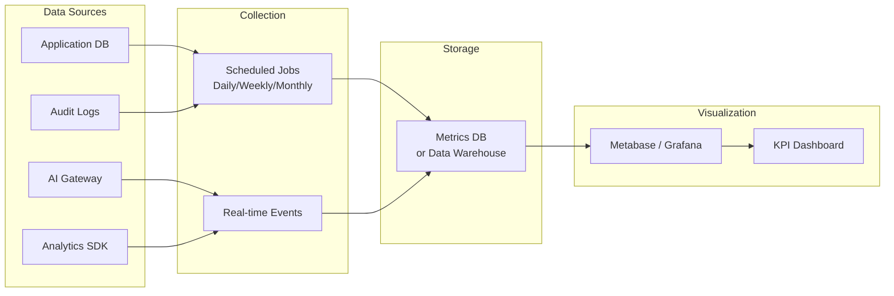

# 45 — Success Metrics

## Ikhtisar

Dokumen Success Metrics mendefinisikan kerangka pengukuran keberhasilan produk RPS OBE secara holistik. Metrik dikategorikan ke dalam lima dimensi: Overall Product Success, Engagement, Quality, Business, dan Adoption. Setiap metrik memiliki definisi jelas, sumber data, target, dan frekuensi review. Kerangka ini memastikan tim produk dapat mengambil keputusan berbasis data (data-driven decision making) dan mengukur dampak setiap inisiatif produk secara objektif.

---

## Overall Product Success Metrics

### North Star Metric

| Elemen | Detail |
|--------|--------|
| **North Star Metric** | Jumlah RPS yang dipublikasi (Published) per bulan |
| **Definisi** | Total RPS dengan status "Published" yang diselesaikan melalui platform dalam periode satu bulan kalender |
| **Mengapa Metrik Ini?** | Mencerminkan nilai inti yang diberikan platform — menghasilkan RPS berkualitas yang siap digunakan. Metrik ini berada di ujung value chain: mencakup penyusunan, review, approval, dan publikasi. |
| **Sumber Data** | Database: tabel `rps` dengan filter `status = 'published'` dan `published_at` dalam periode |
| **Target Bulan 1** | ≥ 5 RPS published |
| **Target Bulan 3** | ≥ 15 RPS published/bulan |
| **Target Bulan 6** | ≥ 30 RPS published/bulan |
| **Target Bulan 12** | ≥ 60 RPS published/bulan |

### Counter Metrics

Counter metrics adalah metrik yang dimonitor untuk memastikan North Star Metric tidak dicapai dengan mengorbankan kualitas atau pengalaman pengguna.

| Metrik | Definisi | Target | Jika Turun... |
|--------|----------|--------|---------------|
| **Rata-Rata Waktu Penyusunan RPS** | Waktu dari RPS dibuat (Draft) hingga di-submit pertama kali | < 4 jam (manual) / < 2 jam (dengan AI) | Periksa UX wizard; adakah friksi yang memperlambat? |
| **Review Cycle Time** | Waktu dari RPS di-submit hingga disetujui (Review → Approved) | < 7 hari | Periksa beban reviewer; perlu notifikasi reminder? |
| **Rata-Rata Skor AI Validator** | Skor rata-rata hasil validasi AI untuk RPS yang di-publish | > 80/100 | Periksa kualitas RPS; perlu perbaikan template atau panduan? |
| **User Satisfaction (CSAT)** | Skor kepuasan pengguna berdasarkan survei in-app | ≥ 4.0 / 5.0 | Periksa feedback kualitatif; identifikasi pain points |
| **Wizard Abandonment Rate** | Persentase RPS Draft yang tidak pernah di-submit | < 30% | Periksa langkah yang paling banyak ditinggalkan; perlu simplifikasi? |

---

## Engagement Metrics

### Daily / Weekly / Monthly Active Users (DAU / WAU / MAU)

| Metrik | Definisi | Sumber Data | Target Bulan 3 | Target Bulan 12 |
|--------|----------|-------------|----------------|-----------------|
| **DAU** | Jumlah pengguna unik yang login minimal 1x dalam satu hari | Database login log; Analytics | ≥ 10 | ≥ 50 |
| **WAU** | Jumlah pengguna unik yang login minimal 1x dalam 7 hari terakhir | Database login log; Analytics | ≥ 20 | ≥ 100 |
| **MAU** | Jumlah pengguna unik yang login minimal 1x dalam 30 hari terakhir | Database login log; Analytics | ≥ 30 | ≥ 200 |

### Stickiness Ratio

| Metrik | Formula | Target |
|--------|---------|--------|
| **Stickiness** | DAU ÷ MAU × 100% | ≥ 30% (artinya pengguna kembali 9 hari per bulan) |
| **WAU ÷ MAU** | WAU ÷ MAU × 100% | ≥ 60% |

### Feature Adoption Rate

| Metrik | Definisi | Sumber Data | Target Bulan 3 | Target Bulan 12 |
|--------|----------|-------------|----------------|-----------------|
| **AI Assistant Adoption** | % RPS yang menggunakan minimal 1 fitur AI Generate (CPMK, Sub-CPMK, Assessment) | Database: flag `ai_generated` pada field terkait | N/A (Fase 2) | ≥ 60% |
| **AI Validator Adoption** | % RPS yang divalidasi AI minimal 1x sebelum submit | Database: log AI validation | N/A (Fase 2) | ≥ 50% |
| **Wizard Completion Rate** | % pengguna yang memulai wizard dan menyelesaikan hingga Step 8 (tidak harus submit) | Analytics funnel: Step 1 → Step 8 | ≥ 60% | ≥ 75% |
| **Export Feature Usage** | % RPS Published yang pernah di-export | Database: log export | ≥ 80% | ≥ 90% |

### Session Metrics

| Metrik | Definisi | Sumber Data | Target |
|--------|----------|-------------|--------|
| **Average Session Duration** | Rata-rata durasi sesi pengguna (dari login hingga logout/timeout) | Analytics; session log | 20-45 menit (produktif) |
| **Sessions per User per Week** | Rata-rata jumlah sesi per pengguna aktif per minggu | Analytics | ≥ 3 sesi/minggu |
| **Bounce Rate (Dashboard)** | % pengguna yang meninggalkan dashboard tanpa interaksi apapun | Analytics | < 20% |
| **Pages per Session** | Rata-rata jumlah halaman yang dikunjungi per sesi | Analytics | ≥ 5 halaman |

---

## Quality Metrics

### RPS Quality Indicators

| Metrik | Definisi | Sumber Data | Target |
|--------|----------|-------------|--------|
| **Average AI Validation Score** | Rata-rata skor total (0-100) dari AI Validator untuk semua RPS | Database: tabel `ai_validations` | > 80/100 |
| **Constructive Alignment Pass Rate** | % RPS yang lulus validasi constructive alignment (skor aspek ≥ 70) | Database: AI validation per aspek | > 85% |
| **CPL Coverage Rate** | % CPL di prodi yang didukung oleh minimal 1 RPS | Database: query CPL vs RPS mapping | > 80% |
| **Assessment Distribution Score** | % RPS dengan distribusi bobot assessment yang seimbang (tidak didominasi UTS/UAS saja) | AI Validator: aspek Assessment | > 75% |
| **Taksonomi Bloom Compliance** | % Sub-CPMK yang menggunakan KKO sesuai level taksonomi yang dipilih | AI Validator: aspek Taksonomi | > 90% |

### Review Quality Indicators

| Metrik | Definisi | Sumber Data | Target |
|--------|----------|-------------|--------|
| **Reviewer Agreement Rate** | Korelasi antara skor AI Reviewer vs skor human reviewer | Database: perbandingan skor AI dan human | ≥ 0.75 (Pearson correlation) |
| **First-Pass Approval Rate** | % RPS yang disetujui pada review pertama (tanpa revisi) | Database: workflow history | ≥ 50% |
| **Average Revision Cycles** | Rata-rata jumlah siklus revisi per RPS sebelum approved | Database: workflow history | ≤ 1.5 siklus |
| **Review Response Time** | Waktu dari RPS di-submit hingga reviewer mulai mereview | Database: workflow timestamps | < 3 hari |

### Technical Quality Indicators

| Metrik | Definisi | Sumber Data | Target |
|--------|----------|-------------|--------|
| **Error Rate** | % request yang menghasilkan error (5xx) | Application log; monitoring | < 0.1% |
| **Bug Count (Open)** | Jumlah bug dengan severity P1 (Critical) dan P2 (Major) yang belum resolved | Bug tracker / Issue board | 0 P1, < 5 P2 |
| **Bug Count (Resolved)** | Jumlah bug yang diselesaikan per sprint | Bug tracker | ≥ 90% dari bug yang ditemukan |
| **Test Coverage (Backend)** | % kode PHP yang tercover oleh unit/feature test | PHPUnit coverage report | ≥ 70% (MVP), ≥ 80% (Fase 2+) |
| **Test Coverage (Critical Flows)** | % critical user journeys yang tercover oleh E2E test | Cypress/Dusk test report | 100% |
| **Lighthouse Performance Score** | Skor performa dari Google Lighthouse | Lighthouse CI | ≥ 80 |
| **Lighthouse Accessibility Score** | Skor aksesibilitas dari Google Lighthouse | Lighthouse CI; axe-core | ≥ 85 |

---

## Business Metrics

### Revenue Metrics

| Metrik | Definisi | Formula | Target Bulan 6 | Target Bulan 12 |
|--------|----------|---------|----------------|-----------------|
| **MRR (Monthly Recurring Revenue)** | Total pendapatan berulang per bulan dari semua tenant aktif | Σ (subscription fee per tenant) | ≥ Rp 50.000.000 | ≥ Rp 150.000.000 |
| **ARR (Annual Recurring Revenue)** | MRR × 12 (proyeksi tahunan) | MRR × 12 | ≥ Rp 600.000.000 | ≥ Rp 1.800.000.000 |
| **ARPU (Average Revenue Per User/Tenant)** | Rata-rata pendapatan per tenant per bulan | MRR ÷ jumlah tenant aktif | ≥ Rp 5.000.000 | ≥ Rp 5.000.000 |
| **Expansion Revenue** | Peningkatan pendapatan dari upsell/upgrade tenant existing | Σ (upgrade fee) per bulan | ≥ 10% MRR | ≥ 15% MRR |

### Customer Economics

| Metrik | Definisi | Formula | Target |
|--------|----------|---------|--------|
| **CAC (Customer Acquisition Cost)** | Total biaya untuk mendapatkan 1 tenant baru | Total Sales & Marketing cost ÷ jumlah tenant baru | < Rp 15.000.000 |
| **LTV (Customer Lifetime Value)** | Total pendapatan yang dihasilkan dari 1 tenant selama berlangganan | ARPU × average customer lifetime (bulan) | ≥ Rp 180.000.000 (asumsi 36 bulan) |
| **LTV:CAC Ratio** | Rasio nilai pelanggan terhadap biaya akuisisi | LTV ÷ CAC | ≥ 3:1 (sehat); ≥ 5:1 (sangat baik) |
| **Payback Period** | Waktu yang dibutuhkan untuk mengembalikan CAC | CAC ÷ ARPU | < 3 bulan |

### Retention & Churn

| Metrik | Definisi | Formula | Target |
|--------|----------|---------|--------|
| **Monthly Churn Rate** | % tenant yang berhenti berlangganan per bulan | Tenant lost ÷ total tenant awal bulan × 100% | < 5% per tahun (< 0.4% per bulan) |
| **Net Revenue Retention (NRR)** | Pendapatan dari tenant existing (termasuk expansion, dikurangi churn) | (MRR awal + expansion - contraction - churn) ÷ MRR awal × 100% | ≥ 100% |
| **Logo Retention Rate** | % tenant yang tetap berlangganan setelah 12 bulan | Tenant retained ÷ total tenant 12 bulan lalu × 100% | ≥ 90% |

### Customer Satisfaction & Advocacy

| Metrik | Definisi | Sumber Data | Target |
|--------|----------|-------------|--------|
| **NPS (Net Promoter Score)** | Seberapa mungkin pengguna merekomendasikan produk | Survei NPS periodik (skala 0-10) | > 50 (Excellent) |
| **CSAT (Customer Satisfaction)** | Kepuasan terhadap fitur/interaksi spesifik | Survei in-app setelah trigger (contoh: setelah export selesai) | ≥ 4.0 / 5.0 |
| **Customer Health Score** | Skor komposit: product usage + support health + billing health + NPS | Kalkulasi berbasis rule engine | ≥ 80/100 (Healthy) |
| **Support Ticket Volume** | Jumlah tiket support yang masuk per bulan | Helpdesk / Support system | < 20 tiket/bulan (untuk 10 tenant) |
| **Time to Resolution** | Waktu rata-rata dari tiket dibuat hingga resolved | Helpdesk timestamps | < 24 jam (P1), < 48 jam (P2), < 1 minggu (P3) |
| **Time to Onboard New Tenant** | Waktu dari kontrak ditandatangani hingga tenant dapat menggunakan platform (data master terisi, user terdaftar) | Onboarding tracking | < 3 hari |

---

## Adoption Metrics

### Tenant & User Growth

| Metrik | Definisi | Sumber Data | Target Bulan 3 | Target Bulan 12 |
|--------|----------|-------------|-----------------|-----------------|
| **Number of Active Tenants** | Jumlah tenant (universitas) yang aktif menggunakan platform dalam 30 hari terakhir | Database | 1 (MVP) → 3 | ≥ 15 |
| **Number of Registered Users** | Total akun pengguna terdaftar di seluruh tenant | Database | ≥ 30 | ≥ 500 |
| **User Growth Rate** | % pertumbuhan pengguna baru per bulan | (New users bulan ini ÷ total users bulan lalu) × 100% | ≥ 20% | ≥ 10% |

### RPS Creation & Publication

| Metrik | Definisi | Sumber Data | Target Bulan 3 | Target Bulan 12 |
|--------|----------|-------------|-----------------|-----------------|
| **RPS Created (Total)** | Total RPS yang dibuat (semua status) sejak platform live | Database | ≥ 30 | ≥ 1.000 |
| **RPS Created per Month** | RPS baru yang dibuat per bulan | Database | ≥ 10 | ≥ 100 |
| **RPS Published (Total)** | Total RPS dengan status "Published" | Database | ≥ 10 | ≥ 500 |
| **RPS Published per Month** | RPS yang dipublikasi per bulan | Database | ≥ 5 | ≥ 60 |
| **RPS per Tenant Ratio** | Rata-rata jumlah RPS published per tenant aktif | Total RPS Published ÷ Active Tenants | ≥ 10 | ≥ 30 |
| **RPS per Dosen Ratio** | Rata-rata jumlah RPS per dosen aktif | Total RPS ÷ Active Dosen Users | ≥ 2 | ≥ 4 |

### Platform Stickiness

| Metrik | Definisi | Target Bulan 12 |
|--------|----------|-----------------|
| **Tenant Activation Rate** | % tenant yang telah menyelesaikan onboarding (data master lengkap + minimal 1 RPS dibuat) | ≥ 90% tenant baru |
| **Time to First RPS** | Waktu dari tenant onboarding hingga RPS pertama dibuat | < 7 hari |
| **Time to First Published RPS** | Waktu dari tenant onboarding hingga RPS pertama dipublikasi | < 30 hari |

---

## Cara Mengukur (Measurement Plan)

### Tools & Data Sources

| Kategori | Tool | Data yang Dikumpulkan | Frekuensi |
|----------|------|-----------------------|-----------|
| **Product Analytics** | Laravel Analytics (internal) / PostHog / Mixpanel | DAU/WAU/MAU, session duration, page views, funnel completion | Real-time |
| **Database Queries** | MySQL/MariaDB query + scheduled job | RPS created/published, user growth, tenant count | Harian (cron) |
| **Application Logs** | Laravel log + audit log table | Error rate, export count, status changes | Real-time |
| **AI Monitoring** | Custom dashboard + AI Gateway metrics | AI usage, cost, validation scores, response time | Real-time |
| **Performance Monitoring** | Lighthouse CI + Laravel Telescope | Page load time, TTI, query performance | Per deployment |
| **Error Tracking** | Sentry / Flare / Custom | Error rate, error type, affected users | Real-time |
| **Bug Tracking** | GitHub Issues / Jira | Bug count, severity, status | Per sprint |
| **Customer Feedback** | In-app survey + email survey | CSAT, NPS | CSAT: after trigger; NPS: quarterly |
| **Support System** | Helpdesk / Email | Ticket volume, resolution time | Harian |
| **Billing System** | Stripe / Xendit / Manual | MRR, churn, ARPU | Bulanan |
| **Test Coverage** | PHPUnit + CI pipeline | Code coverage % | Per commit |

### Data Pipeline



---

## Review Cadence

### Weekly Review (Engagement + Quality)

| Kapan | Setiap Senin pagi (setelah standup) |
|-------|--------------------------------------|
| **Durasi** | 30 menit |
| **Peserta** | PM, Tech Lead |
| **Metrik** | DAU/WAU/MAU, wizard completion rate, error rate, bug count (open/resolved), page load time, AI usage (jika Fase 2+) |
| **Output** | Weekly metrics snapshot; action items jika ada metrik di bawah threshold |

### Monthly Review (Business + Adoption)

| Kapan | Setiap awal bulan (minggu pertama) |
|-------|-------------------------------------|
| **Durasi** | 1 jam |
| **Peserta** | PM, Tech Lead, Business Lead, Stakeholder |
| **Metrik** | North Star Metric (RPS published/month), MRR, ARPU, churn rate, active tenants, user growth, RPS created/published, CSAT, NPS (jika survei dilakukan) |
| **Output** | Monthly Health Report; rekomendasi strategis; revisi target jika diperlukan |

### Quarterly Review (Overall + Strategy)

| Kapan | Setiap akhir kuartal (Maret, Juni, September, Desember) |
|-------|----------------------------------------------------------|
| **Durasi** | 2 jam |
| **Peserta** | PM, Tech Lead, Business Lead, CEO/Founder, Investor (opsional) |
| **Metrik** | Semua metrik; tren 3 bulan; perbandingan dengan target; competitive benchmarking |
| **Output** | Quarterly Business Review (QBR) deck; OKR untuk kuartal berikutnya; strategic pivots jika diperlukan |

---

## Target vs Actual Tracking

```mermaid
xychart-beta
    title "North Star Metric — RPS Published per Month"
    x-axis ["Bln 1", "Bln 2", "Bln 3", "Bln 4", "Bln 5", "Bln 6", "Bln 9", "Bln 12"]
    y-axis "RPS Published" 0 --> 70
    line [5, 8, 15, 20, 25, 30, 45, 60] "Target"
    line [0, 0, 0, 0, 0, 0, 0, 0] "Actual (TBD)"
```

---

**Navigasi:** [Sebelumnya: Acceptance Criteria](44-acceptance-criteria.md) | [Daftar Isi](../README.md) | [Berikutnya: KPI](46-kpi.md)
