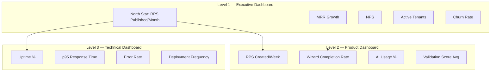
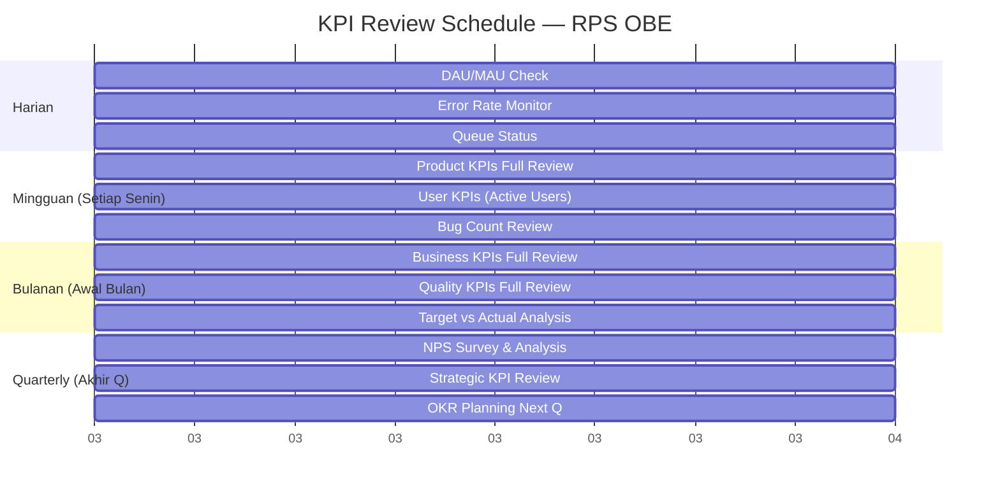
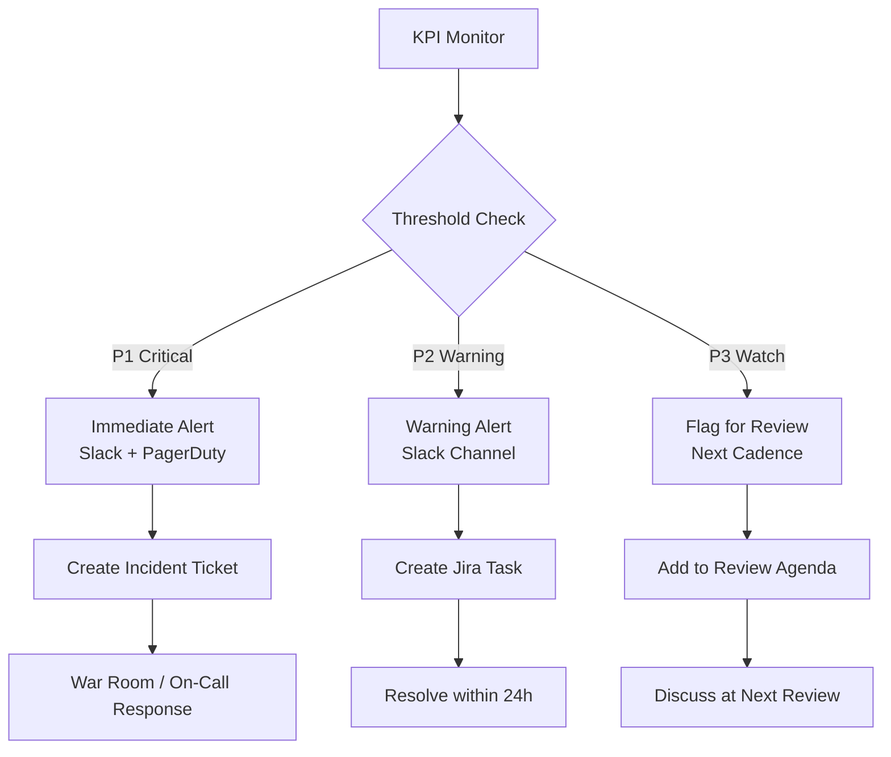

# 46 — KPI

## Ikhtisar

Dokumen KPI (Key Performance Indicators) mendefinisikan dashboard metrik kunci yang digunakan untuk memantau kesehatan dan performa produk RPS OBE secara real-time dan periodik. KPI dikelompokkan ke dalam lima kategori: Product, User, Quality, Business, dan Technical. Setiap KPI memiliki target spesifik dengan timeframe (Bulan 1, 3, 6, 12), klasifikasi Leading vs Lagging, jadwal review, threshold alert, dan ownership yang jelas. Dokumen ini menjadi acuan untuk dashboard monitoring produk yang akan dibangun.

---

## KPI Dashboard Structure

### Dashboard Hierarchy



### Dashboard Access by Role

| Dashboard Level | Superadmin | Admin Tenant | Kaprodi | Dosen | PM | Tech Lead |
|-----------------|------------|--------------|---------|-------|-----|-----------|
| Executive | Full | Tenant-only | Prodi-only | Pribadi | Full | Full |
| Product | Full | Tenant-only | Prodi-only | Pribadi | Full | Full |
| Technical | Full | — | — | — | — | Full |

---

## KPI Categories

### 1. Product KPIs

KPI yang mengukur performa dan adopsi fitur produk.

| KPI ID | KPI | Definisi | Satuan | Sumber Data | Frekuensi Update |
|--------|-----|----------|--------|-------------|------------------|
| PROD-01 | RPS Created per Week | Jumlah RPS baru (status Draft) yang dibuat dalam 7 hari terakhir | Count | Database | Harian |
| PROD-02 | RPS Published per Month | Jumlah RPS yang mencapai status Published dalam 30 hari terakhir | Count | Database | Harian |
| PROD-03 | Wizard Completion Rate | % RPS Draft yang mencapai Step 8 (bukan submit) | % | Analytics funnel | Mingguan |
| PROD-04 | Wizard Step Drop-off | % user yang berhenti di setiap step wizard | % per step | Analytics funnel | Mingguan |
| PROD-05 | AI Feature Usage % | % RPS yang menggunakan minimal 1 fitur AI (generate, validate, review) | % | AI Gateway logs | Mingguan |
| PROD-06 | AI Generate Breakdown | Distribusi penggunaan: Generate CPMK, Sub-CPMK, Assessment, Materi, Referensi | Count per type | AI Gateway logs | Mingguan |
| PROD-07 | AI Validation Score Average | Rata-rata skor total AI Validator untuk semua RPS yang divalidasi | Score (0-100) | AI validation table | Mingguan |
| PROD-08 | Export Count | Jumlah ekspor yang dilakukan (Word + PDF) per minggu | Count | Audit logs | Mingguan |
| PROD-09 | Export Format Split | Perbandingan ekspor Word vs PDF | Count per format | Audit logs | Mingguan |
| PROD-10 | Average RPS Completion Time | Rata-rata waktu dari RPS dibuat hingga pertama kali di-submit | Jam | Database timestamps | Bulanan |
| PROD-11 | Duplicate RPS Usage | Jumlah RPS yang dibuat via fitur Duplikasi | Count | Database | Bulanan |
| PROD-12 | Template Usage | Distribusi template yang digunakan untuk ekspor (default vs kustom) | % per template | Audit logs | Bulanan |

#### Product KPI Targets

| KPI ID | Bulan 1 | Bulan 3 | Bulan 6 | Bulan 12 |
|--------|---------|---------|---------|----------|
| PROD-01 | ≥ 3 RPS/minggu | ≥ 5 RPS/minggu | ≥ 10 RPS/minggu | ≥ 25 RPS/minggu |
| PROD-02 | ≥ 5 RPS/bulan | ≥ 15 RPS/bulan | ≥ 30 RPS/bulan | ≥ 60 RPS/bulan |
| PROD-03 | ≥ 50% | ≥ 60% | ≥ 70% | ≥ 75% |
| PROD-04 | Monitor baseline | < 15% drop-off per step | < 10% drop-off per step | < 8% drop-off per step |
| PROD-05 | N/A (Fase 1) | ≥ 40% | ≥ 60% | ≥ 75% |
| PROD-06 | N/A | Establish baseline | CPMK > Sub-CPMK > Assessment | Optimal distribution |
| PROD-07 | N/A | ≥ 75/100 | ≥ 80/100 | ≥ 85/100 |
| PROD-08 | ≥ 5/minggu | ≥ 15/minggu | ≥ 30/minggu | ≥ 60/minggu |
| PROD-09 | N/A | Monitor baseline | 60% Word, 40% PDF | 50% Word, 50% PDF |
| PROD-10 | < 4 jam | < 4 jam | < 3 jam | < 2 jam |
| PROD-11 | N/A | ≥ 10% RPS baru | ≥ 20% RPS baru | ≥ 25% RPS baru |
| PROD-12 | 100% default | 90% default | 70% default | 60% default |

---

### 2. User KPIs

KPI yang mengukur pertumbuhan, retensi, dan aktivitas pengguna.

| KPI ID | KPI | Definisi | Satuan | Sumber Data | Frekuensi Update |
|--------|-----|----------|--------|-------------|------------------|
| USER-01 | Daily Active Users (DAU) | Pengguna unik yang login dalam 24 jam terakhir | Count | Analytics / Login logs | Harian |
| USER-02 | Weekly Active Users (WAU) | Pengguna unik yang login dalam 7 hari terakhir | Count | Analytics / Login logs | Mingguan |
| USER-03 | Monthly Active Users (MAU) | Pengguna unik yang login dalam 30 hari terakhir | Count | Analytics / Login logs | Bulanan |
| USER-04 | DAU/MAU Ratio (Stickiness) | Rasio pengguna harian terhadap bulanan | % | Kalkulasi | Bulanan |
| USER-05 | New User Registrations | Jumlah pengguna baru yang mendaftar per minggu | Count | Database | Mingguan |
| USER-06 | User Retention — Week 1 | % pengguna baru yang login kembali dalam 7 hari setelah registrasi | % | Cohort analysis | Mingguan |
| USER-07 | User Retention — Week 4 | % pengguna baru yang masih login di minggu ke-4 | % | Cohort analysis | Bulanan |
| USER-08 | User Retention — Month 3 | % pengguna baru yang masih login di bulan ke-3 | % | Cohort analysis | Bulanan |
| USER-09 | Role Distribution | Jumlah pengguna per role (Superadmin, Admin, Kaprodi, Dosen) | Count per role | Database | Bulanan |
| USER-10 | Invitation Acceptance Rate | % invitation yang di-accept (dari total yang dikirim) | % | Database | Bulanan |
| USER-11 | Avg Time to Accept Invitation | Rata-rata waktu dari invitation dikirim hingga user registrasi | Hari | Database | Bulanan |
| USER-12 | Profile Completion Rate | % user yang telah melengkapi profil (foto, gelar, dll) | % | Database | Bulanan |

#### User KPI Targets

| KPI ID | Bulan 1 | Bulan 3 | Bulan 6 | Bulan 12 |
|--------|---------|---------|---------|----------|
| USER-01 | ≥ 5 | ≥ 15 | ≥ 30 | ≥ 50 |
| USER-02 | ≥ 10 | ≥ 20 | ≥ 50 | ≥ 100 |
| USER-03 | ≥ 15 | ≥ 30 | ≥ 80 | ≥ 200 |
| USER-04 | ≥ 20% | ≥ 25% | ≥ 30% | ≥ 30% |
| USER-05 | ≥ 5/minggu | ≥ 8/minggu | ≥ 15/minggu | ≥ 25/minggu |
| USER-06 | ≥ 60% | ≥ 65% | ≥ 70% | ≥ 75% |
| USER-07 | ≥ 40% | ≥ 45% | ≥ 50% | ≥ 55% |
| USER-08 | ≥ 30% | ≥ 35% | ≥ 40% | ≥ 45% |
| USER-09 | Monitor distribution | Monitor | Seimbang sesuai tenant | Seimbang |
| USER-10 | ≥ 80% | ≥ 85% | ≥ 85% | ≥ 90% |
| USER-11 | < 3 hari | < 2 hari | < 2 hari | < 1 hari |
| USER-12 | ≥ 50% | ≥ 60% | ≥ 70% | ≥ 80% |

---

### 3. Quality KPIs

KPI yang mengukur kualitas RPS dan kualitas platform.

| KPI ID | KPI | Definisi | Satuan | Sumber Data | Frekuensi Update |
|--------|-----|----------|--------|-------------|------------------|
| QUAL-01 | Average Alignment Score | Rata-rata skor constructive alignment dari AI Validator | Score (0-100) | AI validation table | Mingguan |
| QUAL-02 | Validation Pass Rate | % RPS yang lulus validasi AI (skor ≥ 70) dari total yang divalidasi | % | AI validation table | Mingguan |
| QUAL-03 | Review Rejection Rate | % RPS yang diminta revisi (Review → Revision) dari total yang direview | % | Workflow history | Bulanan |
| QUAL-04 | First-Pass Approval Rate | % RPS yang disetujui pada review pertama (tanpa revisi) | % | Workflow history | Bulanan |
| QUAL-05 | Average Revision Cycles | Rata-rata jumlah siklus revisi per RPS | Count | Workflow history | Bulanan |
| QUAL-06 | Bug Count — Open P1 (Critical) | Jumlah bug severity Critical yang belum resolved | Count | Bug tracker | Harian |
| QUAL-07 | Bug Count — Open P2 (Major) | Jumlah bug severity Major yang belum resolved | Count | Bug tracker | Harian |
| QUAL-08 | Bug Count — Resolved per Sprint | Jumlah bug yang diselesaikan dalam sprint terakhir | Count | Bug tracker | Per sprint |
| QUAL-09 | Bug Resolution Time | Rata-rata waktu dari bug reported hingga resolved | Jam/Hari | Bug tracker | Bulanan |
| QUAL-10 | Test Coverage % (Backend) | % kode PHP yang tercover oleh unit/feature test | % | PHPUnit CI | Per commit |
| QUAL-11 | CPL Coverage per Prodi | % CPL yang didukung oleh minimal 1 RPS di prodi tersebut | % per prodi | Database query | Bulanan |
| QUAL-12 | Assessment Balance Score | % RPS dengan distribusi bobot assessment yang seimbang | % | AI Validator | Bulanan |

#### Quality KPI Targets

| KPI ID | Bulan 1 | Bulan 3 | Bulan 6 | Bulan 12 |
|--------|---------|---------|---------|----------|
| QUAL-01 | N/A (Fase 1) | ≥ 75/100 | ≥ 80/100 | ≥ 85/100 |
| QUAL-02 | N/A | ≥ 70% | ≥ 80% | ≥ 85% |
| QUAL-03 | Monitor baseline | < 40% | < 30% | < 25% |
| QUAL-04 | Monitor baseline | ≥ 50% | ≥ 60% | ≥ 65% |
| QUAL-05 | Monitor baseline | ≤ 1.5 | ≤ 1.2 | ≤ 1.0 |
| QUAL-06 | 0 | 0 | 0 | 0 |
| QUAL-07 | < 3 | < 5 | < 5 | < 3 |
| QUAL-08 | N/A | ≥ 90% found bugs | ≥ 90% | ≥ 95% |
| QUAL-09 | < 48 jam (P1) | < 24 jam (P1) | < 12 jam (P1) | < 6 jam (P1) |
| QUAL-10 | ≥ 70% | ≥ 70% | ≥ 75% | ≥ 80% |
| QUAL-11 | Monitor baseline | ≥ 70% | ≥ 80% | ≥ 90% |
| QUAL-12 | N/A | ≥ 70% | ≥ 75% | ≥ 80% |

---

### 4. Business KPIs

KPI yang mengukur kesehatan bisnis dan finansial produk.

| KPI ID | KPI | Definisi | Satuan | Sumber Data | Frekuensi Update |
|--------|-----|----------|--------|-------------|------------------|
| BIZ-01 | MRR (Monthly Recurring Revenue) | Total pendapatan berulang bulanan dari semua tenant | Rupiah | Billing system | Bulanan |
| BIZ-02 | MRR Growth Rate | % pertumbuhan MRR bulan ke bulan | % | Kalkulasi | Bulanan |
| BIZ-03 | ARPU (Average Revenue Per Unit) | Rata-rata pendapatan per tenant per bulan | Rupiah | Billing / MRR ÷ tenants | Bulanan |
| BIZ-04 | Customer Churn Rate | % tenant yang berhenti berlangganan per bulan | % | Billing system | Bulanan |
| BIZ-05 | Net Revenue Retention (NRR) | (MRR awal + expansion - churn) ÷ MRR awal | % | Billing system | Bulanan |
| BIZ-06 | NPS (Net Promoter Score) | Skor rekomendasi pengguna (survei 0-10) | Score (-100 to +100) | Survei NPS | Quarterly |
| BIZ-07 | NPS Response Rate | % pengguna yang merespon survei NPS | % | Survei tracking | Quarterly |
| BIZ-08 | Customer Health Score | Skor komposit: usage + support + billing + satisfaction | Score (0-100) | Kalkulasi rule engine | Bulanan |
| BIZ-09 | Support Ticket Volume | Jumlah tiket support yang masuk | Count per bulan | Helpdesk | Bulanan |
| BIZ-10 | Support Ticket by Severity | Distribusi tiket: P1, P2, P3, P4 | Count per severity | Helpdesk | Bulanan |
| BIZ-11 | Time to Resolution (Support) | Rata-rata waktu dari tiket dibuat hingga resolved | Jam/Hari | Helpdesk | Bulanan |
| BIZ-12 | Time to Onboard New Tenant | Waktu dari kontrak hingga tenant siap menggunakan platform | Hari | Onboarding tracker | Per tenant |
| BIZ-13 | Customer Acquisition Cost (CAC) | Total biaya sales & marketing ÷ jumlah tenant baru | Rupiah | Finance | Bulanan |
| BIZ-14 | LTV:CAC Ratio | Lifetime Value ÷ Customer Acquisition Cost | Ratio | Kalkulasi | Bulanan |

#### Business KPI Targets

| KPI ID | Bulan 1 | Bulan 3 | Bulan 6 | Bulan 12 |
|--------|---------|---------|---------|----------|
| BIZ-01 | Rp 10.000.000 | Rp 30.000.000 | Rp 50.000.000 | Rp 150.000.000 |
| BIZ-02 | Baseline | ≥ 15% | ≥ 10% | ≥ 8% |
| BIZ-03 | Rp 10.000.000 | Rp 10.000.000 | Rp 5.000.000 | Rp 5.000.000 (asumsi multi-tenant) |
| BIZ-04 | 0% | < 2% | < 3% | < 5% (annualized) |
| BIZ-05 | 100% | ≥ 100% | ≥ 105% | ≥ 110% |
| BIZ-06 | Monitor baseline | ≥ 40 | ≥ 50 | ≥ 55 |
| BIZ-07 | ≥ 30% | ≥ 40% | ≥ 50% | ≥ 60% |
| BIZ-08 | ≥ 70 | ≥ 75 | ≥ 80 | ≥ 85 |
| BIZ-09 | Monitor baseline | < 30/bulan | < 40/bulan | < 50/bulan (scaling) |
| BIZ-10 | Monitor | < 10% P1 | < 10% P1 | < 5% P1 |
| BIZ-11 | < 48 jam (P1) | < 24 jam (P1) | < 12 jam (P1) | < 8 jam (P1) |
| BIZ-12 | < 5 hari | < 3 hari | < 2 hari | < 1 hari |
| BIZ-13 | Monitor baseline | < Rp 15.000.000 | < Rp 12.000.000 | < Rp 10.000.000 |
| BIZ-14 | N/A | ≥ 3:1 | ≥ 4:1 | ≥ 5:1 |

---

### 5. Technical KPIs

KPI yang mengukur performa, keandalan, dan kecepatan pengiriman teknis.

| KPI ID | KPI | Definisi | Satuan | Sumber Data | Frekuensi Update |
|--------|-----|----------|--------|-------------|------------------|
| TECH-01 | Uptime % | % waktu platform dapat diakses (tidak termasuk maintenance) | % | Uptime monitor (UptimeRobot/Pingdom) | Real-time / Bulanan |
| TECH-02 | p95 Response Time | Waktu respons server pada persentil ke-95 | Milidetik | APM (Laravel Telescope/Scout) | Real-time |
| TECH-03 | p50 Response Time | Waktu respons server pada persentil ke-50 (median) | Milidetik | APM | Real-time |
| TECH-04 | Error Rate | % request yang menghasilkan HTTP 5xx error | % | Application logs; Sentry/Flare | Real-time |
| TECH-05 | AI API Latency (p95) | Waktu respons OpenAI API pada p95 | Milidetik | AI Gateway logs | Real-time |
| TECH-06 | AI API Success Rate | % request ke OpenAI yang berhasil (non-error) | % | AI Gateway logs | Harian |
| TECH-07 | Queue Processing Time | Rata-rata waktu job diproses di queue (export, AI, email) | Detik | Laravel Horizon | Real-time |
| TECH-08 | Queue Pending Jobs | Jumlah job yang menunggu di queue | Count | Laravel Horizon | Real-time |
| TECH-09 | Deployment Frequency | Jumlah deployment ke production per minggu | Count | CI/CD pipeline | Mingguan |
| TECH-10 | Deployment Success Rate | % deployment yang berhasil (tidak rollback) | % | CI/CD pipeline | Bulanan |
| TECH-11 | Mean Time to Recovery (MTTR) | Rata-rata waktu dari insiden terdeteksi hingga resolved | Menit/Jam | Incident management | Per insiden |
| TECH-12 | Database Query Performance | p95 query execution time untuk query paling lambat | Milidetik | Database slow query log | Mingguan |
| TECH-13 | Cache Hit Rate | % request yang dilayani dari cache (Redis) | % | Redis monitoring | Harian |
| TECH-14 | Storage Usage | Total penyimpanan yang digunakan (database + file) | GB | Server monitoring | Bulanan |

#### Technical KPI Targets

| KPI ID | Bulan 1 | Bulan 3 | Bulan 6 | Bulan 12 |
|--------|---------|---------|---------|----------|
| TECH-01 | ≥ 99.5% | ≥ 99.7% | ≥ 99.9% | ≥ 99.95% |
| TECH-02 | < 500 ms | < 400 ms | < 300 ms | < 200 ms |
| TECH-03 | < 200 ms | < 150 ms | < 100 ms | < 80 ms |
| TECH-04 | < 0.5% | < 0.3% | < 0.1% | < 0.05% |
| TECH-05 | N/A | < 5000 ms | < 4000 ms | < 3000 ms |
| TECH-06 | N/A | ≥ 98% | ≥ 99% | ≥ 99.5% |
| TECH-07 | < 30 detik | < 20 detik | < 15 detik | < 10 detik |
| TECH-08 | < 50 | < 100 | < 200 | < 300 (scaling) |
| TECH-09 | 2-3x/minggu | 2-3x/minggu | 3-5x/minggu | Harian |
| TECH-10 | ≥ 90% | ≥ 95% | ≥ 98% | ≥ 99% |
| TECH-11 | < 60 menit | < 45 menit | < 30 menit | < 15 menit |
| TECH-12 | < 200 ms | < 150 ms | < 100 ms | < 50 ms |
| TECH-13 | ≥ 60% | ≥ 70% | ≥ 80% | ≥ 85% |
| TECH-14 | Monitor baseline | Monitor growth | < 50 GB | < 200 GB |

---

## Leading vs Lagging Indicators

### Leading Indicators (Prediktif — Bergerak Sebelum Outcome)

Leading indicators memberikan sinyal awal tentang arah metrik outcome. Jika leading indicator turun, tim dapat mengambil tindakan korektif sebelum lagging indicator terdampak.

| Leading Indicator | Memprediksi Lagging Indicator | Lead Time | Tindakan Jika Turun |
|--------------------|-------------------------------|-----------|---------------------|
| DAU/WAU/MAU | MRR Growth, Churn Rate | 1-3 bulan | Investigasi engagement; fitur baru; onboarding review |
| Wizard Completion Rate | RPS Published/Month | 2-4 minggu | UX review; simplifikasi wizard; panduan in-app |
| AI Feature Usage % | NPS, User Retention | 2-3 bulan | Edukasi fitur AI; improve kualitas output AI; case study |
| New User Registrations | MAU, MRR | 1-2 bulan | Percepat onboarding; kurangi friksi invitation |
| Invitation Acceptance Rate | New User Registrations | 1-2 minggu | Perbaiki email template; follow-up reminder |
| Validation Score Average | First-Pass Approval Rate | 1-2 bulan | Improve AI Validator; training dosen; template guidance |
| p95 Response Time | NPS, Churn Rate | 1-6 bulan | Performance optimization; scaling infrastructure |

### Lagging Indicators (Outcome — Bergerak Setelah Outcome Terjadi)

Lagging indicators mengukur hasil akhir yang sudah terjadi. Ini adalah metrik yang paling penting untuk bisnis tetapi sulit diubah dalam jangka pendek.

| Lagging Indicator | Dipengaruhi Oleh | Review Frequency |
|-------------------|------------------|------------------|
| RPS Published per Month (North Star) | Semua leading indicators di atas | Bulanan |
| MRR / ARR | Tenant count, pricing, churn | Bulanan |
| Customer Churn Rate | NPS, CSAT, product quality, support | Bulanan |
| NPS | User experience, product quality, support | Quarterly |
| LTV | ARPU, retention, churn | Quarterly |
| Test Coverage % | Engineering culture, code review process | Bulanan |
| Uptime % | Infrastructure, monitoring, incident response | Bulanan |

---

## KPI Review Schedule



### Detailed Review Matrix

| Review | KPI yang Direview | Peserta | Format Output |
|--------|-------------------|---------|---------------|
| **Harian (09:15, after Standup)** | TECH-01, TECH-04, TECH-07, TECH-08; PROD-01, PROD-02 | PM, Tech Lead | Slack update; alert jika threshold breached |
| **Mingguan (Senin 10:00)** | PROD (semua), USER-01 s/d 05, QUAL-06 s/d 08, TECH-02 s/d 13 | PM, Tech Lead, Frontend | Weekly KPI Snapshot (Notion/Confluence) |
| **Bulanan (Jumat minggu pertama)** | BIZ (semua), QUAL-01 s/d 05, USER-02 s/d 12, PROD-10 s/d 12 | PM, Tech Lead, Business Lead, Stakeholder | Monthly Health Report (PDF/Slide deck) |
| **Quarterly (Akhir Q)** | Semua KPI + Strategic Review | PM, Tech Lead, CEO, Investor | Quarterly Business Review (QBR) Deck |

---

## Alert Thresholds

### Critical Alerts (P1 — Immediate Action Required)

Kondisi yang membutuhkan tindakan segera (dalam 1 jam).

| KPI | Threshold | Saluran Alert | Eskalasi |
|-----|-----------|---------------|----------|
| Uptime % (TECH-01) | < 99.0% (downtime > 14 menit/hari) | Slack #incident + PagerDuty/Telepon | Tech Lead → CTO |
| Error Rate (TECH-04) | > 2% | Slack #incident + PagerDuty | Tech Lead |
| Queue Pending Jobs (TECH-08) | > 500 jobs tertunda > 10 menit | Slack #backend | Backend 1 |
| Bug P1 Open (QUAL-06) | ≥ 1 bug critical | Slack #product + Jira | PM + Tech Lead |
| AI API Success Rate (TECH-06) | < 90% | Slack #ai | AI Engineer + Backend 1 |

### Warning Alerts (P2 — Action Within 24 Hours)

Kondisi yang membutuhkan perhatian dalam 1 hari kerja.

| KPI | Threshold | Saluran Alert |
|-----|-----------|---------------|
| p95 Response Time (TECH-02) | > 1000 ms selama > 1 jam | Slack #backend |
| Queue Processing Time (TECH-07) | > 60 detik rata-rata | Slack #backend |
| Wizard Completion Rate (PROD-03) | < 40% (mingguan) | Slack #product |
| DAU (USER-01) | Turun > 30% week-over-week | Slack #product |
| Bug P2 Open (QUAL-07) | > 10 bug open | Slack #product |
| Support Ticket Volume (BIZ-09) | > 20 tiket/minggu (lonjakan) | Slack #support |
| NPS (BIZ-06) | < 30 (quarterly) | Slack #business |

### Watch Alerts (P3 — Review at Next Cadence)

Kondisi yang perlu dimonitor tetapi tidak memerlukan tindakan segera.

| KPI | Threshold | Review At |
|-----|-----------|-----------|
| RPS Published/Month (PROD-02) | < 80% target | Monthly review |
| MRR Growth Rate (BIZ-02) | < 10% MoM | Monthly review |
| Churn Rate (BIZ-04) | > 3% bulanan | Monthly review |
| Validation Score Avg (QUAL-01) | < 70/100 | Monthly review |
| First-Pass Approval Rate (QUAL-04) | < 40% | Monthly review |
| Test Coverage (QUAL-10) | < 65% | Per sprint review |
| DAU/MAU Ratio (USER-04) | < 20% | Monthly review |
| Invitation Acceptance (USER-10) | < 70% | Monthly review |

### Alert Flow



---

## KPI Ownership

Setiap KPI memiliki pemilik (owner) yang bertanggung jawab untuk memonitor, melaporkan, dan mengambil tindakan jika KPI di bawah target.

| KPI Group | Primary Owner | Secondary Owner | Responsibility |
|-----------|---------------|-----------------|----------------|
| **Product KPIs (PROD-01 s/d 12)** | Product Manager | Tech Lead | Feature adoption, funnel optimization, user behavior |
| **User KPIs (USER-01 s/d 12)** | Product Manager | Business Lead | User growth, retention, engagement, role distribution |
| **Quality KPIs (QUAL-01 s/d 05)** | Product Manager | QA Engineer | RPS quality, review process, constructive alignment |
| **Quality KPIs (QUAL-06 s/d 12)** | QA Engineer | Tech Lead | Bug management, test coverage, resolution time |
| **Business KPIs (BIZ-01 s/d 14)** | Business Lead | Product Manager | Revenue, growth, customer economics, satisfaction |
| **Technical KPIs (TECH-01 s/d 14)** | Tech Lead | Backend 1 | Platform performance, reliability, infrastructure, deployment |

### RACI Matrix — KPI Management

| Aktivitas | PM | Tech Lead | QA | Business Lead | Backend | Frontend |
|-----------|-----|-----------|-----|---------------|---------|----------|
| Define KPI Targets | R, A | C | C | C | I | I |
| Implement KPI Tracking | I | R, A | I | I | R | R |
| Daily Monitoring | I | R, A | I | I | R | I |
| Weekly Review | R, A | R | C | I | I | I |
| Monthly Review | R, A | R | C | R | I | I |
| Alert Response (P1) | I | R, A | I | I | R | I |
| Threshold Adjustment | R, A | C | C | C | I | I |
| Quarterly Strategic Review | R | R | I | R, A | I | I |

**R = Responsible (pelaksana), A = Accountable (penanggung jawab), C = Consulted (dimintai masukan), I = Informed (diberi tahu)**

---

## KPI Dashboard Wireframe

```
┌──────────────────────────────────────────────────────────────┐
│  RPS OBE — KPI Dashboard                        [Periode] ▼  │
├──────────────────────────────────────────────────────────────┤
│                                                              │
│  ┌──────────┐ ┌──────────┐ ┌──────────┐ ┌──────────┐       │
│  │ RPS      │ │ Active   │ │ NPS      │ │ MRR      │       │
│  │ Published│ │ Tenants  │ │ Score    │ │ Growth   │       │
│  │    45    │ │    12    │ │    +52   │ │  +12.5%  │       │
│  │  ▲ 15%  │ │  ▲ 2    │ │  ▲ 5    │ │  ▲ 2.1%  │       │
│  └──────────┘ └──────────┘ └──────────┘ └──────────┘       │
│                                                              │
│  ┌─────────────────────────┐ ┌─────────────────────────┐    │
│  │ RPS Published Trend     │ │ User Growth             │    │
│  │ (Line Chart — 12 bulan) │ │ (Bar Chart — DAU/WAU/MAU)│   │
│  │                         │ │                         │    │
│  │    /\    /\             │ │  ██                     │    │
│  │   /  \  /  \    /\     │ │  ██ ██                  │    │
│  │  /    \/    \  /  \    │ │  ██ ██ ██               │    │
│  └─────────────────────────┘ └─────────────────────────┘    │
│                                                              │
│  ┌─────────────────────────┐ ┌─────────────────────────┐    │
│  │ Quality Score (Gauge)   │ │ Technical Health        │    │
│  │      82/100             │ │ Uptime    99.95%  ●    │    │
│  │   ┌───────────┐        │ │ p95 Lat   245ms   ●    │    │
│  │   │  ██████░░ │        │ │ Error Rt  0.03%   ●    │    │
│  │   │  ████████ │        │ │ Queue     12 jobs ●    │    │
│  │   └───────────┘        │ │ Cov       76%     ●    │    │
│  └─────────────────────────┘ └─────────────────────────┘    │
│                                                              │
│  ┌──────────────────────────────────────────────────────┐   │
│  │  Alerts (Last 24h)                                    │   │
│  │  ✅ No Critical Alerts                                │   │
│  │  ⚠️ 1 Warning: p95 response time > 800ms (13:45-14:30)│   │
│  └──────────────────────────────────────────────────────┘   │
│                                                              │
└──────────────────────────────────────────────────────────────┘
```

---

**Navigasi:** [Sebelumnya: Success Metrics](45-success-metrics.md) | [Daftar Isi](../README.md) | [Berikutnya: Release Strategy](47-release-strategy.md)
