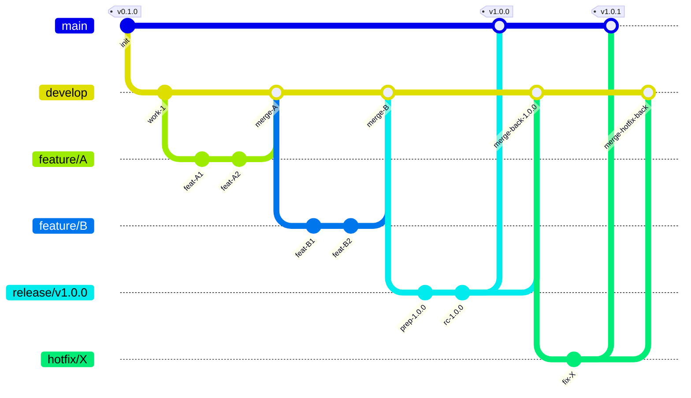
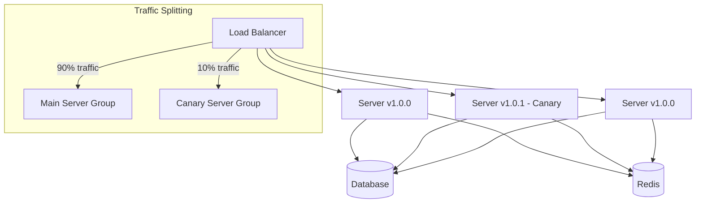

# 47 — Release Strategy

## Ikhtisar

Dokumen ini mendefinisikan strategi rilis produk RPS OBE secara menyeluruh, mencakup jenis rilis, kanal rilis (release channel), alur Git, proses rilis, jadwal rilis untuk fase MVP, komunikasi rilis, rencana rollback, serta strategi feature flags dan canary deployments. Strategi ini memastikan setiap rilis dikelola secara terstruktur, terdokumentasi, dan meminimalkan risiko gangguan terhadap pengguna.

---

## Release Types

RPS OBE mengadopsi Semantic Versioning (SemVer) dengan tiga jenis rilis utama:

### Major Release (X.0.0)

Rilis major menandakan perubahan besar yang tidak kompatibel dengan versi sebelumnya (breaking changes).

| Aspek | Deskripsi |
|-------|-----------|
| Trigger | Arsitektur ulang besar, migrasi database yang tidak backward-compatible, perubahan model data fundamental, atau perubahan lisensi |
| Frekuensi | Sangat jarang, maksimal 1 kali per tahun pada fase mature |
| Contoh | v1.0.0 (rilis produksi pertama), v2.0.0 (platform rewrite) |
| Dampak | Memerlukan migrasi data, pelatihan ulang pengguna, dan pembaruan dokumentasi penuh |

### Minor Release (X.Y.0)

Rilis minor menambahkan fitur baru secara backward-compatible.

| Aspek | Deskripsi |
|-------|-----------|
| Trigger | Fitur baru selesai, modul baru, integrasi pihak ketiga baru |
| Frekuensi | Setiap 2-4 minggu pada fase aktif pengembangan |
| Contoh | v1.1.0 (tambah fitur penilaian formatif), v1.2.0 (tambah integrasi SSO) |
| Dampak | Pembaruan dokumentasi pengguna, changelog, dan opsional pelatihan |

### Patch Release (X.Y.Z)

Rilis patch memperbaiki bug, celah keamanan, atau peningkatan performa minor tanpa fitur baru.

| Aspek | Deskripsi |
|-------|-----------|
| Trigger | Bug kritis, vulnerability keamanan, degradasi performa |
| Frekuensi | Sesuai kebutuhan, hotfix kritis dalam < 4 jam |
| Contoh | v1.0.1 (fix bug export PDF), v1.0.2 (patch keamanan dependensi) |
| Dampak | Tidak memerlukan pelatihan atau dokumentasi tambahan |

### Pre-release Labels

Selain versi utama, digunakan label pre-release untuk rilis pra-produksi:

| Label | Format | Deskripsi |
|-------|--------|-----------|
| Alpha | v0.1.0-alpha | Rilis internal untuk pengujian awal; tidak stabil, fitur belum lengkap |
| Beta | v0.5.0-beta | Rilis untuk pengujian tenant percontohan (pilot); fitur utama sebagian besar berfungsi |
| Release Candidate | v1.0.0-rc.1 | Kandidat rilis produksi; tidak ada fitur baru yang ditambahkan, hanya perbaikan bug kritis |

---

## Release Channels

Setiap kanal rilis memiliki lingkungan, branch, dan target audiens yang berbeda:

### Development Channel (dev branch)

| Aspek | Deskripsi |
|-------|-----------|
| Branch | `develop` |
| Target Lingkungan | Development / Local |
| Audiens | Tim internal (developer, QA, PM) |
| Kestabilan | Tidak stabil; fitur dapat berubah setiap saat |
| Frekuensi Deploy | Setiap push/merge ke develop |
| Otomatisasi | CI: lint + unit test + integration test |

### Staging Channel (staging branch)

| Aspek | Deskripsi |
|-------|-----------|
| Branch | `staging` (dibuat dari `release/*`) |
| Target Lingkungan | Staging Server |
| Audiens | QA, PM, Stakeholder, Pilot Tenant |
| Kestabilan | Semi-stabil; fitur lengkap, sedang dalam pengujian |
| Frekuensi Deploy | Setiap awal siklus pengujian |
| Otomatisasi | CI/CD penuh: lint + test + build + deploy |

### Production Channel (main branch)

| Aspek | Deskripsi |
|-------|-----------|
| Branch | `main` |
| Target Lingkungan | Production Server(s) |
| Audiens | Seluruh tenant dan pengguna akhir |
| Kestabilan | Stabil penuh; hanya kode yang sudah direview dan diuji |
| Frekuensi Deploy | Sesuai jadwal rilis |
| Otomatisasi | CI/CD penuh + smoke test pasca-deploy |

---

## Git Flow

RPS OBE menggunakan model branching Git Flow yang telah dimodifikasi untuk mendukung pengembangan multi-tenant dan rilis bertahap.

### Struktur Branch

| Branch | Tujuan | Lifetime | Sumber Merge | Target Merge |
|--------|--------|----------|-------------|--------------|
| `main` | Kode produksi stabil | Permanen | `release/*`, `hotfix/*` | — |
| `develop` | Integrasi fitur yang sedang dikembangkan | Permanen | `feature/*`, `release/*`, `hotfix/*` | — |
| `feature/*` | Pengembangan fitur baru | Sementara | — | `develop` |
| `release/*` | Persiapan rilis | Sementara | `develop` | `main`, `develop` |
| `hotfix/*` | Perbaikan darurat produksi | Sementara | `main` | `main`, `develop` |

### Konvensi Penamaan Branch

```
feature/<nomor-tiket>-<deskripsi-singkat>
Contoh: feature/RPS-123-rps-builder-wizard

release/v<versi>
Contoh: release/v1.0.0

hotfix/<nomor-tiket>-<deskripsi-singkat>
Contoh: hotfix/RPS-456-fix-export-pdf-error
```

### Diagram Git Flow



### Aturan Branch Protection

| Branch | Aturan |
|--------|--------|
| `main` | Tidak boleh push langsung; wajib Pull Request dengan minimal 2 approval; semua CI checks harus lulus; branch harus up-to-date sebelum merge |
| `develop` | Tidak boleh push langsung; wajib Pull Request dengan minimal 1 approval; CI checks harus lulus |
| `release/*` | Hanya dibuat oleh Release Manager; hanya bug fix yang diizinkan; wajib PR |
| `feature/*` | Bebas push; direkomendasikan PR untuk diskusi |

---

## Release Process

Proses rilis terstruktur dari tahap persiapan hingga monitoring pasca-rilis:

### Timeline Rilis

| Hari | Aktivitas | Penanggung Jawab |
|------|-----------|------------------|
| H-5 | Rilis candidate dipilih; daftar fitur difinalisasi | Product Manager |
| H-4 | Feature freeze — tidak ada fitur baru yang dimasukkan | Tech Lead |
| H-3 | Branch `release/vX.Y.Z` dibuat dari `develop` | Release Manager |
| H-2 | QA Regression Testing dimulai (2 hari) | QA Lead |
| H-1 | Code freeze — hanya bug kritis yang diperbaiki; RC build dilakukan | Tech Lead |
| H-0 (Hari Rilis) | Staging deployment; smoke testing; production deployment (low-traffic window) | DevOps + Release Manager |
| H+1 s/d H+7 | Post-release monitoring (24 jam intensif, dilanjutkan observasi 7 hari) | DevOps + Support |

### Feature Freeze (H-4)

- Semua feature branch yang sudah selesai harus sudah di-merge ke `develop`
- Tidak ada fitur baru yang diizinkan untuk di-merge
- Fokus pada stabilisasi, bug fixing, dan polishing
- Product Manager melakukan final review terhadap scope rilis

### Code Freeze (H-1)

- Tidak ada perubahan kode kecuali perbaikan bug P0 (Critical)
- Perbaikan bug P0 harus mendapat persetujuan Tech Lead dan Product Manager
- Semua tes harus lulus sebelum RC build
- Changelog, release notes, dan dokumentasi difinalisasi

### QA Regression Testing (H-2 hingga H-1)

Durasi: 2 hari kerja penuh.

| Hari QA | Aktivitas | Tool |
|---------|-----------|------|
| Hari 1 | Regression test suite lengkap (automated) | Pest / PHPUnit |
| Hari 1 | Critical path manual test | Manual checklist |
| Hari 2 | Browser / E2E test | Laravel Dusk |
| Hari 2 | Bug fix verification | JIRA / Linear |
| Hari 2 | Sign-off QA | QA Report |

**Regression Test Suite mencakup:**

1. Autentikasi (login, register, password reset, SSO)
2. CRUD semua master data
3. RPS Builder (semua step, validasi, auto-save)
4. Workflow (semua transisi state)
5. AI features (mock OpenAI API)
6. Export (Word & PDF)
7. Notifikasi (email & in-app)
8. Permission matrix (semua role)
9. Multi-tenant isolation

### Staging Deployment

1. Deploy RC build ke staging server menggunakan `php artisan deploy` atau Envoyer
2. Verifikasi environment variables dan koneksi layanan (DB, Redis, S3)
3. Jalankan migrasi database di staging (verifikasi tidak ada error)
4. Clear semua cache (OPcache, config, route, view)
5. Restart queue workers

### Smoke Testing

| Area | Test | Durasi |
|------|------|--------|
| Autentikasi | Login/logout sebagai berbagai role | 5 menit |
| Dashboard | Load dashboard tanpa error (Console, Network tab) | 5 menit |
| Critical Path | Buat RPS → Isi step → Validasi → Submit → Review → Approve → Publish | 20 menit |
| Export | Unduh RPS sebagai Word dan PDF | 5 menit |
| API Health | Cek endpoint `/api/health`, `/api/ping` | 2 menit |
| Horizon | Dashboard Horizon queue worker | 2 menit |
| **Total** | | **±40 menit** |

### Production Deployment

| Langkah | Deskripsi | Estimasi |
|---------|-----------|----------|
| 1. Announcement | Notifikasi pemeliharaan ke semua tenant (minimal 24 jam sebelumnya) | H-1 |
| 2. Maintenance Mode | `php artisan down --secret="<token>" --retry=60` | Mulai |
| 3. Backup Database | Snapshot database produksi | 2 menit |
| 4. Pull Kode | `git pull origin main` atau deploy via Envoyer | 1 menit |
| 5. Install Dependensi | `composer install --no-dev --optimize-autoloader` | 2 menit |
| 6. Build Assets | `npm ci && npm run build` | 3 menit |
| 7. Migrasi DB | `php artisan migrate --force` | 1 menit |
| 8. Konfigurasi Cache | `php artisan optimize` (config, route, view, event) | 1 menit |
| 9. Restart Queue | `php artisan horizon:terminate` (restart graceful) | 1 menit |
| 10. Clear OPcache | `cachetool opcache:reset` | 1 menit |
| 11. Disable Maintenance | `php artisan up` | — |
| 12. Smoke Test | Jalankan smoke test di produksi | 5 menit |
| 13. Notifikasi | Umumkan rilis selesai ke semua tenant | — |

**Low-Traffic Window:** Deployment dijadwalkan pada:
- Hari: Sabtu atau Minggu
- Waktu: 01.00 — 04.00 WIB (GMT+7)

### Post-Release Monitoring

| Periode | Aktivitas | Durasi |
|---------|-----------|--------|
| 24 Jam Pertama | Monitoring intensif oleh DevOps + Support on-call | 24 jam |
| Hari 1-3 | Check error logs, Sentry alerts, dashboard performa setiap 4 jam | Intermiten |
| Hari 4-7 | Observasi harian pada metrik utama | 1x/hari |
| Hari 7 | Retrospeksi rilis dan dokumentasi lessons learned | 1 sesi |

**Hal yang dimonitor:**

- Error rate (Sentry / Flare)
- Response time (p50, p95, p99)
- Server resource (CPU, memory, disk)
- Queue jobs (failed jobs count)
- Customer support tickets
- Database slow queries
- CDN cache hit ratio

---

## Release Schedule for MVP Phase

### Timeline MVP (14 Minggu)

| Minggu | Versi | Channel | Target | Fitur Utama |
|--------|-------|---------|--------|-------------|
| **Week 1-3** | — | develop | Development | Setup project, arsitektur dasar |
| **Week 4** | v0.1.0-alpha | develop | Internal Demo | Multi-tenant core, auth, user management |
| **Week 5-7** | — | develop | Development | RPS Builder wizard (step 1-4), master data |
| **Week 8** | v0.5.0-beta | staging | Pilot Tenant Testing | RPS Builder lengkap (step 1-8), export Word |
| **Week 9-11** | — | develop | Development | AI features, review workflow, export PDF |
| **Week 12** | v1.0.0-rc | staging | Release Candidate | Full feature set, regression tested |
| **Week 13** | — | staging | Final QA | Bug fix, performance tuning |
| **Week 14** | v1.0.0 | production | Production Release | Go-live ke tenant produksi |

### Detail Setiap Rilis MVP

#### v0.1.0-alpha (Week 4) — Internal Demo

| Aspek | Deskripsi |
|-------|-----------|
| **Tujuan** | Validasi arsitektur, multi-tenant, dan integrasi dasar |
| **Audiens** | Tim internal (PM, Tech Lead, Developer, Desainer) |
| **Fitur Termasuk** | Multi-tenant database, autentikasi (login, register, password reset), manajemen user & role, manajemen tenant oleh Superadmin, UI/UX dasar (layout, navigasi) |
| **Fitur Tidak Termasuk** | RPS Builder, AI, workflow, export, notifikasi, dashboard |
| **Kriteria Sukses** | Semua user dapat login dengan role berbeda; tenant isolation berfungsi; tidak ada error kritis |
| **Demo Format** | Presentasi 30 menit + sesi hands-on 60 menit |

#### v0.5.0-beta (Week 8) — Pilot Tenant Testing

| Aspek | Deskripsi |
|-------|-----------|
| **Tujuan** | Validasi fitur inti dengan pengguna nyata |
| **Audiens** | 2-3 program studi percontohan (pilot) |
| **Fitur Termasuk** | RPS Builder wizard lengkap (8 step), semua master data, export Word, semua modul CRUD |
| **Fitur Tidak Termasuk** | AI features, workflow review/approval penuh, export PDF, template kustom |
| **Kriteria Sukses** | Setiap pilot tenant berhasil membuat minimal 1 RPS lengkap; NPS dari pilot tenant >= 30 |
| **Pengujian** | UAT (User Acceptance Testing) dipandu selama 3-5 hari kerja |

#### v1.0.0-rc (Week 12) — Release Candidate

| Aspek | Deskripsi |
|-------|-----------|
| **Tujuan** | Validasi seluruh fitur sebelum produksi |
| **Audiens** | QA, PM, Stakeholder, Pilot Tenant yang diperluas |
| **Fitur Termasuk** | Semua fitur MVP: AI generate, AI validate, workflow review & approval, export Word & PDF, template kustom, dashboard, notifikasi email & in-app |
| **Kriteria Sukses** | Zero P0/P1 bugs; regression test suite 100% lulus; E2E critical path lulus 100% |
| **Durasi QA** | 5-7 hari kerja (diperpanjang dari 2 hari standar) |

#### v1.0.0 (Week 14) — Production Release

| Aspek | Deskripsi |
|-------|-----------|
| **Tujuan** | Go-live ke tenant produksi |
| **Audiens** | Semua tenant RPS OBE |
| **Kriteria Sukses** | Deploy berhasil tanpa rollback; error rate < 1%; semua smoke test lulus; zero P0 bugs dalam 72 jam |
| **Support** | Tim on-call 24/7 untuk 7 hari pertama |

---

## Release Communication

### Changelog

Setiap rilis wajib memiliki changelog dengan format standar [Keep a Changelog](https://keepachangelog.com/):

```markdown
# Changelog

## [1.0.1] - 2026-03-15

### Added
- Fitur ekspor PDF dengan template kustom

### Changed
- Optimasi query dashboard Prodi (50% lebih cepat)

### Deprecated
- Endpoint API v1 `/api/rps/legacy` akan dihapus di v1.2.0

### Removed
- Dukungan browser IE11 (sesuai kebijakan Microsoft EOL)

### Fixed
- Bug validasi CPL saat RPS di-submit oleh Dosen baru (#RPS-456)
- Null pointer exception pada ekspor Word ketika RPS kosong (#RPS-457)

### Security
- Update dependensi Laravel ke 10.x untuk patch CVE-2026-XXXX
```

### Release Notes

Release notes ditulis dalam Bahasa Indonesia dengan format yang mudah dipahami pengguna non-teknis:

1. **Judul:** Ringkasan fitur utama dalam 1 kalimat
2. **Highlight:** 3-5 fitur baru yang paling berdampak
3. **Detail Fitur:** Penjelasan singkat setiap fitur baru dengan screenshot/GIF
4. **Perbaikan Bug:** Daftar bug utama yang diperbaiki
5. **Breaking Changes:** Jika ada, dengan panduan migrasi
6. **Known Issues:** Bug yang diketahui dan workaround-nya

### Email Notification ke Pengguna

| Waktu Pengiriman | Isi | Segmentasi |
|------------------|-----|------------|
| H-3 sebelum rilis | Pengumuman pemeliharaan terjadwal (waktu, durasi, dampak) | Semua tenant admin |
| H-1 sebelum rilis | Reminder pemeliharaan + preview fitur baru | Semua tenant admin |
| Hari rilis (setelah deploy) | Pengumuman rilis selesai + link release notes | Semua pengguna |
| Hari rilis | Panduan "Apa yang Baru" untuk fitur spesifik | Pengguna yang terdampak fitur baru |

### In-App Notification

Setelah rilis sukses, tampilkan banner di dashboard:
- "RPS OBE v1.0.1 telah dirilis! Lihat [Apa yang Baru](#)."
- Banner ditampilkan selama 7 hari atau hingga user klik dismiss
- Hanya muncul 1 kali per user per rilis

---

## Rollback Plan

### Kriteria Rollback

Rollback dilakukan jika ditemukan salah satu kondisi berikut:

| Level | Kondisi | Waktu Respon |
|-------|---------|-------------|
| **P0 — Critical** | Sistem tidak dapat diakses (downtime > 5 menit); data corruption; kebocoran data; transaksi gagal > 5% | < 15 menit |
| **P1 — High** | Fitur utama tidak berfungsi (RPS Builder tidak bisa create/submit); export gagal untuk semua user; workflow approval rusak | < 60 menit (fix forward) atau rollback |
| **P2 — Medium** | Bug mengganggu tapi ada workaround; fitur non-kritis rusak; penurunan performa < 50% | < 4 jam (fix forward) |
| **P3 — Low** | Bug kosmetik; typo; minor UI issue | Rilis berikutnya |

### Prosedur Rollback

```
1. DECISION              → Tech Lead + Product Manager setujui rollback
2. NOTIFICATION           → Tim DevOps dan support di-notifikasi
3. MAINTENANCE MODE       → php artisan down --retry=60
4. DATABASE ROLLBACK      → php artisan migrate:rollback --step=<N>
                             (atau restore dari snapshot jika diperlukan)
5. CODE ROLLBACK           → git checkout <tag-sebelumnya>
                             atau deploy artifact versi sebelumnya
6. CACHE CLEAR             → php artisan optimize:clear + reset OPcache
7. ASSET RESTORE           → Restore aset build sebelumnya dari backup CI artifact
8. QUEUE RESTART           → php artisan horizon:terminate
9. DISABLE MAINTENANCE     → php artisan up
10. VERIFICATION           → Jalankan smoke test
11. NOTIFICATION           → Umumkan rollback selesai ke stakeholder
12. POST-MORTEM            → Document root cause, impact, timeline
```

### Rollback Database

| Skenario | Metode | RTO (Recovery Time Objective) |
|----------|--------|------|
| Migrasi sederhana (tabel baru, kolom baru) | `php artisan migrate:rollback` | 2 menit |
| Migrasi dengan data transformasi | Restore dari database snapshot pra-deploy | 15 menit |
| Data corruption | Restore dari backup terbaru + replay binlog | 30 menit |

---

## Feature Flags Strategy

Feature flags digunakan untuk melakukan gradual rollout dan mengurangi risiko rilis.

### Kategori Feature Flags

| Kategori | Contoh | Lifetime | Pengelola |
|----------|--------|----------|-----------|
| **Release Toggle** | `ai_validate_enabled`, `pdf_export_enabled` | Beberapa minggu (dihapus setelah stabil) | Developer |
| **Experiment Toggle** | `new_dashboard_ui`, `wizard_v2` | Beberapa minggu (A/B test) | Product + Developer |
| **Ops Toggle** | `maintenance_mode_features`, `degrade_ai_service` | Permanen atau jangka panjang | DevOps |
| **Permission Toggle** | `beta_access`, `pilot_tenant` | Beberapa bulan (terkait paket/langganan) | Product |

### Implementasi

Feature flags diimplementasikan menggunakan package Laravel Pennant:

```php
// Definisi flag
Feature::define('ai-validate', function (User $user) {
    return $user->tenant->plan === 'pro';
});

// Penggunaan di kode
if (Feature::active('ai-validate')) {
    // Tampilkan tombol AI Validasi
}

// Penggunaan di Blade
@feature('ai-validate')
    <x-ai-validate-button />
@endfeature
```

### Gradual Rollout dengan Feature Flags

| Fase | Target | Durasi | Action |
|------|--------|--------|--------|
| **Internal** | Tim internal (5-10 orang) | 1-3 hari | Aktifkan flag via user ID |
| **Canary** | 5% tenant (pilot) | 2-3 hari | Aktifkan flag via tenant sampling |
| **Beta** | 25% tenant | 3-5 hari | Aktifkan flag via tenant random sampling |
| **General Availability** | 100% | — | Hapus flag, kode menjadi permanen |

---

## Canary Deployments (Future)

### Overview

Canary deployment adalah strategi merilis versi baru secara bertahap ke subset server atau user sebelum dirilis ke seluruh user. Ini direncanakan sebagai peningkatan dari strategi rilis saat ini (future roadmap).

### Arsitektur Canary (Future)



### Rencana Implementasi Canary

| Fase | Timeline | Deskripsi |
|------|----------|-----------|
| **Fase 0 — Infrastructure** | Year 1 | Setup load balancer dengan traffic splitting (NGINX / HAProxy) |
| **Fase 1 — Basic Canary** | Year 1 | Canary 10% traffic ke 1 server baru, observasi 6 jam, proceed atau rollback |
| **Fase 2 — Advanced Canary** | Year 2 | Canary otomatis dengan metrik (error rate, latency); auto-rollback jika threshold terlampaui |
| **Fase 3 — Multi-Region** | Year 2 | Canary per region (Asia tenggara, global) |

---

## Release Governance

### Roles dan Tanggung Jawab

| Role | Tanggung Jawab |
|------|----------------|
| **Release Manager** | Mengelola timeline rilis, koordinasi antar tim, memastikan semua checklist terpenuhi, otorisasi GO/NO-GO |
| **Product Manager** | Menentukan scope rilis, prioritas fitur, final sign-off kualitas produk |
| **Tech Lead** | Technical sign-off, review kode rilis, memastikan kualitas teknis |
| **QA Lead** | Menyusun test plan, memimpin regression testing, QA sign-off |
| **DevOps Engineer** | Menyiapkan environment, menjalankan deployment, monitoring pasca-rilis |
| **Support Lead** | Menyiapkan dokumentasi pengguna, support on-call selama rilis |

### Go / No-Go Checklist

| No | Kriteria | Status |
|----|----------|--------|
| 1 | Semua fitur yang direncanakan selesai dan diuji | ☐ |
| 2 | Regression test suite 100% lulus | ☐ |
| 3 | E2E test critical path lulus 100% | ☐ |
| 4 | Zero P0 bugs | ☐ |
| 5 | Semua P1 bugs memiliki workaround yang terdokumentasi | ☐ |
| 6 | Changelog dan release notes ditulis dan direview | ☐ |
| 7 | Email notifikasi siap dikirim | ☐ |
| 8 | Rollback plan diverifikasi (snapshot DB valid) | ☐ |
| 9 | Tim on-call dijadwalkan dan tersedia | ☐ |
| 10 | Semua stakeholder telah menyetujui (sign-off) | ☐ |

### Post-Release Retrospective

Setiap rilis diakhiri dengan retrospeksi (dalam 3-5 hari setelah rilis):

| Agenda | Durasi | Output |
|--------|--------|--------|
| Apa yang berjalan baik | 10 menit | Praktik yang perlu dipertahankan |
| Apa yang perlu diperbaiki | 10 menit | Action items untuk perbaikan |
| Metrik rilis | 5 menit | Review metrik (downtime, bugs ditemukan, waktu deploy) |
| Action items | 5 menit | Assignee + due date |

---

**Navigasi:** [Sebelumnya: KPI](46-kpi.md) | [Daftar Isi](../README.md) | [Berikutnya: Deployment Strategy](48-deployment-strategy.md)
