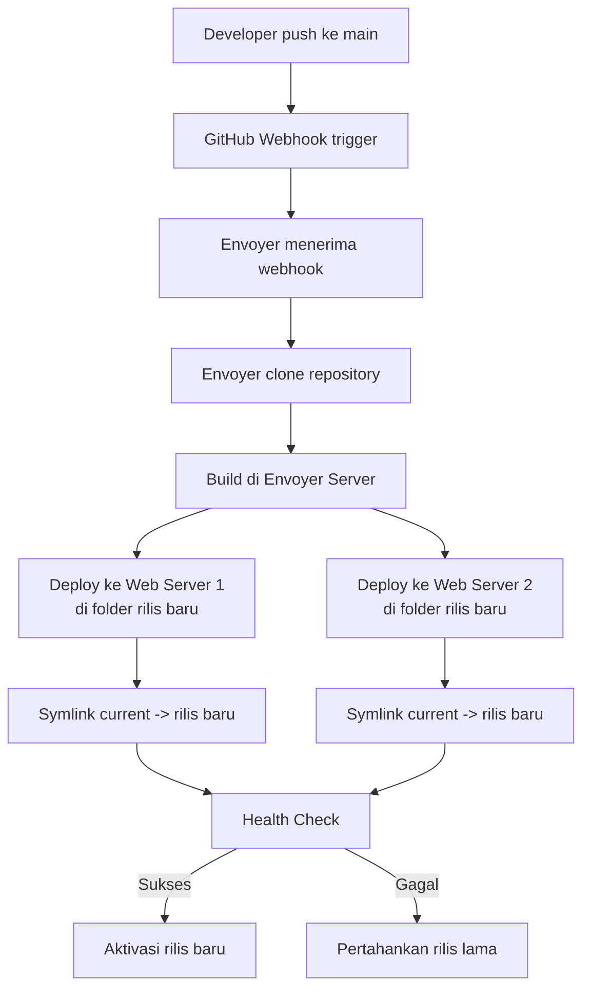
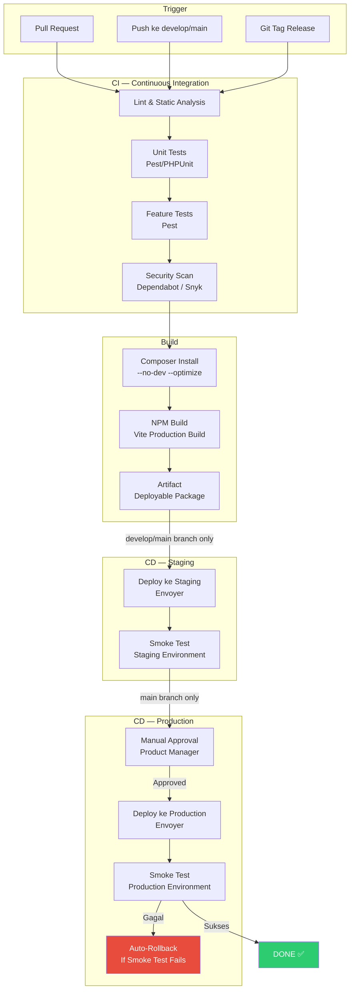
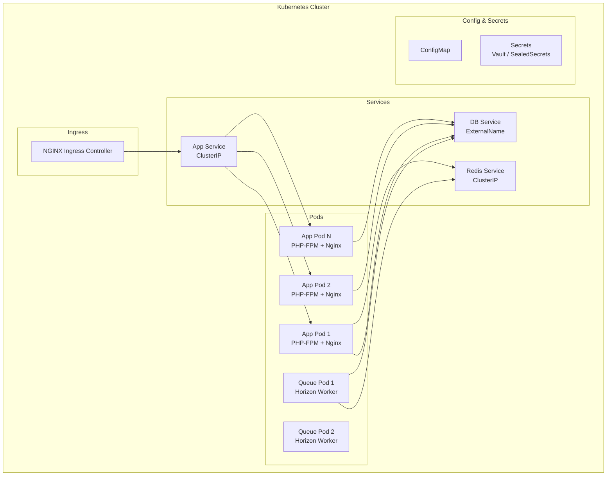
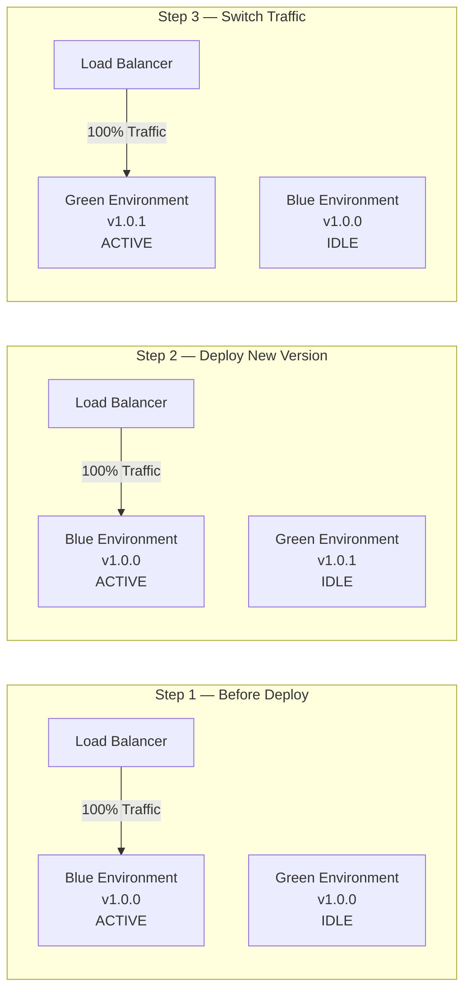

# 48 — Deployment Strategy

## Ikhtisar

Dokumen ini mendefinisikan strategi deployment RPS OBE secara menyeluruh, mencakup arsitektur infrastruktur di setiap lingkungan, tools deployment zero-downtime, pipeline CI/CD, manajemen environment dan secrets, strategi migrasi database tanpa downtime, manajemen cache, deployment queue worker, penanganan scheduled tasks, manajemen SSL/TLS, konfigurasi DNS, serta rencana containerization dan blue-green deployment untuk masa mendatang. Strategi ini memastikan setiap deployment dilakukan secara aman, cepat, dan tanpa mengganggu pengguna.

---

## Infrastructure

### Production Environment

Infrastruktur produksi dirancang untuk high availability (HA) dan skalabilitas horizontal.

```mermaid
graph TD
    subgraph "User"
        U[Browser/Mobile]
    end
    
    subgraph "DNS & CDN"
        DNS[Cloudflare DNS]
        CDN[Cloudflare CDN]
    end
    
    subgraph "Load Balancer"
        LB[Nginx / HAProxy Load Balancer]
    end
    
    subgraph "Web Tier — 2+ Servers"
        W1[Web Server 1<br/>Nginx + PHP-FPM 8.2<br/>Laravel 10.x]
        W2[Web Server 2<br/>Nginx + PHP-FPM 8.2<br/>Laravel 10.x]
    end
    
    subgraph "Queue Tier — 1+ Servers"
        Q1[Queue Worker 1<br/>Laravel Horizon]
        Q2[Queue Worker 2<br/>Laravel Horizon]
    end
    
    subgraph "Cache Tier"
        R1[Redis Primary<br/>Cache + Session + Queue]
        R2[Redis Replica]
    end
    
    subgraph "Database Tier"
        DB1[(MySQL 8.0 Primary<br/>RDS / Managed DB)]
        DB2[(MySQL 8.0 Replica<br/>Read Replica)]
    end
    
    subgraph "Storage Tier"
        S3[Object Storage<br/>S3-Compatible<br/>MinIO / AWS S3 / DO Spaces]
    end
    
    subgraph "Monitoring & Logging"
        S[Sentry / Flare<br/>Error Tracking]
        G[Grafana + Prometheus<br/>Metrics]
        T[Telescope<br/>Debugging - Dev Only]
    end
    
    U --> DNS
    DNS --> CDN
    CDN --> LB
    LB --> W1
    LB --> W2
    W1 --> R1
    W2 --> R1
    W1 --> DB1
    W2 --> DB1
    W1 --> DB2
    W2 --> DB2
    W1 --> S3
    W2 --> S3
    Q1 --> R1
    Q2 --> R1
    Q1 --> DB1
    Q2 --> DB1
    Q1 --> S3
    Q2 --> S3
    DB1 --> DB2
    R1 --> R2
    W1 --> S
    W2 --> S
    Q1 --> G
    Q2 --> G
```



### Spesifikasi Minimum Server

| Komponen | Spesifikasi | Kuantitas | Catatan |
|----------|-------------|-----------|---------|
| **Web Server** | 4 vCPU, 8 GB RAM, 80 GB SSD | 2 (minimal) | Auto-scaling ke 4 saat traffic tinggi |
| **Database Primary** | 8 vCPU, 16 GB RAM, 200 GB SSD | 1 | Managed MySQL 8.0; daily automated backup |
| **Database Replica** | 4 vCPU, 8 GB RAM, 200 GB SSD | 1 | Read replica; dapat dipromosikan menjadi primary |
| **Redis Server** | 2 vCPU, 4 GB RAM, 20 GB SSD | 1 (primary) + 1 (replica) | Managed Redis atau self-hosted dengan Sentinel |
| **Queue Worker** | 2 vCPU, 4 GB RAM, 40 GB SSD | 1 (minimal) | Auto-scaling saat queue backlog tinggi |
| **Object Storage** | Sesuai kebutuhan | Managed | S3-compatible (AWS S3, DO Spaces, MinIO) |
| **CDN** | Sesuai traffic | Managed | Cloudflare Pro atau sejenisnya |

### Staging Environment

Staging adalah mirror dari produksi dalam skala lebih kecil.

| Komponen | Spesifikasi | Kuantitas |
|----------|-------------|-----------|
| Web Server | 2 vCPU, 4 GB RAM, 40 GB SSD | 1 |
| Database | 2 vCPU, 4 GB RAM, 80 GB SSD | 1 |
| Redis | 1 vCPU, 2 GB RAM, 20 GB SSD | 1 |
| Queue Worker | 1 vCPU, 2 GB RAM, 20 GB SSD | 1 |
| Object Storage | Bucket terpisah (staging) | 1 |

**Perbedaan Staging vs Production:**

| Aspek | Staging | Production |
|-------|---------|------------|
| Data | Data anonim/tiruan; di-refresh dari production (anonymized) bulanan | Data asli |
| Email | Semua email diarahkan ke mailtrap/mailhog | Email asli terkirim |
| AI | Menggunakan sandbox/test API key OpenAI | Production API key |
| Monitoring | Dasar | Penuh (Sentry + Grafana) |
| Debugging | Debug mode ON, Telescope enabled | Debug mode OFF |
| Penjadwalan | Tidak ada cron job otomatis | Penuh |

### Development Environment (Local)

```yaml
# arsitektur docker-compose.yml
services:
  app:
    build: ./
    volumes:
      - ./:/var/www/html
    ports:
      - "8080:80"
    depends_on:
      - mysql
      - redis
      - minio
      - mailhog

  mysql:
    image: mysql:8.0
    environment:
      MYSQL_ROOT_PASSWORD: password
      MYSQL_DATABASE: rps_obe
      MYSQL_USER: rps
      MYSQL_PASSWORD: secret
    ports:
      - "3306:3306"
    volumes:
      - mysql_data:/var/lib/mysql

  redis:
    image: redis:7-alpine
    ports:
      - "6379:6379"

  minio:
    image: minio/minio
    ports:
      - "9000:9000"
      - "9001:9001"
    environment:
      MINIO_ROOT_USER: minioadmin
      MINIO_ROOT_PASSWORD: minioadmin
    command: server /data --console-address ":9001"

  mailhog:
    image: mailhog/mailhog
    ports:
      - "1025:1025"
      - "8025:8025"
```

---

## Deployment Tools

### Pilihan Tools

| Tool | Kelebihan | Kekurangan | Rekomendasi |
|------|-----------|------------|-------------|
| **Laravel Forge** | Mudah digunakan; provisioning server otomatis; integrasi dengan cloud provider | Tidak menangani zero-downtime deployment natively | Untuk provisioning dan manajemen server |
| **Laravel Envoyer** | Zero-downtime deployment; multi-server deployment; rollback otomatis; health check | Berbayar; memerlukan Forge untuk provisioning | **Pilihan utama** untuk deployment zero-downtime |
| **Deployer** | Open-source; PHP native; sangat fleksibel; mendukung zero-downtime; recipe Laravel built-in | Memerlukan konfigurasi manual; tidak ada GUI | Alternatif jika menginginkan self-hosted |

### Arsitektur Deployment dengan Envoyer



### Zero-Downtime Deployment dengan Envoyer

Envoyer menggunakan atomic symlink deployment:

1. Kode di-clone ke folder baru: `/home/forge/site.com/releases/20260802120000/`
2. Semua hook dijalankan (composer install, npm build, migrate, cache)
3. Symlink `current` di-update secara atomik ke folder rilis baru
4. PHP-FPM dan OPcache tidak terpengaruh (tidak perlu restart)
5. Jika health check gagal, symlink tidak diubah (tetap di rilis lama)

### Deployment Hooks (Envoyer)

```bash
# Install Dependencies
cd {{release}}
composer install --no-interaction --prefer-dist --optimize-autoloader --no-dev

# Build Frontend Assets
npm ci
npm run build

# Database Migrations
php artisan migrate --force

# Cache Optimization
php artisan optimize

# Restart Queue Workers Gracefully
php artisan horizon:terminate

# Clear OPcache (opsional, karena Envoyer menggunakan symlink)
# cachetool opcache:reset --fcgi=/var/run/php/php8.2-fpm.sock

# Health Check
php artisan health:check
```

---

## CI/CD Pipeline

### Pipeline Tools

| Tool | Kelebihan | Rekomendasi |
|------|-----------|-------------|
| **GitHub Actions** | Terintegrasi dengan GitHub; 2000+ actions marketplace; free tier untuk public repo; self-hosted runner tersedia | **Pilihan utama** |
| **GitLab CI** | Built-in container registry; integrated SAST/DAST; lebih mature untuk enterprise | Alternatif jika menggunakan GitLab |

### CI/CD Pipeline Diagram



### GitHub Actions Workflow

```yaml
# .github/workflows/ci.yml
name: CI — Lint, Test, Build

on:
  pull_request:
    branches: [develop, main]
  push:
    branches: [develop, main]

jobs:
  lint:
    runs-on: ubuntu-latest
    steps:
      - uses: actions/checkout@v4
      - uses: shivammathur/setup-php@v2
        with:
          php-version: '8.2'
          extensions: mbstring, bcmath, pdo_mysql, redis
      - run: composer install --no-interaction --prefer-dist
      - run: ./vendor/bin/pint --test
      - run: ./vendor/bin/phpstan analyse --level=5

  test:
    needs: lint
    runs-on: ubuntu-latest
    services:
      mysql:
        image: mysql:8.0
        env:
          MYSQL_ROOT_PASSWORD: password
          MYSQL_DATABASE: rps_obe_test
        ports:
          - 3306:3306
      redis:
        image: redis:7-alpine
        ports:
          - 6379:6379
    steps:
      - uses: actions/checkout@v4
      - uses: shivammathur/setup-php@v2
        with:
          php-version: '8.2'
          extensions: mbstring, bcmath, pdo_mysql, redis
      - run: composer install --no-interaction --prefer-dist
      - run: cp .env.ci .env
      - run: php artisan key:generate
      - run: php artisan migrate --env=testing
      - run: php artisan test --parallel --coverage --min=80

  security:
    needs: lint
    runs-on: ubuntu-latest
    steps:
      - uses: actions/checkout@v4
      - name: Dependabot / Snyk Scan
        run: npm audit --audit-level=high

  build:
    needs: [test, security]
    if: github.ref == 'refs/heads/develop' || github.ref == 'refs/heads/main'
    runs-on: ubuntu-latest
    steps:
      - uses: actions/checkout@v4
      - run: composer install --no-dev --optimize-autoloader --no-interaction
      - uses: actions/setup-node@v4
        with:
          node-version: '20'
      - run: npm ci
      - run: npm run build
      - uses: actions/upload-artifact@v4
        with:
          name: build-${{ github.sha }}
          path: |
            vendor/
            public/build/
            bootstrap/
            app/
            config/
            database/
            resources/
            routes/
            artisan
            composer.json
            composer.lock

  deploy-staging:
    needs: build
    if: github.ref == 'refs/heads/develop' || github.ref == 'refs/heads/main'
    runs-on: ubuntu-latest
    steps:
      - uses: actions/download-artifact@v4
        with:
          name: build-${{ github.sha }}
      - name: Deploy to Staging via Envoyer
        run: |
          curl -X POST https://envoyer.io/deploy/YOUR_PROJECT_ID \
            -H "Authorization: Bearer ${{ secrets.ENVOYER_API_TOKEN }}" \
            -d "sha=${{ github.sha }}" \
            -d "environment=staging"

  deploy-production:
    needs: deploy-staging
    if: github.ref == 'refs/heads/main'
    runs-on: ubuntu-latest
    environment: production
    steps:
      - name: Deploy to Production via Envoyer
        run: |
          curl -X POST https://envoyer.io/deploy/YOUR_PROJECT_ID \
            -H "Authorization: Bearer ${{ secrets.ENVOYER_API_TOKEN }}" \
            -d "sha=${{ github.sha }}" \
            -d "environment=production"
```

### Pipeline Duration Target

| Stage | Target Durasi | Paralelisasi |
|-------|---------------|-------------|
| Lint | < 2 menit | Ya (dengan test dan security) |
| Unit Tests | < 3 menit | Ya (parallel processes) |
| Feature Tests | < 5 menit | Ya (parallel processes) |
| Security Scan | < 2 menit | Ya |
| Build | < 3 menit | Tidak (tergantung test) |
| Deploy Staging | < 3 menit | Tidak |
| Deploy Production | < 5 menit | Tidak |
| **Total (PR check)** | **< 5 menit** | |
| **Total (push to main)** | **< 15 menit** | |

---

## Environment Configuration

### Environment Files

Setiap environment memiliki konfigurasi `.env` terpisah:

| Environment | File Sumber | Lokasi | Siapa yang Mengelola |
|-------------|-------------|--------|---------------------|
| Local | `.env` (dari `.env.example`) | Root project | Setiap developer |
| CI | `.env.ci` | GitHub Actions secrets | DevOps |
| Staging | `.env.staging` | Server staging (Envoyer) | DevOps |
| Production | `.env.production` | Server production (Envoyer) | DevOps |

### Struktur .env.example

```env
APP_NAME="RPS OBE"
APP_ENV=local
APP_KEY=
APP_DEBUG=true
APP_URL=http://localhost

LOG_CHANNEL=stack
LOG_LEVEL=debug

DB_CONNECTION=mysql
DB_HOST=127.0.0.1
DB_PORT=3306
DB_DATABASE=rps_obe
DB_USERNAME=rps
DB_PASSWORD=

# Redis (Cache, Session, Queue, Horizon)
REDIS_HOST=127.0.0.1
REDIS_PASSWORD=null
REDIS_PORT=6379
REDIS_CLIENT=predis

# Queue
QUEUE_CONNECTION=redis

# Mail
MAIL_MAILER=smtp
MAIL_HOST=sandbox.smtp.mailtrap.io
MAIL_PORT=2525
MAIL_USERNAME=null
MAIL_PASSWORD=null
MAIL_FROM_ADDRESS="noreply@rpsobe.id"
MAIL_FROM_NAME="RPS OBE"

# Filesystem / S3
FILESYSTEM_DISK=s3
AWS_ACCESS_KEY_ID=
AWS_SECRET_ACCESS_KEY=
AWS_DEFAULT_REGION=ap-southeast-1
AWS_BUCKET=
AWS_URL=
AWS_ENDPOINT=

# OpenAI
OPENAI_API_KEY=
OPENAI_ORGANIZATION=
OPENAI_MODEL=gpt-4o

# Sentry / Flare
SENTRY_LARAVEL_DSN=
FLARE_API_KEY=

# SSO (SAML/OIDC)
SSO_ENABLED=false
SSO_PROVIDER_URL=
SSO_CLIENT_ID=
SSO_CLIENT_SECRET=
SSO_CERT_FINGERPRINT=

# Feature Flags
FEATURE_AI_GENERATE=true
FEATURE_AI_VALIDATE=true
FEATURE_AI_REVIEW=false

# Maintenance Mode Secret
MAINTENANCE_MODE_SECRET=
```

### Secrets Management

| Metode | Untuk | Keamanan |
|--------|-------|----------|
| **GitHub Secrets** | CI/CD pipeline (API keys, SSH keys, Envoyer token) | Encrypted at rest |
| **Envoyer Variables** | Environment variables per server/project | Encrypted at rest |
| **Laravel `.env`** | Server-level konfigurasi | File permission 600, owner: web user |
| **AWS Secrets Manager / Vault** | (Future) Database password, API keys rotasi otomatis | Enterprise-grade |

**Prinsip:**
- Tidak ada secrets dalam kode
- Tidak ada secrets dalam repository
- Tidak ada secrets dalam log
- Rotasi secrets setiap 90 hari
- Semua secrets dienkripsi saat transit dan saat penyimpanan

---

## Database Migration Strategy

### Prinsip Zero-Downtime Migrations

Database migration di RPS OBE mengikuti prinsip zero-downtime, artinya migrasi dapat dijalankan tanpa menghentikan aplikasi.

### Expand-Contract Pattern

Pattern ini memungkinkan perubahan skema database tanpa downtime:

```
FASE 1 — EXPAND (Add new)
├── Tambah kolom baru (nullable)
├── Tambah tabel baru
├── Tambah index baru
└── Deploy kode yang menulis ke kolom lama DAN baru

FASE 2 — MIGRATE DATA (Transition)
├── Backfill data dari kolom lama ke kolom baru
├── Pastikan kedua kolom sinkron
└── Deploy kode yang membaca dari kolom baru, menulis ke keduanya

FASE 3 — CONTRACT (Remove old)
├── Hapus kode yang menulis ke kolom lama
├── Hapus kolom lama
└── Deploy final
```

### Panduan Penulisan Migrasi

| Aturan | Contoh |
|--------|--------|
| **Gunakan migration terpisah untuk setiap perubahan** | 1 file = 1 perubahan logis |
| **Gunakan `--pretend` untuk dry-run** | `php artisan migrate --pretend` |
| **Selalu gunakan transaksi** | `Schema::table('rps', function (Blueprint $table) { ... });` (otomatis oleh Laravel) |
| **Jangan gunakan `change()` tanpa fallback** | Selalu sediakan metode `down()` |
| **Tambahkan kolom baru sebagai nullable dahulu** | `$table->string('new_field')->nullable()->after('existing');` |
| **Hindari operasi berat di migration** | Gunakan job queue untuk backfill data besar |
| **Index dibuat secara eksplisit** | `$table->index(['tenant_id', 'status']);` |

### Contoh Migrasi Expand-Contract

```php
// 2026_08_01_000000_add_ai_review_score_to_rps.php (EXPAND)
public function up()
{
    Schema::table('rps', function (Blueprint $table) {
        $table->decimal('ai_review_score', 5, 2)->nullable()->after('status');
    });
}

// Job untuk backfill data (MIGRATE DATA)
class BackfillAiReviewScores implements ShouldQueue
{
    public function handle()
    {
        Rps::whereNull('ai_review_score')
            ->chunk(100, function ($rpsList) {
                foreach ($rpsList as $rps) {
                    // Backfill logic
                }
            });
    }
}

// 2026_09_15_000000_drop_legacy_score_from_rps.php (CONTRACT)
public function up()
{
    Schema::table('rps', function (Blueprint $table) {
        $table->dropColumn('legacy_score');
    });
}
```

### Database Migration Checklist

- [ ] Migrasi diuji di development environment
- [ ] Migrasi diuji di staging dengan data production-anonymized
- [ ] Backup database penuh sebelum migrasi production
- [ ] Migrasi dijalankan dengan `--force` di production
- [ ] Tidak ada `migrate:fresh` atau `migrate:reset` di production
- [ ] Queue job backfill dipantau via Horizon dashboard
- [ ] Verifikasi tidak ada error di Sentry setelah migrasi
- [ ] Rollback plan tersedia dan terverifikasi

---

## Caching Strategy on Deploy

### Cache yang Perlu Di-refresh Setelah Deploy

| Cache | Command | Frekuensi | Catatan |
|-------|---------|-----------|---------|
| **Config Cache** | `php artisan config:cache` | Setiap deploy | Wajib di-refresh karena `.env` bisa berubah |
| **Route Cache** | `php artisan route:cache` | Setiap deploy | Mempercepat route matching |
| **View Cache** | `php artisan view:cache` | Setiap deploy | Kompilasi semua Blade template |
| **Event Cache** | `php artisan event:cache` | Setiap deploy | Cache event-listener mapping |
| **OPcache** | `cachetool opcache:reset` | Setiap deploy | PHP OPcache di-reset via FastCGI |
| **Application Cache** | `php artisan cache:clear` | Jika diperlukan | Redis— hati-hati: menghapus cache aplikasi |
| **Data Cache** | Tidak di-clear | — | Cache seperti query result, computed data di-clear via TTL |

### Optimasi Command

`php artisan optimize` menjalankan dalam satu perintah:
- `config:cache`
- `route:cache`
- `view:cache`
- `event:cache`

### OPcache Reset

```bash
# Menggunakan cachetool via FastCGI
cachetool opcache:reset --fcgi=/var/run/php/php8.2-fpm.sock

# Atau via PHP script
echo "<?php opcache_reset();" | php
```

**CATATAN:** Pada deployment Envoyer yang menggunakan symlink, OPcache reset biasanya tidak diperlukan karena path file baru berbeda. Namun tetap direkomendasikan sebagai safety measure.

---

## Queue Worker Deployment

### Graceful Worker Restart

Queue workers harus di-restart secara graceful untuk memastikan:
1. Job yang sedang diproses selesai sebelum worker berhenti
2. Tidak ada job yang hilang atau diproses ganda

```bash
# Graceful restart via Horizon
php artisan horizon:terminate

# Supervisor akan mendeteksi proses berhenti dan me-restart worker
```

### Supervisor Configuration

```ini
# /etc/supervisor/conf.d/horizon.conf
[program:horizon]
process_name=%(program_name)s
command=php /home/forge/site.com/artisan horizon
autostart=true
autorestart=true
user=forge
redirect_stderr=true
stdout_logfile=/home/forge/.forge/horizon.log
stopwaitsecs=3600
numprocs=1
```

**`stopwaitsecs=3600`** — Supervisor akan menunggu hingga 1 jam untuk worker menyelesaikan job yang sedang berjalan. Ini penting untuk job yang berjalan lama (seperti AI generate).

### Deploy Hook untuk Queue Workers

```bash
# Di Envoyer deployment hook (setelah deployment)
php artisan horizon:terminate

# Verifikasi worker sudah berjalan kembali
sleep 5
php artisan horizon:status
```

### Horizon Deployment Strategy

| Environment | Supervisor Auto-restart | Min Processes | Max Processes | Timeout |
|-------------|------------------------|---------------|---------------|---------|
| Production | Ya | 3 | 10 | 3600s |
| Staging | Ya | 1 | 3 | 600s |
| Development | Manual | 1 | 1 | 120s |

---

## Scheduled Tasks (Laravel Scheduler)

### Konfigurasi Cron

Satu cron entry menjalankan Laravel Scheduler setiap menit:

```bash
* * * * * php /home/forge/site.com/artisan schedule:run >> /dev/null 2>&1
```

**PENTING:** Cron hanya berjalan di SATU server (primary). Gunakan `onOneServer()` untuk mencegah eksekusi ganda.

### Daftar Scheduled Tasks

| Task | Frekuensi | Deskripsi | onOneServer |
|------|-----------|-----------|-------------|
| `horizon:snapshot` | Setiap 5 menit | Snapshot metrics Horizon | Ya |
| `telescope:prune` | Setiap 24 jam | Hapus data Telescope lama (staging only) | Ya |
| `backup:run` | Setiap 24 jam (02:00 WIB) | Backup database otomatis | Ya |
| `backup:clean` | Setiap 24 jam (03:00 WIB) | Hapus backup lama | Ya |
| `cache:prune-stale-tags` | Setiap 6 jam | Bersihkan cache tags kadaluarsa | Ya |
| `auth:clear-resets` | Setiap 24 jam | Hapus token password reset expired | Ya |
| `temporary-files:clean` | Setiap 12 jam | Hapus file temporary (export) | Ya |
| `queue:prune-failed` | Setiap 24 jam | Arsip failed jobs > 7 hari | Ya |
| `health:check` | Setiap menit | Health check untuk monitoring | Ya |

---

## SSL/TLS Certificate Management

### Let's Encrypt Auto-Renewal

```bash
# Install Certbot
sudo apt update && sudo apt install certbot python3-certbot-nginx

# Generate certificate (initial)
sudo certbot --nginx -d rpsobe.id -d www.rpsobe.id -d api.rpsobe.id

# Auto-renewal via systemd timer (built-in)
sudo systemctl status certbot.timer
```

### Auto-Renewal Hook

Certbot sudah otomatis melakukan renewal. Tambahkan hook untuk restart services:

```bash
# /etc/letsencrypt/renewal-hooks/deploy/restart-nginx.sh
#!/bin/bash
systemctl reload nginx
```

```bash
chmod +x /etc/letsencrypt/renewal-hooks/deploy/restart-nginx.sh
```

### SSL/TLS Configuration (Nginx)

```nginx
server {
    listen 443 ssl http2;
    server_name rpsobe.id www.rpsobe.id;

    ssl_certificate /etc/letsencrypt/live/rpsobe.id/fullchain.pem;
    ssl_certificate_key /etc/letsencrypt/live/rpsobe.id/privkey.pem;

    # Modern SSL configuration
    ssl_protocols TLSv1.2 TLSv1.3;
    ssl_ciphers HIGH:!aNULL:!MD5;
    ssl_prefer_server_ciphers on;

    # HSTS (HTTP Strict Transport Security)
    add_header Strict-Transport-Security "max-age=31536000; includeSubDomains" always;

    # OCSP Stapling
    ssl_stapling on;
    ssl_stapling_verify on;
    ssl_trusted_certificate /etc/letsencrypt/live/rpsobe.id/chain.pem;

    # Redirect HTTP to HTTPS
    # Defined in port 80 server block
    ...
}

server {
    listen 80;
    server_name rpsobe.id www.rpsobe.id;
    return 301 https://$server_name$request_uri;
}
```

---

## DNS and Domain Setup

### Domain Structure

| Subdomain | Tujuan | Environment |
|-----------|--------|-------------|
| `rpsobe.id` | Landing page & aplikasi utama | Production |
| `www.rpsobe.id` | Redirect ke `rpsobe.id` | Production |
| `api.rpsobe.id` | API endpoint (jika dipisah) | Production |
| `staging.rpsobe.id` | Aplikasi staging | Staging |
| `cdn.rpsobe.id` | CDN endpoint (CNAME ke Cloudflare) | Production |
| `assets.rpsobe.id` | Static assets (CNAME ke CDN) | Production |

### DNS Records

| Type | Name | Value | TTL |
|------|------|-------|-----|
| A | `rpsobe.id` | `<Load Balancer IP>` | 60 |
| A | `www.rpsobe.id` | `<Load Balancer IP>` | 60 |
| A | `staging.rpsobe.id` | `<Staging Server IP>` | 60 |
| CNAME | `cdn.rpsobe.id` | `<Cloudflare CDN URL>` | 3600 |
| CNAME | `assets.rpsobe.id` | `<Cloudflare CDN URL>` | 3600 |
| MX | `rpsobe.id` | `<Email provider>` | 3600 |
| TXT | `rpsobe.id` | SPF record | 3600 |
| TXT | `_dmarc.rpsobe.id` | DMARC record | 3600 |

### DNS Provider

| Provider | Kelebihan |
|----------|-----------|
| **Cloudflare** (rekomendasi) | CDN terintegrasi, DDoS protection, DNS propagation cepat, SSL gratis |
| AWS Route 53 | Terintegrasi dengan AWS ecosystem, health check, latency-based routing |

---

## Docker Containerization (Future Consideration)

### Roadmap Containerization

| Fase | Timeline | Deliverable |
|------|----------|-------------|
| **Fase 0 — Local Dev** | Week 1 (saat ini) | Docker Compose untuk local development (MySQL, Redis, MinIO, MailHog) |
| **Fase 1 — Staging** | Month 6-9 | Docker Swarm / Docker Compose untuk staging |
| **Fase 2 — Production** | Month 9-12 | Kubernetes (K8s) cluster untuk production |
| **Fase 3 — Full K8s** | Year 2 | CI/CD native K8s, Helm charts, auto-scaling, service mesh |

### Target Arsitektur Docker (Future)



### Dockerfile (Future)

```dockerfile
# Multi-stage build
FROM php:8.2-fpm-alpine AS base
RUN apk add --no-cache nginx supervisor ...

FROM base AS builder
COPY . /var/www/html
RUN composer install --no-dev --optimize-autoloader
RUN npm ci && npm run build

FROM base AS production
COPY --from=builder /var/www/html /var/www/html
COPY docker/supervisor.conf /etc/supervisor/conf.d/
EXPOSE 80
CMD ["/usr/bin/supervisord", "-c", "/etc/supervisor/conf.d/supervisor.conf"]
```

---

## Blue-Green Deployment (Future)

### Konsep

Blue-Green deployment menggunakan dua environment produksi yang identik:

- **Blue:** Environment produksi aktif yang melayani 100% traffic
- **Green:** Environment idle dengan versi baru yang sudah di-deploy
- **Switch:** Traffic dipindahkan dari Blue ke Green secara instan



### Keuntungan Blue-Green

- Zero downtime deployment
- Instant rollback (switch kembali ke Blue)
- Testing di environment production-like sebelum switch
- Tidak ada masalah kompatibilitas (database tetap sama)

### Tantangan

- Database migration harus kompatibel dengan kedua versi
- Biaya infrastruktur 2x (atau lebih)
- Diperlukan load balancer yang mendukung traffic switching instan

### Rencana Implementasi

| Fase | Timeline | Deskripsi |
|------|----------|-----------|
| **Fase 0 — Prasyarat** | Year 1 | Semua migrasi database menggunakan expand-contract pattern |
| **Fase 1 — Pilot** | Year 2 | Implementasi Blue-Green di staging |
| **Fase 2 — Production** | Year 2-3 | Implementasi Blue-Green di production dengan rollback otomatis |

---

**Navigasi:** [Sebelumnya: Release Strategy](47-release-strategy.md) | [Daftar Isi](../README.md) | [Berikutnya: Testing Strategy](49-testing-strategy.md)
