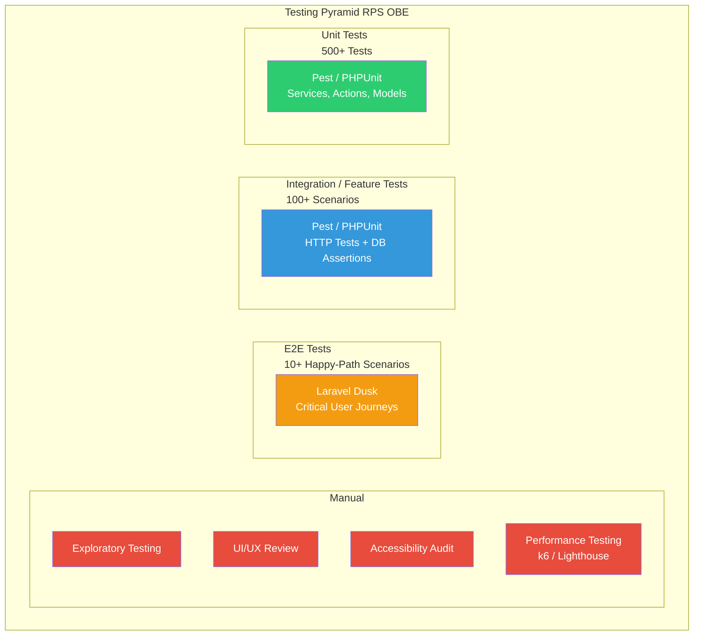
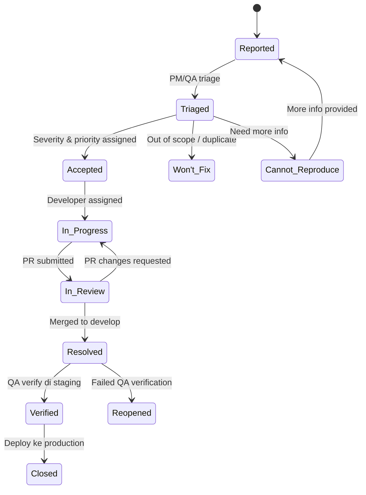

# 49 — Testing Strategy

## Ikhtisar

Dokumen ini mendefinisikan strategi pengujian menyeluruh untuk produk RPS OBE. Strategi mencakup testing pyramid (Unit, Integration, E2E, Manual), tingkat pengujian dan tools yang digunakan, kategori pengujian untuk setiap fitur, manajemen data pengujian, integrasi CI, lingkungan pengujian, serta proses triase bug. Strategi ini memastikan setiap komponen produk diuji secara sistematis sehingga kualitas rilis tetap tinggi dan risiko regresi minimal.

---

## Testing Pyramid

Testing pyramid mendeskripsikan proporsi ideal setiap jenis pengujian:



### Target Distribusi

| Jenis Pengujian | Jumlah Minimal | Target Coverage | Tools |
|-----------------|----------------|-----------------|-------|
| **Unit Tests** | 500+ | 80%+ code coverage (backend) | Pest / PHPUnit |
| **Integration / Feature Tests** | 100+ | 95%+ endpoint coverage | Pest / PHPUnit |
| **E2E Tests** | 10+ | 10 critical user journeys | Laravel Dusk |
| **Manual Tests** | Sesuai kebutuhan per rilis | Exploratory + review | Manual checklist |

---

## Testing Levels

### 1. Unit Tests (Pest / PHPUnit)

**Tujuan:** Memvalidasi unit logika terkecil secara terisolasi.

**Cakupan:**
- Semua Service classes (business logic)
- Semua Action classes (single-responsibility actions)
- Semua Model methods (accessors, mutators, scopes, relationships)
- Semua Helper / Utility functions
- Semua Value Objects dan DTOs
- Semua Enum dan konstanta
- Semua Validation rules kustom
- Semua Policy classes (authorization logic)
- Semua Middleware
- Semua Job classes (queue jobs)

**Target:** 80%+ code coverage untuk semua kode backend PHP.

**Konvensi Penulisan (menggunakan Pest):**

```php
// tests/Unit/Services/RpsBuilderServiceTest.php
<?php

use App\Services\RpsBuilderService;
use App\Models\Rps;
use App\Models\Cpl;
use App\Enums\RpsStatus;

beforeEach(function () {
    $this->service = new RpsBuilderService();
});

test('dapat membuat RPS draft baru', function () {
    $data = [
        'nama_mk' => 'Algoritma dan Pemrograman',
        'kode_mk' => 'TIF101',
        'sks' => 3,
        'semester' => 1,
    ];

    $rps = $this->service->create($data);

    expect($rps)->toBeInstanceOf(Rps::class)
        ->and($rps->status)->toBe(RpsStatus::Draft)
        ->and($rps->nama_mk)->toBe('Algoritma dan Pemrograman');
});

test('tidak dapat membuat RPS dengan kode MK yang sudah ada dalam tenant yang sama', function () {
    Rps::factory()->create(['kode_mk' => 'TIF101', 'tenant_id' => 1]);

    $this->service->create([
        'kode_mk' => 'TIF101',
        'tenant_id' => 1,
    ]);
})->throws(\Illuminate\Validation\ValidationException::class);

test('validasi SKS harus antara 1-6', function (int $invalidSks) {
    $this->service->create([
        'nama_mk' => 'Test',
        'kode_mk' => 'TIF999',
        'sks' => $invalidSks,
    ]);
})->with([0, 7, 10, -1])
  ->throws(\Illuminate\Validation\ValidationException::class);
```

**PHPUnit Annotations untuk Coverage:**

```php
// phpunit.xml
<source>
    <include>
        <directory suffix=".php">app</directory>
    </include>
    <exclude>
        <directory suffix=".php">app/Console</directory>
        <directory suffix=".php">app/Exceptions</directory>
        <directory suffix=".php">app/Providers</directory>
        <directory suffix=".php">app/Http/Middleware</directory>
    </exclude>
</source>
```

### 2. Feature / Integration Tests (Pest)

**Tujuan:** Memvalidasi interaksi antar komponen dan alur fitur end-to-end di sisi backend.

**Cakupan:**
- HTTP tests untuk semua API endpoint (GET, POST, PUT, PATCH, DELETE)
- Livewire component tests (jika menggunakan Livewire untuk antarmuka)
- Workflow state transition tests
- Database assertions (data tersimpan, data terhapus)
- Notification assertions (email terkirim, in-app notification terbuat)
- Queue job assertions (job di-dispatch)
- Event assertions (event di-dispatch)
- File generation tests (export Word/PDF)
- AI service mock tests (verifikasi prompt construction dan response parsing)

**Setiap endpoint harus memiliki minimal test:**
1. Happy path (200/201 dengan data valid)
2. Validasi input (422 dengan data tidak valid)
3. Autentikasi (401 tanpa token/session)
4. Otorisasi (403 dengan role salah)
5. Not found (404 untuk resource tidak ada)
6. Edge cases (data unik, limit, batas)

**Contoh Feature Test:**

```php
// tests/Feature/Api/RpsControllerTest.php
<?php

use App\Models\Rps;
use App\Models\User;
use App\Models\Tenant;
use App\Enums\RpsStatus;
use App\Enums\UserRole;

beforeEach(function () {
    $this->tenant = Tenant::factory()->create();
    $this->dosen = User::factory()
        ->withRole(UserRole::Dosen)
        ->forTenant($this->tenant)
        ->create();
});

describe('POST /api/rps', function () {
    test('dosen dapat membuat RPS baru', function () {
        $this->actingAs($this->dosen)
            ->postJson('/api/rps', [
                'nama_mk' => 'Basis Data',
                'kode_mk' => 'TIF201',
                'sks' => 3,
                'semester' => 3,
                'tenant_id' => $this->tenant->id,
            ])
            ->assertStatus(201)
            ->assertJsonPath('data.status', 'draft')
            ->assertJsonPath('data.nama_mk', 'Basis Data');

        $this->assertDatabaseHas('rps', [
            'kode_mk' => 'TIF201',
            'tenant_id' => $this->tenant->id,
            'created_by' => $this->dosen->id,
        ]);
    });

    test('mahasiswa tidak dapat membuat RPS', function () {
        $mahasiswa = User::factory()
            ->withRole(UserRole::Mahasiswa)
            ->forTenant($this->tenant)
            ->create();

        $this->actingAs($mahasiswa)
            ->postJson('/api/rps', [
                'nama_mk' => 'Test',
                'kode_mk' => 'TIF999',
                'sks' => 3,
                'semester' => 1,
                'tenant_id' => $this->tenant->id,
            ])
            ->assertStatus(403);
    });

    test('validasi field wajib', function () {
        $this->actingAs($this->dosen)
            ->postJson('/api/rps', [])
            ->assertStatus(422)
            ->assertJsonValidationErrors(['nama_mk', 'kode_mk', 'sks', 'semester', 'tenant_id']);
    });

    test('kode MK harus unik dalam satu tenant', function () {
        Rps::factory()->create([
            'kode_mk' => 'TIF201',
            'tenant_id' => $this->tenant->id,
        ]);

        $this->actingAs($this->dosen)
            ->postJson('/api/rps', [
                'nama_mk' => 'Basis Data',
                'kode_mk' => 'TIF201',
                'sks' => 3,
                'semester' => 3,
                'tenant_id' => $this->tenant->id,
            ])
            ->assertStatus(422)
            ->assertJsonValidationErrors(['kode_mk']);
    });
});

describe('Workflow RPS', function () {
    test('Dosen dapat submit RPS ke Kaprodi', function () {
        $rps = Rps::factory()
            ->draft()
            ->forTenant($this->tenant)
            ->create(['created_by' => $this->dosen->id]);

        $this->actingAs($this->dosen)
            ->patchJson("/api/rps/{$rps->id}/submit")
            ->assertStatus(200)
            ->assertJsonPath('data.status', RpsStatus::InReview->value);

        $this->assertDatabaseHas('rps', [
            'id' => $rps->id,
            'status' => RpsStatus::InReview,
        ]);
    });

    test('RPS yang belum lengkap tidak bisa di-submit', function () {
        $rps = Rps::factory()
            ->draft()
            ->incomplete()
            ->forTenant($this->tenant)
            ->create(['created_by' => $this->dosen->id]);

        $this->actingAs($this->dosen)
            ->patchJson("/api/rps/{$rps->id}/submit")
            ->assertStatus(422);
    });
});

describe('AI Validation Test', function () {
    test('AI validate endpoint mengembalikan hasil validasi', function () {
        Http::fake([
            'api.openai.com/*' => Http::response([
                'choices' => [
                    [
                        'message' => [
                            'content' => json_encode([
                                'alignment_score' => 85,
                                'suggestions' => ['Tambahkan CPMK yang mencakup ranah afektif'],
                            ]),
                        ],
                    ],
                ],
            ]),
        ]);

        $rps = Rps::factory()->forTenant($this->tenant)->create();

        $this->actingAs($this->dosen)
            ->postJson("/api/rps/{$rps->id}/ai-validate")
            ->assertStatus(200)
            ->assertJsonPath('data.alignment_score', 85);

        $this->assertDatabaseHas('ai_validations', [
            'rps_id' => $rps->id,
            'alignment_score' => 85,
        ]);
    });
});
```

### 3. Browser / E2E Tests (Laravel Dusk)

**Tujuan:** Memvalidasi alur pengguna kritis dari perspektif browser.

**Target:** 10+ happy-path tests untuk critical user journeys.

**Critical User Journeys yang Diuji:**

| No | Test Case | User Journey |
|----|-----------|--------------|
| 1 | **Login** | Buka halaman login → masukkan kredensial valid → redirect ke dashboard |
| 2 | **Complete RPS Wizard** | Login sebagai Dosen → buat RPS baru → isi semua step (1-8) → lihat preview → submit |
| 3 | **AI Generate CPMK** | Di step 2 RPS wizard → klik "Generate CPMK" → verifikasi hasil generasi → pilih dan simpan |
| 4 | **AI Validate RPS** | Di step 8 RPS wizard → klik "Validasi AI" → verifikasi hasil validasi muncul → perbaiki saran |
| 5 | **Review Workflow** | Dosen submit RPS → login sebagai Kaprodi → review RPS → approve dengan catatan → Dosen revisi → Kaprodi approve final |
| 6 | **Export Word** | Buka RPS published → klik Export → pilih template Word → verifikasi file terunduh |
| 7 | **Export PDF** | Buka RPS published → klik Export → pilih template PDF → verifikasi file terunduh |
| 8 | **User Management** | Login sebagai Admin Tenant → tambah user baru → assign role → verifikasi user muncul di list |
| 9 | **Master Data Management** | Login sebagai Admin → buka manajemen CPL → tambah CPL baru → edit → hapus |
| 10 | **Dashboard View** | Login sebagai Kaprodi → verifikasi dashboard menampilkan statistik RPS prodi |

**Konfigurasi Dusk:**

```php
// tests/Browser/Pages/RpsWizardTest.php
<?php

use App\Models\User;
use App\Models\Tenant;
use Laravel\Dusk\Browser;
use App\Enums\UserRole;

test('dosen dapat menyelesaikan RPS wizard lengkap', function () {
    $tenant = Tenant::factory()->create();
    $dosen = User::factory()
        ->withRole(UserRole::Dosen)
        ->forTenant($tenant)
        ->create();

    $this->browse(function (Browser $browser) use ($dosen) {
        $browser->loginAs($dosen)
            ->visit('/rps/create')
            ->assertSee('RPS Builder')
            // Step 1: Informasi Mata Kuliah
            ->type('nama_mk', 'Algoritma dan Pemrograman')
            ->type('kode_mk', 'TIF101')
            ->select('sks', '3')
            ->select('semester', '1')
            ->press('Selanjutnya')
            // Step 2: CPL dan CPMK
            ->waitForText('Captaian Pembelajaran Lulusan')
            ->assertSee('CPL')
            ->press('Selanjutnya')
            // Step 3-7: Isi semua step
            // ...
            // Step 8: Preview dan Submit
            ->waitForText('Preview RPS')
            ->press('Submit RPS')
            ->waitForText('RPS berhasil disubmit')
            ->assertSee('In Review');
    });
});

test('export Word menghasilkan file yang dapat diunduh', function () {
    // ...setup RPS published...
    $this->browse(function (Browser $browser) use ($rps) {
        $browser->loginAs($this->kaprodi)
            ->visit("/rps/{$rps->id}")
            ->click('@export-word-button')
            ->waitForDialog(10)
            ->assertDialogOpened('File Word berhasil diunduh');
    });
});
```

### 4. Manual Testing

#### a. Exploratory Testing

Dilakukan pada setiap rilis oleh QA dan sesekali oleh developer.

| Area Eksplorasi | Durasi Sesi | Frekuensi |
|-----------------|-------------|-----------|
| RPS Builder (semua step) | 90 menit | Setiap rilis minor |
| Workflow review/approval | 60 menit | Setiap rilis minor |
| AI features | 60 menit | Setiap rilis dengan perubahan AI |
| Export (Word/PDF) | 45 menit | Setiap rilis |
| Multi-tenant isolation | 30 menit | Setiap rilis major |

**Teknik Exploratory Testing:**
- Session-Based Test Management (SBTM)
- Charter-based exploration
- Dokumentasi temuan dengan screenshot dan langkah reproduksi

#### b. UI/UX Review

| Area Review | Checklist | Alat Bantu |
|-------------|-----------|------------|
| Konsistensi desain | Font, warna, spacing, icon, button style | Figma desain |
| Responsivitas | Desktop (1920, 1440, 1366), Tablet (1024, 768), Mobile (375, 414) | Chrome DevTools |
| Loading state | Skeleton loader, spinner, empty state | Manual inspeksi |
| Error state | Error message, retry button, fallback UI | Manual inspeksi |
| Interaksi | Transition, animation, hover, focus, active state | Manual inspeksi |

#### c. Accessibility Audit

| Kriteria | Standar | Metode |
|----------|---------|--------|
| Keyboard navigation | WCAG 2.1 Level AA | Tab navigasi manual |
| Screen reader compatibility | WCAG 2.1 Level AA | NVDA / VoiceOver |
| Warna dan kontras | Minimum contrast ratio 4.5:1 | axe DevTools / Lighthouse |
| Form labeling | Semua input memiliki label yang terasosiasi | axe DevTools |
| ARIA attributes | Semua komponen interaktif memiliki ARIA yang sesuai | Manual + axe DevTools |
| Skip navigation | Tersedia skip link | Manual |

#### d. Performance Testing

| Tool | Pengujian | Target | Frekuensi |
|------|-----------|--------|-----------|
| **k6** | Load testing endpoint API kritis | < 500ms p95 response time under 100 concurrent users | Setiap rilis major |
| **Lighthouse** | Audit performa halaman utama | Score >= 90 (Performance) | Setiap rilis |
| **Laravel Debugbar** | Query count dan N+1 detection | Maks 10 query per halaman | Development |

**Contoh k6 Script:**

```javascript
// k6-load-test.js
import http from 'k6/http';
import { check } from 'k6';

export const options = {
    stages: [
        { duration: '1m', target: 20 },  // Ramp up
        { duration: '3m', target: 100 }, // Sustained load
        { duration: '1m', target: 0 },   // Ramp down
    ],
    thresholds: {
        http_req_duration: ['p95<500'],
        http_req_failed: ['rate<0.01'],
    },
};

export default function () {
    const res = http.get('https://staging.rpsobe.id/api/health');
    check(res, { 'status is 200': (r) => r.status === 200 });
}
```

---

## Test Categories

### 1. Authentication Tests

| Test Cases | Jenis |
|------------|-------|
| Login dengan kredensial valid | Unit + Feature |
| Login dengan kredensial tidak valid | Feature |
| Register tenant baru + user admin | Feature |
| Password reset (forgot + reset) | Feature |
| SSO login (SAML/OIDC) | Feature + E2E |
| Rate limiting (max login attempts) | Feature |
| Session expiration | Feature |
| Role-based access untuk setiap endpoint | Feature |

### 2. CRUD Operation Tests

| Test Cases | Jenis |
|------------|-------|
| Create, read, update, delete untuk setiap master data (CPL, CPMK, Sub-CPMK, Mata Kuliah, Program Studi, Fakultas) | Feature |
| Duplicate entry handling (kode unik) | Unit + Feature |
| Soft delete dan restore | Feature |
| Pagination dan filtering | Feature |
| Bulk operations (jika ada) | Feature |
| Validasi input (required, format, length, tipe data) | Feature |

### 3. RPS Builder Tests

| Test Cases | Jenis |
|------------|-------|
| Membuat RPS baru (semua step) | Feature + E2E |
| Validasi setiap step (field wajib, format) | Unit + Feature |
| Auto-save setiap step ke database | Feature |
| Navigasi antar step (Next, Previous, Step indicator) | Feature + E2E |
| Menyimpan draft (partial RPS) | Feature |
| Resume draft yang belum selesai | Feature |
| Preview RPS lengkap (semua step) | Feature + E2E |
| Duplicate RPS dari yang sudah ada | Feature |
| Duplicate RPS: CPL/CPMK ikut terduplikasi tetapi bisa diubah | Feature |
| Status update (Draft → In Review → Revisi → Approved → Published) | Feature |

### 4. Workflow Tests

| Test Cases | Jenis |
|------------|-------|
| State transition yang valid (Draft → In Review → ... → Published) | Feature |
| State transition yang tidak valid (Draft → Published langsung) | Feature |
| Permission check setiap transisi (Dosen tidak bisa approve) | Feature |
| Review dengan catatan dari Kaprodi | Feature |
| Revisi oleh Dosen setelah review | Feature |
| Approval oleh Kaprodi | Feature |
| Publish oleh Admin | Feature |
| Audit trail setiap transisi status (log) | Feature |
| Notifikasi setiap transisi (email + in-app) | Feature |

### 5. AI Tests

| Test Cases | Jenis |
|------------|-------|
| **AI Generate CPMK:** Prompt construction benar, parsing response valid | Unit |
| **AI Generate Sub-CPMK:** Prompt construction benar, context dari CPMK disertakan | Unit |
| **AI Generate Assessment:** Format dan taksonomi Bloom sesuai | Unit |
| **AI Generate Materi:** Keluaran materi relevan dengan CPMK | Unit |
| **AI Generate Referensi:** Referensi sesuai bidang dan terbaru | Unit |
| **AI Validate:** Validasi alignment CPL-CPMK-Sub-CPMK | Unit + Feature |
| **AI Review:** Review konten RPS (saran perbaikan) | Unit + Feature |
| Error handling: OpenAI API timeout | Feature |
| Error handling: OpenAI API rate limit | Feature |
| Error handling: response tidak valid (parsing error) | Feature |
| Caching hasil AI untuk request yang sama | Feature |
| Token usage tracking (log) | Feature |

**Mocking OpenAI API:**

```php
// tests/Feature/Ai/AiGenerateTest.php
test('AI Generate CPMK mengirimkan prompt yang benar ke OpenAI', function () {
    Http::fake([
        'api.openai.com/v1/chat/completions' => function (Request $request) {
            $body = json_decode($request->body(), true);
            
            // Verifikasi prompt construction
            expect($body['messages'][0]['content'])
                ->toContain('CPL')
                ->toContain('Bloom')
                ->toContain('KKO');
            
            return Http::response([
                'choices' => [
                    ['message' => ['content' => json_encode(['cpmk' => ['CPMK 1: ...']])]],
                ],
                'usage' => [
                    'prompt_tokens' => 150,
                    'completion_tokens' => 50,
                    'total_tokens' => 200,
                ],
            ]);
        },
    ]);

    $response = $this->actingAs($this->dosen)
        ->postJson('/api/rps/1/ai-generate', ['type' => 'cpmk'])
        ->assertStatus(200);

    // Verifikasi token usage di-log
    $this->assertDatabaseHas('ai_usage_logs', [
        'type' => 'generate_cpmk',
        'total_tokens' => 200,
    ]);
});

test('AI Generate menangani response OpenAI yang tidak valid', function () {
    Http::fake([
        'api.openai.com/*' => Http::response('Invalid JSON response', 200),
    ]);

    $this->actingAs($this->dosen)
        ->postJson('/api/rps/1/ai-generate', ['type' => 'cpmk'])
        ->assertStatus(500)
        ->assertJsonPath('message', 'Gagal memproses hasil AI. Silakan coba lagi.');
});
```

### 6. Export Tests

| Test Cases | Jenis |
|------------|-------|
| Export Word: struktur file benar (heading, tabel, paragraf) | Feature |
| Export Word: data RPS termuat lengkap (semua field) | Feature |
| Export Word: template benar (header/footer, logo, font) | Feature |
| Export PDF: file ter-generate dengan benar | Feature |
| Export PDF: format dan layout sesuai template | Feature |
| Export: RPS yang belum lengkap tidak bisa di-export | Feature |
| Export: placeholder template terisi dengan data aktual | Feature |
| Export: file tidak corrupt (verifikasi ukuran file > 0) | Feature |
| Export: nama file sesuai konvensi (`{KodeMK}_{NamaMK}_RPS.docx`) | Feature |
| Export: error handling jika template rusak/hilang | Feature |

### 7. Notification Tests

| Test Cases | Jenis |
|------------|-------|
| Email: pengiriman email berhasil (verifikasi via Mail::fake()) | Feature |
| Email: konten email sesuai template | Feature |
| Email: link di email valid dan dapat diklik | Feature |
| In-App Notification: notifikasi terbuat di database | Feature |
| In-App Notification: notifikasi tampil di UI (via Livewire test) | Feature |
| In-App Notification: mark as read berfungsi | Feature |
| In-App Notification: badge count di navbar terupdate | Feature |
| Rate limiting: tidak spam notifikasi untuk event yang sama | Feature |

---

## Test Data Management

### Factories

Setiap model Eloquent memiliki factory untuk menghasilkan data pengujian:

```php
// database/factories/RpsFactory.php
class RpsFactory extends Factory
{
    public function definition(): array
    {
        return [
            'nama_mk' => fake()->sentence(3),
            'kode_mk' => 'TIF' . fake()->unique()->numberBetween(100, 999),
            'sks' => fake()->randomElement([1, 2, 3, 4, 6]),
            'semester' => fake()->numberBetween(1, 8),
            'deskripsi_mk' => fake()->paragraph(),
            'status' => RpsStatus::Draft,
            'tenant_id' => Tenant::factory(),
            'created_by' => User::factory(),
        ];
    }

    public function draft(): static
    {
        return $this->state(fn () => ['status' => RpsStatus::Draft]);
    }

    public function published(): static
    {
        return $this->state(fn () => [
            'status' => RpsStatus::Published,
            'published_at' => now(),
            'published_by' => User::factory(),
        ]);
    }

    public function incomplete(): static
    {
        return $this->state(fn () => [
            'deskripsi_mk' => null,
            'sks' => null,
        ]);
    }
}
```

### Seeders

```php
// database/seeders/TestDataSeeder.php (hanya untuk local & staging)
class TestDataSeeder extends Seeder
{
    public function run(): void
    {
        if (app()->environment('production')) {
            return; // Jangan pernah seed data di production
        }

        $this->call([
            DemoUniversitySeeder::class,
            DemoFakultasSeeder::class,
            DemoProdiSeeder::class,
            DemoCplSeeder::class,
            DemoDosenSeeder::class,
            DemoRpsSeeder::class,
        ]);
    }
}
```

### Tenant Isolation in Tests

```php
// tests/Pest.php
uses(RefreshDatabase::class)->in('Feature');

// Gunakan trait untuk tenant isolation
trait WithTenant
{
    protected Tenant $tenant;
    protected User $adminTenant;

    protected function setUpTenant(): void
    {
        $this->tenant = Tenant::factory()->create();
        $this->adminTenant = User::factory()
            ->withRole(UserRole::AdminTenant)
            ->forTenant($this->tenant)
            ->create();
        tenancy()->initialize($this->tenant);
    }
}
```

---

## CI Integration

### Test Triggers

| Event | Unit Tests | Feature Tests | E2E Tests | Security Scan |
|-------|-----------|---------------|-----------|---------------|
| Pull Request ke develop/main | Ya | Ya | Tidak | Ya |
| Push ke develop | Ya | Ya | Tidak | Ya |
| Push ke main | Ya | Ya | Ya | Ya |
| Jadwal (harian) | Ya | Ya | Ya | Ya |
| Manual trigger | Ya | Ya | Ya | Ya |

### CI Test Matrix

```yaml
# .github/workflows/test-matrix.yml
jobs:
  test:
    runs-on: ubuntu-latest
    strategy:
      matrix:
        php: ['8.2']
        test-type: [Unit, Feature]
      fail-fast: false  # Jangan batalkan semua jika satu gagal
    
    steps:
      - uses: actions/checkout@v4
      - name: Run ${{ matrix.test-type }} Tests
        run: php artisan test --testsuite=${{ matrix.test-type }} --parallel
```

### Test Reports

Output test menghasilkan:
- **Console output:** Ringkasan pass/fail di CI log
- **JUnit XML:** `phpunit.xml` untuk integrasi dengan CI dashboard
- **Coverage HTML:** Laporan code coverage di artifacts (untuk review)
- **Coverage Check:** CI gagal jika coverage < 80%

```bash
php artisan test --coverage-html=coverage --min=80
```

---

## Test Environment

### Konfigurasi Test Environment

```dotenv
# .env.testing
APP_ENV=testing
APP_DEBUG=true
APP_KEY=base64:test-key-for-testing-only

DB_CONNECTION=sqlite
DB_DATABASE=:memory:

# Atau gunakan MySQL test database terpisah
# DB_CONNECTION=mysql_test
# DB_DATABASE=rps_obe_test

QUEUE_CONNECTION=sync
MAIL_MAILER=log
FILESYSTEM_DISK=local
OPENAI_API_KEY=sk-test-key

SCOUT_DRIVER=null       # Nonaktifkan search indexing
SENTRY_LARAVEL_DSN=null # Nonaktifkan error tracking
TELESCOPE_ENABLED=false  # Nonaktifkan debugging
```

### Test Database

| Environment | Database | Strategy |
|-------------|----------|----------|
| Local | SQLite in-memory atau MySQL `rps_obe_test` | RefreshDatabase trait (migrate + transaksi rollback otomatis) |
| CI | MySQL 8.0 Docker service | RefreshDatabase dengan migrasi penuh |
| Staging | MySQL `rps_obe_staging_test` | Data terpisah dari data staging |
| Production | **TIDAK ADA** — tidak boleh menjalankan test di production | |

### Test Isolation Strategy

```php
// phpunit.xml
<php>
    <env name="DB_CONNECTION" value="sqlite"/>
    <env name="DB_DATABASE" value=":memory:"/>
    <env name="QUEUE_CONNECTION" value="sync"/>
    <env name="MAIL_MAILER" value="array"/>
    <env name="CACHE_DRIVER" value="array"/>
    <env name="SCOUT_DRIVER" value="null"/>
</php>
```

---

## Bug Triage Process

### Severity Levels

| Level | Nama | Definisi | Contoh |
|-------|------|----------|--------|
| **P0** | Critical / Blocker | Sistem tidak bisa digunakan; data corruption; keamanan tertembus; tidak ada workaround | Aplikasi down, kebocoran data, transaksi gagal total, export rusak untuk semua user |
| **P1** | High | Fitur utama rusak; ada workaround yang tidak praktis; mengganggu sebagian besar user | RPS Builder tidak bisa submit, AI generate error, workflow approval macet |
| **P2** | Medium | Bug mengganggu tapi ada workaround sederhana; fitur non-kritis rusak; penurunan performa | Filter dashboard tidak berfungsi, notifikasi terlambat, error minor di ekspor |
| **P3** | Low | Bug kosmetik; typo; UI minor; tidak memengaruhi fungsionalitas | Warna tombol salah, teks tidak sesuai, alignment form |
| **P4** | Trivial / Enhancement | Perbaikan kecil yang tidak mendesak; request improvement minor | Tooltip tambahan, perbaikan wording, spacing adjustment |

### SLA (Service Level Agreement) untuk Perbaikan Bug

| Level | Response Time | Resolution Time | Escalation |
|-------|--------------|-----------------|------------|
| **P0** | < 15 menit | < 4 jam | Otomatis ke Tech Lead + Product Manager |
| **P1** | < 1 jam | < 24 jam | Jika > 4 jam, escalate ke Tech Lead |
| **P2** | < 4 jam | < 72 jam (3 hari) | Jika > 24 jam, escalate ke Product Manager |
| **P3** | < 24 jam | < 2 minggu (sprint berikutnya) | Tidak perlu escalation |
| **P4** | < 48 jam | Backlog (diprioritaskan Product Manager) | Tidak perlu escalation |

### Bug Lifecycle



### Defect Metrics

Metrik bug yang dilacak:

| Metrik | Target |
|--------|--------|
| Bug Escape Rate (bug ditemukan di production / total bug) | < 10% |
| P0 bugs per rilis | 0 |
| P1 bugs per rilis | < 3 |
| Mean Time to Detect (MTTD) — P0 | < 5 menit |
| Mean Time to Resolve (MTTR) — P0 | < 4 jam |
| Mean Time to Resolve (MTTR) — P1 | < 24 jam |
| Bug Reopen Rate | < 5% |

---

## Testing Governance

### Review dan Approval

| Artifak | Reviewer | Persetujuan Final |
|---------|----------|-------------------|
| Test Plan per rilis | QA Lead | Tech Lead + Product Manager |
| Unit tests | Developer (peer review via PR) | Tech Lead |
| Feature tests | QA Engineer | QA Lead |
| E2E test scripts | QA Lead | Tech Lead |
| QA Sign-off | QA Lead | Product Manager |

### Code Coverage Thresholds

| Komponen | Minimum Coverage |
|----------|-----------------|
| Service classes | 90% |
| Action classes | 90% |
| Model methods | 80% |
| Policy classes | 90% |
| Middleware | 85% |
| Validation rules | 85% |
| API Controllers | 80% |
| Overall Backend | 80% |

### Test Documentation

Setiap rilis harus mencakup:

1. **Test Plan** — dokumen yang menjelaskan apa yang akan diuji dan bagaimana
2. **Test Cases** — daftar test cases yang dijalankan (automated + manual)
3. **Test Report** — hasil pengujian (pass/fail, bugs ditemukan, coverage)
4. **QA Sign-off** — tanda tangan persetujuan dari QA Lead

---

**Navigasi:** [Sebelumnya: Deployment Strategy](48-deployment-strategy.md) | [Daftar Isi](../README.md) | [Berikutnya: Appendix](50-appendix.md)
